# BACKEND PIPELINE — Giải phẫu toàn bộ một lần khởi động hệ thống

### Từ `run-backend.bat` đến `http://localhost:8080/actuator/health` trả về `UP`

> **Tài liệu tham chiếu kỹ thuật đầy đủ.**
> Mỗi dòng, mỗi nhãn `goto`, mỗi biến môi trường, mỗi nhánh `if` mà lệnh trên chạm
> tới — theo đúng thứ tự thực thi, kèm sơ đồ Mermaid, bảng đối chiếu và số liệu
> thật lấy từ `docker-compose.yml`.

**Quy ước ký hiệu**

| Ký hiệu | Nghĩa |
|---|---|
| **Tệp:** `run-backend.bat:123` | Số dòng trong tệp ở THƯ MỤC GỐC của kho |
| **Nhãn:** `:launch` | Chương trình con trong tệp bat, gọi bằng `call :launch` |
| ① ② ③ | Số thứ tự bước trong một chuỗi xử lý |
| ★ | Điểm mấu chốt, dễ hiểu sai |
| ⚠ | Cạm bẫy đã từng gây lỗi thật |
| ↺ | Vòng lặp chờ (polling loop) |
| 🔒 | Điểm chặn bắt buộc — không qua được thì tệp dừng hẳn |

**Hai đường chạy, một tệp bat**

Tài liệu này mô tả **hai** đường thực thi hoàn toàn khác nhau nằm trong cùng một
tệp. Đọc nhầm đường là hiểu sai mọi thứ phía sau:

| | Đường **Docker** (mặc định) | Đường **`--local`** |
|---|---|---|
| Lệnh | `run-backend.bat` | `run-backend.bat --local` |
| Service chạy ở đâu | Container | Tiến trình Windows |
| Trần RAM | `mem_limit` của compose | chỉ `-Xmx` do bat truyền |
| Hạ tầng | Container, cùng lệnh `up` | Container, bật riêng 3 cái |
| Nhãn xử lý | `:docker_path` → hết | dòng thẳng, không rẽ |

---

## MỤC LỤC

### PHẦN I — TỔNG QUAN
- [1. Câu lệnh và ý nghĩa từng tham số](#1-câu-lệnh-và-ý-nghĩa-từng-tham-số)
- [2. Bản đồ toàn hệ thống](#2-bản-đồ-toàn-hệ-thống)
- [3. Danh mục toàn bộ file tham gia](#3-danh-mục-toàn-bộ-file-tham-gia)
- [4. Sơ đồ tuần tự tổng quát](#4-sơ-đồ-tuần-tự-tổng-quát)
- [5. Vòng đời của một lần chạy — máy trạng thái các nhãn](#5-vòng-đời-của-một-lần-chạy--máy-trạng-thái-các-nhãn)
- [6. Vòng đời của một service — từ mã nguồn tới cổng lắng nghe](#6-vòng-đời-của-một-service--từ-mã-nguồn-tới-cổng-lắng-nghe)
- [7. Sáu hàng rào chặn khởi động sai](#7-sáu-hàng-rào-chặn-khởi-động-sai)

### PHẦN II — TẦNG 0: PHÂN TÍCH THAM SỐ
- [8. `@echo off`, `setlocal`, `ROOT`, `ENV_FILE`](#8-echo-off-setlocal-root-env_file)
- [9. Vì sao phải `chcp 65001` và vì sao phải trả lại](#9-vì-sao-phải-chcp-65001-và-vì-sao-phải-trả-lại)
- [10. Vòng `:parse` — mười một nhánh](#10-vòng-parse--mười-một-nhánh)
- [11. ★ Ma trận cờ × đường chạy: cờ nào bị bỏ qua ở đâu](#11--ma-trận-cờ--đường-chạy-cờ-nào-bị-bỏ-qua-ở-đâu)
- [12. Kiểm tra "đang đứng đúng thư mục gốc"](#12-kiểm-tra-đang-đứng-đúng-thư-mục-gốc)

### PHẦN III — BÍ MẬT VÀ TỆP `.env`
- [13. `ADMIN_API_KEY` — ba nguồn theo thứ tự ưu tiên](#13-admin_api_key--ba-nguồn-theo-thứ-tự-ưu-tiên)
- [14. Sinh khoá: `RandomNumberGenerator` chứ không `Get-Random`](#14-sinh-khoá-randomnumbergenerator-chứ-không-get-random)
- [15. ★ `%ADMIN_API_KEY:~15,1%` — đo độ dài bằng batch](#15--admin_api_key151--đo-độ-dài-bằng-batch)
- [16. `BOOTSTRAP_ADMIN_PASSWORD` và `BOOTSTRAP_ADMIN_USERNAME`](#16-bootstrap_admin_password-và-bootstrap_admin_username)
- [17. ⚠ Cách `.env` được đọc và bốn cạm bẫy của nó](#17--cách-env-được-đọc-và-bốn-cạm-bẫy-của-nó)

### PHẦN IV — ĐƯỜNG DOCKER (MẶC ĐỊNH)
- [18. `:docker_path` — đọc từng dòng](#18-docker_path--đọc-từng-dòng)
- [19. Ba hồ sơ của compose: `crawler`, `monitoring`, `kafka`](#19-ba-hồ-sơ-của-compose-crawler-monitoring-kafka)
- [20. `up -d --build` — vì sao luôn có `--build`](#20-up--d---build--vì-sao-luôn-có---build)
- [21. Bảng service ↔ cổng ↔ `mem_limit` ↔ healthcheck](#21-bảng-service--cổng--mem_limit--healthcheck)
- [22. ★ Một cổng duy nhất và một mạng riêng](#22--một-cổng-duy-nhất-và-một-mạng-riêng)
- [23. Compose lấy biến môi trường từ đâu](#23-compose-lấy-biến-môi-trường-từ-đâu)
- [24. Ngân sách RAM — cộng lại từng con số](#24-ngân-sách-ram--cộng-lại-từng-con-số)

### PHẦN V — ĐƯỜNG `--local`
- [25. Kiểm Java và Go](#25-kiểm-java-và-go)
- [26. `:need_jar` và `mvnw clean package -DskipTests`](#26-need_jar-và-mvnw-clean-package--dskiptests)
- [27. `go build -o bin` — bốn binary một lệnh](#27-go-build--o-bin--bốn-binary-một-lệnh)
- [28. `:check_port` — chín cổng phải trống](#28-check_port--chín-cổng-phải-trống)
- [29. Bảng biến môi trường ép về `localhost`](#29-bảng-biến-môi-trường-ép-về-localhost)
- [30. ★ Hạ `APP_CRAWLER_BUS` từ `kafka` về `memory`](#30--hạ-app_crawler_bus-từ-kafka-về-memory)
- [31. Mật khẩu CSDL kế thừa `POSTGRES_PASSWORD`](#31-mật-khẩu-csdl-kế-thừa-postgres_password)
- [32. `:need_infra` — tự bật Postgres/Redis/Mongo, tự mở Docker Desktop](#32-need_infra--tự-bật-postgresredismongo-tự-mở-docker-desktop)
- [33. `:wait_health` — đọc `.State.Health.Status`](#33-wait_health--đọc-statehealthstatus)
- [34. ★ `:launch` — công thức `-Xmx` và hai bộ dọn rác](#34--launch--công-thức--xmx-và-hai-bộ-dọn-rác)
- [35. `:launch_go` — bốn binary Go](#35-launch_go--bốn-binary-go)
- [36. Chạy ngầm bằng `Start-Process` và tệp log](#36-chạy-ngầm-bằng-start-process-và-tệp-log)
- [37. ↺ Đợi `api-gateway` trả lời](#37--đợi-api-gateway-trả-lời)

### PHẦN VI — SAU KHI HỆ THỐNG ĐÃ LÊN
- [38. Bảng địa chỉ in ra cuối cùng](#38-bảng-địa-chỉ-in-ra-cuối-cùng)
- [39. Tự mở giao diện: `run-frontend.bat`](#39-tự-mở-giao-diện-run-frontendbat)
- [40. Đường tắt: `end-backend.bat`](#40-đường-tắt-end-backendbat)

### PHẦN VII — ĐỐI CHIẾU SỐ LIỆU THẬT
- [41. Bảng `-Xmx` (local) ↔ `mem_limit` (docker)](#41-bảng--xmx-local--mem_limit-docker)
- [42. Vì sao `search-service` là 2560 MB](#42-vì-sao-search-service-là-2560-mb)
- [43. Vì sao `crawler-service` bị đẩy ra sau hồ sơ riêng](#43-vì-sao-crawler-service-bị-đẩy-ra-sau-hồ-sơ-riêng)
- [44. ⚠ Bảy khác biệt còn lại giữa hai đường chạy](#44--bảy-khác-biệt-còn-lại-giữa-hai-đường-chạy)

### PHẦN VIII — PHỤ LỤC
- [45. Bảng hằng số toàn tệp](#45-bảng-hằng-số-toàn-tệp)
- [46. Bảng tra nhanh nhãn ↔ việc](#46-bảng-tra-nhanh-nhãn--việc)
- [47. Câu hỏi thường gặp](#47-câu-hỏi-thường-gặp)
- [48. Chẩn đoán sự cố](#48-chẩn-đoán-sự-cố)
- [49. Thuật ngữ](#49-thuật-ngữ)
- [50. Toàn cảnh một trang](#50-toàn-cảnh-một-trang)

### PHẦN IX — KHÔNG DÙNG `run-backend.bat`
- [51. Bốn cách chạy tay và chọn cách nào](#51-bốn-cách-chạy-tay-và-chọn-cách-nào)
- [52. Bước 0 — hạ tầng, luôn phải có trước](#52-bước-0--hạ-tầng-luôn-phải-có-trước)
- [53. Bước 1 — hai bí mật, đặt bằng tay](#53-bước-1--hai-bí-mật-đặt-bằng-tay)
- [54. Cách B — chạy jar Java bằng tay](#54-cách-b--chạy-jar-java-bằng-tay)
- [55. Cách C — chạy bằng Maven, không cần đóng gói jar](#55-cách-c--chạy-bằng-maven-không-cần-đóng-gói-jar)
- [56. Chạy từng service Go](#56-chạy-từng-service-go)
- [57. Cách A — bật từng container lẻ](#57-cách-a--bật-từng-container-lẻ)
- [58. Thứ tự khởi động và cách kiểm từng bước](#58-thứ-tự-khởi-động-và-cách-kiểm-từng-bước)
- [59. Bảng "tôi chỉ muốn chạy X"](#59-bảng-tôi-chỉ-muốn-chạy-x)
- [60. Tắt tay từng service](#60-tắt-tay-từng-service)
- [61. Bảng đối chiếu: tệp bat làm gì mà tay phải tự làm](#61-bảng-đối-chiếu-tệp-bat-làm-gì-mà-tay-phải-tự-làm)

---
---

# PHẦN I — TỔNG QUAN

---

## 1. Câu lệnh và ý nghĩa từng tham số

```bat
run-backend.bat
```

Không tham số nào cả — và đó là dạng được dùng nhiều nhất. Toàn bộ ý nghĩa nằm ở
sáu biến được đặt sẵn trước vòng `:parse`:

### 1.1 Bảng giá trị mặc định

| Biến | Mặc định | Nghĩa khi bật | Đặt ở dòng |
|---|---|---|---|
| `MODE` | `full` | `full` = 4 Java + 4 Go; `core` = 3 Java | `run-backend.bat:7` |
| `USE_DOCKER` | `1` | Chạy bằng container | `run-backend.bat:13` |
| `FORCE_BUILD` | *(trống)* | Dựng lại jar trước khi chạy | `run-backend.bat:14` |
| `SHOW_WINDOWS` | *(trống)* | Mỗi service một cửa sổ console | `run-backend.bat:15` |
| `NO_FRONTEND` | *(trống)* | Không mở giao diện Electron | `run-backend.bat:16` |
| `WITH_CRAWLER` | *(trống)* | Thêm `crawler-service :8083` | `run-backend.bat:17` |
| `MONITORING` | *(trống)* | Thêm Prometheus/Grafana/Alertmanager | `run-backend.bat:18` |

★ **`USE_DOCKER=1` là mặc định, và đó là một quyết định về bộ nhớ, không phải về
tiện lợi.** Chú thích ngay tại chỗ (`run-backend.bat:8-12`) nói rõ: đường chạy jar
thẳng trong tiến trình Windows **không có trần bộ nhớ nào cả** nếu không truyền
`-Xmx` — JVM tự lấy 1/4 RAM máy làm heap tối đa, và `search-service` từng đo được
3 GB cho một corpus 500 MB. Trong container thì `mem_limit` của compose mới là
trần thật sự.

### 1.2 Tám cờ và tác dụng thật của chúng

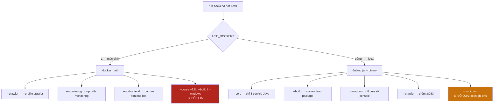

### 1.3 Hai cờ chỉ tồn tại vì tương thích ngược

| Cờ | Làm gì | Vì sao còn giữ |
|---|---|---|
| `--docker` | `set "USE_DOCKER=1"` — đã là mặc định | Lệnh cũ trong ghi chú, README, thói quen gõ tay không báo "tham số không hiểu" |
| `--no-crawler` | `set "WITH_CRAWLER="` — đã là mặc định | Như trên; trước đây crawler chạy mặc định nên cờ này có tác dụng thật |

⚠ Một tham số lạ **không** bị bỏ qua: nhánh `else` cuối vòng `:parse` in
`[LỖI] Tham số không hiểu` rồi `goto :usage_fail`, và `:usage_fail` kết thúc bằng
`exit /b 1`. Gõ sai một cờ thì không có gì được khởi động cả.

### 1.4 Bốn lệnh hay dùng nhất

```bat
run-backend.bat                     :: mặc định — toàn hệ thống trong container
run-backend.bat --local             :: jar + binary chạy thẳng, dễ gắn debugger
run-backend.bat --local --build     :: dựng lại jar rồi chạy thẳng
run-backend.bat --crawler --monitoring   :: đủ cả crawler lẫn Grafana, trần 7520 MB
```

---

## 2. Bản đồ toàn hệ thống

### 2.1 Đường Docker — cái gì lên, cái gì không

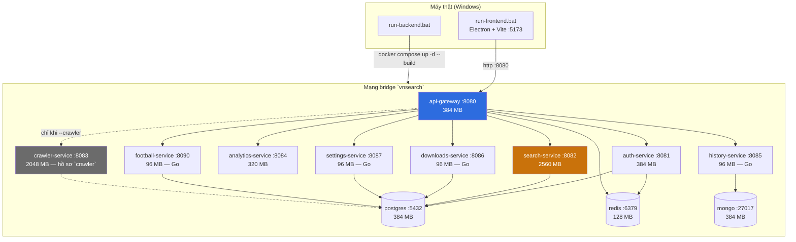

★ Chỉ **`api-gateway`** có khối `ports:` trỏ ra máy thật (`8080:8080`). Tám service
còn lại không mở cổng nào — chúng chỉ với tới được từ bên trong mạng `vnsearch`.
Chi tiết ở [mục 22](#22--một-cổng-duy-nhất-và-một-mạng-riêng).

### 2.2 Đường `--local` — ai nằm ở đâu

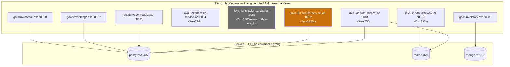

★ Khác biệt cốt lõi: ở đường này **không có `mem_limit`**. Trần duy nhất là chuỗi
`-Xmx` mà `:launch` truyền vào, cộng ba trần ngoài heap
(`MaxMetaspaceSize`, `ReservedCodeCacheSize`, `Xss`). Bốn binary Go không có trần
nào cả — nhưng một tiến trình Go tĩnh ở đây đo được vài chục MB, nên điều đó
không thành vấn đề.

### 2.3 Ba đường vào cùng một hệ thống

```
run-backend.bat                → Docker Compose, toàn hệ thống      ← MẶC ĐỊNH
run-backend.bat --local        → jar + binary trên Windows          ← gỡ lỗi
docker compose up -d           → giống đường 1 nhưng KHÔNG có phần sinh khoá,
                                 nên `${ADMIN_API_KEY:?}` sẽ chặn nếu chưa có .env
```

---

## 3. Danh mục toàn bộ file tham gia

### 3.1 Tệp kịch bản ở thư mục gốc — 5 tệp

| Tệp | Vai trò | Dòng | Được gọi bởi |
|---|---|---|---|
| `run-backend.bat` | **Chủ đề của tài liệu này** | 663 | người dùng |
| `run-frontend.bat` | Electron + Vite, cổng 5173 | 111 | `run-backend.bat` (trừ khi `--no-frontend`) |
| `end-backend.bat` | Tắt hết, trả RAM cho Windows | 300+ | người dùng |
| `run-crawl.bat` | Phiên crawl — xem `CRAWLER-PIPELINE.md` | — | người dùng |
| `crawl-stats.bat` | Đo kích thước corpus | — | người dùng |

### 3.2 Tệp cấu hình mà tệp bat đọc hoặc ghi

| Tệp | Đọc | Ghi | Ghi chú |
|---|---|---|---|
| `.env` | ✓ | ✓ | `ADMIN_API_KEY`, `BOOTSTRAP_ADMIN_*`; `.gitignore` chặn |
| `docker-compose.yml` | ✓ | | Chỉ kiểm tra tồn tại + `docker compose` đọc |
| `backend/java/pom.xml` | ✓ | | Chỉ kiểm tra tồn tại |
| `.gitattributes` | | | Không đọc, nhưng **quyết định tệp bat có chạy nổi không** — xem [mục 9](#9-vì-sao-phải-chcp-65001-và-vì-sao-phải-trả-lại) |

### 3.3 Thứ mà đường Docker dựng ra

| Tệp | Vai trò |
|---|---|
| `backend/java/Dockerfile` | MỘT Dockerfile cho cả 5 service Java, tham số hoá bằng `MODULE` + `ARTIFACT` |
| `backend/go/Dockerfile` | MỘT Dockerfile cho cả 4 service Go, tham số hoá bằng `SERVICE` |
| `deploy/postgres/init-db.sh` | Chạy một lần lúc khởi tạo volume: tạo 3 CSDL + 3 tài khoản riêng |
| `deploy/monitoring/*` | `prometheus.yml`, `alerts.yml`, `alertmanager.yml`, bảng Grafana |

### 3.4 Thứ mà đường `--local` dựng ra

| Đường dẫn | Sinh bởi |
|---|---|
| `backend/java/services/<ten>/target/<ten>-0.0.1-SNAPSHOT.jar` | `mvnw.cmd -B clean package -DskipTests` |
| `backend/go/bin/<ten>.exe` | `go build -o bin ./services/<ten>` |
| `backend/logs/<ten>.log` + `.err.log` | `Start-Process -RedirectStandard*` |

---

## 4. Sơ đồ tuần tự tổng quát

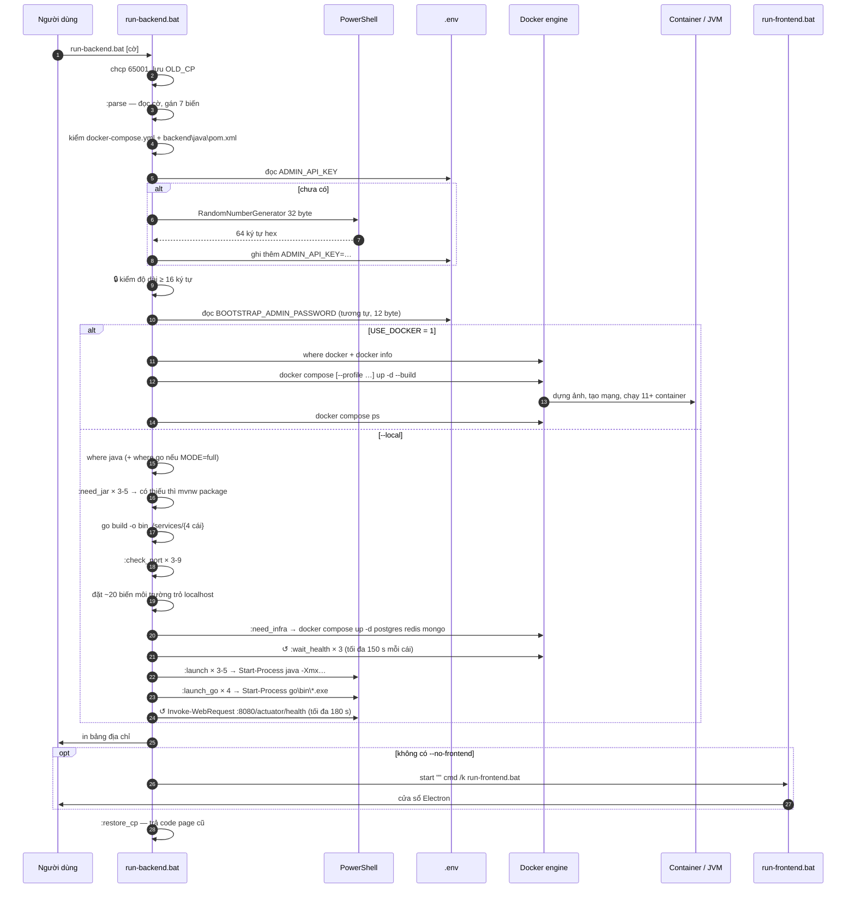

---

## 5. Vòng đời của một lần chạy — máy trạng thái các nhãn

Tệp bat không có hàm; nó có **nhãn** và `goto`. Đây là toàn bộ đồ thị chuyển
trạng thái, và mọi nhánh lỗi đều đổ về đúng một chỗ:

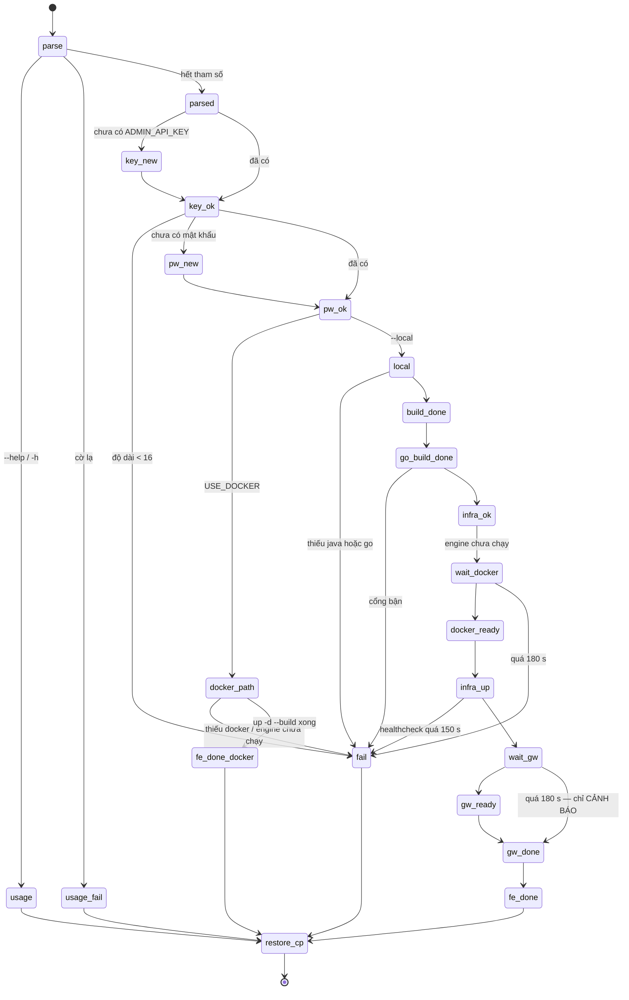

★ Chú ý một điểm bất đối xứng có chủ ý: quá giờ đợi **hạ tầng** (150 s) là
`goto :fail` — dừng hẳn. Quá giờ đợi **gateway** (180 s) chỉ in `[CẢNH BÁO]` rồi
đi tiếp. Lý do: hạ tầng hỏng thì mọi service phía sau chắc chắn chết, còn gateway
chậm thì các service khác vẫn có thể đang lên bình thường, và bảng địa chỉ vẫn
đáng in ra.

⚠ Mọi nhánh kết thúc đều đi qua `call :restore_cp` trước `endlocal`. Bỏ sót một
nhánh thì cửa sổ cmd của người dùng bị kẹt ở code page 65001 sau khi tệp thoát —
một tác dụng phụ tồn tại lâu hơn cả tiến trình gây ra nó.

---

## 6. Vòng đời của một service — từ mã nguồn tới cổng lắng nghe

Cùng một service `search-service`, hai đường đi hoàn toàn khác:

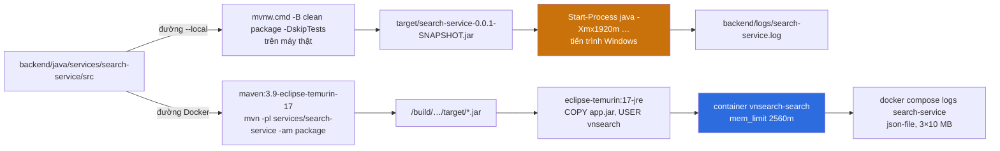

### 6.1 Bảng đối chiếu hai vòng đời

| Giai đoạn | `--local` | Docker |
|---|---|---|
| Trình dựng | `mvnw.cmd` trên máy thật | `maven:3.9-eclipse-temurin-17` trong ảnh build |
| Kho `.m2` | `%USERPROFILE%\.m2` | `--mount=type=cache,target=/root/.m2` |
| Phạm vi dựng | `clean package` **cả reactor** | `-pl ${MODULE} -am` — chỉ module cần |
| Chạy bằng | JRE của máy | `eclipse-temurin:17-jre` trong ảnh |
| Người dùng chạy | tài khoản Windows hiện tại | `vnsearch` (không phải root) |
| Tham số JVM | `:launch` truyền qua dòng lệnh | `JAVA_TOOL_OPTIONS` của Dockerfile, compose ghi đè |
| Trần bộ nhớ | `-Xmx` + 3 trần ngoài heap | `mem_limit` + `MaxRAMPercentage` |
| Log | `backend/logs/<ten>.log` | driver `json-file`, `max-size 10m`, `max-file 3` |
| Khởi động lại khi chết | **không** | `restart: unless-stopped` |

★ Dòng cuối cùng là khác biệt hay bị quên nhất. Ở đường Docker, một service OOM
sẽ được bật lại vô hạn và triệu chứng duy nhất là container **mãi không lên
`healthy`**. Ở đường `--local`, nó chết là chết, và `backend/logs/<ten>.err.log`
có nguyên vẹn stack trace.

---

## 7. Sáu hàng rào chặn khởi động sai

Tệp bat này dành gần một phần ba số dòng để **từ chối chạy**. Sáu hàng rào, theo
đúng thứ tự chúng được dựng:

| # | Hàng rào | Dòng | Hỏng thì sao nếu KHÔNG có hàng rào |
|---|---|---|---|
| ① | Cờ lạ → `:usage_fail` | `:parse` | Người dùng gõ `--montoring` và tưởng đã bật giám sát |
| ② | Thiếu `docker-compose.yml` / `pom.xml` | sau `:parsed` | Chạy tệp bat từ nhầm thư mục, mọi đường dẫn tương đối trỏ vào hư không |
| ③ | 🔒 `ADMIN_API_KEY` < 16 ký tự | `:key_ok` | `ServiceSecurityConfig` từ chối khởi động, và lỗi hiện ra ở tận log của service |
| ④ | Thiếu `java` / thiếu `go` | đường local | `java` không tồn tại → `Start-Process` ném lỗi mờ mịt |
| ⑤ | Cổng đang bị chiếm | `:check_port` | Service mới im lặng không bind được, người dùng nói chuyện với tiến trình CŨ |
| ⑥ | Hạ tầng chưa `healthy` | `:wait_health` | Spring Boot chết vì `Connection refused` trong 5 giây đầu |

### 7.1 Vì sao hàng rào ③ đáng giá nhất

`ADMIN_API_KEY` không phải một biến cấu hình bình thường — nó là khoá mở
`/api/admin/**`, nhóm endpoint điều khiển crawler và **tải được URL tuỳ ý**. Một
hệ thống chạy với khoá rỗng hoặc khoá 4 ký tự là một lỗ SSRF mở sẵn.

Ngưỡng 16 không phải con số tự nghĩ ra trong tệp bat. Nó khớp đúng với hằng số ở
tầng Java:

**Tệp:** `backend/java/libs/platform/src/main/java/com/vnsearch/config/ServiceSecurityConfig.java:129`

```java
/** Độ dài tối thiểu chấp nhận được cho một khoá tĩnh. */
private static final int MIN_KEY_LENGTH = 16;
```

★ Giá trị của việc kiểm ở tệp bat không phải là "kiểm thêm một lần". Nó là **kiểm
sớm hơn 40 giây**: không có hàng rào này thì lỗi chỉ lộ ra sau khi Maven dựng
xong, Docker kéo ảnh xong, Spring Boot nạp xong context — rồi mới ném ngoại lệ
vào một tệp log mà người dùng chưa biết là có tồn tại.
---
---

# PHẦN II — TẦNG 0: PHÂN TÍCH THAM SỐ

---

## 8. `@echo off`, `setlocal`, `ROOT`, `ENV_FILE`

```bat
@echo off
setlocal

set "ROOT=%~dp0"
set "ENV_FILE=%ROOT%.env"
```

Bốn dòng, ba quyết định:

### 8.1 `setlocal` — vì sao bắt buộc

Tệp này đặt hơn hai mươi biến môi trường (`AUTH_DB_URL`, `MONGO_URI`,
`ADMIN_API_KEY`…). Không có `setlocal`, tất cả chúng **ở lại trong cửa sổ cmd của
người dùng** sau khi tệp thoát. Hậu quả cụ thể: lần chạy sau, nhánh
`if defined ADMIN_API_KEY goto :key_ok` sẽ thấy khoá của lần chạy trước còn nằm
đó, và người dùng không hiểu vì sao sửa `.env` mà không có tác dụng gì.

Mọi nhánh kết thúc đều có `endlocal` tường minh trước `exit /b`.

### 8.2 `%~dp0` — thư mục chứa tệp, có dấu `\` ở cuối

| Biểu thức | Giá trị ví dụ |
|---|---|
| `%0` | `C:\repo\run-backend.bat` |
| `%~dp0` | `C:\repo\` ← **có** dấu gạch chéo cuối |
| `%ROOT%.env` | `C:\repo\.env` ← nên nối trực tiếp, không thêm `\` |

★ Dấu `\` cuối của `%~dp0` là lý do mọi chỗ nối chuỗi trong tệp viết
`"%ROOT%backend\java"` chứ không `"%ROOT%\backend\java"`. Thêm dấu thứ hai vẫn
chạy trên hầu hết lệnh Windows nhưng hỏng với `pushd` trên đường dẫn UNC.

### 8.3 `cd /d "%ROOT%"` chứ không chỉ `cd`

Xuất hiện sau `:parsed`. `/d` là bắt buộc: `cd` trần **không đổi ổ đĩa**. Kho nằm
ở `D:\` mà cửa sổ cmd đang ở `C:\` thì `cd D:\repo` chạy xong… vẫn đứng ở `C:\`,
không báo lỗi gì.

---

## 9. Vì sao phải `chcp 65001` và vì sao phải trả lại

```bat
for /f "tokens=2 delims=:" %%c in ('chcp') do set "OLD_CP=%%c"
set "OLD_CP=%OLD_CP: =%"
chcp 65001 >nul
```

### 9.1 Ba bước

| Bước | Lệnh | Kết quả |
|---|---|---|
| ① | `chcp` không tham số | In `Active code page: 437` |
| ② | `tokens=2 delims=:` | Lấy phần sau dấu `:` → ` 437` |
| ③ | `%OLD_CP: =%` | Xoá **mọi** dấu cách → `437` |

Bước ③ là phép thay chuỗi của batch: `%VAR:tìm=thay%`. Ở đây "tìm" là một dấu
cách và "thay" là chuỗi rỗng.

### 9.2 Vì sao cần 65001

Toàn bộ thông báo của tệp này là tiếng Việt có dấu: `Khoá quản trị`,
`Đang đợi container báo healthy`. Ở code page 437 hoặc 1258, chúng hiện ra thành
ký tự rác. `65001` là UTF-8.

### 9.3 ⚠ Cạm bẫy nằm ở TỆP, không nằm ở code page

`chcp 65001` chỉ chữa phần **hiển thị**. Có một lỗi nặng hơn nhiều nằm ở chính
định dạng tệp `.bat`, và nó đã xảy ra thật trong kho này:

**Tệp:** `.gitattributes`

```
# Script Windows BAT BUOC phai co ket thuc dong CRLF. Voi LF, cmd.exe phan tich
# sai va an mat vai ky tu dau moi dong — trieu chung la nhung dong bao loi kieu
# "'M' is not recognized as an internal or external command" (do "REM" bi cat
# thanh "M"). Day la loi that da gap khi kiem thu run-frontend.bat.
*.bat text eol=crlf
*.cmd text eol=crlf
```

★ Kho đặt `* text=auto eol=lf` làm mặc định (để prettier của `desktop-app` không
phàn nàn), nên nếu **không** có hai dòng ghim `*.bat eol=crlf` ở trên thì mọi tệp
bat trong kho sẽ được checkout ra LF và không tệp nào chạy nổi.

### 9.4 `:restore_cp` — trả lại đúng thứ đã mượn

```bat
:restore_cp
if defined OLD_CP chcp %OLD_CP% >nul
goto :eof
```

`if defined OLD_CP` bảo vệ trường hợp bước ① thất bại (bản Windows lạ, `chcp` in
ra định dạng khác). Khi đó `chcp` sẽ không bị gọi với tham số rỗng.

---

## 10. Vòng `:parse` — mười một nhánh

```bat
:parse
if "%~1"=="" goto :parsed
if /i "%~1"=="--help" goto :usage
...
shift
goto :parse
:parsed
```

### 10.1 Cơ chế `shift`

Batch không có mảng tham số. `shift` dịch toàn bộ `%1 %2 %3…` sang trái một ô,
nên vòng lặp `kiểm %1 → shift → quay lại` đọc hết mọi tham số dù có bao nhiêu.
Điều kiện dừng là `%~1` rỗng.

`%~1` chứ không `%1`: dấu ngã bóc cặp nháy kép bao ngoài, để
`run-backend.bat "--local"` cũng khớp đúng nhánh.

`/i` = so sánh không phân biệt hoa thường, nên `--LOCAL` vẫn chạy.

### 10.2 Bảng mười một nhánh

| `%~1` | Việc làm | Nhóm |
|---|---|---|
| *(rỗng)* | `goto :parsed` | thoát vòng |
| `--help`, `-h` | `goto :usage` → in trợ giúp, `exit /b 0` | thoát |
| `--full` | `MODE=full` | chế độ |
| `--core` | `MODE=core` | chế độ |
| `--docker` | `USE_DOCKER=1` | tương thích ngược |
| `--local` | `USE_DOCKER=` | đường chạy |
| `--build` | `FORCE_BUILD=1` | dựng |
| `--windows` | `SHOW_WINDOWS=1` | hiển thị |
| `--no-frontend` | `NO_FRONTEND=1` | giao diện |
| `--crawler` | `WITH_CRAWLER=1` | hồ sơ |
| `--no-crawler` | `WITH_CRAWLER=` | tương thích ngược |
| `--monitoring` | `MONITORING=1` | hồ sơ |
| *(khác)* | in `[LỖI]` → `:usage_fail`, `exit /b 1` | 🔒 |

### 10.3 ★ `set "VAR="` xoá biến, không đặt biến rỗng

`set "WITH_CRAWLER="` khiến `if defined WITH_CRAWLER` trả về **sai**. Đây là toàn
bộ cách tệp này biểu diễn kiểu boolean: **có định nghĩa = bật**, không định
nghĩa = tắt. Không chỗ nào so sánh với `"1"` hay `"true"`.

Hệ quả thực dụng: người dùng đã `set WITH_CRAWLER=0` ở cửa sổ cmd thì crawler vẫn
được **bật**, vì `"0"` là một giá trị đã được định nghĩa.

---

## 11. ★ Ma trận cờ × đường chạy: cờ nào bị bỏ qua ở đâu

Đây là bảng dễ hiểu sai nhất trong toàn bộ tệp:

| Cờ | Đường Docker (mặc định) | Đường `--local` | Có báo gì không? |
|---|---|---|---|
| `--core` | **bỏ qua** | có tác dụng | ✓ in `[GHI CHÚ]` |
| `--full` | **bỏ qua** | có tác dụng | ✗ im lặng |
| `--build` | **bỏ qua** (luôn `--build`) | có tác dụng | ✗ im lặng |
| `--windows` | **bỏ qua** | có tác dụng | ✗ im lặng |
| `--crawler` | `--profile crawler` | thêm `:8083` | ✓ in ở bảng chế độ |
| `--monitoring` | `--profile monitoring` | **bỏ qua** | ✓ in `[GHI CHÚ]` |
| `--no-frontend` | có tác dụng | có tác dụng | — |
| `--docker` | không đổi gì | **huỷ `--local` nếu đứng sau** | ✗ im lặng |

### 11.1 ⚠ Ba tổ hợp im lặng đáng nhớ

**⚠ `--core --crawler`** — `WITH_CRAWLER=1` được đặt, nhưng mọi chỗ dùng nó ở
đường local đều nằm trong `if "%MODE%"=="full" ( … )`:

```bat
if "%MODE%"=="full" (
    if defined WITH_CRAWLER call :launch crawler-service 8083 1400
    ...
)
```

Nên `--local --core --crawler` chạy xong mà **không có crawler**, và không có
dòng nào nói vì sao.

**⚠ `--local --build` vs `--build`** — cờ này chỉ ép dựng lại jar ở đường local.
Ở đường Docker, lệnh cuối cùng luôn là `up -d --build`, nên `--build` là thừa chứ
không sai.

**⚠ Thứ tự cờ có ý nghĩa** — `--local --docker` cho ra đường Docker, còn
`--docker --local` cho ra đường local. Vòng `:parse` đọc trái sang phải và cờ sau
ghi đè cờ trước. Điều này đúng với mọi cặp đối nghịch: `--core/--full`,
`--crawler/--no-crawler`.

---

## 12. Kiểm tra "đang đứng đúng thư mục gốc"

```bat
cd /d "%ROOT%" 2>nul
if not exist "docker-compose.yml" (
    echo [LỖI] Không thấy docker-compose.yml trong "%CD%".
    echo       Tệp .bat này phải nằm ở THƯ MỤC GỐC của kho.
    goto :fail
)
if not exist "backend\java\pom.xml" (
    echo [LỖI] Không thấy "backend\java\pom.xml".
    ...
)
```

★ Hai lần kiểm tra khác nhau về mục đích, không phải dư thừa:

| Kiểm | Bắt được tình huống |
|---|---|
| `docker-compose.yml` | Tệp bat bị chép ra chỗ khác (Desktop, thư mục Downloads) |
| `backend\java\pom.xml` | Đúng kho nhưng thiếu submodule / clone hụt / đang ở giữa một lần checkout hỏng |

`2>nul` sau `cd /d` nuốt thông báo lỗi của chính lệnh `cd`. Nếu `%ROOT%` không
tồn tại (kho bị xoá trong lúc cửa sổ đang mở), người dùng nhận được thông báo
`[LỖI]` bằng tiếng Việt ở dòng dưới thay vì một dòng tiếng Anh của cmd.exe.

---
---

# PHẦN III — TỆP `.env`

---

## 13. `ADMIN_API_KEY` — ba nguồn theo thứ tự ưu tiên

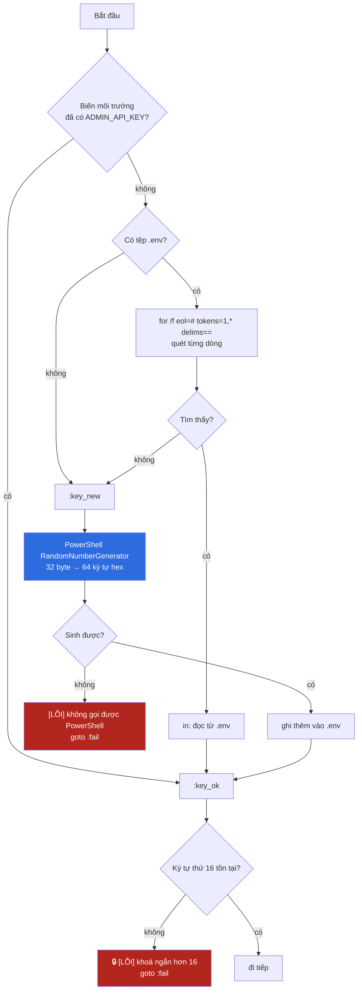

### 13.1 Vì sao thứ tự này chứ không ngược lại

**Biến môi trường thắng tệp** là đúng thứ tự ưu tiên mà `docker compose` cũng
dùng. Nó cho phép ba kiểu dùng cùng tồn tại:

| Tình huống | Cách làm | Kết quả |
|---|---|---|
| Chạy thử hàng ngày | không làm gì | Khoá sinh một lần, nằm trong `.env`, dùng mãi |
| Thử một khoá khác một lần | `set ADMIN_API_KEY=...` rồi chạy | Khoá tạm thắng, `.env` không đổi |
| Môi trường thật | Đặt biến ở dịch vụ/CI | Không tệp nào chứa bí mật |

### 13.2 Đường "ghi vào .env" tạo tệp thế nào

```bat
if not exist "%ENV_FILE%" (
    >"%ENV_FILE%" echo # Sinh tự động bởi run-backend.bat. KHÔNG commit - .gitignore đã chặn.
)
>>"%ENV_FILE%" echo ADMIN_API_KEY=%ADMIN_API_KEY%
```

`>` tạo mới/ghi đè, `>>` nối thêm. Đặt dấu chuyển hướng **trước** `echo` là một
thói quen có lý: viết `echo ADMIN_API_KEY=%KEY% >>file` sẽ ghi thêm **một dấu
cách thừa** vào cuối giá trị, và một khoá API có dấu cách ở cuối là loại lỗi mất
cả buổi để tìm.

---

## 14. Sinh khoá: `RandomNumberGenerator` chứ không `Get-Random`

```bat
for /f "delims=" %%k in ('powershell -NoProfile -Command "$b = New-Object byte[] 32; [Security.Cryptography.RandomNumberGenerator]::Create().GetBytes($b); ([BitConverter]::ToString($b) -replace [char]45, [string]::Empty).ToLower()"') do set "ADMIN_API_KEY=%%k"
```

### 14.1 Bốn phần của câu lệnh PowerShell

| Phần | Việc |
|---|---|
| `New-Object byte[] 32` | Cấp 32 byte = 256 bit |
| `RandomNumberGenerator::Create().GetBytes($b)` | Đổ vào đó dữ liệu ngẫu nhiên **an toàn mật mã** |
| `[BitConverter]::ToString($b)` | `A1-B2-C3-…` — có dấu gạch nối |
| `-replace [char]45, [string]::Empty` + `.ToLower()` | Bỏ gạch nối, hạ chữ thường → 64 ký tự hex |

### 14.2 ★ Vì sao không dùng `Get-Random`

`Get-Random` của PowerShell dùng một PRNG thường (`System.Random`), gieo mầm từ
đồng hồ. Biết xấp xỉ thời điểm sinh là thu hẹp được không gian tìm kiếm xuống mức
duyệt cạn được. `RandomNumberGenerator` lấy entropy từ hệ điều hành.

Với một khoá mở `/api/admin/**` — nhóm endpoint điều khiển crawler và tải được
URL tuỳ ý — khác biệt này không phải chuyện học thuật.

### 14.3 `[char]45` chứ không `'-'`

Dấu `-` nằm trong một chuỗi được truyền qua **ba** lớp phân tích: cmd.exe → `for
/f` → PowerShell. Viết `[char]45` (mã ASCII của dấu gạch nối) tránh hẳn việc phải
đoán lớp nào sẽ nuốt mất ký tự nào. Cùng lý do với `[string]::Empty` thay cho
`''`: cặp nháy đơn lồng trong cặp nháy kép lồng trong cặp nháy đơn của `for /f`
là chỗ dễ hỏng nhất của batch.

### 14.4 `-NoProfile`

Bỏ qua profile PowerShell của người dùng. Một profile có `Write-Host` chào mừng
sẽ khiến `for /f "delims="` bắt nhầm dòng chào làm giá trị khoá — và tệp bat sẽ
tiếp tục chạy với một "khoá" là câu chào tiếng Anh.

---

## 15. ★ `%ADMIN_API_KEY:~15,1%` — đo độ dài bằng batch

```bat
:key_ok
set "KEY_PROBE=%ADMIN_API_KEY:~15,1%"
if not defined KEY_PROBE (
    echo [LỖI] ADMIN_API_KEY ngắn hơn 16 ký tự nên ServiceSecurityConfig sẽ từ chối khởi động.
    ...
    goto :fail
)
```

### 15.1 Cú pháp

`%VAR:~offset,length%` là phép cắt chuỗi của batch. `~15,1` = "lấy 1 ký tự bắt
đầu từ vị trí 15 (đếm từ 0)" = **ký tự thứ 16**.

| Độ dài khoá | `%KEY:~15,1%` | `if not defined KEY_PROBE` |
|---|---|---|
| 8 | chuỗi rỗng | ĐÚNG → dừng 🔒 |
| 15 | chuỗi rỗng | ĐÚNG → dừng 🔒 |
| 16 | ký tự thứ 16 | SAI → đi tiếp |
| 64 (tự sinh) | ký tự thứ 16 | SAI → đi tiếp |

### 15.2 Vì sao không đếm độ dài trực tiếp

Batch **không có** hàm `strlen`. Ba cách thay thế đều tệ hơn:

| Cách | Vấn đề |
|---|---|
| Vòng lặp `for` cắt từng ký tự | Vài chục dòng cho một phép kiểm |
| Gọi PowerShell `$env:KEY.Length` | Tốn thêm ~200 ms khởi động PowerShell nữa |
| `if "%KEY:~15,1%"=="" (...)` | Hỏng nếu khoá chứa dấu `"` hoặc `&` |

Cách đang dùng vừa ngắn vừa **không đặt giá trị khoá vào một phép so sánh chuỗi**,
nên một khoá chứa ký tự đặc biệt không làm hỏng cú pháp dòng lệnh.

⚠ Một điểm biên đã biết: nếu ký tự thứ 16 đúng là **dấu cách**, `set "KEY_PROBE= "`
vẫn coi là đã định nghĩa nên khoá qua được. Khoá tự sinh chỉ chứa `0-9a-f` nên
điều này chỉ xảy ra với khoá đặt tay, và một khoá 16 ký tự có dấu cách ở đúng vị
trí đó vẫn hợp lệ với `MIN_KEY_LENGTH` của Java — nên hai bên vẫn đồng ý với nhau.

---

## 16. `BOOTSTRAP_ADMIN_PASSWORD` và `BOOTSTRAP_ADMIN_USERNAME`

Cùng khuôn ba nguồn như `ADMIN_API_KEY`, khác ở ba chi tiết:

| | `ADMIN_API_KEY` | `BOOTSTRAP_ADMIN_PASSWORD` |
|---|---|---|
| Kích thước sinh | 32 byte → 64 ký tự hex | **12 byte → 24 ký tự hex** |
| Kiểm độ dài | 🔒 có, ≥ 16 | không |
| In ra màn hình | chỉ 8 ký tự đầu | **in đủ, đúng một lần** |
| Ghi vào `.env` | 1 dòng | **2 dòng** (kèm `BOOTSTRAP_ADMIN_USERNAME=admin`) |

```bat
echo Tài khoản quản trị : admin / %BOOTSTRAP_ADMIN_PASSWORD%   ^(đã ghi vào .env^)
```

★ In đủ mật khẩu là có chủ ý: đây là **tài khoản đầu tiên** của `auth-service`, và
người dùng cần nó ngay để đăng nhập lần đầu. Nó vẫn nằm trong `.env` nên không
mất. Ngược lại, `ADMIN_API_KEY` chỉ in 8 ký tự đầu (`%ADMIN_API_KEY:~0,8%...`) —
đủ để đối chiếu "đúng khoá đó không", không đủ để lộ.

`^(` và `^)` là cách thoát dấu ngoặc trong `echo` của batch. Không thoát thì
cmd.exe hiểu nhầm đó là dấu đóng khối lệnh.

```bat
:pw_ok
if not defined BOOTSTRAP_ADMIN_USERNAME set "BOOTSTRAP_ADMIN_USERNAME=admin"
```

Dòng chốt này chạy ở **mọi** đường — kể cả đường đọc được mật khẩu từ `.env` mà
tệp `.env` đó lại thiếu dòng username. Không có nó, `auth-service` nhận username
rỗng và tài khoản bootstrap không tạo được.

---

## 17. ⚠ Cách `.env` được đọc và bốn cạm bẫy của nó

```bat
for /f "usebackq eol=# tokens=1,* delims==" %%a in ("%ENV_FILE%") do (
    if /i "%%a"=="ADMIN_API_KEY" set "ADMIN_API_KEY=%%b"
)
```

### 17.1 Bốn tuỳ chọn của `for /f`

| Tuỳ chọn | Việc |
|---|---|
| `usebackq` | Cho phép `"…"` nghĩa là **tên tệp**, không phải chuỗi ký tự |
| `eol=#` | Bỏ qua dòng bắt đầu bằng `#` — đúng cú pháp chú thích của `.env` |
| `tokens=1,*` | `%%a` = phần trước dấu `=` đầu tiên, `%%b` = **toàn bộ phần còn lại** |
| `delims==` | Dấu phân tách là `=` |

★ `tokens=1,*` chứ không `tokens=1,2` là chi tiết quan trọng: một mật khẩu chứa
dấu `=` (rất thường gặp với chuỗi base64) sẽ bị `tokens=1,2` cắt cụt tại dấu `=`
thứ hai. Với `*`, phần đuôi được giữ nguyên vẹn.

### 17.2 Bốn cạm bẫy

**⚠ ① Dòng có dấu cách quanh dấu `=`.** `.env` viết `ADMIN_API_KEY = abc` sẽ cho
`%%a` = `ADMIN_API_KEY ` (có dấu cách cuối) và phép so sánh
`"%%a"=="ADMIN_API_KEY"` **không khớp**. Tệp `.env` do chính tệp bat sinh ra thì
không bao giờ có dấu cách; tệp chép tay từ tài liệu khác thì có thể.

**⚠ ② Giá trị có cặp nháy kép.** `.env` viết `ADMIN_API_KEY="abc123"` thì khoá
thật sẽ **bao gồm cả hai dấu nháy**, và độ dài đếm cả chúng. `docker compose` bóc
nháy, tệp bat thì không — hai bên hiểu khác nhau về cùng một dòng.

**⚠ ③ Dòng trống và BOM.** Dòng trống được bỏ qua an toàn. Nhưng nếu ai đó lưu
`.env` bằng Notepad ở "UTF-8 with BOM", ba byte BOM dính vào tên biến của **dòng
đầu tiên**, và dòng đó vô hình biến mất. Đây là lý do phần sinh khoá luôn ghi một
dòng chú thích `#` làm dòng đầu — nó hứng BOM thay cho dòng dữ liệu.

**⚠ ④ Đường đọc `.env` ở đường `--local` chạy MUỘN.** Vòng nạp đầy đủ:

```bat
if exist "%ENV_FILE%" (
    for /f "usebackq eol=# tokens=1,* delims==" %%a in ("%ENV_FILE%") do (
        if not defined %%a set "%%a=%%b"
    )
)
```

nằm **sau** khối `set "AUTH_SERVICE_URL=http://localhost:8081"` và **trước** khối
`set "AUTH_DB_URL=jdbc:postgresql://localhost:5432/vnsearch_auth"`. Hệ quả chính
xác:

| Biến | `.env` có ghi đè được không? | Vì sao |
|---|---|---|
| `AUTH_SERVICE_URL`, `SEARCH_SERVICE_URL`, … | **Không** | bat đặt trước, `.env` dùng `if not defined` |
| `AUTH_JWKS_URI`, `REDIS_HOST` | **Không** | như trên |
| `POSTGRES_PASSWORD`, `APP_CRAWLER_BUS` | **Có** | bat chỉ đặt mặc định *sau đó*, cũng bằng `if not defined` |
| `AUTH_DB_URL`, `MONGO_URI`, `FOOTBALL_DB_HOST`, `APP_STORAGE_POSTGRES_URL` | **Không** | bat `set` đè **vô điều kiện** ở khối phía dưới |
| `ADMIN_API_KEY`, `BOOTSTRAP_ADMIN_*` | **Có** | đọc từ đầu tệp, trước mọi thứ |

★ Đây không phải lỗi — nó là chủ ý. Ở đường `--local`, mọi service **phải** trỏ
về `localhost`; `application.properties` mặc định trỏ vào tên container
(`postgres`, `mongo`), và một dòng `MONGO_URI=mongodb://mongo:27017/...` sót lại
trong `.env` sẽ giết `history-service` bằng `UnknownHostException`. Việc đè vô
điều kiện chính là thứ ngăn điều đó.

⚠ Nhưng hệ quả cần biết: **không thể** dùng `.env` để trỏ đường `--local` sang một
Postgres ở máy khác. Muốn vậy phải sửa tệp bat, hoặc chạy đường Docker.
---
---

# PHẦN IV — ĐƯỜNG DOCKER (MẶC ĐỊNH)

---

## 18. `:docker_path` — đọc từng dòng

Rẽ nhánh xảy ra ở một dòng duy nhất, ngay sau `:pw_ok`:

```bat
if defined USE_DOCKER goto :docker_path
```

Toàn bộ đường Docker gọn hơn đường local đúng năm lần, vì `docker-compose.yml`
đã gánh mọi thứ mà đường local phải làm bằng tay.

### 18.1 Sáu bước

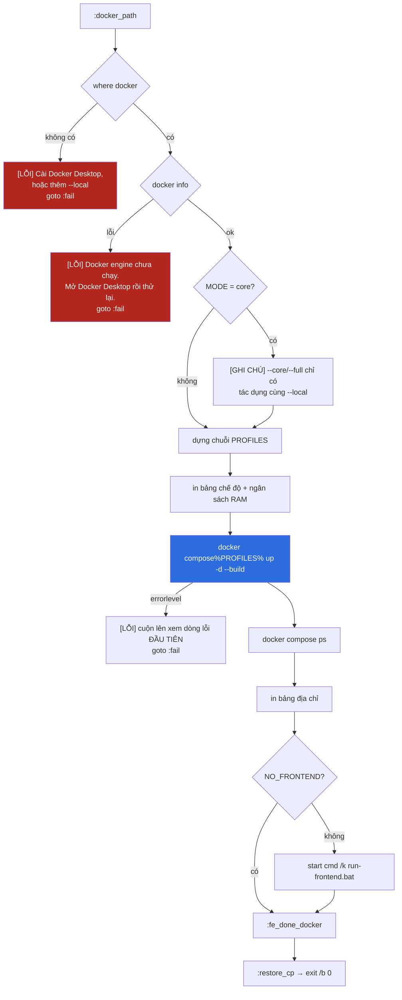

### 18.2 ⚠ Bất đối xứng đáng chú ý: engine chưa chạy

| Đường | Docker engine chưa chạy |
|---|---|
| `:docker_path` | `[LỖI]` → **dừng hẳn**, bảo người dùng tự mở Docker Desktop |
| `--local` (`:need_infra`) | **Tự dò** `Docker Desktop.exe` ở ba đường dẫn, tự `start`, ↺ đợi tới 180 s |

Đường được dùng nhiều hơn (Docker, mặc định) lại là đường **không** tự mở Docker
Desktop, trong khi đường ít dùng hơn thì có. Đó là một điểm chưa nhất quán còn
lại trong tệp; sửa được bằng cách tách phần dò-và-mở ở `:need_infra` thành một
nhãn dùng chung cho cả hai đường.

### 18.3 `where` và `errorlevel`

```bat
where docker >nul 2>nul
if errorlevel 1 ( … )
```

`where` là `which` của Windows: tìm lệnh trong `PATH`, trả mã 0 nếu thấy, 1 nếu
không. `>nul 2>nul` nuốt cả stdout lẫn stderr — tệp chỉ quan tâm mã trả về.

★ `if errorlevel 1` nghĩa là **"mã trả về ≥ 1"**, không phải "bằng 1". Đó là ngữ
nghĩa lịch sử của batch và là lý do các phép kiểm "thành công" trong tệp này viết
theo dạng phủ định: `if not errorlevel 1 goto :ok`.

---

## 19. Ba hồ sơ của compose: `crawler`, `monitoring`, `kafka`

```bat
set "PROFILES="
if defined MONITORING (
    set "PROFILES=%PROFILES% --profile monitoring"
    ...
)
if defined WITH_CRAWLER (
    set "PROFILES=%PROFILES% --profile crawler"
    ...
)
...
docker compose%PROFILES% up -d --build
```

### 19.1 Vì sao `docker compose%PROFILES%` không có dấu cách

Mỗi lần nối, chuỗi bắt đầu bằng một dấu cách: `" --profile monitoring"`. Nên khi
`PROFILES` rỗng, `docker compose%PROFILES% up` cho ra `docker compose up` — đúng.
Nếu viết `docker compose %PROFILES% up`, chuỗi rỗng sẽ để lại hai dấu cách liền
nhau, vô hại, còn chuỗi có giá trị thì thành ba dấu cách. Cách hiện tại giữ dòng
lệnh sạch trong mọi trường hợp.

### 19.2 Bảng ba hồ sơ

| Hồ sơ | Container | Trần RAM cộng thêm | Bật bằng |
|---|---|---|---|
| *(không hồ sơ)* | 8 service + postgres + redis + mongo | **4928 MB** | mặc định |
| `crawler` | `crawler-service` | +2048 MB | `--crawler` |
| `monitoring` | `prometheus`, `grafana`, `alertmanager` | +544 MB | `--monitoring` |
| `kafka` | `kafka`, `kafka-ui`, `kafka-exporter` | +1344 MB | **không có cờ** — phải gõ tay |

★ `kafka` là hồ sơ duy nhất mà `run-backend.bat` **không** có cờ tương ứng. Bảng
địa chỉ cuối tệp chỉ in gợi ý:

```
echo   Thêm Kafka      docker compose --profile kafka up -d
echo   Kafka UI        http://localhost:8091   ^(chỉ khi bật hồ sơ kafka^)
```

Lý do: bus mặc định là `memory` và hệ thống chạy đủ chức năng không cần broker —
xem [mục 30](#30--hạ-app_crawler_bus-từ-kafka-về-memory).

### 19.3 ⚠ Hồ sơ và lệnh `down`

Một hồ sơ không được nêu tên thì `docker compose down` **bỏ qua** container của
hồ sơ đó và nó cứ chạy tiếp. `end-backend.bat` xử lý bằng cách liệt kê hết:

**Tệp:** `end-backend.bat`

```bat
REM Liet ke MOI ho so, ke ca `crawler`: khong co ten ho so thi
REM `docker compose down` bo qua container cua ho so do va no cu chay tiep.
set "PROFILES=--profile kafka --profile monitoring --profile crawler"
```

Đây là lý do phải dùng `end-backend.bat` chứ không gõ `docker compose down` tay:
gõ tay sẽ để lại `crawler-service` với trần 2 GB đang chạy.

---

## 20. `up -d --build` — vì sao luôn có `--build`

```bat
docker compose%PROFILES% up -d --build
```

| Cờ | Việc |
|---|---|
| `up` | Tạo mạng, volume, container còn thiếu; khởi động tất cả |
| `-d` | Detached — trả cửa sổ cmd về ngay, không bám log |
| `--build` | **Luôn dựng lại ảnh** trước khi chạy |

### 20.1 `--build` có làm chậm không

Gần như không, nhờ hai tầng cache:

```dockerfile
# backend/java/Dockerfile
COPY java/pom.xml .
COPY java/libs/core-common/pom.xml libs/core-common/
...                                          # 11 tệp pom, TRƯỚC mã nguồn
RUN --mount=type=cache,target=/root/.m2 \
    mvn -B -q -pl ${MODULE} -am dependency:go-offline || true
COPY java/libs libs                          # mã nguồn mới đến sau
```

★ Hai kỹ thuật riêng biệt:

1. **Chép mọi `pom.xml` trước mã nguồn.** Tầng tải thư viện chỉ mất hiệu lực khi
   pom đổi. Sửa một dòng Java không làm phải tải lại gì.
2. **`--mount=type=cache`** giữ kho `~/.m2` **giữa các lần build**, kể cả khi tầng
   phía trên đã mất hiệu lực. Chú thích tại chỗ nói đây là khác biệt giữa 30 giây
   và 4 phút.

⚠ Với reactor đa module, phải chép **đủ mọi** pom, kể cả module không dựng tới:
Maven đọc trọn danh sách `<modules>` của POM cha trước khi biết nó cần dựng cái
nào. Thiếu một tệp là lỗi `Child module does not exist`.

### 20.2 `|| true` ở bước làm nóng

```dockerfile
RUN --mount=type=cache,target=/root/.m2 \
    mvn -B -q -pl ${MODULE} -am dependency:go-offline || true
```

Bước này thuần tuý là **tối ưu cache**. Có những plugin mà `go-offline` không giải
được phụ thuộc đúng cách. Nếu nó hỏng, `mvn package` bên dưới vẫn tải lại bình
thường — nên hỏng ở đây không được phép làm hỏng cả bản build.

### 20.3 Ảnh cuối bỏ những gì

```dockerfile
FROM eclipse-temurin:17-jre
RUN useradd --create-home --shell /bin/false vnsearch
COPY --from=build /build/${MODULE}/target/${ARTIFACT}-*.jar app.jar
COPY data/seed-documents.json data/seed-documents.json
USER vnsearch
```

| Thứ bị bỏ lại ở giai đoạn build | Tiết kiệm |
|---|---|
| Maven, mã nguồn, kho `.m2` | ~600 MB **mỗi ảnh**, nhân 5 ảnh Java |
| Quyền root | `USER vnsearch`, shell `/bin/false` |

`seed-documents.json` được chép vào để container chạy được **ngay** cả khi không
mount gì. Trong compose, thư mục `./backend/data` của máy thật được mount đè lên
chỗ đó nên corpus lớn sẽ được dùng thay.

---

## 21. Bảng service ↔ cổng ↔ `mem_limit` ↔ healthcheck

| Service | Cổng nội bộ | Ra máy thật | `mem_limit` | `start_period` | Ngôn ngữ | Phụ thuộc |
|---|---|---|---|---|---|---|
| `api-gateway` | 8080 | **8080** ✓ | 384m | 40s | Java | redis (healthy), auth (started) |
| `auth-service` | 8081 | — | 384m | 40s | Java | postgres, redis (healthy) |
| `search-service` | 8082 | — | **2560m** | **90s** | Java | postgres (healthy) |
| `crawler-service` | 8083 | — | 2048m | 60s | Java | postgres (healthy) — hồ sơ `crawler` |
| `analytics-service` | 8084 | — | 320m | 40s | Java | *(không khai báo)* |
| `history-service` | 8085 | — | 96m | 10s | Go | mongo (healthy) |
| `downloads-service` | 8086 | — | 96m | 10s | Go | postgres (healthy) |
| `settings-service` | 8087 | — | 96m | 10s | Go | postgres (healthy) |
| `football-service` | 8090 | — | 96m | 10s | Go | postgres (healthy) |
| `postgres` | 5432 | 5432 ✓ | 384m | 20s | — | — |
| `redis` | 6379 | 6379 ✓ | 128m | — | — | — |
| `mongo` | 27017 | 27017 ✓ | 384m | 20s | — | — |

### 21.1 ★ Vì sao `search-service` có `start_period: 90s`

Chú thích tại chỗ nói thẳng:

```yaml
      # 90 giây: service này dựng lại chỉ mục lúc khởi động. Thời gian chờ
      # ngắn hơn sẽ khiến Docker giết nó ngay giữa lúc nó đang làm đúng việc
      # của mình, và vòng lặp khởi động lại vô hạn bắt đầu.
      start_period: 90s
```

`start_period` là khoảng ân hạn: healthcheck vẫn chạy nhưng **thất bại không được
tính**. Với một service nạp chỉ mục 510 MB, 40 giây là chưa đủ, và hậu quả không
phải "báo lỗi" mà là "khởi động lại vô hạn" — kiểu hỏng khó chẩn đoán nhất trong
compose.

### 21.2 Healthcheck viết bằng `wget`, không phải `curl`

```yaml
test: ["CMD", "sh", "-c", "wget -qO- http://localhost:8082/actuator/health | grep -q UP"]
```

Ảnh `eclipse-temurin:17-jre` (Debian) và `alpine:3.20` đều có `wget` sẵn; `curl`
thì không chắc. Đây cũng là lý do ảnh Go dừng ở `alpine` chứ không đi tiếp tới
`distroless`:

```dockerfile
# Anh cuoi la alpine (khong phai distroless) vi healthcheck cua docker-compose
# goi `wget` qua `sh` — ca hai co san trong busybox cua alpine.
```

★ `| grep -q UP` chứ không chỉ kiểm mã HTTP: `/actuator/health` trả **200 kèm
`{"status":"DOWN"}`** trong một số cấu hình. Kiểm mã trạng thái không thôi sẽ báo
"khoẻ" cho một service đang hỏng.

### 21.3 `depends_on` với `condition`

```yaml
    depends_on:
      redis: {condition: service_healthy}
      auth-service: {condition: service_started}
```

| Điều kiện | Nghĩa |
|---|---|
| `service_started` | Chỉ đợi container **chạy** — không đợi ứng dụng sẵn sàng |
| `service_healthy` | Đợi healthcheck báo `healthy` |

Gateway đợi Redis **healthy** (nó cần Redis ngay lúc nạp bean) nhưng chỉ đợi
`auth-service` **started** — vì nó chỉ gọi auth khi có request thật, và đợi
`healthy` sẽ nối hai `start_period` 40 giây lại thành một chuỗi.

⚠ `analytics-service` **không** khai báo `depends_on` nào. Nó gọi
`CRAWLER_SERVICE_URL: http://crawler-service:8083`, mà crawler lại nằm sau hồ sơ
`crawler` — nên ở cấu hình mặc định, tên đó **không phân giải được** và bảng điều
khiển của analytics trả lỗi. Đây là hệ quả đã biết và được ghi rõ trong phần trợ
giúp: *"Không bật thì mất `/api/admin/**` và bảng điều khiển của
analytics-service."*

---

## 22. ★ Một cổng duy nhất và một mạng riêng

```yaml
    # CỔNG DUY NHẤT phơi ra ngoài, và đó là điểm mấu chốt: bảy service kia
    # KHÔNG có khối `ports`, nên chúng chỉ với tới được từ trong mạng
    # `vnsearch`. Mở cổng của chúng ra máy thật là mở một đường vòng qua mọi
    # thứ Gateway đang canh.
    ports: ["8080:8080"]
```

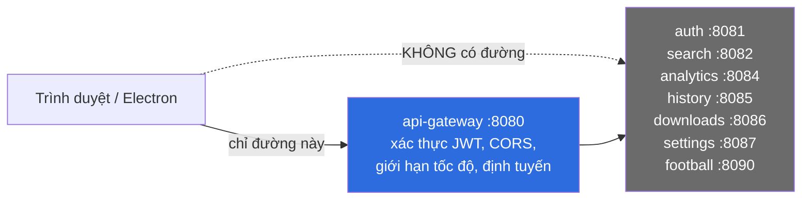

Hai lớp giữ cho điều đó đúng:

```yaml
networks:
  vnsearch:
    driver: bridge
```

| Lớp | Tác dụng |
|---|---|
| ① Không có khối `ports` | Cổng service không tồn tại trên `localhost` của máy thật |
| ② Mạng bridge riêng (không phải `default`) | Chỉ container trong mạng này phân giải được tên nhau |

⚠ Ba container hạ tầng **có** mở cổng ra máy thật (`5432`, `6379`, `27017`). Đó là
tiện lợi cho phát triển — cắm DBeaver hay `redis-cli` vào được — và là thứ **phải
bỏ đi** khi triển khai thật.

### 22.1 Cổng `8091` chứ không `8090` cho Kafka UI

```yaml
    # 8091 chứ KHÔNG phải 8090. Không có xung đột thật — football-service không
    # có khối `ports` nên 8090 chưa hề bị chiếm trên máy thật — nhưng 8090 là
    # cổng của football-service BÊN TRONG mạng `vnsearch`.
    ports: ["8091:8080"]
```

Một quyết định thuần tuý vì người đọc: dùng lại đúng con số 8090 cho thứ khác là
mời gọi người ta mở `localhost:8090` rồi kết luận sai về service nào đang trả lời.

---

## 23. Compose lấy biến môi trường từ đâu

`docker compose` đọc biến theo thứ tự: **biến môi trường của tiến trình gọi nó**
→ tệp `.env` cùng thư mục. Vì `run-backend.bat` đã đặt `ADMIN_API_KEY` bằng `set`
trước khi gọi, biến đó đến được compose **kể cả khi `.env` không tồn tại**.

### 23.1 Ba dạng nội suy dùng trong `docker-compose.yml`

| Cú pháp | Nghĩa | Ví dụ trong kho |
|---|---|---|
| `${VAR:?thông báo}` | **Bắt buộc** — thiếu thì compose dừng và in thông báo | `ADMIN_API_KEY` |
| `${VAR:-mặc định}` | Thiếu thì dùng mặc định | `APP_CORS_ALLOWED_ORIGINS`, `POSTGRES_PASSWORD` |
| `${A:-${B:-c}}` | Lồng nhau — thử A, rồi B, rồi hằng | `AUTH_DB_PASSWORD` |

```yaml
  ADMIN_API_KEY: ${ADMIN_API_KEY:?Thieu ADMIN_API_KEY. Sinh khoa - openssl rand -hex 32}
  AUTH_DB_PASSWORD: ${AUTH_DB_PASSWORD:-${POSTGRES_PASSWORD:-vnsearch}}
```

★ Đây chính là điều làm `run-backend.bat` khác `docker compose up -d` gõ tay: gõ
tay trên một kho vừa clone, chưa có `.env`, sẽ đâm thẳng vào `${ADMIN_API_KEY:?}`
và dừng. Tệp bat sinh khoá **trước** khi gọi compose nên người dùng không bao giờ
gặp thông báo đó.

### 23.2 Neo YAML — `x-java-service` và `x-java-env`

```yaml
x-java-env: &java-env
  # MỌI service phải thấy CÙNG một địa chỉ JWKS và cùng issuer/audience.
  # Lệch nhau nghĩa là token do auth-service phát bị service khác từ chối,
  # và thông báo lỗi duy nhất người dùng thấy là 401.
  AUTH_JWKS_URI: http://auth-service:8081/oauth2/jwks
  AUTH_ISSUER_URI: http://auth-service:8081
  AUTH_AUDIENCE: vnsearch-api
```

`&java-env` định nghĩa neo, `<<: *java-env` trộn nó vào. Ba service Go
(`history`, `downloads`, `settings`) **dùng** neo này vì chúng đọc JWT; riêng
`football-service` **không** dùng vì mọi endpoint của nó công khai.

★ Giá trị của neo không phải là gõ ít đi. Nó là: **không thể** để `AUTH_ISSUER_URI`
của service này lệch service kia, vì cả hai đọc cùng một dòng.

---

## 24. Ngân sách RAM — cộng lại từng con số

### 24.1 Cấu hình mặc định

| Container | `mem_limit` |
|---|---|
| `search-service` | 2560 MB |
| `postgres` | 384 MB |
| `mongo` | 384 MB |
| `auth-service` | 384 MB |
| `api-gateway` | 384 MB |
| `analytics-service` | 320 MB |
| `redis` | 128 MB |
| `football-service` | 96 MB |
| `history-service` | 96 MB |
| `downloads-service` | 96 MB |
| `settings-service` | 96 MB |
| **TỔNG** | **4928 MB ≈ 4,8 GB** |

### 24.2 Cộng thêm theo hồ sơ

| Tổ hợp | Tổng trần |
|---|---|
| mặc định | 4928 MB |
| `+ monitoring` (256 + 192 + 96) | 5472 MB |
| `+ crawler` (2048) | 6976 MB |
| `+ crawler + monitoring` | 7520 MB |
| `+ kafka` (1024 + 256 + 64) | cộng thêm 1344 MB nữa |

★ `mem_limit` là **trần**, không phải chỗ đặt trước. Đo lúc chạy không tải:
khoảng **2,9 GB**, và gần 2 GB trong số đó là `search-service`. Trần cộng dồn chỉ
cần không vượt trần WSL, để kịch bản xấu nhất (mọi container chạm trần cùng lúc)
vẫn không đẩy máy vào swap.

### 24.3 ⚠ `.wslconfig` — trần nằm ngoài kho

```
# Trần `memory` trong C:\Users\<user>\.wslconfig hạ theo xuống 6 GB — đủ
# cho mặc định và cho mặc định + `monitoring`. Chạy `crawler` cùng lúc thì
# nâng .wslconfig lên 8GB rồi `wsl --shutdown` trước đã.
```

Không có trần WSL, `vmmemWSL` lấy tới **50% RAM máy và không trả lại**. Đây là lý
do `end-backend.bat` có hẳn một bước `--wsl` để `wsl --shutdown`.

### 24.4 ★ `mem_limit` chứ không `deploy.resources.limits`

```
# Khối `deploy:` chỉ có tác dụng với Docker Swarm. Với `docker compose up`
# thường — cách mọi người thật sự chạy dự án này — nó bị BỎ QUA HOÀN TOÀN, và
# không có cảnh báo nào. Một giới hạn bộ nhớ tưởng là có nhưng không có sẽ lộ
# ra dưới dạng máy hết RAM, không phải dưới dạng một dòng lỗi.
```

Đây là loại lỗi tệ nhất trong cấu hình: cú pháp đúng, tệp hợp lệ, công cụ im
lặng, và hậu quả xuất hiện ở một chỗ hoàn toàn khác vài ngày sau.

### 24.5 Bốn service Go: 96 MB chứ không 384 MB

```
# Bốn service Go (football/history/downloads/settings) để 96 MB chứ không 384
# như hồi còn là Spring Boot: một nhị phân Go tĩnh không có JVM để khởi động,
# và 288 MB tiết kiệm được ở mỗi cái là gần 1,2 GB trên toàn hệ thống.
```

`CGO_ENABLED=0 go build -trimpath -ldflags="-s -w"` cho ra một binary tĩnh không
phụ thuộc libc, chạy được trên `alpine` mà không cần bất cứ runtime nào.
---
---

# PHẦN V — ĐƯỜNG `--local`

---

Toàn bộ phần này chỉ chạy khi `USE_DOCKER` **không** được định nghĩa, tức là khi
người dùng gõ `--local`. Mười một bước, đúng thứ tự:

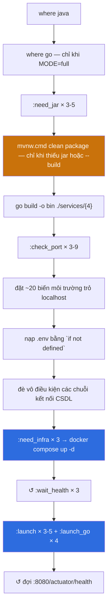

---

## 25. Kiểm Java và Go

```bat
where java >nul 2>nul
if errorlevel 1 (
    echo [LỖI] Không tìm thấy Java.
    echo       Cần JDK 17 trở lên - cài tại https://adoptium.net rồi mở lại cửa sổ này.
    goto :fail
)

REM history/downloads/settings/football viết bằng Go - chỉ chạy ở chế độ full.
if "%MODE%"=="full" (
    where go >nul 2>nul
    if errorlevel 1 ( … goto :fail )
)
```

★ `where go` nằm **trong** khối `if "%MODE%"=="full"`. Đó là toàn bộ giá trị thực
dụng của cờ `--core`: một máy chỉ có JDK vẫn chạy được ba service Java chính, và
thông báo lỗi nói thẳng điều đó:

```
echo       Cài tại https://go.dev/dl rồi mở lại cửa sổ này, hoặc chạy
echo           run-backend.bat --core để bỏ qua chúng.
```

Một thông báo lỗi đưa ra **hai** lối thoát — cài công cụ, hoặc đổi cờ — đắt hơn
hẳn một thông báo chỉ nói "thiếu Go".

⚠ Tệp không kiểm **phiên bản** Java hay Go, chỉ kiểm sự tồn tại. Máy có JDK 11 sẽ
qua được hàng rào này rồi chết ở Maven với `invalid target release: 17`.

---

## 26. `:need_jar` và `mvnw clean package -DskipTests`

```bat
:need_jar
if not exist "%ROOT%backend\java\services\%~1\target\%~1-0.0.1-SNAPSHOT.jar" set "NEED_BUILD=1"
goto :eof
```

### 26.1 Ai được hỏi

```bat
set "NEED_BUILD="
if defined FORCE_BUILD set "NEED_BUILD=1"
call :need_jar api-gateway
call :need_jar auth-service
call :need_jar search-service
if "%MODE%"=="full" (
    if defined WITH_CRAWLER call :need_jar crawler-service
    call :need_jar analytics-service
)
```

| Service | `--core` | `--full` (mặc định) | `--full --crawler` |
|---|---|---|---|
| `api-gateway` | ✓ | ✓ | ✓ |
| `auth-service` | ✓ | ✓ | ✓ |
| `search-service` | ✓ | ✓ | ✓ |
| `analytics-service` | — | ✓ | ✓ |
| `crawler-service` | — | — | ✓ |

★ `NEED_BUILD` là **một** cờ chung, không phải một cờ cho mỗi service. Thiếu một
jar duy nhất là dựng lại **cả reactor**. Với Maven đa module thì đó là lựa chọn
đúng: dựng lẻ một module rất dễ để lại `core-search` cũ trong `~/.m2` trong khi
`search-service` vừa được dựng lại — kiểu lệch phiên bản chỉ lộ ra lúc chạy.

### 26.2 Lệnh dựng

```bat
pushd "%ROOT%backend\java"
call mvnw.cmd -B clean package -DskipTests
set "BUILD_ERR=%errorlevel%"
popd
if not "%BUILD_ERR%"=="0" ( … goto :fail )
```

| Chi tiết | Vì sao |
|---|---|
| `pushd`/`popd` | Đổi thư mục rồi **trả lại đúng chỗ cũ**, kể cả khi có lỗi |
| `call mvnw.cmd` | Không có `call`, cmd.exe **nhảy** sang tệp bat kia và không bao giờ quay lại |
| `-B` | Batch mode — bỏ thanh tiến trình ANSI, log sạch |
| `-DskipTests` | Bộ test là việc của `mvnw verify` và CI |
| `set "BUILD_ERR=%errorlevel%"` ngay sau | `popd` sẽ **ghi đè** `errorlevel` |

★ Dòng `set "BUILD_ERR=%errorlevel%"` đặt **giữa** `mvnw` và `popd` là chi tiết dễ
bị bỏ sót nhất trong tệp. Đảo hai dòng đó là mọi lần dựng hỏng đều được báo thành
công.

⚠ `call mvnw.cmd` thiếu `call` là lỗi kinh điển của batch: tệp `.bat` gọi tệp
`.bat` khác mà không có `call` thì **quyền điều khiển không quay về**. Cả phần
`go build`, `:check_port`, `:launch` phía sau sẽ không bao giờ chạy, và tệp im
lặng thoát sau khi Maven xong.

### 26.3 Thông báo lỗi trỏ đúng chỗ

```
echo [LỖI] Dựng Maven thất bại. Cuộn lên xem thông báo lỗi ĐẦU TIÊN.
```

"ĐẦU TIÊN" chứ không "cuối cùng": Maven in bản tóm tắt `BUILD FAILURE` ở cuối,
nhưng nguyên nhân thật — một lỗi biên dịch, một phụ thuộc thiếu — nằm ở dòng lỗi
đầu tiên, có khi cách đó hàng trăm dòng. Cùng câu đó được lặp lại ở nhánh
`go build` và nhánh `docker compose up`.

---

## 27. `go build -o bin` — bốn binary một lệnh

```bat
REM Go build rất nhanh và tự cache - dựng lại mỗi lần cho chắc.
if not "%MODE%"=="full" goto :go_build_done
pushd "%ROOT%backend\go"
if not exist "bin" mkdir "bin"
REM `-o bin` với bin là thư mục sẵn có: Go ghi mỗi binary theo tên package.
go build -o bin ./services/football ./services/settings ./services/downloads ./services/history
set "GO_BUILD_ERR=%errorlevel%"
popd
```

### 27.1 Ba điểm khác Maven

| | Java | Go |
|---|---|---|
| Điều kiện dựng | Chỉ khi thiếu jar hoặc `--build` | **Luôn luôn** |
| Vì sao | `clean package` mất vài phút | Go tự cache, dựng lại gần như tức thì |
| Kết quả | 5 jar trong `target/` riêng | 4 `.exe` cùng `backend/go/bin/` |

★ `-o bin` với `bin` là **thư mục đã tồn tại**: Go hiểu đó là thư mục đích và ghi
mỗi binary theo tên package — `football.exe`, `settings.exe`, `downloads.exe`,
`history.exe`. Nếu `bin` chưa tồn tại, Go sẽ hiểu đó là **tên tệp đầu ra** và
lệnh với nhiều package sẽ báo lỗi. Đó chính là lý do có dòng
`if not exist "bin" mkdir "bin"` ngay trên.

### 27.2 Tên tệp mà `:launch_go` mong đợi

`:launch_go` tìm `go\bin\%~1.exe`, còn `end-backend.bat` và tệp log dùng hậu tố
`-service`:

```bat
REM %~1 = tên thư mục Go (football/settings/downloads/history), %~2 = cổng.
REM Tên log giữ hậu tố "-service" cho khớp với end-backend.bat và thói quen cũ.
```

| Thứ | Tên |
|---|---|
| Thư mục nguồn | `backend/go/services/football` |
| Binary | `backend/go/bin/football.exe` |
| Log | `backend/logs/football-service.log` |
| Container | `vnsearch-football` |

---

## 28. `:check_port` — chín cổng phải trống

```bat
:check_port
set "PORT_PID="
for /f "tokens=5" %%p in ('netstat -ano -p TCP ^| findstr /r /c:":%~1 .*LISTENING"') do set "PORT_PID=%%p"
if not defined PORT_PID goto :eof
echo [LỖI] Cổng %~1 đang bị tiến trình PID %PORT_PID% chiếm.
set "PORT_BUSY=1"
goto :eof
```

### 28.1 Cách đọc dòng `netstat`

```
  TCP    0.0.0.0:8080     0.0.0.0:0     LISTENING     23184
   1        2               3              4            5
```

`tokens=5` lấy đúng cột PID. `^|` là dấu ống được thoát — không thoát thì cmd.exe
hiểu nhầm đó là ống của chính lệnh `for`.

`findstr /r /c:":8080 .*LISTENING"` là biểu thức chính quy: dấu hai chấm, số
cổng, một dấu cách, rồi bất cứ gì, rồi `LISTENING`. Dấu cách sau số cổng là thứ
ngăn `:8080` khớp nhầm với `:80801` — nhưng ⚠ nó **không** ngăn được cổng phía xa:
một kết nối đi ra tới `1.2.3.4:8080` cũng chứa `:8080 ` trong dòng. Trong thực
tế, ràng buộc `LISTENING` ở cuối loại bỏ mọi trường hợp đó, vì dòng của một kết
nối đã thiết lập mang trạng thái `ESTABLISHED`.

### 28.2 Danh sách cổng theo chế độ

```bat
call :check_port 8080
call :check_port 8081
call :check_port 8082
if "%MODE%"=="full" (
    if defined WITH_CRAWLER call :check_port 8083
    call :check_port 8084
    call :check_port 8085
    call :check_port 8086
    call :check_port 8087
    call :check_port 8090
)
```

| Chế độ | Cổng được kiểm | Số lượng |
|---|---|---|
| `--core` | 8080, 8081, 8082 | 3 |
| `--full` | + 8084, 8085, 8086, 8087, 8090 | 8 |
| `--full --crawler` | + 8083 | 9 |

★ Ba cổng hạ tầng (5432, 6379, 27017) **không** nằm ở đây. Chúng được xử lý ở
`:need_infra` với ngữ nghĩa **ngược lại**: cổng bận nghĩa là "đã có sẵn, tốt", cổng
trống nghĩa là "phải bật lên".

### 28.3 Gom lỗi rồi mới dừng

```bat
if defined PORT_BUSY (
    echo [LỖI] Còn tiến trình cũ đang giữ cổng. Chạy end-backend.bat rồi thử lại.
    goto :fail
)
```

`:check_port` **không** tự `goto :fail` — nó chỉ đặt cờ `PORT_BUSY`. Nên nếu ba
cổng cùng bận, người dùng thấy đủ **ba** dòng `[LỖI]` với ba PID, thay vì phải
chạy lại tệp ba lần để phát hiện từng cái một.

---

## 29. Bảng biến môi trường ép về `localhost`

```bat
set "AUTH_SERVICE_URL=http://localhost:8081"
set "SEARCH_SERVICE_URL=http://localhost:8082"
...
```

### 29.1 Toàn bộ danh sách

| Biến | Giá trị ở `--local` | Giá trị trong compose |
|---|---|---|
| `AUTH_SERVICE_URL` | `http://localhost:8081` | `http://auth-service:8081` |
| `SEARCH_SERVICE_URL` | `http://localhost:8082` | `http://search-service:8082` |
| `CRAWLER_SERVICE_URL` | `http://localhost:8083` | `http://crawler-service:8083` |
| `ANALYTICS_SERVICE_URL` | `http://localhost:8084` | `http://analytics-service:8084` |
| `HISTORY_SERVICE_URL` | `http://localhost:8085` | `http://history-service:8085` |
| `DOWNLOADS_SERVICE_URL` | `http://localhost:8086` | `http://downloads-service:8086` |
| `SETTINGS_SERVICE_URL` | `http://localhost:8087` | `http://settings-service:8087` |
| `FOOTBALL_SERVICE_URL` | `http://localhost:8090` | `http://football-service:8090` |
| `AUTH_ISSUER_URI` | `http://localhost:8081` | `http://auth-service:8081` |
| `AUTH_JWKS_URI` | `http://localhost:8081/oauth2/jwks` | `http://auth-service:8081/oauth2/jwks` |
| `AUTH_AUDIENCE` | `vnsearch-api` | `vnsearch-api` |
| `REDIS_HOST` | `localhost` | `redis` |
| `AUTH_DB_URL` | `jdbc:postgresql://localhost:5432/vnsearch_auth` | `…//postgres:5432/…` |
| `DOWNLOADS_DB_URL` | `jdbc:postgresql://localhost:5432/vnsearch_downloads` | `postgresql://postgres:5432/…` |
| `SETTINGS_DB_URL` | `jdbc:postgresql://localhost:5432/vnsearch_settings` | `postgresql://postgres:5432/…` |
| `APP_STORAGE_POSTGRES_URL` | `jdbc:postgresql://localhost:5432/vnsearch` | `…//postgres:5432/vnsearch` |
| `FOOTBALL_DB_HOST` / `_PORT` / `_NAME` / `_USER` | `localhost` / `5432` / `vnsearch` / `vnsearch` | `postgres` / … |
| `MONGO_URI` | `mongodb://localhost:27017/vnsearch_history` | `mongodb://mongo:27017/…` |

### 29.2 ★ Vì sao khối này tồn tại

`application.properties` của mỗi service mặc định trỏ tới **tên container**
(`postgres`, `mongo`, `redis`) — đúng cho đường Docker. Chạy jar thẳng trên
Windows thì những tên đó không phân giải được, và triệu chứng là
`UnknownHostException` ngay lúc nạp bean.

⚠ Đây cũng là lý do `java -jar` **không tự đọc `.env`** như `docker compose`.
Thiếu khối ép biến này thì chạy bằng Docker có tỉ số bóng đá, chạy bằng jar thì
`sampleOnly=true` và ô tỉ số biến mất — cùng một mã nguồn, hai hành vi.

### 29.3 `jdbc:` trước một URL mà Go đọc

```bat
REM Service Go chấp nhận cả tiền tố `jdbc:` (pg.DSN tự cắt) - giữ nguyên một
REM định dạng URL cho cả Java lẫn Go.
set "DOWNLOADS_DB_URL=jdbc:postgresql://localhost:5432/vnsearch_downloads"
```

**Tệp:** `backend/go/platform/pg/pg.go:22`

```go
trimmed := strings.TrimPrefix(strings.TrimSpace(rawURL), "jdbc:")
```

★ Bên Go chủ động chấp nhận tiền tố `jdbc:` để tệp bat chỉ phải nhớ **một** định
dạng URL. Trong compose thì ngược lại — hai bên dùng đúng định dạng của mình
(`jdbc:postgresql://` cho Java, `postgresql://` cho Go) vì ở đó mỗi service có
khối `environment` riêng nên không có gì để thống nhất.

### 29.4 `football-service` nhận từng phần thay vì một URL

```yaml
      # Truyền TỪNG PHẦN thay vì một URL ghép sẵn: mật khẩu sinh ngẫu nhiên
      # rất hay chứa `@` hoặc `:`, đúng những ký tự phân tách của cú pháp URL.
      # Một dấu `@` trong mật khẩu cắt URL sai chỗ và lỗi hiện ra là "password
      # authentication failed" — trỏ người đọc đi sai hướng hoàn toàn.
      FOOTBALL_DB_HOST: postgres
      FOOTBALL_DB_PORT: "5432"
```

Tệp bat giữ đúng quy ước đó ở đường local: `FOOTBALL_DB_HOST=localhost`,
`FOOTBALL_DB_PORT=5432`, `FOOTBALL_DB_NAME=vnsearch`, `FOOTBALL_DB_USER=vnsearch`.

---

## 30. ★ Hạ `APP_CRAWLER_BUS` từ `kafka` về `memory`

```bat
if /i "%APP_CRAWLER_BUS%"=="kafka" (
    set "KAFKA_UP="
    for /f "tokens=5" %%p in ('netstat -ano -p TCP ^| findstr /r /c:":9092 .*LISTENING"') do set "KAFKA_UP=1"
    if not defined KAFKA_UP (
        echo Bus crawl          : .env ghi kafka nhưng cổng 9092 trống - tạm dùng memory
        set "APP_CRAWLER_BUS=memory"
    )
)
```

### 30.1 Vấn đề được giải quyết

`.env` ghi `APP_CRAWLER_BUS=kafka` là chuyện thường: người dùng từng thử hồ sơ
`kafka`, rồi tắt broker, rồi quên dòng đó. Lần sau chạy `--local`,
`KafkaCrawlConfig` cố nối tới `localhost:9092`, **ném ngoại lệ ngay lúc nạp bean**,
và giết cả `search-service` lẫn `crawler-service` — hai service không liên quan gì
tới việc người dùng đang muốn làm.

### 30.2 Ba tính chất của cách xử lý

| Tính chất | Chi tiết |
|---|---|
| **Tự chữa** | Không dừng tệp, không bắt người dùng sửa `.env` |
| **Có nói** | In đúng một dòng giải thích cả nguyên nhân lẫn hành động |
| **Không ghi đè `.env`** | Chỉ đổi biến trong phiên; lần sau bật Kafka lên là `kafka` có tác dụng trở lại |

★ Ba tính chất này cộng lại là mẫu "degrade, đừng chết" — và điều làm nó đúng chứ
không nguy hiểm là **dòng thông báo**. Một hệ thống tự hạ cấp trong im lặng thì
tệ hơn một hệ thống dừng hẳn.

⚠ Phép kiểm này chỉ có ở đường `--local`. Ở đường Docker, compose truyền
`APP_CRAWLER_BUS: ${APP_CRAWLER_BUS:-memory}` cho `crawler-service` và không kiểm
gì cả — nhưng ở đó, nếu `.env` ghi `kafka` mà hồ sơ `kafka` không bật thì
`crawler-service` sẽ chết theo đúng kiểu vừa mô tả.

---

## 31. Mật khẩu CSDL kế thừa `POSTGRES_PASSWORD`

```bat
if not defined POSTGRES_PASSWORD set "POSTGRES_PASSWORD=vnsearch"
...
if not defined AUTH_DB_PASSWORD      set "AUTH_DB_PASSWORD=%POSTGRES_PASSWORD%"
if not defined DOWNLOADS_DB_PASSWORD set "DOWNLOADS_DB_PASSWORD=%POSTGRES_PASSWORD%"
if not defined SETTINGS_DB_PASSWORD  set "SETTINGS_DB_PASSWORD=%POSTGRES_PASSWORD%"
if not defined FOOTBALL_DB_PASSWORD  set "FOOTBALL_DB_PASSWORD=%POSTGRES_PASSWORD%"
```

Đây là bản sao chính xác của chuỗi mặc định trong compose:

```yaml
AUTH_DB_PASSWORD: ${AUTH_DB_PASSWORD:-${POSTGRES_PASSWORD:-vnsearch}}
```

### 31.1 Vì sao có ba tài khoản riêng ngay từ đầu

**Tệp:** `deploy/postgres/init-db.sh`

```bash
CREATE USER vnsearch_auth WITH PASSWORD '${AUTH_PW}';
CREATE DATABASE vnsearch_auth OWNER vnsearch_auth;
```

Ba lý do được ghi thẳng trong tệp:

| # | Lý do |
|---|---|
| ① | Một lỗ hổng SQL injection ở `downloads-service` sẽ đọc được bảng `auth_users` — nơi chứa hash mật khẩu. Với tài khoản riêng, kết nối đó thậm chí **không nhìn thấy** CSDL kia |
| ② | Hai service dùng chung lược đồ thì không service nào đổi được lược đồ mà không phối hợp — đúng thứ microservice sinh ra để tránh |
| ③ | Không đo được service nào gây tải: mọi truy vấn chậm đều mang cùng một tên tài khoản trong `pg_stat_activity` |

Cộng thêm một bước gỡ quyền mặc định:

```bash
REVOKE ALL ON SCHEMA public FROM PUBLIC;
GRANT ALL ON SCHEMA public TO ${db};
```

PostgreSQL 15+ đã sửa mặc định này, nhưng lệnh vẫn cần: nó khiến cấu hình đúng
**bất kể ai chạy trên phiên bản nào**, thay vì đúng nhờ may mắn.

⚠ `init-db.sh` chạy **một lần duy nhất**, lúc volume `postgres-data` được khởi
tạo. Sửa tệp này **không có tác dụng** lên một volume đã tồn tại. Muốn áp lại:
`end-backend.bat --wipe` (hoặc `docker compose down -v`) — và mất sạch dữ liệu.

---

## 32. `:need_infra` — tự bật Postgres/Redis/Mongo, tự mở Docker Desktop

```bat
:need_infra
set "INFRA_PID="
for /f "tokens=5" %%p in ('netstat -ano -p TCP ^| findstr /r /c:":%~1 .*LISTENING"') do set "INFRA_PID=%%p"
if defined INFRA_PID (
    echo   %~2 :%~1 - đã chạy
    goto :eof
)
echo   %~2 :%~1 - chưa chạy
set "INFRA_LIST=%INFRA_LIST% %~3"
goto :eof
```

Ba tham số: `%~1` cổng, `%~2` tên đẹp để in, `%~3` **tên service trong compose**.

```bat
call :need_infra 5432 PostgreSQL postgres
call :need_infra 6379 Redis redis
call :need_infra 27017 MongoDB mongo
if not defined INFRA_LIST goto :infra_ok
```

### 32.1 ★ `INFRA_LIST` gom đúng cái còn thiếu

Nếu Postgres đã chạy sẵn mà Redis và Mongo thì chưa, `INFRA_LIST` sẽ là
`" redis mongo"` và lệnh cuối là:

```bat
docker compose up -d%INFRA_LIST%
```

→ `docker compose up -d redis mongo`. **Không** dựng lại 8 service ứng dụng, vì
chúng sắp chạy bằng jar/binary. Lại là mẹo "chuỗi bắt đầu bằng dấu cách" như
`%PROFILES%` ở đường Docker.

### 32.2 ↺ Vòng tự mở Docker Desktop

```bat
docker info >nul 2>nul
if not errorlevel 1 goto :infra_up

set "DOCKER_DESKTOP=%ProgramFiles%\Docker\Docker\Docker Desktop.exe"
if not exist "%DOCKER_DESKTOP%" set "DOCKER_DESKTOP=%ProgramW6432%\Docker\Docker\Docker Desktop.exe"
if not exist "%DOCKER_DESKTOP%" set "DOCKER_DESKTOP=%LocalAppData%\Docker\Docker Desktop.exe"
if not exist "%DOCKER_DESKTOP%" ( … goto :fail )

start "" "%DOCKER_DESKTOP%"
set /a DD_WAIT=0
:wait_docker
ping -n 4 127.0.0.1 >nul
docker info >nul 2>nul
if not errorlevel 1 goto :docker_ready
set /a DD_WAIT+=3
if %DD_WAIT% GEQ 180 ( … goto :fail )
echo    ... %DD_WAIT%s
goto :wait_docker
```

| Chi tiết | Giải thích |
|---|---|
| Ba đường dẫn | `%ProgramFiles%` (64-bit), `%ProgramW6432%` (khi cmd 32-bit), `%LocalAppData%` (cài cho một người dùng) |
| `start "" "…"` | Cặp nháy rỗng đầu tiên là **tiêu đề cửa sổ**. Thiếu nó, `start` hiểu đường dẫn có dấu cách là tiêu đề và không chạy gì |
| `ping -n 4 127.0.0.1 >nul` | **Đây là lệnh `sleep`.** 4 lần ping = 3 khoảng nghỉ ≈ 3 giây. Batch không có `sleep` |
| `set /a DD_WAIT+=3` | Cộng khớp với 3 giây thật, để dòng `... 12s` không nói dối |
| `GEQ 180` | Ba phút. Docker Desktop trên máy nguội mất khoảng 40–90 giây |

★ `ping` làm đồng hồ là mẹo cổ điển của batch. `timeout /t 3` sạch hơn nhưng nó
**hỏng khi stdin bị chuyển hướng** — đúng tình huống khi tệp bat được gọi từ một
tệp bat khác, mà đó chính là cách `run-backend.bat` gọi `run-frontend.bat`.

---

## 33. `:wait_health` — đọc `.State.Health.Status`

```bat
:wait_health
set /a WH_WAIT=0
:wait_health_loop
set "WH_STATE="
for /f "delims=" %%h in ('docker inspect -f "{{.State.Health.Status}}" vnsearch-%~1 2^>nul') do set "WH_STATE=%%h"
if not defined WH_STATE goto :eof
if "%WH_STATE%"=="healthy" goto :eof
ping -n 3 127.0.0.1 >nul
set /a WH_WAIT+=2
if %WH_WAIT% GEQ 150 (
    echo   [LỖI] %~2 vẫn ở trạng thái "%WH_STATE%" sau 150 giây.
    set "INFRA_ERR=1"
    goto :eof
)
goto :wait_health_loop
```

### 33.1 Bốn lối ra của vòng lặp

| Điều kiện | Lối ra | Ý nghĩa |
|---|---|---|
| `WH_STATE` rỗng | thoát **ngay**, coi như xong | Container không tồn tại, hoặc không khai báo healthcheck |
| `WH_STATE == healthy` | thoát, thành công | Đích đến |
| Quá 150 giây | đặt `INFRA_ERR=1`, thoát | Gọi bên ngoài sẽ `goto :fail` |
| Còn lại (`starting`, `unhealthy`) | ngủ 2 s, lặp lại | ↺ |

### 33.2 ⚠ Lối ra thứ nhất là một giả định im lặng

`if not defined WH_STATE goto :eof` — tức là "không đọc được trạng thái thì coi
như ổn". Điều đó **đúng** cho tình huống nó nhắm tới: người dùng tự dựng
PostgreSQL bằng tay ngoài compose (không có container tên `vnsearch-postgres`),
và tệp bat không nên chặn họ.

Nhưng nó cũng nuốt luôn hai tình huống khác:

- Container tồn tại nhưng đổi tên (không còn tiền tố `vnsearch-`)
- `docker inspect` hỏng vì engine vừa chết giữa chừng

Trong cả hai, tệp đi tiếp và lỗi thật sẽ lộ ra muộn hơn, ở dạng một service Java
không kết nối được CSDL.

★ `2^>nul` — dấu `>` phải được thoát bằng `^` vì nó nằm **trong** chuỗi lệnh của
`for /f`. Không thoát thì cmd.exe hiểu đó là chuyển hướng của chính dòng `for`.

### 33.3 Ba lần gọi, một cờ lỗi chung

```bat
set "INFRA_ERR="
call :wait_health postgres PostgreSQL
call :wait_health redis Redis
call :wait_health mongo MongoDB
if defined INFRA_ERR (
    echo       Xem log: docker compose logs%INFRA_LIST%
    goto :fail
)
```

Cùng khuôn với `:check_port`: gom lỗi rồi mới dừng, và thông báo cuối cùng đưa ra
**lệnh cụ thể để chạy tiếp** — `docker compose logs redis mongo` — chứ không chỉ
nói "có lỗi".

---

## 34. ★ `:launch` — công thức `-Xmx` và hai bộ dọn rác

```bat
set "JVM_OPTS=-Xmx%~3m -Xss512k -XX:MaxMetaspaceSize=160m -XX:ReservedCodeCacheSize=48m -XX:+ExitOnOutOfMemoryError"
if %~3 GTR 512 set "JVM_OPTS=%JVM_OPTS% -XX:+UseG1GC -XX:MaxGCPauseMillis=200 -XX:+UseStringDeduplication"
if %~3 LEQ 512 set "JVM_OPTS=%JVM_OPTS% -XX:+UseSerialGC -XX:TieredStopAtLevel=1"
```

### 34.1 Năm tham số chung

| Tham số | Chặn cái gì | Vì sao |
|---|---|---|
| `-Xmx<n>m` | Heap | Không có nó, JVM lấy **1/4 RAM máy** làm heap tối đa |
| `-Xss512k` | Ngăn xếp mỗi luồng | Tomcat mở hàng trăm luồng, mặc định **1 MB mỗi luồng** |
| `-XX:MaxMetaspaceSize=160m` | Metaspace | **Nằm ngoài heap**, mặc định không có trần |
| `-XX:ReservedCodeCacheSize=48m` | Bộ đệm mã đã biên dịch | Cũng ngoài heap, cũng không có trần |
| `-XX:+ExitOnOutOfMemoryError` | — | Hết bộ nhớ thì **chết hẳn**, đừng thoi thóp |

★ Chú thích tại chỗ nói rõ điều dễ hiểu sai nhất:

```bat
REM MaxMetaspaceSize + ReservedCodeCacheSize chan hai vung NAM NGOAI heap;
REM -Xmx khong rang buoc chung. Xss512k vi Tomcat mo hang tram luong va moi
REM luong an 1 MB ngan xep theo mac dinh.
```

Một tiến trình JVM với `-Xmx256m` vẫn có thể dùng 600 MB RSS nếu ba vùng ngoài
heap không bị chặn. Đó chính là kiểu hỏng mà `mem_limit` bắt được ở đường Docker
còn đường `--local` thì không — nên ở đây phải chặn bằng tay.

`ExitOnOutOfMemoryError` đáng nói riêng: mặc định của JVM là **cố sống tiếp** sau
OOM, và một tiến trình thoi thóp còn tệ hơn một tiến trình đã chết — nó vẫn qua
được healthcheck TCP, vẫn nhận request, và trả lỗi cho từng người một.

### 34.2 Ngưỡng 512 MB chia đôi hai bộ dọn rác

| Heap | Bộ dọn rác | Trình biên dịch | Service |
|---|---|---|---|
| > 512 MB | **G1** + `MaxGCPauseMillis=200` + `UseStringDeduplication` | đủ tầng, tới C2 | `search-service` (1920), `crawler-service` (1400) |
| ≤ 512 MB | **SerialGC** | `TieredStopAtLevel=1` (dừng ở C1) | gateway (256), auth (256), analytics (224) |

Lý do, lấy từ chú thích của `backend/java/Dockerfile` và `docker-compose.yml`:

- **Dưới 512 MB**, G1 tốn khoảng 30 MB cho cấu trúc quản lý vùng nhớ và không đem
  lại lợi ích gì — nó được thiết kế cho heap lớn, nhiều nhân. SerialGC khởi động
  nhanh hơn và tốn ít hơn hẳn.
- **Trên 1 GB**, SerialGC dừng cả tiến trình hàng trăm mili giây mỗi lần dọn rác,
  và một truy vấn tìm kiếm rơi vào đó sẽ chậm thấy rõ. G1 giữ khoảng dừng dưới
  200 ms.
- `TieredStopAtLevel=1` khởi động nhanh hơn ~30% đổi lấy thông lượng đỉnh thấp
  hơn. Đúng cho service CRUD nhỏ; **sai** cho `search-service`, vốn chạy vòng lặp
  chấm điểm hàng triệu lần và cần trình biên dịch C2 tối ưu hết mức.
- `UseStringDeduplication` **chỉ chạy được với G1**, nên nó đi kèm nhánh trên. Chỉ
  mục đảo là hàng triệu chuỗi từ vựng và rất nhiều chuỗi trùng nhau từng ký tự;
  G1 gộp phần mảng ký tự của chúng lại trong lúc dọn rác.

### 34.3 Vì sao hai dòng `if` viết một dòng, không có ngoặc

```bat
if %~3 GTR 512 set "JVM_OPTS=%JVM_OPTS% -XX:+UseG1GC …"
```

★ Trong batch, `%JVM_OPTS%` bên trong một khối `( … )` được **triển khai lúc phân
tích khối**, không phải lúc chạy dòng đó. Viết

```bat
if %~3 GTR 512 (
    set "JVM_OPTS=%JVM_OPTS% -XX:+UseG1GC"
)
```

vẫn chạy đúng ở đây, nhưng cách viết một dòng loại bỏ hẳn cả lớp lỗi đó — và
trong một tệp nơi cùng biến được nối chuỗi nhiều lần, đó là thói quen đáng giữ.

### 34.4 Bảng heap thật sự được truyền

```bat
call :launch api-gateway 8080 256
call :launch auth-service 8081 256
call :launch search-service 8082 1920
if "%MODE%"=="full" (
    if defined WITH_CRAWLER call :launch crawler-service 8083 1400
    call :launch analytics-service 8084 224
    ...
)
```

Chú thích tại chỗ giải thích các con số đến từ đâu:

```bat
REM Cac con so nay bam theo `mem_limit` cua docker-compose nhan 70%%, dung ty
REM le MaxRAMPercentage ma Dockerfile dat cho ban chay trong container.
```

Bảng đối chiếu đầy đủ ở [mục 41](#41-bảng--xmx-local--mem_limit-docker).

⚠ `%%` trong chú thích là dấu phần trăm được thoát. Một dấu `%` đơn độc trong tệp
bat có thể bị hiểu là mở đầu một tham chiếu biến.

---

## 35. `:launch_go` — bốn binary Go

```bat
:launch_go
if not exist "go\bin\%~1.exe" (
    echo [LỖI] Chưa có "backend\go\bin\%~1.exe".
    echo       Chạy lại với tham số --build.
    set "LAUNCH_ERR=1"
    goto :eof
)
set "SERVER_PORT=%~2"
...
set "SERVER_PORT="
goto :eof
```

### 35.1 Cổng truyền bằng biến môi trường, không bằng đối số

**Tệp:** `backend/go/services/history/main.go:81`

```go
return server.Run(ctx, ":"+config.Env("SERVER_PORT", "8085"), r)
```

Cả bốn service Go đọc `SERVER_PORT` với một giá trị mặc định trùng đúng cổng của
chúng. Nên `:launch_go` chỉ cần `set "SERVER_PORT=%~2"` trước khi khởi chạy — tiến
trình con thừa hưởng biến môi trường của tiến trình cha.

Dòng `set "SERVER_PORT="` ngay sau khi khởi chạy dọn biến đi, để lần gọi
`:launch_go` kế tiếp không kế thừa nhầm cổng nếu có nhánh nào bỏ sót.

### 35.2 `&&` không có dấu cách ở nhánh `--windows`

```bat
start "VnSearch %~1-service :%~2" cmd /k "set SERVER_PORT=%~2&& go\bin\%~1.exe"
```

★ `set SERVER_PORT=8085&& …` chứ không `set SERVER_PORT=8085 && …`. Trong batch,
mọi ký tự giữa dấu `=` và dấu phân tách lệnh đều **thuộc về giá trị** — kể cả dấu
cách. Viết có dấu cách thì cổng thành `"8085 "` và Go sẽ bind vào `":8085 "`, một
chuỗi không hợp lệ.

### 35.3 Cờ `LAUNCH_ERR` — lại là mẫu gom lỗi

```bat
if defined LAUNCH_ERR goto :fail
```

Đặt sau **toàn bộ** 8–9 lệnh `call :launch*`. Nếu thiếu ba binary, người dùng thấy
đủ ba dòng `[LỖI]` cùng lúc, và chỉ cần chạy `--build` **một** lần.

⚠ Nhưng lưu ý: những service đã khởi chạy thành công **vẫn đang chạy** khi tệp
`goto :fail`. Tệp không dọn dẹp phần đã bật. Đó là lý do thông báo lỗi ở
`:check_port` bảo chạy `end-backend.bat` trước khi thử lại.

---

## 36. Chạy ngầm bằng `Start-Process` và tệp log

```bat
powershell -NoProfile -Command "Start-Process -FilePath java -ArgumentList (@('%JVM_OPTS%'.Split(' ')) + @('-jar', 'java\services\%~1\target\%~1-0.0.1-SNAPSHOT.jar')) -WindowStyle Hidden -RedirectStandardOutput 'logs\%~1.log' -RedirectStandardError 'logs\%~1.err.log'"
```

### 36.1 Vì sao `Start-Process` chứ không `start /b`

```bat
REM `start /b` dùng chung console nên tiến trình con chết theo khi đóng cửa sổ
```

`start /b` chạy tiến trình con **trong cùng console**. Đóng cửa sổ cmd là gửi
`CTRL_CLOSE_EVENT` cho cả nhóm tiến trình, và cả tám service chết theo. Với
`Start-Process -WindowStyle Hidden`, tiến trình con đứng độc lập và sống tiếp.

### 36.2 `'%JVM_OPTS%'.Split(' ')`

`Start-Process -ArgumentList` nhận một **mảng**, không phải một chuỗi. `JVM_OPTS`
là một chuỗi các tham số cách nhau bằng dấu cách, nên phải cắt ra. Toán tử `+`
nối mảng đó với mảng `('-jar', '<đường dẫn jar>')`.

⚠ Cách này hỏng nếu một tham số JVM chứa dấu cách. Không tham số nào trong
`JVM_OPTS` hiện tại có dấu cách, nên nó an toàn — nhưng thêm một tham số kiểu
`-XX:OnOutOfMemoryError="kill %p"` sẽ phá vỡ giả định này.

### 36.3 Hai tệp log, tách stdout và stderr

| Tệp | Nội dung |
|---|---|
| `backend/logs/<ten>.log` | stdout — log của Spring Boot |
| `backend/logs/<ten>.err.log` | stderr — stack trace, thông báo của JVM |

★ Đường dẫn `logs\…` là **tương đối**, và nó đúng vì trước khối `:launch` có hai
dòng:

```bat
cd /d "%ROOT%backend"
if not exist "logs" mkdir "logs"
```

`Start-Process` không tự tạo thư mục đích cho `-RedirectStandardOutput`; thiếu
`mkdir` là mọi lệnh khởi chạy đều ném lỗi.

### 36.4 Nhánh `--windows`

```bat
if defined SHOW_WINDOWS (
    start "VnSearch %~1 :%~2" cmd /k java %JVM_OPTS% -jar "java\services\%~1\target\%~1-0.0.1-SNAPSHOT.jar"
    echo   %~1 :%~2 - cửa sổ console riêng, heap tối đa %~3 MB
    ...
)
```

`cmd /k` giữ cửa sổ **mở sau khi tiến trình kết thúc** — đúng thứ cần khi service
chết lúc khởi động và ta muốn đọc stack trace. `cmd /c` sẽ đóng cửa sổ ngay và
xoá sạch bằng chứng.

Đánh đổi: 8 cửa sổ console (9 nếu kèm `--crawler`), và không có tệp log nào được
ghi ở nhánh này.

---

## 37. ↺ Đợi `api-gateway` trả lời

```bat
set /a HEALTH_WAIT=0
:wait_gw
ping -n 4 127.0.0.1 >nul
set "GW_UP="
for /f "delims=" %%s in ('powershell -NoProfile -Command "try { if ((Invoke-WebRequest -UseBasicParsing -TimeoutSec 3 http://localhost:8080/actuator/health).StatusCode -eq 200) { 'UP' } } catch { }"') do set "GW_UP=%%s"
if "%GW_UP%"=="UP" goto :gw_ready
set /a HEALTH_WAIT+=3
if %HEALTH_WAIT% GEQ 180 (
    echo [CẢNH BÁO] Đợi 3 phút mà api-gateway vẫn chưa trả lời.
    echo            Xem cửa sổ console của từng service để biết nó kẹt ở đâu.
    goto :gw_done
)
echo    ... %HEALTH_WAIT%s
goto :wait_gw
```

### 37.1 `try { … } catch { }` — im lặng có chủ ý

Trong ba phút đầu, `Invoke-WebRequest` sẽ ném ngoại lệ hàng chục lần vì gateway
chưa lắng nghe. Khối `catch { }` rỗng nuốt hết, để vòng lặp chỉ in dòng đếm giây
sạch sẽ thay vì đổ ra hàng chục stack trace đỏ của PowerShell.

`-UseBasicParsing` bỏ qua phần phân tích DOM của Internet Explorer — bắt buộc trên
máy chưa từng chạy IE, và nhanh hơn.

`-TimeoutSec 3` khớp với nhịp ngủ 3 giây, nên chu kỳ lặp thật là 3–6 giây và
`HEALTH_WAIT` là một **cận dưới** của thời gian đã trôi qua, không phải con số
chính xác.

### 37.2 ⚠ Chỉ gateway được hỏi

Đây là điểm yếu đã biết của bước này: tệp chỉ kiểm `api-gateway`. Nếu
`search-service` chết ngay lúc nạp chỉ mục, tệp vẫn in "api-gateway sẵn sàng sau
25s" và bảng địa chỉ đầy đủ. Người dùng chỉ phát hiện khi gõ thử một truy vấn.

Chẩn đoán đúng trong tình huống đó:

```bat
type backend\logs\search-service.err.log
```

Ở đường Docker thì khác — `docker compose ps` in trạng thái `healthy` / `starting`
/ `unhealthy` của **từng** container, nên vấn đề lộ ra ngay ở màn hình cuối.

### 37.3 Quá giờ chỉ là `[CẢNH BÁO]`

`goto :gw_done` chứ không `goto :fail`. Lý do đã nói ở [mục 5](#5-vòng-đời-của-một-lần-chạy--máy-trạng-thái-các-nhãn):
các service vẫn có thể đang lên, và bảng địa chỉ vẫn đáng in ra. Thông báo trỏ
thẳng tới bước tiếp theo: *"Xem cửa sổ console của từng service để biết nó kẹt ở
đâu."*
---
---

# PHẦN VI — SAU KHI HỆ THỐNG ĐÃ LÊN

---

## 38. Bảng địa chỉ in ra cuối cùng

Cả hai đường chạy (`--local` và Docker mặc định) đều kết thúc bằng một khối `echo` liệt kê địa chỉ, nhưng nội dung khác nhau vì hai đường có hạ tầng khác nhau: đường local tự quản service bằng cổng/PID trên Windows, đường Docker giao hết cho `docker compose` quản.

### 38.1. Khối in của đường `--local`

**Tệp:** `run-backend.bat:388-407`

```
echo === ĐỊA CHỈ ===
echo   Cổng duy nhất   http://localhost:8080
echo   Kiểm tra sống   http://localhost:8080/actuator/health
echo   Thử tìm kiếm    http://localhost:8080/api/search?q=ha+noi
echo   Swagger UI      http://localhost:8080/swagger-ui.html
echo.
echo   Giao diện       mở tự động ở cửa sổ riêng ^(tắt bằng --no-frontend^)
echo   Bóng đá         qua Gateway: http://localhost:8080/api/football/v1/fixtures
echo   Service Go      football/settings/downloads/history - binary ở backend\go\bin
echo   Đo corpus       crawl-stats.bat
echo   Log service     backend\logs\^<ten-service^>.log
echo   TẮT HẾT         end-backend.bat
echo.
echo   PostgreSQL, Redis và MongoDB được tệp này tự bật bằng Docker nếu cổng
echo   5432/6379/27017 còn trống, và Docker Desktop cũng được mở giúp.
echo.
echo   Muốn cả giám sát Prometheus/Grafana thì dùng:
echo       run-backend.bat --monitoring        ^(bỏ --local đi^)
```

### 38.2. Khối in của `:docker_path`

**Tệp:** `run-backend.bat:465-480`

```
docker compose ps
echo.
echo   Cổng duy nhất   http://localhost:8080
if defined MONITORING (
    echo   Grafana         http://localhost:3000   ^(admin / admin^)
    echo   Prometheus      http://localhost:9090
    echo   Alertmanager    http://localhost:9093
) else (
    echo   Giám sát        không bật - chạy lại kèm --monitoring nếu cần
)
echo   Xem log         docker compose logs -f api-gateway
echo   Thêm Kafka      docker compose --profile kafka up -d
echo   Kafka UI        http://localhost:8091   ^(chỉ khi bật hồ sơ kafka^)
echo   TẮT HẾT         end-backend.bat
```

### 38.3. Đối chiếu hai khối

| Khía cạnh | Đường `--local` | Đường Docker (mặc định) |
|---|---|---|
| Xem log | `backend\logs\<ten-service>.log` (file thật trên đĩa) | `docker compose logs -f api-gateway` (log của container) |
| Đo corpus | `crawl-stats.bat` | không nhắc — corpus nằm trong container/volume |
| Hạ tầng còn thiếu | tự dò cổng 5432/6379/27017 rồi tự `docker compose up -d`, tự mở Docker Desktop nếu cần | không cần dò gì — `docker compose up -d --build` đã kéo toàn bộ stack lên trong một lệnh |
| Trạng thái từng dịch vụ | không in — chỉ đợi mỗi `/actuator/health` của gateway | in bằng `docker compose ps` ngay trước khối địa chỉ |
| Giám sát | nhắc bằng dòng gợi ý (không tự bật được vì `--monitoring` không tương thích `--local`) | in thẳng 3 URL nếu `MONITORING` được set, hoặc dòng "không bật" nếu không |
| Kafka | không nhắc (đường local không có hồ sơ compose) | nhắc lệnh bật hồ sơ `kafka` + Kafka UI ở cổng 8091 |
| Service Go | liệt kê tên + đường dẫn binary `backend\go\bin` | không nhắc riêng — coi như một phần của `docker compose ps` |

**Bảng đầy đủ mọi URL từng xuất hiện, ý nghĩa, điều kiện:**

| URL | Ý nghĩa | Xuất hiện khi |
|---|---|---|
| `http://localhost:8080` | Cổng duy nhất của toàn hệ thống (api-gateway) | luôn luôn, cả hai đường |
| `http://localhost:8080/actuator/health` | Kiểm tra sống của gateway | chỉ đường `--local` |
| `http://localhost:8080/api/search?q=ha+noi` | Ví dụ gọi tìm kiếm | chỉ đường `--local` |
| `http://localhost:8080/swagger-ui.html` | Swagger UI của gateway | chỉ đường `--local` |
| `http://localhost:8080/api/football/v1/fixtures` | Ví dụ tuyến bóng đá qua Gateway | chỉ đường `--local` |
| `http://localhost:3000` | Grafana (admin/admin) | Docker + `--monitoring` |
| `http://localhost:9090` | Prometheus | Docker + `--monitoring` |
| `http://localhost:9093` | Alertmanager | Docker + `--monitoring` |
| `http://localhost:8091` | Kafka UI | Docker + đã chạy thêm `docker compose --profile kafka up -d` |

★ **Vì sao mọi địa chỉ đều là `localhost:8080` chứ không phải cổng riêng của từng service.** Ở đường Docker, `docker-compose.yml` chỉ khai báo khối `ports:` cho `api-gateway` — 8 service còn lại (auth, search, crawler, analytics, 4 service Go, cộng Postgres/Redis/Mongo) sống trong mạng nội bộ của compose, không map ra ngoài host. Client bên ngoài container **không có cách nào** gõ thẳng `localhost:8082` để chạm search-service — gateway là cửa duy nhất, đúng như dòng "Cổng duy nhất" ở cả hai khối in. Ở đường `--local`, các cổng 8081-8090 tuy có mở thật trên Windows (vì mỗi jar/binary chạy trực tiếp), nhưng tài liệu vẫn không liệt kê chúng ra vì chúng chỉ nhằm phục vụ giao tiếp nội bộ giữa các service qua các biến `*_SERVICE_URL` (`run-backend.bat:220-227`) — không phải điểm vào dành cho người dùng cuối.

Điểm khác biệt lớn nhất giữa hai đường là `docker compose ps` (`run-backend.bat:466`): lệnh này in trạng thái `healthy`/`starting`/`unhealthy` của TỪNG container ngay lập tức, cho một cái nhìn toàn cảnh về cả 8+ service cùng lúc. Đường local không có gì tương đương — nó chỉ chờ đúng một endpoint (`/actuator/health` của gateway, xem mục 39) rồi coi như xong, không hỏi han gì đến auth-service, search-service hay 4 service Go đã lên hẳn hay chưa. Đây là lý do vì sao đường local phải dựa vào cửa sổ console riêng (`--windows`) hoặc file log (`backend\logs\*.log`) để biết một service có bị crash ngầm hay không, còn đường Docker có công cụ kiểm tra tập trung sẵn.

---

## 39. Tự mở giao diện: run-frontend.bat

Sau khi in xong khối địa chỉ, cả hai đường chạy đúng cùng một dòng lệnh (khác nhãn nhảy tới):

**Tệp:** `run-backend.bat:408-411` (đường local) và `run-backend.bat:481-484` (đường Docker)

```
if defined NO_FRONTEND goto :fe_done
echo Đang mở giao diện ở cửa sổ riêng...
start "VnSearch giao dien" cmd /k "%ROOT%run-frontend.bat"
:fe_done
```

```
if defined NO_FRONTEND goto :fe_done_docker
echo Đang mở giao diện ở cửa sổ riêng...
start "VnSearch giao dien" cmd /k "%ROOT%run-frontend.bat"
:fe_done_docker
```

★ **Vì sao có hai nhãn riêng (`:fe_done` và `:fe_done_docker`) thay vì gộp chung.** Mỗi nhãn nằm ở cuối một nhánh xử lý riêng biệt của `.bat` (nhánh local kết thúc bằng `exit /b 0` ở dòng 414, nhánh Docker kết thúc ở dòng 487) — batch không có cơ chế nhảy xuyên nhánh gọn gàng như hàm trong ngôn ngữ khác, nên mỗi đường phải tự có điểm thoát cục bộ của nó. Cả hai nhánh đều tôn trọng `--no-frontend` giống hệt nhau: cờ này set `NO_FRONTEND=1` ngay từ lúc phân tích tham số (`run-backend.bat:41-42`) và có hiệu lực bất kể chọn đường nào.

★ **Vì sao dùng `cmd /k` chứ không phải `cmd /c` hay gọi thẳng `npm run dev`.** `/k` giữ cửa sổ console mở lại sau khi lệnh bên trong chạy xong (hoặc lỗi) — nếu dùng `/c`, cửa sổ sẽ tự đóng ngay khi `run-frontend.bat` kết thúc, và nếu `npm install` hay Vite báo lỗi thì người dùng chỉ thấy cửa sổ đen loé lên rồi biến mất, không kịp đọc thông báo lỗi. `/k` là điều kiện cần để cạm bẫy mô tả bên dưới (cổng 8080 trống) còn có cơ hội được nhìn thấy.

★ **Vì sao mở ở cửa sổ RIÊNG (`start "..."`) chứ không chạy `call run-frontend.bat` ngay trong cửa sổ hiện tại.** `run-backend.bat` ở đường local giữ các service Java/Go chạy NGẦM (không cửa sổ, trừ khi có `--windows`) và bản thân nó sẽ thoát bằng `exit /b 0` sau khi mở giao diện — nếu gọi `run-frontend.bat` bằng `call` thay vì `start`, cửa sổ gốc sẽ bị Vite dev server (một tiến trình chạy mãi, không tự thoát) chiếm giữ, và không có cách nào quay lại prompt để gõ `end-backend.bat`. Mở cửa sổ riêng tách vòng đời của Electron/Vite ra khỏi vòng đời của script khởi động.

**Tiêu đề cửa sổ** `"VnSearch giao dien"` không mang ý nghĩa kỹ thuật gì cho batch, nhưng giúp người dùng phân biệt nó với các cửa sổ console khác (ví dụ 8 cửa sổ service khi chạy `--windows`) trên thanh taskbar.

### 39.1. Chuỗi việc `run-frontend.bat` làm, theo thứ tự

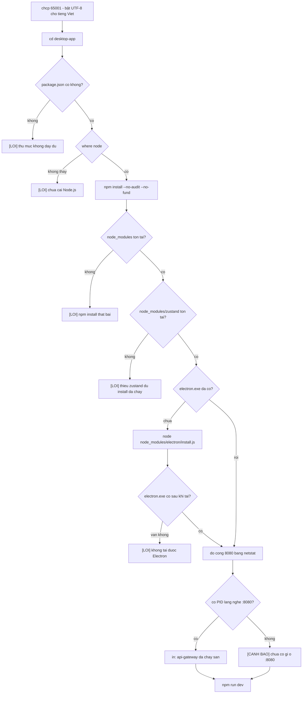

Đối chiếu với mã nguồn:

| Bước | Tệp: dòng | Ghi chú |
|---|---|---|
| `chcp 65001` | `run-frontend.bat:8-10` | giống hệt cơ chế lưu/khôi phục code page ở `run-backend.bat` |
| `cd /d "%ROOT%desktop-app"` | `run-frontend.bat:26-31` | báo lỗi rõ ràng nếu không thấy thư mục |
| kiểm `package.json` | `run-frontend.bat:33-37` | |
| `where node` | `run-frontend.bat:39-45` | in cả `node --version` nếu tìm thấy |
| `npm install --no-audit --no-fund` | `run-frontend.bat:50` | hai cờ chỉ tắt bớt output phụ, không đổi hành vi cài đặt |
| kiểm `node_modules` | `run-frontend.bat:52-57` | |
| kiểm gói `zustand` | `run-frontend.bat:59-64` | xem giải thích ★ bên dưới |
| kiểm/tải Electron runtime | `run-frontend.bat:66-79` | chạy `node node_modules\electron\install.js` nếu thiếu `node_modules\electron\dist\electron.exe` |
| dò cổng 8080 bằng `netstat` | `run-frontend.bat:81-92` | chỉ CẢNH BÁO, không chặn |
| `npm run dev` | `run-frontend.bat:95` | lệnh cuối, chạy mãi cho tới khi đóng cửa sổ |

★ **Vì sao kiểm riêng gói `zustand` thay vì tin `npm install` trả về mã 0.** `npm install` có thể kết thúc với exit code 0 (không báo lỗi) trong khi cây phụ thuộc thực tế vẫn thiếu gói — ví dụ do một lần chạy trước bị ngắt giữa chừng (Ctrl+C, mất mạng, hết đĩa) để lại `node_modules` ở trạng thái dở dang mà lần install sau không phát hiện ra cần sửa. Kiểm sự tồn tại của `node_modules` là phép thử ở mức thô (thư mục có tồn tại không), còn kiểm riêng một gói cụ thể như `zustand` — thư viện quản lý state mà desktop-app dùng trực tiếp — là phép thử ở mức tinh hơn: nếu ngay cả một gói khai trong `package.json` cũng không có mặt trên đĩa, gần như chắc chắn `npm install` đã thất bại âm thầm, dù exit code không phản ánh điều đó.

⚠ **Cảnh báo khi cổng 8080 trống — trích nguyên văn:**

**Tệp:** `run-frontend.bat:85-92`

```
echo.
echo [CẢNH BÁO] Không có gì lắng nghe ở cổng 8080 - api-gateway chưa chạy.
echo            Giao diện VẪN mở được, nhưng mỗi lần tìm - và cả tab Bóng đá,
echo            vốn đi qua tuyến /api/football của Gateway - đều báo lỗi kết nối.
echo            Mở một cửa sổ khác và chạy: run-backend.bat
echo            ^(đợi đến khi nó báo "api-gateway sẵn sàng"^)
```

Đây không phải lỗi chặn (`goto :fail`) — `run-frontend.bat` vẫn tiếp tục xuống `npm run dev` bình thường. Electron/Vite mở lên hoàn toàn bình thường về mặt giao diện; chỉ có các lệnh gọi API (tìm kiếm, tab Bóng đá vì nó cũng đi qua Gateway ở tuyến `/api/football`) là thất bại vì không có ai lắng nghe ở đầu kia.

★ **Vì sao `run-backend.bat` đợi gateway trả lời `UP` TRƯỚC rồi mới mở giao diện (ở đường local).** Vòng lặp `:wait_gw` (`run-backend.bat:369-386`) gọi `Invoke-WebRequest` tới `http://localhost:8080/actuator/health` mỗi 3 giây, tối đa 180 giây, cho tới khi nhận `StatusCode -eq 200`. Chỉ sau khi thoát vòng lặp này (dù thành công hay hết giờ) thì script mới đi tới khối in địa chỉ và mở `run-frontend.bat`. Mục đích là giảm khả năng người dùng thấy đúng cảnh báo cổng-8080-trống ở trên: nếu mở giao diện ngay lập tức song song với việc khởi động các JVM, gần như chắc chắn cửa sổ giao diện sẽ bật lên và người dùng bấm tìm kiếm trước khi Spring Boot kịp load xong context (việc này thường mất 10-30 giây với search-service vì phải nạp chỉ mục vào heap). Đợi gateway `UP` trước là cách xếp hàng hai bước khởi động theo đúng thứ tự phụ thuộc thực sự của chúng, dù cái giá là người dùng phải chờ thêm vài chục giây trước khi thấy cửa sổ Electron.

Lưu ý: cơ chế đợi này chỉ tồn tại ở đường `--local`. Đường Docker không có bước tương đương — nó gọi `docker compose ps` một lần rồi mở giao diện ngay, bất kể container `api-gateway` đã ở trạng thái `healthy` hay còn `starting`. Vì vậy cảnh báo cổng-8080-trống ở `run-frontend.bat` thực ra có nhiều khả năng xuất hiện hơn ở đường Docker (do build image lần đầu có thể tốn thêm thời gian ngoài phần "đợi health") so với đường local.

---

## 40. Đường tắt: end-backend.bat

### 40.1. Bảng cờ

| Cờ | Biến được set | Hành vi (đọc từ mã) |
|---|---|---|
| `--local` | `LOCAL_ONLY=1` | Chỉ giết tiến trình đang giữ cổng 8080-8087/8090 (`:kill_port`), nhảy thẳng tới `:wsl_step` — hoàn toàn không đụng Docker (`run-backend.bat` dòng 83: `if defined LOCAL_ONLY goto :wsl_step`) |
| `--keep-docker` | `KEEP_DOCKER=1` | Vẫn hạ container bình thường, nhưng bỏ qua bước đóng Docker Desktop (`end-backend.bat:160`: `if defined KEEP_DOCKER goto :wsl_step`) |
| `--stop` | `STOP_ONLY=1` và cũng set `KEEP_DOCKER=1` | Chạy `docker compose %PROFILES% stop` thay vì `down` — container vẫn còn, chỉ dừng, để bật lại nhanh; và vì tự set kèm `KEEP_DOCKER`, Docker Desktop cũng không bị đóng (`end-backend.bat:26-28`) |
| `--wipe` | `WIPE=1` | Sau khi xác nhận, chạy `docker compose %PROFILES% down --volumes --remove-orphans` — xoá cả volume dữ liệu |
| `--wsl` | `KILL_WSL=1`, xoá `NO_WSL` | Tắt hẳn máy ảo WSL2 bằng `wsl --shutdown`, KHÔNG hỏi lại (`end-backend.bat:258`: `if defined KILL_WSL goto :wsl_kill`) |
| `--no-wsl` | `NO_WSL=1`, xoá `KILL_WSL` | Bỏ qua hoàn toàn bước xử lý WSL2, không hỏi gì (`end-backend.bat:240`: `if defined NO_WSL goto :report`) |
| `--help` / `-h` | — | In hướng dẫn (`:usage`) rồi thoát mã 0, không làm gì khác |

`--wsl` và `--no-wsl` loại trừ lẫn nhau qua việc mỗi cờ tự xoá biến của cờ kia khi được đọc (`end-backend.bat:31-36`), nên nếu gõ cả hai thì cờ xuất hiện SAU cùng thắng.

### 40.2. Hệ thống đếm bước và `TOTAL` động

**Tệp:** `end-backend.bat:53-57`

```
set /a TOTAL=3
if not defined LOCAL_ONLY set /a TOTAL+=2
if not defined LOCAL_ONLY if not defined KEEP_DOCKER set /a TOTAL+=1
if not defined NO_WSL set /a TOTAL+=1
set /a STEP=0
```

`TOTAL` bắt đầu từ 3 bước cố định luôn chạy (dừng jar/binary, "Kiểm chứng xem đã giải phóng thật chưa", "Báo cáo RAM"), rồi cộng thêm tuỳ cờ:

| Điều kiện | Cộng thêm | Vì sao |
|---|---|---|
| không có `--local` | +2 | thêm bước "Kiểm tra Docker engine" và "Dừng/hạ container Docker" |
| không có `--local` VÀ không có `--keep-docker` | +1 | thêm bước "Đóng Docker Desktop và trả RAM của máy ảo" |
| không có `--no-wsl` | +1 | thêm bước "Máy ảo WSL2 - trả RAM về cho Windows" |

Hàm `:step` (`end-backend.bat:365-373`) dùng `TOTAL` này để tính phần trăm (`PCT=STEP*100/TOTAL`) và vẽ thanh tiến trình ASCII 20 ô (`#` cho phần đã xong, `.` cho phần còn lại) — vì các bước bị bỏ qua tuỳ cờ, `TOTAL` phải tính động trước khi bước đầu tiên chạy, nếu không thanh tiến trình sẽ không bao giờ chạm 100%.

### 40.3. `:kill_port` — giết cổng 8080-8087 và 8090

**Tệp:** `end-backend.bat:69-77`

```
call :kill_port 8080 api-gateway
call :kill_port 8081 auth-service
call :kill_port 8082 search-service
call :kill_port 8083 "crawler-service (chỉ khi --crawler)"
call :kill_port 8084 analytics-service
call :kill_port 8085 "history-service (Go)"
call :kill_port 8086 "downloads-service (Go)"
call :kill_port 8087 "settings-service (Go)"
call :kill_port 8090 "football-service (Go)"
```

`:kill_port` dò PID đang `LISTENING` trên cổng bằng `netstat -ano`, rồi kiểm tên tiến trình (`tasklist /FI "PID eq ..."`) trước khi giết — nếu tên tiến trình chứa `docker`/`vpnkit`/`wslrelay`/`com.docker`, nó CHỦ ĐỘNG BỎ QUA (đặt `SKIPPED=1`) thay vì `taskkill`, vì giết nhầm tiến trình nền của Docker Desktop sẽ làm chết luôn Docker engine, khiến bước `docker compose down` phía sau không còn chạy được nữa. Ghi chú trong mã (`end-backend.bat:403-409`) còn nêu một lỗi thật đã sửa: nhãn dịch vụ Go có ngoặc đơn — ví dụ `"history-service (Go)"` — nên nếu dùng khối `if (...)` thay vì `goto`, cmd.exe phân tích cú pháp cả khối TRƯỚC khi biết nhánh nào chạy, và dấu `)` trong `(Go)` đóng sớm khối lệnh, khiến toàn bộ tệp dừng lại ngay ở cổng 8085 với lỗi cú pháp — bỏ lại các binary Go, container và Docker Desktop chưa tắt.

### 40.4. `--profile` khi hạ container

★ **Tệp:** `end-backend.bat:112-114`

```
REM Liet ke MOI ho so, ke ca `crawler`: khong co ten ho so thi
REM `docker compose down` bo qua container cua ho so do va no cu chay tiep.
set "PROFILES=--profile kafka --profile monitoring --profile crawler"
```

Trong Docker Compose, một container gán vào một `profile` (như `crawler`, `kafka`, `monitoring`) chỉ được lệnh `docker compose` "nhìn thấy" khi lệnh đó chạy kèm `--profile <tên>` tương ứng — kể cả cho các thao tác quản lý như `down` hay `stop`, không riêng gì `up`. Nếu người dùng từng chạy `run-backend.bat --crawler` (bật crawler-service), rồi gõ tay `docker compose down` (không kèm `--profile crawler`), lệnh đó sẽ hạ đúng những container KHÔNG thuộc hồ sơ nào, còn `vnsearch-crawler` bị bỏ sót và tiếp tục chạy, âm thầm chiếm RAM. `end-backend.bat` tránh bẫy này bằng cách luôn liệt kê ĐỦ CẢ BA hồ sơ khi gọi `down`/`stop`, bất kể lúc khởi động có dùng cờ nào hay không — đây chính là lý do tài liệu khuyến nghị dùng `end-backend.bat` thay vì gõ `docker compose down` trực tiếp bằng tay.

### 40.5. Đóng Docker Desktop

**Tệp:** `end-backend.bat:185-232`

Trình tự ưu tiên, ba tầng:

| Tầng | Lệnh | Đặc điểm |
|---|---|---|
| 1 (ưu tiên) | `docker desktop stop` | CLI chính thức của Docker Desktop, CHỜ tới khi đóng xong |
| 2 (dự phòng) | `"Docker Desktop.exe" -Shutdown` | chỉ báo tín hiệu cho GUI rồi trả về NGAY, dùng cho bản Docker Desktop cũ chưa có CLI plugin |
| 3 (hết giờ) | `taskkill /F /IM "Docker Desktop.exe" /T` + 3 tiến trình con `com.docker.*` | chạy khi đợi quá 60 giây (`DD_WAIT GEQ 60`) mà tiến trình vẫn còn |

Chú thích trong mã giải thích vì sao ưu tiên tầng 1:

```
REM `docker desktop stop` la CLI chinh thuc cua Docker Desktop va no CHO cho
REM toi khi dong xong. Uu tien no.
REM
REM `"Docker Desktop.exe" -Shutdown` chi GUI mot tin hieu roi tra ve ngay, va
REM tren may nay no khong dong noi: ca hai lan do deu het 90 giay cho ma tien
REM trinh van con. Giu lai lam duong du phong cho ban Docker Desktop cu chua
REM co CLI plugin.
```

Sau khi `taskkill` chạy, mã KHÔNG tin ngay là đã xong — nó kiểm lại lập tức bằng `tasklist`:

```
REM Kiem lai NGAY, thay vi tin la taskkill da xong viec.
tasklist /FI "IMAGENAME eq Docker Desktop.exe" /NH | findstr /i /c:"Docker Desktop.exe" >nul
if errorlevel 1 goto :dd_gone
echo   [CẢNH BÁO] Docker Desktop VẪN còn tiến trình sau khi taskkill.
echo              Đóng tay ở khay hệ thống: chuột phải - Quit Docker Desktop.
```

Nếu vẫn còn, tệp báo `[CẢNH BÁO]` và hướng dẫn người dùng tự đóng tay ở khay hệ thống, thay vì lặng lẽ coi như đã xong.

⚠ **Lỗi lịch sử đã sửa — bước `:wsl_step` từng bị mắc kẹt trong khối đóng Docker Desktop.**

**Tệp:** `end-backend.bat:234-239`

```
:wsl_step
REM Bước này phải nằm NGOÀI khối tắt Docker Desktop. Trước đây nó nằm ở cuối
REM khối đó, sau bảy nhánh `goto :report` — nên `--wsl` chỉ chạy đúng một
REM đường duy nhất: Docker Desktop đang mở VÀ đóng xong trong 90 giây. Mọi
REM đường khác (đã tắt Docker từ trước, dùng --local, --stop, --keep-docker,
REM hay hết 90 giây chờ) đều nhảy qua nó mà không báo gì.
```

Trước khi sửa, nhãn xử lý WSL2 nằm ở cuối khối "đóng Docker Desktop" — nghĩa là bảy nhánh `goto :report` khác nhau (không có docker, engine đã tắt sẵn, `--stop`, `--keep-docker`, hay hết 90 giây chờ đóng) đều nhảy thẳng qua bước WSL2 mà không chạy nó, dù người dùng đã gõ `--wsl`. Bug này khiến `--wsl` chỉ "thật sự hoạt động" trên đúng một tổ hợp trạng thái hẹp — Docker Desktop đang mở lúc bắt đầu VÀ đóng thành công trong giới hạn thời gian — và im lặng bỏ qua ở mọi trường hợp khác, không hề báo lỗi hay cảnh báo gì, khiến người dùng tưởng cờ đã chạy trong khi RAM của máy ảo WSL2 vẫn y nguyên. Bản sửa tách `:wsl_step` ra thành một nhãn độc lập ở NGOÀI khối đóng Docker Desktop, để mọi nhánh phía trên — kể cả `--local` — đều đi qua nó.

### 40.6. `--wipe`

**Tệp:** `end-backend.bat:136-157`

Volume bị xoá khi xác nhận:

| Volume | Nội dung |
|---|---|
| `postgres-data` | toàn bộ CSDL tài liệu đã crawl |
| `mongo-data` | dữ liệu lịch sử và tải xuống |
| `kafka-data` | log các topic |
| `prometheus-data` | lịch sử số liệu đo |
| `grafana-data` | người dùng và thiết lập Grafana |

Yêu cầu gõ đúng chữ `XOA` (không phân biệt hoa/thường, `/i not "%CONFIRM%"=="XOA"`) mới tiếp tục; bất kỳ input nào khác — kể cả Enter suông — bị coi là huỷ và nhảy tới `:fail`. Tệp ghi rõ ràng: **corpus JSON trong `backend\data` KHÔNG bị ảnh hưởng**, vì nó là file thật nằm trên đĩa máy chủ (bind mount hoặc thư mục thường), không phải named volume của Docker — `docker compose down --volumes` chỉ xoá các volume do compose quản lý, không đụng tới đường dẫn host.

### 40.7. "Muốn X thì gõ gì"

| Muốn | Gõ |
|---|---|
| Tắt tạm để bật lại nhanh, giữ nguyên container | `end-backend.bat --stop` |
| Trả RAM tối đa (tắt cả container, Docker Desktop, và hỏi tắt cả WSL2) | `end-backend.bat` (mặc định, không cờ) |
| Chỉ tắt jar/binary chạy trực tiếp, không đụng Docker | `end-backend.bat --local` |
| Xoá sạch dữ liệu (Postgres/Mongo/Kafka/Prometheus/Grafana) | `end-backend.bat --wipe` |
| Hạ container nhưng giữ Docker Desktop chạy | `end-backend.bat --keep-docker` |
| Đòi lại RAM của WSL2 ngay, không cần hỏi | `end-backend.bat --wsl` |
| Không muốn bị hỏi gì về WSL2 | `end-backend.bat --no-wsl` |
---
---

# PHẦN VII — ĐỐI CHIẾU SỐ LIỆU THẬT

---

## 41. Bảng `-Xmx` (local) ↔ `mem_limit` (docker)

Hai đường chạy — `run-backend.bat --local` và `run-backend.bat --docker` (mặc định) — dùng hai cơ chế khống chế bộ nhớ hoàn toàn khác nhau cho CÙNG một tập service Java, và bảng dưới đây đối chiếu chúng số-đối-số. Cột "heap suy ra" là `mem_limit × MaxRAMPercentage`; cột "`-Xmx` bat truyền" lấy trực tiếp từ các dòng `call :launch` trong `run-backend.bat`.

| service | cổng | `mem_limit` (compose) | `MaxRAMPercentage` áp dụng | heap suy ra | `-Xmx` bat truyền | khớp/lệch |
|---|---|---|---|---|---|---|
| api-gateway | 8080 | 384m | 70 (Dockerfile) | 268.8m | `256m` | thấp hơn ~13 MB — đệm ngoài heap |
| auth-service | 8081 | 384m | 70 (Dockerfile) | 268.8m | `256m` | thấp hơn ~13 MB — đệm ngoài heap |
| search-service | 8082 | 2560m | **75** (compose ghi đè) | 1920m | `1920m` | **khớp chính xác** |
| crawler-service | 8083 | 2048m | 70 (Dockerfile) | 1433.6m | `1400m` | thấp hơn ~34 MB — đệm ngoài heap |
| analytics-service | 8084 | 320m | 70 (Dockerfile) | 224m | `224m` | **khớp chính xác** |
| history-service (Go) | 8085 | 96m | — | — | *không có `-Xmx`* | không có trần nào ở `--local` |
| downloads-service (Go) | 8086 | 96m | — | — | *không có `-Xmx`* | không có trần nào ở `--local` |
| settings-service (Go) | 8087 | 96m | — | — | *không có `-Xmx`* | không có trần nào ở `--local` |
| football-service (Go) | 8090 | 96m | — | — | *không có `-Xmx`* | không có trần nào ở `--local` |

★ **Vì sao con số local hơi THẤP hơn 70%/75% tính ra**: `-Xmx` chỉ chặn HEAP. `mem_limit` là trần cho toàn bộ tiến trình — heap cộng metaspace, cộng code cache đã biên dịch, cộng ngăn xếp của mọi luồng, cộng bộ nhớ ngoài-heap của Netty/NIO. Làm tròn `-Xmx` xuống dưới con số lý thuyết (256 thay vì 268.8, 1400 thay vì 1433.6) là cách `run-backend.bat` để lại khoảng đệm cho đúng những phần đó — dù ở `--local` không ai thật sự thi hành khoảng đệm này (xem mục dưới). Bốn service Go không có JVM nên không có khái niệm `-Xmx`; ở `--local` chúng chạy với toàn bộ RAM máy sẵn có, không trần.

### Ba trần ngoài heap: hai đường có đồng bộ không?

| tham số | `run-backend.bat :launch` (MỌI service) | `Dockerfile` (mặc định, 4/5 service Java) | `docker-compose.yml` ghi đè cho `search-service` |
|---|---|---|---|
| `MaxMetaspaceSize` | `160m` | `160m` | `192m` |
| `ReservedCodeCacheSize` | `48m` | `48m` | `96m` |
| `Xss` (ngăn xếp/luồng) | `512k` | `512k` | *(bị mất — khối ghi đè không nhắc lại nó, nên search-service trong container dùng mặc định 1 MB/luồng)* |

⚠ **Đây là một lệch thật sự đáng nêu**: ở đường `--local`, `search-service` chạy với `MaxMetaspaceSize=160m` và `ReservedCodeCacheSize=48m` — vì `:launch` dùng đúng MỘT công thức JVM_OPTS cho mọi service, không phân biệt. Nhưng bản container của chính `search-service` được compose ghi đè lên `192m`/`96m` — RỘNG HƠN. Nói cách khác, ở `--local`, service tốn nhiều bộ nhớ nhất hệ thống lại chạy với hai trần ngoài heap CHẶT HƠN bản container của chính nó. Hậu quả có thể xảy ra mà không để lại ngoại lệ rõ ràng: `ReservedCodeCacheSize=48m` đầy khiến JIT ngừng biên dịch thêm — không phải crash, chỉ là hiệu năng tụt âm thầm; còn `MaxMetaspaceSize=160m` đầy thì ném thẳng `OutOfMemoryError: Metaspace`, khác hẳn `OutOfMemoryError: Java heap space` mà chú thích trong compose mô tả — hai thông điệp lỗi trỏ người đọc đi hai hướng khác nhau dù cùng một triệu chứng bề ngoài (service không lên). Đây là điểm nên đồng bộ (`:launch` cần một nhánh riêng cho `search-service` giống cách nó đã có nhánh riêng cho ngưỡng GC — xem dưới), hiện tại chưa có.

### Bộ dọn rác: ba nơi, ba cơ chế, cùng một kết luận

| nơi quyết định | cơ chế chọn | search-service | crawler-service | 3 service Java còn lại |
|---|---|---|---|---|
| `run-backend.bat :launch` | so `%~3` (số MB) với ngưỡng `512` | 1920 > 512 → G1 | 1400 > 512 → G1 | ≤ 512 → SerialGC |
| `Dockerfile` (mặc định) | cố định `UseSerialGC` + `TieredStopAtLevel=1` cho MỌI build | *(bị compose ghi đè)* | *(giữ nguyên mặc định)* | SerialGC + C1 |
| `docker-compose.yml` | ghi đè `JAVA_TOOL_OPTIONS` riêng cho từng service | G1 + `MaxGCPauseMillis=200` + `UseStringDeduplication` | *(không ghi đè — dùng SerialGC của Dockerfile)* | không ghi đè |

★ Điểm đáng chú ý: **crawler-service dùng SerialGC ở cả hai đường**, kể cả với heap 1400 MB — trái với nguyên tắc "SerialGC chỉ hợp với heap nhỏ" mà chính Dockerfile giải thích. Đây không phải lỗi đồng bộ giữa hai đường (cả hai đồng ý với nhau), mà là một lựa chọn riêng: crawler không chạy vòng lặp chấm điểm dày đặc như search, nên chưa ai thấy cần đổi. Ba nơi đi tới cùng kết luận cho `search-service` (G1) bằng ba cơ chế khác nhau — ngưỡng số học ở bat, giá trị mặc định ở Dockerfile, ghi đè tường minh ở compose — nhưng KHÔNG ai đồng bộ hai trần ngoài heap của cùng service đó, như mục ⚠ ở trên đã nêu.

### Ba dịch vụ hạ tầng và bốn service Go: cùng bảng ngân sách, không có JVM nào cả

Không phải mọi dòng trong bảng ngân sách của `docker-compose.yml` đều liên quan tới `MaxRAMPercentage` — ba CSDL và bốn service Go bị chặn bằng cơ chế hoàn toàn khác, và đáng liệt kê riêng để không nhầm chúng vào bảng `-Xmx` ở trên:

| service | mem_limit | cơ chế chặn thật sự | trích chú thích |
|---|---|---|---|
| postgres | 384m | `shared_buffers=128MB` + `work_mem=2MB` × `max_connections=50` đặt trong `command:` | "128 MB thay vì mặc định 128 MB... nhưng PostgreSQL còn cấp phát work_mem cho MỖI phép sắp xếp của MỖI kết nối. Bốn service nhân năm kết nối nhân 4 MB là 80 MB chỉ riêng phần đó." |
| mongo | 384m | `--wiredTigerCacheSizeGB 0.25` đặt trong `command:` | "Mặc định WiredTiger lấy 50% RAM MÁY trừ 1 GB... KHÔNG tự đọc giới hạn của Docker, nên container sẽ bị hệ điều hành giết ngay khi dữ liệu lớn lên." |
| redis | 128m | `--maxmemory 100mb` + `--maxmemory-policy allkeys-lru` đặt trong `command:` | "Refresh token và denylist đều CÓ HẠN DÙNG, nên đuổi mục cũ nhất khi đầy là hành vi đúng." |
| football/history/downloads/settings-service (Go) | 96m mỗi cái | KHÔNG có cờ nào — nhị phân Go tĩnh, không có runtime nào để giới hạn heap; `mem_limit` là trần cứng duy nhất | "một nhị phân Go tĩnh không có JVM để khởi động, và 288 MB tiết kiệm được ở mỗi cái là gần 1,2 GB trên toàn hệ thống" (so với thời còn là Spring Boot, 384 MB/cái) |

★ Điểm khác biệt cấu trúc quan trọng: với `postgres`/`redis`/`mongo`, ứng dụng BÊN TRONG container tự đọc và tôn trọng giới hạn (`shared_buffers`, `maxmemory`, `wiredTigerCacheSizeGB`) — `mem_limit` của Docker chỉ là lưới an toàn thứ hai. Với bốn service Go, KHÔNG có lớp tự-giới-hạn nào ở tầng ứng dụng; toàn bộ việc chặn bộ nhớ dồn hết vào `mem_limit`. Đây là lý do Go binary không có gì tương ứng với cột "`-Xmx` bat truyền" ở bảng đầu mục — không phải vì bat quên viết, mà vì không có tham số dòng lệnh nào ở phía Go để truyền.

### Vì sao Dockerfile chọn 70 chứ không phải 75 hay 90

Trích nguyên văn chú thích của `backend/java/Dockerfile` (dòng 120–124):

> "Vì sao 70 chứ không phải 75 hay 90: heap KHÔNG phải toàn bộ bộ nhớ một tiến trình JVM dùng. Ngoài nó còn metaspace, ngăn xếp luồng, bộ đệm mã đã biên dịch, và bộ nhớ ngoài heap của Netty. Đặt quá cao thì container bị hệ điều hành giết vì OOM trong khi heap vẫn còn chỗ — một kiểu hỏng đặc biệt khó chẩn đoán, vì log Java không để lại dấu vết nào."

Đây là lý do gốc cho toàn bộ bảng ở mục 41: 70% không phải một con số tuỳ tiện, mà là phần trăm được chọn để CHỪA LẠI đúng 30% cho những thứ `-Xmx`/`MaxRAMPercentage` không với tới — và `search-service` được phép nới lên 75% chỉ vì hai trong số những thứ đó (metaspace, code cache) đã bị compose chặn cứng bằng số tuyệt đối ngay bên cạnh, nên phần "để dành" không cần rộng bằng bốn service Java còn lại nữa. Nói cách khác, 70 vs. 75 không phải hai triết lý khác nhau — cùng một phép tính, chỉ khác ở chỗ phần đệm được đặt tường minh hay để ẩn trong tỉ lệ phần trăm.

★ Hệ quả cho người đọc `:usage` trong `run-backend.bat`: dòng `mem_limit` liệt kê ở đó (xem mục 44) là trần TỔNG, không phải heap — nhầm hai khái niệm này là lý do phổ biến nhất khiến người ta đặt `-Xmx` bằng đúng `mem_limit`, tức là xoá luôn phần đệm 25–30% mà cả Dockerfile lẫn `:launch` đều cố tình chừa ra.

---

### Đối chiếu với khối `:usage` — con số hiển thị cho người dùng có khớp mã không

`run-backend.bat` in ra bảng trần RAM ngay trong `run-backend.bat --help`. Trích nguyên văn:

> ```
> Trần RAM (mem_limit trong docker-compose.yml, hoặc -Xmx ở chế độ --local):
>   search-service 2560   crawler 2048 (tắt)   auth 384   gateway 384
>   analytics 320   postgres 384   mongo 384   redis 128   4 service Go 96 mỗi cái
> Tổng trần mặc định 4928 MB. search-service chiếm hơn nửa vì chỉ mục đảo
> nằm trong heap - dưới 2304 MB nó OOM, đã đo.
> ```

Đối chiếu từng số với `docker-compose.yml`: `search-service 2560` khớp `mem_limit: 2560m`; `crawler 2048` khớp `mem_limit: 2048m`; `auth 384`, `gateway 384`, `analytics 320`, `postgres 384`, `mongo 384`, `redis 128` đều khớp. Câu "search-service chiếm hơn nửa" cũng đúng theo số học: 2560/4928 ≈ 52%. Duy một điểm cần đọc kỹ chứ không phải sai: khối `:usage` gọi cột này là "`mem_limit`... hoặc `-Xmx` ở chế độ `--local`" — nói đúng theo nghĩa hai con số CÙNG GIÁ TRỊ (như bảng đầu mục 41 đã đối chiếu), nhưng dễ khiến người đọc nghĩ rằng hai cơ chế đứng sau hai con số đó cũng tương đương — trong khi mục 41 vừa chỉ ra chúng không hề tương đương (một bên là trần cứng của hệ điều hành, một bên chỉ là trần heap của riêng JVM).

---

## 42. Vì sao search-service là 2560 MB

Trích nguyên văn bảng đo tại chỗ trong `docker-compose.yml`:

> ```
> 2048 MB (heap 1536) OOM, khởi động lại vô hạn
> 2304 MB (heap 1728) lên `healthy`, ổn định ở 1,97 GB
> 2560 MB (heap 1920) lên `healthy` — chọn con số này
> 4096 MB (heap 2867) lên `healthy`, dùng tới 2,88 GB
> ```

Đo trên corpus tại thời điểm ghi chú: **`index.json` 510 MB + `crawled-documents` 487 MB + 39552 ảnh**.

| mem_limit | heap (75%) | kết quả | ổn định ở |
|---|---|---|---|
| 2048m | 1536m | OOM ngay lúc nạp chỉ mục, khởi động lại vô hạn | — |
| 2304m | 1728m | `healthy` | 1,97 GB |
| **2560m** | **1920m** | **`healthy` — con số được chọn** | — |
| 4096m | 2867m | `healthy` | 2,88 GB |

★ **Vì sao "4096 dùng tới 2,88 GB" KHÔNG có nghĩa là service CẦN chừng đó bộ nhớ.** Đây là cái bẫy đọc số đo phổ biến nhất của bảng này. G1GC không dọn rác ngay khi có rác — nó lấp gần hết phần heap được cấp trước khi bắt đầu một chu kỳ dọn nghiêm túc, vì dọn sớm tốn CPU mà chưa cần thiết. Cấp 4096 MB không đồng nghĩa "cần 4096 MB"; nó chỉ có nghĩa "có 4096 MB thì G1 sẽ lấp gần hết trước khi dọn". Muốn biết nhu cầu THẬT phải nhìn dòng 2304 (heap 1728, ổn định 1,97 GB — tức là gần chạm trần, không còn nhiều khoảng trống) chứ không phải dòng có trần lớn nhất.

★ **Vì sao chỉ mục nằm trong heap chứ không phải ở đâu khác**: chỉ mục đảo (inverted index), Trie gợi ý (autocomplete), và vector PageRank đều là cấu trúc dữ liệu Java sống trong heap — không phải cache ngoài tiến trình, không phải memory-mapped file. Hệ quả trực tiếp: kích thước của chúng tỉ lệ với **kích thước corpus**, không tỉ lệ với số người dùng đồng thời hay lưu lượng truy vấn. Một service CRUD thông thường cần nhiều heap hơn khi có NHIỀU NGƯỜI DÙNG hơn; `search-service` cần nhiều heap hơn khi CRAWL THÊM TRANG, bất kể có một hay một nghìn người tìm kiếm cùng lúc. Hệ quả vận hành trực tiếp — được ghi thẳng trong compose: "Corpus phình tiếp thì đây là con số phải nâng đầu tiên."

`start_period: 90s` trong healthcheck của `search-service` tồn tại vì đúng lý do trên: service này **dựng lại chỉ mục lúc khởi động** (nạp `index.json` 510 MB vào cấu trúc trong heap), và việc đó tốn thời gian tỉ lệ với corpus. Đây là mối liên hệ chết người giữa ba cơ chế:


⚠ **Ở đường `--local` KHÔNG có `restart: unless-stopped`** — cờ đó chỉ tồn tại trong `docker-compose.yml`, không có khái niệm tương đương khi `:launch` gọi `Start-Process` trực tiếp. Nên OOM ở `--local` là **chết hẳn, một lần**, không lặp vô hạn. Nghịch lý thú vị: đây lại là hành vi **DỄ CHẨN ĐOÁN HƠN** so với đường Docker — thay vì phải nhận ra "container cứ khởi động lại mãi mà không rõ vì sao" (một trạng thái động, phải `docker compose logs` đúng lúc để bắt được), người vận hành chỉ cần mở `backend\logs\search-service.err.log` một lần và thấy ngay dòng `OutOfMemoryError`, đứng yên, không bị ghi đè bởi lần khởi động lại tiếp theo.

### Corpus phình thêm thì sao — đọc lại bảng đo theo hướng dự báo

Bảng đo ở đầu mục 42 chỉ có bốn điểm dữ liệu, nhưng đọc chúng theo cặp (trần, kết quả) hé lộ được biên độ an toàn hiện tại:

| bước nhảy trần | bước nhảy heap | chuyển từ OOM sang healthy? |
|---|---|---|
| 2048 → 2304 (+256m, +12,5%) | 1536 → 1728 (+192m) | CÓ — đây là ranh giới sống-chết |
| 2304 → 2560 (+256m, +11,1%) | 1728 → 1920 (+192m) | đã healthy ở cả hai, khoảng đệm thêm |
| 2560 → 4096 (+1536m, +60%) | 1920 → 2867 (+947m) | đã healthy ở cả hai, không đo được ranh giới trên |

★ Với corpus hiện tại (510 MB index + 487 MB documents + 39552 ảnh), ranh giới sống-chết nằm đâu đó NGAY DƯỚI 2304m, và `2560m` là 2304m cộng một khoảng đệm ~11% cho corpus lớn thêm — không phải một hệ số an toàn lớn. Đây là con số CẦN THEO DÕI khi corpus tăng: chú thích trong compose đã nói thẳng "Corpus phình tiếp thì đây là con số phải nâng đầu tiên", và bảng trên cho thấy khoảng đệm hiện có không lớn — một đợt crawl thêm vài chục phần trăm dữ liệu nhiều khả năng đã đủ đẩy service quay lại vùng OOM của dòng đầu bảng đo.

### Vì sao 1920m — không phải 2560m — là con số đi vào `:launch`

Đây là một chỗ hay gây nhầm lẫn khi đọc `run-backend.bat` cạnh `docker-compose.yml`: dòng `call :launch search-service 8082 1920` KHÔNG "hạ" trần của search-service xuống so với Docker. `1920` chính là **heap** — con số đã đi qua phép nhân `2560 × 75% = 1920` — chứ không phải một trần độc lập được chọn riêng cho `--local`. Ở đường Docker, `2560m` là `mem_limit` (trần cho cả tiến trình) và JVM tự suy ra heap `1920m` từ `MaxRAMPercentage=75`. Ở đường `--local`, không có khái niệm `mem_limit`, nên tệp bat truyền thẳng con số heap đã tính sẵn, bỏ qua bước "suy luận từ tỉ lệ phần trăm" mà JVM phải làm trong container. Hai đường vì vậy có HEAP giống hệt nhau (1920m); khác biệt duy nhất là đường `--local` không có gì chặn phần ngoài-heap của tiến trình ở mức hệ điều hành — như đã nêu ở mục 41, dòng "Trần bộ nhớ" của bảng bảy khác biệt.

---

## 43. Vì sao crawler-service bị đẩy ra sau hồ sơ riêng

Trích nguyên văn chú thích trong `docker-compose.yml`:

> "2 GB, KHÔNG phải 768 MB. Con số cũ được tính cho 'frontier + bộ lọc Bloom' và đúng với riêng phần đó — nhưng nó bỏ sót khối `volumes` ngay bên trên: service này mount cùng thư mục `data/` với search-service, và thư mục đó chứa index.json 385 MB cộng crawled-documents.json 367 MB."
>
> "Nạp chúng vào một heap 537 MB (768 × MaxRAMPercentage=70) là hết bộ nhớ ngay trong lúc khởi động, rồi `ExitOnOutOfMemoryError` giết tiến trình và `restart: unless-stopped` bật lại — một vòng lặp không lối ra, và triệu chứng duy nhất là container mãi không lên `healthy`."
>
> "Đo được: 768 MB mà KHÔNG mount data/ thì khởi động bình thường; 768 MB có mount thì OOM; 2 GB có mount thì lên sau ~7 giây và ổn định ở 338 MB."

| trần thử | mount `data/`? | kết quả | ổn định ở |
|---|---|---|---|
| 768m | không | khởi động bình thường | — |
| 768m | có | OOM ngay lúc nạp | — |
| **2048m** | có | `healthy` sau ~7s | **338 MB** |

★ **Nghịch lý đáng nêu**: trần 2048 MB được cấp cho một tiến trình mà khi ổn định chỉ dùng 338 MB — chưa tới 1/6 trần. Lý do KHÔNG hạ được trần xuống thấp hơn: trần phải đủ cho **đỉnh lúc nạp** (đọc và xử lý toàn bộ `index.json` + `crawled-documents.json` vào heap khi khởi động), không phải cho **trạng thái ổn định** sau đó. Đây là cùng một lớp bẫy như ở mục 42 — chỉ khác chiều: ở search-service bẫy là "trần lớn không có nghĩa là CẦN", ở crawler-service bẫy là "dùng ít lúc chạy không có nghĩa là ĐẶT ĐƯỢC trần thấp".

**Lý do tách hồ sơ `crawler` (`profiles: [crawler]`, không chạy mặc định)**: `crawler-service` nạp CHÍNH bản chỉ mục mà `search-service` đã nạp (cùng thư mục `data/`, mount chung), chỉ để phục vụ đúng MỘT nhóm endpoint quản trị (`/api/admin/**`). Việc tìm kiếm của người dùng cuối không đụng tới service này một chút nào, và `run-crawl.bat` — kịch bản chạy crawl thật — cũng KHÔNG gọi tới nó. Nói cách khác: đây là 2 GB trần RAM để phục vụ một tính năng quản trị hiếm khi dùng, đang nạp trùng lặp dữ liệu mà một service khác đã nạp rồi.

**Cái mất khi không bật hồ sơ `crawler`**: mất `/api/admin/**` và bảng điều khiển của `analytics-service`. Đáng chú ý: `analytics-service` KHÔNG khai báo `depends_on` với `crawler-service` trong compose — nó chỉ có biến môi trường `CRAWLER_SERVICE_URL: http://crawler-service:8083` trỏ tới service đó. Ở cấu hình mặc định (hồ sơ `crawler` tắt), tên DNS `crawler-service` trong mạng `vnsearch` **không phân giải được** vì container tương ứng không tồn tại — mọi lời gọi từ `analytics-service` tới nó sẽ lỗi ở tầng phân giải tên, không phải lỗi kết nối bị từ chối.

**Vì sao `crawler-service` vẫn dùng chung `x-java-service`/`x-java-env` dù nằm sau hồ sơ riêng**: trong compose, khối `crawler-service:` vẫn kế thừa `<<: *java-service` và `<<: *java-env` giống năm service Java kia — nghĩa là nó vẫn có `restart: unless-stopped`, cùng cấu hình `logging` (3 tệp × 10 MB), cùng `AUTH_JWKS_URI`/`AUTH_ISSUER_URI`/`ADMIN_API_KEY` bắt buộc. Việc "đẩy ra sau hồ sơ riêng" chỉ tác động tới MỘT dòng duy nhất — `profiles: [crawler]` — chứ không phải một cấu hình rút gọn. Khi ai đó bật `--profile crawler`, service khởi động với đầy đủ cơ chế tự-khởi-động-lại giống mọi service khác, nên vòng lặp "OOM → restart → OOM" mô tả ở trên là một nguy cơ THẬT nếu trần bị hạ nhầm trở lại 768 MB, không phải một kịch bản lý thuyết.

**Số liệu ngân sách tổng**: trần cộng dồn giảm từ **6592 MB xuống 4928 MB** (≈ 4,8 GB) nhờ ba thay đổi cộng gộp:

| thay đổi | tác động |
|---|---|
| đưa `crawler-service` (2048 MB) ra sau hồ sơ riêng | −2048 MB khi không bật |
| hạ `auth-service` từ 512 → 384 MB | −128 MB |
| nâng `search-service` từ 2048 → 2560 MB (vì 2048 đang OOM) | +512 MB |

Cộng dồn ba dòng trên vào tổng cũ 6592: 6592 − 2048 − 128 + 512 = **4928 MB**, khớp với con số ghi trong compose.

### `crawler-service` và `search-service` trên cùng một ổ đĩa dữ liệu

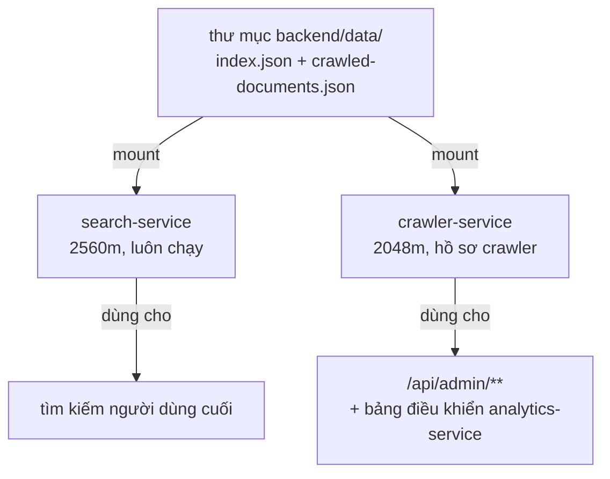

★ Việc mount chung `data/` giữa hai service là điểm mấu chốt để hiểu vì sao con số 768 MB "đúng về lý thuyết mà sai trên thực tế": tính riêng frontier và bộ lọc Bloom của crawler thì 768 MB đủ dư — chú thích trong compose xác nhận "768 MB mà KHÔNG mount data/ thì khởi động bình thường". Nhưng khối `volumes` gắn cùng thư mục dữ liệu mà `search-service` dùng buộc `crawler-service` phải nạp một bản sao của CHÍNH chỉ mục đó vào heap của riêng nó lúc khởi động — cùng một dữ liệu, hai tiến trình, hai bản sao trong bộ nhớ. Đây là lý do một service "quản trị mỏng" lại cần trần bộ nhớ chỉ đứng sau `search-service` trong toàn hệ thống.

---

## 44. ⚠ Bảy khác biệt còn lại giữa hai đường chạy

### Tám service ứng dụng, hai ngôn ngữ, một cổng lộ ra ngoài

Trước khi vào bảy khác biệt, đáng chốt lại bức tranh tổng thể mà mục 41–43 đã dựng từng phần — tám service ứng dụng chạy mặc định (chưa kể `crawler-service` sau hồ sơ riêng), theo đúng thứ tự cổng mà cả `docker-compose.yml` lẫn `run-backend.bat` dùng:

| cổng | service | ngôn ngữ | có `ports:` lộ ra máy thật (Docker)? |
|---|---|---|---|
| 8080 | api-gateway | Java | CÓ — `8080:8080` |
| 8081 | auth-service | Java | không |
| 8082 | search-service | Java | không |
| 8083 | crawler-service | Java | không (và mặc định không chạy) |
| 8084 | analytics-service | Java | không |
| 8085 | history-service | Go | không |
| 8086 | downloads-service | Go | không |
| 8087 | settings-service | Go | không |
| 8090 | football-service | Go | không |

Bảng này là cơ sở cho dòng 5 ("cách ly mạng") của bảy khác biệt bên dưới: đúng MỘT trong tám dòng có khối `ports:` ở đường Docker, và đó luôn là `api-gateway`.

### Toàn cảnh ngân sách theo hồ sơ

Bảng dưới lấy trực tiếp từ dòng chú thích "TỔNG mem_limit" của `docker-compose.yml` và khối đầu tệp liệt kê các lệnh `docker compose --profile ... up -d`:

| cấu hình | trần cộng dồn |
|---|---|
| mặc định (`docker compose up -d`, 8 service + Postgres/Redis/Mongo) | 4928 MB ≈ 4,8 GB |
| + hồ sơ `crawler` | +2048 MB → 6976 MB |
| + hồ sơ `monitoring` (Prometheus/Grafana/Alertmanager) | +544 MB → 5472 MB (không kèm crawler) |
| + hồ sơ `kafka` | +1300 MB |
| `crawler` và `monitoring` cùng lúc | 7520 MB |

Trần `memory` trong `.wslconfig` được hạ theo xuống 6 GB — đủ cho mặc định, và đủ cho mặc định cộng `monitoring`, nhưng KHÔNG đủ nếu bật thêm `crawler` cùng lúc (cần nâng lên 8 GB và `wsl --shutdown` trước). Đây là lý do `:usage` của `run-backend.bat` ghi thẳng bảng trần RAM ngay trong phần trợ giúp — người chạy `--crawler` mà chưa đọc kỹ dễ đụng trần WSL trước khi đụng trần của chính container.

### Khác biệt so với `docs/DEPLOY-PIPELINE.md`

Tài liệu đó đã lỗi thời so với `docker-compose.yml` và `run-backend.bat` hiện tại; các con số dưới đây chỉ nêu ra như đối chiếu, không phải nguồn để tin:

| điểm | `DEPLOY-PIPELINE.md` (cũ) | thực tế trong mã hiện tại |
|---|---|---|
| số service Java | 9 (kể cả `football-service`) | 5 (`api-gateway`, `auth-service`, `search-service`, `crawler-service`, `analytics-service`) — 4 service còn lại đã viết lại bằng Go |
| `football-service` | Java, 384 MB, "384 MB chứ không 64 MB như thời Go" | Go, 96 MB — đã QUAY LẠI Go, ngược hẳn hướng ghi chú cũ |
| `search-service` | 3072 MB | 2560 MB |
| `auth-service` | 512 MB | 384 MB |
| hồ sơ `monitoring` | ngụ ý chạy mặc định cùng 3 CSDL | nằm sau `--profile monitoring`, KHÔNG chạy mặc định |
| `history/downloads/settings-service` | 384 MB mỗi cái (Java) | 96 MB mỗi cái (Go) |

Không dòng nào trong bảng trên là lỗi của `docker-compose.yml` hiện tại — đây thuần tuý là bằng chứng cho thấy tài liệu cũ mô tả một kiến trúc trước đợt chuyển bốn service sang Go và trước đợt hiệu chỉnh lại ngân sách RAM ở mục 42–43.

### Bảy khác biệt vận hành

| # | khác biệt | `--docker` (mặc định) | `--local` |
|---|---|---|---|
| 1 | **Trần bộ nhớ** | `mem_limit` — trần cứng, do hệ điều hành/Docker thi hành; vượt trần là bị giết ngay | chỉ `-Xmx` + ba trần ngoài heap — đều do JVM tự thi hành, KHÔNG chặn được bộ nhớ ngoài JVM |
| 2 | **Khởi động lại khi chết** | `restart: unless-stopped` trên mọi service | không có gì tương đương — chết là chết hẳn |
| 3 | **Kiểm sức khoẻ** | healthcheck riêng cho từng container + `docker compose ps` báo trạng thái tổng | chỉ `run-backend.bat` hỏi mỗi `api-gateway` qua `/actuator/health`; các service khác chết mà tệp vẫn báo "sẵn sàng" |
| 4 | **Tự mở Docker Desktop** | KHÔNG — nhánh `:docker_path` chỉ kiểm `docker info` và báo lỗi dừng nếu engine chưa chạy | CÓ — nhánh `:need_infra` dò cổng, tự `start` Docker Desktop.exe và đợi tới 180s nếu engine chưa sẵn sàng |
| 5 | **Cách ly mạng** | mạng bridge `vnsearch`; CHỈ `api-gateway` có khối `ports` (`8080:8080`) — bảy service còn lại chỉ với tới được từ trong mạng đó | mọi service bind thẳng lên `localhost` của máy thật (8080–8090) — bất cứ tiến trình nào trên máy cũng gọi thẳng `localhost:8082` (search-service) được, đi vòng qua mọi thứ Gateway đang canh (CORS, định tuyến tập trung...) |
| 6 | **Nguồn cấu hình** | Docker Compose tự đọc `.env`, bóc dấu nháy quanh giá trị theo đúng ngữ nghĩa của nó | tệp bat đọc `.env` bằng `for /f "usebackq eol=# tokens=1,* delims=="`, KHÔNG bóc nháy, và còn ĐÈ VÔ ĐIỀU KIỆN các chuỗi kết nối CSDL (`AUTH_DB_URL`, `APP_STORAGE_POSTGRES_URL`, `MONGO_URI`...) bằng `localhost` cứng sau khi đọc `.env` — nên `.env` không đổi được đích CSDL ở đường `--local` |
| 7 | **Người dùng chạy tiến trình** | `USER vnsearch` trong image Java (không phải root, tạo bằng `useradd --create-home --shell /bin/false vnsearch`); tương tự `USER app` (uid 10001) trong image Go | tài khoản Windows hiện tại đang chạy `run-backend.bat` — đầy đủ quyền của người dùng đó trên toàn máy |

Hai cổng đáng chú ý ngoài bảng chính: `kafka` (`9092:9092`) và `kafka-ui` (`8091:8080` — cổng ngoài 8091, cổng trong vẫn 8080 vì đó là cổng mặc định của image Kafka UI) đều nằm sau hồ sơ `kafka`, độc lập với bảy khác biệt trên vì chúng không tồn tại ở đường `--local` dưới bất kỳ hình thức nào — `run-backend.bat` không có nhánh nào khởi động Kafka hay Kafka UI, kể cả khi `.env` đặt `APP_CRAWLER_BUS=kafka`. Trong trường hợp đó, `:parse` của tệp bat tự dò cổng 9092 bằng `netstat`, và nếu không thấy gì đang lắng nghe thì âm thầm hạ `APP_CRAWLER_BUS` về lại `memory`, kèm dòng thông báo "`.env` ghi kafka nhưng cổng 9092 trống - tạm dùng memory" — một cơ chế tự-hạ-cấp không có gì tương đương ở phía `docker-compose.yml` (ở đó, thiếu hồ sơ `kafka` thì biến `APP_CRAWLER_BUS` vẫn giữ nguyên giá trị `${APP_CRAWLER_BUS:-memory}` từ `.env`, và nếu `.env` lỡ đặt `kafka` mà hồ sơ đó không được bật thì `crawler-service` sẽ cố kết nối `kafka:9092` — một tên DNS không tồn tại — và lỗi ngay khi khởi động thay vì tự hạ cấp).

Ghi chú riêng cho dòng 4: đây là một **bất đối xứng đáng sửa**. Đường `--local` chủ động dò và mở Docker Desktop hộ người dùng (vì nó chỉ cần Docker cho ba dịch vụ hạ tầng Postgres/Redis/Mongo, không phải cho toàn hệ thống), nhưng đường `--docker` — nơi TOÀN BỘ hệ thống phụ thuộc vào Docker engine — lại chỉ kiểm tra và dừng với thông báo lỗi nếu engine chưa chạy, không tự mở giúp. Người dùng chọn đường mặc định (`--docker`) nhiều khả năng gặp lỗi này hơn vì đó là đường không ai gõ cờ gì cả.

Ghi chú riêng cho dòng 6: đây là cạm bẫy dễ khiến người debug đi sai hướng nhất trong cả bảy dòng — sửa `.env` để trỏ CSDL sang một máy khác, chạy `run-backend.bat --local`, và các service Java vẫn lặng lẽ kết nối `localhost:5432` như cũ, vì khối `set "AUTH_DB_URL=jdbc:postgresql://localhost:5432/..."` nằm SAU đoạn đọc `.env` và không có điều kiện `if not defined` bảo vệ. Cùng khối đó còn đặt cứng `FOOTBALL_DB_HOST`, `FOOTBALL_DB_PORT`, `MONGO_URI` — không riêng gì `AUTH_DB_URL` — nên đổi đích CSDL ở `--local` chỉ có một cách: sửa trực tiếp các dòng `set` đó trong `run-backend.bat`, không phải qua `.env`.

Ghi chú riêng cho dòng 3: healthcheck trong compose không chỉ là hình thức — `wait_health` trong `run-backend.bat` (dùng ở nhánh `--local` cho ba dịch vụ hạ tầng) và `docker compose ps` (ở nhánh `--docker`, cho TẤT CẢ tám service ứng dụng cộng ba CSDL) đều đọc đúng field `.State.Health.Status` mà các khối `healthcheck:` trong compose sinh ra. Ở `--local`, không có gì tương đương cho `search-service`, `crawler-service`, `analytics-service` hay bốn service Go: `run-backend.bat` chỉ có một vòng lặp `:wait_gw` gọi `http://localhost:8080/actuator/health` — tức là hỏi MỖI `api-gateway`. Nếu `analytics-service` chết ngay sau khi khởi động (ví dụ do thiếu biến môi trường), `api-gateway` vẫn có thể trả `UP` vì health của Spring Boot Actuator mặc định không bắt buộc kiểm tra các service downstream, và người chạy tệp bat sẽ thấy dòng "api-gateway sẵn sàng" trong khi một phần hệ thống đã im lặng ngừng hoạt động.

Ghi chú riêng cho dòng 5: cách ly mạng không chỉ là vấn đề bảo mật lý thuyết — nó ảnh hưởng trực tiếp tới việc gỡ lỗi. Ở `--docker`, muốn gọi thẳng `search-service` để loại trừ khả năng lỗi nằm ở `api-gateway` thì phải `docker compose exec` vào một container khác trong mạng `vnsearch` rồi gọi `http://search-service:8082` từ bên trong, vì `localhost:8082` trên máy thật không trỏ tới đâu cả (không có khối `ports`). Ở `--local`, đúng ngược lại: `curl http://localhost:8082/actuator/health` từ máy thật hoạt động ngay lập tức — tiện cho debug, nhưng đồng thời có nghĩa là bất kỳ tiến trình nào khác trên cùng máy (kể cả mã độc, kể cả một tab trình duyệt chạy JavaScript độc hại nếu CORS lỏng) cũng gọi được thẳng vào các service lẽ ra chỉ nên lộ diện qua Gateway.

### Khi nào chọn đường nào

| mục tiêu | đường nên chọn | vì sao |
|---|---|---|
| gỡ lỗi, gắn debugger vào một service, sửa nhanh rồi chạy lại | `--local` | khởi động lại một service không cần build lại ảnh Docker; log đổ thẳng ra `backend\logs\<ten>.log`, đọc được ngay |
| đo bộ nhớ thật của service dưới trần thật | `--docker` | chỉ `mem_limit` mới là trần được hệ điều hành thi hành; `-Xmx` ở `--local` không phản ánh mức tiêu thụ RAM thật của tiến trình |
| demo, hoặc set up môi trường giống thật nhất với production | `--docker` | cùng cơ chế cách ly mạng, cùng USER không phải root, cùng cơ chế restart — sát với hành vi triển khai thật |
| chỉ cần một nhóm nhỏ service (`--core`), bỏ qua build Go | `--local` | `--core` chỉ có tác dụng cùng `--local`; đường Docker luôn bật toàn bộ hệ thống |
| tái hiện lỗi OOM để xác nhận một con số `mem_limit` mới | `--docker` | chỉ đường này mới thật sự chặn bộ nhớ ở đúng ngưỡng đang muốn kiểm chứng — `--local` sẽ không OOM cho tới khi chạm trần RAM của cả máy |

---

### Tổng kết đối chiếu

Ba mấu chốt xuyên suốt phần này, gộp lại từ bốn mục trên:

1. **Hai đường chạy có cùng HEAP nhưng khác TRẦN THỰC THI.** `-Xmx` và `mem_limit × MaxRAMPercentage` được giữ khớp nhau có chủ đích (mục 41) — đây là phần đã làm đúng. Phần chưa đồng bộ là hai trần ngoài-heap của riêng `search-service` (`MaxMetaspaceSize`/`ReservedCodeCacheSize`), nơi `--local` vô tình chặt hơn `--docker` dù đang chạy service tốn RAM nhất hệ thống.
2. **Mọi con số trần trong `docker-compose.yml` đều có một bảng đo đứng sau nó**, không phải ước lượng lý thuyết — cả `search-service` (2048/2304/2560/4096) lẫn `crawler-service` (768 không mount/768 có mount/2048 có mount) đều được xác nhận bằng cách chạy thật và quan sát `docker inspect`/healthcheck. Đọc các bảng đó cần cảnh giác với hai chiều bẫy đối lập: "trần lớn không có nghĩa là CẦN" (G1 lấp gần đầy trước khi dọn) và "dùng ít lúc ổn định không có nghĩa là ĐẶT ĐƯỢC thấp" (trần phải chịu được đỉnh lúc nạp, không phải trạng thái ổn định).
3. **`--docker` và `--local` không phải hai cách chạy tương đương với hai cú pháp khác nhau** — chúng khác nhau ở bảy trục độc lập (mục 44): trần bộ nhớ, tự khởi động lại, độ sâu healthcheck, tự mở Docker Desktop, cách ly mạng, nguồn cấu hình, và quyền hệ điều hành của tiến trình. Không có trục nào trong bảy trục đó là "cùng một cơ chế, khác cú pháp" — mỗi trục là một quyết định thiết kế riêng, và ít nhất hai trong bảy (dòng 4 và dòng 6) là bất đối xứng chưa được lý giải hoàn toàn trong mã, không phải chủ đích rõ ràng như năm dòng còn lại.

Ba điểm trên cũng giải thích vì sao phần này mang tên "đối chiếu số liệu THẬT": mọi con số ở mục 41–44 truy được ngược về một dòng cụ thể trong `docker-compose.yml`, `run-backend.bat`, hoặc `backend/java/Dockerfile` — không có ước lượng nào được đưa vào mà không kèm nguồn. Khi một con số trong bốn mục này về sau không còn khớp với mã (ví dụ `mem_limit` của `search-service` được nâng tiếp vì corpus phình theo đúng cảnh báo ở mục 42), đó là dấu hiệu cần cập nhật lại chính phần này, giống cách `docs/DEPLOY-PIPELINE.md` đã lỗi thời so với kiến trúc hiện tại.
---
---

# PHẦN VIII — PHỤ LỤC

---

## 45. Bảng hằng số toàn tệp

Mọi con số cứng xuất hiện trong `run-backend.bat` (kể cả những con số chỉ tồn tại trong chuỗi `echo` của `:usage`/`:docker_path`), gom theo nhóm.

### 45.1. Cổng

| Cổng | Service | Nơi xuất hiện trong `run-backend.bat` | Đổi được không |
|---|---|---|---|
| 8080 | api-gateway | `:check_port 8080` (204), `AUTH_...URL` (220-227 gián tiếp qua gateway), `:launch api-gateway 8080 256` (354), `:wait_gw` gọi `http://localhost:8080/actuator/health` (373), toàn bộ khối `=== ĐỊA CHỈ ===` (390-393), bảng cổng trong `:usage` (632) | Được, nhưng phải sửa ĐỒNG THỜI: `docker-compose.yml` (`ports: ["8080:8080"]` + healthcheck của api-gateway), `end-backend.bat` (`:kill_port 8080` + `:verify_port` loop), `run-frontend.bat` (dò `:8080 .*LISTENING` ở dòng 82), và cấu hình proxy phía `desktop-app` nếu có |
| 8081 | auth-service | `:check_port 8081` (204), `AUTH_SERVICE_URL`/`AUTH_ISSUER_URI`/`AUTH_JWKS_URI` (220, 228-229), `:launch auth-service 8081 256` (355) | Được, kèm sửa `docker-compose.yml` + mọi service Java/Go đọc `AUTH_JWKS_URI`/`AUTH_ISSUER_URI` — lệch một service là 401 hàng loạt (xem 48) |
| 8082 | search-service | `:check_port 8082` (205), `SEARCH_SERVICE_URL` (221), `:launch search-service 8082 1920` (356) | Được, kèm sửa gateway route + compose |
| 8083 | crawler-service | `:check_port 8083` chỉ khi `WITH_CRAWLER` (207), `CRAWLER_SERVICE_URL` (222), `:launch crawler-service 8083 1400` chỉ khi `WITH_CRAWLER` (358) | Được, đồng bộ với hồ sơ `crawler` trong compose |
| 8084 | analytics-service | `:check_port 8084` (208), `ANALYTICS_SERVICE_URL` (223), `:launch analytics-service 8084 224` (359) | Được |
| 8085 | history-service (Go) | `:check_port 8085` (209), `HISTORY_SERVICE_URL` (224), `:launch_go history 8085` (360) | Được, kèm `end-backend.bat` |
| 8086 | downloads-service (Go) | `:check_port 8086` (210), `DOWNLOADS_SERVICE_URL` (225), `:launch_go downloads 8086` (361) | Được |
| 8087 | settings-service (Go) | `:check_port 8087` (211), `SETTINGS_SERVICE_URL` (226), `:launch_go settings 8087` (362) | Được |
| 8090 | football-service (Go) | `:check_port 8090` (212), `FOOTBALL_SERVICE_URL` (227), `:launch_go football 8090` (363) | Được — ⚠ KHÔNG được trùng với 8091 (Kafka UI), xem chú thích trong compose về việc dùng lại số cổng nội bộ |
| 5432 | PostgreSQL | `:need_infra 5432 PostgreSQL postgres` (279), mọi `..._DB_URL`/`FOOTBALL_DB_PORT` (252-260) | Được, nhưng đây là cổng CHUẨN của Postgres — đổi không có lợi ích rõ ràng |
| 6379 | Redis | `:need_infra 6379 Redis redis` (280), `REDIS_HOST` (230) | Được |
| 27017 | MongoDB | `:need_infra 27017 MongoDB mongo` (281), `MONGO_URI` (262) | Được |
| 3000 / 9090 / 9093 | Grafana / Prometheus / Alertmanager | chỉ xuất hiện dưới dạng CHUỖI trong `:usage` (638) — `run-backend.bat` không tự kiểm hay đặt các cổng này, chúng là của `docker-compose.yml` hồ sơ `monitoring` | Đổi ở compose, tệp này chỉ cần sửa dòng `echo` cho khớp |
| 9092 / 8091 | Kafka / Kafka UI | 9092 được DÒ (không đặt) tại dòng 241 (`findstr ":9092 .*LISTENING"`) để quyết định `APP_CRAWLER_BUS`; 8091 chỉ xuất hiện trong `echo` ở `:docker_path` (478) | 9092 đổi thì phải sửa cả dòng `findstr` này lẫn compose |

### 45.2. Heap JVM (`--local`, tham số thứ 3 truyền cho `:launch`)

| Giá trị (MB) | Service | Dòng gọi | Ghi chú |
|---|---|---|---|
| 256 | api-gateway | 354 | dưới ngưỡng rẽ nhánh GC → SerialGC |
| 256 | auth-service | 355 | dưới ngưỡng → SerialGC |
| 1920 | search-service | 356 | trên ngưỡng → G1GC; ≈ 2560 MB `mem_limit` × 75% (tỉ lệ `MaxRAMPercentage=75` mà compose ghi đè riêng cho search-service) |
| 1400 | crawler-service | 358 (chỉ khi `--crawler`) | trên ngưỡng → G1GC; ≈ 2048 MB `mem_limit` × 70% |
| 224 | analytics-service | 359 | dưới ngưỡng → SerialGC; đúng bằng 320 MB `mem_limit` × 70% |
| **512** | — | 539-540 (`if %~3 GTR 512` / `LEQ 512`) | KHÔNG phải heap của service nào — đây là NGƯỠNG rẽ nhánh giữa G1GC (heap lớn) và SerialGC (heap nhỏ) bên trong `:launch` |

⚠ Bốn service Go (`history`/`downloads`/`settings`/`football`) KHÔNG có tham số heap — `:launch_go` chỉ nhận tên thư mục và cổng, không truyền giới hạn bộ nhớ nào cho binary Go (không cần: Go không có JVM heap).

### 45.3. Trần ngoài heap (chỉ áp cho service Java, bên trong `:launch`, dòng 538)

| Cờ JVM | Giá trị | Vì sao |
|---|---|---|
| `-Xss512k` | 512 KB / luồng | Tomcat mở hàng trăm luồng, mỗi luồng mặc định ăn 1 MB ngăn xếp — hạ xuống 512k để nhân với hàng trăm luồng không phình to |
| `-XX:MaxMetaspaceSize=160m` | 160 MB | chặn cứng vùng lớp đã nạp — KHÔNG có trần thì Spring nạp nhiều lớp có thể vượt `mem_limit` của container dù heap còn trống |
| `-XX:ReservedCodeCacheSize=48m` | 48 MB | chặn vùng mã đã biên dịch JIT |

★ Ba con số này COPY Y HỆT từ `ENV JAVA_TOOL_OPTIONS` của `backend/java/Dockerfile` (dòng 147-150: `-Xss512k -XX:MaxMetaspaceSize=160m -XX:ReservedCodeCacheSize=48m`) — mục đích là để đường `--local` mô phỏng đúng trần bộ nhớ ngoài heap mà container thật sẽ áp. ⚠ KHÔNG khớp hoàn toàn: `docker-compose.yml` ghi đè `ReservedCodeCacheSize` thành `96m` riêng cho search-service (dòng 331), nhưng `:launch` trong `run-backend.bat` dùng chung `48m` cho MỌI service kể cả search-service ở đường `--local` — một khác biệt thật giữa hai đường chạy.

### 45.4. Thời gian chờ và nhịp ngủ

| Giá trị | Ý nghĩa | Dòng |
|---|---|---|
| 180 (giây) | trần chờ Docker Desktop khởi động engine (`DD_WAIT GEQ 180`) | 314 |
| 150 (giây) | trần chờ MỖI container hạ tầng lên `healthy` trong `:wait_health_loop` (`WH_WAIT GEQ 150`) | 509 |
| 180 (giây) | trần chờ api-gateway trả lời `/actuator/health` (`HEALTH_WAIT GEQ 180`) | 376 |
| `ping -n 4 127.0.0.1` | nhịp ngủ ~3 giây, dùng ở `:wait_docker` (310) và `:wait_gw` (371) — cộng dồn `+3` mỗi vòng | 310, 371 |
| `ping -n 3 127.0.0.1` | nhịp ngủ ~2 giây, dùng ở `:wait_health_loop` — cộng dồn `+2` mỗi vòng | 507 |

★ `ping` được dùng làm bộ đếm giờ vì `cmd.exe` không có lệnh `sleep` sẵn có trên mọi bản Windows; số gói `-n` KHÔNG bằng số giây chờ (gói đầu gửi ngay, các gói sau cách nhau ~1s), nên `-n 4` ≈ 3s và `-n 3` ≈ 2s — khớp đúng với bước cộng dồn `+3`/`+2` mà mã dùng để so với trần.

### 45.5. Mật mã / bí mật

| Giá trị | Ý nghĩa | Dòng |
|---|---|---|
| 32 (byte) | độ dài `ADMIN_API_KEY` sinh ngẫu nhiên bằng `RandomNumberGenerator` | 83 |
| 64 (ký tự hex) | độ dài chuỗi kết quả sau khi 32 byte được `ToString` dạng hex (mỗi byte → 2 ký tự) | hệ quả của dòng 83 |
| 12 (byte) | độ dài `BOOTSTRAP_ADMIN_PASSWORD` sinh ngẫu nhiên | 116 |
| 24 (ký tự hex) | độ dài chuỗi kết quả của mật khẩu bootstrap | hệ quả của dòng 116 |
| 16 (ký tự) | ngưỡng độ dài tối thiểu chấp nhận cho `ADMIN_API_KEY` (`KEY_PROBE=%ADMIN_API_KEY:~15,1%`, kiểm ký tự thứ 16 có tồn tại không) | 97-98 |

★ Ngưỡng 16 ở dòng 97-98 KHÔNG phải số tự chọn — nó khớp CHÍNH XÁC với `MIN_KEY_LENGTH = 16` tại `backend/java/libs/platform/src/main/java/com/vnsearch/config/ServiceSecurityConfig.java:129`. `run-backend.bat` chặn khoá ngắn TRƯỚC khi service kịp khởi động và ném `IllegalStateException`, để lỗi hiện ra ngay trong cửa sổ chạy `.bat` thay vì chôn trong log của một service khởi động thất bại.

### 45.6. Khác

| Giá trị | Ý nghĩa | Dòng |
|---|---|---|
| 65001 | code page UTF-8, đặt bằng `chcp 65001` để in được tiếng Việt có dấu | 22 |
| `0.0.1-SNAPSHOT` | hậu tố phiên bản của MỌI jar Java, dùng để dựng đường dẫn `target/<tên>-0.0.1-SNAPSHOT.jar` | 517, 529, 542, 547 |

### 45.7. ⚠ Mâu thuẫn số liệu đã phát hiện trong chính `:usage`

Hai chỗ trong `run-backend.bat` in ra con số RAM trần/không-tải của đường Docker, và chúng KHÔNG khớp nhau:

| Nguồn | Trần RAM in ra | Đo lúc không tải |
|---|---|---|
| `:usage`, dòng 578-579 (`run-backend.bat --help`) | **4,3 GB** | **2,5 GB** |
| `:docker_path`, dòng 457 (in ra ngay lúc chạy thật) | **4,8 GB** | **2,9 GB** |
| `docker-compose.yml`, dòng 53-57 (tính tổng `mem_limit` mặc định) | 4928 MB ≈ **4,8 GB** | (không nêu con số không-tải ở đây) |

Cộng tay `mem_limit` của 4 service Java mặc định (2560+384+384+320) + hạ tầng (384+384+128) + 4 service Go (4×96) = 4928 MB ≈ 4,8 GB — khớp với `:docker_path` và với chính chú thích trong `docker-compose.yml`, KHÔNG khớp với con số "4,3 GB" mà khối `:usage` in ra. Đây nhiều khả năng là văn bản trợ giúp bị bỏ sót khi `search-service` được nâng từ 2048 lên 2560 MB (chú thích dòng 336 của compose) — `:usage` chưa được cập nhật theo. Người đọc tài liệu này nên tin theo `:docker_path`/`docker-compose.yml` (4,8 GB / 2,9 GB), không phải văn bản của `--help`.

---

## 46. Bảng tra nhanh nhãn ↔ việc

| Nhãn | Loại | Tham số (nếu là `call`) | Việc chính | Ai nhảy tới |
|---|---|---|---|---|
| `:parse` | điểm nhảy (vòng lặp) | — | đọc `%~1`, so khớp từng cờ dòng lệnh | chính nó qua `goto :parse` sau mỗi `shift` (56) |
| `:parsed` | điểm nhảy | — | thoát vòng lặp phân tích tham số, bắt đầu kiểm tra thư mục gốc | `:parse` khi `%~1` rỗng (25) |
| `:key_new` | điểm nhảy | — | sinh `ADMIN_API_KEY` mới bằng PowerShell, ghi vào `.env` | dòng 72 khi thiếu `.env`, dòng "không đọc được khoá từ `.env`" (79 fallthrough) |
| `:key_ok` | điểm nhảy | — | kiểm độ dài khoá (≥16 ký tự) | dòng 71 (đã có biến môi trường), dòng 78 (đọc được từ `.env`) |
| `:pw_new` | điểm nhảy | — | sinh `BOOTSTRAP_ADMIN_PASSWORD` mới, ghi `.env` | dòng 106 khi thiếu `.env` |
| `:pw_ok` | điểm nhảy | — | đặt `BOOTSTRAP_ADMIN_USERNAME=admin` nếu chưa có | dòng 105, 110 |
| `:build_done` | điểm nhảy | — | bỏ qua bước `mvnw package` vì không cần build | dòng 170 khi `NEED_BUILD` không được đặt |
| `:go_build_done` | điểm nhảy | — | bỏ qua `go build` vì `MODE` không phải `full` | dòng 186 |
| `:wait_docker` | điểm nhảy (vòng lặp) ↺ | — | vòng chờ Docker engine sẵn sàng, cộng dồn `DD_WAIT` mỗi 3s | chính nó (320), khởi động từ dòng 308-309 |
| `:docker_ready` | điểm nhảy | — | in "Docker engine sẵn sàng" | `:wait_docker` khi `docker info` thành công (312) |
| `:infra_up` | điểm nhảy | — | chạy `docker compose up -d` cho phần hạ tầng còn thiếu | dòng 295 (engine đã sẵn sàng từ đầu), `:docker_ready` (322 fallthrough) |
| `:infra_ok` | điểm nhảy | — | thoát khối hạ tầng, sang bước khởi chạy service | dòng 282 (không thiếu hạ tầng nào), 341 (fallthrough sau khi khỏe) |
| `:wait_gw` | điểm nhảy (vòng lặp) ↺ | — | vòng chờ api-gateway trả lời `/actuator/health`, cộng dồn `HEALTH_WAIT` mỗi 3s | chính nó (382), khởi động từ dòng 369-370 |
| `:gw_ready` | điểm nhảy | — | in "api-gateway sẵn sàng sau …s" | `:wait_gw` khi `GW_UP=UP` (374) |
| `:gw_done` | điểm nhảy | — | điểm hội tụ sau khi chờ gateway (dù thành công hay hết giờ) | `:wait_gw` khi hết 180s (379), `:gw_ready` (385 fallthrough) |
| `:fe_done` | điểm nhảy | — | điểm hội tụ trước khi khôi phục code page và thoát (đường `--local`) | dòng 408 khi `NO_FRONTEND` được đặt, dòng 410 (fallthrough sau khi mở giao diện) |
| `:fe_done_docker` | điểm nhảy | — | điểm hội tụ tương ứng cho đường Docker | dòng 481, 483 (fallthrough) |
| `:need_infra` | chương trình con (`call`) | `%~1`=cổng, `%~2`=tên hiển thị, `%~3`=tên service trong compose | dò cổng bằng `netstat`, nếu trống thì thêm `%~3` vào `INFRA_LIST` | dòng 279-281 (Postgres/Redis/Mongo) |
| `:wait_health` | chương trình con (`call`) | `%~1`=hậu tố tên container (`vnsearch-%~1`), `%~2`=tên hiển thị | vào `:wait_health_loop`, dò `docker inspect .State.Health.Status` | dòng 334-336 (postgres/redis/mongo) |
| `:wait_health_loop` | điểm nhảy vòng lặp NỘI BỘ ↺ | — | vòng chờ container chuyển sang `healthy`, cộng dồn `WH_WAIT` mỗi 2s, timeout đặt `INFRA_ERR=1` | chính nó (514), gọi từ bên trong `:wait_health` — KHÔNG được `call` trực tiếp từ nơi khác |
| `:need_jar` | chương trình con (`call`) | `%~1`=tên service | kiểm jar đã dựng chưa, nếu chưa thì đặt `NEED_BUILD=1` | dòng 162-167 |
| `:check_port` | chương trình con (`call`) | `%~1`=cổng | dò cổng bằng `netstat`, nếu bận thì in lỗi và đặt `PORT_BUSY=1` | dòng 203-212 |
| `:launch` | chương trình con (`call`) | `%~1`=tên service, `%~2`=cổng (chỉ để in), `%~3`=heap MB | dựng `JVM_OPTS`, chạy jar (cửa sổ riêng hoặc ngầm qua `Start-Process`) | dòng 354-359 |
| `:launch_go` | chương trình con (`call`) | `%~1`=tên thư mục Go, `%~2`=cổng | đặt `SERVER_PORT`, chạy binary `.exe` (cửa sổ riêng hoặc ngầm) | dòng 360-363 |
| `:usage` | điểm nhảy / nhãn kết thúc | — | in toàn bộ hướng dẫn dùng, khôi phục code page, thoát mã 0 | `--help`/`-h` (26-27) |
| `:usage_fail` | nhãn kết thúc | — | báo "chạy `--help` để xem tham số hợp lệ", tạm dừng chờ phím, thoát mã 1 | dòng 53 (tham số không hiểu) |
| `:fail` | nhãn kết thúc | — | tạm dừng chờ phím, khôi phục code page, thoát mã 1 | RẤT NHIỀU điểm lỗi trên toàn tệp (thiếu file gốc, thiếu Java/Go, build lỗi, cổng bận, thiếu Docker, hạ tầng không lên `healthy`, thiếu jar/binary khi `:launch`/`:launch_go` báo `LAUNCH_ERR`) |
| `:restore_cp` | chương trình con (`call`) | — | `chcp %OLD_CP%` nếu `OLD_CP` có giá trị, đưa code page về trạng thái trước khi chạy | gọi ở MỌI điểm thoát (412, 485, 640, 649, 657) |

★ `:docker_path` không nằm trong danh sách gợi ý của đề bài nhưng LÀ một nhãn thật (dòng 416) — điểm rẽ nhánh chính khi `USE_DOCKER` được đặt (mặc định), nhảy tới từ dòng 139 (`if defined USE_DOCKER goto :docker_path`). Nó không phải chương trình con — không có `goto :eof` ở cuối, mà kết thúc bằng `exit /b 0` riêng (486-487), giống một nhánh chương trình chính thứ hai song song với đường `--local`.

### 46.1. Bảng biến cờ trạng thái (đọc kèm bảng nhãn ở trên)

`run-backend.bat` không dùng tham số hay biến cục bộ theo hàm — mọi "biến trạng thái" là biến môi trường toàn cục (nhờ một `setlocal` DUY NHẤT bao trọn cả tệp ở dòng 2), được các chương trình con đọc/ghi qua tên biến CỐ ĐỊNH thay vì tham số truyền vào. Đây là bảng các cờ quan trọng nhất và nơi chúng được đặt/đọc:

| Biến | Đặt ở đâu | Đọc ở đâu | Ý nghĩa |
|---|---|---|---|
| `NEED_BUILD` | `:need_jar` (517) khi thiếu jar; hoặc trực tiếp nếu có `--build` (161) | dòng 170 (`if not defined NEED_BUILD goto :build_done`) | quyết định có chạy `mvnw.cmd clean package` hay bỏ qua |
| `BUILD_ERR` | dòng 176, ngay sau `call mvnw.cmd` (giữ lại `%errorlevel%` TRƯỚC khi `popd` — `popd` có thể đổi `errorlevel`) | dòng 178 | quyết định nhảy `:fail` hay tiếp tục `:build_done` |
| `GO_BUILD_ERR` | dòng 193, cùng lý do với `BUILD_ERR` | dòng 195 | tương tự cho `go build` |
| `PORT_BUSY` | `:check_port` (525) khi một cổng đang `LISTENING` | dòng 214 sau loạt `call :check_port` | tổng hợp: CHỈ CẦN một cổng bận là dừng cả loạt, không dừng ngay tại cổng đầu tiên bận — để người dùng thấy hết danh sách cổng xung đột trong MỘT lần chạy |
| `INFRA_LIST` | `:need_infra` (497), nối thêm tên service compose mỗi khi cổng hạ tầng còn trống | dòng 282 (rẽ nhánh có/không cần bật gì), dòng 325 (`docker compose up -d%INFRA_LIST%`), dòng 338 (gợi ý lệnh xem log) | danh sách ĐỘNG các service hạ tầng cần bật, xây bằng cách nối chuỗi có khoảng trắng đầu |
| `INFRA_ERR` | `:wait_health_loop` (511) khi một container hết 150s vẫn chưa `healthy` | dòng 337 | gộp lỗi từ 3 lần gọi `:wait_health` (postgres/redis/mongo) thành một điểm quyết định `:fail` duy nhất |
| `LAUNCH_ERR` | `:launch` (532) hoặc `:launch_go` (558) khi thiếu jar/binary | dòng 365 | gộp lỗi từ TOÀN BỘ các lệnh `call :launch`/`call :launch_go` (Java lẫn Go) trước khi quyết định `:fail` |
| `KEY_PROBE` | dòng 97, cắt ký tự thứ 16 của `ADMIN_API_KEY` bằng cú pháp `%VAR:~15,1%` | dòng 98 | biến TẠM, chỉ tồn tại để kiểm tra độ dài — không dùng ở đâu khác |
| `GW_UP` | dòng 373, kết quả `Invoke-WebRequest` qua PowerShell (chuỗi `"UP"` hoặc rỗng) | dòng 374 | tín hiệu duy nhất quyết định thoát `:wait_gw` sớm hay tiếp tục chờ |
| `DD_WAIT` / `HEALTH_WAIT` / `WH_WAIT` | mỗi biến tăng dần trong VÒNG LẶP tương ứng của nó (dòng 313, 375, 508) bằng `set /a ...+=N` | so với trần trong CHÍNH vòng lặp đó | bộ đếm giây tích luỹ — KHÔNG dùng đồng hồ hệ thống thật, chỉ đếm số vòng nhân với nhịp `ping` |

⚠ Vì mọi biến này là TOÀN CỤC và không có `setlocal` lồng nhau, một chương trình con gọi hai lần liên tiếp (ví dụ `:need_jar` gọi 3-5 lần) sẽ GHI ĐÈ cùng một biến `NEED_BUILD` — đúng ý đồ (biến này có nghĩa "cần build MỘT THỨ GÌ ĐÓ", không cần biết cụ thể module nào), nhưng người đọc mã lần đầu dễ nhầm tưởng mỗi lời gọi có phạm vi biến riêng như một hàm trong ngôn ngữ khác.

---

## 47. Câu hỏi thường gặp

**1. Chạy `run-backend.bat` không cờ thì cái gì lên, cái gì không?**
Toàn bộ hệ thống Docker: 4 service Java (api-gateway, auth-service, search-service, analytics-service) + 4 service Go (history, downloads, settings, football) + Postgres/Redis/Mongo, cộng giao diện Electron mở tự động. KHÔNG lên: crawler-service (cần `--crawler`), Prometheus/Grafana/Alertmanager (cần `--monitoring`), Kafka (không có cờ nào bật — phải gõ tay `docker compose --profile kafka up -d`, xem dòng 477).

**2. Vì sao mặc định là Docker chứ không phải chạy jar thẳng?**
Vì `mem_limit` của Docker là trần THẬT SỰ, còn chạy jar thẳng trên Windows để JVM tự lấy `1/4` RAM máy làm heap tối đa — chú thích ở đầu tệp (dòng 8-12) ghi rõ: "search-service đo được 3 GB cho một corpus vừa 500 MB" khi chạy ngoài container không giới hạn.

**3. `--core` với Docker có tác dụng gì không?**
Không có tác dụng thật. Đường Docker luôn bật TOÀN BỘ hệ thống; `--core` chỉ hợp lệ cùng `--local`. Chạy `run-backend.bat --core` (không kèm `--local`) chỉ in thêm một dòng `[GHI CHÚ]` (dòng 429-433) rồi tiếp tục như bình thường.

**4. `--build` với Docker thì sao?**
Thừa, không gây lỗi. `docker compose up -d --build` LUÔN được gọi ở đường Docker (dòng 459) bất kể có `--build` hay không — cờ này chỉ có ý nghĩa ở `--local`, nơi nó buộc `mvnw clean package` chạy lại dù jar đã có sẵn (dòng 161).

**5. Vì sao crawler-service không chạy mặc định?**
Vì nó nạp CHÍNH bản chỉ mục mà search-service đã nạp — đo được 2 GB trần RAM cho đúng một nhóm endpoint quản trị (`/api/admin/**`) mà tìm kiếm không dùng tới. Xem chú thích dòng 443-446 của `run-backend.bat` và mục "2048 MB, HỒ SƠ `crawler`" trong `docker-compose.yml`. `run-crawl.bat` vẫn hoạt động vì KHÔNG gọi tới crawler-service.

**6. Mất tệp `.env` thì sao?**
Lần chạy kế tiếp, `:key_new`/`:pw_new` sinh `ADMIN_API_KEY` và `BOOTSTRAP_ADMIN_PASSWORD` MỚI hoàn toàn rồi ghi vào `.env` mới. Mọi token JWT cũ (ký bằng key cũ nếu key đó từng là khoá ký — thực ra `AUTH_JWK_PATH` mới là khoá ký JWT, `ADMIN_API_KEY` chỉ bảo vệ `/api/admin/**`) và mọi thao tác cần `ADMIN_API_KEY` cũ đều bị từ chối vì giá trị đã đổi. Tài khoản bootstrap CŨ (`admin` với mật khẩu cũ) vẫn còn trong CSDL `vnsearch_auth` — Postgres không bị xoá — nhưng mật khẩu mới sinh trong `.env` không khớp với nó nữa, nên phải tự đăng nhập bằng mật khẩu cũ (nếu còn nhớ) hoặc reset thủ công.

**7. Đặt `ADMIN_API_KEY` ngắn thì hỏng ở đâu, thông báo gì?**
Hỏng NGAY trong `run-backend.bat`, trước khi bất kỳ service nào chạy: dòng 97-102 kiểm `KEY_PROBE` (ký tự thứ 16), nếu không tồn tại thì in `[LỖI] ADMIN_API_KEY ngắn hơn 16 ký tự nên ServiceSecurityConfig sẽ từ chối khởi động` và nhảy `:fail`. Nếu bằng cách nào đó vượt qua được bước này (ví dụ sửa thẳng biến môi trường của service bên trong container mà không qua `.bat`), lỗi thật sẽ xảy ra ở `ServiceSecurityConfig.requireAdminApiKey()` (dòng 236-238) với thông điệp `app.security.admin-api-key quá ngắn (N ký tự, tối thiểu 16)`.

**8. Sửa `.env` để trỏ Postgres sang máy khác — được không ở đường `--local`?**
Không. Ở đường `--local`, `run-backend.bat` đặt `AUTH_DB_URL`, `DOWNLOADS_DB_URL`, `SETTINGS_DB_URL`, `APP_STORAGE_POSTGRES_URL`, `FOOTBALL_DB_HOST/PORT`, `MONGO_URI` thành `localhost` một cách VÔ ĐIỀU KIỆN ở dòng 252-262 — SAU khi vòng lặp đọc `.env` (232-236) đã chạy nhưng đọc `.env` bằng `if not defined %%a`, tức chỉ điền biến CHƯA có giá trị. Vì các URL này được gán cứng ngay sau đó (không kiểm `if not defined`), giá trị từ `.env` bị ghi đè hoàn toàn.

**9. Vì sao mở `http://localhost:8082` trực tiếp lại không được ở đường Docker?**
Vì `docker-compose.yml` chỉ mở `ports: ["8080:8080"]` cho api-gateway (dòng 237 của compose) — bảy service còn lại (kể cả search-service ở 8082) không có khối `ports` nào, nên chỉ với tới được từ TRONG mạng `vnsearch`, không phải từ máy thật. Đây là lớp chặn thứ nhất buộc mọi request đi qua Gateway; lớp thứ hai là mạng bridge riêng `vnsearch` (không dùng mạng `default`), khiến container ngoài mạng này không phân giải được tên service.

**10. `run-backend.bat` có tự chạy migration/khởi tạo CSDL không?**
`init-db.sh` (tạo 3 CSDL `vnsearch_auth`/`vnsearch_downloads`/`vnsearch_settings` và 3 tài khoản riêng) chỉ chạy ĐÚNG MỘT LẦN lúc container `postgres` khởi tạo volume `postgres-data` LẦN ĐẦU (cơ chế `docker-entrypoint-initdb.d` — xem chú thích dòng 6-9 của `deploy/postgres/init-db.sh`). Sửa tệp này sau đó KHÔNG có tác dụng lên volume đã tồn tại; phải `docker compose down -v` (hoặc `end-backend.bat --wipe`) để volume bị xoá và script chạy lại. Từng service tự chạy migration RIÊNG của nó lúc khởi động (ví dụ Flyway ở auth-service, migration nhúng ở football-service) — đó là việc của service, không phải của `run-backend.bat`.

**11. Đổi cổng 8080 thì phải sửa những đâu?**
Xem bảng 45.1 — tối thiểu: `run-backend.bat` (`:check_port`, biến `..._URL`, `:launch`, chuỗi `echo` ở `:usage`), `docker-compose.yml` (khối `ports` và `healthcheck` của api-gateway), `end-backend.bat` (`:kill_port 8080`, vòng `:verify_port`), `run-frontend.bat` (dòng dò cổng 8080 ở dòng 82), và mọi cấu hình phía client trỏ cứng vào 8080.

**12. Chạy được đồng thời cả hai đường (`--local` và Docker) không?**
Không, dù chỉ MỘT cổng thật sự xung đột trực tiếp: 8080. Bảy cổng service Java/Go khác (8081-8087, 8090) không được `docker-compose.yml` map ra host nên đường Docker không chiếm chúng ở tầng hệ điều hành — nhưng `:check_port 8080` ở đường `--local` (dòng 204) sẽ phát hiện api-gateway của Docker đang giữ 8080 và dừng lại NGAY với `[LỖI] Cổng 8080 đang bị tiến trình PID … chiếm` trước khi kịp khởi động bất kỳ service nào khác.

**13. Vì sao thêm service mới thì phải cộng lại ngân sách RAM và đối chiếu `.wslconfig`?**
Vì `mem_limit` là TRẦN của Docker, không phải RAM thật sự cấp phát trước — nhưng nếu tổng trần cộng dồn của MỌI container đang chạy vượt quá trần `memory` đặt trong `.wslconfig`, kịch bản xấu nhất (mọi container chạm trần cùng lúc) đẩy máy vào swap hoặc khiến `vmmemWSL` phình không kiểm soát (không có trần WSL thì nó lấy tới 50% RAM máy và không trả lại — chú thích dòng 59-69 của `docker-compose.yml`). Thêm một service không cộng lại con số tổng là để lại một khoảng trống an toàn ảo.

**14. Vì sao `--windows` in ra "8 cửa sổ, 9 nếu kèm --crawler" chỉ đúng ở `--local`?**
Cờ `--windows` (dòng 39-40, 541-546, 562-567) chỉ có nghĩa ở đường `--local`: nó đổi `:launch`/`:launch_go` từ chạy ngầm (`Start-Process ... -WindowStyle Hidden`, log ra `backend\logs\`) sang mở một cửa sổ `cmd /k` riêng cho từng service để xem log trực tiếp. Ở đường Docker, mọi container vốn đã chạy tách biệt và log xem bằng `docker compose logs -f <service>` — `--windows` không có tác dụng gì và không được `:docker_path` đọc tới.

**15. `--monitoring` và `--crawler` có cộng dồn RAM được không?**
Được, và `docker-compose.yml` nêu rõ ba mốc: mặc định 4928 MB, mặc định + `monitoring` là 5472 MB, mặc định + `crawler` + `monitoring` cùng lúc là 7520 MB (dòng 53-57). `run-backend.bat` không tự cộng ba con số này cho người dùng — nó chỉ in riêng từng khoản (`Bộ nhớ` ở dòng 457 cho tổng, `CRAWLER_SHOW`/`MON_SHOW` ở dòng 446-456 cho từng phần thêm), nên muốn biết tổng khi bật cả hai phải tự cộng.

---

## 48. Chẩn đoán sự cố

| Triệu chứng | Nguyên nhân nhiều khả năng nhất | Lệnh xác nhận | Cách sửa |
|---|---|---|---|
| `'M' is not recognized as an internal or external command` | Tệp `.bat` bị checkout ra LF thay vì CRLF — `cmd.exe` phân tích sai và cắt mất vài ký tự đầu mỗi dòng (`REM` → `M`) | `file run-backend.bat` (Git Bash) hoặc `git check-attr eol run-backend.bat` | Kiểm `.gitattributes` có dòng `*.bat text eol=crlf` (dòng 17); `git rm --cached run-backend.bat && git checkout run-backend.bat` để checkout lại đúng EOL |
| Chữ tiếng Việt hiện thành rác (`đã`…) | Code page của console chưa chuyển sang UTF-8 trước khi in, hoặc font console không hỗ trợ | `chcp` (kiểm code page hiện tại) | Đảm bảo dòng 22 `chcp 65001 >nul` chạy được; nếu vẫn rối, đổi font console sang một font hỗ trợ Unicode (Cascadia Mono, Consolas) |
| `[LỖI] Tham số không hiểu: <x>` | Gõ sai cờ dòng lệnh, hoặc dùng cờ của `end-backend.bat`/`run-frontend.bat` nhầm cho `run-backend.bat` | `run-backend.bat --help` | Sửa lại đúng cờ — xem bảng cờ trong `:usage` (573-639) |
| `[LỖI] ADMIN_API_KEY ngắn hơn 16 ký tự` | Người dùng tự đặt biến môi trường `ADMIN_API_KEY` hoặc sửa `.env` bằng tay với chuỗi ngắn | `echo %ADMIN_API_KEY%` rồi đếm ký tự, hoặc `type .env \| findstr ADMIN_API_KEY` | Xoá dòng `ADMIN_API_KEY` trong `.env` (hoặc `set ADMIN_API_KEY=` để bỏ biến phiên) rồi chạy lại để `.bat` tự sinh khoá mới ≥16 ký tự |
| `[LỖI] Cổng 8080 đang bị tiến trình PID … chiếm` | Một phiên `run-backend.bat` cũ (Docker hoặc `--local`) chưa tắt hẳn | `netstat -ano \| findstr :8080` | `end-backend.bat` rồi chạy lại; nếu PID là tiến trình Docker (`com.docker.backend`, `vpnkit`), đừng `taskkill` tay — chạy `docker compose down` |
| Container mãi không lên `healthy` (thường là `vnsearch-search`) | search-service OOM ngay lúc nạp chỉ mục rồi `restart: unless-stopped` khởi động lại vô hạn — thường do `mem_limit` bị hạ thấp hơn 2304m hoặc corpus phình to hơn lúc đo | `docker compose ps` rồi `docker inspect -f "{{.State.Health.Status}}" vnsearch-search`; xem log bằng `docker compose logs search-service` (tìm `OutOfMemoryError`) | Đưa `mem_limit` của search-service trong `docker-compose.yml` về ≥2560m (hoặc cao hơn nếu corpus lớn hơn lúc đo — xem chú thích dòng 336-352 của compose) |
| `[LỖI] Đợi 3 phút mà Docker engine vẫn chưa sẵn sàng` | Docker Desktop khởi động chậm bất thường (máy vừa reboot, WSL2 đang khởi tạo), hoặc bị lỗi cấu hình | `docker info` (chạy tay xem thông báo lỗi thật) | Mở Docker Desktop bằng tay, xem log của nó; nếu WSL2 lỗi, thử `wsl --shutdown` rồi mở lại Docker Desktop |
| `[CẢNH BÁO] Đợi 3 phút mà api-gateway vẫn chưa trả lời` | Một service phía sau gateway (thường là search-service đang nạp chỉ mục lớn, hoặc auth-service chờ Postgres) chưa sẵn sàng, hoặc bản thân gateway lỗi khi khởi động | Đường Docker: `docker compose logs -f api-gateway`; đường `--local`: mở cửa sổ console của từng service (`--windows`) hoặc `type backend\logs\api-gateway.err.log` | Đợi thêm (search-service có `start_period: 90s` riêng vì dựng lại chỉ mục); nếu log báo lỗi kết nối CSDL, kiểm `docker compose ps` xem `postgres` đã `healthy` chưa |
| Tab Bóng đá trống | Chạy `--local --core` (bỏ 4 service Go, trong đó có football-service ở 8090), hoặc `FOOTBALL_API_KEY` rỗng khiến football-service trả `meta.source = "unavailable"` | Đường `--local`: kiểm `MODE_SHOW` in ra lúc khởi động có ghi "RÚT GỌN" không; mọi đường: `curl http://localhost:8080/api/football/v1/fixtures` | Bỏ `--core` (hoặc thêm `--full`, là mặc định); đặt `FOOTBALL_API_KEY` trong `.env` nếu muốn dữ liệu thật thay vì rỗng |
| 401 ở mọi endpoint cần đăng nhập | `AUTH_JWKS_URI`/`AUTH_ISSUER_URI`/`AUTH_AUDIENCE` lệch nhau giữa các service — token do auth-service phát bị service khác từ chối | So `AUTH_ISSUER_URI` giữa các service: đường Docker xem trong `docker-compose.yml` neo `x-java-env` (dòng 103-105); đường `--local` xem dòng 228-229, 264 của `run-backend.bat` | Đảm bảo MỌI service đọc đúng một cặp issuer/audience — không tự ý ghi đè biến này ở `.env` cho riêng một service |
| `UnknownHostException: postgres` khi chạy `--local` | `.env` (hoặc code cũ) còn set `..._DB_URL` trỏ tới hostname `postgres` (tên container, chỉ phân giải được TRONG mạng Docker) — nhưng vì các biến này bị `run-backend.bat` ép về `localhost` VÔ ĐIỀU KIỆN (dòng 252-262), lỗi này thường có nghĩa là service đang chạy KHÔNG PHẢI do `run-backend.bat` khởi động (ví dụ chạy tay bằng `java -jar` bỏ qua `.bat`) | `type backend\logs\<service>.err.log \| findstr UnknownHostException` | Luôn khởi động qua `run-backend.bat`, không tự chạy `java -jar` mà thiếu các biến môi trường nó thiết lập |
| Máy hết RAM / tiến trình `vmmemWSL` phình to | Không có trần trong `.wslconfig`, hoặc tổng `mem_limit` của các hồ sơ đang bật (mặc định + `crawler` + `monitoring`) vượt xa trần WSL đang đặt | PowerShell: `Get-Process vmmem,vmmemWSL \| Select WorkingSet64` | Đặt/hạ trần `memory` trong `%UserProfile%\.wslconfig` rồi `wsl --shutdown`; tắt bớt hồ sơ không cần (`end-backend.bat` rồi chạy lại không kèm `--crawler`/`--monitoring`) |
| `Child module does not exist` khi build Docker | Thiếu một dòng `COPY java/.../pom.xml` trong `backend/java/Dockerfile` — Maven đọc TOÀN BỘ `<modules>` của POM cha trước khi biết cần dựng module nào, nên thiếu MỘT pom (kể cả của module không liên quan tới service đang build) là lỗi | `docker compose build search-service` (build tay để xem log đầy đủ) | Đối chiếu danh sách `COPY *malformed pom.xml*` (dòng 42-52 của Dockerfile) với danh sách `<modules>` thật trong `backend/java/pom.xml`, bổ sung dòng còn thiếu |
| Giao diện mở nhưng mọi truy vấn báo lỗi kết nối | api-gateway chưa lắng nghe ở 8080 khi `run-frontend.bat` khởi động (`run-frontend.bat` chỉ CẢNH BÁO chứ không chặn) | `run-frontend.bat` tự in `[CẢNH BÁO] Không có gì lắng nghe ở cổng 8080` nếu đúng trường hợp này (dòng 86-92) | Chạy `run-backend.bat` TRƯỚC, đợi dòng "api-gateway sẵn sàng sau …s" rồi mới mở giao diện (hoặc để `run-backend.bat` tự mở giao diện sau khi gateway sẵn sàng — hành vi mặc định) |
| `[LỖI] Dựng Maven thất bại` ngay ở lần chạy đầu tiên | Thiếu JDK 17+, hoặc `mvnw.cmd` không tải được `maven-wrapper.jar` do mạng chặn | `mvnw.cmd -v` (chạy tay trong `backend\java`) để xem thông báo lỗi thật của Maven | Cài JDK 17 trở lên từ adoptium.net, mở lại cửa sổ console (biến `PATH` cần nạp lại), thử `mvnw.cmd -B clean package -DskipTests` tay trong `backend\java` |
| `[LỖI] Không tìm thấy thư mục "...\desktop-app"` khi giao diện tự mở | `run-backend.bat` gọi `start "" cmd /k "%ROOT%run-frontend.bat"` (dòng 410/483) mà không kiểm trước — lỗi thật hiện ra ở CỬA SỔ RIÊNG của `run-frontend.bat`, không phải cửa sổ của `run-backend.bat` | Đọc cửa sổ console "VnSearch giao diện" vừa mở, hoặc chạy tay `run-frontend.bat` | Đảm bảo thư mục `desktop-app` tồn tại cạnh `docker-compose.yml` — thường là dấu hiệu kho bị checkout thiếu (`git status`/`git clean -n`) |

---

## 49. Thuật ngữ

| Thuật ngữ | Nghĩa trong ngữ cảnh dự án này |
|---|---|
| Hồ sơ (`profile`) của compose | Nhãn gắn cho một service trong `docker-compose.yml` (`profiles: [crawler]`, `[kafka]`, `[monitoring]`) khiến `docker compose up -d` KHÔNG khởi động nó trừ khi lệnh chạy kèm `--profile <tên>` — cả cho `up` lẫn cho `down`/`stop` |
| `mem_limit` | Trần bộ nhớ CỨNG mà Docker Engine áp cho một container qua cgroup — vượt trần là bị hệ điều hành giết (OOM), KHÁC với khối `deploy.resources.limits` (chỉ có tác dụng dưới Docker Swarm, bị `docker compose up` thường bỏ qua hoàn toàn và không cảnh báo) |
| `MaxRAMPercentage` | Cờ JVM khiến heap tự co giãn theo TỈ LỆ của giới hạn bộ nhớ container thấy được (thường là `mem_limit`), thay vì một con số `-Xmx` cố định — cùng một Dockerfile chạy đúng cho cả service 2560m lẫn service 96m |
| Metaspace | Vùng bộ nhớ NGOÀI heap chứa siêu dữ liệu lớp đã nạp (class metadata) — không có `MaxMetaspaceSize` thì vùng này không có trần và có thể khiến container vượt `mem_limit` dù heap còn dư |
| Code cache | Vùng bộ nhớ NGOÀI heap chứa mã máy đã được JIT biên dịch — chặn bằng `ReservedCodeCacheSize` |
| Heap | Vùng bộ nhớ JVM cấp cho đối tượng Java — bị ràng buộc bởi `-Xmx` (đường `--local`) hoặc `MaxRAMPercentage` (đường Docker), KHÔNG bao gồm metaspace/code cache/ngăn xếp luồng |
| Healthcheck | Lệnh Docker định kỳ chạy BÊN TRONG container để quyết định trạng thái `starting`/`healthy`/`unhealthy` — `run-backend.bat` dò trạng thái này qua `docker inspect -f "{{.State.Health.Status}}"` ở `:wait_health_loop` |
| `start_period` | Khoảng thời gian đầu healthcheck được phép thất bại mà KHÔNG bị tính là `unhealthy` — dùng cho service khởi động chậm (search-service đặt 90s vì nó dựng lại chỉ mục lúc lên) |
| Neo YAML (anchor/merge key) | Cú pháp `&tên` (định nghĩa) và `<<: *tên` (trộn vào) của YAML, dùng trong `docker-compose.yml` (`x-java-service`, `x-java-env`) để MỘT định nghĩa áp dụng cho nhiều service Java mà không phải chép lại |
| `depends_on` + `condition` | Thứ tự khởi động giữa các container trong compose — `service_healthy` đợi healthcheck của service kia lên `healthy`, `service_started` chỉ đợi container ĐÃ CHẠY (không đợi healthy) |
| `errorlevel` | Mã thoát của lệnh vừa chạy trong `cmd.exe` — `if errorlevel 1` nghĩa là "mã thoát ≥ 1", cách kiểm lỗi chuẩn của batch script |
| `setlocal` / `endlocal` | Giới hạn phạm vi biến môi trường được `set` bên trong khối này — biến đặt sau `setlocal` (dòng 2 của `run-backend.bat`) không rò ra ngoài phiên `cmd.exe` gọi tệp, và bị dọn sạch khi `endlocal` chạy |
| Code page | Bảng mã ký tự mà console Windows dùng để hiển thị — `chcp 65001` chuyển sang UTF-8 để in tiếng Việt có dấu đúng |
| `%~dp0` | Đường dẫn thư mục chứa CHÍNH tệp `.bat` đang chạy, có dấu `\` ở cuối — dùng để tệp chạy đúng dù được gọi từ thư mục nào |
| `%~1` | Tham số dòng lệnh thứ nhất, đã bỏ dấu ngoặc kép bao quanh (nếu có) — `~` là toán tử "bỏ ngoặc kép" của `cmd.exe` |
| `shift` | Dịch mọi tham số dòng lệnh xuống một bậc (`%~2` trở thành `%~1`) — dùng trong vòng lặp `:parse` để duyệt hết danh sách cờ |
| `goto :eof` | Trả về điểm gọi (`call`) gần nhất, hoặc kết thúc tệp nếu không có `call` nào đang chờ — cách "return" của một chương trình con trong batch |
| `pushd` / `popd` | Đổi thư mục làm việc tạm thời rồi quay lại thư mục cũ — dùng quanh `mvnw.cmd` và `go build` để không phải tính đường dẫn tương đối phức tạp |
| `for /f` + `tokens`/`delims`/`usebackq`/`eol` | Vòng lặp đọc-và-tách-chuỗi của batch: `tokens` chọn cột, `delims` chọn ký tự phân cách, `usebackq` cho phép dùng dấu ngoặc kép thường trong tên tệp, `eol` bỏ qua dòng bắt đầu bằng ký tự đó (dùng `eol=#` khi đọc `.env` để bỏ qua dòng chú thích) |
| JWKS | JSON Web Key Set — tập khoá công khai mà auth-service phơi ra ở `/oauth2/jwks` để các service khác tự xác minh chữ ký JWT mà không cần gọi ngược lại auth-service mỗi request |
| Issuer | Trường `iss` trong JWT, phải khớp giữa service PHÁT hành token (auth-service) và mọi service XÁC MINH token — lệch nhau là 401 |
| Audience | Trường `aud` trong JWT (`vnsearch-api`), tương tự issuer — xác định token này được phát hành CHO ai dùng |
| Bootstrap admin | Tài khoản quản trị ĐẦU TIÊN mà auth-service tự tạo lúc khởi động nếu CSDL người dùng còn rỗng, dùng `BOOTSTRAP_ADMIN_USERNAME`/`BOOTSTRAP_ADMIN_PASSWORD` |
| Frontier | Hàng đợi URL chờ crawl của crawler-service — không thuộc phạm vi `run-backend.bat` trực tiếp nhưng được nhắc tới trong lý do vì sao crawler-service tốn RAM |
| Corpus | Tập tài liệu đã crawl (`index.json`, `crawled-documents.json`, ảnh) nằm trong `backend/data`, được search-service (và nếu bật, crawler-service) mount và nạp vào heap |
| WSL2 / `vmmemWSL` | Máy ảo Linux nhẹ mà Docker Desktop trên Windows chạy bên trong; `vmmemWSL` (hoặc `vmmem`) là tiến trình Windows giữ RAM của máy ảo đó — không có trần thì nó có thể chiếm tới 50% RAM máy thật và không tự trả lại |
| `.wslconfig` | Tệp cấu hình ở `%UserProfile%\.wslconfig` đặt trần bộ nhớ (`memory=`) cho MỌI máy ảo WSL2 trên máy, kể cả máy ảo của Docker Desktop |
| `restart: unless-stopped` | Chính sách khởi động lại của Docker — container tự bật lại sau khi tắt (kể cả tắt vì lỗi/OOM), TRỪ KHI bị dừng thủ công (`docker stop`) — đây là lý do một container OOM lặp đi lặp lại thay vì dừng hẳn |

---

## 50. Toàn cảnh một trang

```
run-backend.bat
│
├─ setlocal, ROOT=%~dp0, MODE=full, USE_DOCKER=1 (MẶC ĐỊNH)          ★ Docker là mặc định
│  ↳ trước đây mặc định là jar thẳng; JVM không giới hạn tự lấy 1/4 RAM máy làm heap
├─ chcp 65001                                                        ← in được tiếng Việt có dấu
│  ↳ CHÍNH tệp .bat phải là CRLF (.gitattributes: *.bat text eol=crlf), LF làm cmd cắt mất ký tự đầu dòng
│
├─ :parse / :parsed  — vòng lặp đọc cờ dòng lệnh
│  ├─ --full / --core / --docker / --local / --build / --windows
│  ├─ --no-frontend / --crawler / --no-crawler / --monitoring
│  └─ cờ lạ → [LỖI] Tham số không hiểu → :usage_fail
│
├─ kiểm docker-compose.yml + backend\java\pom.xml tồn tại            ← đúng thư mục gốc kho
│
├─ KHOÁ QUẢN TRỊ  ADMIN_API_KEY                                      ★ CỔNG BẮT BUỘC, dùng CHUNG cho cả 2 đường
│  ├─ biến môi trường phiên hiện tại → .env → sinh mới (:key_new)
│  │  └─ RandomNumberGenerator 32 byte → 64 ký tự hex
│  └─ độ dài < 16 ký tự (KEY_PROBE) → [LỖI] dừng NGAY
│     ↳ khớp đúng MIN_KEY_LENGTH=16 của ServiceSecurityConfig.java:129
├─ BOOTSTRAP_ADMIN_PASSWORD tương tự (12 byte → 24 ký tự hex), ghi .env, in MỘT LẦN
├─ --monitoring + --local cùng lúc → [GHI CHÚ] không hỗ trợ
│
├─ if USE_DOCKER → goto :docker_path  (NHÁNH RẼ CHÍNH)
│
├──────────────────────────────────────────────────────────────────────
│  ĐƯỜNG A — :docker_path  (MẶC ĐỊNH, không cờ)
├──────────────────────────────────────────────────────────────────────
│  ├─ kiểm `docker` có, `docker info` chạy được (KHÔNG tự mở Docker Desktop ở đường này)
│  ├─ MODE=core + Docker → [GHI CHÚ] --core không có tác dụng, luôn chạy TOÀN BỘ
│  ├─ dựng PROFILES từ --monitoring / --crawler
│  │  ├─ --monitoring → +--profile monitoring   (Prometheus 9090 / Grafana 3000 / Alertmanager 9093, +544 MB)
│  │  └─ --crawler    → +--profile crawler      (crawler-service :8083, +2048 MB)
│  ├─ in bảng ngân sách RAM ước tính (≈2,9 GB không tải, trần 4928 MB mặc định)
│  ├─ `docker compose %PROFILES% up -d --build`                      ★ LUÔN --build, --build cờ ngoài là thừa
│  ├─ `docker compose ps`
│  ├─ in địa chỉ: gateway :8080, Grafana/Prometheus/Alertmanager nếu bật, Kafka UI :8091 nếu bật hồ sơ kafka
│  └─ mở giao diện (run-frontend.bat) trừ khi --no-frontend → :fe_done_docker → restore_cp → exit 0
│
├──────────────────────────────────────────────────────────────────────
│  ĐƯỜNG B — --local  (chạy jar Java + binary Go THẲNG trên Windows)
├──────────────────────────────────────────────────────────────────────
│  ├─ kiểm `java` có; nếu MODE=full thì kiểm `go` có (4 service Go chỉ chạy ở full)
│  ├─ :need_jar × 3-5 → build thiếu → `mvnw.cmd -B clean package -DskipTests` (:build_done)
│  ├─ nếu MODE=full → `go build -o bin ./services/{football,settings,downloads,history}` (:go_build_done)
│  ├─ :check_port × 8-10 cổng → bận → [LỖI] end-backend.bat rồi thử lại
│  ├─ đặt AUTH_SERVICE_URL...FOOTBALL_SERVICE_URL, REDIS_HOST = localhost (VÔ ĐIỀU KIỆN)
│  ├─ nạp .env bằng `if not defined` (biến sẵn có/vừa đặt cứng THẮNG tệp .env)
│  │  ↳ các URL DB đặt SAU vòng .env này nên .env KHÔNG đè được chúng ở đường --local
│  ├─ APP_CRAWLER_BUS=kafka nhưng cổng 9092 trống → tự hạ về memory
│  ├─ === HẠ TẦNG === :need_infra × 3 (Postgres/Redis/Mongo) dò cổng 5432/6379/27017
│  │  ├─ thiếu docker → [LỖI]
│  │  ├─ docker info lỗi → dò Docker Desktop.exe → start → :wait_docker ↺ (÷3s, trần 180s)
│  │  ├─ `docker compose up -d <thiếu>`
│  │  └─ :wait_health × mỗi cái thiếu → :wait_health_loop ↺ (÷2s, trần 150s/container)
│  ├─ mkdir backend\logs
│  ├─ :launch × 3-5 (Java)   heap 256/256/1920/1400/224 MB, JVM_OPTS chuẩn Dockerfile
│  │  ↳ >512 MB → G1GC; ≤512 MB → SerialGC+TieredStopAtLevel=1
│  ├─ :launch_go × 4 (Go)    chỉ SERVER_PORT, không giới hạn bộ nhớ
│  ├─ === chờ api-gateway === :wait_gw ↺ (÷3s, trần 180s) → [CẢNH BÁO] nếu hết giờ, KHÔNG :fail
│  ├─ in địa chỉ + bảng cổng + nhắc --monitoring chỉ chạy được cùng Docker
│  └─ mở giao diện trừ --no-frontend → :fe_done → restore_cp → exit 0
│
├─ LỖI Ở BẤT KỲ ĐÂU → :fail → pause → restore_cp → exit /b 1
│
└─ TẮT HẾT — end-backend.bat (tệp khác, không phải run-backend.bat)
   ├─ :kill_port × 9 cổng — bỏ qua nếu PID thuộc tiến trình Docker (tránh giết nhầm engine)
   ├─ docker compose --profile kafka --profile monitoring --profile crawler down/stop
   ├─ đóng Docker Desktop (3 tầng: docker desktop stop → -Shutdown → taskkill)
   ├─ tắt distro docker-desktop, đo RAM vmmemWSL, hỏi tắt hẳn WSL2 nếu còn giữ RAM
   └─ kiểm chứng lại: cổng còn chiếm? container còn sống? WSL2 còn giữ RAM?

Nếu chỉ nhớ được năm điều:
  1. Docker là đường MẶC ĐỊNH kể từ khi tệp này có `mem_limit` thật — `--local` là đường dự phòng, nhanh hơn nhưng
     KHÔNG có trần RAM nào ngoài -Xmx tự tay truyền vào.
  2. Khoá quản trị (≥16 ký tự, khớp MIN_KEY_LENGTH của ServiceSecurityConfig) được sinh và ghi vào .env đúng MỘT
     lần nếu chưa có — mất .env nghĩa là mọi thứ cần khoá cũ đều phải làm lại.
  3. crawler-service (2 GB) và giám sát (544 MB) đều nằm sau hồ sơ riêng và KHÔNG chạy mặc định — tổng trần
     mặc định là 4928 MB, không phải 6976 MB hay 7520 MB.
  4. Ở đường --local, mọi URL kết nối CSDL/service bị ép về localhost VÔ ĐIỀU KIỆN — sửa .env để trỏ máy khác
     không có tác dụng trên đường này.
  5. `end-backend.bat`, không phải Ctrl+C, là cách tắt đúng — nó biết phân biệt tiến trình của Docker Desktop
     với tiến trình jar/binary để không giết nhầm engine giữa chừng.
```
---
---

# PHẦN IX — KHÔNG DÙNG `run-backend.bat`: CHẠY TAY TỪNG SERVICE

---

Phần này trả lời đúng một câu hỏi: **nếu không gõ `run-backend.bat`, thì gõ gì?**

Mọi lệnh dưới đây đã được đối chiếu với `application.properties` / `application.yaml`
của từng service và với `docker-compose.yml`. Chúng không phải bản dịch của tệp bat
— chúng là **thứ tệp bat rốt cuộc chạy**, viết ra để gõ tay.

---

## 51. Bốn cách chạy tay và chọn cách nào

| Cách | Lệnh cốt lõi | Dựng lại mã | Gắn được debugger | Dùng khi |
|---|---|---|---|---|
| **A. Container lẻ** | `docker compose up -d <service>` | có (`--build`) | khó | Muốn đúng `mem_limit` và mạng như thật |
| **B. Jar / binary** | `java -jar …` / `go\bin\x.exe` | không | có (thêm cờ JDWP) | Đã dựng xong, chỉ muốn bật/tắt nhanh |
| **C. Maven / `go run`** | `mvnw spring-boot:run` / `go run ./services/x` | có, mỗi lần | có | Đang sửa mã service đó |
| **D. Trộn** | hạ tầng bằng A, service đang sửa bằng C | — | có | **Cách dùng nhiều nhất khi phát triển** |

★ Cách D là lý do cả phần này tồn tại: bật 11 container rồi sửa một dòng Java là
phải `up -d --build` lại — mất vài chục giây mỗi vòng. Chạy **một** service bằng
Maven trong khi mười thứ còn lại nằm trong container thì vòng lặp sửa–thử rút
xuống còn thời gian Spring Boot khởi động.

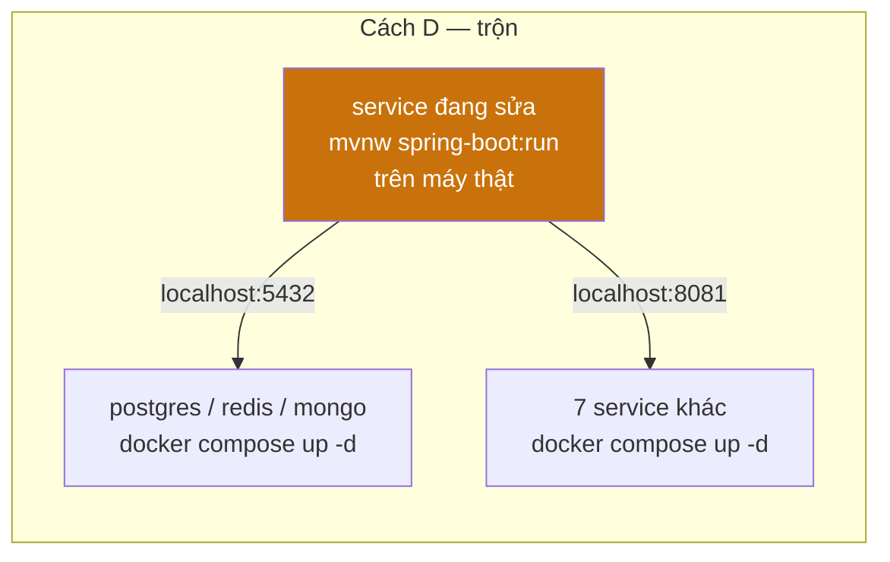

⚠ Cách D chỉ chạy được vì ba container hạ tầng **có** khối `ports` mở ra máy thật
(5432 / 6379 / 27017). Service ứng dụng thì không — nên một service chạy trên máy
thật gọi được **xuống** CSDL, nhưng gọi **ngang** sang service khác thì phải qua
`localhost:8080` của Gateway, hoặc phải tự thêm `ports` cho service đó.

---

## 52. Bước 0 — hạ tầng, luôn phải có trước

```powershell
docker compose up -d postgres redis mongo
```

Đợi tới khi cả ba `healthy`:

```powershell
docker compose ps postgres redis mongo
docker inspect -f "{{.State.Health.Status}}" vnsearch-postgres
```

| Container | Cổng ra máy thật | Kiểm bằng tay |
|---|---|---|
| `vnsearch-postgres` | 5432 | `docker exec vnsearch-postgres pg_isready -U vnsearch` |
| `vnsearch-redis` | 6379 | `docker exec vnsearch-redis redis-cli ping` |
| `vnsearch-mongo` | 27017 | `docker exec vnsearch-mongo mongosh --quiet --eval "db.adminCommand('ping')"` |

★ Đây chính xác là việc mà `:need_infra` làm — khác ở chỗ tệp bat bỏ qua container
nào đã chạy sẵn, còn `docker compose up -d` gõ tay thì tự nó cũng bỏ qua. Hai
cách tương đương.

⚠ Lần đầu tiên volume `postgres-data` được tạo, `deploy/postgres/init-db.sh` chạy
và tạo ba CSDL `vnsearch_auth` / `vnsearch_downloads` / `vnsearch_settings`. Nếu
volume đã tồn tại từ trước, script **không** chạy lại — xem [mục 31](#31-mật-khẩu-csdl-kế-thừa-postgres_password).

### 52.1 Không muốn dùng compose cho hạ tầng

```powershell
docker run -d --name vnsearch-postgres -p 5432:5432 `
  -e POSTGRES_DB=vnsearch -e POSTGRES_USER=vnsearch -e POSTGRES_PASSWORD=vnsearch `
  -v "${PWD}/deploy/postgres/init-db.sh:/docker-entrypoint-initdb.d/10-init-db.sh:ro" `
  postgres:17-alpine -c shared_buffers=128MB -c work_mem=2MB -c max_connections=50

docker run -d --name vnsearch-redis -p 6379:6379 redis:7-alpine `
  redis-server --maxmemory 100mb --maxmemory-policy allkeys-lru --save "" --appendonly no

docker run -d --name vnsearch-mongo -p 27017:27017 mongo:7 --wiredTigerCacheSizeGB 0.25
```

⚠ Ba container này **không** nằm trong mạng `vnsearch` và **không** có `mem_limit`.
Chúng đủ để phát triển, nhưng đừng lấy số đo bộ nhớ từ cấu hình này.

---

## 53. Bước 1 — hai bí mật, đặt bằng tay

Không có tệp bat thì không ai sinh khoá hộ. Hai biến, đặt trong **đúng cửa sổ**
sắp chạy service:

**PowerShell**

```powershell
$b = New-Object byte[] 32
[Security.Cryptography.RandomNumberGenerator]::Create().GetBytes($b)
$env:ADMIN_API_KEY = ([BitConverter]::ToString($b) -replace '-','').ToLower()

$env:BOOTSTRAP_ADMIN_USERNAME = "admin"
$env:BOOTSTRAP_ADMIN_PASSWORD = "doi-mat-khau-nay-di"
```

**cmd.exe**

```bat
set "ADMIN_API_KEY=0123456789abcdef0123456789abcdef"
set "BOOTSTRAP_ADMIN_USERNAME=admin"
set "BOOTSTRAP_ADMIN_PASSWORD=doi-mat-khau-nay-di"
```

🔒 `ADMIN_API_KEY` phải **≥ 16 ký tự**, nếu không `auth-service`,
`crawler-service` và `analytics-service` sẽ **từ chối khởi động**
(`MIN_KEY_LENGTH = 16` trong `ServiceSecurityConfig.java:129`).

| Service | `require-admin-api-key` | Thiếu khoá thì sao |
|---|---|---|
| `auth-service` | `true` | **Không khởi động** |
| `crawler-service` | `true` | **Không khởi động** |
| `analytics-service` | `true` | **Không khởi động** |
| `search-service` | `false` | Khởi động bình thường |
| `api-gateway` | *(không đặt)* | Khởi động bình thường |

★ Biến môi trường **chỉ sống trong cửa sổ hiện tại**. Mở cửa sổ thứ hai để chạy
service thứ hai là phải đặt lại — và nếu đặt khoá **khác nhau** ở hai cửa sổ thì
`/api/admin/**` sẽ nhận khoá này, từ chối khoá kia. Đây là lỗi hay gặp nhất khi
bỏ tệp bat ra chạy tay.

Cách tránh: đặt một lần vào `.env` rồi nạp lại ở mỗi cửa sổ mới.

```powershell
# Nạp .env vào phiên PowerShell hiện tại
Get-Content .env | Where-Object { $_ -notmatch '^\s*#' -and $_ -match '=' } |
  ForEach-Object {
    $k, $v = $_ -split '=', 2
    Set-Item -Path "env:$($k.Trim())" -Value $v
  }
```

---

## 54. Cách B — chạy jar Java bằng tay

### 54.1 Dựng jar trước

```powershell
cd backend\java
.\mvnw.cmd -B clean package -DskipTests
cd ..\..
```

Dựng **một** module cho nhanh (kèm các lib nó phụ thuộc):

```powershell
cd backend\java
.\mvnw.cmd -B -pl services/search-service -am package -DskipTests
```

Kết quả: `backend\java\services\<ten>\target\<ten>-0.0.1-SNAPSHOT.jar`.

### 54.2 ★ Phải đứng ở `backend\` khi chạy

```powershell
cd backend
```

Ba đường dẫn dữ liệu trong `application.properties` là **tương đối**:

```properties
app.index.data-path=${APP_INDEX_PATH:data/index.json}
app.crawler.data-path=${APP_CRAWLER_DATA_PATH:data/crawled-documents.json}
app.seed.data-path=${APP_SEED_PATH:data/seed-documents.json}
```

Đứng ở thư mục gốc của kho mà chạy thì `data/` trỏ vào `<gốc>\data` — không tồn
tại — và `search-service` lên với corpus rỗng: mọi truy vấn trả 0 kết quả, không
có lỗi nào. Đây đúng là lý do `run-backend.bat` có dòng
`cd /d "%ROOT%backend"` ngay trước khối `:launch`.

Muốn đứng chỗ khác thì trỏ đường dẫn tuyệt đối bằng `APP_INDEX_PATH`,
`APP_CRAWLER_DATA_PATH`, `APP_SEED_PATH`.

### 54.3 Lệnh cho từng service Java

Cả năm lệnh dưới đây chạy từ `backend\`, mỗi service **một cửa sổ PowerShell riêng**.

**`auth-service` :8081** — chạy được **không cần CSDL nào**: mặc định
`app.auth.store=json` (`data/users.json`) và `refresh-store=memory`.

```powershell
$env:SERVER_PORT="8081"
$env:AUTH_ISSUER_URI="http://localhost:8081"
$env:REDIS_HOST="localhost"
java -Xmx256m -Xss512k -XX:MaxMetaspaceSize=160m -XX:ReservedCodeCacheSize=48m `
     -XX:+UseSerialGC -XX:TieredStopAtLevel=1 -XX:+ExitOnOutOfMemoryError `
     -jar java\services\auth-service\target\auth-service-0.0.1-SNAPSHOT.jar
```

Muốn dùng PostgreSQL + Redis thật thì bật profile `postgres` — nó bật **cùng lúc**
kho tài khoản Postgres, DataSource, Flyway và kho refresh token Redis:

```powershell
$env:SPRING_PROFILES_ACTIVE="postgres"
$env:AUTH_DB_URL="jdbc:postgresql://localhost:5432/vnsearch_auth"
$env:AUTH_DB_USER="vnsearch_auth"
$env:AUTH_DB_PASSWORD="vnsearch"
```

**`search-service` :8082** — cũng chạy được **không cần CSDL**
(`APP_STORAGE_POSTGRES_ENABLED` mặc định `false`, corpus đọc từ JSON):

```powershell
$env:SERVER_PORT="8082"
$env:AUTH_JWKS_URI="http://localhost:8081/oauth2/jwks"
$env:AUTH_ISSUER_URI="http://localhost:8081"
java -Xmx1920m -Xss512k -XX:MaxMetaspaceSize=192m -XX:ReservedCodeCacheSize=96m `
     -XX:+UseG1GC -XX:MaxGCPauseMillis=200 -XX:+UseStringDeduplication `
     -XX:+ExitOnOutOfMemoryError `
     -jar java\services\search-service\target\search-service-0.0.1-SNAPSHOT.jar
```

★ Hai trần ngoài heap ở đây là **192m/96m**, khớp bản container — chứ không phải
160m/48m mà `:launch` dùng chung cho mọi service. Xem lệch này ở
[mục 41](#41-bảng--xmx-local--mem_limit-docker).

**`api-gateway` :8080** — không giữ trạng thái, nhưng cần biết **địa chỉ của mọi
service phía sau**, nếu không mọi tuyến sẽ trỏ vào tên container:

```powershell
$env:SERVER_PORT="8080"
$env:REDIS_HOST="localhost"
$env:AUTH_JWKS_URI="http://localhost:8081/oauth2/jwks"
$env:AUTH_ISSUER_URI="http://localhost:8081"
$env:AUTH_SERVICE_URL="http://localhost:8081"
$env:SEARCH_SERVICE_URL="http://localhost:8082"
$env:CRAWLER_SERVICE_URL="http://localhost:8083"
$env:ANALYTICS_SERVICE_URL="http://localhost:8084"
$env:HISTORY_SERVICE_URL="http://localhost:8085"
$env:DOWNLOADS_SERVICE_URL="http://localhost:8086"
$env:SETTINGS_SERVICE_URL="http://localhost:8087"
$env:FOOTBALL_SERVICE_URL="http://localhost:8090"
java -Xmx256m -Xss512k -XX:MaxMetaspaceSize=160m -XX:ReservedCodeCacheSize=48m `
     -XX:+UseSerialGC -XX:TieredStopAtLevel=1 -XX:+ExitOnOutOfMemoryError `
     -jar java\services\api-gateway\target\api-gateway-0.0.1-SNAPSHOT.jar
```

⚠ Gateway dùng Redis cho **hai** việc: `redis-rate-limiter` trên các tuyến, và
danh sách thu hồi token (`TokenDenylistFilter`). Lettuce nối lazy nên tiến trình
vẫn khởi động được khi thiếu Redis, nhưng request đầu tiên sẽ đổ. Chạy thử không
cần Redis thì tắt phần tra danh sách thu hồi:

```powershell
$env:GATEWAY_DENYLIST_ENABLED="false"
```

★ Ở môi trường thật thì KHÔNG được tắt: tắt nghĩa là lệnh "đăng xuất" không có
hiệu lực thật trong 15 phút — đúng bằng `access-token-ttl`.

**`analytics-service` :8084**

```powershell
$env:SERVER_PORT="8084"
$env:CRAWLER_SERVICE_URL="http://localhost:8083"
$env:AUTH_SERVICE_URL="http://localhost:8081"
java -Xmx224m -Xss512k -XX:MaxMetaspaceSize=160m -XX:ReservedCodeCacheSize=48m `
     -XX:+UseSerialGC -XX:TieredStopAtLevel=1 -XX:+ExitOnOutOfMemoryError `
     -jar java\services\analytics-service\target\analytics-service-0.0.1-SNAPSHOT.jar
```

**`crawler-service` :8083** — service nặng nhất, và là service **không ai cần** trừ
khi dùng `/api/admin/**`:

```powershell
$env:SERVER_PORT="8083"
$env:APP_CRAWLER_BUS="memory"
java -Xmx1400m -Xss512k -XX:MaxMetaspaceSize=192m -XX:ReservedCodeCacheSize=64m `
     -XX:+UseSerialGC -XX:+ExitOnOutOfMemoryError `
     -jar java\services\crawler-service\target\crawler-service-0.0.1-SNAPSHOT.jar
```

⚠ Đặt `APP_CRAWLER_BUS=memory` tường minh. Để `kafka` mà không có broker ở
`localhost:9092` thì bean bus ném ngoại lệ lúc nạp và service chết ngay — chính
là thứ mà tệp bat tự chữa ở [mục 30](#30--hạ-app_crawler_bus-từ-kafka-về-memory).

### 54.4 Chạy ngầm thay vì chiếm cửa sổ

```powershell
Start-Process -FilePath java -WindowStyle Hidden `
  -ArgumentList '-Xmx1920m','-jar','java\services\search-service\target\search-service-0.0.1-SNAPSHOT.jar' `
  -RedirectStandardOutput 'logs\search-service.log' `
  -RedirectStandardError  'logs\search-service.err.log'
```

Thư mục `logs\` phải tồn tại trước (`mkdir logs`) — `Start-Process` không tự tạo.

### 54.5 Gắn debugger

```powershell
java -agentlib:jdwp=transport=dt_socket,server=y,suspend=n,address=*:5005 `
     -jar java\services\search-service\target\search-service-0.0.1-SNAPSHOT.jar
```

Rồi trong IDE: **Remote JVM Debug** tới `localhost:5005`. Đổi `suspend=n` thành
`suspend=y` nếu cần bắt lỗi xảy ra ngay lúc khởi động.

---

## 55. Cách C — chạy bằng Maven, không cần đóng gói jar

```powershell
cd backend\java
.\mvnw.cmd -pl services/search-service -am spring-boot:run
```

| Cờ | Việc |
|---|---|
| `-pl services/search-service` | Chỉ module này |
| `-am` | **Kèm** các module nó phụ thuộc (`core-*`, `platform`) — thiếu cờ này là lỗi "không tìm thấy artefact" |

### 55.1 ⚠ Thư mục làm việc đổi chỗ

`spring-boot:run` chạy với thư mục làm việc là **thư mục module**
(`backend\java\services\search-service`), không phải `backend\`. Nên `data/index.json`
trỏ sai. Phải chỉ đường tuyệt đối:

```powershell
$env:APP_INDEX_PATH="C:\Users\kelly\OneDrive\Desktop\CocCoc-Plus\backend\data\index.json"
$env:APP_CRAWLER_DATA_PATH="C:\Users\kelly\OneDrive\Desktop\CocCoc-Plus\backend\data\crawled-documents.json"
$env:APP_SEED_PATH="C:\Users\kelly\OneDrive\Desktop\CocCoc-Plus\backend\data\seed-documents.json"
```

★ Đây là khác biệt duy nhất khiến cách C không phải bản thay thế trong suốt cho
cách B. Bỏ qua nó thì service lên bình thường và trả 0 kết quả cho mọi truy vấn —
không có dòng lỗi nào.

### 55.2 Truyền tham số JVM

```powershell
.\mvnw.cmd -pl services/search-service -am spring-boot:run `
  "-Dspring-boot.run.jvmArguments=-Xmx1920m -XX:+UseG1GC"
```

---

## 56. Chạy từng service Go

### 56.1 Dựng rồi chạy

```powershell
cd backend\go
mkdir bin -Force
go build -o bin ./services/history ./services/downloads ./services/settings ./services/football
```

### 56.2 Hoặc `go run`, khỏi dựng

```powershell
cd backend\go
$env:SERVER_PORT="8085"
$env:MONGO_URI="mongodb://localhost:27017/vnsearch_history"
$env:AUTH_JWKS_URI="http://localhost:8081/oauth2/jwks"
$env:AUTH_ISSUER_URI="http://localhost:8081"
go run ./services/history
```

### 56.3 Bảng biến môi trường bắt buộc cho bốn service Go

Cột "mặc định" lấy từ `config.Env(...)` trong `main.go` của từng service — đó là
giá trị **khi không đặt gì**, và phần lớn trỏ vào **tên container**, nên chạy tay
là phải đè.

| Service | Cổng | Biến | Mặc định trong mã | Chạy tay phải đặt |
|---|---|---|---|---|
| `history` | 8085 | `MONGO_URI` | `mongodb://mongo:27017/vnsearch_history` | ✓ đổi `mongo` → `localhost` |
| | | `AUTH_JWKS_URI` / `AUTH_ISSUER_URI` | `http://auth-service:8081…` | ✓ đổi → `localhost:8081` |
| `downloads` | 8086 | `DOWNLOADS_DB_URL` | `postgres://postgres:5432/vnsearch_downloads` | ✓ đổi host → `localhost` |
| | | `DOWNLOADS_DB_USER` / `_PASSWORD` | `vnsearch_downloads` / *(rỗng)* | ✓ đặt mật khẩu |
| `settings` | 8087 | `SETTINGS_DB_URL` | `postgres://postgres:5432/vnsearch_settings` | ✓ đổi host → `localhost` |
| | | `SETTINGS_DB_USER` / `_PASSWORD` | `vnsearch_settings` / *(rỗng)* | ✓ đặt mật khẩu |
| `football` | 8090 | `FOOTBALL_DB_HOST` | **`localhost`** | — chạy được ngay |
| | | `FOOTBALL_DB_USER` / `_PASSWORD` / `_NAME` | `vnsearch` / `vnsearch` / `vnsearch` | — chạy được ngay |
| | | `FOOTBALL_API_KEY` | *(rỗng)* | tuỳ chọn |

★ `football-service` là service **duy nhất** có mặc định trỏ sẵn `localhost` — nên
`go run ./services/football` chạy được ngay sau khi có Postgres, không cần đặt
biến nào. Ba service kia mặc định trỏ vào tên container.

★ `football-service` **không đọc JWT** (mọi endpoint công khai), nên nó không cần
`AUTH_*` và cũng không cần `auth-service` đang chạy. Ba service Go còn lại thì có.

⚠ Thiếu `FOOTBALL_API_KEY` **không** làm service chết — nó trả danh sách rỗng kèm
`meta.source = "unavailable"`. Đó là lý do "tab Bóng đá trống" thường là chuyện
thiếu khoá, không phải service chết.

### 56.4 Ví dụ đủ cho `downloads`

```powershell
cd backend\go
$env:SERVER_PORT="8086"
$env:DOWNLOADS_DB_URL="postgres://localhost:5432/vnsearch_downloads"
$env:DOWNLOADS_DB_USER="vnsearch_downloads"
$env:DOWNLOADS_DB_PASSWORD="vnsearch"
$env:AUTH_JWKS_URI="http://localhost:8081/oauth2/jwks"
$env:AUTH_ISSUER_URI="http://localhost:8081"
$env:AUTH_AUDIENCE="vnsearch-api"
go run ./services/downloads
```

★ Cả `postgres://` lẫn `jdbc:postgresql://` đều dùng được: `pg.DSN` tự cắt tiền tố
`jdbc:` (`backend/go/platform/pg/pg.go:22`).

---

## 57. Cách A — bật từng container lẻ

`docker compose up -d <ten>` bật service đó **và mọi thứ nó `depends_on`**:

```powershell
docker compose up -d search-service      # kéo theo postgres
docker compose up -d api-gateway         # kéo theo redis + auth-service
docker compose up -d history-service     # kéo theo mongo
```

| Muốn | Lệnh | Kéo theo |
|---|---|---|
| Chỉ tìm kiếm, không đăng nhập | `docker compose up -d search-service` | postgres |
| Cổng vào + đăng nhập | `docker compose up -d api-gateway` | redis, auth-service, postgres |
| Cả hệ thống trừ crawler | `docker compose up -d` | tất cả trừ hồ sơ |
| Thêm crawler | `docker compose --profile crawler up -d crawler-service` | postgres |
| Chỉ giám sát | `docker compose --profile monitoring up -d` | prometheus, grafana, alertmanager |
| Thêm Kafka | `docker compose --profile kafka up -d` | kafka, kafka-ui, kafka-exporter |

⚠ Service nằm sau hồ sơ (`crawler-service`) **phải** có `--profile crawler` trên
dòng lệnh, kể cả khi gọi đích danh tên nó. Không có tên hồ sơ, compose coi như
service đó không tồn tại.

### 57.1 Dựng lại đúng một ảnh

```powershell
docker compose build search-service
docker compose up -d --no-deps search-service
```

`--no-deps` giữ nguyên các container phụ thuộc thay vì khởi động lại chúng — thứ
cần khi chỉ vừa sửa một service.

### 57.2 Xem log và vào trong container

```powershell
docker compose logs -f search-service          # bám log
docker compose logs --tail 100 search-service  # 100 dòng cuối
docker exec -it vnsearch-search sh             # vào shell
docker stats --no-stream                       # RAM thật của từng container
```

---

## 58. Thứ tự khởi động và cách kiểm từng bước

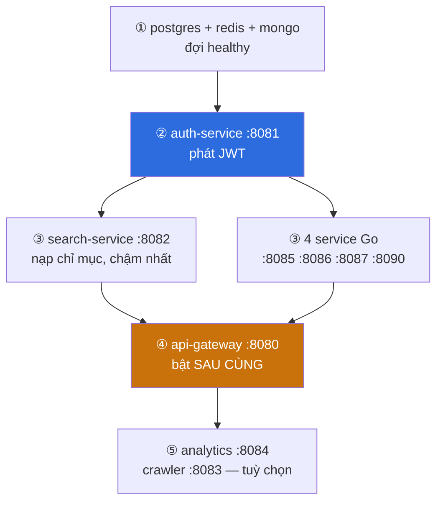

### 58.1 Vì sao thứ tự này

| Bước | Vì sao đứng ở đó |
|---|---|
| ① Hạ tầng trước | Spring Boot chết trong 5 giây đầu nếu `Connection refused` |
| ② `auth-service` | Mọi service khác lấy **JWKS** từ nó; lên sau thì service kia đã hỏng lượt lấy khoá đầu tiên |
| ③ Song song | `search-service` nạp chỉ mục lâu nhất — bật sớm để nó chạy song song với phần còn lại |
| ④ Gateway **sau cùng** | Gateway lên trước thì mọi request đầu tiên trả 503; và nó cần Redis |
| ⑤ Tuỳ chọn | Tìm kiếm không cần `crawler` lẫn `analytics` |

★ Ở đường Docker, `depends_on` + `condition` đã mã hoá sẵn thứ tự này. Chạy tay
thì **bạn** là `depends_on`.

### 58.2 Kiểm từng service

```powershell
# từng service một
Invoke-RestMethod http://localhost:8081/actuator/health
Invoke-RestMethod http://localhost:8082/actuator/health
Invoke-RestMethod http://localhost:8090/actuator/health

# quét cả dải cổng
8080,8081,8082,8084,8085,8086,8087,8090 | ForEach-Object {
    $p = $_
    try {
        $s = (Invoke-WebRequest -UseBasicParsing -TimeoutSec 2 "http://localhost:$p/actuator/health").StatusCode
        "{0}  {1}" -f $p, $s
    } catch { "{0}  KHÔNG TRẢ LỜI" -f $p }
}
```

### 58.3 Ba phép thử khói

```powershell
# ① Tìm kiếm — thẳng vào search-service, không qua Gateway
Invoke-RestMethod "http://localhost:8082/api/search?q=ha+noi"

# ② Tìm kiếm qua Gateway — kiểm luôn bảng tuyến
Invoke-RestMethod "http://localhost:8080/api/search?q=ha+noi"

# ③ Đăng nhập — kiểm auth-service + tài khoản bootstrap
Invoke-RestMethod -Method Post "http://localhost:8080/api/auth/login" `
  -ContentType "application/json" `
  -Body '{"username":"admin","password":"doi-mat-khau-nay-di"}'
```

★ Cặp ① và ② tách được hai lớp lỗi khác nhau: ① chạy mà ② không chạy nghĩa là lỗi
ở **bảng tuyến của Gateway** hoặc ở biến `SEARCH_SERVICE_URL`, không phải ở
search-service.

Gọi endpoint quản trị bằng khoá tĩnh:

```powershell
Invoke-RestMethod "http://localhost:8080/api/admin/analytics/summary" `
  -Headers @{ "X-Admin-Api-Key" = $env:ADMIN_API_KEY }
```

---

## 59. Bảng "tôi chỉ muốn chạy X"

| Muốn | Cần bật những gì | Lệnh ngắn nhất |
|---|---|---|
| Thử thuật toán tìm kiếm | `search-service` | `java -jar java\services\search-service\target\*.jar` từ `backend\` |
| Sửa mã xếp hạng | như trên, bằng Maven | `mvnw -pl services/search-service -am spring-boot:run` + 3 biến `APP_*_PATH` |
| Thử đăng nhập / JWT | `auth-service` | không cần CSDL — mặc định `store=json`, `refresh-store=memory` |
| Thử bảng tuyến Gateway | `redis` + `auth-service` + `api-gateway` | `docker compose up -d redis` rồi hai jar |
| Thử tab Bóng đá | `postgres` + `football` | `docker compose up -d postgres` + `go run ./services/football` |
| Thử lịch sử tìm kiếm | `mongo` + `auth-service` + `history` | `docker compose up -d mongo` + `go run ./services/history` |
| Thử `/api/admin/**` | `crawler-service` + `ADMIN_API_KEY` | jar crawler với `APP_CRAWLER_BUS=memory` |
| Giao diện thôi | không service nào | `run-frontend.bat` — có cảnh báo cổng 8080 trống |
| Đo bộ nhớ thật | toàn hệ thống, đường Docker | `docker compose up -d --build` + `docker stats` |

★ Hai dòng đáng nhớ nhất: **`auth-service` và `search-service` đều chạy được mà
không cần bất kỳ CSDL nào.** Mặc định của chúng là JSON trên đĩa
(`app.auth.store=json`, `app.storage.postgres.enabled=false`) — có chủ ý, để
`mvnw test` và lần chạy đầu tiên của người mới không đòi hỏi gì thêm.

---

## 60. Tắt tay từng service

| Chạy bằng | Tắt bằng |
|---|---|
| Cửa sổ tiền cảnh | `Ctrl+C` |
| `Start-Process` ngầm | `Get-Process java \| Stop-Process` (giết **mọi** JVM) |
| Theo cổng | xem dưới |
| Container | `docker compose stop <ten>` |
| Tất cả | `end-backend.bat` |

Giết đúng tiến trình đang giữ một cổng — chính là việc `:kill_port` của
`end-backend.bat` làm:

```powershell
# Tìm PID đang giữ cổng 8082
netstat -ano -p TCP | Select-String ":8082 .*LISTENING"

# Hoặc gọn hơn
Get-NetTCPConnection -LocalPort 8082 -State Listen | Select-Object OwningProcess

# Giết
Stop-Process -Id <PID> -Force
```

⚠ `Get-Process java | Stop-Process` giết **mọi** tiến trình Java trên máy, kể cả
IDE hay công cụ khác đang chạy trên JVM. Giết theo cổng thì chính xác hơn.

Tắt container mà **giữ** để bật lại nhanh:

```powershell
docker compose stop            # giữ container, bật lại bằng `start`
docker compose down            # xoá container, GIỮ volume dữ liệu
docker compose down -v         # xoá cả volume — MẤT DỮ LIỆU
```

★ Nhớ liệt kê đủ hồ sơ khi hạ, nếu không container của hồ sơ đó cứ chạy tiếp:

```powershell
docker compose --profile kafka --profile monitoring --profile crawler down
```

---

## 61. Bảng đối chiếu: tệp bat làm gì mà tay phải tự làm

| Việc | `run-backend.bat` | Chạy tay |
|---|---|---|
| Sinh `ADMIN_API_KEY` | Tự sinh 32 byte, ghi `.env` | **Tự đặt**, ≥ 16 ký tự |
| Sinh mật khẩu admin | Tự sinh, in một lần | **Tự đặt** |
| Nạp `.env` | `for /f` từng dòng | **Tự nạp** (xem đoạn PowerShell ở mục 53) |
| Ép mọi địa chỉ về `localhost` | ~20 biến | **Tự đặt** — mặc định trỏ tên container |
| `cd backend` trước khi chạy | có | **Tự nhớ**, nếu không `data/` trỏ sai |
| Kiểm cổng trống | `:check_port` × 9 | `netstat` hoặc chờ lỗi "Address already in use" |
| Bật hạ tầng còn thiếu | `:need_infra` | `docker compose up -d postgres redis mongo` |
| Mở Docker Desktop | tự dò 3 đường dẫn, đợi 180 s | **Tự mở** |
| Đợi hạ tầng `healthy` | `:wait_health` × 3 | `docker compose ps` |
| Chọn `-Xmx` và bộ GC | `:launch` theo ngưỡng 512 MB | **Tự truyền** — xem [mục 41](#41-bảng--xmx-local--mem_limit-docker) |
| Hạ `kafka` → `memory` | tự chữa khi cổng 9092 trống | **Tự đặt** `APP_CRAWLER_BUS=memory` |
| Đợi gateway trả `UP` | ↺ tối đa 180 s | `Invoke-RestMethod` |
| Mở giao diện | `run-frontend.bat` | `cd desktop-app; npm run dev` |

★ Đọc bảng này theo chiều ngược lại thì nó chính là bản tóm tắt của cả tài liệu:
mười ba dòng đó **là** `run-backend.bat`. Chạy tay không sai — nó chỉ có nghĩa là
mười ba việc kia chuyển sang cho người gõ lệnh, và mỗi việc bỏ sót đều có một
triệu chứng riêng đã được ghi ở [mục 48](#48-chẩn-đoán-sự-cố).
