# DATABASE MANAGEMENT — Giải phẫu toàn bộ tầng quản trị dữ liệu

### Từ `init-db.sh` lúc container PostgreSQL khởi tạo đến từng ràng buộc `CHECK` chặn một hàng sai

> **Tài liệu tham chiếu kỹ thuật đầy đủ.**
> Mỗi hệ quản trị, mỗi CSDL, mỗi bảng, mỗi cột, mỗi chỉ mục, mỗi ràng buộc và
> mỗi cơ chế migration mà dữ liệu của VnSearch đi qua — theo đúng thứ tự nó
> được tạo ra lúc hệ thống khởi động, kèm sơ đồ Mermaid, sơ đồ ERD, bảng đối
> chiếu và trích dẫn nguyên văn từ mã nguồn.

**Quy ước ký hiệu**

| Ký hiệu | Nghĩa |
|---|---|
| **Bảng:** `ten_bang` | Bảng quan hệ trong PostgreSQL |
| **Collection:** `ten` | Collection trong MongoDB |
| **File:** `abc/Xyz.java` | Đường dẫn tính từ gốc repo |
| ★ | Quyết định thiết kế mấu chốt, dễ hiểu sai |
| ⚠ | Cạm bẫy đã có thật trong mã hiện tại — cần biết trước khi sửa |
| 🔒 | Ranh giới bảo mật hoặc phân quyền |
| ↺ | Cơ chế idempotent / chạy lại được |

---

## MỤC LỤC

### PHẦN I — TỔNG QUAN
- [1. Bốn hệ quản trị, bốn vai trò khác nhau](#1-bốn-hệ-quản-trị-bốn-vai-trò-khác-nhau)
- [2. Bản đồ toàn hệ thống](#2-bản-đồ-toàn-hệ-thống)
- [3. Bản đồ CSDL ↔ service ↔ tài khoản](#3-bản-đồ-csdl--service--tài-khoản)
- [4. Danh mục toàn bộ file tham gia](#4-danh-mục-toàn-bộ-file-tham-gia)
- [5. Sơ đồ tuần tự — lược đồ ra đời lúc nào](#5-sơ-đồ-tuần-tự--lược-đồ-ra-đời-lúc-nào)
- [6. Bảng so sánh bốn kho](#6-bảng-so-sánh-bốn-kho)

### PHẦN II — PHÂN VÙNG DỮ LIỆU: DATABASE PER SERVICE
- [7. `init-db.sh` — ba CSDL, ba tài khoản, chạy đúng một lần](#7-init-dbsh--ba-csdl-ba-tài-khoản-chạy-đúng-một-lần)
- [8. ★ Vì sao mỗi service một CSDL, không phải một schema](#8--vì-sao-mỗi-service-một-csdl-không-phải-một-schema)
- [9. 🔒 `REVOKE ALL ON SCHEMA public FROM PUBLIC`](#9--revoke-all-on-schema-public-from-public)
- [10. ⚠ Hai ngoại lệ: CSDL `vnsearch` dùng chung và schema `football`](#10--hai-ngoại-lệ-csdl-vnsearch-dùng-chung-và-schema-football)
- [11. Ranh giới được giữ cả ở tầng HTTP: analytics KHÔNG đọc CSDL](#11-ranh-giới-được-giữ-cả-ở-tầng-http-analytics-không-đọc-csdl)

### PHẦN III — BA CƠ CHẾ MIGRATION
- [12. Flyway — auth-service](#12-flyway--auth-service)
- [13. golang-migrate + `embed.FS` — ba service Go](#13-golang-migrate--embedfs--ba-service-go)
- [14. ⚠ `schema.sql` chạy tay — mắt xích yếu nhất](#14--schemasql-chạy-tay--mắt-xích-yếu-nhất)
- [15. ★ Vì sao KHÔNG dùng `ddl-auto=update`](#15--vì-sao-không-dùng-ddl-autoupdate)
- [16. Bảng so sánh ba cơ chế](#16-bảng-so-sánh-ba-cơ-chế)

### PHẦN IV — CSDL `vnsearch_auth` — TÀI KHOẢN
- [17. `auth_users` — đọc từng cột](#17-auth_users--đọc-từng-cột)
- [18. ★ `username` làm khoá chính, và cái giá phải trả](#18--username-làm-khoá-chính-và-cái-giá-phải-trả)
- [19. ★ `ux_auth_users_username_lower` — ràng buộc đặt ở CSDL, không ở Java](#19--ux_auth_users_username_lower--ràng-buộc-đặt-ở-csdl-không-ở-java)
- [20. `ON CONFLICT (lower(username))` — mục tiêu xung đột là một chỉ mục biểu thức](#20-on-conflict-lowerusername--mục-tiêu-xung-đột-là-một-chỉ-mục-biểu-thức)
- [21. ⚠ V1 tạo `auth_users` KHÔNG có tiền tố schema, V2 thì CÓ](#21--v1-tạo-auth_users-không-có-tiền-tố-schema-v2-thì-có)

### PHẦN V — CSDL `vnsearch` — CORPUS VÀ ĐỒ THỊ WEB
- [22. `documents` — kho tài liệu thô](#22-documents--kho-tài-liệu-thô)
- [23. `outlinks` — cạnh của đồ thị web](#23-outlinks--cạnh-của-đồ-thị-web)
- [24. ★★★ `outlinks` không có khoá chính — nạp hai lần là nhân đôi cạnh](#24--outlinks-không-có-khoá-chính--nạp-hai-lần-là-nhân-đôi-cạnh)
- [25. ⚠ Hai khoá đánh nhau: `PRIMARY KEY (doc_id)` và `UNIQUE (url)`](#25--hai-khoá-đánh-nhau-primary-key-doc_id-và-unique-url)
- [26. ★ Cột `tsv` GENERATED + chỉ mục GIN — hạ tầng cho thí nghiệm đối chứng](#26--cột-tsv-generated--chỉ-mục-gin--hạ-tầng-cho-thí-nghiệm-đối-chứng)

### PHẦN VI — CSDL `vnsearch_downloads`
- [27. `downloads` — đọc từng cột](#27-downloads--đọc-từng-cột)
- [28. ★ Ràng buộc `CHECK` viết bằng máy trạng thái](#28--ràng-buộc-check-viết-bằng-máy-trạng-thái)
- [29. ★ Partial index `ix_downloads_dang_chay`](#29--partial-index-ix_downloads_dang_chay)
- [30. Vì sao KHÔNG có khoá ngoại tới `auth_users`](#30-vì-sao-không-có-khoá-ngoại-tới-auth_users)

### PHẦN VII — CSDL `vnsearch_settings` — JSONB VÀ KHOÁ LẠC QUAN
- [31. `user_settings` — một hàng một người dùng](#31-user_settings--một-hàng-một-người-dùng)
- [32. ★ Khoá lạc quan cài bằng `ON CONFLICT ... WHERE`](#32--khoá-lạc-quan-cài-bằng-on-conflict--where)
- [33. `Merge` và `Replace` — khác nhau đúng một toán tử `||`](#33-merge-và-replace--khác-nhau-đúng-một-toán-tử-)
- [34. Hai ràng buộc chặn JSONB rác](#34-hai-ràng-buộc-chặn-jsonb-rác)

### PHẦN VIII — SCHEMA `football` — CACHE NẰM TRONG CSDL
- [35. Ba bảng của schema `football`](#35-ba-bảng-của-schema-football)
- [36. ⚠ Vì sao cache lại nằm trong PostgreSQL khi Redis đã chạy sẵn](#36--vì-sao-cache-lại-nằm-trong-postgresql-khi-redis-đã-chạy-sẵn)

### PHẦN IX — MONGODB — LỊCH SỬ DUYỆT WEB
- [37. Ba collection, và vì sao chỗ này KHÔNG dùng quan hệ](#37-ba-collection-và-vì-sao-chỗ-này-không-dùng-quan-hệ)
- [38. ★ TTL index — quyền được lãng quên cài bằng hạ tầng](#38--ttl-index--quyền-được-lãng-quên-cài-bằng-hạ-tầng)
- [39. ⚠ `visits` thiếu chỉ mục duy nhất — cửa sổ đua giữa đọc và ghi](#39--visits-thiếu-chỉ-mục-duy-nhất--cửa-sổ-đua-giữa-đọc-và-ghi)
- [40. ⚠ `SuggestQueries` — regex `i` vô hiệu hoá nửa sau của chỉ mục](#40--suggestqueries--regex-i-vô-hiệu-hoá-nửa-sau-của-chỉ-mục)
- [41. ⚠ `audit_log` của Mongo: không chỉ mục, không TTL](#41--audit_log-của-mongo-không-chỉ-mục-không-ttl)

### PHẦN X — REDIS — TRẠNG THÁI CÓ HẠN DÙNG
- [42. Bốn không gian khoá](#42-bốn-không-gian-khoá)
- [43. ★ `rt:used:` phải sống LÂU HƠN chính token nó canh](#43--rtused-phải-sống-lâu-hơn-chính-token-nó-canh)
- [44. `allkeys-lru` và quyết định KHÔNG lưu bền](#44-allkeys-lru-và-quyết-định-không-lưu-bền)

### PHẦN XI — AUDIT LOG — BỐN BẢN SAO CỦA CÙNG MỘT BẢNG
- [45. Cùng một lược đồ, bốn nơi, cố ý](#45-cùng-một-lược-đồ-bốn-nơi-cố-ý)
- [46. ★ Ghi nhật ký hỏng KHÔNG được làm hỏng nghiệp vụ](#46--ghi-nhật-ký-hỏng-không-được-làm-hỏng-nghiệp-vụ)
- [47. ⚠ Không có retention, không có phân mảnh](#47--không-có-retention-không-có-phân-mảnh)

### PHẦN XII — NGÂN SÁCH KẾT NỐI VÀ BỘ NHỚ
- [48. `max_connections=50` và phép cộng phải khớp](#48-max_connections50-và-phép-cộng-phải-khớp)
- [49. `shared_buffers`, `work_mem` và giới hạn container](#49-shared_buffers-work_mem-và-giới-hạn-container)
- [50. WiredTiger không tự đọc giới hạn của Docker](#50-wiredtiger-không-tự-đọc-giới-hạn-của-docker)

### PHẦN XIII — SƠ ĐỒ QUAN HỆ THỰC THỂ (ERD)
- [51. ERD — CSDL `vnsearch` (corpus)](#51-erd--csdl-vnsearch-corpus)
- [52. ERD — ba CSDL dữ liệu cá nhân](#52-erd--ba-csdl-dữ-liệu-cá-nhân)
- [53. ERD — MongoDB `vnsearch_history`](#53-erd--mongodb-vnsearch_history)
- [54. ★ Khoá liên kết duy nhất giữa mọi kho: chuỗi `username`](#54--khoá-liên-kết-duy-nhất-giữa-mọi-kho-chuỗi-username)

### PHẦN XIV — ĐỐI CHIẾU THỰC TẾ
- [55. Toàn bộ bảng, collection và không gian khoá](#55-toàn-bộ-bảng-collection-và-không-gian-khoá)
- [56. Toàn bộ chỉ mục và lý do tồn tại](#56-toàn-bộ-chỉ-mục-và-lý-do-tồn-tại)
- [57. Lệnh kiểm chứng lược đồ trên máy thật](#57-lệnh-kiểm-chứng-lược-đồ-trên-máy-thật)

### PHẦN XV — PHỤ LỤC
- [58. Bảng hằng số toàn hệ thống](#58-bảng-hằng-số-toàn-hệ-thống)
- [59. Bảng tra nhanh bảng ↔ file ↔ nơi tạo](#59-bảng-tra-nhanh-bảng--file--nơi-tạo)
- [60. Câu hỏi thường gặp](#60-câu-hỏi-thường-gặp)
- [61. Cây chẩn đoán sự cố](#61-cây-chẩn-đoán-sự-cố)
- [62. Thuật ngữ](#62-thuật-ngữ)
- [63. Toàn cảnh một trang](#63-toàn-cảnh-một-trang)

---
---

# PHẦN I — TỔNG QUAN

---

## 1. Bốn hệ quản trị, bốn vai trò khác nhau

Trong toàn tài liệu, "kho" dùng để chỉ **một hệ quản trị dữ liệu đang chạy**,
không phải một tệp hay một bảng. VnSearch chạy bốn kho, và điều đáng nói không
phải là con số bốn mà là **mỗi kho được chọn vì một tính chất khác nhau**, chứ
không phải vì tiện.

| Kho | Image | Giữ cái gì | Chọn vì tính chất nào | Mất thì sao |
|---|---|---|---|---|
| **PostgreSQL** | `postgres:17-alpine` | Tài khoản, tải xuống, cài đặt, corpus, cache bóng đá | Ràng buộc toàn vẹn cưỡng chế được ở tầng CSDL | Mất tài khoản = mất thật |
| **MongoDB** | `mongo:7` | Lịch sử duyệt web, lịch sử tìm kiếm | Ghi nhiều, lược đồ lỏng, **TTL tự xoá** | Mất lịch sử = phiền, không chết |
| **Redis** | `redis:7-alpine` | Refresh token, denylist access token | Mọi thứ đều **có hạn dùng**, tốc độ | Mọi người phải đăng nhập lại |
| **Hệ tệp** | — | `crawled-documents.json` và các tệp anh em | Nguồn sự thật của corpus | Phải crawl lại từ đầu |

★ **Nguyên tắc chọn kho ở đây là "chọn theo tính chất của dữ liệu", không phải
"chọn theo thói quen".** Ba câu hỏi phân loại được dùng nhất quán:

```
Dữ liệu này có ràng buộc mà một hàng SAI là không chấp nhận được không?
   CÓ  → PostgreSQL (bắt được bằng CHECK / UNIQUE / FK)
   KHÔNG ↓

Dữ liệu này có TỰ HẾT HẠN không?
   CÓ, và mất cũng không sao         → Redis (TTL + allkeys-lru)
   CÓ, nhưng cần truy vấn/phân trang → MongoDB (TTL index)
   KHÔNG ↓

Dữ liệu này lớn, tuần tự, ghi một lần đọc nhiều lần?
   CÓ → hệ tệp (xem STORAGE-PIPELINE.md)
```

Áp dụng ngược lại để kiểm tra tính nhất quán của lập luận: lịch sử duyệt web
**không** vào PostgreSQL vì nó không có ràng buộc nào đáng cưỡng chế và nó cần
tự hết hạn sau 90 ngày — làm điều đó trong PostgreSQL cần một job `DELETE`
định kỳ tự viết, tự lên lịch và tự giám sát, trong khi MongoDB có sẵn TTL
index ([mục 38](#38--ttl-index--quyền-được-lãng-quên-cài-bằng-hạ-tầng)).
Ngược lại, refresh token **không** vào MongoDB vì nó chỉ cần tra theo khoá và
luôn có hạn — dùng một CSDL tài liệu cho nó là thừa cả một tiến trình.

### 1.1 Cái mà bảng trên KHÔNG nói

Bốn kho không phải bốn tầng của một hệ thống mà là **bốn hệ độc lập, không hệ
nào biết hệ nào tồn tại**. Không có giao dịch phân tán, không có two-phase
commit, không có đồng bộ hai chiều. Thứ duy nhất nối chúng lại là một chuỗi ký
tự: `username` — xem
[mục 54](#54--khoá-liên-kết-duy-nhất-giữa-mọi-kho-chuỗi-username).

Hệ quả trực tiếp: **không có thao tác nào nguyên tử xuyên hai kho.** Xoá một
tài khoản trong PostgreSQL không xoá lịch sử duyệt web trong MongoDB; thu hồi
một phiên trong Redis không đụng gì tới `auth_users`. Mọi luồng cần nhất quán
giữa hai kho đều phải được viết tường minh ở tầng ứng dụng, và mọi luồng như
vậy đều có thể thất bại ở giữa. Đây là cái giá của kiến trúc microservice, và
tài liệu này ghi nó ra thay vì giả vờ nó không tồn tại.

---

## 2. Bản đồ toàn hệ thống

### 2.1 Sơ đồ khối — service nào chạm vào kho nào

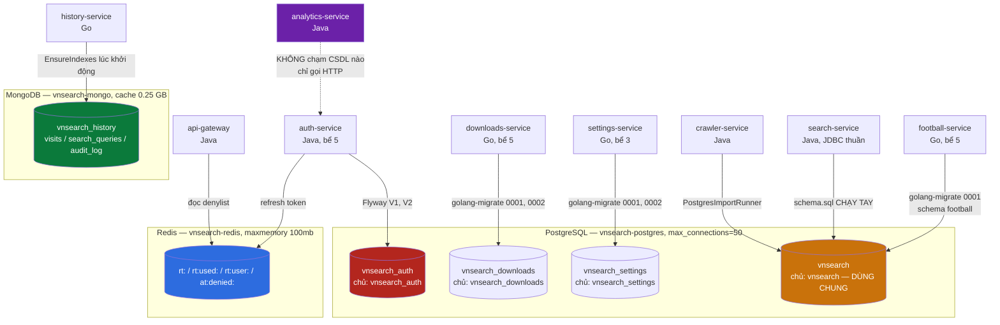

<details><summary>Xem bản chữ (ASCII)</summary>

```
PostgreSQL (vnsearch-postgres, max_connections=50)
├─ vnsearch_auth        [vnsearch_auth]        auth-service        Flyway
│     auth_users, auth.audit_log
├─ vnsearch_downloads   [vnsearch_downloads]   downloads-service   golang-migrate
│     downloads, audit_log
├─ vnsearch_settings    [vnsearch_settings]    settings-service    golang-migrate
│     user_settings, audit_log
└─ vnsearch             [vnsearch]  ← DÙNG CHUNG bởi BA service
      public.documents, public.outlinks   ← search + crawler, schema.sql CHẠY TAY
      football.api_cache, football.api_call_log, football.settings
                                          ← football-service, golang-migrate

MongoDB (vnsearch-mongo, wiredTigerCacheSizeGB 0.25)
└─ vnsearch_history      history-service      EnsureIndexes() lúc khởi động
      visits          (TTL 90 ngày)
      search_queries  (TTL 30 ngày)
      audit_log       (KHÔNG chỉ mục, KHÔNG TTL)

Redis (vnsearch-redis, maxmemory 100mb, allkeys-lru, KHÔNG lưu bền)
└─ rt:<hash>         refresh token còn hiệu lực     TTL = tuổi thọ token
   rt:used:<hash>    dấu "đã dùng"                  TTL = 30 ngày
   rt:user:<name>    tập băm token của một người    TTL = token + 1 ngày
   at:denied:<jti>   access token bị thu hồi        TTL = phần đời còn lại

analytics-service — KHÔNG kết nối tới bất kỳ kho nào, chỉ gọi HTTP (mục 11)
```

</details>

### 2.2 Vì sao ba đường tạo lược đồ lại khác nhau

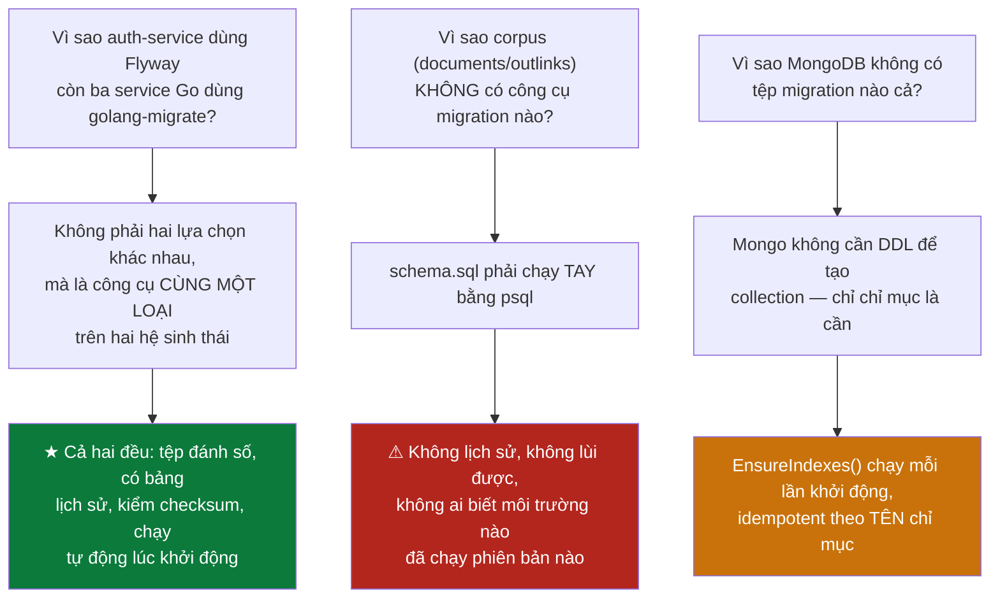

Ba nhánh trên không cùng mức độ chấp nhận được. Nhánh thứ nhất là **hai cài
đặt của cùng một nguyên tắc** — không phải sự thiếu nhất quán, chỉ là hai hệ
sinh thái. Nhánh thứ ba là **hợp lý theo bản chất của MongoDB** — không có
lược đồ thì không có gì để migrate, chỉ chỉ mục là thứ phải bảo đảm.

Nhánh thứ hai là chỗ **thật sự thiếu**, và nó được phân tích riêng ở
[mục 14](#14--schemasql-chạy-tay--mắt-xích-yếu-nhất).

---

## 3. Bản đồ CSDL ↔ service ↔ tài khoản

| CSDL | Tài khoản sở hữu | Service kết nối | Bể kết nối | Cơ chế tạo lược đồ |
|---|---|---|---:|---|
| `vnsearch_auth` | `vnsearch_auth` | auth-service | 5 | Flyway `V1`, `V2` |
| `vnsearch_downloads` | `vnsearch_downloads` | downloads-service | 5 | golang-migrate `0001`, `0002` |
| `vnsearch_settings` | `vnsearch_settings` | settings-service | 3 | golang-migrate `0001`, `0002` |
| `vnsearch` | `vnsearch` | search, crawler, football | 5 (football) | ⚠ hỗn hợp: `schema.sql` tay + golang-migrate |
| `vnsearch_history` (Mongo) | — không xác thực | history-service | — | `EnsureIndexes()` lúc khởi động |
| Redis db 0 | — không xác thực | auth, gateway | — | không có lược đồ |

🔒 **Ba dòng đầu là ranh giới bảo mật thật, không phải quy ước đặt tên.** Tài
khoản `vnsearch_downloads` không có quyền nào trên CSDL `vnsearch_auth` — nó
thậm chí không mở được kết nối tới đó. Một lỗ hổng SQL injection ở
downloads-service **không thể** đọc cột `password_hash`, vì cột đó nằm trong
một CSDL mà kết nối kia không có quyền vào. Cơ chế cưỡng chế là phân quyền của
PostgreSQL, không phải kỷ luật của người viết mã.

⚠ **Dòng thứ tư là chỗ nguyên tắc bị phá**, và nó bị phá theo hai cách khác
nhau. Phân tích ở [mục 10](#10--hai-ngoại-lệ-csdl-vnsearch-dùng-chung-và-schema-football).

⚠ **Hai dòng cuối là khoảng trống thật.** MongoDB và Redis đều chạy **không
bật xác thực**, chỉ được che bởi mạng nội bộ Docker `vnsearch`. Bất kỳ tiến
trình nào vào được mạng đó đều đọc được toàn bộ lịch sử duyệt web và toàn bộ
kho token. Điều này chấp nhận được với phạm vi một đồ án chạy cục bộ, và được
ghi ra ở đây một cách tường minh — nhưng nó **không** phải cấu hình dùng được
ở môi trường thật. Cách sửa: bật `--auth` cho Mongo với người dùng riêng cho
`vnsearch_history`, và `requirepass` cho Redis.

---

## 4. Danh mục toàn bộ file tham gia

| File | Vai trò | Dòng | Nội dung chính |
|---|---|---:|---|
| `deploy/postgres/init-db.sh` | Khởi tạo cụm | 79 | Tạo 3 CSDL, 3 tài khoản, `REVOKE` trên `public` |
| `docker-compose.yml` | Cấu hình cụm | 741 | Tham số `postgres`/`redis`/`mongo`, biến môi trường của 8 service |
| `.../auth-service/.../db/migration/V1__tai_khoan.sql` | Migration | 74 | `auth_users` + 2 chỉ mục + `COMMENT ON` |
| `.../auth-service/.../db/migration/V2__audit_log.sql` | Migration | 12 | `auth.audit_log` + 2 chỉ mục |
| `.../auth-service/.../application-postgres.properties` | Cấu hình | 53 | Hikari, Flyway, `app.auth.store=postgres` |
| `backend/go/platform/pg/pg.go` | Nền tảng Go | 86 | `DSN()`, `Connect()`, `Migrate()` |
| `.../downloads/migrations/0001_downloads.up.sql` | Migration | 30 | `downloads` + 4 `CHECK` + 2 chỉ mục |
| `.../downloads/migrations/0002_audit_log.up.sql` | Migration | 12 | `audit_log` |
| `.../settings/migrations/0001_user_settings.up.sql` | Migration | 11 | `user_settings` + 2 `CHECK` |
| `.../settings/migrations/0002_audit_log.up.sql` | Migration | 12 | `audit_log` |
| `.../football/migrations/0001_football_cache.up.sql` | Migration | 25 | schema `football` + 3 bảng |
| `.../core-search/src/main/resources/db/schema.sql` | ⚠ Lược đồ chạy tay | 56 | `documents`, `outlinks`, cột `tsv`, chỉ mục GIN |
| `.../core-search/.../storage/DocumentRepository.java` | Truy cập dữ liệu | 256 | Toàn bộ SQL thô của corpus |
| `.../auth-service/.../auth/PostgresUserStore.java` | Truy cập dữ liệu | — | `JdbcClient`, upsert theo `lower(username)` |
| `.../settings/internal/settings/repo.go` | Truy cập dữ liệu | — | Khoá lạc quan bằng `ON CONFLICT ... WHERE` |
| `.../downloads/internal/downloads/repo.go` | Truy cập dữ liệu | — | Upsert theo `id`, mọi truy vấn kèm `username` |
| `.../history/internal/history/store.go` | Truy cập dữ liệu | — | `EnsureIndexes()`, TTL index, phân trang |
| `.../auth-service/.../oauth/RedisRefreshTokenStore.java` | Truy cập dữ liệu | — | Bốn tiền tố khoá Redis |
| Năm tệp `*.down.sql` tương ứng | Migration lùi | — | Mỗi `up` có đúng một `down` |

★ **Mỗi tệp `.up.sql` đều có tệp `.down.sql` đi kèm.** Đây là điều kiện để câu
"migration lùi được" là một sự thật kiểm chứng được chứ không phải một lời
hứa — và nó chính là thứ mà `schema.sql` ở dòng thứ mười hai không có.

---

## 5. Sơ đồ tuần tự — lược đồ ra đời lúc nào

```mermaid
sequenceDiagram
    participant D as docker compose up
    participant P as postgres:17
    participant I as init-db.sh
    participant A as auth-service
    participant G as settings-service (Go)
    participant H as history-service (Go)

    D->>P: khởi động container
    P->>P: volume postgres-data có TRỐNG không?
    alt volume trống — lần đầu tiên trong đời volume
        P->>I: chạy /docker-entrypoint-initdb.d/10-init-db.sh
        I->>P: CREATE USER × 3, CREATE DATABASE × 3
        I->>P: REVOKE ALL ON SCHEMA public FROM PUBLIC × 3
        Note over I,P: ↺ chạy ĐÚNG MỘT LẦN, không bao giờ lặp lại
    else volume đã có dữ liệu
        P-->>I: BỎ QUA HOÀN TOÀN, không một dòng log
        Note over P: ⚠ sửa init-db.sh KHÔNG có tác dụng<br/>phải docker compose down -v
    end
    P->>D: healthcheck pg_isready → healthy

    D->>A: khởi động (depends_on: postgres healthy)
    A->>P: Flyway đọc bảng flyway_schema_history
    A->>P: chạy V1, V2 nếu chưa có; kiểm checksum các tệp cũ
    Note over A,P: validate-on-migrate=true<br/>sửa một tệp cũ = DỪNG KHỞI ĐỘNG

    D->>G: khởi động
    G->>P: golang-migrate đọc bảng schema_migrations
    G->>P: m.Up() — ErrNoChange KHÔNG phải lỗi
    G->>P: pgxpool.Ping() với timeout 5 giây

    D->>H: khởi động
    H->>H: EnsureIndexes() — CreateMany theo TÊN chỉ mục
    Note over H: ↺ idempotent: chỉ mục đã có thì bỏ qua
```

### 5.1 Ba mức idempotent khác nhau, và vì sao cả ba đều cần

| Cơ chế | Chạy lại lần hai thì sao | Bảo đảm bởi |
|---|---|---|
| `init-db.sh` | **Không chạy lại** — Docker bỏ qua thư mục initdb khi volume đã có dữ liệu | Cơ chế của image `postgres` |
| Flyway / golang-migrate | Chạy lại, thấy tệp đã ghi trong bảng lịch sử, không làm gì | `flyway_schema_history` / `schema_migrations` |
| `EnsureIndexes()` | Chạy lại, Mongo thấy chỉ mục trùng **tên và khoá**, không làm gì | `SetName()` trong `options.Index()` |

⚠ **Mức thứ nhất là mức nguy hiểm nhất, vì nó im lặng.** Sửa `init-db.sh` rồi
`docker compose up -d` sẽ không báo lỗi, cũng không áp dụng gì — hai điều đó
xảy ra đồng thời và không có tín hiệu nào phân biệt "đã áp dụng" với "đã bị bỏ
qua". Muốn áp lại phải `docker compose down -v`, và lệnh đó **xoá sạch toàn bộ
dữ liệu PostgreSQL**. Chính chú thích trong tệp nói thẳng điều này ngay ở dòng
thứ tám, trước cả dòng lệnh đầu tiên.

Hai mức còn lại **không** im lặng: Flyway ghi từng lần chạy vào bảng lịch sử
và dừng khởi động nếu checksum lệch; `EnsureIndexes()` trả về `error` nếu
Mongo từ chối. Sự khác biệt giữa "im lặng bỏ qua" và "báo lỗi rồi dừng" là
ranh giới giữa một cơ chế đáng tin và một cơ chế chỉ trông có vẻ đáng tin.

---

## 6. Bảng so sánh bốn kho

| Tiêu chí | PostgreSQL | MongoDB | Redis | Hệ tệp |
|---|---|---|---|---|
| Bền vững sau restart | ✅ volume `postgres-data` | ✅ volume `mongo-data` | ❌ **cố ý** `--save ""` | ✅ |
| Ràng buộc cưỡng chế | ✅ `CHECK`, `UNIQUE`, `FK` | ⚠ chỉ chỉ mục duy nhất | ❌ | ❌ |
| Tự xoá theo thời gian | ❌ phải tự viết job | ✅ **TTL index** | ✅ TTL từng khoá | ❌ |
| Migration có lịch sử | ✅ (trừ `documents`) | ❌ không cần | ❌ không có lược đồ | ❌ |
| Phân quyền theo service | ✅ **3 tài khoản riêng** | ❌ không bật xác thực | ❌ không bật xác thực | ❌ |
| Giới hạn bộ nhớ | 384 MB | 384 MB | 128 MB | — |
| Hành vi khi đầy | từ chối ghi | từ chối ghi | **đuổi khoá cũ nhất** | từ chối ghi |

★ **Dòng cuối là dòng đáng chú ý nhất của cả bảng.** Redis được cấu hình
`--maxmemory-policy allkeys-lru`, tức là **đuổi bớt dữ liệu khi đầy** thay vì
từ chối ghi. Với refresh token đó là hành vi đúng: đuổi một khoá nghĩa là một
người phải đăng nhập lại. Mặc định `noeviction` thì Redis từ chối **mọi** phép
ghi khi đầy — nghĩa là **không ai** đăng nhập được nữa. Một dòng cấu hình đổi
mức độ của sự cố từ "toàn hệ thống" xuống "vài người dùng". Phân tích đầy đủ
ở [mục 44](#44-allkeys-lru-và-quyết-định-không-lưu-bền).

Hai dòng "Tự xoá theo thời gian" và "Ràng buộc cưỡng chế" giải thích vì sao
lịch sử duyệt web và tài khoản không thể ở chung một kho: một bên cần thứ mà
bên kia không có, và ngược lại.

---
---

# PHẦN II — PHÂN VÙNG DỮ LIỆU: DATABASE PER SERVICE

---

## 7. `init-db.sh` — ba CSDL, ba tài khoản, chạy đúng một lần

**File:** `deploy/postgres/init-db.sh` — 78 dòng, gắn vào container qua

```yaml
volumes:
  - ./deploy/postgres/init-db.sh:/docker-entrypoint-initdb.d/10-init-db.sh:ro
```

Tệp gắn ở chế độ `:ro` (chỉ đọc) và tên có tiền tố `10-` để cố định thứ tự nếu
sau này có thêm tệp khởi tạo thứ hai — image `postgres` chạy các tệp trong
`/docker-entrypoint-initdb.d/` theo thứ tự tên.

### 7.1 Ba khối lệnh, theo đúng thứ tự thực thi

```bash
set -euo pipefail
```

★ Ba cờ này quyết định hành vi khi có lỗi: `-e` dừng ngay khi một lệnh thất
bại, `-u` coi việc dùng biến chưa đặt là lỗi, `-o pipefail` không cho một
đường ống che lỗi của lệnh giữa chừng. Không có chúng, một `CREATE DATABASE`
thất bại vẫn để script chạy tiếp và kết thúc với mã 0 — container vẫn báo
"khởi tạo xong" trong khi CSDL của một service không tồn tại. Sự cố đó sẽ chỉ
lộ ra sau, ở một service khác, dưới dạng một thông báo hoàn toàn không liên
quan.

**Khối ①** — lấy mật khẩu từ biến môi trường, không viết trong tệp:

```bash
AUTH_PW="${AUTH_DB_PASSWORD:-$POSTGRES_PASSWORD}"
DOWNLOADS_PW="${DOWNLOADS_DB_PASSWORD:-$POSTGRES_PASSWORD}"
SETTINGS_PW="${SETTINGS_DB_PASSWORD:-$POSTGRES_PASSWORD}"

if [ "$AUTH_PW" = "$POSTGRES_PASSWORD" ]; then
  echo "CANH BAO: cac service dung chung mat khau voi superuser." >&2
  ...
fi
```

★ Đây là một mẫu đáng chú ý: **mặc định vẫn chạy được, nhưng nói to là nó
đang chạy ở chế độ không an toàn.** Nếu thiếu biến thì dùng lại mật khẩu
superuser — chấp nhận được khi chạy thử cục bộ — nhưng cảnh báo được in ra
`stderr` với nội dung nêu đúng tên ba biến cần đặt. Lựa chọn thay thế là bắt
buộc phải có biến và từ chối khởi động; lựa chọn đó an toàn hơn nhưng làm
người vừa clone repo về không chạy được ngay. Cân bằng ở đây nghiêng về "chạy
được ngay, kèm cảnh báo", và tệp ghi rõ lý do.

⚠ Điểm cần biết: cảnh báo chỉ kiểm `AUTH_PW`. Nếu ai đó đặt `AUTH_DB_PASSWORD`
nhưng quên hai biến kia, cảnh báo **không** xuất hiện dù hai service vẫn dùng
chung mật khẩu superuser. Sửa: đổi điều kiện thành phép hoặc của cả ba.

**Khối ②** — tạo ba cặp tài khoản/CSDL, mỗi CSDL thuộc sở hữu của đúng tài
khoản của nó:

```sql
CREATE USER vnsearch_auth      WITH PASSWORD '...';
CREATE DATABASE vnsearch_auth      OWNER vnsearch_auth;

CREATE USER vnsearch_downloads WITH PASSWORD '...';
CREATE DATABASE vnsearch_downloads OWNER vnsearch_downloads;

CREATE USER vnsearch_settings  WITH PASSWORD '...';
CREATE DATABASE vnsearch_settings  OWNER vnsearch_settings;
```

`OWNER` chứ không phải `GRANT ALL` sau đó: chủ sở hữu có toàn quyền trên CSDL
của mình theo mặc định, và quan trọng hơn — **chỉ chủ sở hữu mới `DROP` được**.

**Khối ③** — gỡ quyền mặc định trên schema `public`, phân tích riêng ở
[mục 9](#9--revoke-all-on-schema-public-from-public).

### 7.2 ↺ "Chạy đúng một lần" nghĩa là gì

```
docker compose up -d          (lần đầu, volume postgres-data chưa tồn tại)
   └─ image postgres khởi tạo cụm dữ liệu
      └─ chạy /docker-entrypoint-initdb.d/*   ← init-db.sh chạy Ở ĐÂY

docker compose down           (giữ volume)
docker compose up -d          (lần hai, volume ĐÃ có dữ liệu)
   └─ image postgres thấy cụm đã khởi tạo
      └─ BỎ QUA /docker-entrypoint-initdb.d/  ← init-db.sh KHÔNG chạy

docker compose down -v        ← xoá volume, XOÁ SẠCH DỮ LIỆU
docker compose up -d
   └─ init-db.sh chạy lại từ đầu
```

⚠ Hệ quả thực tế quan trọng nhất của cơ chế này: **thêm một service thứ tư
cần CSDL riêng thì không thể chỉ sửa `init-db.sh`.** Trên một cụm đang chạy,
phải hoặc chạy tay `CREATE USER` + `CREATE DATABASE` bằng `psql`, hoặc chấp
nhận `down -v` và mất toàn bộ dữ liệu. Đây là giới hạn có thật của cách làm
này, và nó không được ghi trong tệp — ghi ra ở đây.

---

## 8. ★ Vì sao mỗi service một CSDL, không phải một schema

Cách dễ hơn — và cách mà phần lớn đồ án chọn — là dùng chung một CSDL
`vnsearch` với một tài khoản cho tất cả, tách nhau bằng tiền tố tên bảng hoặc
bằng schema. Nó chạy được. Chú thích trong `init-db.sh` nêu ba lý do không làm
vậy, và cả ba đều là lý do kỹ thuật kiểm chứng được chứ không phải khẩu hiệu:

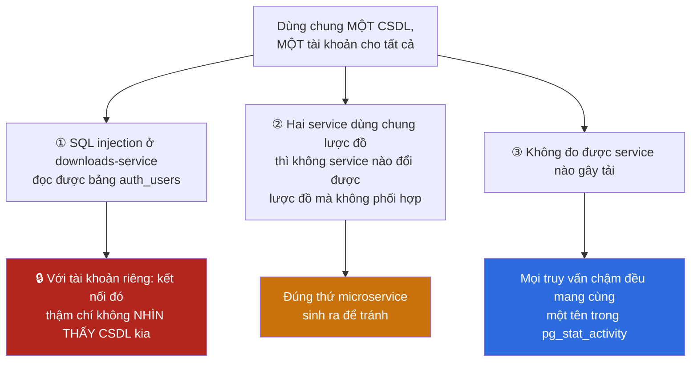

### 8.1 Lý do ① là lý do mạnh nhất, và vì sao schema không đủ

Tách bằng **schema** trong cùng một CSDL vẫn để lại một đường đi: nếu cả hai
service dùng chung một tài khoản, một câu lệnh injection chỉ cần thêm tiền tố
schema — `SELECT * FROM auth.auth_users` — là đọc được. Schema là **không gian
tên**, không phải ranh giới quyền; nó chỉ thành ranh giới khi có thêm phân
quyền đi kèm, và phân quyền đó phải được duy trì đúng qua mọi migration sau
này.

Tách bằng **CSDL riêng + tài khoản riêng** thì đường đi đó không tồn tại:
trong PostgreSQL, một kết nối gắn với đúng một CSDL và **không có cú pháp nào
truy vấn xuyên CSDL** (trừ khi cài thêm `dblink`/`postgres_fdw`, vốn không có
ở đây). Kẻ tấn công không phải "bị chặn" — nó **không có câu lệnh nào để
viết**.

Đây là hiện thân cụ thể của nguyên tắc "database per service", và cũng là biện
pháp cho **A01 Broken Access Control** ở tầng dữ liệu.

### 8.2 Cái giá phải trả, ghi ra đầy đủ

| Được | Mất |
|---|---|
| 🔒 Injection ở service này không chạm dữ liệu service kia | ❌ **Không có khoá ngoại xuyên CSDL** — xem [mục 30](#30-vì-sao-không-có-khoá-ngoại-tới-auth_users) |
| Mỗi service đổi lược đồ độc lập | ❌ Không có giao dịch xuyên hai service |
| `pg_stat_activity` chỉ ra đúng service gây tải | ❌ Không `JOIN` được giữa hai miền dữ liệu |
| Mất một CSDL không kéo theo CSDL khác | ❌ Nhiều bể kết nối hơn, tốn bộ nhớ máy chủ hơn |
| Sao lưu/khôi phục từng service riêng | ❌ Bốn bản sao của cùng một lược đồ `audit_log` ([mục 45](#45-cùng-một-lược-đồ-bốn-nơi-cố-ý)) |

★ **Cột bên phải không phải là danh sách nhược điểm cần khắc phục — nó là
định nghĩa của kiến trúc.** Một hệ thống có cả cô lập bảo mật lẫn toàn vẹn
tham chiếu xuyên service là một hệ thống chưa tách service. Chỗ đáng phê bình
không phải là việc chấp nhận cột phải, mà là việc chấp nhận nó **mà không viết
ra** — nên nó được viết ra ở đây.

---

## 9. 🔒 `REVOKE ALL ON SCHEMA public FROM PUBLIC`

```bash
for db in vnsearch_auth vnsearch_downloads vnsearch_settings; do
  psql -v ON_ERROR_STOP=1 --username "$POSTGRES_USER" --dbname "$db" <<-SQL
      REVOKE ALL ON SCHEMA public FROM PUBLIC;
      GRANT ALL ON SCHEMA public TO ${db};
SQL
done
```

Hai chữ `public` trong câu lệnh này là **hai thứ hoàn toàn khác nhau**, và
nhầm lẫn giữa chúng là lý do câu lệnh trông thừa:

| Từ | Là gì | Vai trò trong câu lệnh |
|---|---|---|
| `SCHEMA public` | Schema mặc định, nơi bảng không có tiền tố rơi vào | **Đối tượng** bị thu quyền |
| `FROM PUBLIC` | Vai trò giả đại diện cho **mọi tài khoản** trong cụm | **Chủ thể** bị thu quyền |

Câu lệnh đọc là: "thu hồi mọi quyền trên schema `public` khỏi tất cả mọi tài
khoản", rồi cấp lại đúng cho một tài khoản sở hữu.

### 9.1 Vì sao vẫn cần dù PostgreSQL 15+ đã sửa mặc định

PostgreSQL 14 trở về trước cấp quyền `CREATE` trên schema `public` cho vai trò
`PUBLIC`. Nghĩa là tài khoản `vnsearch_downloads`, **nếu** kết nối được tới
CSDL `vnsearch_auth`, sẽ tạo được bảng trong đó. PostgreSQL 15 đã đổi mặc định
này, và dự án đang chạy `postgres:17-alpine` — nên về lý thuyết câu lệnh là
thừa.

★ Chú thích trong tệp nêu đúng lý do giữ nó, và lý do đó đáng học:

> nó khiến cấu hình **đúng bất kể ai chạy trên phiên bản nào**, thay vì đúng
> nhờ may mắn.

Cụ thể: ai đó chạy repo này trên PostgreSQL 13 của một máy chủ sẵn có, hoặc
image bị ghim về phiên bản cũ vì một lý do khác, thì tính chất bảo mật vẫn
giữ. Một biện pháp bảo mật phụ thuộc vào giá trị mặc định của một phiên bản cụ
thể là một biện pháp sẽ hỏng vào lúc không ai để ý.

⚠ Lưu ý phạm vi: vòng lặp chỉ chạy trên **ba** CSDL riêng. CSDL `vnsearch`
dùng chung **không** nằm trong danh sách — xem mục tiếp theo.

---

## 10. ⚠ Hai ngoại lệ: CSDL `vnsearch` dùng chung và schema `football`

Nguyên tắc ở [mục 8](#8--vì-sao-mỗi-service-một-csdl-không-phải-một-schema)
được áp dụng cho ba service dữ liệu cá nhân. Nó **không** được áp dụng cho ba
service còn lại, và đây là chỗ tài liệu phải trung thực.

### 10.1 Ngoại lệ thứ nhất — `documents`/`outlinks` dùng chung giữa hai service

```
CSDL vnsearch, tài khoản vnsearch
├─ public.documents   ← crawler-service GHI (PostgresImportRunner)
│                       search-service  ĐỌC (PostgresDocumentStore)
└─ public.outlinks    ← cùng hai service
```

Hai service dùng **chung một lược đồ, chung một tài khoản**. Đây đúng là tình
huống mà lý do ② trong `init-db.sh` cảnh báo: không service nào đổi được lược
đồ mà không phối hợp với service kia.

Lập luận bênh vực có thật và cần được nêu: `documents`/`outlinks` là **một
miền dữ liệu duy nhất** — corpus — chỉ được nhìn từ hai phía (một bên ghi, một
bên đọc). Đây không phải hai miền nghiệp vụ bị nhét chung; đây là một miền có
hai người dùng. Tách nó thành hai CSDL sẽ đòi hỏi sao chép dữ liệu, và corpus
thì lớn.

⚠ Điều **không** có lập luận bênh vực: corpus là dữ liệu **công khai**
(nội dung trang web đã crawl), nhưng nó dùng tài khoản `vnsearch` — vốn là tài
khoản `POSTGRES_USER` của cụm, tức là **superuser**. Một injection ở
search-service chạy với quyền superuser, và superuser thì vào được **mọi** CSDL,
kể cả `vnsearch_auth`. Toàn bộ hàng rào dựng ở mục 8 bị đi vòng qua bằng chính
tài khoản này.

**Cách sửa, cụ thể:** thêm vào `init-db.sh` một tài khoản `vnsearch_corpus`
không phải superuser, cấp quyền `SELECT` cho search-service và
`SELECT/INSERT/UPDATE/DELETE` cho crawler-service trên đúng hai bảng đó, rồi
đổi `APP_STORAGE_POSTGRES_USER` trong `docker-compose.yml`. Đây là thay đổi
nhỏ và bịt đúng lỗ lớn nhất còn lại của tầng dữ liệu.

### 10.2 Ngoại lệ thứ hai — schema `football` trong CSDL dùng chung

```yaml
FOOTBALL_DB_USER: vnsearch
FOOTBALL_DB_NAME: vnsearch
```

football-service dùng **cùng CSDL và cùng tài khoản** với search-service, chỉ
tách bằng schema `football`. Chú thích trong `docker-compose.yml` nói rõ đây
là lựa chọn có ý thức. Mức cô lập ở đây **thấp hơn** ba service kia đúng một
bậc: schema là không gian tên, không phải ranh giới quyền
([mục 8.1](#81-lý-do--là-lý-do-mạnh-nhất-và-vì-sao-schema-không-đủ)) — nên
football-service **nhìn thấy** `public.documents`, và ngược lại.

Với dữ liệu bóng đá (cache của một API công khai) thì mức cô lập đó tương xứng
với giá trị của dữ liệu. Vấn đề không nằm ở bản thân dữ liệu bóng đá mà nằm ở
việc nó dùng tài khoản superuser — cùng một vấn đề đã nêu ở 10.1, và cùng một
cách sửa.

### 10.3 Bảng tổng kết mức cô lập thật

| Miền dữ liệu | CSDL riêng | Tài khoản riêng | Tài khoản là superuser | Mức cô lập |
|---|:---:|:---:|:---:|---|
| Tài khoản (`auth`) | ✅ | ✅ | ❌ | 🔒 Đầy đủ |
| Tải xuống | ✅ | ✅ | ❌ | 🔒 Đầy đủ |
| Cài đặt | ✅ | ✅ | ❌ | 🔒 Đầy đủ |
| Corpus | ❌ | ❌ | ⚠ **CÓ** | Không có |
| Bóng đá | ❌ (chỉ schema) | ❌ | ⚠ **CÓ** | Không có |
| Lịch sử (Mongo) | ✅ (CSDL riêng) | ❌ không xác thực | — | Chỉ mạng nội bộ |
| Token (Redis) | ❌ (db 0) | ❌ không xác thực | — | Chỉ mạng nội bộ |

★ Đọc bảng này theo cột "Mức cô lập": ba dòng đầu là phần **làm đúng và làm
tốt**; bốn dòng sau là phần còn lại phải làm. Một tài liệu thiết kế CSDL có
giá trị là tài liệu chỉ ra được cả hai, kèm khoảng cách giữa chúng.

---

## 11. Ranh giới được giữ cả ở tầng HTTP: analytics KHÔNG đọc CSDL

Ranh giới dựng ở tầng CSDL sẽ vô nghĩa nếu một service khác đi vòng qua nó
bằng cách kết nối thẳng vào CSDL của service khác. analytics-service là chỗ
cám dỗ đó lớn nhất: nó cần đếm số tài khoản, số lượt tải, số truy vấn — toàn
những con số nằm sẵn trong ba CSDL kia, và một câu `SELECT count(*)` thì nhanh
hơn hẳn một lượt gọi HTTP.

Nó **không** làm vậy. Chú thích trong `AdminDashboardAssembler.java` nêu lý do:

> Đọc chung CSDL nhanh hơn và ít mã hơn. Nó cũng xoá sạch ranh giới service:
> hai service kia không đổi được lược đồ nữa (service này sẽ vỡ), và một lỗ
> hổng ở đây chạm tới bảng `auth_users` — nơi chứa hash mật khẩu. Một endpoint
> hẹp trả về vài con số giữ nguyên ranh giới: bên này không biết bảng tên gì,
> cột tên gì.

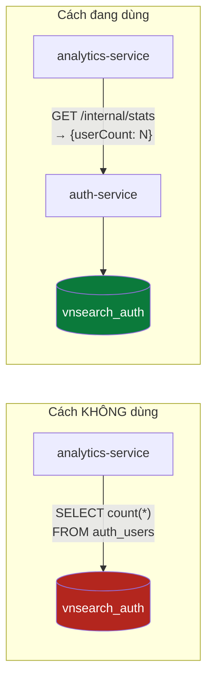

★ **Điểm mấu chốt: kết nối CSDL không phải thứ duy nhất phải kiểm soát —
"biết bảng tên gì" cũng là một dạng phụ thuộc.** Một service biết
`auth_users` có cột `created_at` là một service sẽ vỡ khi cột đó đổi tên, dù
nó chưa từng mở một kết nối nào. Endpoint hẹp trả về `{userCount: N}` cắt cả
hai loại phụ thuộc cùng lúc: không quyền truy cập, và không hiểu biết về lược
đồ.

Đây là lý do ranh giới dữ liệu của hệ thống này được giữ ở **hai tầng**: phân
quyền PostgreSQL chặn đường đi vật lý ([mục 8](#8--vì-sao-mỗi-service-một-csdl-không-phải-một-schema)),
và thiết kế API chặn cả ý định đi đường đó. Tầng thứ hai không cưỡng chế được
bằng máy — nó chỉ tồn tại nếu người viết mã tiếp theo đọc được lý do — nên nó
được viết thành một khối chú thích dài ngay trên đầu lớp, thay vì một dòng
trong tài liệu mà không ai mở.

---

# PHẦN III — BA CƠ CHẾ MIGRATION

VnSearch không có MỘT cơ chế migration. Nó có **ba**, và ba cơ chế đó không
phải là kết quả của việc thiếu thống nhất mà là hệ quả trực tiếp của ba ngôn
ngữ, ba vòng đời triển khai khác nhau — cộng thêm một chỗ **không có cơ chế
nào**, là mắt xích yếu nhất của toàn bộ tầng dữ liệu (mục 14).

```
   auth-service (Java/Spring)      →  Flyway            (V1__, V2__)
   downloads / settings / football →  golang-migrate    (0001_, 0002_)
   corpus tài liệu (core-search)   →  schema.sql chạy tay ⚠  KHÔNG CÓ GÌ
```

Ba mục tiếp theo mô tả từng cơ chế; mục 15 giải thích vì sao cả ba đều từ chối
đường tắt `ddl-auto=update`; mục 16 đặt chúng cạnh nhau trong một bảng.

---

## 12. Flyway — auth-service

auth-service là service duy nhất viết bằng Java có CSDL riêng, và nó dùng
Flyway — công cụ migration của hệ sinh thái JVM. Cấu hình nằm trọn trong
`application-postgres.properties`:

```properties
# --- Flyway ---
spring.flyway.enabled=true
spring.flyway.locations=classpath:db/migration
# BẬT: Flyway kiểm tra checksum của mọi tệp đã chạy trước khi chạy tệp mới.
# Đây là cổng chặn phát hiện việc ai đó sửa một tệp migration cũ — thứ làm
# lệch lược đồ giữa các môi trường mà không để lại dấu vết nào.
spring.flyway.validate-on-migrate=true
# Tạo bảng lịch sử nếu schema đang trống, thay vì từ chối chạy. Cần cho lần
# triển khai đầu tiên vào một CSDL mới tinh.
spring.flyway.baseline-on-migrate=true
```

Ba dòng, ba quyết định tách bạch:

| Thuộc tính | Giá trị | Vì sao |
|---|---|---|
| `locations` | `classpath:db/migration` | Tệp SQL được đóng vào JAR, đọc qua classpath — không phụ thuộc thư mục làm việc lúc chạy, nhưng vẫn phụ thuộc **classpath**, không nằm hẳn trong mã máy như Go (mục 13) |
| `validate-on-migrate` | `true` | Trước khi chạy tệp mới, Flyway so checksum mọi tệp **đã chạy**. Ai sửa một tệp cũ → khởi động thất bại. Đây là cổng chặn duy nhất phát hiện lược đồ lệch giữa các môi trường |
| `baseline-on-migrate` | `true` | Không có nó, Flyway từ chối chạy vào một schema chưa có bảng lịch sử. Đây chính là tình huống triển khai lần đầu vào CSDL mới tinh |

Hai tệp hiện có, đánh số theo quy ước `V<số>__<mô tả>.sql`:

```
backend/java/services/auth-service/src/main/resources/db/migration/
├── V1__tai_khoan.sql     schema `auth`, bảng auth_users, 2 chỉ mục, COMMENT
└── V2__audit_log.sql     bảng auth.audit_log, 2 chỉ mục
```

### 12.1 ★ Vì sao là một profile chứ không phải bốn công tắc

Đây là quyết định thiết kế đáng chú ý nhất của mục này, và chú thích đầu tệp
`application-postgres.properties` nói thẳng lý do:

> Chuyển sang PostgreSQL không phải một công tắc mà là BỐN thay đổi phải xảy
> ra CÙNG LÚC: gỡ loại trừ DataSource, gỡ loại trừ Flyway, đổi `app.auth.store`,
> và có đủ thông tin kết nối. Thiếu một trong bốn thì service hoặc không khởi
> động, hoặc — tệ hơn — khởi động rồi **âm thầm ghi tài khoản vào tệp JSON**
> trong khi người vận hành tin rằng nó đang ghi vào CSDL.
>
> Gói cả bốn vào một cái tên duy nhất thì không thể bật một nửa.

Chế độ hỏng nguy hiểm ở đây không phải "service chết" — service chết thì ai
cũng thấy. Nguy hiểm là **service sống mà ghi sai chỗ**: tài khoản mới tạo nằm
trong tệp JSON, lần triển khai sau container bị thay thì chúng biến mất, và
không có một dòng lỗi nào trong suốt quá trình. Bốn biến bật/tắt độc lập tạo ra
$2^4$ tổ hợp, phần lớn trong đó là các trạng thái nửa vời như vậy. Một cái tên
profile duy nhất chỉ có hai trạng thái.

Ở profile mặc định, Flyway bị **loại trừ khỏi tự động cấu hình** ngay trong
`application.properties` (dòng ~110):

```properties
spring.autoconfigure.exclude=org.springframework.boot.autoconfigure.security.servlet.UserDetailsServiceAutoConfiguration,org.springframework.boot.autoconfigure.jdbc.DataSourceAutoConfiguration,org.springframework.boot.autoconfigure.jdbc.DataSourceTransactionManagerAutoConfiguration,org.springframework.boot.autoconfigure.flyway.FlywayAutoConfiguration
```

Profile `postgres` ghi đè dòng đó bằng một danh sách **ngắn hơn**, chỉ còn
`UserDetailsServiceAutoConfiguration`:

```properties
spring.autoconfigure.exclude=org.springframework.boot.autoconfigure.security.servlet.UserDetailsServiceAutoConfiguration
```

⚠ **Bẫy Spring có thật, được chú thích ngay tại chỗ:** Spring **không hợp nhất**
hai danh sách `spring.autoconfigure.exclude`, nó lấy danh sách của tệp ưu tiên
cao hơn. Nên tệp profile phải **chép lại** dòng loại trừ `UserDetailsService`;
bỏ sót nó làm dòng log `"Using generated security password"` quay trở lại — tức
là Spring Security tự dựng một người dùng mặc định bên cạnh kho tài khoản thật.

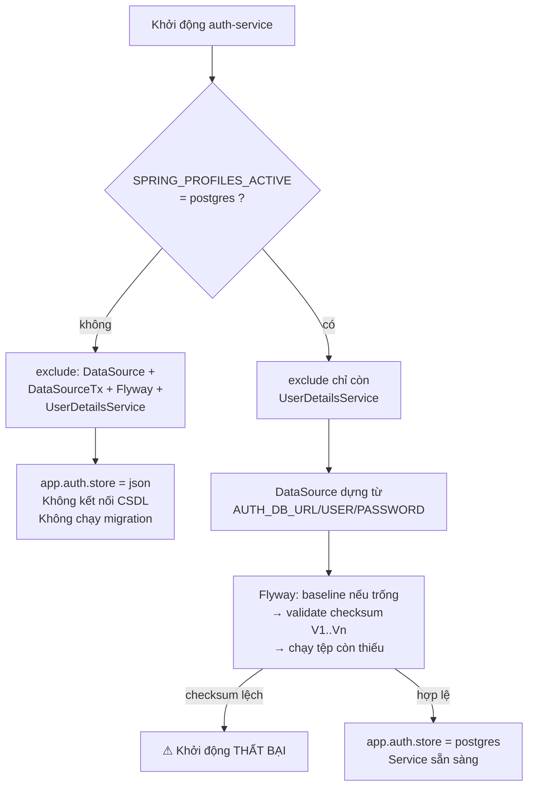

<details><summary>Xem bản chữ (ASCII)</summary>

```
Khởi động auth-service
        |
        +-- profile != postgres --> exclude 4 lớp tự động cấu hình
        |                            store = json, không CSDL, không migration
        |
        +-- profile == postgres --> exclude còn 1 lớp (UserDetailsService)
                                     |
                                     +-> dựng DataSource
                                     +-> Flyway baseline (nếu schema trống)
                                     +-> Flyway validate checksum V1..Vn
                                     |      +-- lệch --> KHỞI ĐỘNG THẤT BẠI
                                     +-> chạy các tệp V còn thiếu
                                     +-> store = postgres
```
</details>

### 12.2 Quy tắc bất di bất dịch

Chú thích đầu `V1__tai_khoan.sql` ghi một quy tắc vận hành, không phải một lời
khuyên:

> **QUY TẮC BẤT DI BẤT DỊCH:** tệp migration đã chạy ở đâu đó thì KHÔNG BAO GIỜ
> sửa nữa. Flyway lưu checksum; sửa một tệp cũ làm mọi môi trường đã chạy nó
> báo lỗi và dừng khởi động. Muốn đổi thì thêm V2, V3.

Quy tắc này chỉ có hiệu lực **vì** `validate-on-migrate=true`. Hai dòng cấu
hình và một quy tắc con người là cùng một cơ chế nhìn từ hai phía: cấu hình
biến việc vi phạm quy tắc thành một lỗi khởi động ồn ào thay vì một sai lệch âm
thầm.

↺ Bản thân nội dung các tệp cũng viết theo lối idempotent —
`CREATE SCHEMA IF NOT EXISTS`, `CREATE TABLE IF NOT EXISTS`,
`CREATE INDEX IF NOT EXISTS`. Điều này **không thừa** dù đã có bảng lịch sử: nó
cho phép cùng những tệp đó được áp lên một CSDL đã dựng tay một phần mà không
đổ vỡ.

---

## 13. golang-migrate + `embed.FS` — ba service Go

Ba service Go — `downloads`, `settings`, `football` — dùng
[golang-migrate](https://github.com/golang-migrate/migrate). Toàn bộ logic nằm
trong **một hàm duy nhất** ở `backend/go/platform/pg/pg.go`, dùng chung cho cả ba:

```go
func Migrate(dsn string, files fs.FS, dir string) error {
	src, err := iofs.New(files, dir)
	if err != nil {
		return err
	}
	m, err := migrate.NewWithSourceInstance("iofs", src, "pgx5://"+stripScheme(dsn))
	if err != nil {
		return err
	}
	defer m.Close()
	if err := m.Up(); err != nil && !errors.Is(err, migrate.ErrNoChange) {
		return err
	}
	return nil
}
```

Bốn chi tiết đáng đọc kỹ:

**① `iofs.New(files, dir)` — tệp SQL nằm TRONG binary.** Mỗi service khai báo
đúng một dòng ở `main.go`:

```go
//go:embed migrations/*.sql
var migrationsFS embed.FS
```

★ Đây là **ưu điểm thật so với Flyway**, không phải sở thích. Flyway đọc
`classpath:db/migration` — tệp nằm trong JAR, nhưng vẫn là một tài nguyên phải
được classpath phân giải đúng lúc chạy. Với `embed.FS`, nội dung SQL được trình
biên dịch Go nhúng thẳng vào phần dữ liệu của tệp thực thi. Binary chạy trong
một image `scratch`, không có thư mục `migrations/` nào trên đĩa, vẫn migrate
được. Không có trạng thái "chạy sai vì thiếu thư mục" — trạng thái đó không tồn
tại.

**② Mỗi service embed migrations của RIÊNG nó.** `pg.Migrate` nhận `fs.FS` làm
tham số chứ không tự biết tệp ở đâu. Ba lời gọi, ba cây tệp độc lập:

```
backend/go/services/
├── downloads/
│   ├── main.go                      //go:embed migrations/*.sql
│   └── migrations/
│       ├── 0001_downloads.up.sql        bảng downloads + 2 chỉ mục
│       ├── 0001_downloads.down.sql      DROP TABLE IF EXISTS downloads
│       ├── 0002_audit_log.up.sql        bảng audit_log + 2 chỉ mục
│       └── 0002_audit_log.down.sql      DROP TABLE IF EXISTS audit_log
├── settings/
│   ├── main.go                      //go:embed migrations/*.sql
│   └── migrations/
│       ├── 0001_user_settings.up.sql    bảng user_settings (JSONB + version)
│       ├── 0001_user_settings.down.sql
│       ├── 0002_audit_log.up.sql
│       └── 0002_audit_log.down.sql
└── football/
    ├── main.go                      //go:embed migrations/*.sql
    └── migrations/
        ├── 0001_football_cache.up.sql   schema football + 3 bảng
        └── 0001_football_cache.down.sql DROP 3 bảng (thứ tự ngược)
```

Hệ quả trực tiếp của việc tách: `downloads` và `settings` có **hai tệp
`0002_audit_log.up.sql` nội dung giống hệt nhau**. Đó là trùng lặp có chủ đích —
mỗi service sở hữu lược đồ của mình và không service nào phải chờ service khác
migrate xong. Cái giá là khi đổi cấu trúc `audit_log` thì phải sửa ở hai chỗ.

**③ `migrate.ErrNoChange` KHÔNG phải lỗi.** `m.Up()` trả về `ErrNoChange` khi
không còn tệp nào để chạy — tức là **trường hợp bình thường** ở mọi lần khởi
động thứ hai trở đi. Dòng `!errors.Is(err, migrate.ErrNoChange)` là thứ biến
`Migrate()` thành ↺ idempotent: gọi lại bao nhiêu lần cũng vẫn trả về `nil`.
Thiếu đúng nửa dòng đó, mọi container restart đều thất bại.

**④ `stripScheme` + `"pgx5://"`.** golang-migrate chọn driver theo scheme của
URL. DSN mà `pg.DSN()` dựng ra có scheme `postgres://`, nên hàm cắt scheme cũ
rồi ghép `pgx5://` — cùng một CSDL, hai cách gọi tên driver khác nhau giữa lớp
migration và lớp kết nối `pgxpool`.

Bảng lịch sử của golang-migrate tên là **`schema_migrations`** (mặc định của
thư viện), chứa số phiên bản hiện tại và một cờ `dirty`. Cờ `dirty` được bật khi
một migration chạy dở rồi lỗi; lần khởi động sau golang-migrate **từ chối chạy**
cho tới khi có người can thiệp — cùng triết lý "dừng ồn ào" như checksum của
Flyway.

### 13.1 Thứ tự trong `main.go`: migrate TRƯỚC, connect SAU

Cả ba `main.go` đều theo đúng trình tự này (trích `football/main.go`):

```go
dsn := databaseDSN()

if err := pg.Migrate(dsn, migrationsFS, "migrations"); err != nil {
	return err
}

pool, err := pg.Connect(ctx, dsn, config.EnvInt32("FOOTBALL_DB_POOL", 5))
if err != nil {
	return err
}
defer pool.Close()
```

`Migrate` mở kết nối riêng và đóng ngay (`defer m.Close()`), rồi mới tới
`Connect` dựng `pgxpool` lâu dài. Hai lý do: bể kết nối không bị giữ trong suốt
thời gian chạy DDL, và nếu migration thất bại thì service **chết ngay lúc khởi
động** thay vì phục vụ request trên một lược đồ sai.

`pg.Connect` cũng `Ping` với hạn 5 giây và đóng bể nếu ping hỏng — không có
trạng thái "bể tồn tại nhưng CSDL không với tới được".

### 13.2 `pg.DSN()` — cắt `jdbc:` và percent-encode mật khẩu

```go
func DSN(rawURL, user, password, sslmode string) string {
	trimmed := strings.TrimPrefix(strings.TrimSpace(rawURL), "jdbc:")
	u, err := url.Parse(trimmed)
	if err != nil || u.Host == "" {
		return trimmed
	}
	u.Scheme = "postgres"
	if user != "" {
		u.User = url.UserPassword(user, password)
	}
	...
}
```

Hai việc, hai lý do khác nhau:

**Cắt `jdbc:`** — cho phép dùng lại **cùng một chuỗi URL** mà cấu hình Spring
dùng (`jdbc:postgresql://postgres:5432/...`). Đây là sự nhân nhượng có ý thức
với thực tế vận hành: người triển khai chép URL từ service Java sang service Go
mà không phải nhớ sửa tiền tố.

**`url.UserPassword(user, password)`** — thư viện chuẩn tự percent-encode phần
thông tin đăng nhập. 🔒 Mật khẩu sinh ngẫu nhiên rất hay chứa `@` hoặc `:`, đúng
những ký tự phân tách của cú pháp URL. Ghép chuỗi bằng tay
(`"postgres://"+user+":"+pass+"@"+host`) thì một dấu `@` trong mật khẩu **cắt
URL sai chỗ**, và lỗi hiện ra là `password authentication failed` — trỏ người
đọc đi sai hướng hoàn toàn: họ sẽ đi kiểm tra `pg_hba.conf` và tài khoản CSDL
trong khi lỗi nằm ở phép nối chuỗi.

⚠ Đây là lý do `docker-compose.yml` truyền **từng phần** cho football thay vì
một URL ghép sẵn (chú thích ngay tại chỗ, quanh dòng 390):

```yaml
      # Truyền TỪNG PHẦN thay vì một URL ghép sẵn: mật khẩu sinh ngẫu nhiên
      # rất hay chứa `@` hoặc `:`, đúng những ký tự phân tách của cú pháp URL.
      FOOTBALL_DB_HOST: postgres
      FOOTBALL_DB_PORT: "5432"
      FOOTBALL_DB_USER: vnsearch
      FOOTBALL_DB_PASSWORD: ${POSTGRES_PASSWORD:-vnsearch}
      FOOTBALL_DB_NAME: vnsearch
```

football có hàm `databaseDSN()` riêng: nếu `FOOTBALL_DB_URL` được đặt thì dùng
thẳng, ngược lại dựng `url.URL` từ năm biến rời — cũng qua `url.UserPassword`.
Hai đường vào, cùng một cơ chế thoát ký tự.

---

## 14. ⚠ `schema.sql` chạy tay — mắt xích yếu nhất

Đây là mục quan trọng nhất của PHẦN III, và nó nói về một **điểm yếu thật**,
không phải một đánh đổi khéo.

Lược đồ của corpus tài liệu — bảng `documents`, bảng `outlinks`, cột `tsv` và
chỉ mục GIN — nằm ở
`backend/java/libs/core-search/src/main/resources/db/schema.sql`. Tệp này
**không được công cụ migration nào quản lý**. Không Flyway (core-search là một
thư viện, không phải ứng dụng Spring Boot có `spring.flyway.*`), không
golang-migrate. Nó được chạy tay bằng `psql`, theo đúng cách ghi trong
`docs/STORAGE-PIPELINE.md` mục 50.1:

```bash
# ② tạo lược đồ (nếu chưa có)
docker compose exec -T postgres psql -U vnsearch -d vnsearch \
    < backend/java/libs/core-search/src/main/resources/db/schema.sql
```

### 14.1 Ba hệ quả cụ thể

**① Không có bảng lịch sử → không biết môi trường nào đang ở phiên bản nào.**
`auth` có bảng `flyway_schema_history`, ba service Go có `schema_migrations`.
Corpus **không có gì**. Câu hỏi "máy CI đã chạy phiên bản schema có cột `tsv`
chưa?" chỉ trả lời được bằng cách mở `psql` và `\d documents` — tức là bằng
kiểm tra thủ công, trên từng môi trường, mỗi lần nghi ngờ.

**② Không lùi được.** Không có tệp `.down.sql` tương ứng, cũng không có nơi ghi
đã áp gì để mà lùi. So sánh: `downloads` có `0001_downloads.down.sql`, football
có `0001_football_cache.down.sql` drop cả ba bảng theo **thứ tự ngược** —
`settings` trước, rồi `api_call_log`, rồi `api_cache` — vì thứ tự ngược là điều
kiện để không vướng phụ thuộc. Với `schema.sql`, thao tác lùi tương đương là
người vận hành tự gõ `DROP TABLE` và tự nhớ thứ tự.

**③ `ADD COLUMN IF NOT EXISTS` là idempotent thủ công, KHÔNG phải versioning.**
Tệp tự làm cho mình chạy lại được:

```sql
CREATE TABLE IF NOT EXISTS documents (...);
CREATE TABLE IF NOT EXISTS outlinks (...);
CREATE INDEX IF NOT EXISTS idx_outlinks_from ON outlinks (from_doc_id);

ALTER TABLE documents
    ADD COLUMN IF NOT EXISTS tsv tsvector
    GENERATED ALWAYS AS (...) STORED;

CREATE INDEX IF NOT EXISTS idx_documents_tsv ON documents USING GIN (tsv);
```

↺ Chạy tệp này hai lần không hỏng gì — đó là điều tốt, và cột `tsv` được thêm
bằng `ALTER ... ADD COLUMN IF NOT EXISTS` chính là dấu vết của một thay đổi
lược đồ **đến sau**, được nhét vào cùng một tệp.

Nhưng idempotent ≠ có phiên bản. Sự khác biệt lộ ra ở đúng tình huống mà
migration sinh ra để giải quyết: **đổi một thứ đã tồn tại**. `IF NOT EXISTS`
chỉ xử lý được phép thêm. Nếu ngày mai cần đổi cấu hình `to_tsvector` từ
`'simple'` sang một cấu hình khác, hoặc đổi kiểu một cột, thì `IF NOT EXISTS`
**bỏ qua trong im lặng** trên mọi CSDL đã có cột đó — tệp chạy trọn vẹn, in ra
`ALTER TABLE`, và lược đồ vẫn giữ nguyên định nghĩa cũ. Không lỗi, không cảnh
báo, và hai môi trường lệch nhau vĩnh viễn.

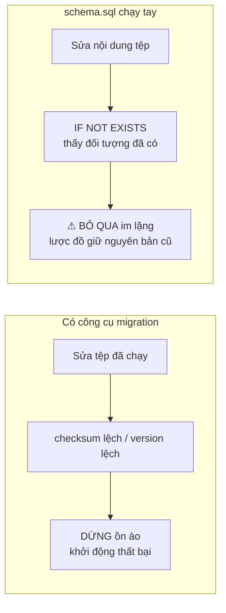

<details><summary>Xem bản chữ (ASCII)</summary>

```
CÓ CÔNG CỤ MIGRATION            schema.sql CHẠY TAY
------------------------        ---------------------------
sửa tệp đã chạy                 sửa nội dung tệp
      |                               |
checksum/version lệch           IF NOT EXISTS thấy đã có
      |                               |
DỪNG — khởi động thất bại       BỎ QUA im lặng, lược đồ cũ
(người vận hành BIẾT)           (không ai biết)
```
</details>

### 14.2 Đề xuất cách sửa

Hai đường, đều khả thi với cấu trúc hiện tại:

| Cách | Việc phải làm | Đánh đổi |
|---|---|---|
| Đưa vào Flyway trong `core-search` | Chuyển `db/schema.sql` thành `db/migration/V1__documents.sql`, bật `spring.flyway.*` ở ứng dụng nạp/tìm kiếm dùng thư viện này | Thêm phụ thuộc Flyway vào một thư viện vốn cố ý giữ nhẹ và chạy được không cần Spring context (mục 15) |
| Một thư mục golang-migrate riêng | Tạo `migrations/` cho lược đồ corpus, chạy bằng CLI `migrate` hoặc bằng một service Go đã có sẵn `pg.Migrate` | Lược đồ do Java đọc/ghi lại được quản lý bởi công cụ Go — ranh giới sở hữu mờ đi |

Điểm chung của cả hai: có bảng lịch sử, và mọi thay đổi lược đồ trở thành một
tệp mới thay vì một lần sửa tại chỗ. Việc nào cũng nhỏ hơn nhiều so với cái giá
của một lần lệch lược đồ không ai phát hiện.

---

## 15. ★ Vì sao KHÔNG dùng `ddl-auto=update`

Hibernate/JPA có thể tự suy ra lược đồ từ lớp Java. Cám dỗ rất lớn: xoá cả thư
mục `db/migration`, đặt một dòng `spring.jpa.hibernate.ddl-auto=update`, xong.
Chú thích đầu `V1__tai_khoan.sql` liệt kê **ba lý do** không làm vậy:

```sql
-- VÌ SAO DÙNG FLYWAY CHỨ KHÔNG PHẢI ddl-auto=update. Hibernate/JPA có thể tự
-- suy ra lược đồ từ lớp Java, và cám dỗ đó rất lớn. Ba lý do không:
--   1. Nó KHÔNG tạo ra lịch sử. Không ai trả lời được "cột này thêm vào lúc
--      nào, vì việc gì" — câu hỏi đầu tiên của mọi cuộc điều tra sự cố.
--   2. Nó KHÔNG lùi được. Một lần triển khai hỏng không có đường quay lại.
--   3. Nó tự ý sửa lược đồ ở môi trường thật. Với một hệ thống ngân hàng, mọi
--      thay đổi lược đồ phải là một tệp có thể đọc, duyệt và phê duyệt TRƯỚC
--      khi chạy — đó chính là tệp này.
```

Đọc kỹ thì ba lý do không cùng hạng:

```
   ③ TỰ Ý SỬA LƯỢC ĐỒ Ở MÔI TRƯỜNG THẬT          ★★★  NẶNG NHẤT
      Thay đổi lược đồ xảy ra như một tác dụng phụ của việc triển khai mã,
      không phải như một hành động được duyệt trước. Không có bước nào
      để một người thứ hai đọc và phê duyệt.

   ① KHÔNG TẠO RA LỊCH SỬ                         ★★☆
      "Cột này thêm vào lúc nào, vì việc gì" — câu hỏi đầu tiên của mọi
      cuộc điều tra sự cố, và ddl-auto không để lại chỗ nào để trả lời.

   ② KHÔNG LÙI ĐƯỢC                               ★★☆
      Cùng vấn đề mà schema.sql đang mắc (mục 14). Khác biệt: ở đây nó là
      lựa chọn được cân nhắc và từ chối, ở kia là điều còn sót lại.
```

### 15.1 Lý do thứ tư: JPA trên classpath giết ứng dụng khi không có CSDL

Ngoài ba lý do trên còn một lý do kỹ thuật thuần tuý, và nó là lý do mạnh nhất
xét trên toàn hệ thống. `docs/STORAGE-PIPELINE.md` mục 37 giải thích vì sao
`DocumentRepository` viết bằng JDBC thuần chứ không JPA:

> Nếu `spring-boot-starter-data-jpa` nằm trên classpath, Spring Boot sẽ cố dựng
> DataSource lúc khởi động. Không có PostgreSQL đang chạy ⇒ ứng dụng **CHẾT
> NGAY khi khởi động** — trước cả khi chuỗi dự phòng của `SearchEngineFacade`
> có cơ hội chạy.

Nói cách khác: `ddl-auto=update` không phải một dòng cấu hình cô lập. Nó kéo
theo cả JPA, và JPA trên classpath phá vỡ yêu cầu phi chức năng nền tảng của dự
án — **chạy được trên một máy trắng không có Docker**. Chuỗi dự phòng
PostgreSQL → JSON corpus → JSON seed chỉ có nghĩa nếu ứng dụng sống đủ lâu để
duyệt qua nó.

auth-service giải quyết cùng vấn đề đó bằng cơ chế tương tự nhưng ở tầng cấu
hình, chứ không phải ở tầng thư viện — chính là dòng `spring.autoconfigure.exclude`
ở mục 12.1. Chú thích ngay trên dòng đó nói rõ:

```properties
# `spring-boot-starter-jdbc` nằm trên classpath, nên Spring Boot sẽ cố dựng
# một DataSource ngay lúc khởi động và đổ với "Failed to determine a suitable
# driver class" khi không có URL. Chặn phần tự động cấu hình đó là cách duy
# nhất để service chạy được mà không cần PostgreSQL — điều kiện để
# `mvnw test` và `docker compose up` lần đầu không đòi hỏi gì thêm.
```

Ba chỗ khác nhau trong dự án — `DocumentRepository` chọn JDBC thuần,
auth-service loại trừ tự động cấu hình, ba service Go migrate rồi mới connect —
đều xoay quanh cùng một ràng buộc: **sự vắng mặt của CSDL không được phép là
một lỗi khởi động**, trừ khi người vận hành đã nói rõ rằng có CSDL.

---

## 16. Bảng so sánh ba cơ chế

| Tiêu chí | Flyway (auth-service) | golang-migrate (downloads / settings / football) | `schema.sql` (corpus) |
|---|---|---|---|
| **Bảng lịch sử** | ✔ `flyway_schema_history` | ✔ `schema_migrations` (+ cờ `dirty`) | ✘ **không có gì** |
| **Kiểm checksum** | ✔ `validate-on-migrate=true` — sửa tệp cũ ⇒ khởi động thất bại | ✘ theo dõi số phiên bản, không so nội dung | ✘ |
| **Lùi được** | ✘ không có tệp `undo` trong repo | ✔ mỗi bước có `.down.sql` | ✘ |
| **Chạy tự động lúc khởi động** | ✔ nhưng **chỉ ở profile `postgres`**; profile mặc định loại trừ `FlywayAutoConfiguration` | ✔ luôn luôn — `pg.Migrate()` gọi trước `pg.Connect()` | ✘ chạy tay bằng `psql` |
| **Tệp nằm trong artifact** | ~ trong JAR, đọc qua `classpath:db/migration` | ✔ **trong chính binary** qua `//go:embed` + `iofs` | ✘ nằm trong cây nguồn, phải có mặt trên máy chạy |
| **Idempotent khi chạy lại** | ✔ bảng lịch sử + `IF NOT EXISTS` trong SQL | ✔ `migrate.ErrNoChange` được coi là thành công | ↺ chỉ nhờ `IF NOT EXISTS` viết tay |
| **Phạm vi áp dụng** | schema `auth`: `auth_users`, `auth.audit_log` | `downloads`, `user_settings`, `audit_log` (×2), schema `football` (3 bảng) | `documents`, `outlinks`, cột `tsv`, chỉ mục GIN |
| **Số bước hiện có** | 2 (`V1`, `V2`) | downloads 2, settings 2, football 1 | — (một tệp phẳng) |

Đọc theo cột thì thấy ngay ba mức trưởng thành khác nhau:

- **golang-migrate** mạnh nhất về **đóng gói** (tệp trong binary) và **lùi**
  (có `.down.sql`), yếu ở chỗ không kiểm checksum — sửa một tệp `.up.sql` đã
  chạy sẽ không bị ai phát hiện.
- **Flyway** mạnh nhất về **phát hiện sai lệch** (checksum), yếu ở chỗ không có
  tệp lùi và bị **tắt hoàn toàn ở profile mặc định** — tức là cơ chế bảo vệ chỉ
  hoạt động khi profile `postgres` được bật.
- **`schema.sql`** không mạnh ở tiêu chí nào. Đây là chỗ cần sửa trước (mục 14.2).

Điểm chung duy nhất của cả ba, và là điểm đúng: **mọi thay đổi lược đồ đều là
một tệp SQL đọc được, nằm trong repo, đi qua code review** — không lược đồ nào
trong VnSearch được sinh ra từ suy diễn của ORM lúc chạy.

---

# PHẦN IV — CSDL `vnsearch_auth` — TÀI KHOẢN

CSDL nhạy cảm nhất hệ thống. Nó chứa hash mật khẩu, và nó là nơi duy nhất trả
lời được câu hỏi "chuỗi `sub` trong JWT này ứng với ai". Toàn bộ lược đồ của nó
do Flyway quản lý theo phiên bản, trong hai tệp:

| Tệp | Tạo ra gì |
|---|---|
| `V1__tai_khoan.sql` | schema `auth`, bảng `auth_users`, 2 chỉ mục, 2 comment |
| `V2__audit_log.sql` | bảng `auth.audit_log`, 2 chỉ mục |

Bốn mục đầu (17–20) đọc từng quyết định thiết kế của `V1`. Mục 21 là một **lỗi
thật** phát hiện được khi đối chiếu `V1` với `V2` và với cấu hình kết nối.

---

## 17. `auth_users` — đọc từng cột

Nguồn: `backend/java/services/auth-service/src/main/resources/db/migration/V1__tai_khoan.sql`.

| Cột | Kiểu | Ràng buộc | Vì sao |
|---|---|---|---|
| `username` | `VARCHAR(32)` | `NOT NULL`, `PRIMARY KEY` (`pk_auth_users`) | Định danh nghiệp vụ thật; chính là `sub` của JWT. Xem mục 18 về cái giá phải trả. |
| `password_hash` | `VARCHAR(100)` | `NOT NULL` | BCrypt sinh chuỗi **60 ký tự**. Để 100 làm khoảng thở khi đổi sang Argon2id (chuỗi dài hơn) mà không phải chạy migration **đúng lúc đang có sự cố**. |
| `role` | `VARCHAR(16)` | `NOT NULL`, `CHECK (role IN ('USER','ADMIN'))` (`ck_auth_users_role`) | Lưu **TÊN** enum, không lưu số thứ tự. Xem 17.1. |
| `enabled` | `BOOLEAN` | `NOT NULL DEFAULT TRUE` | Khoá tài khoản mà không xoá hàng — xoá hàng làm mất luôn dấu vết ai từng tồn tại. |
| `created_at` | `TIMESTAMPTZ` | `NOT NULL DEFAULT now()` | Có múi giờ, không phải `TIMESTAMP` trần. Trang quản trị sắp theo cột này. |
| `last_login_at` | `TIMESTAMPTZ` | *(cho phép NULL)* | `NULL` mang nghĩa thật: **chưa từng đăng nhập**. Đây là một trong số ít chỗ mà `NULL` không phải "thiếu dữ liệu" mà là một trạng thái nghiệp vụ. |

Kèm hai chỉ mục và hai comment:

```sql
CREATE UNIQUE INDEX IF NOT EXISTS ux_auth_users_username_lower
    ON auth_users (lower(username));

CREATE INDEX IF NOT EXISTS ix_auth_users_created_at ON auth_users (created_at);

COMMENT ON TABLE auth_users IS
    'Tài khoản người dùng VnSearch. Chỉ auth-service được phép truy cập.';
COMMENT ON COLUMN auth_users.password_hash IS
    'Hash BCrypt (cost 10). KHÔNG BAO GIỜ ghi cột này ra log hay ra phản hồi API.';
```

`ix_auth_users_created_at` không phục vụ một truy vấn nào của người dùng cuối.
Nó phục vụ đúng một chỗ: `PostgresUserStore.findAll()` có `ORDER BY created_at`
cho trang quản trị. Chú thích trong `V1` nói thẳng vì sao vẫn tạo nó ngay từ
đầu: *"Không có chỉ mục thì đó là một lần quét toàn bảng cộng sắp xếp — chấp
nhận được với 50 tài khoản, không chấp nhận được với 50 nghìn."* Chỉ mục này rẻ
lúc bảng còn trống và đắt lúc bảng đã đầy — tạo trước là chọn đúng thời điểm.

🔒 Hai `COMMENT ON` không phải trang trí. Chúng nằm trong CSDL, nên bất cứ ai
mở `psql \d+ auth_users` để điều tra sự cố đều đọc được luật "không log cột
này" ngay tại chỗ, không phải đi tìm tài liệu.

### 17.1 ★ Lưu TÊN enum, không lưu số thứ tự

Chú thích trong `V1`:

```sql
-- Lưu TÊN enum chứ không lưu số thứ tự. Lưu số thì chèn một vai trò mới
-- vào giữa enum trong Java sẽ âm thầm đổi nghĩa của mọi hàng đã có — USER
-- thành ADMIN mà không có một dòng lỗi nào.
role            VARCHAR(16)  NOT NULL,
```

Đây là hỏng theo kiểu tệ nhất có thể: **hỏng theo hướng cấp thêm quyền, và
không có ngoại lệ nào**.

```
   enum Role { USER, ADMIN }              lưu số:  USER=0, ADMIN=1
   Hàng trong CSDL:  role = 0   (một người dùng thường)

   Ai đó thêm một vai trò vào GIỮA:
   enum Role { GUEST, USER, ADMIN }       lưu số:  GUEST=0, USER=1, ADMIN=2

   Hàng cũ vẫn là role = 0 → nay đọc ra GUEST.  Người dùng MẤT quyền.
   Nhưng nếu vai trò mới chèn TRƯỚC ADMIN thì hàng role = 1 (USER cũ)
   đọc ra ADMIN.  Người dùng ĐƯỢC THÊM quyền, âm thầm, không lỗi.

   Lưu chuỗi 'USER' → thêm bao nhiêu vai trò vào giữa cũng không đổi nghĩa
   một hàng nào.  Và CHECK IN ('USER','ADMIN') chặn giá trị rác ngay tại CSDL.
```

Phía Java có thêm một lớp lưới an toàn nữa, trong `PostgresUserStore.mapRow()`:

```java
// Role.parse hạ về USER khi gặp giá trị lạ. Ở đây nó là
// lưới an toàn cho trường hợp một hàng được sửa tay trong CSDL:
// hướng an toàn là MẤT quyền, không phải được thêm quyền.
Role.parse(rs.getString("role")),
```

🔒 Nguyên tắc chung của cả hai lớp: **khi không chắc, hạ quyền**. `CHECK` chặn
giá trị lạ đi vào; `Role.parse` chặn giá trị lạ đi ra thành quyền quản trị nếu
bằng cách nào đó nó vẫn lọt vào (ví dụ ai đó `ALTER TABLE ... DROP CONSTRAINT`).

---

## 18. ★ `username` làm khoá chính, và cái giá phải trả

`V1` không dùng `id BIGSERIAL`. Nó dùng thẳng tên tài khoản:

```sql
CONSTRAINT pk_auth_users PRIMARY KEY (username),
```

Đây là quyết định đi ngược thói quen — sách vở gần như luôn khuyên khoá thay
thế (surrogate key). Chú thích trong `V1` giải thích vì sao ở hệ này thì không:

```sql
-- Cân nhắc có thật: khoá tự tăng cho phép ĐỔI TÊN tài khoản mà không phá
-- các tham chiếu. Nhưng ở hệ này, `sub` trong JWT chính là tên tài khoản,
-- và ba service dữ liệu cá nhân phân vùng dữ liệu theo đúng chuỗi đó. Thêm
-- một id nội bộ nghĩa là mọi service phải hỏi auth-service để dịch id sang
-- tên — một lượt gọi mạng cho mỗi request, và một điểm chết chung mới.
-- Đánh đổi: VnSearch không cho đổi tên tài khoản. Ghi rõ ở đây để lần sau
-- không ai phải đoán vì sao.
```

### 18.1 Vì sao id nội bộ lại đắt đến thế ở đây

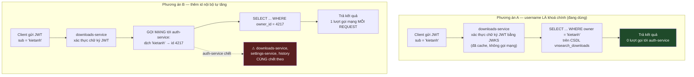

<details><summary>Xem bản chữ (ASCII)</summary>

```
PHƯƠNG ÁN A — username LÀ khoá chính  (đang dùng)

  Client ──JWT(sub='kietanh')──▶ downloads-service
                                   │ xác thực chữ ký bằng JWKS đã cache
                                   │ (không đi mạng)
                                   ▼
                    SELECT ... WHERE owner = 'kietanh'
                                   ▼
                          kết quả — 0 lượt gọi auth-service


PHƯƠNG ÁN B — thêm id nội bộ tự tăng

  Client ──JWT(sub='kietanh')──▶ downloads-service
                                   │ xác thực chữ ký
                                   ▼
                       ┌───────────────────────────┐
                       │ GỌI MẠNG → auth-service   │  ⚠ mỗi request một lượt
                       │ 'kietanh' → id 4217       │
                       └───────────┬───────────────┘
                                   ▼
                    SELECT ... WHERE owner_id = 4217
                                   ▼
                          kết quả — 1 lượt gọi mạng/request

  Và: auth-service chết ⇒ downloads-service, settings-service, history
      CÙNG chết theo. Một điểm chết chung mới, không có gì bù lại.
```

</details>

Hai chi phí của phương án B đều thật:

1. **Một lượt khứ hồi mạng cho mỗi request.** Không cache được an toàn theo
   kiểu đơn giản: nếu cache ánh xạ tên → id thì một lần đổi tên sẽ làm cache
   trả sai chủ sở hữu dữ liệu — tức là đúng cái tính năng mà id nội bộ sinh ra
   để hỗ trợ lại là thứ phá cache.
2. **Một điểm chết chung mới.** Hiện tại ba service dữ liệu cá nhân xác thực
   token **offline** bằng JWKS đã cache; auth-service có thể chết mà chúng vẫn
   phục vụ được người dùng đã có token. Thêm bước dịch id là xoá bỏ tính chất
   đó.

### 18.2 Cái giá phải trả — nói thẳng

★ **VnSearch KHÔNG cho đổi tên tài khoản.**

Đây không phải một thiếu sót chưa làm mà là **hệ quả trực tiếp** của quyết định
ở trên, và nó cần được ghi vào báo cáo đúng như vậy. Muốn cho đổi tên thì phải:

- thêm id nội bộ, và
- di trú toàn bộ dữ liệu đã phân vùng theo tên ở ba CSDL khác, và
- chấp nhận cả hai chi phí ở mục 18.1.

Chú thích trong `V1` kết bằng một câu đáng học: *"Ghi rõ ở đây để lần sau không
ai phải đoán vì sao."* Một quyết định đánh đổi mà không ghi lại lý do thì sáu
tháng sau sẽ bị ai đó "sửa" như một thiếu sót.

---

## 19. ★ `ux_auth_users_username_lower` — ràng buộc đặt ở CSDL, không ở Java

```sql
CREATE UNIQUE INDEX IF NOT EXISTS ux_auth_users_username_lower
    ON auth_users (lower(username));
```

Tên tài khoản **không phân biệt hoa thường**. Điều đáng nói không phải luật đó
mà là **nơi luật được canh**.

Chú thích trong `V1`:

```sql
-- Canh trong Java (gọi toLowerCase trước khi ghi) trông đủ, nhưng nó chỉ đúng
-- với đường đi qua đúng đoạn mã đó. Một câu lệnh INSERT chạy tay lúc khắc phục
-- sự cố, một job nhập dữ liệu, hay một phiên bản mã cũ vẫn tạo được `Admin`
-- bên cạnh `admin`: hai hàng mà người dùng tin là một tài khoản, và người nào
-- đăng nhập vào hàng nào thì tuỳ câu truy vấn.
```

```
   RÀNG BUỘC CANH Ở TẦNG JAVA — những đường đi KHÔNG qua nó

        AuthController.register()  ──toLowerCase()──▶  INSERT     ✔ đúng
        psql lúc khắc phục sự cố   ─────────────────▶  INSERT     ✘ lọt
        job nhập dữ liệu một lần   ─────────────────▶  INSERT     ✘ lọt
        bản triển khai mã CŨ       ─────────────────▶  INSERT     ✘ lọt
        script seed của môi trường ─────────────────▶  INSERT     ✘ lọt

   RÀNG BUỘC CANH Ở TẦNG CSDL — mọi đường đi đều đi qua nó

        MỌI đường ở trên ───────────────────────────▶  CSDL từ chối  ✔
```

Hậu quả nếu để lọt không phải là "dữ liệu hơi bẩn". Nó là: có hai hàng
`Admin` và `admin`, người dùng tin rằng đó là một tài khoản, và **hàng nào được
đăng nhập vào phụ thuộc câu truy vấn nào chạy**. Đó là một lỗ hổng leo thang
quyền: kẻ tấn công đăng ký `Admin` khi đã có `admin`, rồi tự đặt mật khẩu cho
hàng của mình.

Javadoc của `PostgresUserStore` nhắc lại đúng lập luận này và bổ sung lý do
tổng quát hơn — một phép kiểm tra `if (exists)` trong Java **không bao giờ**
chặn được hai lượt đăng ký song song:

```
   Luồng A: SELECT ... WHERE username='kiet'  → không có
   Luồng B: SELECT ... WHERE username='kiet'  → không có     ← khe hở ở đây
   Luồng A: INSERT 'kiet'                     → thành công
   Luồng B: INSERT 'kiet'                     → thành công (nếu không có UNIQUE)
```

Giữa lúc kiểm và lúc ghi luôn có một khe hở. Chỉ ràng buộc của CSDL đóng được
khe hở đó, vì nó được đánh giá **tại thời điểm ghi**, dưới khoá của chính CSDL.

### 19.1 Vì sao là chỉ mục trên biểu thức, không phải `CITEXT` hay cột phụ

Ba cách làm tên không phân biệt hoa thường, và vì sao chọn cách này:

| Cách | Vấn đề |
|---|---|
| Cột `username_lower` sinh sẵn + `UNIQUE` | Thêm một cột phải nhớ đồng bộ; và nếu là cột thường thì lại quay về "phải nhớ", đúng cái đang muốn tránh. |
| Kiểu `CITEXT` | Cần extension; đổi kiểu cột khoá chính về sau là một migration nặng. |
| **`UNIQUE INDEX ON (lower(username))`** | Không thêm cột, không thêm extension, và **kiêm luôn** vai trò chỉ mục cho `WHERE lower(username) = lower(:username)` — truy vấn `find()` và `delete()` dùng đúng dạng đó nên chúng đều đi qua chỉ mục này. |

Điểm cuối là phần hay: cùng một đối tượng vừa là **ràng buộc đúng đắn** vừa là
**chỉ mục hiệu năng** cho đường đăng nhập nóng nhất của hệ thống.

---

## 20. `ON CONFLICT (lower(username))` — mục tiêu xung đột là một chỉ mục biểu thức

`PostgresUserStore.save()` — nguyên văn câu lệnh:

```java
jdbc.sql("""
        INSERT INTO auth_users
               (username, password_hash, role, enabled, created_at, last_login_at)
        VALUES (:username, :hash, :role, :enabled, :createdAt, :lastLoginAt)
        ON CONFLICT (lower(username)) DO UPDATE SET
               password_hash = EXCLUDED.password_hash,
               role          = EXCLUDED.role,
               enabled       = EXCLUDED.enabled,
               last_login_at = EXCLUDED.last_login_at
        """)
```

↺ Câu lệnh này **idempotent**: gọi `save()` nhiều lần với cùng một `User` cho
ra đúng một hàng, đúng một nội dung.

### 20.1 Vì sao không phải "kiểm tra rồi chọn INSERT hay UPDATE"

Javadoc nói thẳng:

> *`ON CONFLICT ... DO UPDATE` chứ không phải "kiểm tra rồi chọn INSERT hay
> UPDATE": phương án sau có một khe hở giữa hai câu lệnh, và hai lượt đăng ký
> cùng tên gửi lên đồng thời sẽ cùng thấy "chưa tồn tại" rồi cùng `INSERT`. Một
> câu lệnh nguyên tử của CSDL đóng khe hở đó.*

Đây là mục 19 nhìn từ phía mã ứng dụng: ràng buộc ở CSDL không chỉ **chặn** dữ
liệu sai, nó còn cho phép viết một thao tác ghi **nguyên tử** mà tầng ứng dụng
không cần khoá gì cả.

### 20.2 ★ Mục tiêu xung đột ở đây là một BIỂU THỨC

Chi tiết kỹ thuật đáng dừng lại: `ON CONFLICT (...)` thường nhận **tên cột**.
Ở đây nó nhận `lower(username)` — một **biểu thức**.

PostgreSQL chỉ chấp nhận điều đó khi tồn tại **đúng một chỉ mục duy nhất trên
đúng biểu thức ấy**. Chỉ mục đó là `ux_auth_users_username_lower` ở mục 19.

```
   ON CONFLICT (lower(username))
         │
         │ PostgreSQL đi tìm: có UNIQUE INDEX nào trên biểu thức lower(username)?
         ▼
   ux_auth_users_username_lower  ──▶ CÓ ⇒ câu lệnh hợp lệ, upsert chạy
                                └──▶ KHÔNG ⇒ lỗi:
        "there is no unique or exclusion constraint matching the ON CONFLICT
         specification"
```

⚠ **Đây là một phụ thuộc mà trình biên dịch không kiểm được.** Nếu ai đó xoá
chỉ mục ở mục 19 — vì nó "trông giống một chỉ mục hiệu năng thừa" — thì:

- Dự án vẫn **biên dịch bình thường**.
- Câu SQL nằm trong text block nên không có kiểm tra tĩnh nào.
- Lỗi chỉ xuất hiện **lúc chạy**, ở lần đăng ký tài khoản đầu tiên sau khi
  triển khai.

Cùng loại với cái bẫy `ORDER BY doc_id` ở `STORAGE-PIPELINE.md` mục 43: một
đối tượng ở tầng CSDL đang gánh tính đúng đắn của mã Java cách nó nhiều tầng.
Cách gia cố là một test tích hợp chạy đúng `save()` hai lần trên CSDL thật.

### 20.3 `catch (DuplicateKeyException)` — bọc lại chứ không nuốt

```java
} catch (DuplicateKeyException e) {
    // Không thể xảy ra với ON CONFLICT ở trên, trừ khi lược đồ bị sửa
    // tay. Bọc lại thành thông báo nói đúng nguyên nhân, thay vì để
    // một ngoại lệ của tầng JDBC nổi lên tận controller.
    throw new IllegalStateException(
            "Tên tài khoản đã tồn tại: " + user.username(), e);
}
```

Ba điểm đáng ghi nhận:

1. **Không nuốt lỗi.** Khối `catch` này ném tiếp, không `return` im lặng.
2. **Giữ nguyên nhân gốc** (`e` là tham số thứ hai) — stack trace JDBC vẫn còn
   nguyên cho người điều tra.
3. **Chọn đúng loại ngoại lệ.** `IllegalStateException` nói "trạng thái hệ
   thống sai", không phải `IllegalArgumentException` ("người dùng gửi sai") —
   vì theo thiết kế, tình huống này chỉ xảy ra khi **lược đồ bị sửa tay**, tức
   là lỗi vận hành chứ không phải lỗi của người dùng.

Đây là mẫu đúng cho một nhánh "không thể xảy ra": không xoá nó đi, không giả vờ
xử lý nó, mà biến nó thành một thông báo nói đúng nguyên nhân thật.

---

## 21. ⚠ V1 tạo `auth_users` KHÔNG có tiền tố schema, V2 thì CÓ

Đây là một **phát hiện thật**, không phải một điểm phong cách.

### 21.1 Đối chiếu nguyên văn

`V1__tai_khoan.sql`:

```sql
CREATE SCHEMA IF NOT EXISTS auth;

CREATE TABLE IF NOT EXISTS auth_users (      -- ⚠ KHÔNG có tiền tố auth.
    ...
);

CREATE UNIQUE INDEX IF NOT EXISTS ux_auth_users_username_lower
    ON auth_users (lower(username));         -- ⚠ cũng không có tiền tố
```

`V2__audit_log.sql`:

```sql
CREATE TABLE IF NOT EXISTS auth.audit_log (  -- ✔ CÓ tiền tố auth.
    id          BIGSERIAL PRIMARY KEY,
    ...
);

CREATE INDEX IF NOT EXISTS ix_audit_log_subject ON auth.audit_log (subject);
```

Và không có `currentSchema` / `search_path` / `spring.flyway.schemas` /
`spring.flyway.default-schema` nào được đặt ở bất cứ đâu — đã rà toàn bộ
`application*.properties`, `docker-compose.yml` và `deploy/postgres/init-db.sh`.
Chuỗi kết nối trong `application-postgres.properties` là:

```properties
spring.datasource.url=${AUTH_DB_URL:jdbc:postgresql://postgres:5432/vnsearch_auth}
```

Không có tham số `currentSchema`. Với `search_path` mặc định của PostgreSQL
(`"$user", public`), một `CREATE TABLE` không tiền tố sẽ tạo bảng trong
`public`.

### 21.2 Kết quả thật trên CSDL

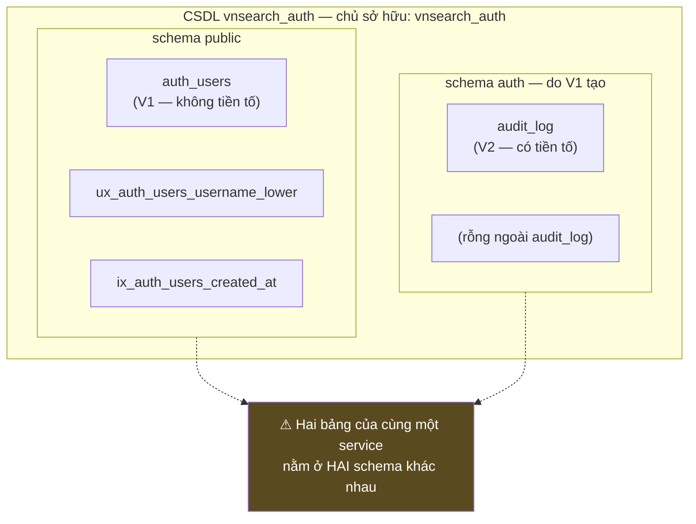

<details><summary>Xem bản chữ (ASCII)</summary>

```
CSDL  vnsearch_auth        (chủ sở hữu: vai trò vnsearch_auth)
│
├── schema  public
│     ├── auth_users                       ← V1, KHÔNG tiền tố  ⚠
│     ├── ux_auth_users_username_lower
│     └── ix_auth_users_created_at
│
└── schema  auth                            ← V1 có CREATE SCHEMA
      ├── audit_log                        ← V2, CÓ tiền tố     ✔
      ├── ix_audit_log_subject
      └── ix_audit_log_occurred_at

⚠ Hai bảng của CÙNG một service nằm ở HAI schema khác nhau.
  Schema `auth` được tạo ra rồi gần như không dùng tới cho mục đích
  mà chú thích V1 mô tả.
```

</details>

Mã Java **vẫn chạy đúng**: `PostgresUserStore` viết `FROM auth_users` không
tiền tố, nên nó tìm thấy bảng ở `public` qua `search_path` mặc định. Không có
lỗi runtime nào. Đó chính là lý do lỗi này sống sót được.

### 21.3 Điều gì đúng, điều gì không đúng như chú thích nói

Chú thích mở đầu `V1` viết:

```sql
-- LƯỢC ĐỒ RIÊNG, KHÔNG DÙNG CHUNG VỚI SERVICE KHÁC. Bảng này nằm trong schema
-- `auth` chứ không nằm cạnh `documents` của search-service. Lý do không phải
-- gọn gàng mà là ngăn chặn: một lỗ hổng SQL injection ở bất kỳ service nào
-- khác cũng không được phép đọc tới bảng chứa hash mật khẩu. Tài khoản CSDL
-- của các service khác không có quyền trên schema này.
```

Đối chiếu từng khẳng định:

| Chú thích nói | Thực tế |
|---|---|
| "Bảng này nằm trong schema `auth`" | ✘ **Sai.** Nó nằm ở `public` của CSDL `vnsearch_auth`. |
| "không nằm cạnh `documents` của search-service" | ✔ **Đúng** — nhưng vì `documents` ở **CSDL** `vnsearch` khác hẳn, không phải vì schema. |
| "SQL injection ở service khác không đọc tới được" | ✔ **Đúng** — nhưng nhờ `init-db.sh`, không nhờ schema. |
| "Tài khoản CSDL của các service khác không có quyền trên schema này" | ✔ **Đúng ở mức mạnh hơn:** chúng không có quyền trên cả **CSDL** này. |

🔒 **Kết luận cần nói cho đúng: kết quả bảo mật vẫn đạt, nhưng lý do đạt được
khác với lý do tệp ghi.** Sự cô lập thật đến từ `deploy/postgres/init-db.sh`,
tệp tạo **ba CSDL và ba vai trò riêng biệt**:

```bash
CREATE USER vnsearch_auth WITH PASSWORD '${AUTH_PW}';
CREATE DATABASE vnsearch_auth OWNER vnsearch_auth;
...
REVOKE ALL ON SCHEMA public FROM PUBLIC;
GRANT ALL ON SCHEMA public TO ${db};
```

Ranh giới ở đây là **ranh giới CSDL**, mạnh hơn ranh giới schema: hai CSDL khác
nhau trong PostgreSQL không truy vấn chéo nhau được bằng SQL thường ở bất kỳ
hoàn cảnh nào, còn hai schema trong cùng một CSDL thì chỉ cách nhau một dòng
`GRANT` đặt sai. Vòng lặp `REVOKE ALL ON SCHEMA public FROM PUBLIC` cũng đã
đóng đúng con đường mà một bảng nằm ở `public` có thể bị lợi dụng.

Nói cách khác: hệ thống **an toàn**, nhưng lập luận trong `V1` mô tả một cơ chế
bảo vệ **không tồn tại trên thực tế**. Với một tệp migration mà cả đội sẽ đọc
để hiểu mô hình bảo mật, sai lệch đó là một khoản nợ kỹ thuật thật — người tiếp
theo sẽ tin rằng `auth_users` được schema bảo vệ và có thể nới một quyền nào đó
dựa trên niềm tin sai.

### 21.4 Cách sửa — thêm V3, KHÔNG sửa V1

⚠ **Không được sửa `V1__tai_khoan.sql`.** Chính tệp đó đã ghi luật, và
`application-postgres.properties` đã bật cổng chặn:

```sql
-- QUY TẮC BẤT DI BẤT DỊCH: tệp migration đã chạy ở đâu đó thì KHÔNG BAO GIỜ
-- sửa nữa. Flyway lưu checksum; sửa một tệp cũ làm mọi môi trường đã chạy nó
-- báo lỗi và dừng khởi động. Muốn đổi thì thêm V2, V3.
```

```properties
spring.flyway.validate-on-migrate=true
```

Cách sửa đúng là một tệp mới, `V3__don_schema_auth.sql`:

```sql
-- V3 — dời auth_users về đúng schema mà V1 nói nó nằm ở đó.
--
-- Xem docs/DatabaseManagement.md mục 21: V1 tạo schema `auth` rồi lại tạo
-- bảng KHÔNG có tiền tố, nên bảng nằm ở `public`. Không sửa được V1 vì
-- Flyway kiểm checksum — chữa bằng tệp này.

ALTER TABLE IF EXISTS public.auth_users SET SCHEMA auth;

-- Chỉ mục đi theo bảng, không cần lệnh riêng.

-- Để mã Java giữ nguyên câu lệnh không tiền tố mà vẫn tìm thấy bảng.
ALTER DATABASE vnsearch_auth SET search_path TO auth, public;
```

Và đặt song song ở phía cấu hình để không phụ thuộc một lệnh `ALTER DATABASE`
đã chạy từ trước:

```properties
spring.datasource.url=${AUTH_DB_URL:jdbc:postgresql://postgres:5432/vnsearch_auth?currentSchema=auth}
spring.flyway.default-schema=auth
```

Ba lưu ý khi thực hiện:

1. `ALTER TABLE ... SET SCHEMA` giữ nguyên dữ liệu, ràng buộc và chỉ mục — nó
   chỉ đổi mục lục, không chép dữ liệu. Nhưng nó lấy khoá ở mức `ACCESS
   EXCLUSIVE`, nên chạy vào lúc bảo trì.
2. Đặt `search_path` là bắt buộc **cùng lúc**, nếu không thì ngay lệnh
   `SELECT ... FROM auth_users` kế tiếp của `PostgresUserStore` sẽ không tìm
   thấy bảng — sửa nửa vời ở đây làm gãy đăng nhập.
3. Nhân tiện, sửa luôn chú thích của `V1` thì **không được** — sửa comment cũng
   đổi checksum. Chỗ để ghi cải chính là `V3` và tài liệu này.

---

# PHẦN V — CSDL `vnsearch` — CORPUS VÀ ĐỒ THỊ WEB

CSDL này là thế giới hoàn toàn khác với `vnsearch_auth`: không Flyway, không
Spring, không JPA. Một tệp `schema.sql` và một lớp JDBC thuần
(`DocumentRepository`). Nguyên tắc nền tảng nằm ngay đầu `schema.sql`:

```sql
-- NGUYÊN TẮC QUAN TRỌNG: PostgreSQL ở đây chỉ đóng vai trò KHO LƯU TRỮ tài
-- liệu thô. Chỉ mục đảo, Trie, LRU cache, PageRank vẫn do đồ án tự cài đặt
-- và nằm trong bộ nhớ — nếu đẩy việc tìm kiếm sang full-text search của
-- PostgreSQL thì toàn bộ phần cấu trúc dữ liệu tự cài, vốn là nội dung
-- chính của đồ án, sẽ trở nên vô nghĩa.
```

Và lý do vẫn cần một CSDL, dù chỉ để làm kho:

```sql
-- Vì sao vẫn cần CSDL: corpus 5.011 tài liệu đã tạo ra file JSON 62MB. Nạp
-- toàn bộ file đó bằng Jackson đòi hỏi giữ đồng thời cả chuỗi JSON lẫn cây
-- đối tượng trong RAM. Ở quy mô hàng chục nghìn trang, cách này không còn
-- khả thi, trong khi CSDL cho phép đọc theo lô và truy vấn có chọn lọc.
```

Hai câu này quyết định mọi thứ còn lại của PHẦN V: CSDL được thiết kế để **ghi
theo lô rồi đọc toàn bộ một lần lúc khởi động**, không phải để phục vụ truy vấn
của người dùng.

---

## 22. `documents` — kho tài liệu thô

Nguồn: `backend/java/libs/core-search/src/main/resources/db/schema.sql`.

| Cột | Kiểu | Ràng buộc | Vì sao |
|---|---|---|---|
| `doc_id` | `INTEGER` | `PRIMARY KEY` | **Do ứng dụng cấp**, không phải `SERIAL`/`IDENTITY`. `docId` sinh ở tầng crawler và giữ nguyên xuyên suốt tới lúc nạp — nhờ vậy `ON CONFLICT (doc_id)` mới có nghĩa. |
| `url` | `TEXT` | `NOT NULL UNIQUE` | Khoá **nghiệp vụ** thật: không được có hai bản ghi cho cùng một trang. Xem mục 25 về việc hai khoá này đánh nhau. |
| `title` | `TEXT` | *(NULL được)* | Trang thật hoàn toàn có thể không có `<title>`. |
| `meta_description` | `TEXT` | *(NULL được)* | Như trên. |
| `body_text` | `TEXT` | *(NULL được)* | Văn bản đã bóc thẻ. `TEXT` chứ không `VARCHAR(n)`: không có giới hạn tự nhiên nào cho độ dài một trang web, và trong PostgreSQL hai kiểu này lưu trữ như nhau. |
| `crawled_at` | `TIMESTAMPTZ` | *(NULL được)* | Thời điểm crawl, có múi giờ. |
| `tsv` | `tsvector` | `GENERATED ALWAYS AS (...) STORED` | Thêm bởi `ALTER TABLE` ở cuối tệp. Chỉ phục vụ thí nghiệm đối chứng — xem mục 26. |

### 22.1 `doc_id` do ứng dụng cấp — hệ quả

```
   NẾU doc_id LÀ SERIAL / GENERATED ALWAYS AS IDENTITY:
       mỗi lần nạp, CSDL cấp một id MỚI cho cùng một trang
       ⇒ ON CONFLICT (doc_id) không bao giờ khớp
       ⇒ mọi lần nạp đều là INSERT mới ⇒ trùng lặp toàn corpus

   VÌ doc_id DO CRAWLER CẤP VÀ ỔN ĐỊNH:
       cùng một trang ⇒ cùng một doc_id qua các lần nạp
       ⇒ ON CONFLICT (doc_id) DO UPDATE ghi đè đúng hàng cũ   ↺
```

Nói cách khác, `doc_id` ở đây không phải khoá thay thế do CSDL sinh mà là một
**định danh có ý nghĩa ở tầng ứng dụng** — và điều đó lại chính là gốc rễ của
lỗi ở mục 25.

### 22.2 Thiếu `updated_at`

⚠ Bảng có upsert (`ON CONFLICT ... DO UPDATE`) nhưng **không có cột
`updated_at`**. `crawled_at` ghi thời điểm crawl chứ không ghi thời điểm hàng
được ghi vào CSDL. Hệ quả cụ thể: sau một lần nạp lại một phần corpus, không có
cách nào bằng SQL để phân biệt hàng nào vừa được cập nhật và hàng nào là tồn
đọng từ lần nạp trước. Đó đúng là câu hỏi đầu tiên khi điều tra một corpus nghi
là hỏng.

Cách bổ sung rẻ nhất, không cần trigger:

```sql
ALTER TABLE documents
    ADD COLUMN IF NOT EXISTS updated_at TIMESTAMPTZ NOT NULL DEFAULT now();
-- rồi thêm vào mệnh đề DO UPDATE:  updated_at = now()
```

---

## 23. `outlinks` — cạnh của đồ thị web

| Cột | Kiểu | Ràng buộc | Vì sao |
|---|---|---|---|
| `from_doc_id` | `INTEGER` | `NOT NULL`, `REFERENCES documents(doc_id) ON DELETE CASCADE` | Đầu ra của cạnh. `CASCADE` khiến `TRUNCATE documents CASCADE` dọn sạch cả hai bảng bằng **một** câu lệnh. |
| `to_url` | `TEXT` | `NOT NULL` — **cố ý KHÔNG phải khoá ngoại** | Đầu vào của cạnh. Liên kết hoàn toàn có thể trỏ ra **ngoài corpus**; ép khoá ngoại ở đây sẽ làm mọi liên kết ra ngoài bị từ chối và đồ thị web mất đúng phần thú vị nhất của nó. |

Hai chỉ mục:

```sql
CREATE INDEX IF NOT EXISTS idx_outlinks_from ON outlinks (from_doc_id);
CREATE INDEX IF NOT EXISTS idx_outlinks_to   ON outlinks (to_url);
```

`idx_outlinks_from` phục vụ đường đọc chính (`ORDER BY from_doc_id` trong
`findAll()`). `idx_outlinks_to` phục vụ hướng ngược lại — đếm **bậc vào** của
một URL, tức là "có bao nhiêu trang trỏ tới đây", đầu vào trực tiếp của mọi
phân tích kiểu PageRank.

### 23.1 Vì sao tách bảng thay vì nhét mảng vào một cột

`schema.sql` giải thích:

```sql
-- Bảng liên kết tách riêng thay vì nhét mảng vào cột: đây chính là các cạnh
-- của đồ thị web dùng cho PageRank, và tách bảng cho phép truy vấn/thống kê
-- đồ thị bằng SQL (đếm bậc vào, tìm liên kết chéo domain...) mà không phải
-- nạp toàn bộ tài liệu lên.
```

PostgreSQL có `TEXT[]` và có `JSONB`; nhét toàn bộ danh sách liên kết vào một
cột của `documents` là hoàn toàn khả thi và **ít bảng hơn**. Đánh đổi thật nằm
ở đây:

| | `outlinks` tách bảng (đang dùng) | Mảng trong cột `documents.outlinks` |
|---|---|---|
| Đếm bậc vào của một URL | `SELECT count(*) FROM outlinks WHERE to_url = ?` — đi qua `idx_outlinks_to` | Phải quét toàn bảng và bung mảng từng hàng |
| Tìm liên kết chéo domain | `JOIN` + so sánh domain bằng SQL | Gần như bắt buộc phải nạp hết lên RAM |
| Nạp corpus lên RAM | Hai truy vấn, ghép bằng `LinkedHashMap` | Một truy vấn |
| Số hàng | Rất lớn (một hàng mỗi cạnh) | Bằng số tài liệu |

★ Quyết định ở đây là chọn theo **câu hỏi sẽ phải trả lời**, không theo số bảng.
Vì đồ thị web là đối tượng nghiên cứu của đồ án (PageRank), nên nó phải là dữ
liệu **truy vấn được**, không phải một khối chuỗi bị chôn trong một cột.

---

## 24. ★★★ `outlinks` không có khoá chính — nạp hai lần là nhân đôi cạnh

Đây là mục quan trọng nhất của PHẦN V, vì lỗi này không dừng ở tầng lưu trữ mà
đi thẳng vào **phần lõi học thuật** của đồ án.

### 24.1 Ba sự thật ghép lại thành lỗi

```sql
-- ① outlinks không có PRIMARY KEY, không có UNIQUE
CREATE TABLE IF NOT EXISTS outlinks (
    from_doc_id INTEGER NOT NULL REFERENCES documents(doc_id) ON DELETE CASCADE,
    to_url      TEXT NOT NULL
);
```

```java
// ② insertOutlinks() là INSERT TRẦN — không có ON CONFLICT
String sql = "INSERT INTO outlinks (from_doc_id, to_url) VALUES (?, ?)";
```

```java
// ③ insertDocuments() thì LẠI CÓ upsert — tức là CÓ Ý ĐỊNH nạp tăng dần
INSERT INTO documents (doc_id, url, title, meta_description, body_text, crawled_at)
VALUES (?, ?, ?, ?, ?, ?)
ON CONFLICT (doc_id) DO UPDATE SET ...
```

Điểm ③ là mấu chốt. Nếu cả hai bảng đều `INSERT` trần thì thiết kế nói rõ "chỉ
nạp vào bảng trống, luôn `deleteAll()` trước". Nhưng `documents` **có** upsert,
tức là tác giả có ý định cho phép nạp lại/nạp tăng dần. Hai bảng được ghi trong
**cùng một** `saveAll()`, **cùng một** giao dịch, mà có **hai** ngữ nghĩa lặp
khác nhau.

### 24.2 Điều gì xảy ra khi chạy `saveAll()` hai lần

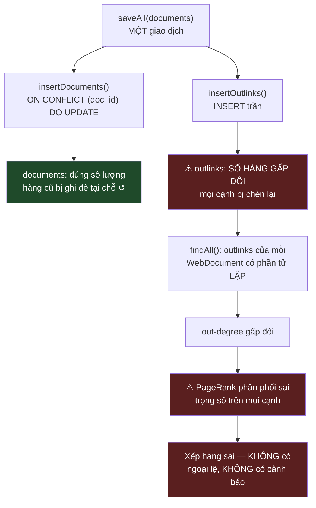

<details><summary>Xem bản chữ (ASCII)</summary>

```
                 saveAll(documents)   —  MỘT giao dịch
                          │
          ┌───────────────┴────────────────┐
          ▼                                ▼
  insertDocuments()                 insertOutlinks()
  ON CONFLICT (doc_id)              INSERT trần
      DO UPDATE                     (không ON CONFLICT)
          │                                │
          ▼                                ▼
  documents: ĐÚNG số lượng      ⚠ outlinks: SỐ HÀNG GẤP ĐÔI
  (ghi đè tại chỗ)  ↺              (mọi cạnh chèn lại)
                                           │
                                           ▼
                        findAll(): danh sách outlinks có phần tử LẶP
                                           │
                                           ▼
                              out-degree của MỌI node gấp đôi
                                           │
                                           ▼
                    ⚠ PageRank phân phối sai trọng số trên mọi cạnh
                                           │
                                           ▼
             Xếp hạng SAI — không ngoại lệ, không cảnh báo, không log
```

</details>

⚠ Điều khiến lỗi này nguy hiểm là nó **không hỏng ồn ào**. `saveAll()` chạy
xong sạch sẽ, `countDocuments()` trả về đúng con số, hệ thống khởi động bình
thường, tìm kiếm vẫn trả kết quả. Chỉ có **thứ tự xếp hạng** là sai — đúng thứ
mà không ai kiểm được bằng mắt, và cũng đúng thứ mà cả đồ án đang đo đạc.

Cần nói rõ mức độ: PageRank chia trọng số của một trang cho **bậc ra** của nó.
Nếu mọi bậc ra đều gấp đôi trong khi số cạnh cũng gấp đôi, kết quả không đơn
giản là "co giãn đều rồi chuẩn hoá bù lại" — vì các trang có tỉ lệ liên kết lặp
khác nhau trong HTML thật, nên sai lệch **không đồng đều giữa các node**.

`STORAGE-PIPELINE.md` mục 41 đã ghi nhận cái bẫy này và kết luận rằng nó không
chữa được bằng `ON CONFLICT`, vì *"một trang hoàn toàn có thể trỏ tới cùng một
URL hai lần một cách hợp lệ trong HTML thật"*, nên phải giữ kỷ luật gọi
`deleteAll()` trước mỗi `saveAll()`.

Lập luận đó đúng về mặt mô hình dữ liệu, nhưng **giải pháp "giữ kỷ luật" là
giải pháp yếu nhất có thể chọn**: nó đặt tính đúng đắn của kết quả học thuật
lên trí nhớ của người chạy lệnh. Và nó cũng không nhất quán với việc
`documents` đã có upsert.

### 24.3 Cách sửa

Phải quyết dứt điểm câu hỏi mô hình trước: **hai cạnh trùng từ cùng một trang
tới cùng một URL có mang thông tin gì không?** Với PageRank thì **không** —
thuật toán làm việc trên đồ thị đơn, một cạnh trùng chỉ làm lệch bậc ra. Nếu
sau này cần đếm số lần xuất hiện thì đó là một cột `weight`, không phải nhiều
hàng giống hệt nhau.

Chốt như vậy thì cách sửa là:

```sql
-- Trong schema.sql
CREATE TABLE IF NOT EXISTS outlinks (
    from_doc_id INTEGER NOT NULL REFERENCES documents(doc_id) ON DELETE CASCADE,
    to_url      TEXT NOT NULL,
    CONSTRAINT pk_outlinks PRIMARY KEY (from_doc_id, to_url)
);
```

```java
// Trong DocumentRepository.insertOutlinks()
String sql = """
        INSERT INTO outlinks (from_doc_id, to_url) VALUES (?, ?)
        ON CONFLICT DO NOTHING
        """;
```

↺ Sau thay đổi này, `saveAll()` **thật sự idempotent trên cả hai bảng**, và
tính đúng đắn của PageRank không còn phụ thuộc vào việc ai đó nhớ gọi
`deleteAll()`.

⚠ **Một cảnh báo kỹ thuật khi áp dụng:** `to_url` là `TEXT` không giới hạn độ
dài, mà chỉ mục btree của PostgreSQL có **giới hạn kích thước khoá** (một mục
không được vượt quá khoảng 1/3 kích thước trang). Một URL dài bất thường sẽ làm
`INSERT` đổ với lỗi *"index row size ... exceeds btree version 4 maximum"*. Hai
cách xử lý, chọn một:

```sql
-- Cách A — khoá chính trên hash, kèm chỉ mục để tra cứu như cũ
ALTER TABLE outlinks
    ADD COLUMN to_url_hash BYTEA GENERATED ALWAYS AS (sha256(to_url::bytea)) STORED;
ALTER TABLE outlinks
    ADD CONSTRAINT pk_outlinks PRIMARY KEY (from_doc_id, to_url_hash);

-- Cách B — chuẩn hoá và cắt URL ở tầng crawler trước khi ghi,
--          rồi mới đặt PK trực tiếp trên (from_doc_id, to_url).
```

Cách A an toàn hơn với dữ liệu web thật; cách B rẻ hơn và đọc dễ hơn, nhưng
phải chắc rằng khâu chuẩn hoá URL thật sự chặn được mọi URL quá dài.

---

## 25. ⚠ Hai khoá đánh nhau: `PRIMARY KEY (doc_id)` và `UNIQUE (url)`

`documents` mang **hai** ràng buộc duy nhất độc lập:

```sql
doc_id  INTEGER PRIMARY KEY,
url     TEXT NOT NULL UNIQUE,
```

Còn upsert chỉ khớp theo **một** trong hai:

```sql
ON CONFLICT (doc_id) DO UPDATE SET
    url = EXCLUDED.url,     -- ⚠ câu lệnh này GHI vào cột có UNIQUE
    ...
```

### 25.1 Kịch bản làm cả batch rollback

```
   Trạng thái CSDL sau lần crawl thứ nhất:
        doc_id = 17,  url = 'https://vnexpress.net/abc'
        doc_id = 42,  url = 'https://vnexpress.net/xyz'

   Lần crawl thứ hai, crawler cấp doc_id theo thứ tự khám phá MỚI:
        doc_id = 42,  url = 'https://vnexpress.net/abc'   ← URL đã thuộc doc_id 17

   ON CONFLICT (doc_id)  →  khớp hàng doc_id = 42, chạy nhánh DO UPDATE
   DO UPDATE SET url = 'https://vnexpress.net/abc'
        ⇒ vi phạm UNIQUE(url), vì chuỗi đó đang thuộc hàng doc_id = 17
        ⇒ SQLException

   saveAll() bắt SQLException  →  connection.rollback()
        ⇒ ⚠ TOÀN BỘ lần nạp bị huỷ, không chỉ một hàng
```

Nhánh xử lý trong `saveAll()` đúng như vậy:

```java
try {
    insertDocuments(documents);
    insertOutlinks(documents);
    connection.commit();
} catch (SQLException e) {
    connection.rollback();
    throw e;
}
```

Nguyên tử là **đúng** — chú thích ghi rõ lý do: *"nếu đứt giữa chừng thì không
để lại một corpus dở dang mà chỉ mục dựng trên đó sẽ sai lệch một cách âm
thầm."* Vấn đề không nằm ở giao dịch mà ở chỗ **upsert khớp sai khoá**, khiến
một va chạm hoàn toàn bình thường trở thành sự cố toàn cục.

### 25.2 Khoá nghiệp vụ thật là `url`

Câu hỏi để phân định: *hai hàng nào thì được coi là "cùng một thứ"?*

Với một corpus web, câu trả lời là **cùng URL**. `doc_id` chỉ là một số thứ tự
do crawler cấp trong một lần chạy; nó **không** ổn định giữa các lần crawl nếu
thứ tự khám phá đổi. Vậy nên upsert phải khớp theo `url`:

```sql
INSERT INTO documents (doc_id, url, title, meta_description, body_text, crawled_at)
VALUES (?, ?, ?, ?, ?, ?)
ON CONFLICT (url) DO UPDATE SET
    title            = EXCLUDED.title,
    meta_description = EXCLUDED.meta_description,
    body_text        = EXCLUDED.body_text,
    crawled_at       = EXCLUDED.crawled_at
-- KHÔNG cập nhật doc_id: giữ nguyên định danh nội bộ đã có.
```

Hoặc, dứt khoát hơn — để CSDL cấp `doc_id` và không ai ngoài nó cấp:

```sql
doc_id INTEGER GENERATED ALWAYS AS IDENTITY PRIMARY KEY,
```

★ **Nhưng phải nói rõ chi phí của phương án IDENTITY:** `doc_id` khi đó do CSDL
sinh, nên nó **không còn** là số mà crawler biết trước. Mọi chỗ dựa vào việc
`docId` ổn định từ lúc crawl tới lúc nạp phải xem lại — trong đó có bất biến
"posting list sắp theo `docId` tăng dần" mà `InvertedIndex` phụ thuộc (xem
`STORAGE-PIPELINE.md` mục 43). Với hiện trạng đồ án, sửa upsert thành
`ON CONFLICT (url)` là thay đổi nhỏ, đúng khoá nghiệp vụ, và không đụng vào
bất biến nào ở tầng trên — nên đó là lựa chọn nên làm trước.

### 25.3 Quan hệ với mục 24

Hai lỗi này **cùng gốc**: cả hai đều là "câu lệnh ghi không nhất quán với ràng
buộc mà bảng thật sự mang".

| | Bảng mang ràng buộc | Câu ghi khớp theo | Hậu quả |
|---|---|---|---|
| Mục 24 | `outlinks`: **không có** ràng buộc nào | không khớp gì cả | Nhân đôi cạnh trong im lặng |
| Mục 25 | `documents`: **hai** ràng buộc | chỉ khớp một (`doc_id`) | Rollback cả batch |

Sửa cả hai cùng lúc là hợp lý, vì cùng nằm trong `schema.sql` và
`DocumentRepository`.

---

## 26. ★ Cột `tsv` GENERATED + chỉ mục GIN — hạ tầng cho thí nghiệm đối chứng

```sql
ALTER TABLE documents
    ADD COLUMN IF NOT EXISTS tsv tsvector
    GENERATED ALWAYS AS (
        to_tsvector('simple',
            coalesce(title, '') || ' ' ||
            coalesce(meta_description, '') || ' ' ||
            coalesce(body_text, ''))
    ) STORED;

CREATE INDEX IF NOT EXISTS idx_documents_tsv ON documents USING GIN (tsv);
```

Ba điểm, theo thứ tự quan trọng tăng dần.

### 26.1 `'simple'` chứ không `'english'`

```sql
-- Lưu ý: dùng cấu hình 'simple' chứ không phải 'english', vì bộ stemmer
-- tiếng Anh sẽ cắt gốc từ sai hoàn toàn trên tiếng Việt.
```

`english` sẽ áp bộ stemmer Snowball tiếng Anh lên tiếng Việt và cắt đuôi từ
theo luật hoàn toàn không liên quan. `simple` chỉ tách theo khoảng trắng và hạ
chữ thường — kém hơn về mặt ngôn ngữ, nhưng **không sai**.

★ Đây là một lựa chọn về **liêm chính của phép đo**, không phải về hiệu năng:
dùng `english` sẽ tạo ra một baseline **bị làm cho yếu đi một cách không công
bằng**, và mọi so sánh sau đó sẽ vô giá trị. `GinBaselineRunner` nêu đúng ý
này trong phần giảng giải mà nó sinh ra tự động.

### 26.2 `GENERATED ALWAYS AS ... STORED` — không thể quên cập nhật

Đây là điểm kỹ thuật đáng học nhất của mục này. Ba cách giữ một cột dẫn xuất
đồng bộ với nguồn của nó:

| Cách | Ai chịu trách nhiệm | Hỏng khi nào |
|---|---|---|
| Cột thường + mã ứng dụng tự tính | Mọi đường ghi trong mã | Một `UPDATE` chạy tay, một job nhập dữ liệu, một mã cũ ⇒ `tsv` lệch nội dung **âm thầm** |
| Cột thường + trigger `BEFORE UPDATE` | CSDL | Đúng, nhưng phải viết và bảo trì trigger; ai đó `ALTER TABLE ... DISABLE TRIGGER` là hỏng |
| **`GENERATED ALWAYS AS ... STORED`** | CSDL, ở mức định nghĩa cột | Không hỏng được — PostgreSQL **từ chối** mọi lệnh ghi trực tiếp vào cột này |

Chính xác hơn: với `GENERATED ALWAYS`, một câu `UPDATE documents SET tsv = ...`
bị CSDL **từ chối thẳng**, và mọi thay đổi ở `title`/`meta_description`/
`body_text` tự động tính lại `tsv` ngay trong cùng câu lệnh đó.

Đây đúng là mẫu ở mục 19 lặp lại ở một bài toán khác: **đặt bất biến vào CSDL
thì mọi đường ghi đều phải tuân theo, kể cả những đường chưa tồn tại lúc viết
mã.** Ba `coalesce(..., '')` là phần bắt buộc đi kèm: nếu thiếu, một cột `NULL`
sẽ làm cả biểu thức nối chuỗi thành `NULL` và `tsv` của tài liệu đó rỗng — tài
liệu biến mất khỏi baseline mà không ai biết.

### 26.3 ★ Đây là ĐỐI CHỨNG NGOÀI, không phải đường phục vụ người dùng

```sql
-- tsvector + chỉ mục GIN của PostgreSQL bản chất cũng là một chỉ mục đảo,
-- nhưng do một hệ quản trị CSDL trưởng thành cài đặt. Giữ nó song song với
-- chỉ mục đảo tự cài cho phép so sánh sòng phẳng trên CÙNG một corpus về
-- tốc độ truy vấn và kích thước chỉ mục — đây là baseline mà một đồ án
-- nghiêm túc cần có, thay vì chỉ tự khẳng định cài đặt của mình là tốt.
```

Đường duy nhất dùng tới cột này là `DocumentRepository.searchWithGin()`, và
Javadoc của nó viết thẳng ranh giới:

```java
/**
 * Tìm kiếm bằng full-text search sẵn có của PostgreSQL (chỉ mục GIN).
 * Đây là ĐỐI CHỨNG để so với chỉ mục đảo tự cài, không phải đường đi
 * phục vụ người dùng.
 */
```

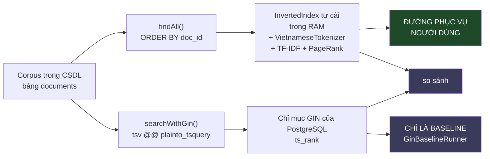

<details><summary>Xem bản chữ (ASCII)</summary>

```
                    Corpus trong CSDL  (bảng documents)
                                 │
             ┌───────────────────┴────────────────────┐
             ▼                                        ▼
      findAll()                                searchWithGin()
      ORDER BY doc_id                          tsv @@ plainto_tsquery('simple', ?)
             │                                        │
             ▼                                        ▼
   InvertedIndex TỰ CÀI (trong RAM)          Chỉ mục GIN của PostgreSQL
   + VietnameseTokenizer (Longest Matching)  + ts_rank
   + TF-IDF + PageRank + title bonus
             │                                        │
             ▼                                        ▼
   ══ ĐƯỜNG PHỤC VỤ NGƯỜI DÙNG ══           ══ CHỈ LÀ BASELINE ══
             │                                        │
             └───────────► so sánh ◄──────────────────┘
                     GinBaselineRunner
              cùng corpus, cùng bộ truy vấn known-item
```

</details>

⚠ **Vì sao ranh giới này phải được giữ nghiêm.** GIN nhanh, có sẵn, bền vững
sau sự cố, cập nhật tăng dần và đa người dùng — mọi thứ mà chỉ mục trong RAM
không có. Cám dỗ đẩy tìm kiếm sang nó là rất lớn. Nhưng `schema.sql` đã nói ở
dòng đầu tiên: làm vậy thì *"toàn bộ phần cấu trúc dữ liệu tự cài, vốn là nội
dung chính của đồ án, sẽ trở nên vô nghĩa."* Cột `tsv` tồn tại **để bị so
sánh**, không phải để thay thế.

### 26.4 Giá trị học thuật của một baseline ngoài

Đây là điểm đáng đưa vào báo cáo nhất của toàn PHẦN V.

Một phát biểu kiểu *"chỉ mục tự cài chạy nhanh"* là **tự khẳng định** — nhanh
so với cái gì? Không có mốc so sánh thì mọi con số thời gian đều vô nghĩa như
nhau. `GinBaselineRunner` nêu ba lý do PostgreSQL là mốc so sánh **sòng phẳng
và khiêm tốn**:

- Chỉ mục **GIN bản chất cũng là một chỉ mục đảo** — cùng ý tưởng cốt lõi với
  thứ đồ án tự cài, nên đây là so **cùng loại**, không phải so hai thứ khác
  nhau.
- Nó đã được tối ưu **hàng chục năm** bởi một cộng đồng lớn.
- Nó **bất lợi** trong phép đo này (phải qua tầng mạng, phân tích SQL, đọc
  trang từ đĩa) — nên nếu phía tự cài thắng về tốc độ thì **phải nói rõ phần
  lợi thế đó** khi diễn giải.

Và điều kiện làm phép so sánh có giá trị chính là hạ tầng ở mục này: **cùng một
corpus, trong cùng một bảng, cùng một bộ truy vấn**. Nếu baseline chạy trên một
tập dữ liệu khác thì mọi chênh lệch đo được có thể chỉ là chênh lệch dữ liệu.
Cột `tsv` nằm ngay trên `documents`, sinh tự động từ đúng ba trường nội dung mà
`InvertedIndex` cũng đọc — đó là lý do phép so sánh này đứng vững.

★ Nguyên tắc mà `GinBaselineRunner` ghi lại, đáng chép vào báo cáo:

> **Báo cáo cả phần mình thua mới là báo cáo đáng tin.**

Việc chủ động dựng một đối thủ mạnh cho chính cài đặt của mình, trên sân của
chính mình, rồi công bố kết quả dù thắng hay thua — đó là khác biệt giữa một
đồ án đo đạc và một đồ án quảng cáo.

---

# PHẦN VI — CSDL `vnsearch_downloads`

CSDL này chỉ có đúng một bảng nghiệp vụ: `downloads`. Nó ghi lại **tiến độ tải tệp** của từng người dùng để danh sách tải xuống đồng bộ được giữa nhiều thiết bị. Toàn bộ lược đồ nằm trong `backend/go/services/downloads/migrations/0001_downloads.up.sql`, và tệp `.down.sql` chỉ có một dòng `DROP TABLE IF EXISTS downloads;`.

Điểm đáng đọc của phần này không nằm ở danh sách cột — nó tầm thường — mà nằm ở **bốn ràng buộc `CHECK`**, trong đó có một cái mã hoá cả một máy trạng thái bằng đúng một phép so sánh boolean, và ở **một partial index** đánh đổi phạm vi lấy kích thước.

---

## 27. `downloads` — đọc từng cột

| Cột | Kiểu | Ràng buộc | Vì sao |
|---|---|---|---|
| `id` | `UUID` | `NOT NULL`, `pk_downloads` | Khoá chính do **client sinh**, không phải server. `service.Start()` nhận `id uuid.UUID` từ tầng trên và dùng `Find(id, username)` để trả về bản ghi cũ nếu đã tồn tại — tức là ↺ `Start` idempotent: gọi lại cùng `id` không tạo bản ghi thứ hai. UUID cho phép làm được điều đó mà không cần hỏi server trước để xin số. |
| `username` | `VARCHAR(32)` | `NOT NULL` | Chủ sở hữu bản ghi. 🔒 Đây là cột phân vùng dữ liệu — mọi truy vấn trong `repo.go` đều lọc theo nó (mục 30). Độ dài 32 khớp với `auth_users.username`, nhưng **không có khoá ngoại** (mục 30). |
| `source_url` | `TEXT` | `NOT NULL` | URL nguồn. `TEXT` chứ không `VARCHAR(n)`: URL thật có thể rất dài (query string, token tạm), một giới hạn tuỳ tiện sẽ làm hỏng bản ghi ở đúng những trường hợp khó tái hiện nhất. |
| `file_name` | `VARCHAR(255)` | `NOT NULL` | Tên tệp hiển thị. 255 là giới hạn tên tệp của phần lớn hệ tệp — chọn số này khiến CSDL không bao giờ chấp nhận một cái tên mà đĩa từ chối. |
| `mime_type` | `VARCHAR(255)` | cho phép `NULL` | Server có thể không trả `Content-Type`. `repo.go` chuyển chuỗi rỗng thành `NULL` bằng `nullStr()` để phân biệt rõ "không biết" với "biết là rỗng". |
| `total_bytes` | `BIGINT` | cho phép `NULL` | **`NULL` có nghĩa**: server không trả `Content-Length`, tức là không biết tệp dài bao nhiêu. `BIGINT` vì `INT` tràn ở 2 GB — một bản ISO đã vượt. |
| `received_bytes` | `BIGINT` | `NOT NULL DEFAULT 0`, `ck_downloads_received` | Số byte đã nhận. Mặc định 0 để `Start` không cần truyền. |
| `state` | `VARCHAR(16)` | `NOT NULL`, `ck_downloads_state` | Trạng thái, cưỡng chế bằng `CHECK` chứ không bằng kiểu `ENUM` của PostgreSQL (mục 28.1). |
| `local_path` | `TEXT` | cho phép `NULL` | Đường dẫn trên máy đã tải. `NULL` khi bản ghi đến từ một thiết bị khác. |
| `device_id` | `VARCHAR(64)` | cho phép `NULL` | Thiết bị đang giữ tệp. `Record.ToPublic()` so cột này với `device_id` của request để đặt cờ `onThisDevice` — nhờ đó giao diện biết nên hiện nút "Mở tệp" hay chỉ hiện "Tải lại". |
| `started_at` | `TIMESTAMPTZ` | `NOT NULL DEFAULT now()` | Mốc bắt đầu, đồng thời là khoá sắp xếp của trang danh sách. |
| `finished_at` | `TIMESTAMPTZ` | cho phép `NULL`, `ck_downloads_finished` | `NULL` ⇔ chưa kết thúc. Đây là nửa còn lại của ràng buộc máy trạng thái ở mục 28.4. |
| `updated_at` | `TIMESTAMPTZ` | `NOT NULL DEFAULT now()` | Luôn được đặt bằng `now()` **trong câu SQL**, không phải bằng đồng hồ của tiến trình Go — xem 27.1. |

### 27.1 `updated_at` do CSDL đặt, `started_at` và `finished_at` do Go đặt

Nhìn `repo.Save()` sẽ thấy một điểm không đối xứng có chủ ý:

```go
VALUES ($1,$2,$3,$4,$5,$6,$7,$8,$9,$10,$11,$12, now())
ON CONFLICT (id) DO UPDATE SET
	...
	updated_at     = now()
```

`started_at` và `finished_at` được truyền vào từ Go (`rec.StartedAt`, `rec.FinishedAt`), còn `updated_at` là `now()` của PostgreSQL. Lý do: `started_at`/`finished_at` là **dữ liệu nghiệp vụ** — chúng phải bằng đúng cái giá trị mà `service.go` đã tính qua `s.clock()`, và `s.clock` là một hàm có thể thay thế trong kiểm thử. Nếu để CSDL đặt, test không cố định được thời gian. Ngược lại `updated_at` là **siêu dữ liệu vận hành**: nó chỉ cần trả lời "hàng này chạm lần cuối lúc nào", và câu trả lời đáng tin nhất là đồng hồ của chính cái máy giữ dữ liệu, không phải đồng hồ của một trong nhiều tiến trình client có thể lệch giờ.

### 27.2 `ON CONFLICT ... WHERE downloads.username = EXCLUDED.username`

Câu `Save` kết thúc bằng một mệnh đề dễ bị đọc lướt:

```sql
ON CONFLICT (id) DO UPDATE SET ...
WHERE downloads.username = EXCLUDED.username
```

🔒 Đây là chốt chặn chiếm quyền: `id` là UUID do client sinh, nên về lý thuyết client A có thể đoán/bắt được `id` của client B rồi `Save` đè lên. Mệnh đề `WHERE` khiến phép `UPDATE` **không xảy ra** khi `username` không khớp — hàng của người khác không bị chạm. Nhược điểm: `Save` trả về `nil` (không lỗi) trong trường hợp đó vì nó bỏ qua `RowsAffected()`, nên người gọi không phân biệt được "ghi thành công" với "bị chặn". Trên thực tế `service.Update()` luôn `Find(id, username)` trước nên đường này không tới được, nhưng nếu sau này có người gọi `Save` trực tiếp thì đây là một lỗi im lặng. Sửa rẻ: cho `Save` trả thêm `bool` giống `Delete`.

---

## 28. ★ Ràng buộc `CHECK` viết bằng máy trạng thái

Bốn ràng buộc, không cái nào thừa:

```sql
CONSTRAINT ck_downloads_state
    CHECK (state IN ('IN_PROGRESS', 'PAUSED', 'COMPLETED', 'CANCELLED', 'INTERRUPTED')),
CONSTRAINT ck_downloads_received CHECK (received_bytes >= 0),
CONSTRAINT ck_downloads_total CHECK (total_bytes IS NULL OR total_bytes >= received_bytes),
CONSTRAINT ck_downloads_finished
    CHECK ((state IN ('COMPLETED', 'CANCELLED', 'INTERRUPTED')) = (finished_at IS NOT NULL))
```

### 28.1 `ck_downloads_state` — enum cưỡng chế ở CSDL

Tập giá trị hợp lệ được liệt kê thẳng trong ràng buộc, và **lặp lại** trong `model.go`:

```go
const (
	InProgress  State = "IN_PROGRESS"
	Paused      State = "PAUSED"
	Completed   State = "COMPLETED"
	Cancelled   State = "CANCELLED"
	Interrupted State = "INTERRUPTED"
)
```

Đây là trùng lặp có chủ ý. Kiểm tra trong Go (`ValidState`) bắt lỗi sớm và trả về thông báo tử tế cho người dùng; kiểm tra trong CSDL bắt lỗi **muộn nhưng không thể vòng qua**. Một chuỗi rác chỉ có thể vào bảng nếu vượt qua cả hai.

Vì sao dùng `CHECK` + `VARCHAR(16)` thay vì `CREATE TYPE ... AS ENUM`? Kiểu `ENUM` của PostgreSQL nhanh hơn chút và gọn hơn, nhưng thêm một giá trị vào `ENUM` là một thao tác DDL riêng (`ALTER TYPE ... ADD VALUE`) mà cho tới bản gần đây còn không chạy được trong giao dịch, và **xoá** một giá trị thì gần như không làm được. Với `CHECK`, thêm trạng thái mới chỉ là một migration `DROP CONSTRAINT` + `ADD CONSTRAINT`. Với một bảng có khả năng còn thêm trạng thái (`QUEUED`, `RETRYING`…), đó là đánh đổi đúng.

### 28.2 `ck_downloads_received` — chặn số âm

`received_bytes >= 0`. Trông thừa cho tới khi nhớ rằng `received_bytes` đến từ **client** qua HTTP. Một client hỏng, hoặc một client cố ý, gửi `-1` sẽ làm `Record.percent()` tính ra một phần trăm âm và làm hỏng thanh tiến độ ở mọi thiết bị khác của cùng người dùng. Ràng buộc ở CSDL biến một lỗi hiển thị lan rộng thành một lỗi ghi cục bộ.

Lưu ý: `service.Update()` còn thêm một lớp nữa — nó chỉ chấp nhận giá trị **lớn hơn** giá trị hiện tại:

```go
bytes := cur.ReceivedBytes
if receivedBytes != nil && *receivedBytes > bytes {
	bytes = *receivedBytes
}
```

Tiến độ chỉ đi lên. Điều này quan trọng khi hai gói cập nhật tới không đúng thứ tự (mạng di động): gói cũ tới sau sẽ không kéo thanh tiến độ lùi lại.

### 28.3 `ck_downloads_total` — nhánh `IS NULL` mới là phần khó

```sql
CHECK (total_bytes IS NULL OR total_bytes >= received_bytes)
```

Vế phải là điều hiển nhiên: đã nhận không thể nhiều hơn tổng. Vế trái mới là chỗ phải suy nghĩ. Nếu viết `CHECK (total_bytes >= received_bytes)` thôi, PostgreSQL sẽ đánh giá biểu thức thành `NULL` khi `total_bytes IS NULL` — và `CHECK` coi `NULL` là **thoả** (không phải vi phạm). Nghĩa là hai cách viết cho ra cùng hành vi. Vậy nhánh `IS NULL` để làm gì?

Để **nói ra ý định**. Người đọc lược đồ sáu tháng sau cần biết `NULL` ở `total_bytes` là hợp lệ và có nghĩa "server không trả `Content-Length`", chứ không phải một chỗ quên `NOT NULL`. Ràng buộc ở đây kiêm luôn vai trò tài liệu. Cùng thông điệp đó xuất hiện lại trong `model.go`:

```go
func (r Record) percent() *int {
	if r.TotalBytes == nil || *r.TotalBytes <= 0 {
		return nil
	}
```

`percent` trả `*int` chứ không `int`, và trả `nil` đúng trong trường hợp `total_bytes IS NULL` — giao diện nhận `"percent": null` và biết phải vẽ thanh tiến độ vô định thay vì thanh 0%.

### 28.4 ★★ `ck_downloads_finished` — máy trạng thái viết bằng một phép so sánh boolean

```sql
CHECK ((state IN ('COMPLETED', 'CANCELLED', 'INTERRUPTED')) = (finished_at IS NOT NULL))
```

Đây là dòng hay nhất trong toàn bộ lược đồ `downloads`. Hai vế đều là **biểu thức boolean**, và dấu `=` giữa chúng là phép **tương đương hai chiều**, không phải phép gán. Đọc ra tiếng Việt:

> "Trạng thái là trạng thái kết thúc" **khi và chỉ khi** "`finished_at` có giá trị".

Một dòng, hai luật:

1. **Chiều thuận** — `state` ∈ {`COMPLETED`, `CANCELLED`, `INTERRUPTED`} ⇒ `finished_at IS NOT NULL`. Không thể có một bản tải "đã hoàn tất" mà không biết hoàn tất lúc nào.
2. **Chiều nghịch** — `state` ∈ {`IN_PROGRESS`, `PAUSED`} ⇒ `finished_at IS NULL`. Không thể có một bản tải đang chạy mà lại mang dấu thời gian kết thúc — đó là dấu vết của một lần đổi trạng thái làm dở, và nếu để lọt thì mọi truy vấn thống kê "tải trong khoảng thời gian X" sẽ đếm sai mà không có triệu chứng nào lộ ra.

Cách viết thông thường sẽ cần hai ràng buộc, hoặc một biểu thức `(A AND B) OR (NOT A AND NOT B)` dài gấp ba. Phép `=` trên boolean gộp cả hai lại mà không mất gì về độ rõ.

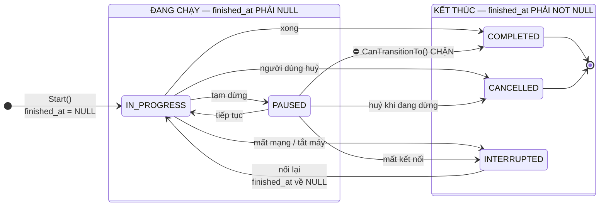

<details><summary>Xem bản chữ (ASCII)</summary>

```
NHÓM "ĐANG CHẠY"  (ck_downloads_finished bắt buộc finished_at IS NULL)
    IN_PROGRESS  <-->  PAUSED

NHÓM "KẾT THÚC"   (ck_downloads_finished bắt buộc finished_at IS NOT NULL)
    COMPLETED    (điểm cuối, CanTransitionTo trả false với mọi đích khác)
    CANCELLED    (điểm cuối, CanTransitionTo trả false với mọi đích khác)
    INTERRUPTED  (KHÔNG phải điểm cuối — chỉ đi tiếp được về IN_PROGRESS)

CHUYỂN HỢP LỆ (model.go: State.CanTransitionTo)
    IN_PROGRESS -> bất kỳ trạng thái nào
    PAUSED      -> bất kỳ, TRỪ COMPLETED
    COMPLETED   -> (không đi đâu)
    CANCELLED   -> (không đi đâu)
    INTERRUPTED -> chỉ IN_PROGRESS
    X           -> X luôn hợp lệ (idempotent)

MỖI LẦN VƯỢT RANH GIỚI HAI NHÓM, service.go PHẢI sửa finished_at:
    vào nhóm KẾT THÚC : đặt finished_at = clock()  (giữ nguyên nếu đã có)
    về nhóm ĐANG CHẠY : finished_at trở lại NULL
```

</details>

### 28.5 Vì sao ràng buộc này KHÔNG thể thay bằng kiểm tra trong Go

`service.go` đã có logic tương ứng, và nó viết đúng:

```go
var finished *time.Time
if next.IsTerminal() {
	if cur.FinishedAt != nil {
		finished = cur.FinishedAt
	} else {
		t := s.clock()
		finished = &t
	}
}
```

`finished` khởi tạo là `nil`, và chỉ được đặt khi `next.IsTerminal()`. Nghĩa là chuyển từ `INTERRUPTED` về `IN_PROGRESS` sẽ **tự động** đưa `finished_at` về `NULL` — đúng chiều nghịch của ràng buộc. Code này đúng.

Nhưng nó chỉ đúng **trên đường đi qua `service.Update()`**. Ràng buộc ở CSDL đúng trên mọi đường:

- Một quản trị viên `UPDATE downloads SET state = 'COMPLETED' WHERE ...` lúc 2 giờ sáng để gỡ một sự cố — CSDL từ chối vì thiếu `finished_at`, thay vì lặng lẽ tạo ra dữ liệu không nhất quán.
- Một script khôi phục `INSERT` lại hàng từ bản sao lưu cũ có lược đồ khác — vi phạm hiện ra ngay lúc `INSERT`, không phải ba tuần sau khi báo cáo ra số lạ.
- Một migration tương lai đổi trạng thái hàng loạt — vi phạm làm migration thất bại và rollback, đúng điều mình muốn.
- Một service thứ hai viết bằng ngôn ngữ khác cắm vào cùng bảng — không cần chép lại logic Go.

Đây là khác biệt cốt lõi giữa hai chỗ đặt luật. **Kiểm tra trong ứng dụng là chính sách; ràng buộc trong CSDL là bất biến.** Chính sách có thể có ngoại lệ và có thể bị đi vòng; bất biến thì không. Với dữ liệu, cái gì thật sự không bao giờ được phép sai thì thuộc về CSDL.

⚠ Có một chi tiết `CHECK` không bắt được: nó chỉ kiểm **một hàng tại một thời điểm**, nên nó không biết gì về việc chuyển trạng thái có hợp lệ hay không. `COMPLETED → IN_PROGRESS` vi phạm `CanTransitionTo()` nhưng **không** vi phạm `ck_downloads_finished` (chỉ cần đặt `finished_at = NULL` là qua). Luật chuyển trạng thái vẫn chỉ sống trong Go. Muốn đưa xuống CSDL thì phải dùng trigger `BEFORE UPDATE` so `OLD.state` với `NEW.state` — đắt hơn nhiều, và đây là chỗ dừng hợp lý: `CHECK` giữ *hình dạng* hàng, Go giữ *lịch sử* của hàng.

---

## 29. ★ Partial index `ix_downloads_dang_chay`

Hai chỉ mục, phục vụ hai truy vấn khác hẳn nhau:

```sql
CREATE INDEX IF NOT EXISTS ix_downloads_user_started
    ON downloads (username, started_at DESC);

CREATE INDEX IF NOT EXISTS ix_downloads_dang_chay
    ON downloads (username)
    WHERE state IN ('IN_PROGRESS', 'PAUSED');
```

### 29.1 `ix_downloads_user_started` — chỉ mục của trang danh sách

Khớp chính xác với `FindByUser`:

```go
SELECT ... FROM downloads WHERE username = $1
ORDER BY started_at DESC LIMIT $2 OFFSET $3
```

Thứ tự cột không tuỳ tiện: `username` đứng trước vì nó là cột lọc bằng `=`, `started_at DESC` đứng sau vì nó là cột sắp xếp. Với thứ tự này, PostgreSQL nhảy tới đoạn của một `username` rồi **đọc xuôi** theo chỉ mục — không cần bước sắp xếp riêng, và `LIMIT` dừng được ngay sau khi lấy đủ. Nếu đảo thành `(started_at DESC, username)` thì mọi truy vấn phải quét toàn bộ chỉ mục để lọc `username`, và `LIMIT` không giúp gì.

`DESC` viết thẳng trong định nghĩa chỉ mục là để khớp `ORDER BY started_at DESC`. PostgreSQL đọc ngược chỉ mục được nên `ASC` vẫn dùng được, nhưng viết đúng chiều thì kế hoạch thực thi sạch hơn và ổn định hơn khi sau này thêm cột sắp xếp thứ hai.

### 29.2 `ix_downloads_dang_chay` — partial index, và vì sao nó đáng giá

Chỉ mục thứ hai chỉ chứa các hàng **thoả mệnh đề `WHERE`**. Nó phục vụ `FindActive`:

```go
SELECT ... FROM downloads WHERE username = $1 AND state IN ('IN_PROGRESS','PAUSED')
ORDER BY started_at DESC
```

Đây là truy vấn được gọi **thường xuyên nhất** trong service — mỗi lần một thiết bị hỏi "có gì đang tải không" để vẽ thanh tiến độ. Nhưng tập hàng nó cần lại là **thiểu số rất nhỏ**: một bản tải chỉ ở trạng thái `IN_PROGRESS`/`PAUSED` trong vài giây tới vài phút, rồi ở lại `COMPLETED` mãi mãi. Sau vài tháng, bảng gần như toàn hàng đã kết thúc.

Ba lợi ích, theo thứ tự quan trọng:

1. **Chỉ mục nhỏ hơn nhiều.** Một chỉ mục đầy đủ trên `(username)` phải chứa mọi hàng đã hoàn tất — những hàng mà truy vấn này không bao giờ cần. Partial index bỏ hết chúng.
2. **Nhỏ nên nằm gọn trong bộ nhớ.** Đây mới là lợi ích thật. Một chỉ mục vừa `shared_buffers` được đọc từ RAM; một chỉ mục lớn hơn RAM phải đọc đĩa ở những lần truy cập rơi ra ngoài. Với truy vấn nóng nhất của service, khác biệt này lớn hơn nhiều so với việc tiết kiệm dung lượng đĩa.
3. **Ghi rẻ hơn.** Khi một hàng chuyển `IN_PROGRESS → COMPLETED`, nó **rời khỏi** chỉ mục — và từ đó về sau, mọi lần `UPDATE` hàng đó (đổi `local_path`, chạm `updated_at`) không phải chạm vào chỉ mục này nữa. Chỉ mục đầy đủ thì phải bảo trì mục cho mọi hàng, mãi mãi.

Chú ý mệnh đề `WHERE` của chỉ mục **trùng nguyên văn** với mệnh đề `WHERE` của truy vấn. Đây là điều kiện bắt buộc để bộ tối ưu dùng được partial index: nó phải chứng minh được rằng điều kiện của truy vấn kéo theo (implies) điều kiện của chỉ mục. Viết `state != 'COMPLETED'` trong truy vấn thì chỉ mục này **không** được dùng, dù về mặt dữ liệu có thể tương đương. Đây là chỗ dễ hỏng khi ai đó sửa truy vấn mà không sửa chỉ mục — và hỏng im lặng, chỉ biểu hiện thành chậm dần.

⚠ Có một điểm tương tự đáng nêu ở `DeleteFinished`:

```go
DELETE FROM downloads
WHERE username = $1 AND state IN ('COMPLETED','CANCELLED','INTERRUPTED')
```

Đây là **phần bù** của partial index, nên không chỉ mục nào phục vụ nó tốt cả. Nó rơi về `ix_downloads_user_started` (lọc theo `username` rồi kiểm `state` trên từng hàng), điều này chấp nhận được vì thao tác này người dùng gọi tay và hiếm.

### 29.3 ⚠ Tên chỉ mục trộn hai ngôn ngữ

Hai chỉ mục nằm cạnh nhau trong cùng một tệp migration:

```
ix_downloads_user_started   ← tiếng Anh
ix_downloads_dang_chay      ← tiếng Việt
```

Không có lý do kỹ thuật nào cho sự khác biệt này; nó chỉ là dấu vết của hai lần viết khác nhau. Hậu quả thật, dù nhỏ: người đọc `EXPLAIN` phải chuyển ngôn ngữ giữa hai dòng liền nhau, và người viết migration tiếp theo không biết phải theo quy ước nào. Nên chọn **một** — hoặc `ix_downloads_active` cho chỉ mục thứ hai, hoặc đổi cả bộ sang tiếng Việt. Đây là thay đổi rẻ (một migration `ALTER INDEX ... RENAME TO ...`, không khoá bảng lâu, không phải dựng lại chỉ mục), và càng để lâu càng nhiều chỗ tham chiếu tới tên cũ.

---

## 30. Vì sao KHÔNG có khoá ngoại tới `auth_users`

`downloads.username VARCHAR(32)` mang đúng cùng ý nghĩa và cùng kiểu với `auth_users.username VARCHAR(32)` (khoá chính của bảng tài khoản). Theo mọi bản năng thiết kế CSDL quan hệ, đây phải là một khoá ngoại. Nó không phải, và lý do là kỹ thuật chứ không phải sơ suất.

### 30.1 Hai bảng nằm ở hai CSDL khác nhau

| Bảng | CSDL | Service | Ngôn ngữ |
|---|---|---|---|
| `auth_users` | `vnsearch_auth` | auth-service | Java (Flyway, `V1__tai_khoan.sql`) |
| `downloads` | `vnsearch_downloads` | downloads-service | Go (migration nhúng) |

**PostgreSQL không hỗ trợ khoá ngoại xuyên CSDL.** Một `REFERENCES` chỉ nhìn được các bảng trong cùng một database; hai database trong cùng một cụm vẫn là hai không gian tên hoàn toàn tách biệt (khác với hai *schema*, vốn ở chung một database và tham chiếu chéo được — chính vì thế `football` ở mục 35 lại là chuyện khác). Không có cách viết nào để có ràng buộc này; muốn có nó thì phải bỏ việc tách CSDL.

### 30.2 Đây là cái giá cố ý của "database per service"

`deploy/postgres/init-db.sh` nói thẳng vì sao mỗi service một CSDL và một tài khoản riêng, và lý do đầu tiên là bảo mật:

> *"Một lỗ hổng SQL injection ở downloads-service sẽ đọc được bảng `auth_users` — nơi chứa hash mật khẩu. Với tài khoản riêng, kết nối đó thậm chí không NHÌN THẤY CSDL kia."*

🔒 Đó là cuộc đổi chác: **cô lập bảo mật đổi lấy toàn vẹn tham chiếu**. Không có cách nào giữ cả hai trong cùng một cụm PostgreSQL. Và với hệ này, chiều đánh đổi là hợp lý — hậu quả của việc mất FK là vài hàng mồ côi, hậu quả của việc mất cô lập là hash mật khẩu của toàn bộ người dùng.

### 30.3 Hệ quả cụ thể: xoá tài khoản không tự xoá bản ghi tải xuống

Với FK `ON DELETE CASCADE`, xoá một hàng `auth_users` sẽ quét sạch các hàng `downloads` của người đó. Không có FK, việc đó phải làm tường minh ở tầng ứng dụng.

Đã kiểm tra trong mã. Kết quả trung thực: **luồng xoá tài khoản hiện chưa tồn tại ở bất kỳ đâu.** Tìm `DELETE FROM auth_users` và các biến thể trên toàn bộ `backend/` không ra kết quả nào — auth-service chưa có endpoint xoá tài khoản. Nghĩa là:

- Chưa có hàng mồ côi nào trong thực tế, vì chưa xoá được tài khoản.
- Nhưng cũng **chưa có chỗ nào giữ chỗ cho việc dọn dẹp**. Ngày ai đó thêm `DELETE /api/v1/users/me`, họ phải nhớ rằng có ít nhất hai CSDL khác đang giữ dữ liệu khoá theo `username`: `vnsearch_downloads.downloads` và `vnsearch_settings.user_settings`. Không có FK nào, không có comment nào, không có test nào nhắc họ điều đó.

Việc này đáng ghi lại **trước** khi tính năng xoá tài khoản được viết, không phải sau. Hai hướng khả dĩ:

1. **Xoá theo dòng sự kiện.** auth-service phát sự kiện `UserDeleted`; downloads-service và settings-service tự dọn phần của mình. Đúng kiểu microservice, nhưng cần hạ tầng thông điệp mà hệ này chưa có.
2. **Xoá tuần tự do auth-service điều phối.** auth-service gọi lần lượt các endpoint xoá nội bộ của từng service rồi mới xoá hàng của mình. Đơn giản hơn nhiều, và **thứ tự này quan trọng**: xoá `auth_users` sau cùng để nếu một bước giữa chừng hỏng thì tài khoản vẫn còn và có thể thử lại — xoá trước thì mất luôn định danh để dọn nốt phần còn lại.

Điểm cộng nhỏ: `settings` đã có sẵn `DeleteAll(ctx, username)` và `downloads` đã có `DeleteFinished(ctx, username)` — hướng (2) chỉ cần thêm một `DeleteAll` cho downloads và một tuyến nội bộ, không phải thiết kế lại gì.

### 30.4 Bù trừ: `username` được canh ở MỌI truy vấn

Cái mất do không có FK là toàn vẹn tham chiếu — không phải kiểm soát truy cập. 🔒 Kiểm soát truy cập được canh ở tầng khác, và canh triệt để: **mọi** truy vấn trong `repo.go` đều mang điều kiện `username`, không có ngoại lệ.

```go
// Find
WHERE id = $1 AND username = $2
// FindByUser
WHERE username = $1
// FindActive
WHERE username = $1 AND state IN ('IN_PROGRESS','PAUSED')
// Delete
DELETE FROM downloads WHERE id = $1 AND username = $2
// DeleteFinished
DELETE FROM downloads WHERE username = $1 AND state IN (...)
// Count
SELECT count(*) FROM downloads WHERE username = $1
// Save (ON CONFLICT)
WHERE downloads.username = EXCLUDED.username
```

Bảy câu, bảy lần lọc. Đáng chú ý là `Find` và `Delete` dùng `WHERE id = $1 AND username = $2` chứ **không** dùng `WHERE id = $1` rồi kiểm quyền sở hữu trong Go sau khi đọc. Khác biệt không nhỏ:

- Mẫu "đọc rồi kiểm" cần một câu `if` ở đúng chỗ, mà quên một câu `if` là chuyện thường; mẫu "lọc trong `WHERE`" thì quên `username` là câu SQL sai rõ ràng và test thấy ngay.
- Mẫu "đọc rồi kiểm" trả 404 hay 403 tuỳ chỗ viết. Mẫu này luôn trả cùng một thứ: không có hàng. Người tấn công không phân biệt được "id không tồn tại" với "id tồn tại nhưng của người khác" — không rò rỉ thông tin qua mã trạng thái.
- `username` lấy từ context của JWT đã xác thực (`auth.Username(r.Context())`), không phải từ tham số request, nên client không tự chọn được.

Đây là biện pháp cho **A01 Broken Access Control** đặt ở tầng dữ liệu: phân vùng theo người dùng không phải là một lớp kiểm tra riêng có thể bị bỏ qua, mà là hình dạng của mọi câu truy vấn.

---

# PHẦN VII — CSDL `vnsearch_settings` — JSONB VÀ KHOÁ LẠC QUAN

CSDL này lưu tuỳ chọn cá nhân của người dùng (giao diện, ngôn ngữ, cỡ chữ…) và đồng bộ chúng giữa nhiều thiết bị. Bài toán thật của nó không phải là lưu trữ — một hàng JSON là xong — mà là **hai thiết bị cùng sửa một lúc**. Mục 32 là câu trả lời, và nó gọn hơn mong đợi.

---

## 31. `user_settings` — một hàng một người dùng

| Cột | Kiểu | Ràng buộc | Vì sao |
|---|---|---|---|
| `username` | `VARCHAR(32)` | `NOT NULL`, `pk_user_settings` | Khoá chính **chính là** `username`. Không có cột `id` thừa: mỗi người dùng có đúng một hàng, nên định danh tự nhiên đã đủ. Hệ quả đẹp: `ON CONFLICT (username)` ở mục 32 dùng được ngay khoá chính, không cần thêm unique index. 🔒 Cũng như `downloads`, không có FK tới `auth_users` vì khác CSDL (mục 30). |
| `settings` | `JSONB` | `NOT NULL DEFAULT '{}'::jsonb`, `ck_user_settings_size`, `ck_user_settings_object` | Toàn bộ tuỳ chọn trong một cột. `JSONB` chứ không `JSON`: `JSONB` lưu dạng nhị phân đã phân tích, nên các toán tử `||` và `-` (mục 33) chạy được và không phải parse lại mỗi lần. Mặc định `'{}'` để hàng mới luôn hợp lệ với `ck_user_settings_object`. |
| `version` | `BIGINT` | `NOT NULL DEFAULT 1` | Bộ đếm của khoá lạc quan. Bắt đầu từ **1**, không phải 0 — nhờ đó `version = 0` ở tầng HTTP mang nghĩa riêng "chưa có hàng nào" (`handler.read` trả `"version": 0` khi `snap == nil`). `BIGINT` vì đây là bộ đếm chỉ tăng, không bao giờ reset. |
| `created_at` | `TIMESTAMPTZ` | `NOT NULL DEFAULT now()` | Đặt một lần lúc `INSERT`; nhánh `DO UPDATE` không chạm vào nó. |
| `updated_at` | `TIMESTAMPTZ` | `NOT NULL DEFAULT now()` | Đặt bằng `now()` của CSDL trong mọi nhánh ghi. Được trả về API dưới dạng RFC3339 để client hiển thị "đồng bộ lần cuối". |

Không có chỉ mục phụ nào, và đó là quyết định đúng: truy vấn duy nhất của bảng này là tra theo `username`, mà `username` đã là khoá chính. Thêm chỉ mục nào nữa cũng chỉ làm chậm ghi.

Cũng đáng nêu điều bảng này **không** có: không có bảng lịch sử, không có cột `previous_settings`. Đổi tuỳ chọn thì giá trị cũ mất hẳn. Với dữ liệu tuỳ chọn thì chấp nhận được — người dùng đặt lại được — nhưng nếu sau này có tuỳ chọn quan trọng (khoá mã hoá, danh sách chặn) thì cần nghĩ lại.

---

## 32. ★ Khoá lạc quan cài bằng `ON CONFLICT ... WHERE`

### 32.1 Bài toán

Người dùng mở VnSearch trên máy để bàn và trên máy tính xách tay. Cả hai đọc tuỳ chọn ở `version = 5`. Máy A đổi giao diện sang tối, máy B đổi cỡ chữ. Cả hai gửi lệnh ghi.

Cách ngây thơ — đọc, sửa trong bộ nhớ, ghi đè — sẽ khiến lệnh ghi tới sau **xoá mất** thay đổi của lệnh tới trước, âm thầm. Người dùng ở máy A thấy giao diện tối quay về sáng mà không hiểu vì sao.

Cách nặng tay — khoá bi quan, `SELECT ... FOR UPDATE` giữ khoá suốt thời gian người dùng nghĩ — không dùng được với HTTP không trạng thái: client có thể đóng trình duyệt giữa chừng và khoá treo lại đó.

### 32.2 Lời giải: một câu SQL

`repo.go` đặt cả việc kiểm tra lẫn việc ghi vào **một câu lệnh duy nhất**:

```sql
INSERT INTO user_settings (username, settings, version)
VALUES ($1, $2::jsonb, 1)
ON CONFLICT (username) DO UPDATE SET
	settings   = user_settings.settings || EXCLUDED.settings,
	version    = user_settings.version + 1,
	updated_at = now()
WHERE $3::bigint IS NULL OR user_settings.version = $3::bigint
```

Đọc từng phần:

- **`INSERT ... VALUES (..., 1)`** — đường cho người dùng chưa có hàng nào. Hàng mới ra đời ở `version = 1`.
- **`ON CONFLICT (username) DO UPDATE`** — đã có hàng thì cập nhật. Xung đột bắt trên khoá chính nên không cần khai báo gì thêm.
- **`version = user_settings.version + 1`** — bộ đếm tăng **trong cùng câu lệnh sửa dữ liệu**. Không có khoảnh khắc nào mà `settings` đã đổi còn `version` thì chưa.
- **`WHERE $3::bigint IS NULL OR user_settings.version = $3::bigint`** — đây là mấu chốt. Mệnh đề `WHERE` này gắn vào `DO UPDATE`, không phải vào `INSERT`. Nó là **điều kiện để phép cập nhật xảy ra**:
  - `$3 IS NULL` ⇒ luôn đúng ⇒ ghi đè vô điều kiện. Đây là trường hợp client **không gửi** header `If-Match` — "tôi không quan tâm phiên bản nào, cứ ghi".
  - `$3 = version hiện tại` ⇒ ghi. Client đọc phiên bản nào thì ghi lên đúng phiên bản đó, không ai chen ngang.
  - `$3 ≠ version hiện tại` ⇒ **không ghi gì cả**. Không lỗi, không exception — chỉ đơn giản là 0 hàng bị ảnh hưởng.

### 32.3 `RowsAffected() == 0` là kênh báo hiệu

Hàm `write()` dùng chung cho cả `Merge` và `Replace` biến "0 hàng" thành một giá trị mà tầng trên hiểu được:

```go
func (r *Repo) write(ctx context.Context, username, newJSON string, expected *int64, sql string) (*Snapshot, error) {
	tag, err := r.pool.Exec(ctx, sql, username, newJSON, expected)
	if err != nil {
		return nil, err
	}
	if tag.RowsAffected() == 0 {
		return nil, nil
	}
	return r.Read(ctx, username)
}
```

`(nil, nil)` — không snapshot, không lỗi — là quy ước cho "bị từ chối vì phiên bản cũ". Handler dịch nó thành HTTP 409 kèm **trạng thái hiện tại** để client gộp lại được mà không phải gọi thêm một vòng:

```go
if snap == nil {
	current, _ := h.repo.Read(r.Context(), username)
	...
	httpx.WriteJSON(w, http.StatusConflict, map[string]any{
		"error":    "conflict",
		"message":  "Thiết bị khác đã sửa tuỳ chọn. Hãy gộp rồi thử lại.",
		"settings": json.RawMessage(curJSON),
		"version":  curVer,
	})
	return
}
```

Vòng khép kín ở tầng HTTP: `writeSnapshot` đặt header `ETag: "5"`, client gửi lại `If-Match: "5"`, `ifMatch()` bóc dấu nháy và parse thành `*int64`. Đây là ngữ nghĩa `ETag`/`If-Match` chuẩn của HTTP, không phải một giao thức tự chế — trình duyệt, proxy và công cụ debug đều hiểu.

⚠ Một chi tiết trong `ifMatch()`: nếu header `If-Match` có mặt nhưng **không parse được** thành số (`If-Match: "abc"`), hàm trả `nil` — tức là rơi vào nhánh "ghi đè vô điều kiện". Một client hỏng gửi ETag rác sẽ vô tình tắt mất khoá lạc quan mà không nhận được lỗi nào. An toàn hơn là trả 400 khi header có mặt nhưng sai định dạng: sự vắng mặt của header là một ý định, còn một header rác là một lỗi.

### 32.4 Vì sao "một câu lệnh" mới là điều quan trọng

Cách viết quen thuộc hơn sẽ là:

```
1. SELECT version FROM user_settings WHERE username = $1
2. (trong Go) nếu version != expected → trả 409
3. UPDATE user_settings SET ... WHERE username = $1
```

Cách này **sai**, và sai theo kiểu khó thấy: giữa bước 1 và bước 3 có một cửa sổ thời gian. Hai tiến trình cùng chạy có thể cùng đọc `version = 5` ở bước 1, cùng thấy khớp ở bước 2, rồi cùng ghi ở bước 3 — mất một thay đổi, đúng cái lỗi mà cơ chế này sinh ra để chặn. Sửa được, nhưng phải bọc cả ba bước trong một giao dịch với mức cô lập đủ cao hoặc thêm `FOR UPDATE`, tức là phức tạp hơn và giữ khoá lâu hơn.

Câu `INSERT ... ON CONFLICT ... WHERE` không có cửa sổ đó. PostgreSQL **khoá hàng khi phát hiện xung đột**, rồi mới đánh giá mệnh đề `WHERE` trên giá trị vừa khoá. Việc so phiên bản và việc ghi nằm trong cùng một thao tác nguyên tử ở tầng lưu trữ — không có khe hở nào để chen vào. Không giao dịch tường minh, không `FOR UPDATE`, không mức cô lập đặc biệt, không vòng lặp thử lại: một lượt gửi tới CSDL.

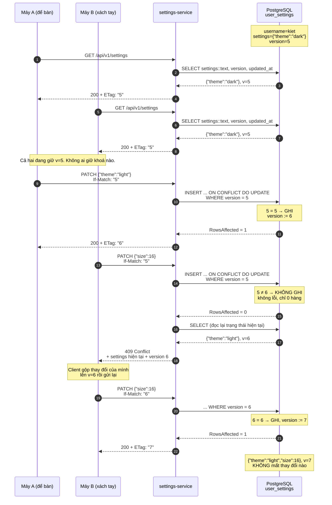

<details><summary>Xem bản chữ (ASCII)</summary>

```
trạng thái đầu: settings={"theme":"dark"}  version=5

A: GET  -> 200, ETag "5"
B: GET  -> 200, ETag "5"          (cả hai cùng giữ v=5, không ai khoá gì)

A: PATCH {"theme":"light"} If-Match "5"
     INSERT..ON CONFLICT DO UPDATE ... WHERE user_settings.version = 5
     5 = 5  -> ghi, version := 6, RowsAffected = 1
   -> 200, ETag "6"

B: PATCH {"size":16} If-Match "5"
     INSERT..ON CONFLICT DO UPDATE ... WHERE user_settings.version = 5
     5 != 6 -> KHÔNG ghi, RowsAffected = 0   (không exception, không lỗi)
     write() thấy 0 hàng -> trả (nil, nil)
     handler đọc lại trạng thái hiện tại và trả kèm
   -> 409 Conflict, body chứa {"theme":"light"} và version 6

B: gộp lại rồi thử lại với If-Match "6"
     6 = 6  -> ghi, version := 7
   -> 200, ETag "7"

trạng thái cuối: {"theme":"light","size":16}  version=7
KHÔNG có thay đổi nào bị mất, và không lúc nào có khoá bị giữ qua HTTP.
```

</details>

### 32.5 Test chứng minh, không phải mô tả

`repo_integration_test.go` (chạy với build tag `integration`, trên PostgreSQL thật qua `itest.PostgresPool`) kiểm đúng ba mệnh đề trên:

```go
// First write creates the row at version 1 -> read back version 1.
s1, err := r.Merge(ctx, "kiet", `{"theme":"dark","size":14}`, nil)
if err != nil || s1 == nil || s1.Version != 1 { ... }

s2, err := r.Merge(ctx, "kiet", `{"size":16,"lang":"vi"}`, ptr(int64(1)))
if s2.Version != 2 { t.Fatalf("version = %d, want 2", s2.Version) }

// Stale If-Match must be rejected (0 rows -> nil snapshot).
stale, err := r.Merge(ctx, "kiet", `{"x":1}`, ptr(int64(1)))
if err != nil { t.Fatal(err) }
if stale != nil { t.Fatal("stale version should have been rejected") }
```

Ba khẳng định, đúng ba điều cần: hàng mới bắt đầu ở version 1; ghi thành công thì version tăng; ghi với version cũ bị **từ chối mà không sinh lỗi** (`err == nil` nhưng `stale == nil`). Mệnh đề thứ ba là mệnh đề khó tin nhất khi chỉ đọc code, và cũng là mệnh đề mà toàn bộ đường 409 phụ thuộc vào — có test cho nó là đúng chỗ.

---

## 33. `Merge` và `Replace` — khác nhau đúng một toán tử `||`

Hai hàm công khai của repo dùng chung hàm `write()`, chung mệnh đề `WHERE` khoá lạc quan, chung cách tăng `version`. Chúng khác nhau ở **một dòng**:

```sql
-- Merge
settings = user_settings.settings || EXCLUDED.settings
-- Replace
settings = EXCLUDED.settings
```

Ánh xạ ra HTTP cũng đúng ngữ nghĩa chuẩn: `Merge` phục vụ `PATCH` (sửa một phần), `Replace` phục vụ `PUT` (thay toàn bộ). `handler.go` nối hai đường vào cùng một hàm `write(w, r, merge bool)` — điểm khác biệt duy nhất là một cờ boolean và một chuỗi `action` cho audit (`SETTINGS_MERGE` / `SETTINGS_REPLACE`).

### 33.1 Toán tử `||` và giới hạn thật của nó: **nông một tầng**

`||` trên hai `jsonb` object là phép hợp nhất: khoá bên phải thắng, khoá chỉ có ở bên trái được giữ. Test chứng minh đúng ba trường hợp:

```go
s2, err := r.Merge(ctx, "kiet", `{"size":16,"lang":"vi"}`, ptr(int64(1)))
for _, want := range []string{`"theme": "dark"`, `"size": 16`, `"lang": "vi"`} {
	if !strings.Contains(s2.JSON, want) { ... }
}
```

`theme` giữ nguyên (chỉ có bên trái), `size` bị ghi đè (có ở cả hai), `lang` được thêm (chỉ có bên phải).

⚠ **`||` chỉ hợp nhất ở tầng ngoài cùng.** Khoá lồng nhau bị **thay thế nguyên cụm**, không hợp nhất đệ quy:

```
hiện có:  {"ui": {"theme": "dark", "font": "serif"}}
PATCH:    {"ui": {"theme": "light"}}
kết quả:  {"ui": {"theme": "light"}}          ← "font" MẤT
mong đợi: {"ui": {"theme": "light", "font": "serif"}}
```

Đây là cạm bẫy thật, không phải giả định: client gửi `PATCH` với ý "chỉ đổi `ui.theme`" sẽ **xoá sạch** mọi khoá anh em bên trong `ui`. Hiện tại chưa nổ vì tuỳ chọn còn phẳng, nhưng cấu trúc tuỳ chọn có xu hướng lồng dần theo thời gian, và khi đó lỗi này biểu hiện thành "tuỳ chọn tự nhiên mất" — rất khó tái hiện và rất khó truy.

Ba hướng xử lý, theo thứ tự chi phí tăng dần:

1. **Ghi vào tài liệu API rằng `PATCH` là nông một tầng.** Rẻ nhất, và với một cấu trúc tuỳ chọn phẳng thì là câu trả lời đủ. Nên làm ngay.
2. **Giữ tuỳ chọn phẳng bằng quy ước**, dùng khoá dạng `"ui.theme"` thay vì lồng object. `||` khi đó luôn đúng.
3. **Hợp nhất sâu.** PostgreSQL không có toán tử sẵn; phải viết một hàm `jsonb_deep_merge` đệ quy bằng PL/pgSQL, hoặc gộp phía Go trước khi ghi (nhưng làm phía Go sẽ đưa lại mẫu read-then-write mà mục 32.4 vừa tránh được — trừ khi bọc trong giao dịch). Chỉ đáng làm khi cấu trúc thực sự đã lồng nhau.

### 33.2 `Replace` và ngữ nghĩa xoá

```go
s3, err := r.Replace(ctx, "kiet", `{"only":"this"}`, ptr(int64(2)))
if strings.Contains(s3.JSON, "theme") || !strings.Contains(s3.JSON, `"only": "this"`) { ... }
```

Test khẳng định `theme` **biến mất**. Đó chính là điểm phân biệt `PUT` với `PATCH`: `PUT` gửi trạng thái đầy đủ, mọi thứ không có trong đó coi như đã bị xoá. Đây cũng là cách duy nhất để xoá nhiều khoá trong một lượt.

### 33.3 `DeleteKey` — toán tử `-`

```sql
UPDATE user_settings
SET settings = settings - $2, version = version + 1, updated_at = now()
WHERE username = $1
```

Toán tử `-` giữa `jsonb` và `text` xoá khoá đó khỏi object. Test kiểm cả nội dung lẫn bộ đếm:

```go
s4, err := r.DeleteKey(ctx, "kiet", "only")
if s4.JSON != "{}" || s4.Version != 4 { ... }
```

`version` đi từ 3 lên 4 — `DeleteKey` **có** tăng bộ đếm, nên nó không phá vỡ chuỗi phiên bản mà các thiết bị khác đang theo dõi.

### 33.4 ⚠ `DeleteKey` và `DeleteAll` KHÔNG kiểm `version`

Đây là điểm không nhất quán rõ ràng nhất trong `repo.go`, và nên viết thẳng:

| Hàm | Có tăng `version`? | Có kiểm `expected`? |
|---|---|---|
| `Merge` | có | **có** |
| `Replace` | có | **có** |
| `DeleteKey` | có | **không** |
| `DeleteAll` | không (xoá hàng) | **không** |

`DeleteKey` không nhận tham số `expected` và mệnh đề `WHERE` của nó chỉ có `username = $1`. Hậu quả cụ thể: máy A `PATCH` một khoá thành công, ngay sau đó máy B (đang giữ phiên bản cũ) gọi `DELETE /{key}` — lệnh xoá **luôn thắng**, không có 409, không có cảnh báo, dù máy B đang thao tác trên một trạng thái đã lỗi thời. Người dùng vừa đổi một tuỳ chọn ở máy A thì thấy nó biến mất, không có gì giải thích.

`DeleteAll` (đường `DELETE /` — khôi phục mặc định) cũng vậy, nhưng ở đây khó tranh cãi hơn: "xoá hết" là một hành động dứt khoát mà người dùng chủ động chọn, kiểm phiên bản cho nó có phần vô nghĩa vì trạng thái cũ là gì cũng không đổi kết quả.

`DeleteKey` thì khác — nó là một phép **sửa một phần**, cùng loại với `Merge`. Nó nên nhận `expected *int64` và mang cùng mệnh đề `WHERE ... AND ($2::bigint IS NULL OR version = $2::bigint)`, rồi trả `(nil, nil)` khi 0 hàng, y hệt `write()`. Sửa nhỏ: thêm một tham số, một mệnh đề, một nhánh — và `handler.deleteKey` đã sẵn sàng vì nó vốn đã đọc `snap == nil` (hiện đang dịch thành 500; đổi thành 409 là một dòng).

Còn một điểm phụ ở `handler.deleteKey`: nó `Read` trước để trả 404 nếu chưa có hàng, rồi mới `DeleteKey`. Hai lượt gửi tới CSDL, và giữa chúng là một cửa sổ đua — nhưng ở đây chỉ dẫn tới một mã trạng thái sai trong tình huống hiếm, không tới mất dữ liệu.

---

## 34. Hai ràng buộc chặn JSONB rác

```sql
CONSTRAINT ck_user_settings_size CHECK (pg_column_size(settings) <= 65536),
CONSTRAINT ck_user_settings_object CHECK (jsonb_typeof(settings) = 'object')
```

### 34.1 `ck_user_settings_size` — chặn nhồi dữ liệu

`JSONB` không có giới hạn kích thước tự nhiên; một cột `jsonb` có thể chứa hàng trăm megabyte (PostgreSQL sẽ TOAST nó ra ngoài trang). Không có ràng buộc này, một client — hỏng hoặc cố ý — ghi được vài megabyte JSON vào **mỗi** tài khoản. Đây là kiểu tấn công lặng lẽ: không có endpoint nào sập, chỉ là CSDL phình ra, bản sao lưu lâu dần, và `SELECT settings::text` bắt đầu tốn băng thông ở mọi lần đồng bộ của mọi thiết bị.

`pg_column_size()` đo **kích thước lưu trữ thật** (đã nén nếu TOAST nén được), không phải độ dài chuỗi JSON gốc. Điều đó khiến ràng buộc bảo vệ đúng thứ cần bảo vệ — dung lượng đĩa — chứ không phải một con số danh nghĩa.

Handler có lớp tương ứng ở tầng HTTP, chặn sớm hơn và trả thông báo tử tế hơn:

```go
const maxJSONBytes = 64 * 1024
body, _ := io.ReadAll(io.LimitReader(r.Body, maxJSONBytes+1))
```

`io.LimitReader` với `+1` là một mẹo nhỏ đáng chú ý: đọc dư đúng một byte để **phân biệt được** "vừa đúng 64 KB" với "vượt quá", mà không phải nạp cả cái body khổng lồ vào bộ nhớ. Nếu `len(body) > maxJSONBytes` thì `validate()` trả `false` và request nhận 400.

⚠ Hai con số này (`65536` trong SQL, `64 * 1024` trong Go) bằng nhau nhưng **không liên kết với nhau** — đổi một chỗ mà quên chỗ kia thì hoặc CSDL từ chối cái mà handler đã cho qua (500 thay vì 400), hoặc ngược lại. Chúng cũng không đo cùng một thứ: Go đo byte của body HTTP thô, SQL đo kích thước lưu trữ sau khi phân tích. Với JSON có nhiều khoảng trắng, body có thể vượt 64 KB trong khi `pg_column_size` thì không. Đây là trùng lặp chấp nhận được (hai lớp phòng thủ ở hai tầng), nhưng nên có comment ở cả hai chỗ trỏ tới nhau.

### 34.2 `ck_user_settings_object` — chặn nhầm hình dạng

`jsonb_typeof(settings) = 'object'` bác bỏ `[1,2,3]`, `42`, `"chuỗi"`, `true`, `null` — tất cả đều là JSON hợp lệ nhưng đều **không phải object**. Vì sao quan trọng: toàn bộ mã còn lại giả định đây là object. `settings || EXCLUDED.settings` trên hai mảng thì **nối mảng** thay vì hợp nhất khoá; `settings - $2` trên một mảng thì xoá theo **giá trị phần tử** thay vì theo khoá. Không cái nào báo lỗi — chúng chỉ làm sai việc, im lặng.

Cũng có hai lớp. Handler kiểm trước:

```go
obj, ok := probe.(map[string]any)
if !ok {
	return "", false
}
```

Và test kiểm rằng lớp CSDL vẫn hoạt động độc lập, gọi thẳng repo để đi vòng qua handler:

```go
// The ck_user_settings_object CHECK constraint must reject a JSON array.
if _, err := r.Merge(context.Background(), "kiet", `[1,2,3]`, nil); err == nil {
	t.Fatal("expected CHECK constraint to reject a JSON array")
}
```

Test này có giá trị đúng vì nó bỏ qua tầng HTTP: nó chứng minh ràng buộc CSDL tự nó đủ, chứ không chỉ chứng minh handler làm đúng việc.

### 34.3 ⚠ Giới hạn: chặn hình dạng thô, không chặn nội dung

Hai ràng buộc này kiểm **vỏ ngoài** — "là object" và "không quá to". Chúng không nói gì về bên trong. Tất cả những thứ sau đều lọt qua:

```json
{"khoa_khong_ai_dung": "x", "theme": 12345, "size": "to lắm", "": null}
```

`theme` đáng lẽ là chuỗi thì nhận số; `size` đáng lẽ là số thì nhận chuỗi; một khoá rỗng; một khoá không thuộc bất kỳ tuỳ chọn nào của ứng dụng. Không tầng nào phát hiện — `validate()` ở handler cũng chỉ kiểm "là object". Hậu quả tích luỹ: bảng dần chứa khoá rác từ các phiên bản client cũ, không ai dám xoá vì không biết còn ai dùng, và một client mới đọc `size` ra chuỗi sẽ hỏng theo cách khó truy về nguồn.

Hai hướng, tuỳ mức độ nghiêm túc muốn đạt:

1. **`CHECK` cho các khoá bắt buộc và kiểu của chúng.** Không cần thêm extension nào:
   ```sql
   ALTER TABLE user_settings ADD CONSTRAINT ck_user_settings_theme
     CHECK (NOT settings ? 'theme'
            OR (jsonb_typeof(settings->'theme') = 'string'
                AND settings->>'theme' IN ('light','dark','system')));
   ```
   Mẫu `NOT settings ? 'khoa' OR (...)` nghĩa là "khoá này có thể vắng, nhưng nếu có thì phải đúng". Rẻ, dễ đọc, thêm dần được. Nhược điểm: mỗi tuỳ chọn mới cần một migration, và danh sách giá trị hợp lệ bị đóng băng trong lược đồ.
2. **Extension `pg_jsonschema`** — khai báo một JSON Schema đầy đủ và kiểm bằng `CHECK (jsonb_matches_schema(...))`. Diễn đạt được nhiều hơn hẳn (khoá bắt buộc, kiểu, khoảng giá trị, cấm khoá lạ qua `additionalProperties: false`), và schema đó **dùng lại được** ở client. Cái giá: thêm một extension phải cài trên mọi môi trường, kể cả CI và máy lập trình viên.

Với quy mô hiện tại, hướng (1) cho vài khoá quan trọng nhất là điểm cân bằng đúng. Nhưng điều nên quyết ngay là **`additionalProperties`**: có cho phép khoá lạ hay không. Cho phép thì client mới thêm tuỳ chọn không cần migration — linh hoạt, và là lý do hợp lý để dùng `JSONB` ngay từ đầu. Không cho phép thì bảng sạch nhưng mất đúng cái linh hoạt đó. Hệ này đang mặc định "cho phép" mà chưa nói ra; nói ra thì lần sau ai đó cân nhắc lại sẽ biết đó là lựa chọn chứ không phải bỏ sót.

---

# PHẦN VIII — SCHEMA `football` — CACHE NẰM TRONG CSDL

Phần này ngắn hơn hai phần trước, nhưng chứa quyết định gây tranh cãi nhất trong toàn bộ tầng dữ liệu: **một cache đặt trong PostgreSQL trong khi Redis đã chạy sẵn ngay cạnh**. Mục 36 mổ xẻ nó theo cả hai chiều.

---

## 35. Ba bảng của schema `football`

Migration mở đầu bằng một dòng mà ba service kia không có:

```sql
CREATE SCHEMA IF NOT EXISTS football;
```

Không phải `CREATE DATABASE` — mà `CREATE SCHEMA`, bên trong CSDL `vnsearch` vốn thuộc về search-service. Đây là ngoại lệ của nguyên tắc "database per service" (mục 36.4).

### 35.1 `football.api_cache`

| Cột | Kiểu | Ràng buộc | Vì sao |
|---|---|---|---|
| `cache_key` | `TEXT` | `PRIMARY KEY` | Khoá cache do `cacheKey(...)` trong `service.go` ghép từ tên endpoint và tham số (`"fixtures:date"`, `date`, `leagueID`, `season`…). `TEXT` vì không đoán được độ dài; là khoá chính nên `Put` dùng được `ON CONFLICT (cache_key)` mà không cần chỉ mục phụ. |
| `payload` | `JSONB` | `NOT NULL` | Phản hồi đã chuẩn hoá của nhà cung cấp. `Put` ép kiểu tường minh `$2::jsonb` — nghĩa là JSON hỏng bị từ chối ngay lúc ghi, không đợi tới lúc đọc mới phát hiện. |
| `fetched_at` | `TIMESTAMPTZ` | `NOT NULL DEFAULT now()` | Lúc gọi nhà cung cấp. Được trả thẳng ra API trong `Payload.CachedAt` để giao diện hiện "số liệu lúc …" — người dùng biết mình đang xem dữ liệu cũ bao nhiêu. |
| `expires_at` | `TIMESTAMPTZ` | cho phép `NULL` | Hạn dùng, do TTL của từng loại dữ liệu quyết định. `NULL` = không hết hạn (`Put` truyền `nil` khi `expiresAt.IsZero()`). |

```sql
CREATE INDEX IF NOT EXISTS api_cache_expires_at_idx ON football.api_cache (expires_at);
```

⚠ Chỉ mục này hiện **không phục vụ truy vấn nào**. `Find` tra theo `cache_key` (khoá chính), và việc kiểm hết hạn làm **trong Go**, không trong SQL:

```go
func (e CacheEntry) Expired(now time.Time) bool {
	return e.ExpiresAt != nil && e.ExpiresAt.Before(now)
}
```

Chỉ mục trên `expires_at` chỉ có ích cho một câu `DELETE ... WHERE expires_at < now()` — câu mà hiện chưa ai viết (mục 36.3). Nó là chỉ mục dựng sẵn cho một công việc chưa tồn tại: hiện tại chỉ tốn chi phí ghi, không mang lại gì.

Điểm thiết kế đáng khen: kiểm hết hạn nằm ở Go **có chủ ý**, vì `resolve()` cần phân biệt ba trạng thái chứ không phải hai:

```go
entry := s.readCache(ctx, key)
if entry != nil && !entry.Expired(now) {
	return Payload[T]{Data: decoded, Source: SourceCache, CachedAt: entry.FetchedAt}
}
if !s.budgetLeft(ctx) {
	if p, ok := stalePayload[T](key, entry); ok {
		return p            // ← Source: SourceStale
	}
	return Payload[T]{Data: fallback, Source: SourceUnavailable, CachedAt: now}
}
```

Hàng **hết hạn vẫn có giá trị**: khi hết hạn mức API hoặc nhà cung cấp lỗi, dữ liệu cũ được trả về kèm nhãn `SourceStale` thay vì trả rỗng. Đây là lý do câu `Find` cố tình **không** lọc `WHERE expires_at > now()` — lọc ở SQL sẽ vứt mất chính cái hàng cần cho đường dự phòng. Cùng logic đó áp dụng khi `live()` trả lỗi: dữ liệu cũ tốt hơn màn hình trống.

### 35.2 `football.api_call_log`

| Cột | Kiểu | Ràng buộc | Vì sao |
|---|---|---|---|
| `id` | `BIGSERIAL` | `PRIMARY KEY` | Chỉ để có khoá chính. Bảng này chỉ được ghi thêm và đếm, không bao giờ tra theo `id`. |
| `endpoint` | `TEXT` | `NOT NULL` | Endpoint đã gọi — dùng để chẩn đoán "cái gì đang ngốn hạn mức". |
| `params` | `TEXT` | `NOT NULL` | Tham số đi kèm. `TEXT` chứ không `JSONB`: đây là dữ liệu để người đọc, không phải để truy vấn. |
| `called_at` | `TIMESTAMPTZ` | `NOT NULL DEFAULT now()` | Mốc thời gian — cột duy nhất được truy vấn. |

```sql
CREATE INDEX IF NOT EXISTS api_call_log_called_at_idx ON football.api_call_log (called_at);
```

Chỉ mục này **có** người dùng, và là truy vấn nóng:

```go
func (s *pgStore) CallsSince(ctx context.Context, since time.Time) (int, error) {
	row := s.pool.QueryRow(ctx,
		`SELECT count(*) FROM football.api_call_log WHERE called_at >= $1`, since)
```

### 35.3 `api_call_log` phục vụ gì: hạn mức `FOOTBALL_DAILY_BUDGET`

Nhà cung cấp API bóng đá giới hạn số lời gọi mỗi ngày. Hạn mức nằm trong biến môi trường, đọc ở `main.go`:

```go
DailyBudget: config.EnvInt("FOOTBALL_DAILY_BUDGET", 95),
```

`docker-compose.yml` đặt `FOOTBALL_DAILY_BUDGET: "95"` — trùng với mặc định. Chuỗi từ bảng tới quyết định:

```go
func (s *Service) startOfDay() time.Time {
	now := s.clock().UTC()
	return time.Date(now.Year(), now.Month(), now.Day(), 0, 0, 0, 0, time.UTC)
}

func (s *Service) Used(ctx context.Context) (int, error) {
	return s.store.CallsSince(ctx, s.startOfDay())
}

func (s *Service) budgetLeft(ctx context.Context) bool {
	used, err := s.Used(ctx)
	if err != nil {
		slog.Warn("không đếm được hạn mức, tạm coi là đã hết", "err", err)
		return false
	}
	return used < s.Budget()
}
```

Ba chi tiết đáng dừng lại:

- **Mốc ngày là UTC**, không phải `Asia/Ho_Chi_Minh` (dù `TZ` của container đặt là múi giờ Việt Nam). Đúng: bộ đếm phải reset cùng lúc với bộ đếm của **nhà cung cấp**, mà nhà cung cấp reset theo UTC. Đếm theo giờ địa phương sẽ lệch 7 tiếng và có thể vượt hạn mức đúng vào lúc tưởng là đã reset.
- **Lỗi đếm được coi là đã hết hạn mức** (`return false`). Đây là fail-safe đúng chiều: không đếm được thì đừng gọi. Chiều ngược lại — coi như còn hạn mức — sẽ biến một sự cố CSDL thành một loạt lời gọi vượt hạn.
- **`Used` và `Budget` được phơi ra ngoài**: handler trả `used`/`budget`/`remaining` cho giao diện, và `main.go` đăng ký gauge Prometheus `football_api_daily_budget`. Hạn mức là số liệu vận hành nhìn thấy được, không phải trạng thái ẩn.

Cổng chặn nằm giữa `resolve()`, **sau** khi thử cache và **trước** khi gọi nhà cung cấp:

```go
if !s.budgetLeft(ctx) {
	if p, ok := stalePayload[T](key, entry); ok {
		return p
	}
	return Payload[T]{Data: fallback, Source: SourceUnavailable, CachedAt: now}
}
data, err := live()
```

Có test riêng cho đúng thứ tự này (`TestBudgetExhaustedNoCacheReturnsUnavailable`), khẳng định nhà cung cấp được gọi **0 lần** khi hết hạn mức.

**Vì sao dữ liệu này bắt buộc phải bền vững.** Đây là lập luận trung tâm của cả PHẦN VIII. Bộ đếm hạn mức mà mất khi restart thì mỗi lần triển khai, mỗi lần container bị OOM-kill, mỗi lần `docker compose restart` sẽ đưa bộ đếm về 0 — trong khi bộ đếm **thật** ở phía nhà cung cấp vẫn ở nguyên chỗ cũ. Vài lần restart trong một ngày là đủ để gọi vượt hạn mức, và hậu quả không phải là một lỗi tạm thời mà là **khoá tài khoản API** hoặc hoá đơn phát sinh — thứ không tự khỏi sau khi restart lần nữa. `api_call_log` do đó không phải là log tiện tay ghi lại; nó là **trạng thái nghiệp vụ** mà tính bền vững là yêu cầu cứng.

⚠ Bảng này chỉ ghi thêm và **không có gì dọn nó**. Với hạn mức 95 lời gọi mỗi ngày, tốc độ phình rất chậm (dưới 35 nghìn hàng mỗi năm) nên đây không phải vấn đề cấp bách, nhưng cũng nên có một câu dọn định kỳ — `DELETE FROM football.api_call_log WHERE called_at < now() - interval '90 days'` — vì truy vấn đếm chỉ cần dữ liệu trong ngày, giữ quá 90 ngày không phục vụ mục đích nào ngoài chẩn đoán.

### 35.4 `football.settings`

| Cột | Kiểu | Ràng buộc | Vì sao |
|---|---|---|---|
| `name` | `TEXT` | `PRIMARY KEY` | Tên tham số. Bảng khoá–giá trị chung. |
| `value` | `TEXT` | `NOT NULL` | Giá trị dạng chuỗi. |
| `updated_at` | `TIMESTAMPTZ` | `NOT NULL DEFAULT now()` | Lần sửa cuối. |

Công dụng thực tế trong mã là lưu **khoá API** đã được kiểm chứng còn dùng được. `Service` thử khoá bằng một lời gọi thật trước khi lưu:

```go
if _, err := s.newProvider(key).Leagues("", "Premier League"); err != nil {
	return err
}
if err := s.store.PutSetting(ctx, settingAPIKey, key); err != nil {
	slog.Warn("không lưu được khoá, chỉ dùng cho phiên này", "err", err)
}
s.applyKey(key)
```

Hai điểm hay:

- **Kiểm trước, lưu sau.** Một khoá sai không bao giờ vào được bảng, nên không có tình trạng service khởi động lên với một khoá hỏng đã lưu sẵn.
- **Lưu hỏng không phải lỗi chí mạng.** `PutSetting` thất bại chỉ ghi `slog.Warn` rồi vẫn `applyKey(key)` — khoá dùng được cho phiên hiện tại, chỉ là không sống qua restart. Xuống cấp mềm đúng chỗ: mất tính bền vững không nên kéo theo mất luôn chức năng.

🔒 Cần nêu thẳng: **khoá API được lưu dạng chữ rõ** trong `football.settings.value`. Với một khoá đọc dữ liệu bóng đá công khai thì rủi ro thấp, và `docker-compose.yml` đã ghi rõ *"Thiếu khoá này không mở ra lỗ hổng nào"*. Nhưng bảng này lại nằm trong CSDL `vnsearch` **dùng chung** (mục 36.4), nên bất kỳ ai đọc được CSDL đó — kể cả qua một lỗ hổng ở search-service — đều đọc được khoá. Nếu sau này bảng `settings` chứa thêm bí mật có giá trị hơn, đây là chỗ phải xem lại trước tiên.

---

## 36. ⚠ Vì sao cache lại nằm trong PostgreSQL khi Redis đã chạy sẵn

### 36.1 Nêu vấn đề cho đúng

Cụm VnSearch đã có Redis, khai báo đầy đủ trong `docker-compose.yml`, phục vụ refresh token và denylist. `football.api_cache` là một **cache** đúng nghĩa: có `cache_key`, có `payload`, có `expires_at`, và mọi hàng trong đó đều dựng lại được từ nhà cung cấp. Về sách vở, đây đúng là công việc của Redis: `SET key value EX ttl`, hết hạn thì Redis tự đuổi, không cần chỉ mục, không cần dọn dẹp, không tốn `VACUUM`.

Đặt nó trong PostgreSQL nghĩa là mỗi lần tra cache đi qua kết nối TCP tới CSDL, qua trình lập kế hoạch truy vấn, chạm vào các trang có MVCC — trong khi Redis trả lời bằng một phép tra bảng băm trong RAM. Về mặt cơ chế thuần tuý, đây là chỗ lệch, và nên gọi đúng tên nó như vậy.

### 36.2 Nhưng lập luận bênh không yếu

**(a) Redis ở cụm này KHÔNG lưu bền.** Đây là dữ kiện quyết định, và nó nằm ngay trong `docker-compose.yml`:

```yaml
      # KHÔNG bật lưu bền. Mất dữ liệu Redis nghĩa là mọi người phải đăng nhập
      # lại — phiền, nhưng không mất gì vĩnh viễn. Đổi lại: không tốn đĩa,
      # không có lúc dừng vì fork lúc snapshot.
      - --save
      - ""
      - --appendonly
      - "no"
```

Không RDB, không AOF. Mọi thứ trong Redis **mất sạch** khi container restart. Lập luận đó hoàn toàn hợp lệ cho refresh token (mất thì đăng nhập lại). Nó không hợp lệ cho cache bóng đá: cache trống sau restart nghĩa là **mọi** yêu cầu đầu tiên sau đó đều phải gọi nhà cung cấp — chính lúc hạn mức 95 lượt/ngày đang bị siết. Vài lần triển khai trong một ngày có thể tiêu hết hạn mức chỉ để hâm nóng lại cache.

Còn tệ hơn: `maxmemory-policy allkeys-lru` với `maxmemory 100mb` nghĩa là Redis **đuổi bất kỳ khoá nào** khi đầy, kể cả khoá chưa hết hạn. Cache bóng đá sẽ cạnh tranh chỗ với refresh token, và cả hai cùng thua theo cách không đoán trước được.

**(b) `api_cache` nằm cạnh `api_call_log`, và bảng kia BUỘC phải bền.** Đây là lập luận mạnh nhất. Mục 35.3 đã lập luận vì sao bộ đếm hạn mức không thể nằm trong một kho không bền. Nếu tách cache sang Redis, một quyết định duy nhất — *"còn hạn mức để gọi không, hay dùng dữ liệu cũ?"* — sẽ phải đọc **hai kho khác nhau**:

```go
entry := s.readCache(ctx, key)      // sẽ là Redis
...
if !s.budgetLeft(ctx) {             // vẫn là PostgreSQL
	if p, ok := stalePayload[T](key, entry); ok {
		return p
	}
```

Hai nguồn sự thật cho một quyết định, với hai kiểu hỏng riêng và hai trạng thái sẵn sàng riêng. Cụ thể: Redis mất dữ liệu sau restart trong khi PostgreSQL vẫn nhớ 95 lượt đã dùng ⇒ không còn hàng cũ để trả về, cũng không còn hạn mức để gọi ⇒ `SourceUnavailable` cho mọi yêu cầu tới hết ngày. Đường dự phòng "trả dữ liệu cũ khi hết hạn mức" — đường quan trọng nhất của thiết kế này — sẽ hỏng đúng vào lúc cần nó nhất, và hỏng theo cách chỉ tái hiện được sau một lần restart.

Giữ chung một kho thì hai vế của quyết định luôn nhất quán, và ranh giới hỏng chỉ có một: PostgreSQL còn sống hay không.

**(c) Quy mô không đòi hỏi Redis.** Trần trên là 95 hàng cache mới mỗi ngày (không thể ghi nhiều hơn số lời gọi được phép). Không có gì trong khối lượng đó cần tới một kho khoá–giá trị trong bộ nhớ.

**Kết luận cân bằng.** Gọi đây là "dùng sai công cụ" là đọc thiếu bối cảnh. Đúng hơn là: cấu hình Redis của cụm này (`--save ""`, `allkeys-lru`) khiến nó **không phù hợp** với dữ liệu cần sống qua restart, và `api_cache` — dù mang tên cache — thuộc nhóm đó vì nó gánh vai trò dự phòng khi hết hạn mức. Nếu Redis được cấu hình lưu bền và tách namespace, cân nhắc sẽ khác. Với cấu hình hiện tại, PostgreSQL là lựa chọn phòng thủ được, và lý do thật cần ghi lại là **"vì Redis ở đây không lưu bền"**, không phải "vì tiện". Sự khác biệt giữa hai câu đó chính là thứ quyết định người sau có sửa đúng hay không.

### 36.3 ⚠ Khoảng trống thật: không có ai dọn hàng hết hạn

Đã tìm trên toàn bộ mã nguồn, migration và tệp triển khai. Kết quả: **không có `DELETE` nào trên `football.api_cache` ở bất kỳ đâu.** Store chỉ có `Find` và `Put`; không có cron, không có goroutine dọn dẹp, không có `pg_cron`, không có job ngoài.

Nghĩa là:

- Mỗi `cache_key` mới tạo một hàng và hàng đó **ở lại vĩnh viễn**. `Put` dùng `ON CONFLICT (cache_key) DO UPDATE`, nên khoá lặp lại thì ghi đè — nhưng khoá **không bao giờ lặp lại** thì tích tụ mãi.
- Khoá dạng `cacheKey("fixtures:date", date, leagueID, season)` chứa **ngày cụ thể**. Ngày hôm qua không bao giờ được tra lại, nhưng hàng của nó vẫn nằm đó với một `expires_at` đã qua từ lâu.
- `expires_at` và `api_cache_expires_at_idx` tồn tại nhưng **chưa ai dùng** (mục 35.1) — đúng là bộ công cụ dựng sẵn cho việc dọn dẹp, mà việc dọn dẹp thì chưa được viết.
- Tốc độ phình bị chặn trên bởi hạn mức (tối đa 95 hàng/ngày), nên đây không phải sự cố sắp xảy ra. Nhưng `payload` là JSONB của cả một phản hồi API, nên tính theo dung lượng thì đáng kể hơn nhiều so với `api_call_log`.

Cách sửa, và có một chi tiết phải cẩn thận:

```sql
DELETE FROM football.api_cache
WHERE expires_at IS NOT NULL
  AND expires_at < now() - interval '7 days';
```

Hai điều kiện đều có lý do. `expires_at IS NOT NULL` giữ lại các hàng không hạn dùng (`Put` truyền `NULL` khi `expiresAt.IsZero()`) — xoá chúng là xoá dữ liệu cố ý đánh dấu không hết hạn. Khoảng đệm `- interval '7 days'` giữ vai trò quan trọng hơn: **hàng hết hạn vẫn có ích** cho đường `SourceStale` khi hết hạn mức hoặc nhà cung cấp lỗi. Dọn ngay khi hết hạn (`WHERE expires_at < now()`) sẽ phá đúng đường dự phòng mà mục 35.1 đã dựng lên. Đây là chỗ dễ viết sai nếu chỉ nhìn tên cột mà không đọc `resolve()`.

Chỗ đặt: đơn giản nhất là một goroutine `time.Ticker` trong `main.go` chạy mỗi 24 giờ, dùng lại `pgxpool` sẵn có — không thêm phụ thuộc nào. Cùng lần đó xử lý luôn `api_call_log` (mục 35.3).

### 36.4 Ngoại lệ của "database per service"

Ba service kia (`auth`, `downloads`, `settings`) mỗi cái một CSDL và một tài khoản riêng, theo đúng `deploy/postgres/init-db.sh`. Football thì không, và `docker-compose.yml` nói thẳng:

```yaml
      # Dùng chung CSDL `vnsearch` với search-service nhưng trong một schema
      # riêng tên `football` — service tự chạy migration nhúng lúc khởi động.
      FOOTBALL_DB_HOST: postgres
      FOOTBALL_DB_USER: vnsearch
      FOOTBALL_DB_NAME: vnsearch
```

🔒 Tài khoản kết nối là `vnsearch` — tài khoản của search-service, không phải một vai riêng bị giới hạn quyền vào schema `football`. Hệ quả trực tiếp: **football-service nhìn thấy và đọc được `public.documents`**, toàn bộ corpus của search-service. Ngược lại cũng đúng, search-service đọc được cả schema `football`.

Đối chiếu với lý do số 1 trong `init-db.sh`:

> *"Một lỗ hổng SQL injection ở downloads-service sẽ đọc được bảng `auth_users` … Với tài khoản riêng, kết nối đó thậm chí không NHÌN THẤY CSDL kia."*

Lập luận đó không áp dụng được cho football. Ranh giới ở đây **yếu hơn hẳn** ba service kia: schema là ranh giới **tổ chức** (đặt tên gọn gàng, migration độc lập), không phải ranh giới **bảo mật**, trừ khi có `GRANT`/`REVOKE` đi kèm — mà không có.

Cũng phải nói cho công bằng phần giảm nhẹ: football-service không đọc JWT, mọi endpoint đều công khai (`docker-compose.yml` ghi rõ: *"service này không đọc JWT (mọi endpoint công khai, require-admin-api-key=false)"*), và nó không giữ dữ liệu người dùng nào. Thứ duy nhất đáng giá trong schema của nó là khoá API bóng đá (mục 35.4). Chiều thiệt hại nghiêm trọng hơn là **chiều ngược lại**: một lỗ hổng ở football-service — vốn là bề mặt tấn công công khai, không xác thực — mở đường tới toàn bộ `public.documents`. Đây không phải dữ liệu bí mật (corpus crawl từ web công khai), nhưng nó cũng đủ để, ví dụ, `DROP TABLE documents`.

Sửa được, và rẻ hơn nhiều so với tách hẳn CSDL:

```sql
CREATE ROLE football_svc LOGIN PASSWORD '...';
GRANT CONNECT ON DATABASE vnsearch TO football_svc;
GRANT USAGE, CREATE ON SCHEMA football TO football_svc;
GRANT ALL ON ALL TABLES IN SCHEMA football TO football_svc;
-- và KHÔNG cấp gì trên schema public
REVOKE ALL ON SCHEMA public FROM football_svc;
```

Một vai riêng chỉ có quyền trên schema `football` biến ranh giới tổ chức thành ranh giới bảo mật thật, giữ nguyên cấu trúc hiện tại (vẫn chung CSDL, vẫn chung cụm, migration không đổi), và chỉ cần đổi một biến môi trường `FOOTBALL_DB_USER`. Cần `CREATE ON SCHEMA football` vì service tự chạy migration nhúng lúc khởi động; nếu muốn chặt hơn nữa thì tách quyền migration ra một vai riêng chỉ dùng lúc khởi động. Cho tới khi làm việc đó, đây là điểm yếu nhất trong tầng dữ liệu của hệ, và nó nên được ghi vào danh sách nợ kỹ thuật với đúng tên gọi đó, chứ không nằm im dưới dạng một dòng comment trong `docker-compose.yml`.

---

# PHẦN IX — MONGODB — LỊCH SỬ DUYỆT WEB

Bốn phần trước nói về PostgreSQL: lược đồ chặt, ràng buộc cưỡng chế, migration
đánh số. Phần này là chỗ dự án **cố ý bước ra khỏi** mô hình đó cho đúng một
service — `history-service` — và giá trị của nó nằm ở chỗ giải thích vì sao
bước ra là đúng ở đây mà sai ở mọi chỗ khác.

| Tệp | Vai trò |
|---|---|
| `backend/go/services/history/main.go` | Kết nối Mongo, gọi `EnsureIndexes` lúc khởi động |
| `.../internal/history/model.go` | Hai struct `Visit`, `SearchQuery` |
| `.../internal/history/store.go` | Toàn bộ thao tác Mongo — 213 dòng |
| `.../internal/history/service.go` | `RecordVisit`, `RecordSearch`, `Suggest` |

---

## 37. Ba collection, và vì sao chỗ này KHÔNG dùng quan hệ

`NewStore` mở đúng ba collection và không mở gì thêm:

```go
func NewStore(db *mongo.Database) *Store {
	return &Store{
		db:      db,
		visits:  db.Collection("visits"),
		queries: db.Collection("search_queries"),
		audits:  db.Collection("audit_log"),
	}
}
```

Tên CSDL đến từ URI, mặc định `mongodb://mongo:27017/vnsearch_history`
(`main.go`, hàm `databaseName` cắt phần sau `/` và trước `?`; không phân tích
được thì trả về `"vnsearch_history"` — mặc định an toàn chứ không phải lỗi
khởi động).

| Collection | Tài liệu | Ai ghi | Ai đọc |
|---|---|---|---|
| `visits` | Một lượt ghé một URL của một tài khoản | `RecordVisit` | `VisitHistory`, `CountVisits` |
| `search_queries` | Một truy vấn đã chuẩn hoá | `RecordSearch` | `SearchHistory`, `Suggest` |
| `audit_log` | Dấu vết thao tác xoá lịch sử | `RecordAudit` | *(không có đường đọc trong mã)* |

### 37.1 Lược đồ thật

```go
type Visit struct {
	ID         primitive.ObjectID `bson:"_id,omitempty" json:"id"`
	Username   string             `bson:"username" json:"username"`
	URL        string             `bson:"url" json:"url"`
	Title      string             `bson:"title" json:"title"`
	Host       string             `bson:"host" json:"host"`
	VisitedAt  time.Time          `bson:"visitedAt" json:"visitedAt"`
	VisitCount int                `bson:"visitCount" json:"visitCount"`
	Incognito  bool               `bson:"incognito" json:"incognito"`
}

type SearchQuery struct {
	ID          primitive.ObjectID `bson:"_id,omitempty" json:"id"`
	Username    string             `bson:"username" json:"username"`
	Query       string             `bson:"query" json:"query"`
	Normalized  string             `bson:"normalized" json:"normalized"`
	ResultCount int                `bson:"resultCount" json:"resultCount"`
	SearchedAt  time.Time          `bson:"searchedAt" json:"searchedAt"`
}
```

`Host` được tính **một lần lúc ghi** (`hostOf(cleanURL)`, cắt tiền tố `www.`)
chứ không tính lại lúc đọc — phi chuẩn hoá có chủ ý: nhóm lịch sử theo tên miền
là truy vấn thường gặp, và phân tích URL 50 nghìn lần mỗi lần mở trang là công
vô ích.

### 37.2 ★ Bốn lý do không dùng quan hệ

| # | Lý do | Bằng chứng |
|---|---|---|
| 1 | **Tỉ lệ ghi cực cao** — mỗi lần mở một trang là một lượt ghi. Không bảng nào khác trong dự án chịu tần suất đó | `RecordVisit` gọi trên mọi lượt điều hướng |
| 2 | **Không ràng buộc nào đáng cưỡng chế** — một lượt ghé không tham chiếu tới gì. `username` là chuỗi lấy từ JWT đã xác minh, không phải khoá ngoại; bảng `users` còn nằm ở CSDL của service khác | `store.go` không có ràng buộc nào ngoài `_id` |
| 3 | **Cần tự hết hạn** — PostgreSQL không có cơ chế đó sẵn; Mongo có TTL index (mục 38) | `SetExpireAfterSeconds` |
| 4 | **Lược đồ còn đổi** — thêm `favicon`, `deviceId`, `durationMs` là chuyện có thật của một trình duyệt; ở Mongo đó là thêm một dòng vào struct | `model.go` không đi kèm migration nào |

**Cái mất — ghi ra để không ai tưởng là bữa trưa miễn phí:**

- **Không `CHECK`.** `VisitCount` âm, `VisitedAt` năm 2099 — CSDL nhận hết.
  Việc canh giữ chuyển hết lên tầng Go (`truncate()`, `clamp()`); một đường ghi
  mới quên gọi chúng thì không có lớp phòng thủ thứ hai.
- **Không khoá ngoại.** Xoá tài khoản ở auth-service không kéo theo gì ở đây.
- **Không giao dịch nhiều tài liệu ở đây.** Mongo 7 *có*, nhưng chỉ trên
  replica set; `docker-compose.yml` chạy `mongo:7` một nút và mã không dùng
  session nào. Cụ thể: `DeleteRange` xoá `visits` rồi `search_queries` bằng hai
  lệnh riêng — đứt giữa chừng thì xoá được một nửa.

```go
	vc, err := s.store.DeleteVisitsBetween(ctx, username, start, end)
	if err != nil {
		return 0, err
	}
	qc, err := s.store.DeleteQueriesBetween(ctx, username, start, end)
```

Với lịch sử, "xoá một nửa" chấp nhận được — bấm lại là xong. Với bảng số dư thì
không. Đó chính là ranh giới quyết định chỗ nào Mongo, chỗ nào PostgreSQL.

---

## 38. ★ TTL index — quyền được lãng quên cài bằng hạ tầng

### 38.1 Mã

`EnsureIndexes()` chạy **một lần lúc khởi động**, và service **từ chối khởi
động** nếu nó lỗi:

```go
	store := history.NewStore(db)
	if err := store.EnsureIndexes(ctx); err != nil {
		return err
	}
```

```go
func (s *Store) EnsureIndexes(ctx context.Context) error {
	day := int32(86400)
	_, err := s.visits.Indexes().CreateMany(ctx, []mongo.IndexModel{
		{Keys: bson.D{{Key: "username", Value: 1}, {Key: "visitedAt", Value: -1}},
			Options: options.Index().SetName("ix_visits_user_time")},
		{Keys: bson.D{{Key: "username", Value: 1}, {Key: "url", Value: 1}},
			Options: options.Index().SetName("ix_visits_user_url")},
		{Keys: bson.D{{Key: "visitedAt", Value: 1}},
			Options: options.Index().SetName("ix_visits_ttl").SetExpireAfterSeconds(90 * day)},
	})
	if err != nil {
		return err
	}
	_, err = s.queries.Indexes().CreateMany(ctx, []mongo.IndexModel{
		{Keys: bson.D{{Key: "username", Value: 1}, {Key: "searchedAt", Value: -1}},
			Options: options.Index().SetName("ix_queries_user_time")},
		{Keys: bson.D{{Key: "username", Value: 1}, {Key: "normalized", Value: 1}},
			Options: options.Index().SetName("ix_queries_user_prefix")},
		{Keys: bson.D{{Key: "searchedAt", Value: 1}},
			Options: options.Index().SetName("ix_queries_ttl").SetExpireAfterSeconds(30 * day)},
	})
	return err
}
```

↺ `CreateMany` là **idempotent**: tạo lại index đã tồn tại với cùng tên và cùng
đặc tả là thao tác rỗng. Nhờ vậy gọi ở mọi lần khởi động là an toàn — không cần
cờ "đã chạy chưa", không cần bảng lịch sử migration.

| Tên | Collection | Khoá | Đặc tính | Phục vụ |
|---|---|---|---|---|
| `ix_visits_user_time` | `visits` | `(username↑, visitedAt↓)` | tổ hợp | `ListVisits` |
| `ix_visits_user_url` | `visits` | `(username↑, url↑)` | **KHÔNG unique** | `FindVisitByURL` — ⚠ mục 39 |
| `ix_visits_ttl` | `visits` | `(visitedAt↑)` | **TTL 90 ngày** | không truy vấn nào; nó để **xoá** |
| `ix_queries_user_time` | `search_queries` | `(username↑, searchedAt↓)` | tổ hợp | `ListQueries` |
| `ix_queries_user_prefix` | `search_queries` | `(username↑, normalized↑)` | **KHÔNG unique** | `SuggestQueries` — ⚠ mục 40 |
| `ix_queries_ttl` | `search_queries` | `(searchedAt↑)` | **TTL 30 ngày** | xoá |

Thứ tự cột trong hai chỉ mục `user_time` — `username` tăng trước, thời gian
**giảm** sau — đúng hình dạng `ListVisits` cần (`SetSort(visitedAt: -1)` sau khi
lọc `username`), nên Mongo đọc thẳng theo thứ tự chỉ mục, không sắp trong bộ nhớ.

### 38.2 ★ Vì sao TTL index là quyết định thiết kế chứ không phải một dòng cấu hình

| Cách | Cần gì | Hỏng thế nào |
|---|---|---|
| Cron job chạy `DeleteMany` | Một tiến trình phải sống, phải triển khai, phải giám sát, phải có ai đó nhớ tới | Job chết lặng lẽ; không ai biết cho tới khi có yêu cầu của cơ quan quản lý, và lúc đó dữ liệu ba năm vẫn còn nguyên |
| ★ TTL index | Một dòng `SetExpireAfterSeconds` | Muốn hỏng thì phải **cố tình** xoá chỉ mục — thao tác có dấu vết |

Điểm mấu chốt: cách thứ nhất biến một **cam kết pháp lý** thành một **lời hứa
vận hành**, mà lời hứa vận hành phụ thuộc trí nhớ con người. Cách thứ hai biến
nó thành **thuộc tính của hạ tầng** — đúng ngay cả khi cả đội nghỉ việc.

Đây chính là nguyên tắc **giới hạn lưu trữ**: GDPR Điều 5(1)(e) yêu cầu dữ liệu
cá nhân chỉ giữ ở dạng nhận dạng được **không lâu hơn mức cần thiết**; Nghị định
13/2023/NĐ-CP đặt cùng yêu cầu trong khung pháp lý Việt Nam. Lịch sử duyệt web
là dữ liệu cá nhân theo cả hai. TTL index là cách rẻ nhất để **chứng minh** tuân
thủ: chỉ cần chỉ ra chỉ mục.

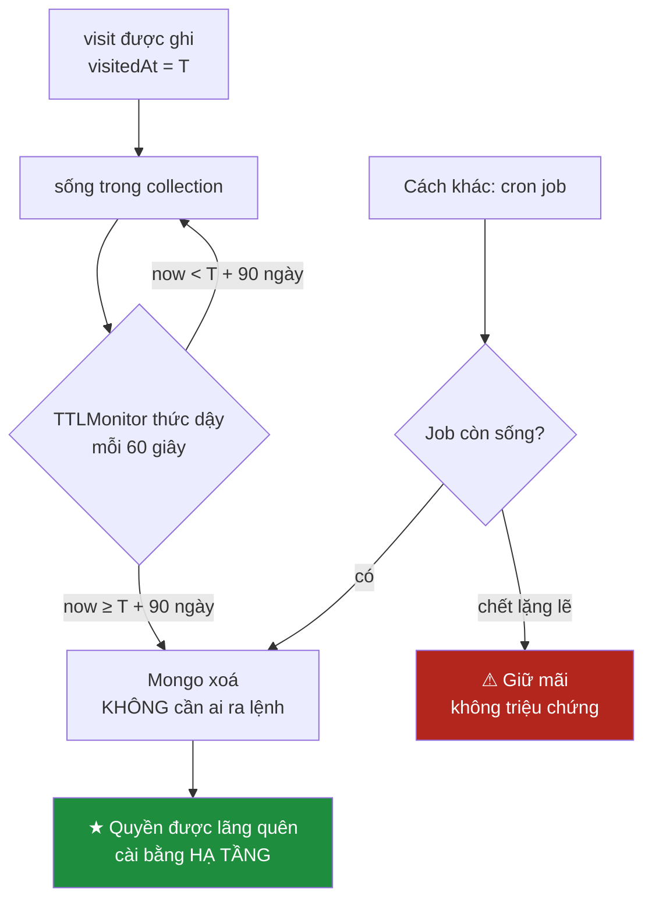

### 38.3 Ba chi tiết phải biết trước khi tin vào TTL

1. **Hết hạn là gần đúng.** Tiến trình `TTLMonitor` của `mongod` chạy theo chu
   kỳ **60 giây**. Tài liệu quá hạn lúc 10:00:01 có thể vẫn đọc được tới
   10:00:59. Trên mốc 90 ngày thì không đáng kể — nhưng ai định dùng TTL để cài
   một khoá phiên hết hạn chính xác là đang dùng sai công cụ.
2. **Xoá cũng tốn.** TTLMonitor xoá theo lô, mỗi lần là ghi thật, có oplog, có
   cập nhật chỉ mục. TTL không miễn phí — nó chỉ trả dần thay vì trả một cục.
3. **TTL chỉ hoạt động trên trường kiểu `Date`.** Nếu `visitedAt` bị ghi thành
   chuỗi ISO-8601, chỉ mục vẫn tạo được, vẫn hiện trong `getIndexes()`, và
   **không xoá gì cả** — im lặng tuyệt đối. Ở đây trường là `time.Time`, driver
   mã hoá thành BSON `Date`, nên đúng. Nhưng đây là cái bẫy hạng nhất của TTL.

### 38.4 Vì sao 90 và 30 khác nhau

Trung thực: **mã không có chú thích nào giải thích hai con số**, không có tài
liệu quyết định đi kèm. `EnsureIndexes` chỉ viết `90 * day` và `30 * day`.

Điều mã *có* nói là chức năng của `search_queries`: nó phục vụ gợi ý và lịch sử
tìm kiếm. Một cách đọc hợp lý — **suy luận, không phải trích dẫn** — là truy vấn
tìm kiếm mang ý định trực tiếp hơn URL đã ghé, và gợi ý hữu ích chỉ cần dữ liệu
gần đây. Người bảo trì nên **ghi hẳn lý do vào mã**: đây là hai con số có hệ quả
pháp lý, và một hằng số không lời giải thích là hằng số sẽ bị ai đó sửa bừa.

---

## 39. ⚠ `visits` thiếu chỉ mục duy nhất — cửa sổ đua giữa đọc và ghi

Đây là **lỗi thật**, không phải góp ý về phong cách.

### 39.1 Luồng hiện tại

```go
	existing, err := s.store.FindVisitByURL(ctx, username, cleanURL)
	if err != nil {
		return nil, err
	}
	if existing != nil {
		updated := Visit{
			ID: existing.ID, Username: username, URL: cleanURL,
			Title: truncate(title, maxTitleLength), Host: existing.Host,
			VisitedAt: now, VisitCount: existing.VisitCount + 1, Incognito: false,
		}
		v, err := s.store.UpsertVisit(ctx, updated)
		return &v, err
	}
	fresh := Visit{
		Username: username, URL: cleanURL, Title: truncate(title, maxTitleLength),
		Host: hostOf(cleanURL), VisitedAt: now, VisitCount: 1, Incognito: false,
	}
	v, err := s.store.UpsertVisit(ctx, fresh)
```

`UpsertVisit` có chữ "Upsert" trong tên nhưng **không dùng upsert của Mongo**:

```go
func (s *Store) UpsertVisit(ctx context.Context, v Visit) (Visit, error) {
	if v.ID.IsZero() {
		v.ID = primitive.NewObjectID()
		if _, err := s.visits.InsertOne(ctx, v); err != nil {
			return Visit{}, err
		}
		return v, nil
	}
	_, err := s.visits.ReplaceOne(ctx, bson.M{"_id": v.ID}, v)
	return v, err
}
```

Đây là **read-then-write**: đọc để quyết định, rồi ghi theo quyết định đó. Giữa
hai bước là khoảng thời gian mà thế giới có thể đổi — và `ix_visits_user_url`
được tạo **không có** `SetUnique(true)`, nên không có gì ở tầng CSDL ngăn hai
tài liệu cùng `(username, url)`.

### 39.2 Kịch bản hỏng

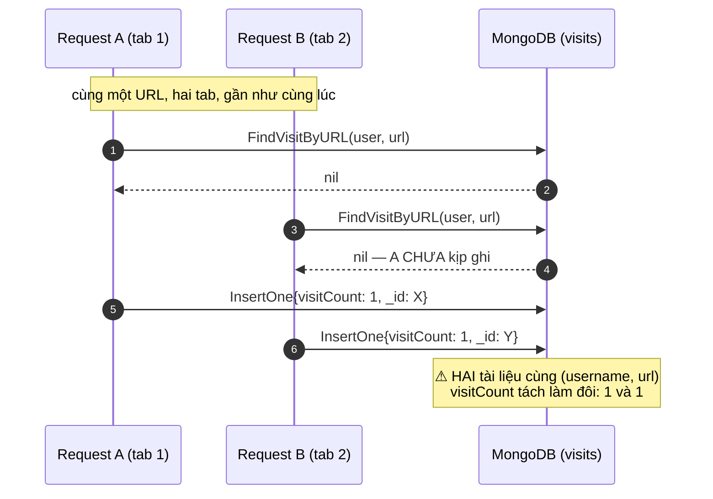

| Hệ quả | Vì sao |
|---|---|
| `visitCount` sai vĩnh viễn | Đếm bị tách; lần ghé sau rơi vào một trong hai bản, `FindOne` chỉ trả một |
| Lịch sử hiện URL trùng | `ListVisits` không khử trùng lặp |
| `CountVisits` phóng đại | `CountDocuments` đếm cả bản trùng |
| `DeleteVisit(id)` xoá một nửa | Nó xoá theo `_id`, mà giờ có hai `_id` |

Cửa sổ đua nhỏ — cỡ một vòng khứ hồi mạng — nhưng **không bao giờ bằng không**,
và trình duyệt sinh ra chính xác kiểu song song này (khôi phục nhiều tab lúc
khởi động, tự làm mới, người dùng bấm hai lần).

### 39.3 Cách sửa

**(a) Ràng buộc ở tầng CSDL** — biến "không nên trùng" thành "không thể trùng":

```go
		{Keys: bson.D{{Key: "username", Value: 1}, {Key: "url", Value: 1}},
			Options: options.Index().SetName("ix_visits_user_url").SetUnique(true)},
```

*(Nếu dữ liệu hiện có đã trùng, `CreateMany` sẽ lỗi và service không khởi động
được — phải dọn trùng trước bằng một aggregation gom theo `(username, url)`.)*

**(b) Bỏ hai lượt đi, để Mongo lo tranh chấp:**

```go
	opt := options.FindOneAndUpdate().SetUpsert(true).SetReturnDocument(options.After)
	err := s.visits.FindOneAndUpdate(ctx,
		bson.M{"username": username, "url": url},
		bson.M{
			"$inc":         bson.M{"visitCount": 1},
			"$set":         bson.M{"visitedAt": now, "title": title, "incognito": false},
			"$setOnInsert": bson.M{"host": host},
		}, opt).Decode(&v)
```

`$inc` nguyên tử ở phía máy chủ: hai request song song cho ra `visitCount: 2`,
không phải hai bản ghi mang số 1. `$setOnInsert` giữ `host` chỉ tính một lần —
đúng bằng hành vi hiện tại (`Host: existing.Host` khi cập nhật).

### 39.4 `search_queries` có cùng vấn đề — trả lời trung thực

Có, **đúng cùng một lỗi**:

```go
	existing, err := s.store.FindQueryByNormalized(ctx, username, normalized)
	...
	if existing != nil {
		q.ID = existing.ID
	}
	saved, err := s.store.UpsertQuery(ctx, q)
```

`ix_queries_user_prefix` cũng **không unique**, `UpsertQuery` cũng chỉ là
`InsertOne` khi `ID` rỗng. Hậu quả nhẹ hơn — `SearchQuery` không có bộ đếm nào
để tách đôi — nhưng triệu chứng nhìn thấy được thì có: **danh sách gợi ý hiện
cùng một từ khoá hai lần**. Cách sửa giống hệt: unique index trên
`(username, normalized)` + một `FindOneAndUpdate` upsert.

---

## 40. ⚠ `SuggestQueries` — regex `i` vô hiệu hoá nửa sau của chỉ mục

### 40.1 Mã

```go
	pattern := "^" + quoteRegex(normalize(prefix))
	out, err := s.store.SuggestQueries(ctx, username, pattern, clamp(size))
```

```go
	filter := bson.M{
		"username":   username,
		"normalized": bson.M{"$regex": primitive.Regex{Pattern: anchoredPattern, Options: "i"}},
	}
	opt := options.Find().SetSort(bson.D{{Key: "searchedAt", Value: -1}}).SetLimit(int64(limit))
```

### 40.2 Chuyện gì thực sự xảy ra

| Mệnh đề | |
|---|---|
| Regex trong Mongo luôn phải quét tuần tự | **Sai** |
| Regex **neo đầu** (`^tiền_tố`) dùng được chỉ mục để quét dải | **Đúng** |
| Neo đầu **kèm cờ `i`** vẫn dùng được chỉ mục để quét dải | **Sai** — chỗ hỏng |

Lý do rất cơ học. Chỉ mục B-tree là cấu trúc **đã sắp xếp**, và thứ tự sắp xếp
chuỗi **phân biệt hoa thường**. Với mẫu `^abc` không cờ `i`, Mongo biết mọi kết
quả nằm trong dải `["abc", "abd")` — nó nhảy thẳng tới đầu dải và dừng ở cuối.
Bật `i` thì kết quả có thể là `abc`, `Abc`, `ABC`, `aBc`… — **nằm rải rác**
trong thứ tự sắp xếp, không còn là một dải liên tục. Không còn dải thì không
còn phép nhảy.

**Hệ quả chính xác — không được nói quá:** chỉ mục là `(username, normalized)`.
Nửa **`username`** vẫn dùng được bình thường (so khớp bằng), nên Mongo thu hẹp
ngay về đúng phần chỉ mục của một người. Chỉ nửa **`normalized`** phải quét tuần
tự **trong phạm vi đã thu hẹp đó**.

Nghĩa là: **không phải** quét toàn bộ collection (`COLLSCAN`), nhưng cũng
**không phải** tra chỉ mục thực thụ — một `IXSCAN` với phần lọc `normalized` bị
đẩy xuống thành bộ lọc sau, chạm mọi truy vấn đã lưu của người dùng đó. Với 20
truy vấn thì không ai đo được; với người dùng nặng có hàng chục nghìn truy vấn
trong 30 ngày, và gợi ý được gọi **trên mỗi phím gõ**, đó là chi phí có thật.
Thêm nữa, `SetSort(searchedAt: -1)` không nằm trong chỉ mục, nên còn một lần sắp
xếp trong bộ nhớ sau khi lọc.

### 40.3 ★ Cờ `i` ở đây thậm chí là THỪA

```go
func normalize(value string) string {
	return wsRun.ReplaceAllString(strings.ToLower(strings.TrimSpace(value)), " ")
}
```

`strings.ToLower` — **cột `normalized` đã hạ chữ thường ngay lúc GHI**.
`RecordSearch` gọi `normalize(clean)` trước khi lưu; `Suggest` gọi
`normalize(prefix)` trước khi dựng mẫu. Cả hai vế đều đã là chữ thường.

Nghĩa là cờ `i` **không đổi kết quả một trường hợp nào** — nó chỉ vứt bỏ khả
năng dùng chỉ mục. Dạng lỗi hiệu năng dễ chịu nhất để sửa: bỏ đi mà không mất gì.

### 40.4 Cách sửa

```go
		"normalized": bson.M{"$regex": primitive.Regex{Pattern: anchoredPattern}},
```

Bỏ `Options: "i"`, đúng một chỗ. Mẫu vẫn neo đầu (`Suggest` luôn thêm `^`),
chuỗi so khớp vẫn đã chuẩn hoá, và Mongo quét được đúng dải.

Đi xa hơn: đổi `ix_queries_user_prefix` thành `(username, normalized, searchedAt↓)`
để phép sắp xếp cũng được chỉ mục phục vụ — khi đó truy vấn gợi ý là một lần
quét dải rồi lấy `limit` bản đầu, không sắp trong bộ nhớ.

⚠ **Điều kiện tiên quyết:** dữ liệu cũ ghi bởi phiên bản trước `normalize` (nếu
có) còn chữ hoa sẽ **biến mất khỏi gợi ý** sau khi bỏ cờ. Một lệnh cập nhật một
lần hạ chữ thường toàn bộ `normalized` là bước dọn đi kèm.

---

## 41. ⚠ `audit_log` của Mongo: không chỉ mục, không TTL

```go
func (s *Store) RecordAudit(ctx context.Context, subject, action, resource, outcome, detail string) error {
	_, err := s.audits.InsertOne(ctx, bson.M{
		"occurredAt": time.Now().UTC(),
		"subject":    subject,
		"action":     action,
		"resource":   resource,
		"outcome":    outcome,
		"detail":     detail,
	})
	return err
}
```

Collection này **không xuất hiện một lần nào trong `EnsureIndexes`** — hàm đó
chạm `s.visits` và `s.queries`, không chạm `s.audits`.

| Bảng audit | Chỉ mục | TTL |
|---|---|---|
| `auth.audit_log` (Postgres) | `ix_audit_log_subject`, `ix_audit_log_occurred_at` | không |
| `audit_log` downloads (Postgres) | hai chỉ mục như trên | không |
| `audit_log` settings (Postgres) | hai chỉ mục như trên | không |
| ⚠ `audit_log` history (Mongo) | **không gì ngoài `_id`** | **không** |

Ba hệ quả:

1. **Chỉ ghi thêm, không bao giờ xoá.** `visits` bay sau 90 ngày, nhưng bản ghi
   audit *về việc xoá visits* ở lại vĩnh viễn. Đây là collection duy nhất trong
   CSDL này tăng đơn điệu.
2. **Mọi truy vấn là quét toàn bộ.** "Ai đã xoá lịch sử tháng trước?" phải đọc
   từng tài liệu. Nghịch lý: collection này càng có ích khi càng lớn, mà càng
   lớn thì càng không tra được.
3. **Nghịch lý riêng tư.** `subject` và `detail` chứa tên tài khoản. Một CSDL
   vừa được thiết kế để tự quên sau 90 ngày lại giữ vĩnh viễn danh sách "người X
   đã xoá lịch sử lúc Y".

**Cách sửa** — thêm một khối thứ ba, đúng khuôn hai khối đã có:

```go
	_, err = s.audits.Indexes().CreateMany(ctx, []mongo.IndexModel{
		{Keys: bson.D{{Key: "subject", Value: 1}, {Key: "occurredAt", Value: -1}},
			Options: options.Index().SetName("ix_audit_subject_time")},
		{Keys: bson.D{{Key: "occurredAt", Value: 1}},
			Options: options.Index().SetName("ix_audit_ttl").SetExpireAfterSeconds(365 * day)},
	})
```

Chỉ mục tổ hợp `(subject, occurredAt↓)` phục vụ thẳng "audit của người X gần
đây" — đúng bài học mà ba bảng PostgreSQL cũng đang thiếu (mục 47). Con số 365
ngày là **đề xuất, không phải số đọc từ mã**: thời hạn giữ nhật ký kiểm toán là
quyết định của người sở hữu hệ thống. Điểm cần chốt là phải có **một** con số, và
nó phải nằm trong mã chứ không nằm trong đầu ai đó.

---

# PHẦN X — REDIS — TRẠNG THÁI CÓ HẠN DÙNG

Redis ở đây **không phải cache**. Không khoá nào là bản sao của dữ liệu có sẵn
nơi khác. Nó giữ đúng một loại thứ: **trạng thái có hạn dùng** — thứ vốn dĩ sinh
ra để chết. Toàn bộ cấu hình ở mục 44 chỉ hợp lý dưới ánh sáng của nhận định đó.

---

## 42. Bốn không gian khoá

```java
 *   rt:{băm}             -> "{tài khoản}|{chuỗi}"  TTL = hạn refresh token
 *   rt:used:{băm}        -> "1"                    TTL = 30 ngày
 *   rt:user:{tài khoản}  -> SET các {băm} đang sống
 *   at:denied:{jti}      -> "1"                    TTL = phần đời còn lại của access token
```

| Khoá | Kiểu Redis | Giá trị | TTL | Ai ghi | Ai đọc |
|---|---|---|---|---|---|
| `rt:<băm>` | String | `"<tài khoản>\|<chuỗi>"` | `ttl` truyền vào `issue()`, mặc định `P30D` | `issue()` | `consume()`, `revoke()` |
| `rt:used:<băm>` | String | `"1"` | `USED_MARKER_TTL` = **30 ngày** cố định | `consume()` qua `setIfAbsent` | `consume()` (`hasKey`) |
| `rt:user:<tài khoản>` | **SET** | tập băm token còn sống của người đó | `ttl.plusDays(1)` | `issue()` (`add` + `expire`) | `revokeAllFor()`, `activeSessionCount()` |
| `at:denied:<jti>` | String | `"1"` | `remainingLifetime` | `denyAccessToken()` (auth-service) | `isAccessTokenDenied()`; **và `TokenDenylistFilter` ở api-gateway** |

`at:denied:` là không gian khoá duy nhất được **hai service** chạm vào, và bên
đọc khác bên ghi. Gateway ghi rõ ràng buộc đó:

```java
    /** Cùng tiền tố mà auth-service dùng khi ghi — xem RedisRefreshTokenStore. */
    private static final String DENIED_PREFIX = "at:denied:";
```

Đó là dạng ràng buộc nguy hiểm — một chuỗi phải khớp giữa hai codebase, không
trình biên dịch nào kiểm — và chú thích trỏ đích danh lớp bên kia là mức tối
thiểu chấp nhận được.

### 42.1 🔒 Token KHÔNG lưu nguyên văn, chỉ lưu băm

```java
    public String issue(String username, String family, Duration ttl) {
        String token = randomToken();
        String hash = hash(token);
        ...
        redis.opsForValue().set(TOKEN_PREFIX + hash, username + SEPARATOR + chain, ttl);
```

```java
            byte[] digest = MessageDigest.getInstance("SHA-256")
                    .digest(token.getBytes(StandardCharsets.UTF_8));
```

**Đọc được toàn bộ Redis cũng không mạo danh được ai.** Một bản dump lọt ra
ngoài, một `KEYS *` từ container bị chiếm, một ổ sao lưu thất lạc — kẻ cầm được
chỉ có danh sách băm SHA-256 của những chuỗi 32 byte ngẫu nhiên.

Javadoc còn giải thích **vì sao SHA-256 trần chứ không BCrypt**:

> BCrypt cố ý chậm để chống dò từ điển, nhưng refresh token là 32 byte ngẫu
> nhiên — không có từ điển nào dò được, và cái chậm đó chỉ làm mỗi lần gia hạn
> token tốn thêm 200 ms.

Gọn lại: BCrypt chậm để bù cho **entropy thấp** của mật khẩu người chọn. Token
ở đây có 256 bit từ `SecureRandom` — không có gì để bù, nên cái chậm chỉ còn là
chi phí.

---

## 43. ★ `rt:used:` phải sống LÂU HƠN chính token nó canh

Đây là mẫu bảo mật đáng giá nhất trong toàn bộ tài liệu này.

### 43.1 Vấn đề: làm sao biết refresh token đã bị đánh cắp

Refresh token tương đương mật khẩu, nhưng khác mật khẩu, nó **không được người
dùng nhìn thấy** — bị sao chép thì không ai báo cáo gì. Giải pháp là **xoay vòng
token + phát hiện dùng lại**:

1. Mỗi lần đổi lấy access token mới, token cũ bị huỷ và token mới được phát.
   Token cũ dùng được **đúng một lần**.
2. Nếu token đã dùng xuất hiện lần nữa, chỉ có một cách giải thích: **tồn tại
   một bản sao**.
3. Phản ứng: huỷ **toàn bộ chuỗi** (`chain`/family). Người dùng thật đăng nhập
   lại; kẻ trộm cũng vậy — nhưng kẻ trộm không có mật khẩu.

Javadoc chốt: *"Đây là biện pháp duy nhất phát hiện được vụ đánh cắp refresh
token mà không cần người dùng báo cáo."*

### 43.2 ★ Vì sao dấu "đã dùng" phải sống lâu hơn token

```java
    /** Dấu "đã dùng" phải sống lâu hơn refresh token, nếu không thì hết hạn xong
     *  là dấu vết biến mất và phép phát hiện dùng lại mất tác dụng. */
    private static final Duration USED_MARKER_TTL = Duration.ofDays(30);
```

Suy nghĩ ngây thơ: token hết hạn rồi thì dấu "đã dùng" giữ làm gì, dọn cho nhẹ.
Sai — và sai theo cách im lặng. Nếu `rt:used:<băm>` hết hạn cùng lúc với
`rt:<băm>`, sau thời điểm đó Redis không còn **bằng chứng nào** rằng token ấy
từng tồn tại. Kẻ trộm chỉ cần **đợi**: token dùng lại sau khi dấu vết bay mất
rơi vào nhánh "không tìm thấy" — `Optional.empty()`, một lần đăng nhập thất bại
bình thường, **không cảnh báo, không thu hồi chuỗi**.

⚠ **Trung thực về con số hiện tại:**

| Hằng số | Giá trị | Nguồn |
|---|---|---|
| `USED_MARKER_TTL` | 30 ngày, cố định trong mã | `RedisRefreshTokenStore.java` |
| `app.auth.refresh-token-ttl` | `P30D` = 30 ngày (mặc định) | `application.properties`, biến `AUTH_REFRESH_TTL` |

Với cấu hình mặc định hai con số **bằng nhau**, không phải "lâu hơn". Bất biến
mà chú thích mô tả chỉ vừa đủ giữ được, và nó **vỡ ngay** nếu ai đó đặt
`AUTH_REFRESH_TTL=P60D` mà không sửa hằng số Java — lúc đó dấu "đã dùng" chết
trước token 30 ngày, và phép phát hiện tắt trong 30 ngày cuối đời của mỗi token
mà không có dấu hiệu nào. Cách sửa: buộc hai con số vào nhau, ví dụ
`USED_MARKER_TTL = refreshTokenTtl.plusDays(7)` truyền vào từ cấu hình.

### 43.3 ★ `setIfAbsent` — phép toán nguyên tử

```java
        // Đánh dấu ĐÃ DÙNG trước khi trả về, không phải sau. setIfAbsent là
        // phép toán nguyên tử của Redis, nên khi hai request song song cùng
        // mang một token, chỉ đúng MỘT request đi tiếp. Đánh dấu sau khi trả về
        // sẽ để lọt cả hai — và đó chính là lỗ hổng mà phép xoay vòng token
        // sinh ra để bịt.
        Boolean firstUse = redis.opsForValue()
                .setIfAbsent(USED_PREFIX + hash, "1", USED_MARKER_TTL);
        if (!Boolean.TRUE.equals(firstUse)) {
            return Optional.empty();
        }
```

`setIfAbsent` là `SET key value NX EX ttl` — Redis thực thi **nguyên tử** trong
tiến trình đơn luồng của mình. Hai request cùng lúc thì đúng một nhận `true`.

So sánh với mục 39: ở `visits`, mẫu read-then-write để lọt cả hai và sinh dữ
liệu trùng. Ở đây, cùng hình dạng bài toán được giải bằng một phép toán nguyên
tử — và **kết quả đúng**. Hai mục đứng cạnh nhau là có chủ ý: cùng một bài học,
một lần sai và một lần đúng, trong cùng một codebase.

Đường phát hiện chạy **trước** mọi thứ khác trong `consume()`:

```java
        if (Boolean.TRUE.equals(redis.hasKey(USED_PREFIX + hash))) {
            String stored = redis.opsForValue().get(TOKEN_PREFIX + hash);
            String username = stored == null ? null : usernameOf(stored);
            log.warn("Refresh token bị DÙNG LẠI (tài khoản={}). Nhiều khả năng token đã bị"
                    + " sao chép — huỷ toàn bộ phiên của tài khoản này.", username);
            if (username != null) {
                revokeAllFor(username);
            }
            return Optional.empty();
        }
```

### 43.4 Kịch bản: người dùng thật và kẻ trộm

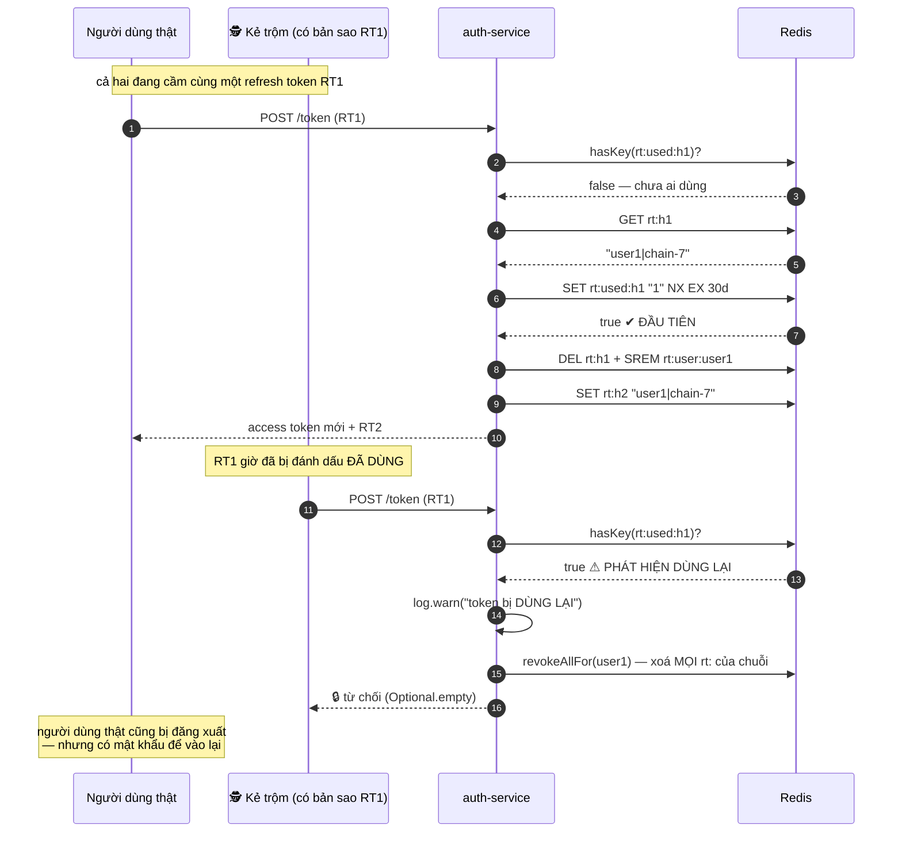

<details><summary>Xem bản chữ (ASCII)</summary>

```
[1] Người thật -> auth: refresh(RT1)
    hasKey(rt:used:h1)?        -> false
    GET rt:h1                  -> "user1|chain-7"
    SET rt:used:h1 NX EX 30d   -> TRUE (nguyên tử, đầu tiên)
    DEL rt:h1 ; SET rt:h2
    -> trả access token + RT2

[2] Kẻ trộm -> auth: refresh(RT1)
    hasKey(rt:used:h1)?        -> TRUE   <== PHÁT HIỆN
    log.warn "token bị DÙNG LẠI"
    revokeAllFor(user1)        (huỷ CẢ CHUỖI)
    -> TỪ CHỐI

Trật tự ngược lại cho kết quả đối xứng: người thật bị phát hiện,
chuỗi vẫn bị huỷ. Ai đến sau cũng bị chặn, và VỤ TRỘM LỘ RA.
```

</details>

**Điểm tinh tế:** cơ chế này **không phân biệt được** ai là người thật, ai là kẻ
trộm — ai đến trước thì đi tiếp. Nó không cần phân biệt. Điều nó bảo đảm là **vụ
trộm bị phát hiện** trong cả hai trật tự đến, và phản ứng đúng trong cả hai.

### 43.5 `rt:user:` — SET để thu hồi cả tài khoản, và cái bẫy TTL của chính nó

```java
    public int revokeAllFor(String username) {
        Set<String> hashes = redis.opsForSet().members(USER_PREFIX + username);
        if (hashes == null || hashes.isEmpty()) {
            return 0;
        }
        for (String hash : hashes) {
            redis.delete(TOKEN_PREFIX + hash);
        }
        redis.delete(USER_PREFIX + username);
        return hashes.size();
    }
```

Không có SET này, "đăng xuất khỏi mọi thiết bị" phải quét toàn bộ `rt:*` và giải
mã từng giá trị. ★ Cái bẫy nằm ở chỗ khác, và mã đã bẫy được:

```java
        redis.opsForSet().add(USER_PREFIX + username, hash);
        // Tập theo người dùng cũng phải có hạn, nếu không nó phình mãi với
        // những băm đã hết hạn từ lâu — Redis xoá khoá token nhưng không tự dọn
        // tên nó khỏi tập.
        redis.expire(USER_PREFIX + username, ttl.plusDays(1));
```

**TTL của Redis áp cho khoá, không áp cho phần tử bên trong một tập hợp.** Khi
`rt:<băm>` hết hạn, chuỗi `<băm>` vẫn nằm nguyên trong SET — một cái tên trỏ tới
hư vô. Không đặt TTL cho chính SET thì nó tăng đơn điệu theo mỗi lần đăng nhập,
mãi mãi. `plusDays(1)` là biên an toàn, và mỗi `issue()` lại đẩy hạn ra.

### 43.6 `SCAN_LIMIT` — đếm phiên mà không làm sập Redis

```java
    private static final int SCAN_LIMIT = 10_000;
```

**Vì sao `SCAN` chứ không `KEYS`:** *"`KEYS` chặn Redis trong suốt thời gian
duyệt — với một tiến trình đơn luồng phục vụ cả tám service, đó là một lần dừng
toàn hệ thống. `SCAN` duyệt theo lô và nhả quyền giữa các lô."* Đây là chỗ tính
đơn luồng — thứ làm `setIfAbsent` ở 43.3 đúng — quay lại thành rủi ro: **một
lệnh chậm là mọi lệnh chậm**.

**Vì sao có trần:** *"Con số này chỉ để hiện trên bảng điều khiển. Không có trần
thì với một triệu người dùng, một lần mở bảng điều khiển kéo về một triệu khoá."*
Và khi chạm trần, mã **nói ra** thay vì im lặng trả số sai:

```java
        if (scanned >= SCAN_LIMIT) {
            log.info("Đếm phiên dừng ở trần {} khoá — con số trả về là cận dưới.", SCAN_LIMIT);
        }
```

---

## 44. `allkeys-lru` và quyết định KHÔNG lưu bền

```yaml
  redis:
    command:
      - redis-server
      - --maxmemory
      - 100mb
      # Refresh token và denylist đều CÓ HẠN DÙNG, nên đuổi mục cũ nhất khi
      # đầy là hành vi đúng. `noeviction` (mặc định) sẽ khiến Redis từ chối
      # mọi phép ghi khi đầy — tức là không ai đăng nhập được nữa.
      - --maxmemory-policy
      - allkeys-lru
      # KHÔNG bật lưu bền. Mất dữ liệu Redis nghĩa là mọi người phải đăng nhập
      # lại — phiền, nhưng không mất gì vĩnh viễn. Đổi lại: không tốn đĩa,
      # không có lúc dừng vì fork lúc snapshot.
      - --save
      - ""
      - --appendonly
      - "no"
    mem_limit: 128m
```

### 44.1 ★ `allkeys-lru` đúng vì mọi khoá ở đây đều có hạn dùng

| Chính sách | Khi đầy | Áp vào hệ này |
|---|---|---|
| `noeviction` (mặc định) | Từ chối **mọi** lệnh ghi | ⚠ `issue()` lỗi ⇒ **không ai đăng nhập được nữa**, và tình trạng đó tự nó không hết |
| `volatile-lru` | Chỉ đuổi khoá có TTL | Gần tương đương ở đây, nhưng vẫn rơi vào lỗi OOM nếu tồn tại khoá không TTL |
| ★ `allkeys-lru` | Đuổi khoá ít dùng gần đây nhất | **Đuổi một khoá = một người đăng nhập lại.** Chi phí có giới hạn, cục bộ, tự phục hồi |

Gọn trong một câu: khi hết bộ nhớ, phải chọn giữa **mất một ít trạng thái** và
**ngừng nhận trạng thái mới**. Với dữ liệu vốn dĩ tạm thời, mất một ít là lựa
chọn hiển nhiên — nhưng chỉ đúng **vì** không có gì ở đây là nguồn sự thật duy
nhất. Nếu ai đó về sau đặt một hàng đợi công việc vào cùng Redis này,
`allkeys-lru` sẽ lặng lẽ nuốt mất công việc.

### 44.2 Không lưu bền

`--save ""` tắt snapshot RDB, `--appendonly no` tắt AOF.

| Mất gì | Được gì |
|---|---|
| Restart ⇒ **mọi refresh token biến mất** ⇒ mọi người đăng nhập lại | Không tốn đĩa, không volume phải sao lưu |
| Danh sách thu hồi biến mất — xem ⚠ dưới | Không **khựng vì fork**: RDB snapshot bằng `fork()`, với heap lớn cú fork đó đóng băng Redis một khoảng đo được |

Với 100 MB `maxmemory`, cú fork không đắt lắm — lý do thật sự là lý do đầu:
**không có gì đáng lưu bền**, nên lưu bền chỉ là chi phí không đổi lấy gì.

### 44.3 ⚠ Hệ quả ít người nghĩ tới: `at:denied:` cũng bay mất

Chú thích trong `docker-compose.yml` **không** nói tới điểm này. "Mọi người đăng
nhập lại" nghe như bất tiện thuần tuý — nhưng `at:denied:<jti>` cũng nằm trong
Redis đó, và nó là một **biện pháp bảo mật**, không phải dữ liệu tiện lợi.

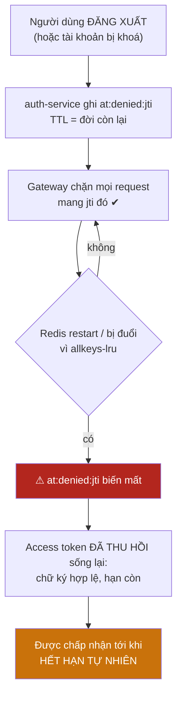

**Cửa sổ rủi ro dài bao lâu?** Đọc được từ cấu hình:

```properties
app.auth.access-token-ttl=${AUTH_ACCESS_TTL:PT15M}
```

Mặc định `PT15M` = **15 phút**, cấu hình qua `AUTH_ACCESS_TTL` — cùng con số mà
Javadoc của `TokenDenylistFilter` viện dẫn. Vậy cửa sổ tối đa là **tuổi thọ
access token, 15 phút với cấu hình mặc định**; nâng `AUTH_ACCESS_TTL` là nâng
cửa sổ này theo đúng tỉ lệ.

Ba quyết định trong hệ này cùng dựa vào một tiền đề "access token chỉ sống 15
phút":

| Quyết định | Nơi ghi | Rủi ro chấp nhận |
|---|---|---|
| Không lưu bền Redis | `docker-compose.yml` | Token đã thu hồi sống lại tới khi hết hạn |
| Denylist chỉ ở Gateway | Javadoc `TokenDenylistFilter` | Gọi thẳng service bỏ qua được denylist |
| Redis lỗi thì cho request đi tiếp | `onErrorResume` trong filter đó | Token đã thu hồi lọt qua khi Redis hỏng |

Cả ba đều **có chủ ý** và đều được ghi lại — Javadoc thậm chí nói thẳng ranh
giới áp dụng: *"Ở một hệ thống mà token mang quyền chuyển tiền, lựa chọn đúng sẽ
là ngược lại."* Nhưng chúng **cộng dồn**: người nào nâng `AUTH_ACCESS_TTL` lên
một giờ sẽ nhân bốn cả ba cửa sổ rủi ro cùng lúc, không có gì cảnh báo. Đó là
thứ đáng ghi vào chú thích của chính biến đó.

---

# PHẦN XI — AUDIT LOG — BỐN BẢN SAO CỦA CÙNG MỘT BẢNG

## 45. Cùng một lược đồ, bốn nơi, cố ý

| # | Nơi | Kho | Tệp lược đồ | Lớp ghi |
|---|---|---|---|---|
| 1 | `auth.audit_log` | PostgreSQL (`vnsearch_auth`) | `V2__audit_log.sql` (Flyway) | `config/AuditLogger.java` |
| 2 | `audit_log` downloads | PostgreSQL (`vnsearch_downloads`) | `0002_audit_log.up.sql` | `internal/downloads/audit.go` |
| 3 | `audit_log` settings | PostgreSQL (`vnsearch_settings`) | `0002_audit_log.up.sql` | `internal/settings/audit.go` |
| 4 | `audit_log` history | **MongoDB** | *(không có — collection tự sinh)* | `store.RecordAudit` |

Ba bảng PostgreSQL giống hệt nhau **từng cột**:

```sql
CREATE TABLE IF NOT EXISTS audit_log (
    id          BIGSERIAL PRIMARY KEY,
    occurred_at TIMESTAMPTZ NOT NULL DEFAULT now(),
    subject     VARCHAR(64),
    action      VARCHAR(64)  NOT NULL,
    resource    VARCHAR(128),
    outcome     VARCHAR(16)  NOT NULL,
    detail      VARCHAR(500)
);

CREATE INDEX IF NOT EXISTS ix_audit_log_subject ON audit_log (subject);
CREATE INDEX IF NOT EXISTS ix_audit_log_occurred_at ON audit_log (occurred_at);
```

Bản settings giống từng ký tự; bản auth khác **đúng một chỗ** — tiền tố schema
`auth.`, vì auth-service đặt bảng trong schema riêng.

Hai chi tiết đáng khen: `TIMESTAMPTZ` chứ không `TIMESTAMP` trần (bốn service
chạy với `TZ: Asia/Ho_Chi_Minh` nhưng vẫn phải so sánh mốc tuyệt đối khi gộp
bốn nguồn), và `detail VARCHAR(500)` **có trần** — một cột `TEXT` không trần là
chỗ để một stack trace 40 KB lọt vào nhật ký kiểm toán.

### 45.1 ★ Vì sao nhân bản lược đồ là ĐÚNG, không phải lỗi copy-paste

Toàn hệ thống theo **database per service**: `vnsearch_auth`,
`vnsearch_downloads`, `vnsearch_settings` là ba CSDL riêng với ba tài khoản riêng
(`AUTH_DB_USER`, `DOWNLOADS_DB_USER`, `SETTINGS_DB_USER`), cộng `vnsearch_history`
trên Mongo. Một bảng `audit_log` dùng chung sẽ **dựng lại đúng thứ vừa được gỡ
bỏ**:

| Nếu gộp một bảng chung | Hệ quả |
|---|---|
| Bốn service cùng ghi vào một CSDL | Ba service phải có quyền vào CSDL của người khác — thủng ranh giới quyền |
| Thêm cột `trace_id` | Phải phối hợp migration của **bốn** service, triển khai đồng bộ |
| CSDL audit chết | **Bốn** service mất khả năng ghi audit, thay vì một |
| Mongo phải ghi vào Postgres | history-service mang thêm driver Postgres chỉ để ghi audit |

Trùng lặp về **cấu trúc** là cái giá rẻ để giữ **độc lập về vận hành**. Đây là
dạng trùng lặp mà DRY không áp dụng: hai bảng giống nhau về hình dạng nhưng
thuộc hai chủ sở hữu khác nhau không phải cùng một thứ được viết hai lần.

### 45.2 Cái giá — và trạng thái hiện tại trong repo

Không nơi nào trả lời được "người X đã làm gì hôm qua". Câu trả lời nằm rải ở
bốn nguồn: ba lần `SELECT` trên ba CSDL Postgres, cộng một `find()` trên Mongo,
rồi gộp và sắp theo `occurred_at` / `occurredAt`.

Kiểm tra trung thực: **không có công cụ gộp nào trong repo**. Tìm toàn bộ mã
theo chuỗi `audit_log` chỉ ra đúng bốn nơi ghi và bốn tệp lược đồ — không view,
không job ETL, không endpoint tổng hợp. Bên Mongo còn không có cả đường **đọc**:
`RecordAudit` chỉ ghi, không hàm nào truy vấn lại collection đó.

Bốn bảng này hiện là **ghi-để-đó**. Nếu một ngày cần điều tra thật, người điều
tra sẽ mở bốn phiên `psql`/`mongosh` và gộp bằng tay. Việc gộp là công việc của
tầng trên — và ghi ra rằng tầng đó **chưa tồn tại** quan trọng hơn việc giả vờ
rằng nó có.

---

## 46. ★ Ghi nhật ký hỏng KHÔNG được làm hỏng nghiệp vụ

```go
func (a *Audit) Record(subject, action, resource, outcome, detail string) {
	slog.Info("audit", "subject", subject, "action", action, "resource", resource, "outcome", outcome)
	ctx, cancel := context.WithTimeout(context.Background(), 3*time.Second)
	defer cancel()
	_, err := a.pool.Exec(ctx, `
		INSERT INTO audit_log (subject, action, resource, outcome, detail)
		VALUES ($1, $2, $3, $4, $5)`,
		nullable(subject), action, nullable(resource), outcome, nullable(detail))
	if err != nil {
		slog.Warn("audit ghi hỏng", "err", err)
	}
}
```

Ba quyết định trong chín dòng:

| # | Quyết định | Chi tiết |
|---|---|---|
| 1 | **`slog.Info` chạy TRƯỚC `INSERT`** | Dấu vết vào log ứng dụng trước, không phụ thuộc CSDL |
| 2 | **`context.WithTimeout(3 giây)`** | Trần cứng; CSDL treo không kéo theo request treo |
| 3 | **Không trả lỗi** — hàm trả `void` | Lỗi ghi chỉ thành một dòng `slog.Warn` |

Quyết định 2 dùng `context.Background()`, **không** phải context của request:
người dùng đóng tab không huỷ theo lệnh ghi audit — đúng, vì bản ghi audit là về
sự kiện đã xảy ra, không về việc ai còn đợi kết quả.

### 46.1 (a) Vì sao đây là quyết định đúng

Nhật ký kiểm toán là **hệ thống phụ trợ**. Nếu `Record()` trả lỗi lên trên và
handler dừng vì nó: CSDL audit đầy đĩa ⇒ không ai đăng nhập được; bảng bị khoá
bởi `VACUUM FULL` ⇒ không ai xoá được download; một lỗi mạng thoáng qua ⇒ 500
trả về cho một thao tác **đã thành công**. Trường hợp cuối tệ nhất: nghiệp vụ đã
commit, người dùng thấy lỗi, thử lại, và làm nó hai lần. Ghi nhật ký làm hỏng
thứ mà nó chỉ có nhiệm vụ quan sát.

Cùng nguyên tắc `TokenDenylistFilter` áp cho Redis (44.3), áp ở đây cho Postgres:
**một thành phần phụ trợ hỏng không được biến thành điểm chết của hệ thống
chính**. Trong `history-service`, cùng lựa chọn ấy hiện ra ở tầng gọi:

```go
	_ = s.store.RecordAudit(ctx, username, "HISTORY_DELETE_RANGE", "visits+searches:"+username,
		"SUCCESS", "")
```

`_ =` trong Go là cách nói "tôi biết có lỗi ở đây và tôi cố tình bỏ qua" — khác
hẳn việc quên, vì trình biên dịch và linter đều bắt lỗi bị quên.

### 46.2 (b) ⚠ Nhưng với nhật ký bảo mật, đây là đánh đổi có rủi ro

Nhật ký kiểm toán không giống nhật ký gỡ lỗi. Giá trị của nó nằm ở chỗ nó **đầy
đủ**: một bảng audit thiếu bản ghi không phải là bảng kém chính xác một chút, mà
là bảng **không dùng làm bằng chứng được** — "không có bản ghi nào cho thao tác
đó" không còn phân biệt được với "thao tác đó không xảy ra".

Theo hướng tấn công: **kẻ tấn công gây được lỗi ghi audit sẽ hành động mà không
để lại dấu trong bảng.** Không cần tinh vi — chỉ cần làm CSDL audit chậm quá 3
giây là timeout tự làm việc đó, và ba giây dễ chạm hơn người ta tưởng khi
Postgres đang chịu tải hoặc đang autovacuum. Nghiệp vụ vẫn thành công, người
dùng không thấy gì, bảng audit không có gì: thất bại **im lặng theo hướng có lợi
cho kẻ tấn công**.

### 46.3 ★ Vì sao thứ tự "log trước, ghi DB sau" là chi tiết cứu vãn

`slog.Info` chạy **trước** `INSERT`, vô điều kiện, ra stdout, và stdout được
Docker thu vào json-file (`max-size: 10m`, `max-file: 3` ở neo `x-java-service`).

Nghĩa là kịch bản 46.2 không phải "không để lại dấu vết gì" mà là "không để lại
dấu vết **trong bảng**". Dấu vết vẫn còn trong log ứng dụng, và khi ghi DB hỏng
còn thêm dòng `slog.Warn("audit ghi hỏng")` ngay cạnh — nên bản thân sự thiếu
hụt cũng đếm được.

| Kịch bản | Bảng `audit_log` | Log ứng dụng |
|---|---|---|
| Bình thường | có bản ghi | có `audit ...` |
| DB audit hỏng / timeout 3s | ⚠ **thiếu** | có `audit ...` **và** `audit ghi hỏng` |
| Nếu đảo thứ tự (giả định) | thiếu | ⚠ **không có gì** |

Một dòng bị đổi chỗ, và khác biệt là giữa "có dấu vết ở nơi khác" và "không có
gì". Đó là lý do thứ tự hai câu lệnh này đáng được ghi vào tài liệu.

### 46.4 ⚠ Bản Java KHÔNG giống bản Go

```java
    public void record(String subject, String action, String resource, String outcome, String detail) {
        log.info("audit subject={} action={} resource={} outcome={}", subject, action, resource, outcome);
        if (jdbc == null) {
            return;
        }
        jdbc.sql("""
                INSERT INTO auth.audit_log (subject, action, resource, outcome, detail)
                VALUES (:subject, :action, :resource, :outcome, :detail)
                """)
                ...
                .update();
    }
```

Giống bản Go ở hai điểm: log trước, và `ObjectProvider<JdbcClient>` cho phép
chạy không có CSDL (`jdbc == null` thì chỉ log rồi về).

**Khác ở điểm quan trọng nhất: không có `try/catch`.** `.update()` ném
`DataAccessException` khi ghi hỏng, và ngoại lệ đó **lan lên tầng gọi**. Cũng
không có timeout tương đương `3 * time.Second`.

Nghĩa là `settings-service` và `downloads-service` **nuốt** lỗi audit, còn
`auth-service` **để nó ném ra**. Cùng một trách nhiệm, hai hành vi ngược nhau
trong cùng một hệ thống, và không chú thích nào ở cả hai phía nói rằng khác biệt
đó là cố ý. Bất kể chọn hướng nào, hai bên nên giống nhau và lý do nên nằm trong
mã. Chỗ không chấp nhận được là hiện trạng: **mỗi service một kiểu, do tình cờ**.

---

## 47. ⚠ Không có retention, không có phân mảnh

Ba tệp migration ở 45 tạo bảng và hai chỉ mục, **hết**. Không `PARTITION BY`,
không trigger dọn, không job xoá, không `pg_cron`. Tìm toàn repo cũng không có
kịch bản nào xoá `audit_log`. Ba bảng này **chỉ ghi thêm, không bao giờ xoá**,
từ ngày triển khai đầu tiên cho tới vô hạn.

### 47.1 ⚠ Không nhất quán với chính hệ thống

| Dữ liệu | Nhạy cảm? | Chính sách |
|---|---|---|
| `visits` — toàn bộ lịch sử duyệt web | rất | ★ TTL **90 ngày**, tự xoá |
| `search_queries` — mọi thứ người dùng tìm | rất | ★ TTL **30 ngày**, tự xoá |
| `auth.audit_log` — ai đăng nhập lúc nào | có | ⚠ **giữ mãi** |
| `audit_log` downloads/settings | có | ⚠ **giữ mãi** |
| `audit_log` history (Mongo) | có | ⚠ **giữ mãi, và không cả chỉ mục** (mục 41) |

Hệ thống bỏ công cài **quyền được lãng quên bằng hạ tầng** cho lịch sử duyệt web
(mục 38), rồi giữ vĩnh viễn một bảng ghi tên tài khoản kèm mốc thời gian của
từng thao tác. Sau 91 ngày, `visits` của một người đã biến mất, nhưng `audit_log`
vẫn ghi rằng người đó đã xoá lịch sử ngày nào.

Đây không phải mâu thuẫn logic — nhật ký kiểm toán thường **được phép**, và
nhiều nơi còn **bị bắt buộc**, giữ lâu hơn dữ liệu nghiệp vụ. Vấn đề là "lâu
hơn" khác "mãi mãi", và hệ thống này chưa từng chọn giữa hai thứ đó.

### 47.2 ⚠ Thiếu chỉ mục tổ hợp cho truy vấn hay dùng nhất

Hai chỉ mục hiện có là **hai chỉ mục một cột**. Truy vấn thường gặp nhất của một
bảng audit lại là truy vấn **hai chiều**:

```sql
SELECT * FROM audit_log
WHERE subject = 'user1'
ORDER BY occurred_at DESC
LIMIT 50;
```

PostgreSQL dùng `ix_audit_log_subject` lấy **mọi** bản ghi của `user1` — có thể
hàng chục nghìn dòng sau vài năm — rồi **sắp xếp toàn bộ** để lấy 50 dòng đầu.
`LIMIT 50` không giúp gì, vì chưa sắp xong thì không biết 50 dòng nào.

Đối chiếu với chính dự án: `ix_visits_user_time` bên Mongo là
`(username↑, visitedAt↓)` — **đúng hình dạng tổ hợp mà bảng audit đang thiếu**.
Bài học đã có sẵn trong repo, chỉ chưa được áp vào đây.

### 47.3 Cách sửa

**(a) Chỉ mục tổ hợp** — migration `0003`:

```sql
CREATE INDEX IF NOT EXISTS ix_audit_log_subject_time
    ON audit_log (subject, occurred_at DESC);
DROP INDEX IF EXISTS ix_audit_log_subject;
```

Chỉ mục cũ thành thừa: tổ hợp có `subject` dẫn đầu nên phục vụ được mọi truy vấn
mà nó phục vụ. Giữ `ix_audit_log_occurred_at` cho truy vấn theo khoảng thời gian
không kèm `subject`.

**(b) Phân mảnh theo tháng + retention:**

```sql
CREATE TABLE audit_log (
    id          BIGSERIAL,
    occurred_at TIMESTAMPTZ NOT NULL DEFAULT now(),
    subject     VARCHAR(64),
    action      VARCHAR(64)  NOT NULL,
    resource    VARCHAR(128),
    outcome     VARCHAR(16)  NOT NULL,
    detail      VARCHAR(500),
    PRIMARY KEY (id, occurred_at)
) PARTITION BY RANGE (occurred_at);

CREATE TABLE audit_log_2026_09 PARTITION OF audit_log
    FOR VALUES FROM ('2026-09-01') TO ('2026-10-01');
```

| | `DELETE ... WHERE occurred_at < ...` | `DROP TABLE audit_log_2025_01` |
|---|---|---|
| Chi phí | Quét, ghi WAL từng dòng, để lại tuple chết | Thao tác metadata, gần như tức thì |
| Sau đó | Cần `VACUUM` để lấy lại chỗ; bảng vẫn phình | Chỗ trả về hệ điều hành ngay |
| Ảnh hưởng đọc | Khoá và tải I/O trong lúc xoá | Không đáng kể |

⚠ PostgreSQL đòi khoá chính của bảng phân mảnh **phải chứa cột phân mảnh**, nên
`PRIMARY KEY` đổi từ `(id)` thành `(id, occurred_at)`. Không mã nào trong dự án
tra `audit_log` theo `id` đơn lẻ — thực ra không mã nào **đọc** ba bảng này cả
(45.2) — nên thay đổi này không phá gì.

Nếu đã đặt được retention cho ba bảng Postgres, hãy đặt luôn TTL index cho
`audit_log` bên Mongo (41) trong cùng một quyết định: bốn bảng audit nên có
**cùng một** thời hạn giữ, vì chúng là bốn mảnh của cùng một nhật ký.

---

# PHẦN XII — NGÂN SÁCH KẾT NỐI VÀ BỘ NHỚ

Ba mục cuối là cùng một bài học nhìn từ ba góc: **một giới hạn chỉ có ý nghĩa
khi mọi bên tiêu thụ cộng lại vẫn nằm dưới nó** — và phần mềm bên trong
container **không tự biết** giới hạn của container.

---

## 48. `max_connections=50` và phép cộng phải khớp

```yaml
    command:
      # 128 MB thay vì mặc định 128 MB... mặc định thật là 128 MB nhưng
      # PostgreSQL còn cấp phát work_mem cho MỖI phép sắp xếp của MỖI kết nối.
      # Bốn service nhân năm kết nối nhân 4 MB là 80 MB chỉ riêng phần đó.
      - postgres
      - -c
      - shared_buffers=128MB
      - -c
      - work_mem=2MB
      - -c
      - max_connections=50
```

`max_connections=50` là **trần cứng**: kết nối thứ 51 không xếp hàng đợi, nó bị
**từ chối** với `FATAL: sorry, too many clients already`.

### 48.1 Bảng cộng ngân sách kết nối

| Bên tiêu thụ | Trần | Nguồn |
|---|---|---|
| auth-service | **5** | `spring.datasource.hikari.maximum-pool-size=${AUTH_DB_POOL:5}` |
| downloads-service | **5** | `pg.Connect(ctx, dsn, config.EnvInt32("DOWNLOADS_DB_POOL", 5))` |
| football-service | **5** | `pg.Connect(ctx, dsn, config.EnvInt32("FOOTBALL_DB_POOL", 5))` |
| settings-service | **3** | `pg.Connect(ctx, dsn, config.EnvInt32("SETTINGS_DB_POOL", 3))` |
| **Cộng bể có trần** | **18** | |
| search / crawler (`DocumentRepository`) | **không có bể** | `DriverManager.getConnection` trong hàm dựng — xem 48.2 |
| history-service | 0 | dùng MongoDB |
| api-gateway, analytics | 0 | không chạm Postgres |

Bốn biến `*_DB_POOL` **không được đặt trong `docker-compose.yml`** — chỉ có
`*_DB_URL` và `*_DB_USER`. Nghĩa là các mặc định trong mã (5/5/3/5) là giá trị
**thực tế đang chạy**.

```go
	if maxConns > 0 {
		cfg.MaxConns = maxConns
	}
	cfg.MinConns = 1
	cfg.MaxConnIdleTime = 5 * time.Minute
```

`MinConns = 1` nghĩa là mỗi service Go **luôn giữ ít nhất một kết nối** kể cả
khi rỗi — sàn ba kết nối cho ba service. `MaxConnIdleTime = 5 phút` trả lại các
kết nối vượt sàn, nên **18 là trần đỉnh, không phải mức thường trực**. Ping lúc
khởi động có trần 5 giây, nên Postgres chưa sẵn sàng làm service thất bại nhanh
thay vì treo:

```go
	pingCtx, cancel := context.WithTimeout(ctx, 5*time.Second)
	defer cancel()
	if err := pool.Ping(pingCtx); err != nil {
		pool.Close()
		return nil, err
	}
```

### 48.2 `DocumentRepository` — trung thực về chỗ không đo được

```java
    private final Connection connection;

    public DocumentRepository(String jdbcUrl, String user, String password) throws SQLException {
        this.connection = DriverManager.getConnection(jdbcUrl, user, password);
    }
```

**Một** `java.sql.Connection`, mở trong hàm dựng, giữ suốt vòng đời đối tượng,
đóng qua `AutoCloseable`. Không bể, không trần cấu hình được. Javadoc nói rõ đó
là chủ ý — lý do thứ ba trong ba lý do dùng JDBC thuần: *"tránh kéo theo tự động
cấu hình DataSource của Spring Boot — nhờ vậy ứng dụng vẫn chạy được bình thường
khi không có CSDL."*

Số kết nối nó chiếm vì thế **bằng số instance đang sống**, không phải một con số
cấu hình được. Thực tế đó là các công cụ chạy tay (`PostgresImportRunner`,
`GinBaselineRunner`) và `PostgresDocumentStore` — mỗi lần một, ngắn hạn. Nhưng
nó **không có trần**, nên không đưa vào phép cộng như một con số; chỉ ghi được
rằng nó là phần dư động tiêu vào cùng quỹ 50.

### 48.3 ★ Phần còn lại — và vì sao phải chừa chỗ cho quản trị

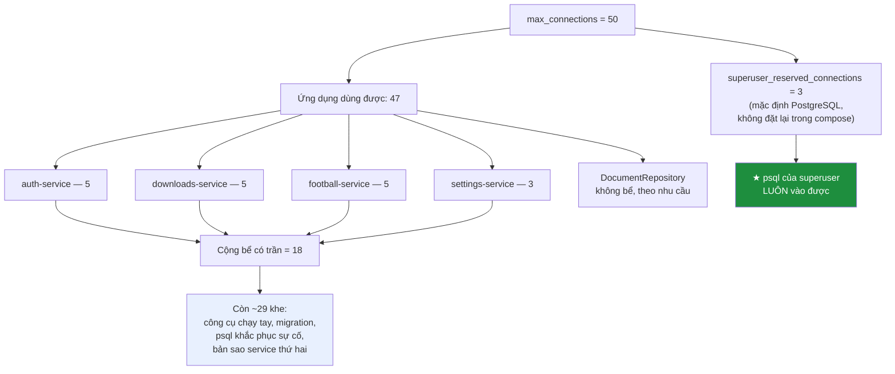

<details><summary>Xem bản chữ (ASCII)</summary>

```
max_connections = 50
  +-- superuser_reserved_connections = 3  (mặc định PG) --> psql admin LUÔN vào được
  +-- ứng dụng dùng được: 47
        auth-service       5   (Hikari,  AUTH_DB_POOL)
        downloads-service  5   (pgxpool, DOWNLOADS_DB_POOL)
        football-service   5   (pgxpool, FOOTBALL_DB_POOL)
        settings-service   3   (pgxpool, SETTINGS_DB_POOL)
        --------------------------
        cộng bể có trần   18
        DocumentRepository ?   (1 kết nối/instance, không bể)
        còn lại          ~29   migration, psql, bản sao thứ hai
```

</details>

★ **Nguyên tắc:** phải chừa chỗ cho kết nối quản trị, vì **hết kết nối là không
vào được để sửa**. Sự cố kết nối cạn có tính chất tàn nhẫn: đúng vào lúc cần vào
xem chuyện gì xảy ra thì `psql` cũng bị từ chối như mọi client khác.
`superuser_reserved_connections` (mặc định 3 của PostgreSQL, dự án không đặt
lại) tồn tại chính xác vì lý do đó. Biên 29 khe còn lại cũng đủ để chạy bản sao
thứ hai của cả bốn service (36) mà vẫn dưới 47.

### 48.4 ★ Vì sao bể NHỎ có chủ ý

```properties
# Bể kết nối NHỎ, có chủ ý.
#
# auth-service phục vụ đăng nhập và gia hạn token — thao tác ngắn, và phần đắt
# nhất của nó (BCrypt ~200 ms) tốn CPU chứ không tốn kết nối. Mười kết nối là
# thừa cho tải thật, còn mặc định của HikariCP là 10 nhân với số bản sao, và
# PostgreSQL thì mỗi kết nối tốn vài megabyte bộ nhớ phía máy chủ. Trên một
# máy 8 GB chạy cả tám service, những megabyte đó cộng lại thành vấn đề thật.
spring.datasource.hikari.maximum-pool-size=${AUTH_DB_POOL:5}
spring.datasource.hikari.minimum-idle=1
spring.datasource.hikari.connection-timeout=5000
```

1. **Điểm nghẽn không phải kết nối.** BCrypt ~200 ms là chi phí **CPU** trong
   JVM; trong 200 ms đó luồng không giữ kết nối CSDL. Thêm kết nối không làm
   đăng nhập nhanh hơn — nó chỉ làm nhiều luồng cùng chờ CPU.
2. **Mặc định Hikari nhân theo bản sao.** Mặc định 10 **cho mỗi instance**; ba
   bản sao auth-service là 30 kết nối — 60% quỹ 50 cho một service.
3. **Mỗi kết nối PostgreSQL tốn vài MB phía máy chủ.** Bộ nhớ đó nằm *ngoài*
   `shared_buffers` và phải gọn trong `mem_limit: 384m` — nối thẳng sang mục 49.

`connection-timeout=5000` khớp tinh thần với ping 5 giây của `pg.Connect`: chờ
5 giây không có kết nối thì báo lỗi, không treo vô hạn.

---

## 49. `shared_buffers`, `work_mem` và giới hạn container

| Tham số | Giá trị | Phạm vi cấp phát |
|---|---|---|
| `shared_buffers` | `128MB` | **Một lần**, dùng chung toàn máy chủ |
| `work_mem` | `2MB` | ⚠ **Mỗi phép sắp xếp / băm, của mỗi kết nối** |
| `mem_limit` (container) | `384m` | Trần cứng do Docker áp |

### 49.1 ★ Phép nhân đáng sợ của `work_mem`

Chú thích trong `docker-compose.yml` chỉ thẳng vào nó: *"PostgreSQL còn cấp phát
work_mem cho MỖI phép sắp xếp của MỖI kết nối. Bốn service nhân năm kết nối nhân
4 MB là 80 MB chỉ riêng phần đó."*

`work_mem` **không phải** ngân sách của máy chủ. Nó là hạn mức cho **một** thao
tác cần bộ nhớ làm việc — một `ORDER BY`, một `HashJoin`, một `DISTINCT`. Một
truy vấn có ba phép sắp xếp thì dùng ba lần `work_mem`:

```
bộ nhớ làm việc đỉnh ≈ work_mem × (số phép sắp xếp mỗi truy vấn) × (số kết nối hoạt động)
```

| Kịch bản | `work_mem` | Phép sắp xếp | Kết nối | Đỉnh |
|---|---|---|---|---|
| Mặc định PG | 4 MB | 2 | 18 (bể) | 144 MB |
| Mặc định PG, xấu nhất | 4 MB | 2 | 50 (trần) | **400 MB** ⚠ vượt `mem_limit` |
| ★ Cấu hình dự án | 2 MB | 2 | 50 (trần) | 200 MB |
| Cấu hình dự án, thực tế | 2 MB | 2 | 18 (bể) | 72 MB |

Dòng thứ hai là lý do tồn tại của dòng thứ ba: với `work_mem` mặc định, riêng bộ
nhớ làm việc ở kịch bản đầy kết nối đã vượt trần 384 MB — **trước khi** cộng
128 MB `shared_buffers` và vài MB mỗi kết nối ở 48.4.

Cộng thô cấu hình hiện tại: 128 MB + ~72 MB + 18 × vài MB ≈ 250–300 MB, dưới
384 MB với biên mỏng nhưng có thật. Ba tham số này **không độc lập** — chúng là
ba số hạng của cùng một phép cộng, và `max_connections=50` là hệ số nhân của số
hạng thứ hai.

### 49.2 Chú thích trong compose bị đứt một nửa

Nói thẳng: dòng `"128 MB thay vì mặc định 128 MB… mặc định thật là 128 MB"` là
một câu tự sửa giữa chừng và không kết thúc ý. Phần **có giá trị** là hai câu
sau, về phép nhân của `work_mem`. Phần đầu nên viết lại thành điều nó thực sự
muốn nói: `shared_buffers=128MB` đúng bằng mặc định của PostgreSQL 17, được ghi
tường minh **để nó là một con số có chủ, không phải một mặc định tình cờ** — vì
nó là số hạng đầu tiên của phép cộng phải khớp với `mem_limit: 384m`. Con số
`4 MB` trong chú thích cũng là `work_mem` **mặc định**, không phải giá trị đang
chạy (2 MB) — phép tính "bốn × năm × 4 MB = 80 MB" là phép tính cho trường hợp
**không** hạ `work_mem`, tức là lý do để hạ.

---

## 50. WiredTiger không tự đọc giới hạn của Docker

```yaml
  mongo:
    image: mongo:7
    command:
      # Mặc định WiredTiger lấy 50% RAM MÁY trừ 1 GB — trên máy 8 GB là 3 GB,
      # gấp tám lần giới hạn container. Nó KHÔNG tự đọc giới hạn của Docker,
      # nên container sẽ bị hệ điều hành giết ngay khi dữ liệu lớn lên.
      - --wiredTigerCacheSizeGB
      - "0.25"
    mem_limit: 384m
```

WiredTiger — bộ máy lưu trữ của MongoDB — cấp cache theo công thức mặc định
`max(50% × (RAM máy − 1 GB), 256 MB)`. Trên máy 8 GB mà dự án giả định (xem đầu
`docker-compose.yml`: *"chạy được trên một máy 8 GB"*): `max(3.5, 0.25) = 3.5 GB`.

| | Giá trị |
|---|---|
| WiredTiger tự tính | ~3–3,5 GB |
| `mem_limit` của container | **384 MB** |
| Tỉ lệ | **gần chín lần trần** |

### 50.1 ★ Giới hạn container KHÔNG tự truyền xuống tiến trình bên trong

`mem_limit: 384m` áp bằng **cgroup** — cơ chế của nhân Linux. Nó **không** thông
báo cho tiến trình bên trong. Từ trong container, `mongod` đọc thông tin bộ nhớ
và thấy **RAM của máy chủ**, không thấy trần cgroup. Nó tính 3,5 GB cache một
cách hoàn toàn hợp lý — theo thông tin nó có.

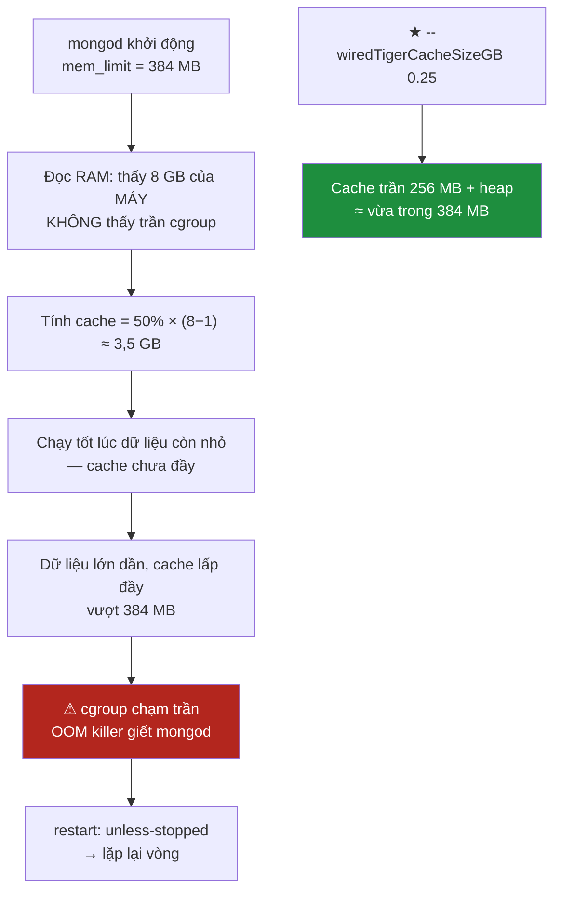

Ba tính chất làm lỗi này khó chịu hơn bình thường:

1. **Không triệu chứng lúc đầu.** Container chạy hoàn hảo cho tới khi dữ liệu đủ
   lớn để cache lấp đầy — có thể vài tuần sau khi triển khai.
2. **Không thông báo lỗi từ ứng dụng.** OOM killer gửi `SIGKILL` — `mongod`
   không kịp ghi gì. Log kết thúc giữa chừng, không stack trace, không dòng
   "shutting down". Dấu vết duy nhất là `dmesg` hoặc `docker inspect` với
   `OOMKilled: true`.
3. **`restart: unless-stopped` biến nó thành vòng lặp.** Khởi động lại, lại tính
   3,5 GB, lại bị giết. Triệu chứng nhìn thấy là "Mongo cứ restart liên tục" —
   một mô tả không hề trỏ về nguyên nhân.

Giá trị `0.25` (256 MB) chừa ~128 MB trong trần 384 MB cho phần còn lại của
`mongod`: heap kết nối, bộ đệm mạng, bộ nhớ từng thao tác. Đây cũng đúng bằng
sàn tối thiểu WiredTiger chấp nhận — mức nhỏ nhất hợp lệ, phù hợp với một CSDL
chỉ giữ lịch sử duyệt web trong 90 ngày.

### 50.2 ★ Redis là cùng một nguyên tắc, áp cho một hệ khác

| | MongoDB | Redis |
|---|---|---|
| Trần container | `mem_limit: 384m` | `mem_limit: 128m` |
| Cờ khai báo trần cho tiến trình | `--wiredTigerCacheSizeGB 0.25` (256 MB) | `--maxmemory 100mb` |
| Biên chừa cho phần còn lại | ~128 MB | ~28 MB |
| Nếu **không** đặt cờ | Tự tính theo RAM máy ⇒ OOM | `maxmemory` = 0 = **không giới hạn** ⇒ OOM |
| Khi chạm trần của chính mình | Đuổi trang cache (trong suốt, chỉ chậm hơn) | Đuổi khoá theo `allkeys-lru` (mục 44) |

Khác biệt ở dòng cuối: chạm trần **do chính mình khai báo** là hành vi được quản
lý; chạm trần **của cgroup** là bị giết.

> Mọi tiến trình có cache tự cấp phát, chạy trong container có giới hạn bộ nhớ,
> **phải được nói cho biết** giới hạn đó. Nó không tự đọc được. Không nói thì nó
> tính theo RAM của máy chủ, và sai số không hiện ra dưới dạng một dòng lỗi — nó
> hiện ra dưới dạng một tiến trình bị giết, vài tuần sau, không lời giải thích.

Cùng bài học đã xuất hiện ở đầu `docker-compose.yml` dưới hình dạng khác:

```yaml
# Khối `deploy:` chỉ có tác dụng với Docker Swarm. Với `docker compose up`
# thường — cách mọi người thật sự chạy dự án này — nó bị BỎ QUA HOÀN TOÀN, và
# không có cảnh báo nào. Một giới hạn bộ nhớ tưởng là có nhưng không có sẽ lộ
# ra dưới dạng máy hết RAM, không phải dưới dạng một dòng lỗi.
```

Hai mặt của cùng một đồng xu: ở đó là **giới hạn tưởng có mà không có**; ở đây
là **giới hạn có mà tiến trình không biết**. Cả hai lộ ra dưới dạng máy hết RAM,
và cả hai được vá bằng cách viết con số ra tường minh, ở đúng chỗ nó có tác dụng.

---

# PHẦN XIII — SƠ ĐỒ QUAN HỆ THỰC THỂ (ERD)

Ba sơ đồ dưới đây vẽ đúng những gì lược đồ thật khai báo, không vẽ những gì
người đọc *mong đợi* một hệ thống như thế này phải có. Điểm đáng nói nhất của
tầng dữ liệu VnSearch nằm ở chỗ **có rất ít quan hệ**: cả hệ thống chỉ có
**đúng một khoá ngoại**, và nó nằm gọn trong một CSDL. Mọi liên kết còn lại là
liên kết *bằng quy ước*, không phải bằng ràng buộc.

---

## 51. ERD — CSDL `vnsearch` (corpus)

Đây là CSDL duy nhất trong hệ thống có quan hệ cha–con thật sự, và cũng là CSDL
duy nhất có khoá ngoại. Lược đồ được khai báo trong
`backend/java/libs/core-search/src/main/resources/db/schema.sql`.

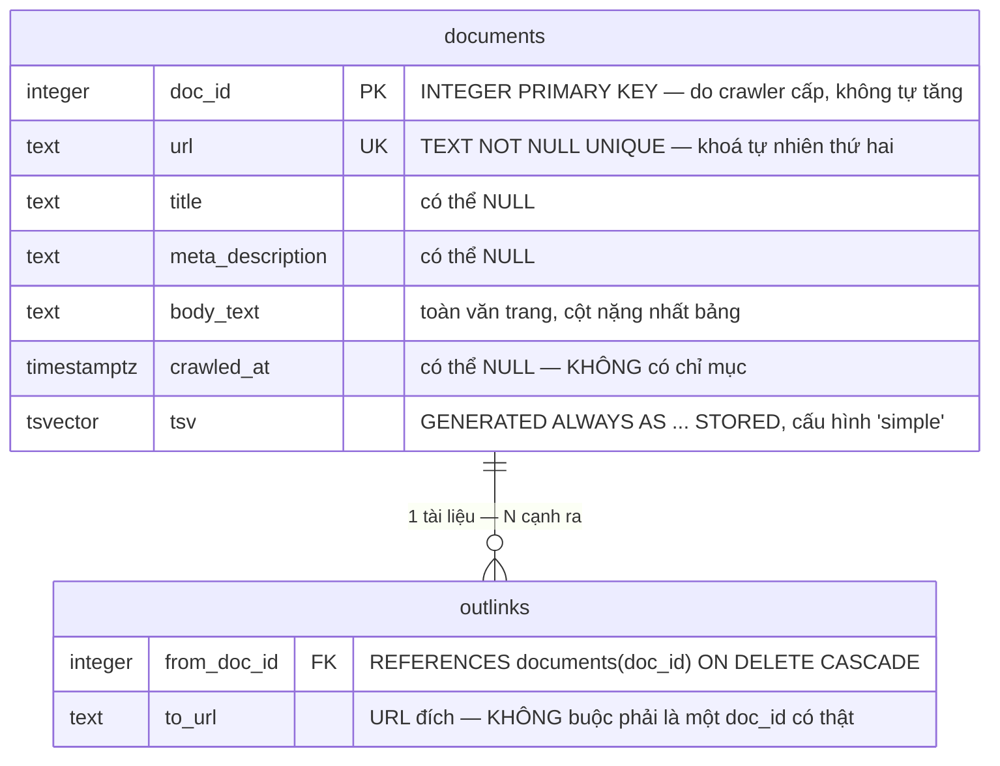

**Đọc sơ đồ này cho đúng.**

| Điều sơ đồ nói | Hệ quả |
|---|---|
| Quan hệ **1–N**: một hàng `documents`, không hoặc nhiều hàng `outlinks` | Đây là danh sách kề của đồ thị web, đầu vào của PageRank |
| `ON DELETE CASCADE` trên `from_doc_id` | `TRUNCATE TABLE documents CASCADE` trong `DocumentRepository.deleteAll()` dọn sạch cả hai bảng bằng một câu lệnh |
| `to_url` là **TEXT**, không phải khoá ngoại | Cạnh trỏ ra ngoài corpus vẫn ghi được — đúng bản chất của web, nơi phần lớn liên kết trỏ tới trang ta chưa crawl |
| `tsv` là cột **GENERATED ... STORED** | Không có đường nào ghi sai nó: PostgreSQL tự tính lại mỗi lần `title`/`meta_description`/`body_text` đổi |

⚠ **`outlinks` KHÔNG có khoá chính.** Bảng chỉ có hai chỉ mục thường
(`idx_outlinks_from`, `idx_outlinks_to`), không có `PRIMARY KEY`, không có
`UNIQUE`. Trên sơ đồ, ô `outlinks` không mang ký hiệu PK nào — đó không phải
thiếu sót của người vẽ mà là sự thật của lược đồ. Hệ quả: `insertOutlinks()`
chỉ có `INSERT` thuần, không `ON CONFLICT`, nên **nạp corpus hai lần mà không
gọi `deleteAll()` trước sẽ nhân đôi mọi cạnh** và làm lệch PageRank một cách
im lặng. Phân tích đầy đủ ở
[mục 24](#24--outlinks-không-có-khoá-chính--nạp-hai-lần-là-nhân-đôi-cạnh).

⚠ Sơ đồ cũng cho thấy `documents` mang **hai khoá cạnh nhau**: `doc_id` là
khoá chính, `url` là khoá duy nhất. Hai khoá này có thể mâu thuẫn khi cùng một
URL được cấp `doc_id` khác giữa hai phiên crawl —
[mục 25](#25--hai-khoá-đánh-nhau-primary-key-doc_id-và-unique-url).

---

## 52. ERD — ba CSDL dữ liệu cá nhân

Ba CSDL do `init-db.sh` tạo, cộng schema `football` nằm nhờ trong CSDL
`vnsearch`. Chúng được vẽ thành **bốn cụm tách rời** vì trên thực tế chúng
tách rời — không có một đường nối nào giữa các cụm, và đó là hình đúng.

```mermaid
erDiagram
    %% ===== CSDL vnsearch_auth — chủ sở hữu: vnsearch_auth =====
    auth_users {
        varchar_32  username      PK "PRIMARY KEY pk_auth_users"
        varchar_100 password_hash    "BCrypt cost 10 — 60 ký tự, để 100 cho Argon2id"
        varchar_16  role             "CHECK IN ('USER','ADMIN') — lưu TÊN enum"
        boolean     enabled          "NOT NULL DEFAULT TRUE"
        timestamptz created_at       "DEFAULT now() — có chỉ mục ix_auth_users_created_at"
        timestamptz last_login_at    "có thể NULL"
    }
    auth_audit_log {
        bigserial   id          PK "BIGSERIAL PRIMARY KEY"
        timestamptz occurred_at    "DEFAULT now()"
        varchar_64  subject        "tên tài khoản — KHÔNG phải khoá ngoại"
        varchar_64  action         "NOT NULL"
        varchar_128 resource       "có thể NULL"
        varchar_16  outcome        "NOT NULL"
        varchar_500 detail         "có thể NULL"
    }
```

```mermaid
erDiagram
    %% ===== CSDL vnsearch_downloads — chủ sở hữu: vnsearch_downloads =====
    downloads {
        uuid        id             PK "PRIMARY KEY pk_downloads — client sinh"
        varchar_32  username          "NOT NULL — KHÔNG phải khoá ngoại"
        text        source_url        "NOT NULL"
        varchar_255 file_name         "NOT NULL"
        varchar_255 mime_type         "có thể NULL"
        bigint      total_bytes       "CHECK NULL hoặc >= received_bytes"
        bigint      received_bytes    "NOT NULL DEFAULT 0, CHECK >= 0"
        varchar_16  state             "CHECK IN 5 trạng thái"
        text        local_path        "có thể NULL"
        varchar_64  device_id         "có thể NULL"
        timestamptz started_at        "NOT NULL DEFAULT now()"
        timestamptz finished_at       "CHECK: có giá trị KHI VÀ CHỈ KHI state kết thúc"
        timestamptz updated_at        "NOT NULL DEFAULT now()"
    }
    downloads_audit_log {
        bigserial   id          PK "cùng lược đồ với auth.audit_log"
        timestamptz occurred_at    "DEFAULT now()"
        varchar_64  subject        ""
        varchar_64  action         "NOT NULL"
        varchar_128 resource       ""
        varchar_16  outcome        "NOT NULL"
        varchar_500 detail         ""
    }
```

```mermaid
erDiagram
    %% ===== CSDL vnsearch_settings — chủ sở hữu: vnsearch_settings =====
    user_settings {
        varchar_32  username   PK "PRIMARY KEY pk_user_settings — một hàng một người"
        jsonb       settings      "NOT NULL DEFAULT '{}', CHECK jsonb_typeof = 'object'"
        bigint      version       "NOT NULL DEFAULT 1 — bộ đếm khoá lạc quan"
        timestamptz created_at    "NOT NULL DEFAULT now()"
        timestamptz updated_at    "NOT NULL DEFAULT now()"
    }
    settings_audit_log {
        bigserial   id          PK "cùng lược đồ, CSDL thứ ba"
        timestamptz occurred_at    "DEFAULT now()"
        varchar_64  subject        ""
        varchar_64  action         "NOT NULL"
        varchar_128 resource       ""
        varchar_16  outcome        "NOT NULL"
        varchar_500 detail         ""
    }
```

```mermaid
erDiagram
    %% ===== schema `football` bên trong CSDL vnsearch — chủ sở hữu: vnsearch =====
    football_api_cache {
        text        cache_key  PK "TEXT PRIMARY KEY"
        jsonb       payload       "NOT NULL — thân phản hồi API đã lưu"
        timestamptz fetched_at    "NOT NULL DEFAULT now()"
        timestamptz expires_at    "có thể NULL — có chỉ mục api_cache_expires_at_idx"
    }
    football_api_call_log {
        bigserial   id        PK "BIGSERIAL PRIMARY KEY"
        text        endpoint     "NOT NULL"
        text        params       "NOT NULL"
        timestamptz called_at    "NOT NULL DEFAULT now() — có chỉ mục"
    }
    football_settings {
        text        name       PK "TEXT PRIMARY KEY"
        text        value         "NOT NULL"
        timestamptz updated_at    "NOT NULL DEFAULT now()"
    }
```

★ **Giữa bốn cụm trên KHÔNG có một khoá ngoại nào — và đó không phải sơ suất.**

Người đọc quen với CSDL một khối sẽ lập tức muốn nối `downloads.username` và
`user_settings.username` về `auth_users.username`. Không nối được, vì hai lý do
xếp chồng lên nhau:

1. **PostgreSQL không hỗ trợ khoá ngoại xuyên CSDL.** `auth_users` nằm trong
   `vnsearch_auth`, `downloads` nằm trong `vnsearch_downloads`. Đó là hai CSDL
   riêng của cùng một cụm máy chủ; một câu `REFERENCES` từ cụm này sang cụm kia
   đơn giản là không biên dịch được. Đây là giới hạn kỹ thuật cứng, không phải
   lựa chọn.
2. **Việc tách thành ba CSDL mới là lựa chọn**, và nó được chọn có ý thức —
   xem chú thích dài trong `init-db.sh` và
   [mục 8](#8--vì-sao-mỗi-service-một-csdl-không-phải-một-schema). Cái giá của
   "database per service" chính là mất toàn vẹn tham chiếu xuyên service; ta
   trả cái giá đó để đổi lấy việc một lỗ hổng SQL injection ở
   downloads-service **không nhìn thấy** bảng chứa hash mật khẩu.

Nói cách khác: khoảng trống giữa các cụm trên sơ đồ chính là **ranh giới bảo
mật** của hệ thống. Bàn thêm ở [mục 30](#30-vì-sao-không-có-khoá-ngoại-tới-auth_users).

⚠ Cụm `football` là ngoại lệ: nó KHÔNG có CSDL riêng mà mượn CSDL `vnsearch`
của corpus với tài khoản `vnsearch` — xem
[mục 10](#10--hai-ngoại-lệ-csdl-vnsearch-dùng-chung-và-schema-football).

⚠ Ba bảng `audit_log` là **ba bảng khác nhau trong ba CSDL khác nhau**, dùng
chung một lược đồ chép tay. Không có bảng nhật ký trung tâm nào —
[mục 45](#45-cùng-một-lược-đồ-bốn-nơi-cố-ý).

---

## 53. ERD — MongoDB `vnsearch_history`

Ba collection trong CSDL `vnsearch_history`, khai báo trong
`backend/go/services/history/internal/history/store.go`. MongoDB không có khoá
ngoại; ở đây cũng không có tham chiếu ngầm nào giữa ba collection — chúng là
**ba tập hợp độc lập**, mỗi tập hợp phân vùng theo `username`.

```mermaid
erDiagram
    visits {
        ObjectId _id        PK "primitive.NewObjectID(), sinh phía client Go"
        string   username      "khoá phân vùng — mọi truy vấn đều lọc theo nó"
        string   url           ""
        string   title         ""
        string   host          ""
        Date     visitedAt     "TTL 90 ngày tính từ giá trị này"
        int      visitCount    "tăng dần khi ghé lại cùng URL"
        bool     incognito     ""
    }
```

```mermaid
erDiagram
    search_queries {
        ObjectId _id         PK "sinh phía client Go"
        string   username       "khoá phân vùng"
        string   query          "nguyên văn người dùng gõ"
        string   normalized     "dạng chuẩn hoá — dùng cho gợi ý và chống trùng"
        int      resultCount    ""
        Date     searchedAt     "TTL 30 ngày tính từ giá trị này"
    }
```

```mermaid
erDiagram
    audit_log_mongo {
        ObjectId _id        PK "Mongo tự sinh"
        Date     occurredAt    "time.Now().UTC() ghi từ Go"
        string   subject       ""
        string   action        ""
        string   resource      ""
        string   outcome       ""
        string   detail        ""
    }
```

**Ba chú thích phải đọc kèm sơ đồ.**

| Collection | Tự hết hạn | Chỉ mục | Ghi chú |
|---|---|---|---|
| `visits` | ✅ **90 ngày** (`ix_visits_ttl` trên `visitedAt`, `expireAfterSeconds = 90 × 86400`) | 3 chỉ mục | Lịch sử duyệt web tự biến mất, không cần cron |
| `search_queries` | ✅ **30 ngày** (`ix_queries_ttl` trên `searchedAt`, `30 × 86400`) | 3 chỉ mục | Ngắn hơn `visits` vì truy vấn tìm kiếm lộ ý định nhiều hơn URL |
| `audit_log` | ❌ **không** | ⚠ **không có chỉ mục nào** | `EnsureIndexes()` không đụng tới collection này |

★ Hai TTL index kia là **quyền được lãng quên cài bằng hạ tầng**, không phải
bằng mã ứng dụng: kể cả khi toàn bộ history-service ngừng chạy, MongoDB vẫn tự
xoá. Đó là khác biệt quan trọng so với một job dọn dẹp có thể quên bật —
[mục 38](#38--ttl-index--quyền-được-lãng-quên-cài-bằng-hạ-tầng).

⚠ Chênh lệch giữa hai dòng đầu và dòng cuối bảng là chủ đề của
[mục 41](#41--audit_log-của-mongo-không-chỉ-mục-không-ttl): nhật ký kiểm toán
vừa không tra cứu nhanh được, vừa phình vô hạn.

⚠ `visits` có `ix_visits_user_url` nhưng đó là chỉ mục **thường**, không phải
`unique`. `UpsertVisit` đọc rồi ghi trong hai lượt, nên hai request song song
có thể tạo hai bản ghi cho cùng một URL —
[mục 39](#39--visits-thiếu-chỉ-mục-duy-nhất--cửa-sổ-đua-giữa-đọc-và-ghi).

---

## 54. ★ Khoá liên kết duy nhất giữa mọi kho: chuỗi `username`

Ba sơ đồ trên cho thấy một hệ thống gần như **không có quan hệ**. Vậy cái gì
giữ nó lại với nhau? Đúng một thứ: **chuỗi ký tự `username`**, đi qua bốn hệ
quản trị mà không một lần nào được một ràng buộc nào bảo vệ.

```mermaid
flowchart TD
    JWT["JWT access token<br/>claim <b>sub</b> = tên tài khoản"]

    JWT --> A["<b>vnsearch_auth</b><br/>auth_users.username<br/>VARCHAR(32) PRIMARY KEY"]
    JWT --> D["<b>vnsearch_downloads</b><br/>downloads.username<br/>VARCHAR(32), cột thường"]
    JWT --> S["<b>vnsearch_settings</b><br/>user_settings.username<br/>VARCHAR(32) PRIMARY KEY"]
    JWT --> M1["<b>vnsearch_history</b><br/>visits.username"]
    JWT --> M2["<b>vnsearch_history</b><br/>search_queries.username"]
    JWT --> R["<b>Redis</b><br/>rt:user:&lt;username&gt;<br/>SET các băm token đang sống"]

    A -.->|"KHÔNG có FK"| D
    A -.->|"KHÔNG có FK"| S
    A -.->|"Mongo không có FK"| M1
    A -.->|"Redis không có FK"| R
```

Đường đi cụ thể, đọc từ mã:

| Chặng | Nơi giá trị xuất hiện | Bằng chứng trong mã |
|---|---|---|
| ① | `sub` của JWT | auth-service phát token theo tên tài khoản, không theo id số |
| ② | `auth_users.username` — **khoá chính** | `CONSTRAINT pk_auth_users PRIMARY KEY (username)` |
| ③ | `downloads.username` — cột thường | `Find`, `FindByUser`, `Delete` đều có `AND username = $n` |
| ④ | `user_settings.username` — **khoá chính** | `Read/Merge/Replace/DeleteAll` đều lọc `WHERE username = $1` |
| ⑤ | `visits.username`, `search_queries.username` | mọi `bson.M{"username": username}` trong `store.go` |
| ⑥ | `rt:user:<username>` trong Redis | `USER_PREFIX = "rt:user:"` trong `RedisRefreshTokenStore` |

### 54.1 Hệ quả (a) — không tốn một lượt gọi mạng nào

Chú thích trong `V1__tai_khoan.sql` nói thẳng lý do chọn phương án này: nếu
`auth_users` dùng id tự tăng làm khoá chính, thì `sub` trong JWT sẽ là một con
số, và **mọi service dữ liệu cá nhân phải hỏi auth-service để dịch id sang
tên** — một lượt gọi mạng cho mỗi request, cộng một điểm chết chung mới. Dùng
thẳng chuỗi tên làm khoá phân vùng khiến downloads-service, settings-service và
history-service **không cần biết auth-service có tồn tại hay không**: chúng đọc
`sub` từ token đã xác thực rồi truy vấn thẳng.

Đây cũng chính là điều làm ba service kia khởi động được khi auth-service đang
chết — một tính chất không hiển nhiên và không miễn phí.

### 54.2 Hệ quả (b) — không có gì cưỡng chế tính nhất quán

Không có khoá ngoại nghĩa là **không có gì ngăn dữ liệu mồ côi**. Kiểm tra
trong mã:

`UserService.delete(username)` (auth-service) làm đúng hai việc:

```
store.delete(normalized)      // xoá hàng trong auth_users
failures.remove(normalized)   // xoá bộ đếm khoá tạm
```

Nó **không** gọi tới downloads-service, **không** gọi tới settings-service,
**không** gọi tới history-service, và — theo chú thích trong `UserStore` —
"Xoá tài khoản không xoá phiên đang mở của nó", tức cũng không dọn
`rt:user:<username>` trong Redis. Không tìm thấy trong mã nguồn một luồng xoá
lan truyền (cascade ở tầng ứng dụng) nào.

⚠ **Trạng thái thật, viết trung thực:** xoá một tài khoản để lại phía sau

- các hàng `downloads` mang tên đó, còn nguyên;
- hàng `user_settings` mang tên đó, còn nguyên;
- các document `visits` và `search_queries` mang tên đó — những dữ liệu này
  *cuối cùng* sẽ tự biến mất, nhưng nhờ TTL 90/30 ngày, không nhờ thao tác xoá;
- các khoá `rt:` và `rt:user:` trong Redis — cũng chỉ tự hết hạn theo TTL của
  refresh token.

Và tệ hơn một bậc: nếu một người khác **đăng ký lại đúng tên vừa bị xoá**, họ
thừa hưởng toàn bộ số dữ liệu mồ côi đó. `UserService.delete` đã cảnh báo đúng
nửa vấn đề ("một người khác đăng ký lại đúng tên đó sẽ là một tài khoản hoàn
toàn mới"), nhưng ở tầng dữ liệu thì ngược lại: các kho kia không phân biệt
được hai người.

Muốn đúng, phải có một luồng xoá tường minh ở tầng ứng dụng — gọi lần lượt
`downloads.DeleteFinished`/xoá theo user, `settings.DeleteAll`,
`history.DeleteVisitsBetween`, và `refreshTokens.revokeAllFor`. Luồng đó
**hiện chưa có**. Đây là món nợ kỹ thuật đã biết, không phải chi tiết bị bỏ
sót lúc viết tài liệu.

### 54.3 Hệ quả (c) — hệ thống không cho đổi tên tài khoản

Nếu `username` là thứ duy nhất nối sáu kho lại, thì đổi nó nghĩa là phải sửa
đồng thời sáu chỗ nằm trong bốn hệ quản trị khác nhau, **không có giao dịch
nào bao được cả sáu**. Một lần đổi tên hỏng giữa chừng để lại người dùng có
tài khoản mang tên mới nhưng lịch sử, tải xuống và cài đặt mang tên cũ.

`V1__tai_khoan.sql` ghi thẳng đánh đổi này thành một câu:

> "Đánh đổi: VnSearch không cho đổi tên tài khoản. Ghi rõ ở đây để lần sau
> không ai phải đoán vì sao."

Xem thêm [mục 18](#18--username-làm-khoá-chính-và-cái-giá-phải-trả).

---

# PHẦN XIV — ĐỐI CHIẾU THỰC TẾ

---

## 55. Toàn bộ bảng, collection và không gian khoá

Một bảng duy nhất, đếm lại từ mã nguồn: **11 bảng PostgreSQL** (chưa kể hai
bảng sổ sách của công cụ migration), **3 collection MongoDB**, **4 tiền tố
khoá Redis**.

| Tên | Kho | CSDL / schema | Service sở hữu | Khoá chính | Bền vững? | Tự hết hạn? |
|---|---|---|---|---|---|---|
| `auth_users` | PostgreSQL | `vnsearch_auth` / `public` | auth-service | `username` | ✅ volume `postgres-data` | ❌ |
| `auth.audit_log` | PostgreSQL | `vnsearch_auth` / `auth` | auth-service | `id` BIGSERIAL | ✅ | ❌ ⚠ không retention |
| `documents` | PostgreSQL | `vnsearch` / `public` | search-service (đọc), `PostgresImportRunner` (ghi) | `doc_id` | ✅ | ❌ |
| `outlinks` | PostgreSQL | `vnsearch` / `public` | như trên | ⚠ **KHÔNG CÓ** | ✅ | ❌ |
| `downloads` | PostgreSQL | `vnsearch_downloads` / `public` | downloads-service | `id` UUID | ✅ | ❌ |
| `audit_log` (downloads) | PostgreSQL | `vnsearch_downloads` / `public` | downloads-service | `id` BIGSERIAL | ✅ | ❌ ⚠ |
| `user_settings` | PostgreSQL | `vnsearch_settings` / `public` | settings-service | `username` | ✅ | ❌ |
| `audit_log` (settings) | PostgreSQL | `vnsearch_settings` / `public` | settings-service | `id` BIGSERIAL | ✅ | ❌ ⚠ |
| `football.api_cache` | PostgreSQL | `vnsearch` / `football` | football-service | `cache_key` | ✅ | ⚠ có cột `expires_at` nhưng **không** TTL tự động |
| `football.api_call_log` | PostgreSQL | `vnsearch` / `football` | football-service | `id` BIGSERIAL | ✅ | ❌ |
| `football.settings` | PostgreSQL | `vnsearch` / `football` | football-service | `name` | ✅ | ❌ |
| `visits` | MongoDB | `vnsearch_history` | history-service | `_id` ObjectId | ✅ volume `mongo-data` | ✅ **90 ngày** |
| `search_queries` | MongoDB | `vnsearch_history` | history-service | `_id` ObjectId | ✅ | ✅ **30 ngày** |
| `audit_log` | MongoDB | `vnsearch_history` | history-service | `_id` ObjectId | ✅ | ❌ ⚠ |
| `rt:<băm>` | Redis | db 0 | auth-service | khoá chuỗi | ❌ `--save ""`, `--appendonly no` | ✅ TTL = hạn refresh token |
| `rt:used:<băm>` | Redis | db 0 | auth-service | khoá chuỗi | ❌ | ✅ TTL = **30 ngày** |
| `rt:user:<tài khoản>` | Redis | db 0 | auth-service | khoá SET | ❌ | ✅ TTL = hạn token **+ 1 ngày** |
| `at:denied:<jti>` | Redis | db 0 | auth-service | khoá chuỗi | ❌ | ✅ TTL = phần đời còn lại của access token |

**Hai bảng sổ sách không nằm trong danh sách trên** vì không phải người viết mã
tạo ra chúng, nhưng phải biết chúng tồn tại khi gỡ lỗi:

| Bảng | Ở đâu | Ai tạo |
|---|---|---|
| `flyway_schema_history` | `vnsearch_auth` | Flyway, lúc auth-service khởi động |
| `schema_migrations` | `vnsearch_downloads`, `vnsearch_settings`, `vnsearch` (schema mặc định của kết nối football) | golang-migrate, lúc từng service Go khởi động |

Đọc theo cột "Bền vững?": **toàn bộ Redis là dữ liệu dùng một lần**. Mất nó thì
mọi người phải đăng nhập lại, không mất gì vĩnh viễn —
[mục 44](#44-allkeys-lru-và-quyết-định-không-lưu-bền).

---

## 56. Toàn bộ chỉ mục và lý do tồn tại

| Tên chỉ mục | Bảng / collection | Cột / biểu thức | Loại | Truy vấn nào dùng nó |
|---|---|---|---|---|
| `pk_auth_users` | `auth_users` | `username` | unique (btree, ngầm) | Tra tài khoản lúc đăng nhập |
| `ux_auth_users_username_lower` | `auth_users` | `lower(username)` | **unique + biểu thức** | Chặn `Admin` cạnh `admin`; là đích của `ON CONFLICT (lower(username))` — [mục 19](#19--ux_auth_users_username_lower--ràng-buộc-đặt-ở-csdl-không-ở-java) |
| `ix_auth_users_created_at` | `auth_users` | `created_at` | btree | Trang quản trị sắp danh sách theo thời điểm tạo |
| `auth.audit_log` pkey | `auth.audit_log` | `id` | unique (btree, ngầm) | — |
| `ix_audit_log_subject` | `auth.audit_log` | `subject` | btree | "mọi hành vi của tài khoản X" |
| `ix_audit_log_occurred_at` | `auth.audit_log` | `occurred_at` | btree | "mọi việc xảy ra trong khoảng thời gian T" |
| `documents` pkey | `documents` | `doc_id` | unique (btree, ngầm) | `findAll()`, `ORDER BY doc_id` |
| `documents_url_key` | `documents` | `url` | **unique** | Chống trùng URL trong corpus |
| `idx_documents_tsv` | `documents` | `tsv` | **GIN** | Chỉ `GinBaselineRunner` — đối chứng, KHÔNG phục vụ tìm kiếm thật ([mục 26](#26--cột-tsv-generated--chỉ-mục-gin--hạ-tầng-cho-thí-nghiệm-đối-chứng)) |
| `idx_outlinks_from` | `outlinks` | `from_doc_id` | btree | Lấy cạnh ra của một tài liệu; `ORDER BY from_doc_id` lúc đọc lại |
| `idx_outlinks_to` | `outlinks` | `to_url` | btree | Đếm bậc vào cho PageRank, tìm liên kết chéo domain |
| `pk_downloads` | `downloads` | `id` | unique (btree, ngầm) | `Find`, `Save ... ON CONFLICT (id)` |
| `ix_downloads_user_started` | `downloads` | `(username, started_at DESC)` | btree tổ hợp | `FindByUser`: `WHERE username = $1 ORDER BY started_at DESC` — thứ tự cột khớp đúng truy vấn |
| `ix_downloads_dang_chay` | `downloads` | `(username) WHERE state IN ('IN_PROGRESS','PAUSED')` | **partial** | `FindActive` — chỉ mục nhỏ vì phần lớn bản ghi đã kết thúc ([mục 29](#29--partial-index-ix_downloads_dang_chay)) |
| `ix_audit_log_subject` | `audit_log` (downloads) | `subject` | btree | như trên |
| `ix_audit_log_occurred_at` | `audit_log` (downloads) | `occurred_at` | btree | như trên |
| `pk_user_settings` | `user_settings` | `username` | unique (btree, ngầm) | `Read`, và là đích của `ON CONFLICT (username)` |
| `ix_audit_log_subject` | `audit_log` (settings) | `subject` | btree | như trên |
| `ix_audit_log_occurred_at` | `audit_log` (settings) | `occurred_at` | btree | như trên |
| `football.api_cache` pkey | `football.api_cache` | `cache_key` | unique (btree, ngầm) | Tra cache theo khoá |
| `api_cache_expires_at_idx` | `football.api_cache` | `expires_at` | btree | Quét mục đã hết hạn để dọn |
| `football.api_call_log` pkey | `football.api_call_log` | `id` | unique (btree, ngầm) | — |
| `api_call_log_called_at_idx` | `football.api_call_log` | `called_at` | btree | `SELECT count(*) ... WHERE called_at >= $1` — đếm hạn mức ngày |
| `football.settings` pkey | `football.settings` | `name` | unique (btree, ngầm) | Tra một tham số |
| `ix_visits_user_time` | `visits` | `{username: 1, visitedAt: -1}` | tổ hợp | `ListVisits`: lọc theo user, sắp `visitedAt` giảm dần |
| `ix_visits_user_url` | `visits` | `{username: 1, url: 1}` | tổ hợp | `FindVisitByURL` |
| `ix_visits_ttl` | `visits` | `{visitedAt: 1}`, `expireAfterSeconds = 7 776 000` | **TTL** | Không truy vấn nào dùng — nó dùng để **xoá** |
| `ix_queries_user_time` | `search_queries` | `{username: 1, searchedAt: -1}` | tổ hợp | `ListQueries` |
| `ix_queries_user_prefix` | `search_queries` | `{username: 1, normalized: 1}` | tổ hợp | `FindQueryByNormalized`; ⚠ chỉ *nửa đầu* phục vụ được `SuggestQueries` |
| `ix_queries_ttl` | `search_queries` | `{searchedAt: 1}`, `expireAfterSeconds = 2 592 000` | **TTL** | Xoá sau 30 ngày |
| `_id_` | cả ba collection | `_id` | unique, Mongo tạo sẵn | — |

### 56.1 ⚠ Ba chỗ thiếu chỉ mục, đã biết

| Thiếu ở đâu | Hệ quả cụ thể | Mục phân tích |
|---|---|---|
| **`audit_log` của MongoDB: KHÔNG có chỉ mục nào** — `EnsureIndexes()` chỉ đụng `visits` và `search_queries` | Mọi truy vấn nhật ký là một lần quét toàn collection; và không có TTL nên collection này chỉ lớn lên | [41](#41--audit_log-của-mongo-không-chỉ-mục-không-ttl) |
| **`audit_log` của PostgreSQL thiếu chỉ mục tổ hợp `(subject, occurred_at DESC)`** — chỉ có hai chỉ mục một cột rời | Câu hỏi kiểm toán điển hình "mọi việc tài khoản X làm, mới nhất trước" phải quét theo `subject` rồi sắp xếp ngoài chỉ mục | [47](#47--không-có-retention-không-có-phân-mảnh) |
| **`documents` không có chỉ mục trên `crawled_at`** | Không lọc nhanh được "trang crawl trong 7 ngày qua"; hiện chưa có truy vấn nào cần, nhưng nếu thêm thì đó là quét toàn bảng trên bảng nặng nhất hệ thống | [22](#22-documents--kho-tài-liệu-thô) |

⚠ Thêm một điểm không phải "thiếu chỉ mục" mà là "chỉ mục dùng không hết":
`SuggestQueries` đặt `Options: "i"` cho regex, và một regex không phân biệt hoa
thường khiến MongoDB **không dùng được** phần `normalized` của
`ix_queries_user_prefix` — chỉ còn phần `username` lọc được, phần còn lại là
quét. Xem [mục 40](#40--suggestqueries--regex-i-vô-hiệu-hoá-nửa-sau-của-chỉ-mục).

---

## 57. Lệnh kiểm chứng lược đồ trên máy thật

Mọi lệnh dưới đây chạy được nguyên văn khi `docker compose up -d` đã lên. Mỗi
lệnh trả lời đúng một câu hỏi.

**Có bao nhiêu CSDL, và ai sở hữu cái nào?**

```bash
docker exec -it vnsearch-postgres psql -U vnsearch -d vnsearch -c '\l'
```

Kỳ vọng thấy `vnsearch` (owner `vnsearch`), `vnsearch_auth` (owner
`vnsearch_auth`), `vnsearch_downloads`, `vnsearch_settings`. Không thấy ba cái
sau nghĩa là `init-db.sh` chưa từng chạy trên volume này —
[mục 7](#7-init-dbsh--ba-csdl-ba-tài-khoản-chạy-đúng-một-lần).

**CSDL corpus có đúng hai bảng không, và chúng nặng bao nhiêu?**

```bash
docker exec -it vnsearch-postgres psql -U vnsearch -d vnsearch -c '\dt+'
```

**Cột `tsv` có thật sự là cột GENERATED không, và chỉ mục GIN có tồn tại?**

```bash
docker exec -it vnsearch-postgres psql -U vnsearch -d vnsearch -c '\d+ documents'
```

Dòng `tsv` phải hiện `generated always as (...) stored`; phần `Indexes` phải
có `idx_documents_tsv ... gin (tsv)`.

**`outlinks` có khoá chính không?** (câu trả lời đúng là *không* — dùng lệnh
này để tự thấy chứ đừng tin tài liệu)

```bash
docker exec -it vnsearch-postgres psql -U vnsearch -d vnsearch -c '\d outlinks'
```

**Liệt kê mọi chỉ mục của một CSDL:**

```bash
docker exec -it vnsearch-postgres psql -U vnsearch -d vnsearch          -c '\di+'
docker exec -it vnsearch-postgres psql -U vnsearch_auth -d vnsearch_auth -c '\di+'
```

**Bảng của ba CSDL service, kể cả schema không phải `public`:**

```bash
docker exec -it vnsearch-postgres psql -U vnsearch_auth -d vnsearch_auth \
  -c '\dt *.*'
docker exec -it vnsearch-postgres psql -U vnsearch_downloads -d vnsearch_downloads -c '\dt+'
docker exec -it vnsearch-postgres psql -U vnsearch_settings -d vnsearch_settings -c '\dt+'
docker exec -it vnsearch-postgres psql -U vnsearch -d vnsearch -c '\dt football.*'
```

**Migration nào đã chạy, lúc nào, checksum bao nhiêu?**

```bash
# Flyway — auth-service
docker exec -it vnsearch-postgres psql -U vnsearch_auth -d vnsearch_auth \
  -c 'SELECT installed_rank, version, description, checksum, success, installed_on
      FROM flyway_schema_history ORDER BY installed_rank;'

# golang-migrate — downloads / settings / football
docker exec -it vnsearch-postgres psql -U vnsearch_downloads -d vnsearch_downloads \
  -c 'SELECT * FROM schema_migrations;'
docker exec -it vnsearch-postgres psql -U vnsearch_settings -d vnsearch_settings \
  -c 'SELECT * FROM schema_migrations;'
docker exec -it vnsearch-postgres psql -U vnsearch -d vnsearch \
  -c 'SELECT * FROM schema_migrations;'
```

`schema_migrations` của golang-migrate có cột `dirty`. `dirty = true` nghĩa là
một migration chết giữa chừng và service sẽ **từ chối chạy tiếp** cho tới khi
người vận hành xử lý tay.

**Ai đang giữ kết nối, và tổng có vượt `max_connections=50` không?**

```bash
docker exec -it vnsearch-postgres psql -U vnsearch -d vnsearch \
  -c "SELECT usename, datname, count(*) FROM pg_stat_activity
      GROUP BY 1,2 ORDER BY 3 DESC;"
docker exec -it vnsearch-postgres psql -U vnsearch -d vnsearch -c 'SHOW max_connections;'
docker exec -it vnsearch-postgres psql -U vnsearch -d vnsearch -c 'SHOW shared_buffers;'
docker exec -it vnsearch-postgres psql -U vnsearch -d vnsearch -c 'SHOW work_mem;'
```

Cột `usename` là lý do thứ ba trong `init-db.sh` để tách tài khoản: nhìn vào
đây biết ngay service nào gây tải — [mục 48](#48-max_connections50-và-phép-cộng-phải-khớp).

**Chỉ mục MongoDB có đúng như `EnsureIndexes()` khai báo không?**

```bash
docker exec -it vnsearch-mongo mongosh vnsearch_history --eval 'db.visits.getIndexes()'
docker exec -it vnsearch-mongo mongosh vnsearch_history --eval 'db.search_queries.getIndexes()'
docker exec -it vnsearch-mongo mongosh vnsearch_history --eval 'db.audit_log.getIndexes()'
docker exec -it vnsearch-mongo mongosh vnsearch_history --eval 'db.getCollectionNames()'
```

Lệnh thứ ba là phép kiểm chứng cho ⚠ ở [mục 41](#41--audit_log-của-mongo-không-chỉ-mục-không-ttl):
kết quả chỉ có `_id_`, không có chỉ mục nào khác, không có TTL.

Muốn nhìn thẳng vào `expireAfterSeconds`:

```bash
docker exec -it vnsearch-mongo mongosh vnsearch_history --eval \
  'db.visits.getIndexes().filter(i => i.expireAfterSeconds !== undefined)'
```

**Redis đang giữ những khoá gì, và bao nhiêu bộ nhớ?**

```bash
docker exec -it vnsearch-redis redis-cli --scan --pattern 'rt:*'
docker exec -it vnsearch-redis redis-cli --scan --pattern 'rt:user:*'
docker exec -it vnsearch-redis redis-cli --scan --pattern 'at:denied:*'
docker exec -it vnsearch-redis redis-cli info memory   | grep -E 'used_memory_human|maxmemory'
docker exec -it vnsearch-redis redis-cli config get maxmemory-policy
```

Dùng `--scan` chứ không dùng `KEYS` — vì đúng lý do mà
`RedisRefreshTokenStore.activeSessionCount()` đã nêu: `KEYS` chặn tiến trình
đơn luồng phục vụ cả hệ thống ([mục 42](#42-bốn-không-gian-khoá)).

**Tạo lược đồ corpus bằng tay** (bước duy nhất không tự động —
[mục 14](#14--schemasql-chạy-tay--mắt-xích-yếu-nhất)):

```bash
docker compose exec -T postgres psql -U vnsearch -d vnsearch \
    < backend/java/libs/core-search/src/main/resources/db/schema.sql
```

`schema.sql` toàn `IF NOT EXISTS` nên chạy lại nhiều lần vô hại.

**Container nào đang chạm trần bộ nhớ?**

```bash
docker stats --no-stream vnsearch-postgres vnsearch-mongo vnsearch-redis
```

Cột `MEM USAGE / LIMIT` phải hiện `384MiB`, `384MiB`, `128MiB` làm trần —
[mục 49](#49-shared_buffers-work_mem-và-giới-hạn-container),
[mục 50](#50-wiredtiger-không-tự-đọc-giới-hạn-của-docker).

---

# PHẦN XV — PHỤ LỤC

---

## 58. Bảng hằng số toàn hệ thống

| Hằng số | Giá trị | Nơi đặt | Vì sao là giá trị đó |
|---|---|---|---|
| `max_connections` | `50` | `docker-compose.yml`, `command` của `postgres` | Tổng bể kết nối của mọi service phải nhỏ hơn con số này; mỗi kết nối tốn vài MB phía máy chủ |
| `shared_buffers` | `128MB` | như trên | Bằng mặc định của PostgreSQL, giữ nguyên có chủ ý vì trần container chỉ 384 MB |
| `work_mem` | `2MB` | như trên | Cấp cho **mỗi phép sắp xếp của mỗi kết nối** — 4 service × 5 kết nối × 4 MB đã là 80 MB, nên hạ xuống 2 |
| `mem_limit` postgres | `384m` | `docker-compose.yml` | Vừa đủ cho `shared_buffers` + kết nối + tiến trình nền |
| `mem_limit` mongo | `384m` | `docker-compose.yml` | Cache WiredTiger 0,25 GB cộng phần còn lại |
| `mem_limit` redis | `128m` | `docker-compose.yml` | Trần container, cao hơn `--maxmemory 100mb` để Redis còn chỗ thở |
| `--maxmemory` | `100mb` | `command` của `redis` | Trần *bên trong* Redis, để chính Redis đuổi khoá thay vì để OS giết container |
| `--maxmemory-policy` | `allkeys-lru` | `command` của `redis` | Mọi khoá đều có hạn dùng nên đuổi khoá cũ nhất là đúng; `noeviction` mặc định sẽ chặn mọi phép ghi khi đầy — tức không ai đăng nhập được |
| `--save` / `--appendonly` | `""` / `no` | `command` của `redis` | KHÔNG lưu bền, có chủ ý — [mục 44](#44-allkeys-lru-và-quyết-định-không-lưu-bền) |
| `--wiredTigerCacheSizeGB` | `0.25` | `command` của `mongo` | Mặc định là 50% RAM **máy** trừ 1 GB = 3 GB trên máy 8 GB, gấp tám lần trần container; WiredTiger không tự đọc giới hạn Docker |
| `AUTH_DB_POOL` | `5` | `application-postgres.properties` (`hikari.maximum-pool-size`) | Đăng nhập/gia hạn token là thao tác ngắn; phần đắt nhất (BCrypt ~200 ms) tốn CPU chứ không tốn kết nối |
| `DOWNLOADS_DB_POOL` | `5` | `backend/go/services/downloads/main.go` | Mặc định của `config.EnvInt32` |
| `SETTINGS_DB_POOL` | `3` | `backend/go/services/settings/main.go` | Thấp nhất: mỗi request đọc/ghi đúng một hàng theo khoá chính |
| `FOOTBALL_DB_POOL` | `5` | `backend/go/services/football/main.go` | |
| Hikari `minimum-idle` | `1` | `application-postgres.properties` | Giữ tối thiểu một kết nối ấm; không giữ cả bể rỗi để khỏi chiếm chỗ của service khác |
| Hikari `connection-timeout` | `5000` ms | `application-postgres.properties` | Thà hỏng nhanh và rõ còn hơn treo request |
| pgxpool `MinConns` | `1` | `backend/go/platform/pg/pg.go` | Đối xứng với `minimum-idle=1` của Hikari |
| pgxpool `MaxConnIdleTime` | `5 phút` | `pg.go` | Trả kết nối rỗi về máy chủ, để bể co lại lúc hệ thống nhàn |
| Ping timeout lúc kết nối | `5 giây` | `pg.Connect` — `context.WithTimeout(ctx, 5*time.Second)` | Service không khởi động được thì phải biết trong 5 giây, không phải sau timeout TCP mặc định |
| TTL `visits` | `90 × 86400` giây (90 ngày) | `store.go`, `ix_visits_ttl` | Lịch sử duyệt web tự hết hạn |
| TTL `search_queries` | `30 × 86400` giây (30 ngày) | `store.go`, `ix_queries_ttl` | Ngắn hơn `visits`: truy vấn lộ ý định nhiều hơn URL |
| `USED_MARKER_TTL` | `30 ngày` | `RedisRefreshTokenStore` | Dấu "đã dùng" phải sống **lâu hơn** chính token nó canh, nếu không phép phát hiện dùng lại mất tác dụng — [mục 43](#43--rtused-phải-sống-lâu-hơn-chính-token-nó-canh) |
| TTL của `rt:user:` | hạn token **+ 1 ngày** | `RedisRefreshTokenStore.issue` | Redis xoá khoá token nhưng không tự dọn tên nó khỏi SET, nên SET phải có hạn riêng |
| `SCAN_LIMIT` | `10 000` | `RedisRefreshTokenStore` | Trần số khoá duyệt khi đếm phiên cho bảng điều khiển; chạm trần thì con số trả về là cận dưới |
| `SCAN` count mỗi lô | `256` | `RedisRefreshTokenStore.activeSessionCount` | Kích thước lô của `ScanOptions` |
| `username` | `VARCHAR(32)` | `V1__tai_khoan.sql`, `0001_downloads.up.sql`, `0001_user_settings.up.sql` | Cùng một chiều dài ở cả ba CSDL — bắt buộc, vì cùng một chuỗi phải vừa cả ba nơi |
| `password_hash` | `VARCHAR(100)` | `V1__tai_khoan.sql` | BCrypt sinh 60 ký tự; để 100 cho khoảng thở khi đổi sang Argon2id mà không phải migration đúng lúc đang có sự cố |
| `role` | `VARCHAR(16)` + `CHECK IN ('USER','ADMIN')` | `V1__tai_khoan.sql` | Lưu **tên** enum chứ không lưu số thứ tự: chèn vai trò mới vào giữa enum Java sẽ âm thầm biến USER thành ADMIN |
| `ck_user_settings_size` | `pg_column_size(settings) <= 65536` | `0001_user_settings.up.sql` | Trần 64 KB cho một khối cài đặt — chặn client biến bảng này thành kho lưu trữ tuỳ ý |
| `BATCH_SIZE` | `500` | `DocumentRepository.java` | Gửi từng `INSERT` tốn một vòng khứ hồi mạng mỗi bản ghi; với 5.000 tài liệu và gần 400.000 liên kết thì chi phí đó chi phối toàn bộ thời gian nạp |
| Cấu hình full-text | `'simple'` | `schema.sql`, cột `tsv` | Stemmer `'english'` cắt gốc từ **sai hoàn toàn** trên tiếng Việt |
| `FOOTBALL_DAILY_BUDGET` | `95` | `docker-compose.yml` | Trần số lượt gọi API bóng đá mỗi ngày, đếm bằng `SELECT count(*) FROM football.api_call_log WHERE called_at >= $1` |
| Cổng PostgreSQL / Redis / Mongo | `5432` / `6379` / `27017` | `docker-compose.yml` | Cổng mặc định, mở ra host để gỡ lỗi bằng `psql`/`redis-cli`/`mongosh` |

---

## 59. Bảng tra nhanh bảng ↔ file ↔ nơi tạo

| Bảng / collection | File định nghĩa nó | Cơ chế tạo | File truy cập dữ liệu |
|---|---|---|---|
| `vnsearch_auth` (CSDL) | `deploy/postgres/init-db.sh` | Script `docker-entrypoint-initdb.d`, **chạy đúng một lần** | — |
| `vnsearch_downloads` (CSDL) | `deploy/postgres/init-db.sh` | như trên | — |
| `vnsearch_settings` (CSDL) | `deploy/postgres/init-db.sh` | như trên | — |
| `auth_users` | `V1__tai_khoan.sql` | **Flyway** lúc auth-service khởi động | `UserStore` / `UserService` (auth-service) |
| `auth.audit_log` | `V2__audit_log.sql` | **Flyway** | tầng ghi nhật ký của auth-service |
| `documents` | `libs/core-search/.../db/schema.sql` | ⚠ **psql chạy tay** | `DocumentRepository.java` |
| `outlinks` | cùng `schema.sql` | ⚠ **psql chạy tay** | `DocumentRepository.java` |
| cột `tsv` + `idx_documents_tsv` | cùng `schema.sql` (`ALTER TABLE ... ADD COLUMN IF NOT EXISTS`) | ⚠ **psql chạy tay** | `DocumentRepository.searchWithGin` (chỉ đối chứng) |
| `downloads` | `go/services/downloads/migrations/0001_downloads.up.sql` | **golang-migrate + `embed.FS`**, lúc service khởi động | `go/services/downloads/internal/downloads/repo.go` |
| `audit_log` (downloads) | `.../migrations/0002_audit_log.up.sql` | golang-migrate | tầng nhật ký của downloads-service |
| `user_settings` | `go/services/settings/migrations/0001_user_settings.up.sql` | golang-migrate | `go/services/settings/internal/settings/repo.go` |
| `audit_log` (settings) | `.../migrations/0002_audit_log.up.sql` | golang-migrate | tầng nhật ký của settings-service |
| `football.api_cache` | `go/services/football/migrations/0001_football_cache.up.sql` | golang-migrate | `go/services/football/internal/football/store.go` |
| `football.api_call_log` | cùng file | golang-migrate | cùng `store.go` — đếm hạn mức ngày |
| `football.settings` | cùng file | golang-migrate | cùng `store.go` |
| `visits` | không có file DDL — Mongo tạo khi ghi lần đầu | **`Store.EnsureIndexes()`** tạo chỉ mục lúc khởi động | `go/services/history/internal/history/store.go` |
| `search_queries` | như trên | `EnsureIndexes()` | cùng `store.go` |
| `audit_log` (Mongo) | như trên | ⚠ **không có bước tạo chỉ mục nào** | `Store.RecordAudit` |
| `rt:` / `rt:used:` / `rt:user:` / `at:denied:` | không có lược đồ — Redis không có DDL | tạo lúc ghi | `RedisRefreshTokenStore.java` |
| Bể kết nối, DSN, `Migrate()` chung cho ba service Go | `backend/go/platform/pg/pg.go` | — | dùng bởi `downloads/main.go`, `settings/main.go`, `football/main.go` |

Đọc cột "Cơ chế tạo" theo chiều dọc thấy ngay điều đáng lo: **ba cơ chế khác
nhau cho cùng một việc**, trong đó một cơ chế là thao tác tay không để lại dấu
vết ở đâu cả. So sánh ba cơ chế ở [mục 16](#16-bảng-so-sánh-ba-cơ-chế).

---

## 60. Câu hỏi thường gặp

**1. Vì sao mỗi service có CSDL riêng thay vì dùng chung một CSDL cho gọn?**
Ba lý do, viết sẵn trong `init-db.sh`. Một: lỗ hổng SQL injection ở
downloads-service sẽ đọc được `auth_users` — nơi chứa hash mật khẩu — nếu dùng
chung; với tài khoản riêng, kết nối đó thậm chí không *nhìn thấy* CSDL kia.
Hai: hai service dùng chung lược đồ thì không service nào đổi được lược đồ mà
không phối hợp với bên kia. Ba: `pg_stat_activity` không phân biệt được service
nào gây tải nếu mọi truy vấn mang cùng một tên tài khoản.
Xem [mục 8](#8--vì-sao-mỗi-service-một-csdl-không-phải-một-schema).

**2. Tôi sửa `init-db.sh` rồi `docker compose up -d` mà không thấy gì đổi?**
Đó là hành vi đúng, không phải lỗi. Thư mục `docker-entrypoint-initdb.d` chỉ
được image PostgreSQL chạy **lúc khởi tạo volume dữ liệu lần đầu**. Volume
`postgres-data` đã có dữ liệu thì toàn bộ thư mục đó bị bỏ qua. Muốn áp lại:
`docker compose down -v` — và lệnh đó **xoá sạch dữ liệu**. Trên một hệ đã
chạy, cách đúng là viết một câu `ALTER`/`CREATE` chạy tay hoặc một migration
mới, không phải sửa script khởi tạo.
Xem [mục 7](#7-init-dbsh--ba-csdl-ba-tài-khoản-chạy-đúng-một-lần).

**3. Nạp corpus hai lần thì hỏng cái gì?**
`documents` không sao: `insertDocuments` có `ON CONFLICT (doc_id) DO UPDATE`
nên nó idempotent. `outlinks` thì hỏng: bảng không có khoá chính, câu lệnh là
`INSERT` thuần, nên mỗi cạnh bị chèn thêm một lần nữa. Đồ thị web có số cạnh
gấp đôi mà số đỉnh giữ nguyên, và PageRank chạy trên đồ thị đó ra kết quả sai
lệch **im lặng** — không lỗi, không cảnh báo. Luôn gọi `deleteAll()`
(`TRUNCATE ... CASCADE`) trước khi nạp lại.
Xem [mục 24](#24--outlinks-không-có-khoá-chính--nạp-hai-lần-là-nhân-đôi-cạnh).

**4. Vì sao không có khoá ngoại giữa các service?**
Vì không thể: PostgreSQL không hỗ trợ khoá ngoại xuyên CSDL, và `auth_users`
với `downloads` nằm ở hai CSDL khác nhau. Nhưng việc *tách* chúng ra hai CSDL
mới là lựa chọn có ý thức, và mất toàn vẹn tham chiếu chính là cái giá đã biết
của lựa chọn đó. Ta trả giá đó để đổi lấy một ranh giới bảo mật thật.
Xem [mục 30](#30-vì-sao-không-có-khoá-ngoại-tới-auth_users) và
[mục 52](#52-erd--ba-csdl-dữ-liệu-cá-nhân).

**5. Xoá một tài khoản có xoá hết dữ liệu của người đó không?**
**Không.** `UserService.delete()` chỉ xoá hàng trong `auth_users` và bộ đếm
khoá tạm. Các hàng `downloads`, hàng `user_settings`, document `visits` /
`search_queries` và các khoá Redis mang tên đó đều ở lại. Dữ liệu Mongo cuối
cùng biến mất nhờ TTL, dữ liệu PostgreSQL thì **ở lại vĩnh viễn**. Trong mã
hiện tại không có luồng xoá lan truyền nào; đây là món nợ kỹ thuật đã biết.
Xem [mục 54](#54--khoá-liên-kết-duy-nhất-giữa-mọi-kho-chuỗi-username).

**6. Vì sao lịch sử duyệt web tự xoá mà nhật ký kiểm toán thì không?**
Hai loại dữ liệu, hai mục đích trái ngược. Lịch sử duyệt web là dữ liệu cá
nhân: giữ lâu là rủi ro, nên `visits` có TTL 90 ngày và `search_queries` có TTL
30 ngày, cưỡng chế bởi chính MongoDB. Nhật ký kiểm toán tồn tại để trả lời "ai
đã làm gì" *sau khi* sự cố xảy ra — xoá nó là xoá bằng chứng. ⚠ Nhưng "không
tự xoá" không có nghĩa là "không cần retention": ba bảng `audit_log` của
PostgreSQL và collection `audit_log` của Mongo hiện phình vô hạn, không phân
mảnh, không dọn.
Xem [mục 38](#38--ttl-index--quyền-được-lãng-quên-cài-bằng-hạ-tầng) và
[mục 47](#47--không-có-retention-không-có-phân-mảnh).

**7. Mất toàn bộ dữ liệu Redis thì sao?**
Mọi người bị đăng xuất và phải đăng nhập lại. Không mất gì vĩnh viễn — và đó
là lý do Redis được cấu hình `--save ""` cùng `--appendonly no`, tức **cố ý
không lưu bền**. Đổi lại: không tốn đĩa, không có khoảng dừng vì fork lúc chụp
snapshot. ⚠ Một hệ quả phụ ít người để ý: mất Redis cũng xoá mọi dấu
`rt:used:`, nên **phép phát hiện dùng lại refresh token mất trí nhớ** — một
token đã bị đánh cắp trước đó sẽ không còn bị phát hiện.
Xem [mục 44](#44-allkeys-lru-và-quyết-định-không-lưu-bền).

**8. Vì sao cột `tsv` dùng cấu hình `'simple'` chứ không phải `'english'`?**
Vì corpus là tiếng Việt. `'english'` kéo theo bộ stemmer tiếng Anh, và stemmer
đó cắt gốc từ **sai hoàn toàn** trên tiếng Việt — nó sẽ cắt đuôi những chuỗi
không hề có hình thái học tiếng Anh, tạo ra các token vô nghĩa. `'simple'` chỉ
tách token và hạ chữ thường, không stem, không loại stopword — đúng thứ cần cho
một đối chứng công bằng.
Xem [mục 26](#26--cột-tsv-generated--chỉ-mục-gin--hạ-tầng-cho-thí-nghiệm-đối-chứng).

**9. Chỉ mục GIN có phục vụ tìm kiếm thật không?**
Không. Nó chỉ là **đối chứng**. Toàn bộ nội dung chính của đồ án là chỉ mục đảo
tự cài, Trie gợi ý, LRU cache và PageRank nằm trong bộ nhớ — đẩy tìm kiếm sang
GIN thì phần đó trở nên vô nghĩa. `idx_documents_tsv` tồn tại để một công cụ
chạy tay có thể so sánh sòng phẳng cài đặt tự viết với cài đặt của một hệ quản
trị trưởng thành, **trên cùng một corpus**.
Xem [mục 26](#26--cột-tsv-generated--chỉ-mục-gin--hạ-tầng-cho-thí-nghiệm-đối-chứng).

**10. Đổi tên tài khoản được không?**
Không, và đó là quyết định có ghi rõ trong `V1__tai_khoan.sql`. `username` là
khoá chính của `auth_users`, là khoá chính của `user_settings`, là khoá phân
vùng của `downloads`, của `visits`, của `search_queries`, và là một phần của
tên khoá Redis. Đổi nó nghĩa là sửa sáu chỗ trong bốn hệ quản trị mà không có
giao dịch nào bao được cả sáu.
Xem [mục 18](#18--username-làm-khoá-chính-và-cái-giá-phải-trả) và
[mục 54](#54--khoá-liên-kết-duy-nhất-giữa-mọi-kho-chuỗi-username).

**11. Hai người (hai thiết bị) sửa cài đặt cùng lúc thì sao?**
`user_settings` có cột `version` và mọi câu ghi đều kèm
`WHERE $3::bigint IS NULL OR user_settings.version = $3::bigint`. Nếu client
gửi kèm version nó đọc được và version đó đã cũ, mệnh đề `WHERE` không khớp,
`RowsAffected()` bằng 0, và `write()` trả về `nil` — service dịch thành lỗi
xung đột thay vì âm thầm ghi đè. Đây là **khoá lạc quan**: không giữ khoá nào,
chỉ phát hiện xung đột lúc ghi. Nếu client **không** gửi version (`NULL`) thì
ghi luôn — "ai ghi sau thắng".
Xem [mục 32](#32--khoá-lạc-quan-cài-bằng-on-conflict--where).

**12. `Merge` và `Replace` khác nhau chỗ nào?**
Đúng một toán tử. `Merge` ghi
`settings = user_settings.settings || EXCLUDED.settings` — toán tử `||` của
JSONB hợp nhất nông, khoá trùng thì bên phải thắng, khoá cũ không nhắc tới thì
giữ nguyên. `Replace` ghi `settings = EXCLUDED.settings` — thay toàn bộ. Cả hai
dùng chung hàm `write()` và chung cơ chế khoá lạc quan.
Xem [mục 33](#33-merge-và-replace--khác-nhau-đúng-một-toán-tử-).

**13. Vì sao bể kết nối chỉ 3–5 mà không phải mặc định 10?**
Vì `max_connections=50` là ngân sách chung, và mỗi kết nối tốn vài megabyte bộ
nhớ **phía máy chủ** trên một container chỉ có trần 384 MB. Mặc định của
HikariCP là 10 nhân với số bản sao — cộng lại là vượt ngân sách. Ngoài ra tải
thật không cần: đăng nhập tốn CPU cho BCrypt chứ không tốn kết nối, còn
settings-service mỗi request chỉ đọc/ghi đúng một hàng theo khoá chính, nên bể
của nó chỉ là 3.
Xem [mục 48](#48-max_connections50-và-phép-cộng-phải-khớp).

**14. Tôi sửa một file migration cũ, giờ service không khởi động được?**
Đó chính là cổng chặn hoạt động đúng. Flyway lưu checksum của mọi file đã chạy
và `spring.flyway.validate-on-migrate=true` bắt nó kiểm tra trước khi chạy file
mới. Quy tắc bất di bất dịch: **file migration đã chạy ở đâu đó thì không bao
giờ sửa nữa** — muốn đổi thì thêm `V3`, `V4`. Với golang-migrate, cùng nguyên
tắc, thêm `0003_*.up.sql`.
Xem [mục 12](#12-flyway--auth-service) và [mục 13](#13-golang-migrate--embedfs--ba-service-go).

**15. Vì sao không để Hibernate tự sinh lược đồ bằng `ddl-auto=update`?**
Ba lý do trong `V1__tai_khoan.sql`. Nó không tạo ra lịch sử, nên không ai trả
lời được "cột này thêm lúc nào, vì việc gì" — câu hỏi đầu tiên của mọi cuộc
điều tra sự cố. Nó không lùi được, nên một lần triển khai hỏng là không có
đường quay lại. Và nó tự ý sửa lược đồ ở môi trường thật, trong khi mọi thay
đổi lược đồ phải là một tệp **đọc được, duyệt được và phê duyệt trước khi
chạy**.
Xem [mục 15](#15--vì-sao-không-dùng-ddl-autoupdate).

**16. `analytics-service` lấy số liệu từ CSDL nào?**
Không từ CSDL nào. Ranh giới "database per service" được giữ cả ở tầng HTTP:
analytics đọc qua API của các service khác chứ không mở kết nối tới kho của
chúng. Nếu nó đọc thẳng CSDL, mọi lập luận về ranh giới ở
[mục 8](#8--vì-sao-mỗi-service-một-csdl-không-phải-một-schema) sẽ mất hiệu lực
ngay lập tức.
Xem [mục 11](#11-ranh-giới-được-giữ-cả-ở-tầng-http-analytics-không-đọc-csdl).

---

## 61. Cây chẩn đoán sự cố

```
TRIỆU CHỨNG: auth-service không khởi động, log có "Validate failed:
             Migration checksum mismatch for migration version 1"
│
├─ NGUYÊN NHÂN: file V1__tai_khoan.sql (hoặc V2) đã bị sửa SAU KHI nó chạy
│  trên CSDL này. Flyway so checksum trong flyway_schema_history với file
│  hiện tại và từ chối chạy tiếp — đây là cổng chặn hoạt động ĐÚNG, không
│  phải lỗi của Flyway (mục 12).
│
├─ Xác nhận: so checksum thật
│  │  docker exec -it vnsearch-postgres psql -U vnsearch_auth -d vnsearch_auth \
│  │    -c 'SELECT version, description, checksum, success FROM flyway_schema_history;'
│  │
│  ├─ Bạn CỐ Ý sửa file cũ
│  │  → HOÀN TÁC file về nguyên trạng, rồi thêm thay đổi vào V3__*.sql mới.
│  │    KHÔNG dùng `flyway repair` để "chữa" trên môi trường thật — nó chỉ
│  │    ghi đè checksum, không sửa lược đồ đã lệch (mục 12).
│  │
│  └─ Đây là CSDL thử nghiệm, dữ liệu bỏ được
│     → docker compose down -v && docker compose up -d
│       ⚠ lệnh này xoá SẠCH mọi CSDL, kể cả corpus (mục 7).
│
└─ BIẾN THỂ Ở SERVICE GO: golang-migrate không báo checksum mà báo
   "Dirty database version N. Fix and force version."
   → SELECT * FROM schema_migrations;  cột `dirty` = true nghĩa là một
     migration chết GIỮA CHỪNG. Phải xem lược đồ thật đang ở đâu, sửa tay,
     rồi đặt lại version. Đừng xoá bảng schema_migrations (mục 13).

TRIỆU CHỨNG: service báo "FATAL: password authentication failed for user
             vnsearch_downloads" (hoặc _auth / _settings)
│
├─ Kiểm tra ba CSDL có tồn tại không
│  │  docker exec -it vnsearch-postgres psql -U vnsearch -d vnsearch -c '\l'
│  │
│  ├─ KHÔNG THẤY vnsearch_auth / _downloads / _settings
│  │  → init-db.sh CHƯA BAO GIỜ CHẠY trên volume này. Nhớ: nó chỉ chạy lúc
│  │    KHỞI TẠO volume lần đầu. Sửa file rồi `up -d` không có tác dụng.
│  │    Cách áp lại: docker compose down -v (mục 7).
│  │
│  └─ CÓ ĐỦ ba CSDL → mật khẩu lệch, xem tiếp
│     │
│     ├─ Bạn đặt AUTH_DB_PASSWORD (hoặc DOWNLOADS_/SETTINGS_) SAU khi volume
│     │  đã tạo
│     │  → Tài khoản trong CSDL vẫn mang mật khẩu CŨ. init-db.sh không chạy
│     │    lại để cập nhật. Sửa bằng ALTER USER ... WITH PASSWORD '...' chạy
│     │    tay bằng superuser, hoặc down -v.
│     │
│     └─ Mật khẩu có ký tự `@` hoặc `:` và bị ghép vào URL
│        → Với ba service Go, pg.DSN() đã dùng url.UserPassword nên an toàn.
│          Với football-service, đó chính là lý do compose truyền TỪNG PHẦN
│          (FOOTBALL_DB_HOST/PORT/USER/PASSWORD/NAME) chứ không truyền URL
│          ghép sẵn — một dấu `@` cắt URL sai chỗ và lỗi hiện ra đúng là
│          "password authentication failed", trỏ người đọc đi sai hướng.

TRIỆU CHỨNG: ERROR: relation "documents" does not exist
│
├─ Đây gần như luôn là mắt xích yếu nhất của hệ thống (mục 14): schema.sql
│  KHÔNG có cơ chế nào tự chạy. Không Flyway, không golang-migrate, không
│  entrypoint. Nó là một tệp phải chạy TAY.
│
├─ Chạy nó:
│  │  docker compose exec -T postgres psql -U vnsearch -d vnsearch \
│  │      < backend/java/libs/core-search/src/main/resources/db/schema.sql
│  │  (toàn IF NOT EXISTS — chạy lại nhiều lần vô hại)
│  │
│  └─ Xác nhận: \dt+ phải thấy documents và outlinks; \d+ documents phải
│     thấy cột tsv "generated always as ... stored" và idx_documents_tsv.
│
└─ Nếu bảng CÓ nhưng vẫn báo lỗi: kiểm tra bạn đang nối vào ĐÚNG CSDL. Corpus
   nằm ở `vnsearch`, KHÔNG nằm ở vnsearch_auth/_downloads/_settings (mục 10).

TRIỆU CHỨNG: PageRank ra kết quả lạ sau khi nạp lại corpus — vài trang vọt
             lên đầu không rõ lý do
│
├─ NGHI NGỜ ĐẦU TIÊN: outlinks bị nhân đôi (mục 24). Bảng không có khoá
│  chính, insertOutlinks là INSERT thuần, nên nạp lần hai mà không TRUNCATE
│  trước sẽ nhân đôi MỌI cạnh.
│
├─ Xác nhận bằng số:
│  │  SELECT count(*) FROM outlinks;
│  │  SELECT count(*) FROM (SELECT DISTINCT from_doc_id, to_url FROM outlinks) t;
│  │
│  ├─ HAI CON SỐ KHÁC NHAU → đúng là nhân đôi (hoặc nhân ba).
│  │  → Chạy lại từ đầu: DocumentRepository.deleteAll() (TRUNCATE documents
│  │    CASCADE) rồi saveAll(). CASCADE dọn outlinks nhờ khoá ngoại
│  │    ON DELETE CASCADE — đây là chỗ khoá ngoại DUY NHẤT của hệ thống làm
│  │    việc có ích (mục 51).
│  │
│  └─ HAI CON SỐ BẰNG NHAU → không phải lỗi này. Kiểm tra tiếp số tài liệu:
│     SELECT count(*) FROM documents; so với số bản ghi trong corpus JSON.
│     Lệch xuống nghĩa là trùng doc_id trong nguồn và ON CONFLICT đã âm thầm
│     ghi đè (mục 25).

TRIỆU CHỨNG: container vnsearch-postgres hoặc vnsearch-mongo bị OOM killed
             (docker ps thấy Exited (137))
│
├─ postgres — trần 384 MB
│  │
│  ├─ Kiểm tra số kết nối thật:
│  │     SELECT usename, count(*) FROM pg_stat_activity GROUP BY 1 ORDER BY 2 DESC;
│  │  → Tổng bể kết nối phải khớp phép cộng: auth 5 + downloads 5 +
│  │    settings 3 + football 5, cộng vài kết nối gỡ lỗi, phải dưới
│  │    max_connections=50 (mục 48).
│  │
│  ├─ Kiểm tra work_mem: SHOW work_mem;  phải là 2MB.
│  │  → Nó được cấp cho MỖI PHÉP SẮP XẾP của MỖI KẾT NỐI. Nâng nó lên 16MB
│  │    "cho nhanh" là cách chắc chắn nhất để giết container này (mục 49).
│  │
│  └─ Có ai chạy PostgresImportRunner song song không? Nạp corpus là giao
│     dịch lớn nhất hệ thống chạm tới.
│
└─ mongo — trần 384 MB
   │
   ├─ Kiểm tra tham số cache đã được truyền chưa:
   │     docker inspect vnsearch-mongo | grep -A3 wiredTiger
   │  → PHẢI thấy --wiredTigerCacheSizeGB 0.25.
   │
   └─ Nếu THIẾU tham số đó: WiredTiger mặc định lấy 50% RAM MÁY trừ 1 GB —
      trên máy 8 GB là 3 GB, GẤP TÁM LẦN trần container. Nó KHÔNG tự đọc
      giới hạn của Docker, nên OS sẽ giết container ngay khi dữ liệu lớn lên.
      Đây là lỗi cấu hình, không phải lỗi Mongo (mục 50).

TRIỆU CHỨNG: không ai đăng nhập được, kể cả tài khoản chắc chắn đúng mật khẩu
│
├─ ① auth-service có sống không?  docker ps | grep vnsearch-auth
│  └─ Đã chết → quay lên nhánh "checksum mismatch" và "password
│     authentication failed" ở trên.
│
├─ ② Redis có đầy không?
│  │  docker exec -it vnsearch-redis redis-cli info memory | grep used_memory_human
│  │  docker exec -it vnsearch-redis redis-cli config get maxmemory-policy
│  │
│  ├─ maxmemory-policy KHÔNG phải allkeys-lru (ví dụ noeviction)
│  │  → ĐÂY LÀ NGUYÊN NHÂN. noeviction khiến Redis TỪ CHỐI MỌI PHÉP GHI khi
│  │    đầy, và phát refresh token là một phép ghi — nên không ai đăng nhập
│  │    được. Đó chính xác là lý do compose đặt allkeys-lru (mục 44).
│  │
│  └─ Chính sách đúng, bộ nhớ chưa đầy → đi tiếp.
│
├─ ③ Có phải chỉ MỘT tài khoản không đăng nhập được?
│  → Kiểm tra rt:used: — nếu refresh token của người đó bị dùng lại, toàn bộ
│    chuỗi phiên của họ đã bị huỷ CÓ CHỦ Ý (reuse detection). Log auth-service
│    có dòng WARN "Refresh token bị DÙNG LẠI". Người dùng chỉ cần đăng nhập
│    lại bằng mật khẩu (mục 43).
│
└─ ④ Đăng nhập được nhưng lần gia hạn token nào cũng hỏng
   → Nghi ngờ Redis vừa bị khởi động lại: --save "" và --appendonly no nghĩa
     là mọi khoá rt: biến mất. Hành vi đúng là mọi người đăng nhập lại một
     lần rồi mọi thứ bình thường. Nếu lỗi lặp lại liên tục, kiểm tra
     container redis có đang bị restart vòng lặp không (mục 44).
```

---

## 62. Thuật ngữ

| Thuật ngữ | Nghĩa trong tài liệu này |
|---|---|
| **Database per service** | Mỗi microservice sở hữu một CSDL riêng với một tài khoản riêng; không service nào đọc thẳng kho của service khác. Ở VnSearch: `vnsearch_auth`, `vnsearch_downloads`, `vnsearch_settings`. |
| **Migration** | Một tệp SQL đánh số, mô tả một bước thay đổi lược đồ, được một công cụ chạy theo thứ tự và ghi lại là đã chạy. Ở đây: Flyway (`V1__`, `V2__`) và golang-migrate (`0001_`, `0002_`). |
| **Checksum của migration** | Mã băm nội dung tệp migration, lưu trong `flyway_schema_history`. Sửa một tệp đã chạy làm checksum lệch và Flyway từ chối khởi động — cổng chặn phát hiện lược đồ trôi giữa các môi trường. |
| **Idempotent** | Chạy nhiều lần cho kết quả như chạy một lần. `insertDocuments` idempotent nhờ `ON CONFLICT`; `insertOutlinks` **không**. |
| **Upsert** | `INSERT ... ON CONFLICT (khoá) DO UPDATE` — chèn nếu chưa có, cập nhật nếu đã có. Dùng ở `documents`, `downloads`, `user_settings`, `football.api_cache`. |
| **Khoá lạc quan** (optimistic locking) | Không giữ khoá nào; mang theo một số phiên bản và chỉ ghi nếu phiên bản trong CSDL vẫn đúng như lúc đọc. Cột `user_settings.version` cộng mệnh đề `WHERE ... version = $3`. |
| **Khoá bi quan** (pessimistic locking) | Giữ khoá trên hàng (`SELECT ... FOR UPDATE`) suốt thời gian sửa, chặn người khác. VnSearch **không dùng** cách này ở bất kỳ đâu. |
| **Partial index** | Chỉ mục chỉ phủ những hàng thoả một mệnh đề `WHERE`, nên nhỏ hơn nhiều chỉ mục đầy đủ. `ix_downloads_dang_chay` chỉ phủ hàng đang `IN_PROGRESS`/`PAUSED`. |
| **Chỉ mục biểu thức** | Chỉ mục dựng trên kết quả một biểu thức chứ không trên cột thô. `ux_auth_users_username_lower` dựng trên `lower(username)`; muốn dùng nó thì truy vấn phải viết đúng biểu thức đó. |
| **TTL index** | Chỉ mục MongoDB có `expireAfterSeconds`; máy chủ tự xoá document khi trường ngày trong đó cũ hơn ngưỡng. `ix_visits_ttl` (90 ngày), `ix_queries_ttl` (30 ngày). |
| **GIN index** | Generalized Inverted Index — chỉ mục đảo có sẵn của PostgreSQL, dùng cho `tsvector`, mảng, JSONB. Ở đây phục vụ **đối chứng**, không phục vụ tìm kiếm thật. |
| **tsvector** | Kiểu dữ liệu PostgreSQL chứa danh sách token đã chuẩn hoá cùng vị trí — dạng đã tiền xử lý của một văn bản, sẵn sàng cho tìm kiếm toàn văn. |
| **Cột GENERATED STORED** | Cột mà PostgreSQL tự tính từ các cột khác và lưu xuống đĩa; không có đường nào ghi tay vào nó, nên nó không bao giờ lệch với nguồn. Cột `documents.tsv`. |
| **JSONB** | Kiểu JSON nhị phân của PostgreSQL: phân tích sẵn, đánh chỉ mục được, so sánh khoá được — khác `json` thuần chỉ lưu văn bản. Cột `user_settings.settings`, `football.api_cache.payload`. |
| **Toán tử `\|\|` của JSONB** | Hợp nhất **nông** hai đối tượng: khoá trùng thì bên phải thắng, khoá chỉ có ở một bên thì giữ. Là toàn bộ khác biệt giữa `Merge` và `Replace`. |
| **Toán tử `-` của JSONB** | Xoá một khoá khỏi đối tượng: `settings - $2`. Là cách `DeleteKey` bỏ đúng một mục cài đặt mà không đọc-sửa-ghi cả khối. |
| **Refresh token rotation** | Mỗi lần đổi refresh token lấy access token mới thì token cũ bị huỷ và một token mới được phát. Cửa sổ hữu dụng của một token bị đánh cắp thu về tối thiểu. |
| **Reuse detection** | Phát hiện một refresh token đã dùng bị dùng lại lần nữa — bằng dấu `rt:used:<băm>`. Dấu hiệu chắc chắn có bản sao, nên toàn bộ chuỗi phiên bị huỷ. |
| **Denylist** | Danh sách access token bị thu hồi trước hạn (`at:denied:<jti>`), TTL đúng bằng phần đời còn lại của token — danh sách tự dọn, không bao giờ lớn hơn số token phát ra trong một cửa sổ ngắn. |
| **`allkeys-lru`** | Chính sách đuổi khoá của Redis khi chạm `maxmemory`: bỏ khoá ít dùng gần đây nhất, **mọi khoá** đều là ứng viên. Đối lập với `noeviction` (mặc định) — từ chối mọi phép ghi khi đầy. |
| **WiredTiger cache** | Bộ nhớ đệm của công cụ lưu trữ MongoDB. Mặc định 50% RAM **máy** trừ 1 GB; nó **không** đọc giới hạn cgroup của Docker, nên phải đặt tay bằng `--wiredTigerCacheSizeGB`. |
| **Bể kết nối** (connection pool) | Tập kết nối CSDL mở sẵn và tái sử dụng, tránh chi phí bắt tay mỗi request. HikariCP ở Java, `pgxpool` ở Go. Trần bể của mọi service cộng lại phải nhỏ hơn `max_connections`. |
| **`work_mem`** | Bộ nhớ PostgreSQL cấp cho **mỗi phép sắp xếp / băm của mỗi kết nối** — không phải cho toàn máy chủ. Đây là lý do nó chỉ được đặt 2 MB trên container 384 MB. |
| **Khoá ngoại** (foreign key) | Ràng buộc buộc giá trị một cột phải tồn tại ở bảng khác. Cả hệ thống có **đúng một** khoá ngoại: `outlinks.from_doc_id → documents.doc_id`. |
| **`ON DELETE CASCADE`** | Xoá hàng cha thì hàng con bị xoá theo. Nhờ nó, `TRUNCATE TABLE documents CASCADE` dọn sạch cả `outlinks` bằng một câu lệnh. |
| **Audit log** | Nhật ký "ai đã làm gì, lúc nào, kết quả ra sao" — phục vụ điều tra sau sự cố, nên **không** tự xoá như dữ liệu cá nhân. Có bốn bản: ba trong PostgreSQL, một trong MongoDB. |

---

## 63. Toàn cảnh một trang

Bản rút gọn của toàn bộ tài liệu — đọc trong hai phút để ôn lại.

Bốn hệ quản trị, bốn vai trò không thay thế cho nhau được:

```
PostgreSQL 17   dữ liệu có ràng buộc, có giao dịch, phải đúng
                → corpus, tài khoản, tải xuống, cài đặt, cache bóng đá
MongoDB 7       dữ liệu cá nhân dạng chuỗi sự kiện, PHẢI TỰ HẾT HẠN
                → lịch sử duyệt web, truy vấn tìm kiếm, nhật ký của history
Redis 7         trạng thái phiên, dùng một lần, MẤT ĐƯỢC
                → refresh token, dấu đã-dùng, denylist access token
Tệp trên đĩa    corpus JSON và chỉ mục đã dựng (xem STORAGE-PIPELINE.md)
```

Lược đồ ra đời lúc nào — ba cơ chế, một mắt xích tay:

```
docker compose up -d
├─ [1 LẦN DUY NHẤT, lúc TẠO volume postgres-data]
│  docker-entrypoint-initdb.d/10-init-db.sh
│  ├─ CREATE USER vnsearch_auth      + CREATE DATABASE vnsearch_auth
│  ├─ CREATE USER vnsearch_downloads + CREATE DATABASE vnsearch_downloads
│  ├─ CREATE USER vnsearch_settings  + CREATE DATABASE vnsearch_settings
│  └─ ∀ csdl: REVOKE ALL ON SCHEMA public FROM PUBLIC ; GRANT ALL TO <owner>
│     ↳ ⚠ sửa tệp này rồi `up -d` KHÔNG có tác dụng — volume đã có dữ liệu thì
│       thư mục initdb.d bị bỏ qua hoàn toàn. Phải `down -v`.
│
├─ [MỖI LẦN auth-service khởi động]  Flyway, profile `postgres`
│  ├─ validate-on-migrate=true  → so checksum mọi tệp đã chạy
│  ├─ baseline-on-migrate=true  → chấp nhận schema trống lúc triển khai đầu
│  ├─ V1__tai_khoan.sql   CREATE SCHEMA auth ; CREATE TABLE auth_users
│  └─ V2__audit_log.sql   CREATE TABLE auth.audit_log
│     ↳ ⚠ V1 tạo `auth_users` KHÔNG tiền tố schema, V2 thì CÓ (mục 21)
│
├─ [MỖI LẦN service Go khởi động]  golang-migrate + embed.FS, qua pg.Migrate()
│  ├─ downloads  0001_downloads.up.sql , 0002_audit_log.up.sql
│  ├─ settings   0001_user_settings.up.sql , 0002_audit_log.up.sql
│  └─ football   0001_football_cache.up.sql   (CREATE SCHEMA football + 3 bảng)
│     ↳ tệp SQL nhúng thẳng vào binary — không có bước "nhớ copy file lên máy chủ"
│
├─ [MỖI LẦN history-service khởi động]  Store.EnsureIndexes()
│  ├─ visits          3 chỉ mục, trong đó ix_visits_ttl  = 90 ngày
│  ├─ search_queries  3 chỉ mục, trong đó ix_queries_ttl = 30 ngày
│  └─ audit_log       ⚠ KHÔNG chỉ mục nào, KHÔNG TTL
│
└─ [KHÔNG BAO GIỜ TỰ CHẠY]  ⚠ MẮT XÍCH YẾU NHẤT
   libs/core-search/src/main/resources/db/schema.sql
   → phải chạy TAY:
     docker compose exec -T postgres psql -U vnsearch -d vnsearch < schema.sql
   → quên bước này: ERROR relation "documents" does not exist
```

Bốn CSDL PostgreSQL, và bảng của từng cái:

```
vnsearch              (owner vnsearch)              ⚠ DÙNG CHUNG cho 2 mục đích
├─ public.documents   doc_id PK, url UK, tsv GENERATED STORED ('simple')
│                     + idx_documents_tsv  GIN  ← chỉ để ĐỐI CHỨNG
├─ public.outlinks    from_doc_id FK → documents ON DELETE CASCADE, to_url
│                     ⚠ KHÔNG CÓ KHOÁ CHÍNH → nạp 2 lần = nhân đôi cạnh
└─ football.*         api_cache (cache_key PK) , api_call_log , settings
                      ⚠ cache nằm trong PostgreSQL dù Redis đã chạy sẵn (mục 36)

vnsearch_auth         (owner vnsearch_auth)          CSDL NHẠY CẢM NHẤT
├─ public.auth_users  username VARCHAR(32) PK , password_hash VARCHAR(100)
│                     + ux_auth_users_username_lower  UNIQUE trên lower(username)
│                     + ix_auth_users_created_at
└─ auth.audit_log     id BIGSERIAL PK , subject , action , outcome , detail

vnsearch_downloads    (owner vnsearch_downloads)
├─ downloads          id UUID PK , username , 5 ràng buộc CHECK (máy trạng thái)
│                     + ix_downloads_user_started  (username, started_at DESC)
│                     + ix_downloads_dang_chay     PARTIAL WHERE state đang chạy
└─ audit_log          cùng lược đồ, bảng KHÁC

vnsearch_settings     (owner vnsearch_settings)
├─ user_settings      username PK , settings JSONB , version BIGINT
│                     CHECK pg_column_size <= 65536 , CHECK jsonb_typeof='object'
└─ audit_log          cùng lược đồ, bảng KHÁC nữa

   ↳ GIỮA BỐN KHỐI TRÊN: KHÔNG MỘT KHOÁ NGOẠI NÀO.
     PostgreSQL không hỗ trợ FK xuyên CSDL — và đó là cái giá CỐ Ý của
     "database per service", đổi lấy một ranh giới bảo mật thật.
```

Ba collection MongoDB (`vnsearch_history`):

```
visits          username + url + visitedAt + visitCount
                ix_visits_user_time  {username:1, visitedAt:-1}
                ix_visits_user_url   {username:1, url:1}      ⚠ KHÔNG unique
                ix_visits_ttl        90 NGÀY  ← quyền được lãng quên, cài ở hạ tầng
search_queries  username + query + normalized + searchedAt
                ix_queries_user_time   {username:1, searchedAt:-1}
                ix_queries_user_prefix {username:1, normalized:1}
                                       ⚠ regex "i" của SuggestQueries vô hiệu
                                         hoá NỬA SAU của chỉ mục này
                ix_queries_ttl         30 NGÀY  ← ngắn hơn visits, có chủ ý
audit_log       occurredAt + subject + action + outcome + detail
                ⚠ KHÔNG chỉ mục, KHÔNG TTL, phình vô hạn
```

Bốn không gian khoá Redis (không lưu bền, `allkeys-lru`, `maxmemory 100mb`):

```
rt:<băm SHA-256>        → "<tài khoản>|<chuỗi>"   TTL = hạn refresh token
                          ↳ lưu BĂM chứ không lưu token: bản sao lưu lọt ra
                            ngoài cũng vô dụng
rt:used:<băm>           → "1"                     TTL = 30 NGÀY
                          ↳ PHẢI sống LÂU HƠN token nó canh, nếu không phép
                            phát hiện dùng lại mất tác dụng
                          ↳ đặt bằng setIfAbsent (NGUYÊN TỬ) TRƯỚC khi trả về
rt:user:<tài khoản>     → SET các băm đang sống   TTL = hạn token + 1 ngày
                          ↳ dùng cho revokeAllFor; đếm phiên bằng SCAN, KHÔNG
                            dùng KEYS (KEYS chặn tiến trình đơn luồng)
at:denied:<jti>         → "1"      TTL = phần đời CÒN LẠI của access token
                          ↳ danh sách tự dọn, không bao giờ lớn hơn số token
                            phát ra trong 15 phút gần nhất
```

Bốn nguyên tắc chạy suốt tầng dữ liệu:

```
1. Ràng buộc đặt ở CSDL, KHÔNG ở tầng ứng dụng
   → lower(username) UNIQUE, CHECK máy trạng thái của downloads, CHECK
     jsonb_typeof, cột tsv GENERATED. Lý do: mã ứng dụng chỉ canh được
     đường đi qua đúng đoạn mã đó — một INSERT chạy tay lúc khắc phục sự
     cố vẫn tạo ra `Admin` cạnh `admin`.

2. Mỗi service MỘT CSDL, MỘT tài khoản
   → SQL injection ở downloads không NHÌN THẤY hash mật khẩu; hai service
     không kẹt nhau khi đổi lược đồ; pg_stat_activity chỉ đích danh service
     gây tải. Cái giá: không có khoá ngoại xuyên service, và không có gì
     cưỡng chế nhất quán ngoài chuỗi `username`.

3. Mọi thay đổi lược đồ phải là một TỆP duyệt được TRƯỚC khi chạy
   → Flyway và golang-migrate, không ddl-auto=update. Tệp đã chạy thì KHÔNG
     BAO GIỜ sửa — checksum là cổng chặn. ⚠ Ngoại lệ duy nhất, và cũng là
     điểm yếu duy nhất: schema.sql chạy tay.

4. Dữ liệu cá nhân phải TỰ HẾT HẠN
   → TTL index của Mongo và TTL của Redis làm việc đó ở tầng hạ tầng, không
     phụ thuộc một cron job có thể quên bật. ⚠ Chỗ chưa làm được: bốn bảng
     audit_log không có retention nào.
```

---

## Kết

Bốn hệ quản trị, mười một bảng PostgreSQL, ba collection MongoDB và bốn không
gian khoá Redis — nhưng chỉ **một khoá ngoại** trong toàn hệ thống. Con số đó
không phải dấu hiệu của một lược đồ làm ẩu: nó là hệ quả trực tiếp và đo đếm
được của quyết định tách "database per service", và mọi đặc điểm quan sát được
dưới đây đều truy nguyên về một khối mã cụ thể:

| Đặc điểm quan sát được | Khối chịu trách nhiệm | Mục |
|---|---|---|
| Một lỗ hổng SQL injection ở downloads không đọc được hash mật khẩu | ba CSDL, ba tài khoản riêng | [7](#7-init-dbsh--ba-csdl-ba-tài-khoản-chạy-đúng-một-lần), [8](#8--vì-sao-mỗi-service-một-csdl-không-phải-một-schema) |
| Tài khoản của service này không tạo được bảng trong CSDL của service kia | `REVOKE ALL ON SCHEMA public FROM PUBLIC` | [9](#9--revoke-all-on-schema-public-from-public) |
| Sửa `init-db.sh` rồi `up -d` mà không có gì đổi | cơ chế `docker-entrypoint-initdb.d` chỉ chạy lúc tạo volume | [7](#7-init-dbsh--ba-csdl-ba-tài-khoản-chạy-đúng-một-lần) |
| Không tạo được `Admin` bên cạnh `admin`, kể cả bằng `INSERT` chạy tay | `ux_auth_users_username_lower` — chỉ mục biểu thức UNIQUE | [19](#19--ux_auth_users_username_lower--ràng-buộc-đặt-ở-csdl-không-ở-java), [20](#20-on-conflict-lowerusername--mục-tiêu-xung-đột-là-một-chỉ-mục-biểu-thức) |
| Một bản ghi tải xuống không bao giờ ở trạng thái "đã xong mà chưa có thời điểm kết thúc" | `ck_downloads_finished` — máy trạng thái viết bằng `CHECK` | [28](#28--ràng-buộc-check-viết-bằng-máy-trạng-thái) |
| Danh sách tải đang chạy trả về nhanh dù bảng đầy bản ghi đã kết thúc | `ix_downloads_dang_chay` — partial index | [29](#29--partial-index-ix_downloads_dang_chay) |
| Hai thiết bị sửa cài đặt cùng lúc, một bên nhận lỗi xung đột thay vì bị ghi đè | cột `version` + `ON CONFLICT ... WHERE` | [32](#32--khoá-lạc-quan-cài-bằng-on-conflict--where) |
| Lịch sử duyệt web biến mất sau 90 ngày mà không cần một cron job nào | TTL index của MongoDB | [38](#38--ttl-index--quyền-được-lãng-quên-cài-bằng-hạ-tầng), [53](#53-erd--mongodb-vnsearch_history) |
| Một refresh token bị sao chép làm huỷ toàn bộ phiên của tài khoản đó | `rt:used:` + `setIfAbsent` nguyên tử | [43](#43--rtused-phải-sống-lâu-hơn-chính-token-nó-canh) |
| Redis đầy mà người dùng vẫn đăng nhập được | `--maxmemory-policy allkeys-lru` thay cho `noeviction` mặc định | [44](#44-allkeys-lru-và-quyết-định-không-lưu-bền) |
| Nạp lại corpus hai lần không nhân đôi tài liệu nhưng NHÂN ĐÔI cạnh đồ thị | `outlinks` không có khoá chính, `INSERT` thuần | [24](#24--outlinks-không-có-khoá-chính--nạp-hai-lần-là-nhân-đôi-cạnh), [51](#51-erd--csdl-vnsearch-corpus) |
| Xoá một tài khoản mà tải xuống, cài đặt và lịch sử của người đó vẫn còn | không có khoá ngoại xuyên CSDL, và không có luồng xoá lan truyền | [30](#30-vì-sao-không-có-khoá-ngoại-tới-auth_users), [54](#54--khoá-liên-kết-duy-nhất-giữa-mọi-kho-chuỗi-username) |
| Ba service dữ liệu cá nhân vẫn phục vụ được khi auth-service đang chết | `sub` của JWT là chính chuỗi `username`, không cần dịch id | [18](#18--username-làm-khoá-chính-và-cái-giá-phải-trả), [54](#54--khoá-liên-kết-duy-nhất-giữa-mọi-kho-chuỗi-username) |
| Container Mongo không bị OS giết dù mặc định của nó đòi 3 GB | `--wiredTigerCacheSizeGB 0.25` đặt tay trong compose | [50](#50-wiredtiger-không-tự-đọc-giới-hạn-của-docker) |
| Bốn service cộng lại không bao giờ chạm `max_connections=50` | bể kết nối 5 / 5 / 3 / 5 đặt rõ, `minimum-idle=1`, `MinConns=1` | [48](#48-max_connections50-và-phép-cộng-phải-khớp), [49](#49-shared_buffers-work_mem-và-giới-hạn-container) |
