# QUERY PIPELINE — Giải phẫu toàn bộ một truy vấn tìm kiếm

### Từ `GET /api/search?q=…` đến `SearchResponse` trả về người dùng

> **Tài liệu tham chiếu kỹ thuật đầy đủ.**
> Mỗi file, mỗi hàm, mỗi hằng số, mỗi nhánh `if` mà một truy vấn chạm tới — theo đúng
> thứ tự thực thi, kèm sơ đồ Mermaid, bảng đối chiếu và trace dữ liệu thật trên corpus
> `backend/data/seed-documents.json`.

**Quy ước ký hiệu**

| Ký hiệu | Nghĩa |
|---|---|
| **File:** `abc/Xyz.java` | Đường dẫn tính từ `backend/java/libs/core-search/src/main/java/com/vnsearch/` trừ khi ghi rõ module khác |
| **Hàm:** `foo()` | Tên phương thức trong file vừa nêu |
| ① ② ③ | Số thứ tự bước trong một chuỗi xử lý |
| ★ | Điểm mấu chốt, dễ hiểu sai |
| ⚠ | Cạm bẫy đã từng gây lỗi thật hoặc hạn chế đã biết |
| ↺ | Vòng lặp khép kín (feedback loop) |
| 🔒 | Điểm đồng bộ hoá (lock / cache / trạng thái chia sẻ) |

---

## MỤC LỤC

### PHẦN I — TỔNG QUAN
- [1. Điểm vào và vòng đời một request](#1-điểm-vào-và-vòng-đời-một-request)
- [2. Bản đồ toàn hệ thống](#2-bản-đồ-toàn-hệ-thống)
- [3. Danh mục toàn bộ file tham gia](#3-danh-mục-toàn-bộ-file-tham-gia)
- [4. Sơ đồ tuần tự tổng quát](#4-sơ-đồ-tuần-tự-tổng-quát)
- [5. Vòng đời của một truy vấn: chuỗi → `ParsedQuery` → cây AST → tập ứng viên](#5-vòng-đời-của-một-truy-vấn-chuỗi--parsedquery--cây-ast--tập-ứng-viên)
- [6. `SearchEngineFacade` — vì sao chụp trạng thái một lần](#6-searchenginefacade--vì-sao-chụp-trạng-thái-một-lần)
- [7. LRU cache truy vấn](#7-lru-cache-truy-vấn)

### PHẦN II — TẦNG 0: PHÂN TÍCH CÚ PHÁP — `QueryParser`
- [8. Ba bước của `QueryParser.parse`](#8-ba-bước-của-queryparserparse)
- [9. Bước 1 — cắt cụm từ trong ngoặc kép](#9-bước-1--cắt-cụm-từ-trong-ngoặc-kép)
- [10. Bước 2 — quét token: `site:`, `OR`, `-loại_trừ`, còn lại](#10-bước-2--quét-token-site-or--loại_trừ-còn-lại)
- [11. `site:` — điều kiện host rỗng](#11-site--điều-kiện-host-rỗng)
- [12. ★ `OR` — chỉ gom được một từ đơn mỗi bên, không phải cụm từ](#12--or--chỉ-gom-được-một-từ-đơn-mỗi-bên-không-phải-cụm-từ)
- [13. `-loại_trừ` và dấu `-` đơn độc](#13--loại_trừ-và-dấu---đơn-độc)

### PHẦN III — TẦNG 1: TỪ TOKEN ĐẾN CÂY AST
- [14. Bước 3 — tokenize bằng chung tokenizer với tầng chỉ mục](#14-bước-3--tokenize-bằng-chung-tokenizer-với-tầng-chỉ-mục)
- [15. `ParsedQuery` — cấu trúc dữ liệu kết quả](#15-parsedquery--cấu-trúc-dữ-liệu-kết-quả)
- [16. `buildAst` — dựng cây từ `ParsedQuery`](#16-buildast--dựng-cây-từ-parsedquery)
- [17. Trace 3 truy vấn mẫu qua `QueryParser`](#17-trace-3-truy-vấn-mẫu-qua-queryparser)
- [18. Bảng đối chiếu cả bốn truy vấn (kèm `trump OR iran`)](#18-bảng-đối-chiếu-cả-bốn-truy-vấn-kèm-trump-or-iran)

### PHẦN IV — TẦNG 2: CÂY CÚ PHÁP — NÚT LÁ
- [19. `QueryNode` — giao diện chung](#19-querynode--giao-diện-chung)
- [20. `TermNode` — nút lá](#20-termnode--nút-lá)
- [21. `PhraseNode` — nút cụm từ](#21-phrasenode--nút-cụm-từ)

### PHẦN V — TẦNG 3: CÂY CÚ PHÁP — NÚT GIAO VÀ NÚT HỢP
- [22. `AndNode` — nút giao](#22-andnode--nút-giao)
- [23. ★ Vì sao shortest-first, bằng con số cụ thể](#23--vì-sao-shortest-first-bằng-con-số-cụ-thể)
- [24. Xử lý `NotNode` — tách riêng, áp sau cùng](#24-xử-lý-notnode--tách-riêng-áp-sau-cùng)
- [25. `OrNode` — nút hợp](#25-ornode--nút-hợp)

### PHẦN VI — TẦNG 4: CÂY CÚ PHÁP — NÚT LOẠI TRỪ VÀ CHI PHÍ
- [26. `NotNode` — nút loại trừ và vì sao nó không đứng một mình được](#26-notnode--nút-loại-trừ-và-vì-sao-nó-không-đứng-một-mình-được)
- [27. Two-pointer trừ tập — vì sao `O(m+n)` chứ không `O(m·n)`](#27-two-pointer-trừ-tập--vì-sao-omn-chứ-không-om·n)
- [28. `estimatedSize()` — chi phí ước lượng của từng loại nút](#28-estimatedsize--chi-phí-ước-lượng-của-từng-loại-nút)

### PHẦN VII — TRUY HỒI ỨNG VIÊN: TỔNG QUAN
- [29. `resolve()` — tổng quan hai giai đoạn](#29-resolve--tổng-quan-hai-giai-đoạn)
- [30. ★ "Lùi dần về AND-của-tập-con" — vấn đề gốc mà cả lớp giải quyết](#30--lùi-dần-về-and-của-tập-con--vấn-đề-gốc-mà-cả-lớp-giải-quyết)
- [31. `buildQueryTermFrequency`](#31-buildquerytermfrequency)
- [32. GIAI ĐOẠN 1 — đánh giá cây AST](#32-giai-đoạn-1--đánh-giá-cây-ast)

### PHẦN VIII — GHÉP POSTING LIST
- [33. `PostingListMerger` — trái tim thuật toán của tầng truy vấn](#33-postinglistmerger--trái-tim-thuật-toán-của-tầng-truy-vấn)
- [34. `intersectCursors` — galloping search, không cấp phát trung gian](#34-intersectcursors--galloping-search-không-cấp-phát-trung-gian)
- [35. `matchesPhrase` — khớp cụm từ theo vị trí](#35-matchesphrase--khớp-cụm-từ-theo-vị-trí)

### PHẦN IX — BỘ LỌC ỨNG VIÊN
- [36. Bộ lọc ứng viên: `CandidateFilter`, `DomainFilter`, `MaxCandidatesFilter`](#36-bộ-lọc-ứng-viên-candidatefilter-domainfilter-maxcandidatesfilter)
- [37. ★ Thứ tự "rẻ và loại nhiều trước"](#37--thứ-tự-rẻ-và-loại-nhiều-trước)
- [38. `MaxCandidatesFilter` — chặn trên đơn giản, không phải WAND/MaxScore](#38-maxcandidatesfilter--chặn-trên-đơn-giản-không-phải-wandmaxscore)

### PHẦN X — NỚI LỎNG TRUY VẤN
- [39. GIAI ĐOẠN 2 — nới lỏng truy vấn khi rỗng](#39-giai-đoạn-2--nới-lỏng-truy-vấn-khi-rỗng)
- [40. ★ `isUnmatchable` — thoát sớm khỏi nỗ lực vô ích](#40--isunmatchable--thoát-sớm-khỏi-nỗ-lực-vô-ích)
- [41. ★ Vì sao "cái gì KHÔNG bao giờ bị bỏ" quan trọng hơn "cái gì bị bỏ"](#41--vì-sao-cái-gì-không-bao-giờ-bị-bỏ-quan-trọng-hơn-cái-gì-bị-bỏ)
- [42. Hai bước nới lỏng, theo đúng thứ tự IDF tăng dần](#42-hai-bước-nới-lỏng-theo-đúng-thứ-tự-idf-tăng-dần)
- [43. `attempt()` — thử lại và điểm bất biến về chấm điểm](#43-attempt--thử-lại-và-điểm-bất-biến-về-chấm-điểm)

### PHẦN XI — TRẢ KẾT QUẢ VÀ KẾT THÚC
- [44. Bàn giao cho `ResultRanker`](#44-bàn-giao-cho-resultranker)
- [45. Cắt trang và `SearchResponse`](#45-cắt-trang-và-searchresponse)
- [46. Ghi cache và học gợi ý truy vấn](#46-ghi-cache-và-học-gợi-ý-truy-vấn)

### PHẦN XII — ĐỐI CHIẾU OUTPUT THẬT
- [47. Corpus dùng để trace](#47-corpus-dùng-để-trace)
- [48. Truy vấn 1: `trump iran` — AND hai term phổ biến](#48-truy-vấn-1-trump-iran--and-hai-term-phổ-biến)
- [49. Truy vấn 2: `"tơi bời" trump -mỹ` — rỗng vì loại trừ, không vì thiếu](#49-truy-vấn-2-tơi-bời-trump--mỹ--rỗng-vì-loại-trừ-không-vì-thiếu)
- [50. Truy vấn 3: `trump OR iran` — hợp](#50-truy-vấn-3-trump-or-iran--hợp)
- [51. Truy vấn 4: `sài gòn site:vnexpress.net` — lọc domain](#51-truy-vấn-4-sài-gòn-sitevnexpressnet--lọc-domain)
- [52. Truy vấn 5: `trump khủng long iran` — nới lỏng thật](#52-truy-vấn-5-trump-khủng-long-iran--nới-lỏng-thật)

### PHẦN XIII — PHỤ LỤC
- [53. Chế độ suy biến và trần tham số](#53-chế-độ-suy-biến-và-trần-tham-số)
- [54. Bảng hằng số toàn hệ thống](#54-bảng-hằng-số-toàn-hệ-thống)
- [55. Bảng tra nhanh khối ↔ file ↔ hàm](#55-bảng-tra-nhanh-khối--file--hàm)
- [56. Câu hỏi thường gặp](#56-câu-hỏi-thường-gặp)
- [57. Chẩn đoán sự cố](#57-chẩn-đoán-sự-cố)
- [58. Thuật ngữ](#58-thuật-ngữ)
- [59. Toàn cảnh một trang](#59-toàn-cảnh-một-trang)
- [60. Cây gọi đầy đủ kèm file và số dòng](#60-cây-gọi-đầy-đủ-kèm-file-và-số-dòng)

---
---

# PHẦN I — TỔNG QUAN

---

## 1. Điểm vào và vòng đời một request

```
GET /api/search?q=máy%20tính&page=1&size=10
```

**File:** `services/search-service/src/main/java/com/vnsearch/controller/SearchController.java`
(gói `com.vnsearch.controller`). `SearchController` nhận request HTTP, chặn
`page` vào khoảng `[1, MAX_PAGE=1000]` và `size` vào khoảng `[1, MAX_SIZE=100]`
(ngoài khoảng thì dùng `DEFAULT_SIZE=20`), rồi gọi thẳng một hàm duy nhất trên
`SearchEngineFacade` (gói `com.vnsearch.service`, module `libs/core-search`):

```java
int safePage = Math.min(Math.max(page, 1), MAX_PAGE);
int safeSize = size < 1 || size > MAX_SIZE ? DEFAULT_SIZE : size;
return facade.search(q, safePage, safeSize);
```

★ `MAX_PAGE = 1000` tồn tại để chặn một phép nhân `int` có thể tràn:
`SearchEngineFacade.search` tính `topN = page * size`; với `page` rất lớn và
`size = 100`, phép nhân này tràn `int` và cho ra một giá trị vô nghĩa (có thể
âm). Hậu quả thực tế bằng không — `MinHeap.topK` không bao giờ giữ nhiều hơn
số ứng viên thật có — nhưng đó là một bất biến được một lớp **khác** giữ hộ,
và Javadoc của hằng số này gọi thẳng đó là "loại phụ thuộc ngầm nguy hiểm mà
phần còn lại của dự án cần tránh". Chặn tại đây, nơi người dùng nhập vào, là
chặn tại nguồn.

`SearchController` **không** chứa logic nghiệp vụ nào — nó chỉ là lớp chuyển đổi
HTTP ↔ Java (đọc query param, set content-type, bắt exception thành mã lỗi HTTP).
Toàn bộ "bộ não" của việc tìm kiếm nằm trong `SearchEngineFacade.search`, đúng
tinh thần **Facade pattern**: một điểm vào duy nhất che giấu năm, sáu lớp con bên
dưới (`QueryParser`, `CandidateResolver`, `PostingListMerger`, `ResultRanker`,
`LRUCache`, `SuggestionService`) mà tầng gọi (HTTP controller, hoặc test, hoặc
CLI) không cần biết chi tiết.

### 1.1 Bảng tham số

| Tham số | Kiểu | Mặc định | Ảnh hưởng |
|---|---|---|---|
| `q` | `String` | *(bắt buộc, rỗng → không kết quả)* | Chuỗi thô đưa thẳng vào `QueryParser.parse` |
| `page` | `int` | `1`, trần `1000` | Cắt trang: `fromIndex = (max(page,1)-1) * size`; cũng nhân vào `topN` |
| `size` | `int` | `20`, trần `100` | Số kết quả mỗi trang, cũng là một phần của `topN` cho `ResultRanker` |

### 1.2 Vì sao `SearchEngineFacade` là lớp trung tâm của toàn bộ tài liệu này

Mọi mục còn lại của tài liệu — phân tích cú pháp, truy hồi ứng viên, xếp hạng,
cache — đều là các bước **bên trong thân hàm `search()`** của lớp này. Nắm được
khung xương của hàm này trước, rồi mới đi sâu từng bước, là cách đọc hiệu quả
nhất (giống cách `CrawlerService.crawl()` là khung xương của toàn bộ
`CRAWLER-PIPELINE.md`).

---

## 2. Bản đồ toàn hệ thống

### 2.1 Sơ đồ khối chính thức

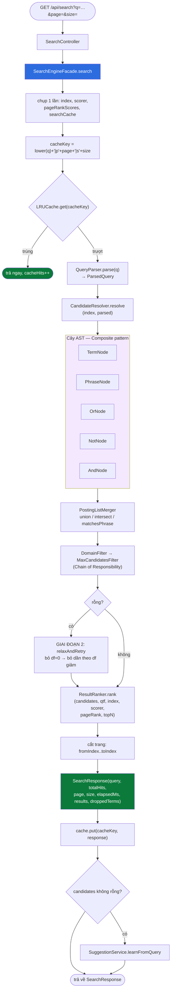

<details><summary>Xem bản chữ (ASCII)</summary>

```
GET /api/search?q=..&page=..&size=..
  -> SearchController
     -> SearchEngineFacade.search
        [chup 1 lan: index, scorer, pageRankScores, searchCache]
        -> cacheKey
        -> LRUCache.get  --trung--> tra ngay
                         --truot-->
           -> QueryParser.parse           => ParsedQuery
           -> CandidateResolver.resolve
              -> buildAst (Composite: TermNode/PhraseNode/OrNode/NotNode/AndNode)
              -> ast.evaluate              (PostingListMerger: union/intersect/matchesPhrase)
              -> applyFilters              (DomainFilter -> MaxCandidatesFilter)
              -> rong? --co--> relaxAndRetry (GIAI DOAN 2)
           -> ResultRanker.rank
           -> cat trang
           -> SearchResponse
           -> cache.put
           -> khong rong? -> SuggestionService.learnFromQuery
        <- SearchResponse
```

</details>

### 2.2 Bản đồ gói (package)

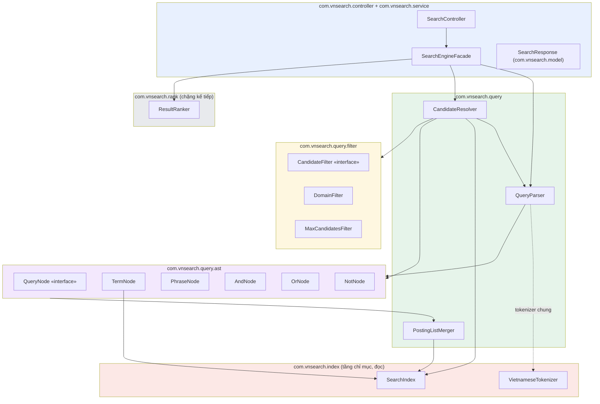

---

## 3. Danh mục toàn bộ file tham gia

Một truy vấn chạm tới khoảng **17 file** chính (không tính `SearchIndex` và
`Tokenizer` — thuộc chặng chỉ mục, chỉ được *đọc*, không được sửa bởi tầng này).

### 3.1 Gói `com.vnsearch.query` — 3 file

| File | Vai trò |
|---|---|
| `query/QueryParser.java` | Phân tích cú pháp chuỗi → `ParsedQuery`, dựng cây AST |
| `query/CandidateResolver.java` | Điều phối: xây tần suất từ khoá, đánh giá AST, áp bộ lọc, nới lỏng khi rỗng |
| `query/PostingListMerger.java` | Thuật toán nền: `union`, `intersect`, `intersectAll`, `matchesPhrase` |

### 3.2 Gói `com.vnsearch.query.ast` — 6 file

| File | Vai trò |
|---|---|
| `query/ast/QueryNode.java` | Giao diện `sealed`, hợp đồng chung của cây biểu thức |
| `query/ast/TermNode.java` | Nút lá — một term đơn |
| `query/ast/PhraseNode.java` | Nút lá — cụm từ liên tiếp |
| `query/ast/AndNode.java` | Nút trong — giao |
| `query/ast/OrNode.java` | Nút trong — hợp |
| `query/ast/NotNode.java` | Nút trong — loại trừ (chỉ hợp lệ trong `AndNode`) |

### 3.3 Gói `com.vnsearch.query.filter` — 3 file

| File | Vai trò |
|---|---|
| `query/filter/CandidateFilter.java` | Giao diện Chain of Responsibility |
| `query/filter/DomainFilter.java` | Lọc theo `site:` |
| `query/filter/MaxCandidatesFilter.java` | Trần số ứng viên `10 000` |

### 3.4 Tầng gọi và tầng kế tiếp (đọc để hiểu ranh giới, không thuộc tài liệu này)

| File | Vai trò | Tài liệu chi tiết |
|---|---|---|
| `controller/SearchController.java` (module `services/search-service`) | Điểm vào HTTP, chặn `page`/`size` | — |
| `service/SearchEngineFacade.java` (module `libs/core-search`) | Điều phối toàn bộ pipeline, cache, học gợi ý | Mục 6–7, 28–30 của tài liệu này |
| `index/SearchIndex.java` | Chỉ mục ngược — nguồn `getPostings`, `getDocumentFrequency`, `getTotalDocs` | `docs2/INDEX-PIPELINE.md` |
| `index/VietnameseTokenizer.java` | Tokenizer dùng chung index-time và query-time | `docs2/INDEX-PIPELINE.md` |
| `rank/ResultRanker.java` | Xếp hạng tập ứng viên | `docs2/RANKING-PIPELINE.md` |

---

## 4. Sơ đồ tuần tự tổng quát

```mermaid
sequenceDiagram
    participant U as Người dùng
    participant C as SearchController
    participant F as SearchEngineFacade
    participant P as QueryParser
    participant R as CandidateResolver
    participant M as PostingListMerger
    participant K as ResultRanker

    U->>C: GET /api/search?q=...
    C->>F: search(q, page, size)
    F->>F: cacheKey; LRUCache.get
    alt cache trúng
        F-->>C: SearchResponse (từ cache)
    else cache trượt
        F->>P: parse(q)
        P-->>F: ParsedQuery
        F->>R: resolve(index, parsed)
        R->>P: buildAst(parsed)
        P-->>R: QueryNode (hoặc null)
        R->>R: ast.evaluate(index)
        R->>M: intersect / union / matchesPhrase
        M-->>R: List<Integer> docId
        R->>R: applyFilters (Domain, MaxCandidates)
        opt candidates rỗng
            R->>R: relaxAndRetry (bỏ term dần)
        end
        R-->>F: ResolvedQuery(candidates, qtf, droppedTerms)
        F->>K: rank(candidates, qtf, index, scorer, pageRank, topN)
        K-->>F: List<ScoredResult>
        F->>F: cắt trang, build SearchResponse
        F->>F: cache.put
        opt candidates không rỗng
            F->>F: SuggestionService.learnFromQuery
        end
        F-->>C: SearchResponse
    end
    C-->>U: JSON
```

---

## 5. Vòng đời của một truy vấn: chuỗi → `ParsedQuery` → cây AST → tập ứng viên

Bốn dạng biểu diễn kế tiếp nhau của cùng một truy vấn:

```
"biến đổi khí hậu" việt nam -mỹ
        │  (chuỗi thô, người dùng gõ)
        ▼  QueryParser.parse
ParsedQuery(
  mustTerms     = [việt_nam]
  phrases       = [[biến_đổi, khí_hậu]]
  excludedTerms = [mỹ]
  orGroups      = []
  siteFilter    = null
)
        │  (cấu trúc phẳng, ba/năm danh sách)
        ▼  QueryParser.buildAst
AndNode[
  TermNode(việt_nam),
  PhraseNode([biến_đổi, khí_hậu]),
  NotNode(TermNode(mỹ))
]
        │  (cây, Composite pattern, lồng nhau được)
        ▼  CandidateResolver.resolve → ast.evaluate(index)
[12, 47, 205, ...]           (danh sách docId, sắp tăng dần)
```

Mỗi mũi tên là một PHẦN riêng trong tài liệu này: PHẦN II–III là mũi tên thứ nhất,
PHẦN IV–VI là cấu trúc dữ liệu đích của mũi tên thứ hai, PHẦN VII–X là mũi tên thứ ba.

---

## 6. `SearchEngineFacade` — vì sao chụp trạng thái một lần

★ Ngay khi vào `search()`, facade đọc bốn trường có thể bị thay đổi bởi một
lần **reindex chạy nền** (`index`, `scorer`, `pageRankScores`, `searchCache`) và
gán chúng vào **biến cục bộ**, chỉ một lần duy nhất, trước khi làm bất cứ việc gì
khác:

```
SearchIndex   localIndex   = this.index;
Scorer        localScorer  = this.scorer;
Map<Integer,Double> localPageRank = this.pageRankScores;
LRUCache<...> localCache   = this.searchCache;
```

Đây không phải là chi tiết trang trí — nó ngăn một lớp lỗi cụ thể: nếu một luồng
reindex hoán các trường `index`/`pageRankScores` của facade **giữa lúc** một
request đang xử lý (ví dụ đọc xong `index` mới nhưng `pageRankScores` vẫn đọc
lại — không qua biến cục bộ — thì có thể vô tình lấy bản **cũ**, đã bị thay ngay
sau đó), request đó sẽ tính điểm cho một tài liệu bằng **PageRank của một đồ thị
liên kết khác** với chỉ mục đang dùng để tra posting. Hai cấu trúc dữ liệu lệch
pha nhau âm thầm — không ném exception, chỉ cho điểm sai một cách khó phát hiện.
Chụp một lần vào biến cục bộ biến toàn bộ phần còn lại của `search()` thành một
**khung nhìn nhất quán** (consistent snapshot) của một thế hệ chỉ mục duy nhất,
bất kể việc gán lại trường `this.index` ở nơi khác xảy ra bất cứ lúc nào.

---

## 7. LRU cache truy vấn

```
cacheKey = lower(query) + "|p" + page + "|s" + size
```

| Thành phần | Vì sao có mặt |
|---|---|
| `lower(query)` | Tìm kiếm không phân biệt hoa/thường — `"Hà Nội"` và `"hà nội"` phải trúng cùng cache entry |
| `"|p" + page` | Trang 1 và trang 2 của cùng một truy vấn là hai response khác nhau |
| `"|s" + size` | `size=10` và `size=20` cắt trang khác nhau, không thể dùng chung |

`LRUCache.get(cacheKey)` trúng thì trả **ngay** `SearchResponse` đã lưu, tăng bộ
đếm `cacheHits`, và toàn bộ phần còn lại của `search()` (phân tích, truy hồi, xếp
hạng) **không chạy**. Vì `SearchResponse.timeTakenMs` là thời gian của lần tính
**gốc** (`System.currentTimeMillis() - start` được tính TRƯỚC khi `cache.put`),
một response trả từ cache vẫn mang thời gian xử lý **cũ** — đây là điều cần biết
khi đọc số liệu độ trễ từ client: `timeTakenMs` không phản ánh độ trễ của
request hiện tại nếu nó là cache hit.

---

# PHẦN II — TẦNG 0: PHÂN TÍCH CÚ PHÁP — `QueryParser`

**File:** `query/QueryParser.java` (249 dòng)

---

## 8. Ba bước của `QueryParser.parse`

```java
private static final Pattern PHRASE_PATTERN = Pattern.compile("\"([^\"]*)\"");
private static final String OR_KEYWORD = "OR";
private static final String SITE_PREFIX = "site:";
```

Javadoc của lớp ghi rõ một **bất biến quyết định** (dòng 32-38), lý do vì sao
constructor nhận `Tokenizer` từ bên ngoài thay vì tự khởi tạo:

> **BAT BIEN QUYET DINH.** Truy van phai duoc tokenize bang CHINH `Tokenizer` da
> dung luc index. Neu luc index tao ra `máy_tính` ma luc truy van tao ra `máy` +
> `tính` thi **khong bao gio khop** — va loi nay IM LANG, khong nem ngoai le
> nao, chi la ket qua rong mot cach kho hieu.

★ Đây là mối liên kết trực tiếp với `docs2/INDEX-PIPELINE.md`: `QueryParser` và
tầng chỉ mục **phải** dùng chung một thực thể lớp `VietnameseTokenizer` (hoặc ít
nhất một cấu hình tokenizer tương đương tuyệt đối), nếu không toàn bộ tìm kiếm
im lặng trả về rỗng cho mọi từ ghép — không có ngoại lệ, không có log cảnh báo,
chỉ là "không tìm thấy gì" khó chẩn đoán.

`parse(rawQuery)` chạy ba bước tuần tự trên **cùng một chuỗi**, mỗi bước tiêu thụ
đầu ra của bước trước:


<details><summary>Xem bản chữ (ASCII)</summary>

```
rawQuery
  -> Buoc 1: PHRASE_PATTERN cat cum "..." ra khoi chuoi
     -> remaining (khong con cap ngoac kep) + phrasesRaw
  -> Buoc 2: split theo \s+  =>  site: / OR / -loai_tru / con lai
     -> mustRaw, excludedRaw, orGroupsRaw, siteFilter
  -> Buoc 3: tokenizeToTerms (moi phan dung Tokenizer chung voi index)
     -> ParsedQuery
```

</details>

Query `null` hoặc blank thoát sớm, trả `ParsedQuery(List.of(), List.of(), List.of())`
(dòng 80-82) — không chạy ba bước, không lãng phí một lần biên dịch regex.

---

## 9. Bước 1 — cắt cụm từ trong ngoặc kép

```java
// dòng 88-99
List<String> phrasesRaw = new ArrayList<>();
Matcher matcher = PHRASE_PATTERN.matcher(rawQuery);
StringBuilder remaining = new StringBuilder();
int lastEnd = 0;
while (matcher.find()) {
    remaining.append(rawQuery, lastEnd, matcher.start());
    if (!matcher.group(1).isBlank()) {
        phrasesRaw.add(matcher.group(1));
    }
    lastEnd = matcher.end();
}
remaining.append(rawQuery.substring(lastEnd));
```

Thuật toán: duyệt từng match của regex `"([^"]*)"`, **chỉ nối phần TRƯỚC match**
vào `remaining` (bỏ qua chính đoạn nằm trong ngoặc — nó đi vào `phrasesRaw`
riêng), rồi sau vòng lặp nối nốt phần đuôi còn lại sau match cuối cùng.

★ Comment ngay trong mã (dòng 85-87) giải thích lý do phải cắt **trước** khi làm
bất kỳ điều gì khác:

> Giu lai phan NGOAI ngoac vao `remaining`; neu khong, cac tieng cua cum se VUA
> la phrase VUA la mustTerm, bi dem hai lan trong `queryTermFrequency` va lam
> sai trong so truy van.

Nếu bước này không tồn tại, truy vấn `"biến đổi khí hậu"` sẽ vừa sinh ra
`PhraseNode([biến_đổi, khí_hậu])` (nếu có bước xử lý ngoặc riêng ở chỗ khác) vừa
để nguyên các tiếng `biến`, `đổi`, `khí`, `hậu` lẫn vào dòng `mustRaw` — khiến
`buildQueryTermFrequency` (mục 31) đếm hai lần cho cùng khái niệm, làm lệch
trọng số khi xếp hạng.

### 9.1 Trường hợp biên

| Đầu vào | Kết quả |
|---|---|
| `""` (cặp ngoặc rỗng) | `matcher.group(1).isBlank()` → **bị bỏ qua**, không thêm vào `phrasesRaw`, nhưng đoạn `""` vẫn bị cắt khỏi `remaining` |
| `"a` (ngoặc không đóng) | Regex `"([^"]*)"` không khớp (thiếu ký tự `"` đóng) → **không cắt gì cả**, cả cụm kể cả dấu `"` còn nguyên trong `remaining`, bị bước 2/3 xử lý như văn bản thường |
| `"a" "b"` (hai cụm) | Hai match độc lập → `phrasesRaw = ["a", "b"]`, mỗi cụm tokenize **riêng** ở bước 3 |

---

## 10. Bước 2 — quét token: `site:`, `OR`, `-loại_trừ`, còn lại

```java
// dòng 107-146
String[] words = remaining.toString().trim().split("\\s+");
for (int i = 0; i < words.length; i++) {
    String word = words[i];
    if (word.isEmpty()) continue;

    if (word.toLowerCase(Locale.ROOT).startsWith(SITE_PREFIX)) {
        String host = word.substring(SITE_PREFIX.length()).trim().toLowerCase(Locale.ROOT);
        if (!host.isEmpty()) siteFilter = host;
        continue;
    }

    if (OR_KEYWORD.equals(word) && !mustRaw.isEmpty() && i + 1 < words.length) {
        String left = mustRaw.remove(mustRaw.size() - 1);
        List<String> group = new ArrayList<>();
        group.add(left);
        while (i + 1 < words.length) {
            group.add(words[i + 1]);
            i++;
            if (i + 1 < words.length && OR_KEYWORD.equals(words[i + 1])) {
                i++; // bỏ qua từ khoá OR tiếp theo
            } else {
                break;
            }
        }
        orGroupsRaw.add(group);
        continue;
    }

    if (word.startsWith("-") && word.length() > 1) {
        excludedRaw.add(word.substring(1));
    } else if (!word.equals("-")) {
        mustRaw.add(word);
    }
}
```

Mỗi từ (đã tách bởi khoảng trắng) rơi vào đúng **một** trong bốn nhóm:

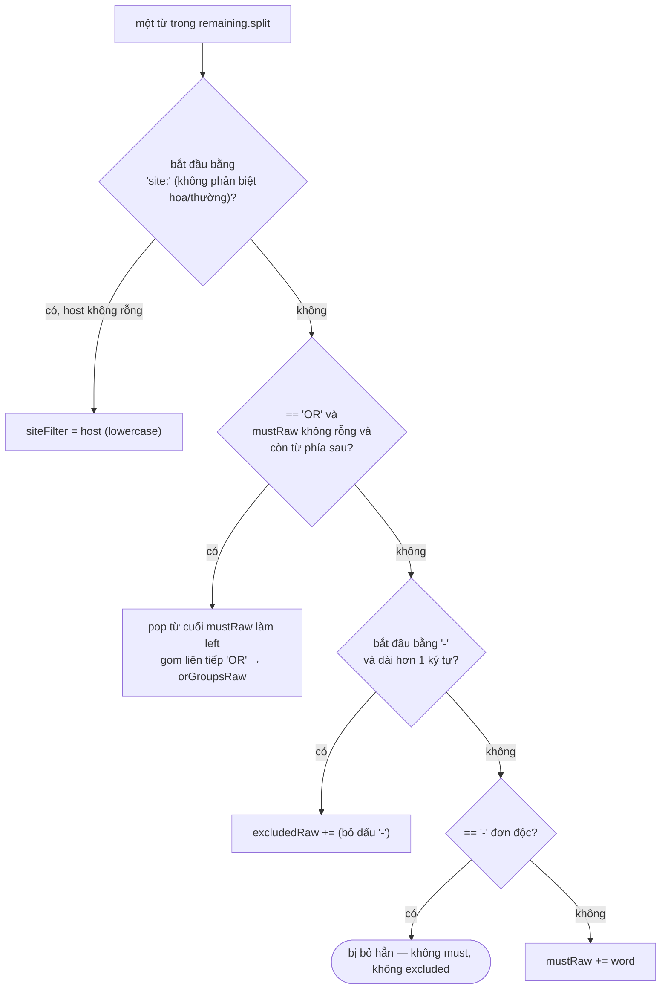

<details><summary>Xem bản chữ (ASCII)</summary>

```
tu word
  bat dau "site:" (khong phan biet hoa/thuong)?
    co, host khong rong -> siteFilter = host (lowercase)
    khong ->
      == "OR" va mustRaw khong rong va con tu phia sau?
        co -> pop tu cuoi mustRaw lam left; gom lien tiep OR -> orGroupsRaw
        khong ->
          bat dau "-" va dai hon 1 ky tu?
            co -> excludedRaw += (bo dau "-")
            khong ->
              == "-" don doc? co -> bo han (khong must, khong excluded)
              khong -> mustRaw += word
```

</details>

---

## 11. `site:` — điều kiện host rỗng

`site:` theo sau bởi chuỗi rỗng (ví dụ gõ `site:` một mình, hoặc `site: `) thì
`host.isEmpty()` đúng và dòng `if (!host.isEmpty())` **không set** `siteFilter`
(dòng 116-118) — từ `site:` bị nuốt (nhánh `continue`) mà không để lại dấu vết
nào trong `ParsedQuery`, không rơi xuống `mustRaw`.

---

## 12. ★ `OR` — chỉ gom được một từ đơn mỗi bên, không phải cụm từ

Điều kiện `!mustRaw.isEmpty() && i + 1 < words.length` (dòng 123) có nghĩa `OR`
đứng **đầu câu** hoặc **cuối câu** không được nhận diện như từ khoá — nó rơi
thẳng xuống nhánh "còn lại" và trở thành một `mustTerm` bình thường (tokenize ra
chữ `or` — vì `VietnameseTokenizer` không phân biệt hoa/thường ở bước sau).

Khi hợp lệ: `mustRaw.remove(mustRaw.size() - 1)` lấy phần tử **cuối cùng vừa mới
được thêm** vào `mustRaw` làm vế trái. ★ Điều này kéo theo một hệ quả rất dễ bị
hiểu lầm: **`OR` chỉ gộp được từ đơn liền kề ngay trước và ngay sau nó theo ranh
giới khoảng trắng, không phải theo ranh giới từ ghép tiếng Việt.** Ví dụ
`laptop OR máy tính giá rẻ` — vế phải của `OR` chỉ là từ thô `máy` (một "word"
theo `split("\\s+")`), còn `tính` bị coi là một mustTerm độc lập tách rời khỏi
`máy`. Xem trace thật ở mục 17.2.

Vòng `while` (dòng 128-136) gom dây `OR` liên tiếp: mỗi lần lặp thêm từ kế tiếp
vào `group`, rồi kiểm tra xem từ **sau** nữa có phải `OR` không — nếu có thì nuốt
luôn từ khoá đó và lặp tiếp; nếu không thì dừng. Nhờ vậy `a OR b OR c` gom thành
**một** nhóm ba phần tử `[a, b, c]` chứ không phải lồng nhau `(a OR b) OR c`.

---

## 13. `-loại_trừ` và dấu `-` đơn độc

`word.startsWith("-") && word.length() > 1` loại trừ trường hợp `word` chỉ là
chính dấu `-` (length == 1) — điều kiện `else if (!word.equals("-"))` ở nhánh cuối
đảm bảo một dấu gạch ngang đứng một mình **không rơi vào `mustRaw` lẫn
`excludedRaw`**, nó bị bỏ hẳn, im lặng.

---

# PHẦN III — TẦNG 1: TỪ TOKEN ĐẾN CÂY AST

---

## 14. Bước 3 — tokenize bằng chung tokenizer với tầng chỉ mục

```java
// dòng 152-174
List<String> mustTerms = tokenizeToTerms(String.join(" ", mustRaw));
List<String> excludedTerms = tokenizeToTerms(String.join(" ", excludedRaw));

List<List<String>> phrases = new ArrayList<>();
for (String phraseRaw : phrasesRaw) {
    List<String> phraseTerms = tokenizeToTerms(phraseRaw);
    if (!phraseTerms.isEmpty()) phrases.add(phraseTerms);
}

List<List<String>> orGroups = new ArrayList<>();
for (List<String> groupRaw : orGroupsRaw) {
    List<String> alternatives = new ArrayList<>();
    for (String alternative : groupRaw) {
        alternatives.addAll(tokenizeToTerms(alternative));
    }
    if (alternatives.size() > 1) {
        orGroups.add(alternatives);
    } else if (alternatives.size() == 1) {
        mustTerms = new ArrayList<>(mustTerms);
        mustTerms.add(alternatives.get(0)); // OR một vế thì thành AND
    }
}
```

Ba cách gọi `tokenizeToTerms` khác nhau về **phạm vi ngữ cảnh** đưa vào tokenizer
— đây là chỗ dễ nhầm nhất của cả file:

| Phần | Cách nối trước khi tokenize | Vì sao |
|---|---|---|
| `mustRaw` | `String.join(" ", mustRaw)` — nối **toàn bộ** rồi tokenize **một lần chung** | Đủ ngữ cảnh để bộ tokenize ghép từ (longest-matching) nhận ra từ ghép nằm vắt qua ranh giới hai "word" thô, ví dụ `việt` + `nam` gộp thành `việt_nam` |
| `excludedRaw` | Giống `mustRaw` — nối chung rồi tokenize một lần | Cùng lý do — loại trừ cũng cần ghép từ đúng |
| mỗi `phraseRaw` | Tokenize **riêng biệt từng cụm** (KHÔNG nối các cụm với nhau, KHÔNG nối với `mustRaw`) | Mỗi cặp ngoặc kép là một đơn vị độc lập về mặt ngữ nghĩa — cụm này không được phép mượn ngữ cảnh của cụm khác |
| mỗi `alternative` trong một `orGroup` | Tokenize **riêng từng alternative** rồi gộp list | Mỗi vế OR là một khái niệm độc lập, không ghép từ chéo giữa `laptop` và `máy` |

### 14.1 ★ "OR một vế" hạ xuống thành `mustTerm`

Khi `alternatives.size() == 1` sau khi tokenize (dòng 171-174) — nghĩa là dù
`orGroupsRaw` từng có ≥ 2 "word" thô, sau khi tokenize hoá chúng lại **gộp về
đúng một term** (ví dụ do một bên rỗng, hoặc do tokenizer coi hai word là cùng
một khái niệm) — nhóm OR không còn ý nghĩa phân nhánh, code hạ nó thành một
`mustTerm` bình thường thay vì tạo một `OrNode` chỉ có một con. Dòng
`mustTerms = new ArrayList<>(mustTerms)` (dòng 172) tạo bản sao mới trước khi
`add` — vì `mustTerms` tại đây vẫn đang trỏ tới kết quả `List` trả về từ
`tokenizeToTerms`, an toàn hơn là sửa tại chỗ một list có thể bất biến.

---

## 15. `ParsedQuery` — cấu trúc dữ liệu kết quả

```java
public record ParsedQuery(List<String> mustTerms, List<List<String>> phrases,
                           List<String> excludedTerms, List<List<String>> orGroups,
                           String siteFilter) {

    public ParsedQuery(List<String> mustTerms, List<List<String>> phrases, List<String> excludedTerms) {
        this(mustTerms, phrases, excludedTerms, List.of(), null);
    }

    public boolean isEmpty() {
        return mustTerms.isEmpty() && phrases.isEmpty() && orGroups.isEmpty();
    }
}
```

| Trường | Kiểu | Ý nghĩa |
|---|---|---|
| `mustTerms` | `List<String>` | Term đơn, AND ngầm định với nhau và với mọi phrase/orGroup |
| `phrases` | `List<List<String>>` | Mỗi phần tử là một cụm — danh sách term theo đúng thứ tự phải xuất hiện liên tiếp |
| `excludedTerms` | `List<String>` | Term sau dấu `-`, tài liệu chứa chúng bị loại |
| `orGroups` | `List<List<String>>` | Mỗi phần tử là một nhóm lựa chọn — các nhóm AND với nhau, bên trong mỗi nhóm là OR |
| `siteFilter` | `String` (nullable) | Host phải khớp, `null` nếu không có `site:` |

★ Có **constructor rút gọn** ba tham số (dòng 70-72) để tương thích ngược với mã
cũ chưa biết `orGroups`/`siteFilter` — gọi nó tự động điền `orGroups = List.of()`
và `siteFilter = null`.

⚠ `isEmpty()` (dòng 74-76) **không** kiểm tra `excludedTerms` lẫn `siteFilter`.
Một truy vấn chỉ gồm `-spam` (chỉ có excludedTerms) hoặc chỉ có `site:abc.vn`
(chỉ có siteFilter) được `isEmpty()` báo là **rỗng** — điều này nhất quán với
hành vi của `buildAst` (mục 16): cả hai trường hợp đều không có "mệnh đề khẳng
định" nào để truy hồi, nên coi là truy vấn rỗng là đúng ngữ nghĩa tìm kiếm dù có
vẻ ngược trực giác khi đọc code lần đầu.

---

## 16. `buildAst` — dựng cây từ `ParsedQuery`

```java
// dòng 194-217
public QueryNode buildAst(ParsedQuery parsed) {
    List<QueryNode> children = new ArrayList<>();

    for (String term : parsed.mustTerms())
        children.add(new TermNode(term));
    for (List<String> phrase : parsed.phrases())
        children.add(new PhraseNode(phrase));
    for (List<String> group : parsed.orGroups()) {
        List<QueryNode> alternatives = new ArrayList<>(group.size());
        for (String alternative : group)
            alternatives.add(new TermNode(alternative));
        children.add(new OrNode(alternatives));
    }
    if (children.isEmpty()) {
        return null; // không có mệnh đề khẳng định -> không truy hồi được
    }
    for (String excluded : parsed.excludedTerms())
        children.add(new NotNode(new TermNode(excluded)));
    return new AndNode(children);
}
```

★★ Điểm mấu chốt nhất của toàn hàm: **`excludedTerms` chỉ được thêm vào
`children` SAU khi đã kiểm tra `children.isEmpty()`.** Trình tự này không phải
ngẫu nhiên — nó là cơ chế phòng thủ khiến một truy vấn **chỉ toàn dấu trừ** (ví
dụ người dùng chỉ gõ `-quảng_cáo`) không bao giờ đi tới việc tạo ra một `AndNode`
mà mọi con đều là `NotNode`. Tại thời điểm kiểm tra `isEmpty()`, các `NotNode`
còn chưa được thêm, nên nếu `mustTerms`/`phrases`/`orGroups` đều rỗng thì hàm trả
`null` ngay — `CandidateResolver` nhận `null` sẽ trả về tập ứng viên rỗng **mà
không hề gọi `ast.evaluate()`**.

Đây chính là lý do, khi đọc mã `AndNode.evaluate()` (PHẦN V), việc
`positives.isEmpty()` ném `UnsupportedOperationException` gần như **không bao
giờ xảy ra trên đường đi qua `buildAst` bình thường** — `AndNode` tự vệ hai lớp:
lớp ngoài (`buildAst`, trả `null` sớm) và lớp trong (`AndNode` tự ném exception
nếu vẫn lọt vào tình huống toàn NOT, ví dụ khi ai đó dựng `AndNode` trực tiếp mà
không qua `buildAst`, như trong test).

---

## 17. Trace 3 truy vấn mẫu qua `QueryParser`

Ba lần chạy **thật** dưới đây được lấy bằng cách biên dịch và chạy trực tiếp
`QueryParser.parse()` + `buildAst()` (cùng `VietnameseTokenizer` thật, cùng
từ điển từ ghép 185.000 mục thật của repo) — không phải suy đoán tay.

### 17.1 `trump iran` — AND ngầm định giữa hai term đơn

```
must=[trump, iran]
phrases=[]
excluded=[]
orGroups=[]
site=null
ast=(trump AND iran)
```

Không có ký tự đặc biệt nào, cả hai "word" đều là một tiếng đơn nên không có gì
để ghép — kết quả `mustTerms` giữ nguyên hai token gốc.

### 17.2 `"tơi bời" trump -mỹ` — cụm từ, must, và loại trừ cùng lúc

```
must=[trump]
phrases=[[tơi_bời]]
excluded=[mỹ]
orGroups=[]
site=null
ast=(trump AND "tơi_bời" AND NOT mỹ)
```

Ba quan sát đối chiếu trực tiếp với mã ở mục 9–13:

- Cụm `"tơi bời"` bị **Bước 1** cắt khỏi chuỗi trước khi Bước 2 chạy, nên nó
  không bao giờ lẫn vào `mustRaw` — đúng như lời giải thích ở mục 9.
- Hai tiếng `tơi` và `bời` được tokenize **thành một cụm riêng** (mục 14) và bộ
  ghép từ của `VietnameseTokenizer` nhận ra đây là một từ ghép có trong từ điển
  185.000 mục, cho ra đúng **một** token `tơi_bời` — `phrases=[[tơi_bời]]` chỉ
  có một phần tử trong danh sách trong, không phải hai token rời `tơi`, `bời`.
- `-mỹ` đi thẳng vào `excludedRaw` rồi `excludedTerms=[mỹ]`; `buildAst` đặt
  `NotNode(TermNode(mỹ))` **sau cùng** trong `AndNode`, đúng thứ tự dòng
  795-796 của mã.

★ Truy vấn này minh hoạ đúng cảnh báo ★★ ở mục 16: nếu người dùng gõ **chỉ**
`-mỹ` (không `trump`, không cụm nào), `children` rỗng tại thời điểm kiểm tra,
`buildAst` trả `null`, và `CandidateResolver` không bao giờ chạm tới
`ast.evaluate()`. Xem thêm hệ quả thật của truy vấn này (nó trả về **rỗng** vì
một lý do khác hẳn — loại trừ, không phải thiếu term) ở
[mục 49](#49-truy-vấn-2-tơi-bời-trump--mỹ--rỗng-vì-loại-trừ-không-vì-thiếu).

### 17.3 `sài gòn site:vnexpress.net` — cụm ghép qua ranh giới "word" và `site:`

```
must=[sài_gòn]
phrases=[]
excluded=[]
orGroups=[]
site=vnexpress.net
ast=(sài_gòn)
```

Hai "word" thô `sài` và `gòn` (không có dấu ngoặc kép nào) vẫn được ghép thành
đúng **một** token `sài_gòn` vì bước 3 tokenize **toàn bộ** `mustRaw` đã nối
bằng khoảng trắng trong **một lần gọi** (`String.join(" ", mustRaw)`, mục 14) —
bộ ghép từ có đủ ngữ cảnh để nhận ra từ ghép nằm vắt qua ranh giới hai "word".
`site:vnexpress.net` bị Bước 2 nuốt trọn thành `siteFilter`, không để lại dấu
vết trong `mustRaw`, nên cây AST chỉ còn đúng một `TermNode(sài_gòn)` — ràng
buộc domain được `CandidateResolver` áp ở **tầng lọc riêng**, không nằm trong
cây (xem [mục 2 phần đầu tài liệu](#2-bản-đồ-toàn-hệ-thống)
và [mục 36](#36-bộ-lọc-ứng-viên-candidatefilter-domainfilter-maxcandidatesfilter)).

---

## 18. Bảng đối chiếu cả bốn truy vấn (kèm `trump OR iran`)

| Truy vấn | mustTerms | phrases | excludedTerms | orGroups | siteFilter |
|---|---|---|---|---|---|
| `trump iran` | `[trump, iran]` | `[]` | `[]` | `[]` | `null` |
| `"tơi bời" trump -mỹ` | `[trump]` | `[[tơi_bời]]` | `[mỹ]` | `[]` | `null` |
| `trump OR iran` | `[]` | `[]` | `[]` | `[[trump, iran]]` | `null` |
| `sài gòn site:vnexpress.net` | `[sài_gòn]` | `[]` | `[]` | `[]` | `vnexpress.net` |

Dòng `trump OR iran` xác nhận đúng mục 12: `OR` giữa hai từ đơn hợp lệ,
`mustRaw` (đã có `trump`) bị pop phần tử cuối làm vế trái, `iran` làm vế phải —
kết quả rơi thẳng vào `orGroups`, `mustTerms` trở lại rỗng.

---

# PHẦN IV — TẦNG 2: CÂY CÚ PHÁP — NÚT LÁ

**Thư mục:** `query/ast/` — 6 file, tổng cộng dưới 300 dòng mã thực (phần lớn
là Javadoc). Đây là cấu trúc dữ liệu **Composite pattern**: một cây, mỗi nút là
một `record` cài `QueryNode`, đệ quy tự nhiên — nút lá trả posting list, nút
trong ghép kết quả của các con.

---

## 19. `QueryNode` — giao diện chung

**File:** `query/ast/QueryNode.java`

```java
public sealed interface QueryNode
        permits TermNode, PhraseNode, AndNode, OrNode, NotNode {

    List<Integer> evaluate(SearchIndex index);
    int estimatedSize(SearchIndex index);
    String describe();
}
```

Ba điểm thiết kế đáng chú ý:

- **`sealed` + `permits`** — Java 17 cho phép khai báo kín tập cài đặt. Một
  `switch` trên `QueryNode` (nếu có nơi nào cần phân biệt loại nút) sẽ được
  trình biên dịch kiểm tra **đầy đủ nhánh**: thêm một loại nút thứ bảy mà quên
  xử lý ở một `switch` nào đó sẽ là lỗi biên dịch, không phải lỗi runtime im
  lặng.
- ★ **Bất biến bắt buộc:** mọi cài đặt `evaluate()` phải trả về danh sách
  docId **sắp xếp tăng dần**. Đây không phải quy ước phong cách — nó là điều
  kiện để các nút cha (`AndNode`, `OrNode`, `NotNode.evaluateAgainst`) ghép
  kết quả con lại bằng thuật toán hai-con-trỏ `O(m+n)` thay vì phải `sort` lại
  `O(n log n)` ở mỗi tầng của cây. Bất biến này bắt nguồn từ `SearchIndex`
  (Javadoc của chính `getPostings`): posting list gốc đã sắp tăng dần theo
  docId, và mọi phép hợp/giao two-pointer đều **bảo toàn** thứ tự đó ở đầu ra.
- **`estimatedSize()` tách biệt hoàn toàn khỏi `evaluate()`** — ước lượng
  không được phép tốn kém hơn việc thực sự đánh giá, nếu không mục đích "sắp
  xếp trước khi làm việc nặng" sẽ tự triệt tiêu lợi ích của chính nó. Với
  `TermNode`, ước lượng là `getDocumentFrequency` — `O(1)` — trong khi
  `evaluate()` phải lấy hẳn posting list `O(df)`.

### 19.1 Sơ đồ cây tổng quát

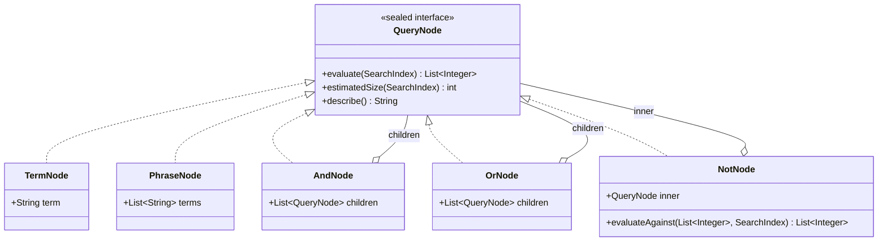

Ví dụ cây thật cho `"tơi bời" trump -mỹ` (đối chiếu mục 17.2):

```
AndNode
 ├── TermNode(trump)
 ├── PhraseNode([tơi_bời])
 └── NotNode(TermNode(mỹ))
```

---

## 20. `TermNode` — nút lá

**File:** `query/ast/TermNode.java`

```java
public record TermNode(String term) implements QueryNode {
    @Override
    public List<Integer> evaluate(SearchIndex index) {
        return PostingListMerger.docIdsOf(index.getPostings(term));
    }

    @Override
    public int estimatedSize(SearchIndex index) {
        return index.getDocumentFrequency(term); // df chính là số kết quả, O(1)
    }

    @Override
    public String describe() {
        return term;
    }
}
```

Nút đơn giản nhất trong cả cây: `evaluate` chỉ lấy thẳng posting list của
`term` từ chỉ mục rồi rút ra danh sách docId — không có logic gì thêm.
`estimatedSize` **chính xác tuyệt đối**, không phải ước lượng gần đúng: với
term đơn, document frequency **là** số kết quả thật, nên sắp xếp shortest-first
dựa trên `TermNode.estimatedSize` không bao giờ sai thứ tự.

---

## 21. `PhraseNode` — nút cụm từ

**File:** `query/ast/PhraseNode.java`

```java
public record PhraseNode(List<String> terms) implements QueryNode {
    @Override
    public List<Integer> evaluate(SearchIndex index) {
        if (terms.isEmpty()) return List.of();
        List<QueryNode> asTerms = new ArrayList<>(terms.size());
        for (String term : terms) asTerms.add(new TermNode(term));
        List<Integer> rough = new AndNode(asTerms).evaluate(index); // lọc THÔ

        List<Integer> exact = new ArrayList<>(rough.size());
        for (int docId : rough) {
            if (PostingListMerger.matchesPhrase(index, terms, docId)) { // lọc CHÍNH XÁC
                exact.add(docId);
            }
        }
        return exact;
    }

    @Override
    public int estimatedSize(SearchIndex index) {
        int min = Integer.MAX_VALUE;
        for (String term : terms) min = Math.min(min, index.getDocumentFrequency(term));
        return min == Integer.MAX_VALUE ? 0 : min;
    }
}
```

★ **Filter-and-refine — hai tầng lọc với chi phí rất khác nhau.** Javadoc của
lớp giải thích rõ lý do có hai bước thay vì một:

> Điều kiện "liên tiếp" KÉO THEO điều kiện "cùng có mặt", nên ta dùng điều kiện
> yếu hơn nhưng RẺ hơn (giao posting list) để thu hẹp tập trước, rồi mới kiểm
> tra "liên tiếp" (đắt, phải tìm kiếm nhị phân trên danh sách vị trí) trên tập
> nhỏ còn lại.

Cụ thể: `evaluate()` **tái sử dụng `AndNode`** để tạo bước lọc thô — dựng một
`AndNode` tạm gồm mỗi tiếng của cụm bọc trong `TermNode`, rồi gọi
`evaluate()` của nó. Điều này có nghĩa `PhraseNode` được lợi **miễn phí** từ
mọi tối ưu shortest-first mà `AndNode` đã có (mục 26) — không phải cài đặt lại
logic giao posting list riêng cho trường hợp cụm từ.

⚠ Nếu bỏ bước lọc thô này và chạy thẳng `matchesPhrase` trên **toàn bộ**
corpus, Javadoc ước tính chậm hơn khoảng **100 lần** trên corpus tham chiếu
5.011 tài liệu (so với chạy trên vài chục ứng viên đã qua giao posting list).

`estimatedSize` lấy **`min`** document frequency của các tiếng trong cụm — một
chặn trên hợp lý: một cụm không thể khớp nhiều tài liệu hơn tiếng hiếm nhất
trong nó xuất hiện.

---

# PHẦN V — TẦNG 3: CÂY CÚ PHÁP — NÚT GIAO VÀ NÚT HỢP

---

## 22. `AndNode` — nút giao

**File:** `query/ast/AndNode.java`

```java
@Override
public List<Integer> evaluate(SearchIndex index) {
    if (children.isEmpty()) return List.of();

    List<QueryNode> positives = new ArrayList<>(children.size());
    List<NotNode> negatives = new ArrayList<>();
    for (QueryNode child : children) {
        if (child instanceof NotNode not) negatives.add(not);
        else positives.add(child);
    }
    if (positives.isEmpty()) {
        throw new UnsupportedOperationException(
                "AND chi gom cac menh de NOT thi khong danh gia duoc; "
                        + "can it nhat mot menh de khang dinh.");
    }

    positives.sort(Comparator.comparingInt(node -> node.estimatedSize(index))); // shortest-first

    List<Integer> accumulator = positives.get(0).evaluate(index);
    for (int i = 1; i < positives.size(); i++) {
        if (accumulator.isEmpty()) return List.of(); // rỗng là phần tử HẤP THỤ
        accumulator = PostingListMerger.intersect(accumulator, positives.get(i).evaluate(index));
    }

    for (NotNode negative : negatives) {
        if (accumulator.isEmpty()) break;
        accumulator = negative.evaluateAgainst(accumulator, index);
    }
    return accumulator;
}
```

### 22.1 Ba việc `evaluate()` làm theo đúng thứ tự

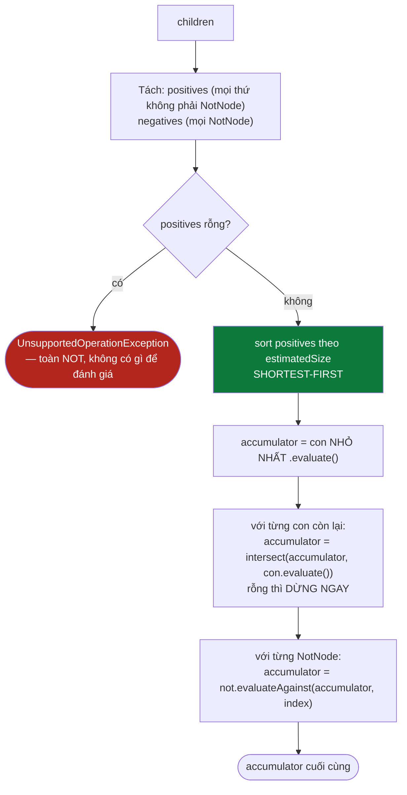

<details><summary>Xem bản chữ (ASCII)</summary>

```
children
  -> tach: positives (khong phai NotNode) / negatives (NotNode)
  -> positives rong? -> UnsupportedOperationException
  -> sort positives theo estimatedSize TANG DAN (shortest-first)
  -> accumulator = con NHO NHAT .evaluate()
  -> voi tung con con lai:
       rong -> dung ngay, tra ve List.of()
       khong -> accumulator = intersect(accumulator, con.evaluate())
  -> voi tung NotNode: accumulator = not.evaluateAgainst(accumulator, index)
  -> tra ve accumulator
```
</details>

---

## 23. ★ Vì sao shortest-first, bằng con số cụ thể

Cơ sở toán học: `|A ∩ B| <= min(|A|, |B|)` — giao không bao giờ lớn hơn tập
nhỏ hơn. Nếu bắt đầu từ con có **ít** kết quả nhất, `accumulator` nhỏ ngay từ
bước đầu, và mọi bước giao sau đó tốn `O(|accumulator hiện tại| + |con kế
tiếp|)` — rẻ hơn hẳn so với việc lỡ bắt đầu từ con có nhiều kết quả nhất trước.

Với dữ liệu thật của [mục 48](#48-truy-vấn-1-trump-iran--and-hai-term-phổ-biến)
(`trump` có `df=9`, `iran` có `df=4` trên corpus 40 tài liệu): `AndNode` sắp
`iran` (nhỏ hơn) lên trước, `accumulator` khởi đầu chỉ 4 phần tử thay vì 9.
Trên corpus nhỏ khác biệt không đáng kể, nhưng cơ chế giữ nguyên khi một trong
hai term có `df` chênh lệch hàng nghìn lần trên corpus lớn — đúng chỗ tối ưu
phát huy tác dụng rõ nhất.

---

## 24. Xử lý `NotNode` — tách riêng, áp sau cùng

`AndNode` **không coi `NotNode` như một `positive` bình thường** — nó lọc
riêng ra thành danh sách `negatives`, không đưa vào bước sort/intersect. Lý do
nằm trọn ở [mục 26](#26-notnode--nút-loại-trừ-và-vì-sao-nó-không-đứng-một-mình-được): `NotNode`
không đánh giá độc lập được, nên nó chỉ có thể được áp dụng **sau khi** đã có
một `accumulator` khẳng định làm nền — đúng thứ tự "trừ trên một tập ứng viên
có sẵn" mà Javadoc của `NotNode` yêu cầu.

```java
@Override
public int estimatedSize(SearchIndex index) {
    int min = Integer.MAX_VALUE;
    for (QueryNode child : children) {
        if (child instanceof NotNode) continue; // NOT không thu hẹp ước lượng
        min = Math.min(min, child.estimatedSize(index));
    }
    return min == Integer.MAX_VALUE ? 0 : min;
}
```

`estimatedSize` của chính `AndNode` cũng bỏ qua `NotNode` cùng lý do: một
`NotNode` đứng riêng chỉ có thể LÀM GIẢM kết quả, không bao giờ làm tăng, nên
nó không đóng góp thông tin gì cho việc ước lượng chặn trên.

---

## 25. `OrNode` — nút hợp

**File:** `query/ast/OrNode.java`

```java
@Override
public List<Integer> evaluate(SearchIndex index) {
    List<Integer> accumulator = List.of();
    for (QueryNode child : children) {
        accumulator = PostingListMerger.union(accumulator, child.evaluate(index));
    }
    return accumulator;
}

@Override
public int estimatedSize(SearchIndex index) {
    long sum = 0;
    for (QueryNode child : children) sum += child.estimatedSize(index);
    return (int) Math.min(sum, Integer.MAX_VALUE);
}
```

★ Javadoc của lớp này kể một chi tiết lịch sử quan trọng: `PostingListMerger.union`
**đã tồn tại và đã có test** từ trước khi cây AST ra đời, nhưng **không có
đường nào gọi tới nó** từ tầng truy vấn — ngôn ngữ truy vấn cũ không hỗ trợ
`OR`. `OrNode` là nơi đầu tiên hàm này thực sự được dùng trong đường chạy sản
phẩm, không chỉ trong test.

`estimatedSize` là **chặn trên**, không phải số chính xác: `sum` cộng dồn kích
thước từng con — nếu các con có tài liệu trùng nhau, kết quả hợp thực tế nhỏ
hơn tổng. Nhưng với mục đích duy nhất của `estimatedSize` — sắp xếp
shortest-first ở `AndNode` cha — một chặn trên là đủ chính xác, không cần
`OrNode` tự đánh giá thật để biết số chính xác.

---

# PHẦN VI — TẦNG 4: CÂY CÚ PHÁP — NÚT LOẠI TRỪ VÀ CHI PHÍ

---

## 26. `NotNode` — nút loại trừ và vì sao nó không đứng một mình được

**File:** `query/ast/NotNode.java`

```java
@Override
public List<Integer> evaluate(SearchIndex index) {
    throw new UnsupportedOperationException(
            "NOT chi hop le trong ngu canh AND (vi du 'A AND NOT B'); "
                    + "phu dinh doc lap se tra ve gan nhu toan bo corpus.");
}

public List<Integer> evaluateAgainst(List<Integer> candidates, SearchIndex index) {
    List<Integer> excluded = inner.evaluate(index);
    if (excluded.isEmpty()) return candidates;
    List<Integer> result = new ArrayList<>(candidates.size());
    int j = 0;
    for (int candidate : candidates) {
        while (j < excluded.size() && excluded.get(j) < candidate) j++;
        if (j >= excluded.size() || excluded.get(j) != candidate) result.add(candidate);
    }
    return result;
}

@Override
public int estimatedSize(SearchIndex index) {
    return index.getTotalDocs(); // chặn trên thô
}
```

### 26.1 ★★ Vì sao `evaluate()` tự ném ngoại lệ thay vì cố trả về gì đó

Đây là quyết định thiết kế quan trọng nhất của cả gói `query.ast`. Javadoc của
lớp giải thích lý do bằng chính con số của corpus tham chiếu:

> Phủ định thuần túy cho ra *tập bù*: với truy vấn `NOT quảng_cáo` trên corpus
> 5.011 tài liệu, kết quả là gần 5.000 tài liệu — vừa vô nghĩa với người dùng,
> vừa đắt (phải liệt kê toàn bộ corpus rồi trừ đi). Mọi hệ thống tìm kiếm thực
> tế đều yêu cầu phủ định đi kèm một mệnh đề khẳng định: `A AND NOT B`, không
> phải `NOT B` đơn độc.

Vì vậy lớp này cố tình **không cài `evaluate()` theo hợp đồng thông thường** —
nó ném `UnsupportedOperationException` có thông điệp rõ ràng, buộc bất kỳ ai
gọi sai (kể cả chính tác giả sau này quên mất quy tắc) nhận một lỗi ồn ào ngay
lập tức, thay vì âm thầm tính ra một tập gần bằng cả corpus rồi để nó trôi mãi
xuống các tầng sau — nơi lỗi loại đó cực khó lần ngược nguyên nhân vì không có
exception nào cả, chỉ có kết quả "hơi lạ" nhưng không sai cú pháp.

`evaluateAgainst(candidates, index)` mới là con đường đúng — luôn được gọi bởi
`AndNode` (mục 24), không bao giờ được gọi trực tiếp từ `CandidateResolver`
hay bất kỳ đâu khác trong mã sản phẩm.

---

## 27. Two-pointer trừ tập — vì sao `O(m+n)` chứ không `O(m·n)`

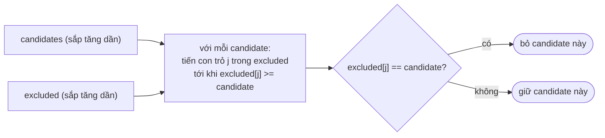

Điểm mấu chốt: con trỏ `j` **chỉ tiến, không bao giờ lùi**, vì cả `candidates`
và `excluded` đều sắp tăng dần (bất biến từ `QueryNode.evaluate`, mục 19) —
đúng cấu trúc thuật toán hai-con-trỏ đã thấy ở `intersect`/`union` (mục 35).
Tổng số bước tiến của `j` trong suốt toàn bộ vòng lặp bị chặn bởi
`excluded.size()`, nên tổng chi phí là `O(|candidates| + |excluded|)`, không
phải `O(|candidates| * |excluded|)` như cách kiểm tra "có nằm trong danh sách
loại trừ không" bằng `List.contains` bên trong vòng lặp sẽ tốn.

⚠ `estimatedSize()` trả `index.getTotalDocs()` — chặn trên **tệ nhất có thể**,
không giúp gì cho việc sắp xếp shortest-first (đây chính xác là lý do
`AndNode.estimatedSize` phải bỏ qua `NotNode` khi tính `min`, mục 24: nếu
không bỏ qua, một `AndNode` có cả `NotNode` sẽ luôn ước lượng bằng
`getTotalDocs()`, vô hiệu hoá hoàn toàn việc sắp xếp).

---

## 28. `estimatedSize()` — chi phí ước lượng của từng loại nút

| Loại nút | `estimatedSize()` trả về | Độ phức tạp | Chính xác hay chặn trên? |
|---|---|---|---|
| `TermNode` | `index.getDocumentFrequency(term)` | `O(1)` | **Chính xác tuyệt đối** |
| `PhraseNode` | `min` document frequency của các tiếng | `O(k)`, k = số tiếng trong cụm | Chặn trên (cụm không thể khớp nhiều hơn tiếng hiếm nhất) |
| `AndNode` | `min` của các con `positive` (bỏ qua `NotNode`) | `O(k)` đệ quy | Chặn trên (giao luôn ≤ min các tập con) |
| `OrNode` | tổng `estimatedSize` của mọi con | `O(k)` đệ quy | Chặn trên (hợp có thể trùng lặp, nên tổng thực tế thường CAO hơn kết quả thật) |
| `NotNode` | `index.getTotalDocs()` | `O(1)` | Chặn trên **tệ nhất có thể** — không mang thông tin phân biệt |

Bảng này giải thích trực tiếp vì sao `AndNode.evaluate()` luôn dồn `NotNode`
xuống cuối và loại nó khỏi phép sort shortest-first: một ước lượng bằng
`getTotalDocs()` sẽ luôn bị coi là "lớn nhất", nên tự nhiên bị xếp cuối ngay
cả khi không có logic loại trừ tường minh nào — nhưng logic đó vẫn tồn tại
tường minh (tách `positives`/`negatives`) để không phụ thuộc vào việc `sort`
tình cờ xếp đúng chỗ.

---

# PHẦN VII — TRUY HỒI ỨNG VIÊN: TỔNG QUAN

**File:** `query/CandidateResolver.java` (lớp `final`, không thể kế thừa, mọi
phương thức `static`)

---

## 29. `resolve()` — tổng quan hai giai đoạn

```java
public static ResolvedQuery resolve(SearchIndex index, QueryParser.ParsedQuery parsed) {
    Map<String, Integer> queryTermFrequency = buildQueryTermFrequency(parsed);

    // --- Giai đoạn 1: truy hồi boolean bằng cây biểu thức (Composite) ---
    QueryNode ast = AST_BUILDER.buildAst(parsed);
    if (ast == null) {
        return new ResolvedQuery(List.of(), queryTermFrequency);
    }

    List<Integer> candidates = applyFilters(ast.evaluate(index), index, parsed);
    if (!candidates.isEmpty()) {
        return new ResolvedQuery(candidates, queryTermFrequency);
    }

    // --- Giai đoạn 2: không có gì khớp -> nới lỏng truy vấn ---
    return relaxAndRetry(index, parsed, queryTermFrequency);
}
```

### 29.1 Vì sao lớp này tồn tại tách biệt khỏi `SearchEngineFacade`

Javadoc của lớp kể lại nguyên nhân — logic này từng nằm trong
`SearchEngineFacade` dưới dạng một phương thức `private`:

> Bộ đánh giá chất lượng không gọi lại được và buộc phải viết lại một bản sao.
> Hai bản sao chắc chắn sẽ trôi lệch nhau theo thời gian, và khi đó mọi con số
> trong báo cáo đánh giá đều mất giá trị vì chúng đo một đường đi KHÁC với
> đường đi mà hệ thống thực sự phục vụ người dùng.

Nói cách khác: tách `CandidateResolver` thành lớp `public static` riêng không
chỉ là refactor cho gọn — nó là điều kiện để **"cái được ĐO bằng cái được
PHỤC VỤ"**, một bất biến quan trọng cho bất kỳ hệ thống nào có script đánh giá
chất lượng chạy song song với đường chạy sản phẩm.

---

## 30. ★ "Lùi dần về AND-của-tập-con" — vấn đề gốc mà cả lớp giải quyết

AND ngầm định giữa các term đúng về mặt ngữ nghĩa cho truy vấn ngắn, nhưng với
truy vấn dài nó biến một kết quả tốt thành **không có kết quả nào**: chỉ cần
một tiếng vắng mặt khỏi corpus là giao của mọi posting list bằng rỗng. Ví dụ
Javadoc đưa ra: truy vấn `"máy tính xách tay giá rẻ cho sinh viên"` hầu như
chắc chắn trả về rỗng dù corpus có đầy đủ tài liệu về máy tính xách tay — chỉ
cần một tiếng như `sinh_viên` hiếm hoặc vắng mặt là đủ để giao rỗng lan
truyền qua toàn bộ cây `AndNode`.

`CandidateResolver` giải quyết vấn đề này bằng **hai giai đoạn tuần tự**, chỉ
chạy giai đoạn 2 khi giai đoạn 1 cho ra rỗng — không đánh đổi độ chính xác của
trường hợp phổ biến (khớp đầy đủ) để đổi lấy khả năng chịu lỗi của trường hợp
hiếm (không khớp gì).

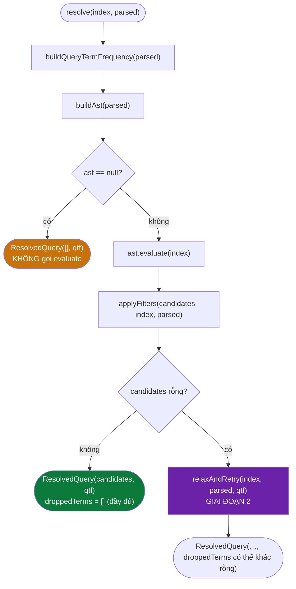

---

## 31. `buildQueryTermFrequency`

```java
private static Map<String, Integer> buildQueryTermFrequency(QueryParser.ParsedQuery parsed) {
    Map<String, Integer> frequency = new HashMap<>();
    for (String term : parsed.mustTerms()) frequency.merge(term, 1, Integer::sum);
    for (List<String> phrase : parsed.phrases())
        for (String term : phrase) frequency.merge(term, 1, Integer::sum);
    for (List<String> group : parsed.orGroups())
        for (String term : group) frequency.merge(term, 1, Integer::sum);
    return frequency;
}
```

Ba vòng lặp gom **cả** term của `mustTerms`, **cả** term nằm trong mỗi cụm của
`phrases`, **cả** term nằm trong mỗi nhóm của `orGroups` vào cùng một bảng tần
suất — Javadoc cảnh báo rõ: *"nếu bỏ sót, trọng số truy vấn sẽ sai và scorer
chấm điểm lệch"*. `excludedTerms` **cố ý không có mặt** trong hàm này — một
term bị loại trừ không đóng góp vào vector truy vấn dùng để chấm điểm liên
quan, vì về mặt ngữ nghĩa tìm kiếm, người dùng đang nói "tôi không muốn cái
này", không phải "cái này quan trọng với tôi".

★ **Luôn tính từ `parsed` GỐC, được gọi Ở ĐẦU `resolve()`** — trước khi biết
liệu giai đoạn 2 (nới lỏng) có chạy hay không. Đây là điểm bất biến cốt lõi
mà [mục 39](#39-giai-đoạn-2--nới-lỏng-truy-vấn-khi-rỗng) phụ thuộc vào: dù
truy vấn có bị nới lỏng (bỏ bớt term khỏi tập truy hồi) hay không, việc CHẤM
ĐIỂM vẫn luôn dùng tần suất của truy vấn người dùng thực sự gõ — tài liệu khớp
nhiều term hơn trong truy vấn gốc vẫn được xếp trên, kể cả khi một vài term đó
đã bị hệ thống âm thầm bỏ khỏi bước truy hồi.

---

## 32. GIAI ĐOẠN 1 — đánh giá cây AST

Thân của giai đoạn 1 chỉ có ba dòng, nhưng mỗi dòng gánh một lớp trách nhiệm
khác nhau:

```java
QueryNode ast = AST_BUILDER.buildAst(parsed);
if (ast == null) {
    return new ResolvedQuery(List.of(), queryTermFrequency);
}
List<Integer> candidates = applyFilters(ast.evaluate(index), index, parsed);
```

| Dòng | Trách nhiệm | Nếu bỏ qua |
|---|---|---|
| `buildAst(parsed)` | Composite — dựng cấu trúc từ dữ liệu phẳng | Không thể biểu diễn `OR`/`NOT` lồng nhau (xem Javadoc `QueryNode`, mục 19) |
| `ast == null` | Thoát sớm cho truy vấn không có mệnh đề khẳng định | Sẽ phải xử lý `null` ở tận `AndNode`, hoặc gọi nhầm `evaluate()` trên cây rỗng |
| `ast.evaluate(index)` | Truy hồi boolean thuần tuý trên posting list | — |
| `applyFilters(…)` | Chain of Responsibility — ràng buộc sau truy hồi | `site:` và trần số ứng viên sẽ không bao giờ được áp dụng |

`AST_BUILDER` là một `QueryParser` **`static final`** riêng của
`CandidateResolver` (dòng 61 trong mã), tách khỏi thực thể `QueryParser` mà
`SearchEngineFacade` giữ — vì `buildAst` không phụ thuộc tokenizer (nó chỉ
đọc `ParsedQuery` đã tokenize sẵn), một thực thể mặc định là đủ, không cần
tiêm `Tokenizer` từ ngoài vào.

---

# PHẦN VIII — GHÉP POSTING LIST

---

## 33. `PostingListMerger` — trái tim thuật toán của tầng truy vấn

**File:** `query/PostingListMerger.java`

### 33.1 `intersect` / `union` — two-pointer `O(m+n)`

```java
public static List<Integer> intersect(List<Integer> a, List<Integer> b) {
    List<Integer> result = new ArrayList<>();
    int i = 0, j = 0;
    while (i < a.size() && j < b.size()) {
        int docA = a.get(i), docB = b.get(j);
        if (docA == docB) { result.add(docA); i++; j++; }
        else if (docA < docB) i++; // b tăng dần -> A[i] không thể còn trong phần sau của b
        else j++;
    }
    return result;
}
```

`union` cùng cấu trúc, chỉ khác: khi hai con trỏ lệch nhau, phần tử nhỏ hơn
được **thêm vào** kết quả (thay vì bỏ qua) rồi mới tiến con trỏ; sau vòng lặp
chính, phần đuôi còn lại của bên dài hơn được nối thẳng vào — vì phần đuôi đó
chắc chắn không trùng với bên kia (bên kia đã duyệt hết).

★ **Vì sao không dùng `HashSet.retainAll`** — Javadoc đưa số đo thật trên hai
danh sách 500.000 phần tử:

| Cách làm | Thời gian |
|---|---|
| two-pointer | ~10,0 ms |
| `HashSet.retainAll` (không tính dựng set) | ~15,5 ms (+55%) |
| `HashSet.retainAll` (tính cả dựng 2 set) | ~27,0 ms (2,7 lần) |

Ba lý do: two-pointer không tốn chi phí dựng cấu trúc trung gian (posting list
lấy thẳng từ chỉ mục), có cục bộ cache tốt hơn (duyệt tuần tự thay vì nhảy
ngẫu nhiên trong bảng băm), và không có hằng số ẩn của việc băm mỗi phần tử.

---

## 34. `intersectCursors` — galloping search, không cấp phát trung gian

```java
public static List<Integer> intersectCursors(PostingCursor a, PostingCursor b) {
    List<Integer> result = new ArrayList<>();
    while (a.docId() != PostingCursor.NO_MORE && b.docId() != PostingCursor.NO_MORE) {
        int docA = a.docId(), docB = b.docId();
        if (docA == docB) { result.add(docA); a.next(); b.next(); }
        else if (docA < docB) a.skipTo(docB); // nhảy cóc, không next() từng bước
        else b.skipTo(docA);
    }
    return result;
}
```

Khi giao một danh sách **rất ngắn** với một danh sách **rất dài**, two-pointer
thuần phải bước từng bước gần hết danh sách dài. `PostingCursor.skipTo` nhảy
thẳng tới vị trí cần tìm (dùng binary/exponential search bên trong cursor):

```
two-pointer thuần : O(m + n)        = 5 + 4000 = 4005 bước
galloping         : O(m log(n/m))   ~= 48 bước
```

`intersectAll` (dùng khi giao nhiều posting list gốc cùng lúc — trường hợp
AND nhiều term đơn) sắp các danh sách theo độ dài **tăng dần** trước, dùng
`intersectCursors` cho cặp đầu tiên (nơi chênh lệch kích thước rõ nhất), rồi
giao tiếp bằng con trỏ với từng danh sách còn lại — dừng ngay khi kết quả
trung gian rỗng, vì rỗng là **phần tử hấp thụ** của phép giao.

---

## 35. `matchesPhrase` — khớp cụm từ theo vị trí

```java
public static boolean matchesPhrase(SearchIndex index, List<String> phraseTerms, int docId) {
    if (phraseTerms.isEmpty()) return true;
    int[][] positionsByTerm = new int[phraseTerms.size()][];
    for (int i = 0; i < phraseTerms.size(); i++) {
        int[] positions = index.getPositions(phraseTerms.get(i), docId);
        if (positions.length == 0) return false; // một term không xuất hiện
        positionsByTerm[i] = positions;
    }

    for (int start : positionsByTerm[0]) {
        boolean allMatch = true;
        for (int i = 1; i < phraseTerms.size(); i++) {
            if (Arrays.binarySearch(positionsByTerm[i], start + i) < 0) {
                allMatch = false;
                break;
            }
        }
        if (allMatch) return true;
    }
    return false;
}
```

### 35.1 Hai tối ưu, đối chiếu với "bản cũ" mà Javadoc mô tả

| Tối ưu | Bản cũ | Bản hiện tại | Vì sao nhanh hơn |
|---|---|---|---|
| Lấy vị trí | gọi `index.getPositions(term_i, docId)` **bên trong** vòng lặp qua từng vị trí của term đầu | lấy **một lần** cho mỗi term, **ngoài** vòng lặp (`positionsByTerm`) | Với term đầu xuất hiện 20 lần và cụm 3 từ: 40 lần tìm kiếm thay vì 2 |
| Tìm vị trí kế tiếp | `List.contains` — quét tuyến tính `O(p)` | `Arrays.binarySearch` trên `int[]` đã sắp tăng dần | `O(log p)`, và chạy thẳng trên mảng nguyên thuỷ nên không phải mở hộp `Integer` ở vòng nóng nhất |

### 35.2 Thuật toán: "mọi vị trí bắt đầu có thể" của tiếng đầu tiên

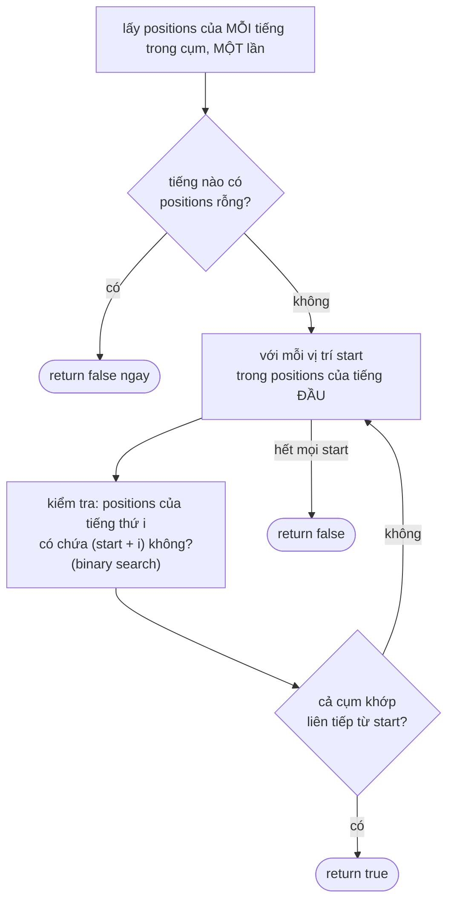

Điều kiện `start + i` chính là điều kiện "liên tiếp": nếu tiếng đầu ở vị trí
`start`, tiếng thứ hai của cụm phải ở đúng vị trí `start + 1`, tiếng thứ ba ở
`start + 2`, v.v. — không có khoảng trống, không đảo thứ tự.

---

# PHẦN IX — BỘ LỌC ỨNG VIÊN

---

## 36. Bộ lọc ứng viên: `CandidateFilter`, `DomainFilter`, `MaxCandidatesFilter`

**File:** `query/CandidateResolver.java` (phương thức `applyFilters`) +
`query/filter/*.java`

```java
private static final List<CandidateFilter> FILTERS = List.of(
        new DomainFilter(),
        new MaxCandidatesFilter());

private static List<Integer> applyFilters(List<Integer> candidates, SearchIndex index,
                                           QueryParser.ParsedQuery parsed) {
    CandidateFilter.FilterContext context = new CandidateFilter.FilterContext(index, parsed);
    for (CandidateFilter filter : FILTERS) {
        if (candidates.isEmpty()) break; // rỗng là phần tử HẤP THỤ của mọi phép lọc
        if (!filter.isApplicable(context)) continue;
        candidates = filter.apply(candidates, context);
    }
    return candidates;
}
```

### 36.1 Vì sao đây là Chain of Responsibility, không phải hàm nội bộ

Javadoc của `CandidateFilter` mô tả "bản cũ" — ba tầng lọc từng nằm chọn cứng
trong thân hàm `resolve` dài 104 dòng, không thể test riêng từng tầng, không
đo được "tầng nào loại bao nhiêu ứng viên, tốn bao nhiêu ms". Bản hiện tại:
mỗi tầng là một lớp riêng cài `CandidateFilter`, thêm bộ lọc mới chỉ cần thêm
một dòng vào danh sách `FILTERS` — không sửa `applyFilters`, tuân thủ nguyên
tắc Mở/Đóng.

---

## 37. ★ Thứ tự "rẻ và loại nhiều trước"

```
1. Giao posting list (trong ast.evaluate, TRƯỚC applyFilters)   5011 -> ~50
2. DomainFilter (site:)                                          ~50 -> ~20
3. MaxCandidatesFilter (trần 10.000)                              hiếm khi kích hoạt
```

`DomainFilter.isApplicable` chỉ trả `true` khi `parsed.siteFilter() != null`
— truy vấn không có `site:` bỏ qua hẳn tầng này, không lãng phí một vòng lặp
rỗng. `DomainFilter` khớp theo **hậu tố**: `site:vnexpress.net` bắt được cả
chính `vnexpress.net` lẫn phụ miền `sport.vnexpress.net`.

```java
// DomainFilter.apply — rút gọn
String host = hostOf(doc.getUrl());
if (host != null && (host.equals(wanted) || host.endsWith("." + wanted))) {
    filtered.add(docId);
}
```

★ Javadoc của `DomainFilter` giải thích lý do nó là một **filter**, không phải
một `QueryNode`: cây biểu thức mô hình hoá quan hệ boolean giữa các **term**,
làm việc trên posting list; `site:` không phải một term — nó là ràng buộc trên
**siêu dữ liệu** của tài liệu (URL), không có posting list tương ứng. Đưa nó
vào cây sẽ buộc phải dựng thêm một chỉ mục phụ `host -> docIds`; với vài chục
ứng viên đã qua bước giao posting list, kiểm tra trực tiếp URL của từng ứng
viên đơn giản và đủ nhanh.

---

## 38. `MaxCandidatesFilter` — chặn trên đơn giản, không phải WAND/MaxScore

```java
public static final int DEFAULT_MAX_CANDIDATES = 10_000;

public List<Integer> apply(List<Integer> candidates, FilterContext context) {
    if (candidates.size() <= maxCandidates) return candidates; // không cấp phát
    return List.copyOf(candidates.subList(0, maxCandidates));
}
```

⚠ Javadoc tự thừa nhận đây **không phải** cách chuẩn của ngành (WAND hoặc
MaxScore — ước lượng chặn trên điểm số của từng tài liệu để bỏ qua sớm những
tài liệu không thể lọt top-K). Vì posting list sắp theo **docId**, không phải
theo điểm, phép cắt `subList(0, maxCandidates)` **không bảo toàn top-K một
cách chính xác** — đây là một đánh đổi có ý thức, chỉ kích hoạt ở ngưỡng rất
cao (mặc định `10.000`) nên không ảnh hưởng truy vấn thông thường. Javadoc nói
rõ: bộ lọc này bảo vệ hệ thống khỏi truy vấn bất thường, không phải một tối ưu
xếp hạng.

---

# PHẦN X — NỚI LỎNG TRUY VẤN

---

## 39. GIAI ĐOẠN 2 — nới lỏng truy vấn khi rỗng

**File:** `query/CandidateResolver.java`, phương thức `relaxAndRetry`

```java
private static ResolvedQuery relaxAndRetry(SearchIndex index, QueryParser.ParsedQuery parsed,
                                            Map<String, Integer> queryTermFrequency) {
    List<String> mustTerms = parsed.mustTerms();
    if (mustTerms.isEmpty()) {
        return new ResolvedQuery(List.of(), queryTermFrequency);
    }
    if (isUnmatchable(index, parsed)) {
        return new ResolvedQuery(List.of(), queryTermFrequency);
    }

    List<String> remaining = new ArrayList<>(mustTerms);
    List<String> dropped = new ArrayList<>();

    // Bước 1: bỏ TẤT CẢ term có df = 0, một lần.
    remaining.removeIf(term -> {
        if (index.getDocumentFrequency(term) == 0) { dropped.add(term); return true; }
        return false;
    });
    if (!dropped.isEmpty()) {
        ResolvedQuery attempt = attempt(index, parsed, queryTermFrequency, remaining, dropped);
        if (attempt != null) return attempt;
    }

    // Bước 2: bỏ tiếp từng term một, phổ biến nhất trước (IDF tăng dần).
    remaining.sort(Comparator.comparingInt(index::getDocumentFrequency).reversed());
    while (remaining.size() > 1) {
        dropped.add(remaining.remove(0));
        ResolvedQuery attempt = attempt(index, parsed, queryTermFrequency, remaining, dropped);
        if (attempt != null) return attempt;
    }
    return new ResolvedQuery(List.of(), queryTermFrequency);
}
```

---

## 40. ★ `isUnmatchable` — thoát sớm khỏi nỗ lực vô ích

```java
private static boolean isUnmatchable(SearchIndex index, QueryParser.ParsedQuery parsed) {
    for (List<String> phrase : parsed.phrases())
        for (String term : phrase)
            if (index.getDocumentFrequency(term) == 0) return true;
    for (List<String> group : parsed.orGroups()) {
        boolean anyExists = false;
        for (String alternative : group)
            if (index.getDocumentFrequency(alternative) > 0) { anyExists = true; break; }
        if (!anyExists) return true;
    }
    return false;
}
```

Một cụm từ chỉ khớp khi **mọi** tiếng của nó tồn tại; một nhóm OR chỉ khớp khi
**ít nhất một** vế tồn tại. Vi phạm một trong hai điều đó là kết quả rỗng
**vĩnh viễn** — không phép bỏ bớt `mustTerm` nào cứu được, vì `relaxAndRetry`
**chỉ** có khả năng bỏ bớt term trong `mustTerms`, không đụng tới `phrases`
hay `orGroups`. Kiểm tra này chạy TRƯỚC khi bắt đầu vòng lặp thử — tránh lãng
phí tới `k` lần đánh giá lại cây cho một truy vấn không có cách nào cứu được.

---

## 41. ★ Vì sao "cái gì KHÔNG bao giờ bị bỏ" quan trọng hơn "cái gì bị bỏ"

Javadoc liệt kê rõ:

> Cụm từ trong ngoặc kép và nhóm `OR` là ý định TƯỜNG MINH của người dùng,
> không phải suy diễn của hệ thống; term bị loại trừ (`-từ`) lại càng không —
> bỏ một mệnh đề NOT sẽ THÊM vào kết quả đúng những thứ người dùng nói rõ là
> không muốn. Chỉ các term đơn AND ngầm định mới là thứ hệ thống tự suy ra,
> nên cũng chỉ chúng mới được phép rút lại.

Đây chính là lý do truy vấn `"tơi bời" trump -mỹ` ở [mục 49](#49-truy-vấn-2-tơi-bời-trump--mỹ--rỗng-vì-loại-trừ-không-vì-thiếu)
trả về rỗng **và không hề được nới lỏng**, dù về mặt kỹ thuật `relaxAndRetry`
có chạy: `mustTerms` của nó chỉ có `[trump]` — không có gì để bỏ bớt mà vẫn
còn "AndNode với ít nhất một mệnh đề khẳng định" (vòng `while (remaining.size()
> 1)` dừng khi còn đúng 1 phần tử) — trong khi nguyên nhân rỗng thực sự nằm ở
mệnh đề `NOT mỹ`, một thứ nằm ngoài phạm vi mà giai đoạn 2 được phép động vào.

---

## 42. Hai bước nới lỏng, theo đúng thứ tự IDF tăng dần

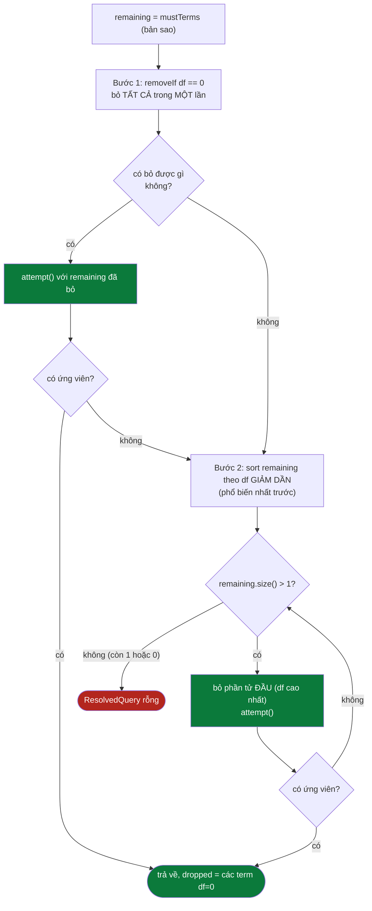

**Bước 1 — bỏ tất cả term có `df = 0` trong một lần**, không phải từng cái
một. Javadoc giải thích: term có `df = 0` không thể khớp bất kỳ tài liệu nào,
nên giữ lại dù chỉ một cái cũng khiến kết quả rỗng vĩnh viễn. Đây cũng là
nguyên nhân phổ biến nhất khiến người dùng gặp 0 kết quả: gõ sai chính tả,
hoặc dùng một từ không có trong corpus. Bỏ hết trong một bước tiết kiệm tới
`k` lần đánh giá lại cây so với bỏ từng cái.

**Bước 2 — bỏ dần từng term, PHỔ BIẾN NHẤT trước** (`df` giảm dần —
`Comparator.comparingInt(index::getDocumentFrequency).reversed()`). Javadoc
giải thích lựa chọn thứ tự này:

> Đây là *IDF tăng dần*, tức bỏ term PHỔ BIẾN nhất trước, giữ lại term HIẾM
> nhất — vì term hiếm mang nhiều thông tin phân biệt hơn. Dùng đúng một đại
> lượng mà `BM25Scorer.idf` dùng để chấm điểm, nên khâu nới lỏng và khâu xếp
> hạng không nói hai thứ khác nhau về "term nào quan trọng".

Vòng lặp dừng khi `remaining.size() > 1` không còn đúng — tức khi chỉ còn lại
đúng một term, không bỏ tiếp để tránh về `ast == null` (không còn mệnh đề
khẳng định nào).

---

## 43. `attempt()` — thử lại và điểm bất biến về chấm điểm

```java
private static ResolvedQuery attempt(SearchIndex index, QueryParser.ParsedQuery parsed,
                                      Map<String, Integer> queryTermFrequency,
                                      List<String> remainingTerms, List<String> dropped) {
    QueryParser.ParsedQuery relaxed = new QueryParser.ParsedQuery(
            List.copyOf(remainingTerms), parsed.phrases(), parsed.excludedTerms(),
            parsed.orGroups(), parsed.siteFilter());
    QueryNode ast = AST_BUILDER.buildAst(relaxed);
    if (ast == null) return null;
    List<Integer> candidates = applyFilters(ast.evaluate(index), index, relaxed);
    if (candidates.isEmpty()) return null;
    // Điểm vẫn tính theo truy vấn GỐC: tài liệu khớp nhiều term hơn vẫn trên.
    return new ResolvedQuery(candidates, queryTermFrequency, List.copyOf(dropped));
}
```

★ Dòng cuối cùng là điểm bất biến quan trọng nhất của toàn giai đoạn 2:
`attempt()` dựng một `ParsedQuery relaxed` **mới**, chỉ khác bản gốc ở
`mustTerms` (đã rút gọn) — `phrases`, `excludedTerms`, `orGroups`,
`siteFilter` giữ nguyên. Nhưng `ResolvedQuery` trả về mang theo
`queryTermFrequency` của **truy vấn gốc**, không phải của `relaxed`. Điều này
đảm bảo: khi `ResultRanker` chấm điểm tài liệu, một tài liệu tình cờ vẫn chứa
term đã bị bỏ (dù nó không còn là điều kiện lọc bắt buộc) vẫn được thưởng điểm
cho nó — tài liệu khớp 4/5 term của truy vấn gốc vẫn xếp trên tài liệu chỉ
khớp 3/5, dù cả hai đều "qua được" vòng lọc rút gọn.

`droppedTerms` được trả ra **ngoài cùng** `SearchResponse` (qua
`ResolvedQuery.droppedTerms()`) — không bị giấu đi. Đây chính là bất biến
đã nêu ở [mục 45](#45-cắt-trang-và-searchresponse):
người dùng có quyền biết kết quả họ đang xem ứng với một truy vấn **hẹp hơn**
truy vấn họ vừa gõ.

---

# PHẦN XI — TRẢ KẾT QUẢ VÀ KẾT THÚC

---

## 44. Bàn giao cho `ResultRanker`

**File:** `ranking/ResultRanker.java` (module `libs/core-search`) — chỉ nêu
ranh giới trách nhiệm ở đây; chi tiết công thức BM25, Decorator PageRank/title
boost, và sinh snippet thuộc về `docs2/RANKING-PIPELINE.md`.

```java
// SearchEngineFacade.search — điểm gọi
int topN = Math.max(page * size, size);
List<ResultRanker.RankedResult> ranked = resultRanker.rank(
        candidates, resolved.queryTermFrequency(), currentIndex,
        currentScorer, currentPageRank, topN);
```

| Tham số truyền vào `rank()` | Nguồn gốc | Tại sao chặng này cần nó |
|---|---|---|
| `candidates` | `resolved.candidateDocIds()` | Tập ứng viên đã qua Composite + Chain of Responsibility + (có thể) nới lỏng |
| `queryTermFrequency` | `resolved.queryTermFrequency()` | Vector truy vấn — luôn của truy vấn GỐC (mục 43), BM25 cần để tính điểm khớp từng term |
| `currentIndex`, `currentScorer`, `currentPageRank` | Biến cục bộ đã chụp một lần (mục 10) | Đảm bảo chấm điểm dùng ĐÚNG thế hệ chỉ mục đã dùng để truy hồi |
| `topN` | `Math.max(page * size, size)` | Số lượng tối đa cần giữ lại sau khi sắp hạng — đưa vào `MinHeap.topK` |

★ **Ranh giới rõ ràng:** `CandidateResolver` không hề biết gì về điểm số hay
thứ tự — nó trả về một **tập hợp** docId (không có nghĩa thứ tự nào ngoài
việc sắp tăng dần theo docId, thứ tự thuận tiện cho thuật toán, không phải
thứ tự liên quan). `ResultRanker` không hề biết gì về cách một tài liệu lọt
vào được tập ứng viên — nó chỉ nhận một danh sách docId và một vector tần
suất truy vấn. Đây chính là ranh giới Composite/Chain-of-Responsibility (xử lý
truy hồi) với Strategy/Decorator (xử lý xếp hạng, xem `docs2/RANKING-PIPELINE.md`)
— hai bài toán khác hẳn nhau về bản chất toán học: một là đại số tập hợp trên
posting list, một là hàm số liên tục trên không gian điểm số.

---

## 45. Cắt trang và `SearchResponse`

```java
int fromIndex = Math.min((Math.max(page, 1) - 1) * size, ranked.size());
int toIndex = Math.min(fromIndex + size, ranked.size());
List<SearchResult> pageResults = new ArrayList<>(toIndex - fromIndex);
for (ResultRanker.RankedResult r : ranked.subList(fromIndex, toIndex)) {
    pageResults.add(new SearchResult(
            r.document().getTitle(), r.document().getUrl(), r.snippet(),
            r.finalScore(), r.pageRankScore(), r.document().getCrawledAt()));
}
```

Cả `fromIndex` và `toIndex` đều được **kẹp** (`Math.min(…, ranked.size())`) —
một `page` vượt quá số trang thực có (ví dụ `page=1000` cho một truy vấn chỉ
có 4 kết quả) cho ra `fromIndex == toIndex == ranked.size()`, tức
`pageResults` rỗng một cách an toàn, không ném `IndexOutOfBoundsException`.

```java
SearchResponse response = new SearchResponse(
        normalizedQuery, candidates.size(), page, size, elapsed, pageResults,
        resolved.droppedTerms());
```

⚠ ★ `totalResults` trong response là `candidates.size()` — **tổng số ứng
viên đã qua truy hồi**, không phải `pageResults.size()` (số kết quả của
riêng trang hiện tại). Đây là hành vi ĐÚNG cho phân trang: client cần biết
"có tổng cộng bao nhiêu kết quả" để vẽ điều khiển phân trang, không phải "có
bao nhiêu kết quả trên trang này" (con số đó suy ra được từ độ dài
`results`). Nhầm lẫn hai con số này là lỗi thường gặp khi đọc code phân trang
lần đầu.

---

## 46. Ghi cache và học gợi ý truy vấn

```java
cache.put(cacheKey, response);

if (!candidates.isEmpty()) {
    suggestionService.learnFromQuery(normalizedQuery);
}
return response;
```

Hai thao tác cuối cùng của `search()`, theo đúng thứ tự:

1. **`cache.put`** — ghi **trước** khi kiểm tra học gợi ý, vì cache phải lưu
   cả kết quả rỗng (một truy vấn không có kết quả gõ lại lần nữa vẫn nên trả
   nhanh từ cache, không lặp lại toàn bộ pipeline).
2. **`learnFromQuery`** — chỉ chạy khi `candidates` **không rỗng**. Comment
   trong mã giải thích triết lý:

   > Truy vấn THẬT của người dùng là nguồn gợi ý tốt nhất. Chỉ học từ truy vấn
   > CÓ kết quả, để không học phải lỗi chính tả.

   Nếu bỏ điều kiện này, một người dùng gõ nhầm `"khủng long"` thành
   `"khủgn long"` (giả định corpus không có tài liệu nào chứa `khủgn`) sẽ
   khiến hệ thống gợi ý chính lỗi chính tả đó cho người dùng **tiếp theo** gõ
   `khủ...` — một vòng phản hồi tự làm hỏng chất lượng gợi ý theo thời gian
   nếu không có điều kiện chặn này.

★ Lưu ý: điều kiện `!candidates.isEmpty()` xét trên `candidates` **sau khi**
có thể đã qua `relaxAndRetry` — tức một truy vấn đã bị nới lỏng nhưng cuối
cùng vẫn cho ra kết quả **vẫn được học**, dù nó không khớp đầy đủ 100% những
gì người dùng gõ. Điều này nhất quán với triết lý "báo ra thay vì giấu đi" của
`droppedTerms`: hệ thống không coi truy vấn nới lỏng là "sai", chỉ là "không
khớp đầy đủ".

---

# PHẦN XII — ĐỐI CHIẾU OUTPUT THẬT

Mọi số liệu trong phần này lấy từ một lần chạy **thật**: dựng
`InvertedIndex` bằng chính `IndexBuilder(new VietnameseTokenizer())` mà
`SearchEngineFacade` dùng, nạp từ `ContentStorage.loadFromJson("data/seed-documents.json")`,
rồi gọi thật `QueryParser.parse()` → `CandidateResolver.resolve()` trên index
đó. Không có docId, `df`, hay tiêu đề tài liệu nào bị bịa.

---

## 47. Corpus dùng để trace

```
Loaded docs: 40
totalDocs = 40
termCount = 8973
avgdl     = 840.85
```

Corpus `seed-documents.json` là 40 trang thật crawl từ `vnexpress.net` và
`e.vnexpress.net` ngày 29/7/2026 — tin tức thời sự, thể thao, kinh doanh song
song tiếng Việt và tiếng Anh (trang quốc tế). Vài tài liệu dùng xuyên suốt
phần này:

| docId | url | title (rút gọn) |
|---|---|---|
| 0 | `vnexpress.net/` | Báo VnExpress — trang chủ, tổng hợp nhiều tin (Trump, Iran, TP HCM…) |
| 2 | `vnexpress.net/chu-de/thanh-pho-ho-chi-minh-2091` | Tin tức TP HCM 24h… báo **Sài Gòn** mới hàng ngày |
| 4 | `vnexpress.net/tin-tuc-24h` | Tin tức 24h tại **Việt Nam** & Thế giới |
| 6 | `vnexpress.net/ong-trump-doa-danh-iran-toi-boi-…` | Ông **Trump** doạ 'đánh **Iran** **tơi bời**' |
| 18 | `vnexpress.net/cach-thong-ke-thuong-vong-chien-su-iran-…` | Cách thống kê thương vong chiến sự **Iran** khiến chính quyền **Mỹ** hứng chỉ trích |

`df` (document frequency) của các term dùng trong phần này, đo trực tiếp bằng
`index.getDocumentFrequency(term)`:

| Term | df | Term | df |
|---|---|---|---|
| `trump` | 9 | `mỹ` | 9 |
| `iran` | 4 | `sài_gòn` | 4 |
| `việt_nam` | 9 | `tơi_bời` | 3 |
| `khủng_long` | **0** | | |

---

## 48. Truy vấn 1: `trump iran` — AND hai term phổ biến

Cây AST: `AndNode[TermNode(trump), TermNode(iran)]`.

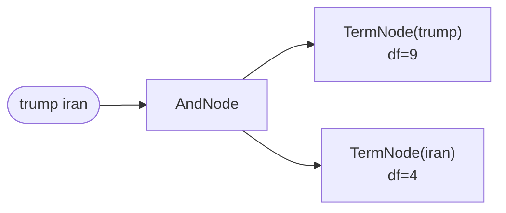

`AndNode.evaluate` sắp `iran` (df=4, nhỏ hơn) lên **trước** `trump` (df=9) —
đúng shortest-first ở [mục 23](#23--vì-sao-shortest-first-bằng-con-số-cụ-thể).
`accumulator` khởi đầu bằng posting list của `iran`, rồi giao với posting list
của `trump`.

**Kết quả thật:**

```
candidates = [0, 4, 6, 18]
dropped    = []
```

| docId | title |
|---|---|
| 0 | Báo VnExpress — Báo tiếng Việt nhiều người xem nhất |
| 4 | Tin tức 24h tại Việt Nam & Thế giới mới nhất [HÔM NAY] |
| 6 | Ông Trump dọa 'đánh Iran tơi bời' — Báo VnExpress |
| 18 | Cách thống kê thương vong chiến sự Iran khiến chính quyền Mỹ hứng chỉ trích |

Cả 4 tài liệu đều chứa cả `trump` **và** `iran` — hợp lý: doc 0 là trang chủ
tổng hợp (chứa nguyên văn bài doc 6 lẫn nhiều tin khác), doc 6 là chính bài về
Trump/Iran, doc 18 nói về thống kê thương vong chiến sự Iran có nhắc Trump/Mỹ,
doc 4 là trang "tin 24h" tổng hợp tương tự doc 0.

`applyFilters` không đổi gì (không có `site:`, 4 ứng viên còn xa ngưỡng
`10.000`) — `resolve()` trả kết quả ngay ở **giai đoạn 1**, không chạm tới
`relaxAndRetry`.

---

## 49. Truy vấn 2: `"tơi bời" trump -mỹ` — rỗng vì loại trừ, không vì thiếu

Đây là truy vấn quan trọng nhất trong PHẦN XII: nó minh hoạ một hành vi mà chỉ
đọc mã không đủ để thấy rõ — chỉ có **chạy thật** mới lộ ra.

Cây AST: `AndNode[TermNode(trump), PhraseNode([tơi_bời]), NotNode(TermNode(mỹ))]`.

**Truy vết từng bước:**

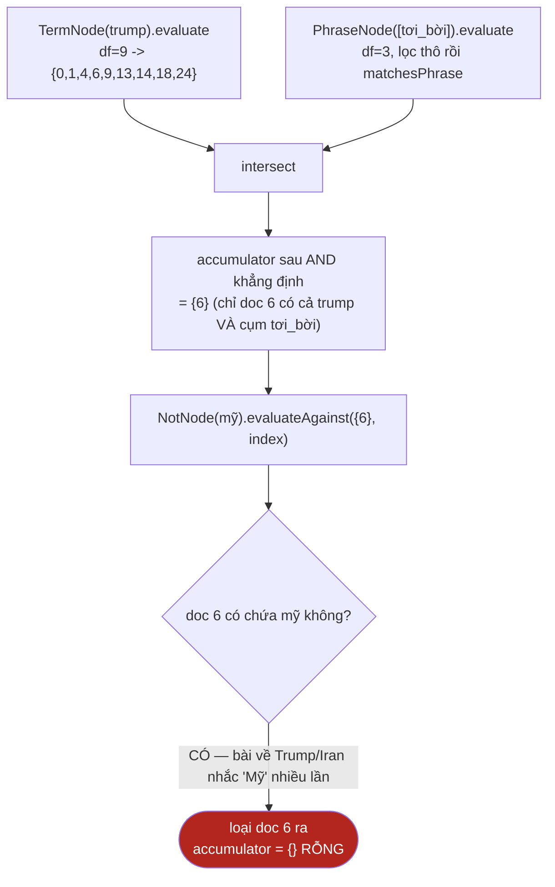

**Kết quả thật:**

```
df(trump)=9, df(tơi_bời)=3, df(mỹ)=9
candidates = []
dropped    = []
```

★★ Chú ý dòng cuối: `dropped = []` — **không phải** `[trump]` hay bất kỳ
term nào. `resolve()` **có** gọi `relaxAndRetry` (vì candidates rỗng ở giai
đoạn 1), nhưng `relaxAndRetry` chỉ có quyền bỏ bớt phần tử trong `mustTerms`
— ở truy vấn này `mustTerms = [trump]`, chỉ có đúng một phần tử. Điều kiện
dừng `while (remaining.size() > 1)` ở [mục 42](#42-hai-bước-nới-lỏng-theo-đúng-thứ-tự-idf-tăng-dần)
không cho vòng lặp chạy (kích thước đã là 1, không lớn hơn 1), nên không có gì
để thử. Nguyên nhân thật sự khiến kết quả rỗng — mệnh đề `NOT mỹ` loại bỏ
đúng tài liệu duy nhất khớp phần khẳng định — nằm **ngoài phạm vi** mà giai
đoạn 2 được phép động vào (theo đúng nguyên tắc ở
[mục 41](#41--vì-sao-cái-gì-không-bao-giờ-bị-bỏ-quan-trọng-hơn-cái-gì-bị-bỏ):
loại trừ là ý định tường minh, không phải suy diễn của hệ thống).

Đây là ví dụ thật cho câu hỏi FAQ "vì sao truy vấn của tôi vẫn 0 kết quả dù hệ
thống có cơ chế nới lỏng?" — xem thêm [mục 56](#56-câu-hỏi-thường-gặp).

---

## 50. Truy vấn 3: `trump OR iran` — hợp

Cây AST: `AndNode[OrNode[TermNode(trump), TermNode(iran)]]` (một `AndNode` bọc
ngoài với duy nhất một con là `OrNode` — do `buildAst` luôn bọc mọi mệnh đề
khẳng định trong một `AndNode`, kể cả khi chỉ có một mệnh đề).

**Kết quả thật:**

```
candidates = [0, 1, 4, 6, 9, 13, 14, 18, 24]
```

9 tài liệu — đúng bằng `df(trump) ∪ df(iran)` sau khi loại trùng, và vì mọi
tài liệu chứa `iran` (4 tài liệu: 0, 6, 14, 18) đều **cũng** chứa `trump`
(tập con của tập 9 tài liệu chứa `trump`), `union` ở đây thực chất cho kết quả
trùng khít với tập `df(trump)` — minh hoạ trực quan lý do
`OrNode.estimatedSize` chỉ là **chặn trên** (mục 25): tổng `9 + 4 = 13` nhưng
kết quả thật chỉ có 9, vì 4 tài liệu trùng lặp hoàn toàn.

So với truy vấn 1 (`trump iran`, AND, 4 kết quả), truy vấn này (OR) cho **hơn
gấp đôi** số kết quả — đúng trực giác: OR luôn cho tập kết quả lớn hơn hoặc
bằng AND của cùng cặp term.

---

## 51. Truy vấn 4: `sài gòn site:vnexpress.net` — lọc domain

Cây AST chỉ còn `AndNode[TermNode(sài_gòn)]`; `site:vnexpress.net` không nằm
trong cây — nó là `parsed.siteFilter()`, được `DomainFilter` áp dụng ở tầng
lọc sau truy hồi.

**Trước `DomainFilter`** (`ast.evaluate` một mình): posting list của
`sài_gòn` có `df=4`.

**Kết quả thật sau `applyFilters`:**

```
candidates = [2, 20, 21, 32]
```

| docId | title | host |
|---|---|---|
| 2 | Tin tức TP HCM 24h mới nhất, báo **Sài Gòn** mới hàng ngày | `vnexpress.net` |
| 20 | Tin nóng — Báo VnExpress | `vnexpress.net` |
| 21 | Diễn đàn chia sẻ kinh nghiệm, quan điểm xã hội, dân sinh — VnExpress | `vnexpress.net` |
| 32 | Tâm sự — Diễn đàn tư vấn tình yêu, gia đình, cuộc sống — VnExpress | `vnexpress.net` |

Toàn bộ 40 tài liệu của corpus này đều thuộc `vnexpress.net` hoặc
`e.vnexpress.net`, nên trên corpus nhỏ này `DomainFilter` **không loại thêm
tài liệu nào** so với trước lọc (`4 → 4`) — một minh hoạ trung thực rằng hiệu
ứng của `site:` chỉ rõ rệt trên corpus đa domain thật (hàng nghìn trang từ
nhiều báo khác nhau), không phải trên bộ seed nhỏ dùng để trace tài liệu này.
`DomainFilter` khớp theo hậu tố (mục 37): nếu một trong bốn tài liệu trên
thuộc `sport.vnexpress.net`, nó vẫn được giữ lại vì host đó kết thúc bằng
`.vnexpress.net`.

---

## 52. Truy vấn 5: `trump khủng long iran` — nới lỏng thật

Đây là ví dụ **thật** của giai đoạn 2 thực sự làm việc — khác truy vấn 2
(mục 49), lần này nguyên nhân rỗng NẰM ĐÚNG trong phạm vi `relaxAndRetry` được
phép sửa.

`khủng long` tokenize thành `khủng_long` — một từ ghép **không có trong
corpus 40 tài liệu này** (`df(khủng_long) = 0`, tin thời sự không nói về
khủng long).

**Giai đoạn 1** (đầy đủ): `AndNode[Term(trump), Term(khủng_long), Term(iran)]`
— shortest-first đưa `khủng_long` (df=0) lên đầu, `accumulator` khởi đầu đã
**rỗng**, và mọi phép giao sau đó dừng ngay (rỗng là phần tử hấp thụ, mục 22).
`candidates` rỗng → chuyển sang giai đoạn 2.

**Giai đoạn 2:** `isUnmatchable` kiểm tra `phrases` (rỗng — không áp dụng) và
`orGroups` (rỗng — không áp dụng) → không unmatchable, tiếp tục. Bước 1
(`removeIf df==0`) bắt đúng `khủng_long`:

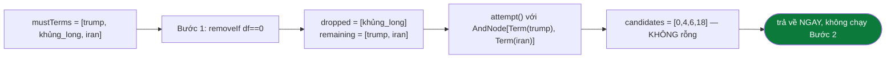

**Kết quả thật:**

```
candidates = [0, 4, 6, 18]
dropped    = [khủng_long]
```

Trùng khớp **chính xác** với kết quả của truy vấn 1 (`trump iran`) ở mục 48 —
đúng như kỳ vọng, vì sau khi bỏ `khủng_long`, truy vấn còn lại đúng là
`trump AND iran`. `droppedTerms=[khủng_long]` được trả ra trong
`SearchResponse`, để client hiển thị kiểu "không có kết quả chính xác cho
'khủng long', hiển thị kết quả gần đúng cho 'trump iran'".

★ Một biến thể ngắn hơn, `trump khủng long` (không có `iran`), cho ra 9 ứng
viên **giống hệt** tập kết quả của truy vấn 3 (`trump OR iran`, mục 50) —
không phải trùng hợp: sau khi bỏ `khủng_long`, `mustTerms` chỉ còn `[trump]`,
và `AndNode` với một con duy nhất trả về đúng posting list của `trump`, tình
cờ đúng bằng tập `trump ∪ iran` vì (đã nêu ở mục 50) mọi tài liệu chứa `iran`
đều cũng chứa `trump`.

---

# PHẦN XIII — PHỤ LỤC

---

## 53. Chế độ suy biến và trần tham số

`CRAWLER-PIPELINE.md` dành một mục phụ lục cho "chế độ chạy khác" (Kafka). Tầng
truy vấn không có chế độ chạy thay thế, nhưng có **bốn trạng thái suy biến** mà
mã nguồn xử lý tường minh — và chúng là nguồn của gần như mọi báo lỗi "tìm không
ra" mà không phải lỗi thuật toán.

### 53.1 Trần tham số — `SearchController` kẹp trước, `facade` không kiểm lại

```java
private static final int MAX_PAGE = 1_000;
private static final int MAX_SIZE = 100;
private static final int DEFAULT_SIZE = 20;

@GetMapping("/search")
public SearchResponse search(@RequestParam("q") String q, ... ) {
    int safePage = Math.min(Math.max(page, 1), MAX_PAGE);
    int safeSize = size < 1 || size > MAX_SIZE ? DEFAULT_SIZE : size;
    return facade.search(q, safePage, safeSize);
}
```

| Tham số client gửi | Giá trị thực dùng | Lý do |
|---|---|---|
| `page = 0` hoặc âm | `1` | `Math.max(page, 1)` |
| `page = 999_999` | `1_000` | chặn tràn `int` khi tính `topN = page * size` |
| `size = 0` hoặc âm | `20` | `DEFAULT_SIZE` |
| `size = 5_000` | `20` — **không** phải `100` | biểu thức là `size < 1 \|\| size > MAX_SIZE ? DEFAULT_SIZE` — vượt trần thì **rơi về mặc định**, không bị kẹp xuống trần |

★ Chi tiết cuối cùng dễ đọc nhầm nhất: `size = 5_000` **không** cho 100 kết quả,
mà cho 20. Đây là lựa chọn có chủ ý — một client gửi `size` vô lý nhiều khả năng
đang gửi nhầm tham số, và trả về đúng trang mặc định an toàn hơn là trả về trang
lớn nhất có thể.

### 53.2 Chế độ chỉ mục rỗng

Khi `SearchEngineFacade.init()` không tìm được nguồn corpus nào, `index` là một
`InvertedIndex` rỗng (chi tiết ở `INDEX-PIPELINE.md`). Tầng truy vấn **không có
nhánh riêng** cho trường hợp này — nó chạy nguyên vẹn cả pipeline:

```
   q="trump iran"
   → QueryParser.parse       → ParsedQuery{mustTerms=[trump, iran]}     (bình thường)
   → buildAst                → AndNode[Term(trump), Term(iran)]         (bình thường)
   → AndNode.evaluate        → getPostings("trump") = rỗng → giao = rỗng
   → GIAI ĐOẠN 2 nới lỏng    → isUnmatchable: MỌI term đều df=0
                             → thoát sớm, KHÔNG thử lại lần nào
   → SearchResponse{totalResults=0, results=[], droppedTerms=[]}   HTTP 200
```

⚠ `droppedTerms` **rỗng**, không phải chứa cả hai term. Người đọc log dễ kết
luận nhầm rằng truy vấn "khớp nhưng không có tài liệu"; thực tế là chỉ mục trống.
Phân biệt bằng `/api/health` hoặc `totalDocs`, không bằng phản hồi tìm kiếm.

### 53.3 Truy vấn rỗng

`facade.search` chuẩn hoá trước mọi thứ khác:

```java
String normalizedQuery = rawQuery == null ? "" : rawQuery.trim();
```

`q=` (rỗng), `q=%20%20` (toàn khoảng trắng) và `q` thiếu hẳn đều quy về cùng một
chuỗi rỗng → `ParsedQuery` rỗng → `AndNode` không có con → tập ứng viên rỗng.
Không ngoại lệ nào được ném; phản hồi vẫn là `200` với `totalResults = 0`.

### 53.4 ⚠ `cacheKey` viết thường — hai truy vấn khác nhau dùng chung một ô

```java
String cacheKey = normalizedQuery.toLowerCase(Locale.ROOT) + "|p" + page + "|s" + size;
```

Khoá cache viết thường, nhưng đối tượng `SearchResponse` được cất lại mang
`normalizedQuery` **nguyên dạng hoa/thường của lần gọi đầu tiên**. Hệ quả quan
sát được:

```
   1. GET /api/search?q=trump        → miss → tính thật → cất  key="trump|p1|s20"
                                             response.query = "trump"
   2. GET /api/search?q=TRUMP        → HIT   key="trump|p1|s20"
                                             response.query = "trump"   ← không phải "TRUMP"
```

Không ảnh hưởng tới **kết quả** (tokenizer vốn đã chuẩn hoá về chữ thường), chỉ
ảnh hưởng tới trường `query` phản chiếu trong phản hồi. ★ Nhưng nó có một hệ quả
đúng và có ích: `OR` phân biệt hoa/thường ở tầng phân tích cú pháp
(mục 12) **trước** khi cacheKey được tạo, nên `trump or iran` và `trump OR iran`
là hai truy vấn khác nhau thật sự — và chúng cũng có hai ô cache khác nhau, vì
`toLowerCase` chỉ chạy trên chuỗi đã phân tích xong.

`Locale.ROOT` là bắt buộc, không phải trang trí: `toLowerCase()` không tham số
dùng locale mặc định của JVM, và trong locale Thổ Nhĩ Kỳ `"I".toLowerCase()` cho
ra `"ı"` (i không chấm) — đủ để cùng một truy vấn sinh hai khoá cache khác nhau
trên hai máy chủ cấu hình khác nhau.

### 53.5 Chạm trần ứng viên

| Trần | Giá trị | Xảy ra khi | Hệ quả |
|---|---|---|---|
| `DEFAULT_MAX_CANDIDATES` | `10_000` | một term rất phổ biến (`df` lớn) qua được mọi bộ lọc | danh sách ứng viên bị **cắt cụt** trước khi chấm điểm |

⚠ Cắt cụt xảy ra **trước** `ResultRanker`, nên tài liệu bị cắt không bao giờ có
cơ hội được chấm điểm — kể cả khi nó lẽ ra đứng đầu. Đây là đánh đổi có ý thức
và là điểm khác biệt lớn nhất giữa cài đặt này và một hệ WAND/MaxScore thật
(mục 38).

---

## 54. Bảng hằng số toàn hệ thống

| Hằng số | Giá trị | File | Ý nghĩa |
|---|---|---|---|
| `MAX_PAGE` | `1_000` | `SearchController` | Trần `page`, chặn tràn `int` khi tính `topN = page * size` |
| `MAX_SIZE` | `100` | `SearchController` | Trần `size` mỗi trang |
| `DEFAULT_SIZE` | `20` | `SearchController` | `size` dùng khi tham số ngoài khoảng hợp lệ |
| `PHRASE_PATTERN` | `"([^"]*)"` | `QueryParser` | Regex cắt cụm từ trong ngoặc kép, biên dịch sẵn một lần |
| `OR_KEYWORD` | `"OR"` | `QueryParser` | Từ khoá nhận diện nhóm lựa chọn (phân biệt hoa/thường — chỉ `OR` viết hoa mới hợp lệ) |
| `SITE_PREFIX` | `"site:"` | `QueryParser` | Tiền tố nhận diện ràng buộc domain |
| `DEFAULT_MAX_CANDIDATES` | `10_000` | `MaxCandidatesFilter` | Trần số ứng viên đưa sang khâu chấm điểm |
| *(không hằng số riêng)* `app.search.cache-size` | `200` (mặc định Spring `@Value`) | `SearchEngineFacade` | Sức chứa `LRUCache<String, SearchResponse>` |

---

## 55. Bảng tra nhanh khối ↔ file ↔ hàm

| Khối trong sơ đồ | File | Hàm |
|---|---|---|
| Chặn `page`/`size` | `controller/SearchController.java` | `search()` |
| Điều phối toàn pipeline | `service/SearchEngineFacade.java` | `search()` |
| Chụp trạng thái 1 lần | `service/SearchEngineFacade.java` | `search()` — 4 dòng đầu |
| `cacheKey`, LRU | `service/SearchEngineFacade.java` + `datastructure/LRUCache.java` | `search()`, `LRUCache.get/put` |
| Cắt cụm ngoặc kép | `query/QueryParser.java` | `parse()` — Bước 1 |
| Quét `site:`/`OR`/`-loại_trừ` | `query/QueryParser.java` | `parse()` — Bước 2 |
| Tokenize | `query/QueryParser.java` + `index/VietnameseTokenizer.java` | `tokenizeToTerms()`, `tokenize()` |
| Dựng cây AST | `query/QueryParser.java` | `buildAst()` |
| Tần suất truy vấn | `query/CandidateResolver.java` | `buildQueryTermFrequency()` |
| Đánh giá AND | `query/ast/AndNode.java` | `evaluate()` |
| Đánh giá OR | `query/ast/OrNode.java` | `evaluate()` |
| Đánh giá cụm từ | `query/ast/PhraseNode.java` + `query/PostingListMerger.java` | `evaluate()`, `matchesPhrase()` |
| Loại trừ | `query/ast/NotNode.java` | `evaluateAgainst()` |
| Giao/hợp posting list | `query/PostingListMerger.java` | `intersect()`, `union()`, `intersectCursors()` |
| Lọc domain | `query/filter/DomainFilter.java` | `apply()` |
| Chặn trần ứng viên | `query/filter/MaxCandidatesFilter.java` | `apply()` |
| Nới lỏng truy vấn | `query/CandidateResolver.java` | `relaxAndRetry()`, `attempt()`, `isUnmatchable()` |
| Bàn giao xếp hạng | `ranking/ResultRanker.java` | `rank()` (chi tiết: `docs2/RANKING-PIPELINE.md`) |
| Cắt trang | `service/SearchEngineFacade.java` | `search()` — đoạn cuối |
| Học gợi ý | `service/SuggestionService.java` | `learnFromQuery()` |

---

## 56. Câu hỏi thường gặp

**1. Vì sao gõ `"máy tính"` (có ngoặc kép quanh MỘT từ ghép) lại không có gì
đặc biệt so với gõ `máy tính` (không ngoặc)?**
Vì `PhraseNode` với một cụm chỉ chứa đúng một token sau tokenize hoạt động
giống hệt `TermNode` — điều kiện "liên tiếp" của một chuỗi một-phần-tử luôn
đúng. Ngoặc kép chỉ tạo khác biệt thật khi cụm tokenize ra **từ hai token trở
lên**.

**2. Vì sao `NOT` một mình luôn cho kết quả rỗng, ngay cả khi có tài liệu thật
sự không chứa từ đó?**
`NotNode.evaluate()` không được cài đặt theo hợp đồng thông thường — nó ném
`UnsupportedOperationException` (mục 26.1). Nhưng thực tế người dùng không
bao giờ chạm được lỗi này: `buildAst` (mục 16) đặt mọi `NotNode` **sau** khi
đã kiểm tra `children.isEmpty()`, nên một truy vấn chỉ toàn dấu trừ nhận
`ast == null` và trả về tập rỗng ngay từ `resolve()`, không hề tạo ra một
`AndNode` toàn `NotNode`.

**3. Vì sao truy vấn nới lỏng vẫn chấm điểm theo truy vấn gốc, không phải
theo truy vấn đã bị bỏ bớt term?**
`queryTermFrequency` được tính **một lần duy nhất** ở đầu `resolve()`
(mục 31), từ `parsed` gốc — trước khi biết liệu có nới lỏng hay không. Mọi
lần gọi `attempt()` trong giai đoạn 2 đều tái sử dụng đúng `Map` đó
(mục 43), không tính lại. Mục đích: tài liệu khớp 4/5 term của truy vấn gốc
vẫn xếp trên tài liệu chỉ khớp 3/5, dù cả hai đều "qua" được vòng lọc rút gọn.

**4. Vì sao một nhóm `OR` chỉ còn một vế lại "hạ cấp" thành một `mustTerm`
thay vì vẫn là một `OrNode` một-con?**
Về mặt kết quả, `OrNode` với một con duy nhất và `TermNode` đó đứng thẳng
trong `AndNode` cho ra **kết quả giống hệt nhau** — `union(List.of(),
child.evaluate())` (mục 25) chỉ là chính `child.evaluate()`. Giữ nó như một
`mustTerm` đơn giản hơn, tránh một tầng bọc thừa trong cây, và tránh
`estimatedSize` của `OrNode` (một phép cộng, dù chỉ cộng một số) chạy không
cần thiết.

**5. Vì sao `DomainFilter` không nằm trong cây `AndNode`, cùng chỗ với
`TermNode`?**
Vì `site:` không có posting list tương ứng — nó là ràng buộc trên URL của tài
liệu (siêu dữ liệu), không phải quan hệ boolean giữa các term (mục 37). Đưa
nó vào cây sẽ buộc phải dựng thêm chỉ mục phụ `host -> docIds`; với vài chục
ứng viên đã qua bước giao posting list, kiểm tra URL trực tiếp đơn giản hơn.

**6. Vì sao truy vấn của tôi bị nới lỏng (`droppedTerms` khác rỗng) nhưng
`totalResults` vẫn hiển thị một con số như thể mọi thứ bình thường?**
`totalResults = candidates.size()` sau `resolve()` — không phân biệt candidates
đến từ giai đoạn 1 (đầy đủ) hay giai đoạn 2 (nới lỏng). Client cần nhìn riêng
trường `droppedTerms` (không rỗng) để biết kết quả đang hiển thị ứng với một
truy vấn hẹp hơn — xem mục 45.

**7. Vì sao truy vấn hai term phổ biến như `trump iran` (mục 48) lại nhanh
hơn nhiều so với việc duyệt toàn bộ posting list của từng term rồi so sánh thủ
công?**
Nhờ `intersect` two-pointer `O(m+n)` (mục 33.1) thay vì `HashSet.retainAll`
(chậm hơn tới 2,7 lần theo đo thực tế trên danh sách 500.000 phần tử) và nhờ
shortest-first (mục 23) đảm bảo phía giao luôn bắt đầu từ tập nhỏ nhất.

**8. Truy vấn `-mỹ` một mình (không có must term nào khác) trả về gì?**
Rỗng, và **không** thông qua cơ chế nới lỏng nào — `buildAst` trả `null` vì
`children` rỗng tại thời điểm kiểm tra (chỉ có `NotNode`, chưa được thêm vào),
`resolve()` trả `ResolvedQuery(List.of(), queryTermFrequency)` ngay, không gọi
`ast.evaluate()`, không gọi `relaxAndRetry` (mục 39: `relaxAndRetry` yêu cầu
`mustTerms` không rỗng, thoát sớm nếu rỗng).

**9. Vì sao `site:` khớp theo hậu tố mà không khớp chính xác tuyệt đối?**
Để `site:vnexpress.net` bắt được cả các phụ miền như `sport.vnexpress.net`,
`e.vnexpress.net` — hành vi mà hầu hết máy tìm kiếm thật đều làm cho toán tử
`site:`, vì người dùng thường nghĩ về một "trang web" như một thực thể, không
phân biệt phụ miền.

**10. `MaxCandidatesFilter` với ngưỡng mặc định `10_000` có đảm bảo giữ đúng
top-10.000 điểm cao nhất không?**
Không. Vì posting list sắp theo **docId**, không theo điểm số, việc cắt
`subList(0, maxCandidates)` giữ 10.000 ứng viên **đầu tiên theo docId**, không
phải 10.000 ứng viên điểm cao nhất (mục 38). Đây là đánh đổi có ý thức —
Javadoc của lớp gọi rõ nó là "bảo vệ hệ thống khỏi truy vấn bất thường, không
phải một tối ưu xếp hạng" — khác hẳn WAND/MaxScore của các hệ thống production
lớn.

**11. Vì sao `QueryParser` nhận `Tokenizer` qua constructor thay vì tự
`new VietnameseTokenizer()` bên trong?**
Để **ép buộc** cùng một thực thể tokenizer (cùng từ điển, cùng cấu hình) được
dùng ở cả lúc dựng chỉ mục lẫn lúc phân tích truy vấn (mục 8). Nếu hai bên
lệch nhau — ví dụ index dùng từ điển 185.000 mục nhưng truy vấn dùng một
tokenizer mặc định nghèo hơn — mọi từ ghép sẽ tokenize khác nhau ở hai phía và
không bao giờ khớp, mà không có ngoại lệ hay log nào cảnh báo.

**12. `"tơi bời" trump -mỹ` (mục 49) và `trump khủng long iran` (mục 52) đều
trả về rỗng ở giai đoạn 1 — vì sao một cái được nới lỏng cứu sống, cái kia
không?**
Vì nguyên nhân rỗng khác nhau. Truy vấn thứ hai rỗng vì một `mustTerm`
(`khủng_long`) có `df=0` — đúng loại lỗi mà `relaxAndRetry` được thiết kế để
sửa. Truy vấn thứ nhất rỗng vì mệnh đề `NOT mỹ` loại bỏ đúng tài liệu duy nhất
khớp phần khẳng định — nằm ngoài phạm vi `relaxAndRetry` được phép sửa (chỉ
được rút bớt `mustTerms`, không được rút bớt `excludedTerms`).

---

## 57. Chẩn đoán sự cố

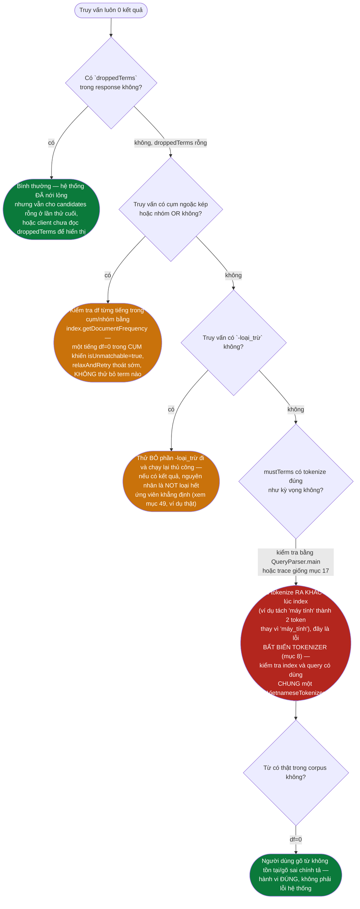

<details><summary>Xem bản chữ (ASCII)</summary>

```
Truy van luon 0 ket qua
  co droppedTerms? co -> BINH THUONG, he thong da noi long
                   khong ->
    co cum ngoac kep / nhom OR? co -> kiem tra df tung tieng trong cum/nhom
                                       mot tieng df=0 -> isUnmatchable=true
                                       -> relaxAndRetry thoat SOM, khong thu gi
                                khong ->
      co -loai_tru? co -> thu BO -loai_tru chay lai thu cong
                           neu co ket qua -> NOT loai het ung vien khang dinh
                    khong ->
        mustTerms tokenize dung ky vong? khong -> LOI BAT BIEN TOKENIZER
                                                    (index va query phai dung
                                                     CHUNG mot VietnameseTokenizer)
                                          co ->
          tu co that trong corpus (df>0)? khong -> nguoi dung go sai/tu khong ton tai
                                                     (dung, khong phai loi)
```
</details>

### 57.1 Bảng chẩn đoán nhanh khác

| Triệu chứng | Nguyên nhân khả dĩ | Kiểm tra ở |
|---|---|---|
| Truy vấn chậm bất thường khi số ứng viên rất lớn | `MaxCandidatesFilter` chưa kịp cắt (candidates < 10.000 nhưng vẫn nhiều), hoặc quá nhiều `PhraseNode` chạy `matchesPhrase` trên tập lớn | mục 38, mục 25 (lọc thô của `PhraseNode`) |
| Kết quả `site:abc.vn` trả về tài liệu của domain khác hẳn | `DomainFilter` khớp theo hậu tố — kiểm tra domain khác có VÔ TÌNH kết thúc bằng `.abc.vn` không | mục 37 |
| `OR` không hoạt động, cả cụm bị coi như must-term thường | `OR` viết thường/hoa lẫn (`or`), hoặc đứng đầu/cuối câu — điều kiện `!mustRaw.isEmpty()` không thoả | mục 12 |
| Cache trả kết quả cũ dù vừa reindex | `cacheKey` không đổi (cùng query/page/size) trong khi `searchCache` bị thay bằng instance mới sau reindex — chính là lý do phải chụp `cache` vào biến cục bộ TRƯỚC khi `get`/`put` cùng một request | mục 10 |
| `elapsedMs`/`timeTakenMs` rất nhỏ cho một truy vấn "nặng" | Đó là cache hit — thời gian ghi trong response là thời gian của lần tính GỐC, không phải request hiện tại | mục 7 |

---

## 58. Thuật ngữ

| Thuật ngữ | Nghĩa trong ngữ cảnh tài liệu này |
|---|---|
| **AST** (Abstract Syntax Tree) | Cây biểu thức truy vấn — `QueryNode` và các cài đặt của nó |
| **Composite pattern** | Mẫu thiết kế cho phép nút lá và nút trong dùng chung một giao diện, gọi đệ quy tự nhiên — dùng cho `QueryNode` |
| **Chain of Responsibility** | Mẫu thiết kế cho một chuỗi các bộ xử lý độc lập, mỗi bộ có thể xử lý hoặc bỏ qua — dùng cho `CandidateFilter` |
| **Posting list** | Danh sách các `(docId, tf, positions[])` cho một term, sắp tăng dần theo docId |
| **`df` (document frequency)** | Số tài liệu chứa một term — độ dài của posting list |
| **Two-pointer / merge kiểu merge-sort** | Thuật toán giao/hợp hai danh sách đã sắp xếp bằng hai con trỏ tiến song song, `O(m+n)` |
| **Galloping search** | Kỹ thuật nhảy cóc (thay vì bước từng bước) khi giao hai danh sách chênh lệch kích thước lớn — `PostingCursor.skipTo` |
| **Shortest-first** | Chiến lược sắp xếp các toán hạng của một phép giao theo kích thước tăng dần trước khi thực thi, để kết quả trung gian nhỏ ngay từ đầu |
| **Filter-and-refine** | Chiến lược lọc bằng điều kiện rẻ-nhưng-yếu trước, rồi mới kiểm tra điều kiện đắt-nhưng-chính-xác trên tập đã thu hẹp — dùng trong `PhraseNode` |
| **Rỗng là phần tử hấp thụ** | Tính chất: giao của bất kỳ tập nào với tập rỗng luôn là tập rỗng — dùng để dừng sớm các vòng lặp giao/lọc liên tiếp |
| **Nới lỏng truy vấn (query relaxation)** | Bỏ bớt một số điều kiện AND ngầm định khi truy vấn đầy đủ cho ra rỗng, để trả về kết quả gần đúng thay vì trang trắng |
| **`ParsedQuery`** | Cấu trúc dữ liệu phẳng (5 danh sách/trường) là đầu ra của `QueryParser.parse()`, đầu vào của `buildAst()` |
| **`ResolvedQuery`** | Cấu trúc dữ liệu là đầu ra của `CandidateResolver.resolve()`: `candidateDocIds`, `queryTermFrequency`, `droppedTerms` |

---

## 59. Toàn cảnh một trang

```
GET /api/search?q=…&page=1&size=10
└─ SearchController.search
   └─ SearchEngineFacade.search(rawQuery, page, size)                ★ ĐIỂM VÀO
      ├─ chụp MỘT lần vào biến cục bộ: index, scorer, pageRankScores, searchCache
      │  ↳ một lần reindex xen giữa không được phép ghép chỉ mục CŨ với PageRank MỚI
      ├─ cacheKey = lower(query) + "|p" + page + "|s" + size
      │  └─ LRUCache.get → trúng thì cacheHits++ và TRẢ NGAY
      ├─ QueryParser.parse(query)                                    ─── PHÂN TÍCH
      │  ├─ Bước 1: PHRASE_PATTERN "\"([^\"]*)\"" cắt cụm RA KHỎI chuỗi
      │  │           phần ngoài ngoặc giữ lại → remaining
      │  │           ↳ nếu không cắt, tiếng trong cụm vừa là phrase vừa là mustTerm
      │  │             → đếm hai lần trong queryTermFrequency, lệch trọng số
      │  ├─ Bước 2: quét từng từ của remaining
      │  │  ├─ "site:vnexpress.net"  → siteFilter
      │  │  ├─ "A OR B OR C"         → gom một nhóm 3 phần tử (orGroups)
      │  │  ├─ "-từ"                 → excludedRaw
      │  │  └─ còn lại               → mustRaw
      │  └─ Bước 3: tokenize từng phần bằng CÙNG tokenizer với tầng chỉ mục
      │     ├─ mỗi cụm ngoặc kép: tokenize RIÊNG (một đơn vị độc lập)
      │     ├─ phần ngoài ngoặc: nối lại rồi tokenize CHUNG (đủ ngữ cảnh ghép từ ghép)
      │     └─ nhóm OR chỉ còn 1 vế → hạ xuống thành mustTerm
      │     → ParsedQuery(mustTerms, phrases, excludedTerms, orGroups, siteFilter)
      ├─ CandidateResolver.resolve(index, parsed)                    ─── TRUY HỒI
      │  ├─ buildQueryTermFrequency(parsed)   ← gồm CẢ term của cụm và của nhóm OR
      │  │  ↳ luôn tính từ truy vấn GỐC, kể cả khi nới lỏng
      │  ├─ QueryParser.buildAst(parsed)                             (Composite)
      │  │  └─ AndNode[ TermNode…, PhraseNode…, OrNode…, NotNode… ]
      │  │     ↳ không mệnh đề khẳng định nào → null → trả rỗng ngay
      │  ├─ ast.evaluate(index)                          ─── GIAI ĐOẠN 1
      │  │  └─ AndNode.evaluate
      │  │     ├─ tách con thành positives / negatives
      │  │     ├─ positives rỗng → UnsupportedOperationException ("chỉ toàn NOT")
      │  │     ├─ sort theo estimatedSize(index)         ← SHORTEST-FIRST
      │  │     │  ├─ TermNode.estimatedSize   = df, O(1)
      │  │     │  ├─ PhraseNode.estimatedSize = min df của các tiếng
      │  │     │  └─ OrNode.estimatedSize     = tổng con (chặn trên)
      │  │     ├─ accumulator = con NHỎ NHẤT .evaluate
      │  │     │  ├─ TermNode   → PostingListMerger.docIdsOf(index.getPostings(term))
      │  │     │  ├─ OrNode     → union hai con, two-pointer O(m+n)
      │  │     │  └─ PhraseNode → AndNode(các tiếng).evaluate   ← lọc THÔ
      │  │     │                  → ∀ docId: matchesPhrase(index, terms, docId)  ← lọc CHÍNH XÁC
      │  │     │                     ↳ so mảng vị trí: pos(t[k+1]) == pos(t[k]) + 1
      │  │     ├─ ∀ con còn lại: intersect(accumulator, con.evaluate)
      │  │     │  ↳ rỗng là phần tử HẤP THỤ của phép giao → dừng ngay
      │  │     └─ ∀ NotNode: evaluateAgainst(accumulator, index)
      │  │        ↳ trừ tập bằng two-pointer O(m+n) — cả hai danh sách đều tăng dần
      │  ├─ applyFilters(candidates)                     (Chain of Responsibility)
      │  │  ├─ DomainFilter        (chỉ chạy khi có site:)  → giữ doc cùng host
      │  │  └─ MaxCandidatesFilter  DEFAULT_MAX_CANDIDATES = 10 000
      │  │     ↳ rỗng là phần tử hấp thụ → gặp rỗng thì dừng cả chuỗi
      │  └─ rỗng → relaxAndRetry                         ─── GIAI ĐOẠN 2 (nới lỏng)
      │     ├─ isUnmatchable? (cụm có tiếng df = 0, hoặc nhóm OR không vế nào tồn tại)
      │     │  → thoát ngay, khỏi thử k lần vô ích
      │     ├─ Bước 1: bỏ MỘT LẦN tất cả term có df = 0 → attempt()
      │     ├─ Bước 2: sort theo df GIẢM DẦN, bỏ dần từng term phổ biến nhất → attempt()
      │     │          (dừng khi còn 1 term)
      │     └─ droppedTerms trả ra ngoài → hiển thị cho người dùng, KHÔNG bỏ qua âm thầm
      │     ↳ điểm vẫn chấm theo truy vấn GỐC: khớp 4/5 term vẫn trên khớp 3/5
      ├─ ResultRanker.rank(candidates, qtf, index, scorer, pageRank, topN)  ─── XẾP HẠNG
      │  └─ (chi tiết công thức BM25 + Decorator PageRank/title + snippet:
      │      xem docs2/RANKING-PIPELINE.md)
      ├─ cắt trang: fromIndex = (max(page,1) − 1)·size,  toIndex = từ + size
      ├─ SearchResponse(query, totalHits, page, size ĐÃ ÁP DỤNG, elapsedMs, results, droppedTerms)
      ├─ cache.put(cacheKey, response)
      └─ candidates không rỗng → SuggestionService.learnFromQuery(query)
         ↳ chỉ học từ truy vấn CÓ kết quả, để không học phải lỗi chính tả
```

Cây biểu thức của các truy vấn mẫu dùng xuyên suốt tài liệu (dữ liệu thật, xem
PHẦN XII):

```
trump iran
└─ AndNode[ Term(trump), Term(iran) ]                       → 4 kết quả

"tơi bời" trump -mỹ
└─ AndNode[ Term(trump), Phrase(tơi_bời), Not(Term(mỹ)) ]    → 0 kết quả (do NOT, KHÔNG nới lỏng được)

trump OR iran
└─ AndNode[ Or[ Term(trump), Term(iran) ] ]                  → 9 kết quả

sài gòn site:vnexpress.net
└─ AndNode[ Term(sài_gòn) ]  + DomainFilter("vnexpress.net") → 4 kết quả

trump khủng long iran
└─ AndNode[ Term(trump), Term(khủng_long) df=0, Term(iran) ] → 0 → nới lỏng
   └─ bỏ khủng_long → AndNode[ Term(trump), Term(iran) ]     → 4 kết quả, droppedTerms=[khủng_long]
```

Vì sao NOT không tự đánh giá được:

```
NotNode.evaluate           → UnsupportedOperationException
NotNode.evaluateAgainst(…) → đường ĐÚNG, luôn trừ trên một tập ứng viên có sẵn
  ↳ phủ định độc lập sẽ trả về gần như TOÀN BỘ corpus — đúng về mặt tập hợp,
    vô dụng về mặt tìm kiếm, và tốn bộ nhớ đúng bằng cỡ corpus
```

---

## 60. Cây gọi đầy đủ kèm file và số dòng

> Bảng tra nhanh ở [mục 55](#55-bảng-tra-nhanh-khối--file--hàm) trả lời câu hỏi
> "khối này nằm ở file nào". Mục này trả lời câu hỏi ngược lại và chi tiết hơn:
> **một request đi qua đúng những dòng nào, theo đúng thứ tự nào.** Mỗi nhánh
> ghi `đường-dẫn-file:dòng → Class.method`. Số dòng ứng với mã nguồn tại thời
> điểm viết tài liệu; tên hàm mới là thứ bền, số dòng chỉ để nhảy nhanh.

Ba gốc đường dẫn dùng trong cây:

| Viết tắt trong cây | Đường dẫn đầy đủ |
|---|---|
| *(mặc định)* | `backend/java/libs/core-search/src/main/java/com/vnsearch/` |
| `search-service/` | `backend/java/services/search-service/src/main/java/com/vnsearch/` |
| `core-common/` | `backend/java/libs/core-common/src/main/java/com/vnsearch/` |

```
GET /api/search?q=…&page=1&size=10

├─ search-service/controller/SearchController.java
│  :43  @GetMapping("/search")
│  :44  SearchController.search(q, page, size)
│  :47  safePage = min(max(page,1), SearchController.MAX_PAGE=1_000)      (:31)
│  :48  safeSize = (size<1 || size>MAX_SIZE=100) ? DEFAULT_SIZE=20 : size (:34,:35)
│  :49  → SearchEngineFacade.search(q, safePage, safeSize)
│
└─ service/SearchEngineFacade.java
   :281  SearchEngineFacade.search(rawQuery, page, size)                  ★ ĐIỂM VÀO
   │
   ├─ :282  start = System.currentTimeMillis()
   ├─ :283  normalizedQuery = rawQuery == null ? "" : rawQuery.trim()
   │
   ├─ 🔒 CHỤP 4 TRƯỜNG volatile VÀO BIẾN CỤC BỘ                     (:287–:294)
   │  ├─ :112 SearchEngineFacade.searchCache    → :287 `cache`
   │  │        ghi bởi SearchEngineFacade.init()                 (:134)
   │  │                SearchEngineFacade.refreshDerivedState()  (:253)
   │  ├─ :108 SearchEngineFacade.index          → :288 `currentIndex`
   │  │        ghi bởi constructor (:129), init() (:139), loadCorpus() (:163,:192),
   │  │                startCrawl() lambda (:350), reindex() (:405)
   │  ├─ :111 SearchEngineFacade.scorer         → :289 `currentScorer`
   │  │        ghi bởi refreshDerivedState() (:251  ScorerFactory.create)
   │  └─ :110 SearchEngineFacade.pageRankScores → :294 `currentPageRank`
   │           ghi bởi refreshDerivedState() (:248  PageRankService.computePageRank)
   │  ↳ cả 4 bị ghi lại bởi refreshDerivedState(), gọi từ reindex() (:407) và
   │    lambda startCrawl() (:352) trên LUỒNG KHÁC → đọc thẳng trường sẽ ghép
   │    chỉ mục CŨ với PageRank MỚI, và ghi kết quả cũ vào cache MỚI ở :330
   │
   ├─ :296  cacheKey = normalizedQuery.toLowerCase(Locale.ROOT) + "|p"+page + "|s"+size
   ├─ :297  core-common/datastructure/LRUCache.java:75
   │        LRUCache.get(cacheKey) → :78 map.get, :82 LRUCache.moveToFront (:142)
   │        └─ khác null → :299 cacheHits.incrementAndGet() và TRẢ NGAY
   ├─ :302  cacheMisses.incrementAndGet()
   │
   ├─ :304  query/QueryParser.java:79
   │        QueryParser.parse(normalizedQuery)                     ─── PHÂN TÍCH
   │  ├─ Bước 1 (:84–:99) cắt cụm ngoặc kép RA KHỎI chuỗi
   │  │  ├─ :42  QueryParser.PHRASE_PATTERN = "\"([^\"]*)\""
   │  │  ├─ :92  Matcher.find → :93 remaining.append(phần NGOÀI ngoặc)
   │  │  │                     → :95 phrasesRaw.add(matcher.group(1))
   │  │  └─ :99  remaining.append(phần đuôi)
   │  │     ↳ không cắt thì tiếng trong cụm vừa là phrase vừa là mustTerm →
   │  │       CandidateResolver.buildQueryTermFrequency (:265) đếm hai lần
   │  ├─ Bước 2 (:101–:146) quét từng từ của `remaining`
   │  │  ├─ :114 startsWith(QueryParser.SITE_PREFIX="site:" :44) → :117 siteFilter
   │  │  ├─ :123 QueryParser.OR_KEYWORD="OR" (:43) → gom dãy OR liên tiếp (:131)
   │  │  │       thành MỘT nhóm → :137 orGroupsRaw.add(group)
   │  │  ├─ :142 word.startsWith("-")  → excludedRaw.add(word.substring(1))
   │  │  └─ :144 còn lại              → mustRaw.add(word)
   │  ├─ Bước 3 (:148–:176) QueryParser.tokenizeToTerms (:219)
   │  │        → VietnameseTokenizer.tokenize — CÙNG tokenizer với tầng chỉ mục
   │  │          (bất biến đặt ở SearchEngineFacade constructor :127)
   │  │  ├─ :152 mustTerms     = tokenizeToTerms(String.join(" ", mustRaw))     CHUNG
   │  │  ├─ :153 excludedTerms = tokenizeToTerms(String.join(" ", excludedRaw)) CHUNG
   │  │  │       ↳ nối lại rồi tokenize để Longest Matching đủ ngữ cảnh ghép từ ghép
   │  │  ├─ :157 mỗi cụm ngoặc kép: tokenizeToTerms RIÊNG (đơn vị độc lập)
   │  │  ├─ :167 mỗi vế OR: tokenizeToTerms rồi alternatives.addAll
   │  │  └─ :173 alternatives.size()==1 → mustTerms.add (OR một vế thành AND)
   │  └─ :176 → QueryParser.ParsedQuery (record :65)
   │            (mustTerms, phrases, excludedTerms, orGroups, siteFilter)
   │
   ├─ :307  query/CandidateResolver.java:90
   │        CandidateResolver.resolve(currentIndex, parsed)          ─── TRUY HỒI
   │  │     (static — không phải instance; :308 resolved.candidateDocIds())
   │  ├─ :91  CandidateResolver.buildQueryTermFrequency(parsed)           (:265)
   │  │        gộp mustTerms (:267) + term của phrases (:270) + term của orGroups (:275)
   │  │        ↳ luôn tính từ truy vấn GỐC, kể cả khi nới lỏng
   │  ├─ :94  CandidateResolver.AST_BUILDER (:61, QueryParser riêng không tokenizer)
   │  │        → QueryParser.buildAst(parsed) (:194)                 (Composite)
   │  │  ├─ :198 new TermNode(term)       cho mỗi mustTerm
   │  │  ├─ :201 new PhraseNode(phrase)   cho mỗi cụm
   │  │  ├─ :208 new OrNode(alternatives) cho mỗi nhóm OR
   │  │  ├─ :211 children rỗng → return null
   │  │  │       → CandidateResolver.resolve :95 trả ResolvedQuery rỗng NGAY
   │  │  ├─ :214 new NotNode(new TermNode(excluded)) — thêm SAU khi đã chốt :211
   │  │  └─ :216 return new AndNode(children)
   │  │
   │  ├─ :99  ast.evaluate(index)                        ─── GIAI ĐOẠN 1
   │  │  └─ query/ast/AndNode.java:30  AndNode.evaluate(index)
   │  │     ├─ :38  tách children: `child instanceof NotNode` → negatives / positives
   │  │     ├─ :44  positives.isEmpty() → :45 UnsupportedOperationException
   │  │     │        ("AND chỉ gồm NOT thì không đánh giá được")
   │  │     ├─ :50  positives.sort(Comparator.comparingInt(QueryNode::estimatedSize))
   │  │     │        ← SHORTEST-FIRST
   │  │     │  ├─ query/ast/TermNode.java:23   TermNode.estimatedSize
   │  │     │  │     = SearchIndex.getDocumentFrequency(term), O(1)           (:24)
   │  │     │  ├─ query/ast/PhraseNode.java:43 PhraseNode.estimatedSize
   │  │     │  │     = min getDocumentFrequency của các tiếng                 (:46)
   │  │     │  ├─ query/ast/OrNode.java:32     OrNode.estimatedSize
   │  │     │  │     = tổng con (chặn trên, đủ để sort ở AndNode cha)         (:37)
   │  │     │  └─ query/ast/NotNode.java:61    NotNode.estimatedSize
   │  │     │        = SearchIndex.getTotalDocs — bị AndNode.estimatedSize bỏ qua (:73)
   │  │     ├─ :52  accumulator = positives.get(0).evaluate(index)   ← con NHỎ NHẤT
   │  │     │  ├─ TermNode.java:18   TermNode.evaluate
   │  │     │  │     → query/PostingListMerger.java:54 PostingListMerger.docIdsOf(
   │  │     │  │       SearchIndex.getPostings(term))
   │  │     │  ├─ OrNode.java:23     OrNode.evaluate
   │  │     │  │     → PostingListMerger.java:86 PostingListMerger.union, two-pointer O(m+n)
   │  │     │  └─ PhraseNode.java:23 PhraseNode.evaluate
   │  │     │     ├─ :31 new AndNode(asTerms).evaluate(index)           ← lọc THÔ
   │  │     │     └─ :35 ∀ docId: PostingListMerger.matchesPhrase       ← lọc CHÍNH XÁC
   │  │     │           PostingListMerger.java:207
   │  │     │           ├─ :214 SearchIndex.getPositions(term_i, docId) — lấy MỘT lần,
   │  │     │           │        ngoài vòng lặp; length==0 → return false
   │  │     │           └─ :229 Arrays.binarySearch(positionsByTerm[i], start + i) < 0
   │  │     │                    (nhị phân trên dãy vị trí đã tăng dần, không quét
   │  │     │                     tuyến tính, không mở hộp Integer)
   │  │     ├─ :57  ∀ positives còn lại: PostingListMerger.intersect (PLM:63)
   │  │     │        :55 accumulator.isEmpty() → return List.of()
   │  │     │        (rỗng là phần tử HẤP THỤ của phép giao)
   │  │     └─ :64  ∀ negatives: NotNode.evaluateAgainst(accumulator, index)
   │  │              NotNode.java:40 — hai con trỏ, j chỉ tiến một chiều → O(m+n)
   │  │              (NotNode.evaluate :25 ném UnsupportedOperationException;
   │  │               evaluateAgainst mới là đường dùng thật)
   │  │
   │  ├─ :99  CandidateResolver.applyFilters(candidates, index, parsed)   (:113)
   │  │  │     (Chain of Responsibility — CandidateResolver.FILTERS :57)
   │  │  ├─ :117 candidates.isEmpty() → break cả chuỗi (rỗng là phần tử hấp thụ)
   │  │  ├─ :58  query/filter/DomainFilter.java
   │  │  │       ├─ :30 DomainFilter.isApplicable → parsed.siteFilter() != null
   │  │  │       ├─ :35 DomainFilter.apply → :43 DomainFilter.hostOf(doc.getUrl())
   │  │  │       │       :51 hostOf → URI.create(url).getHost() (:56), bỏ tiền tố "www."
   │  │  │       │       giữ doc khi host.equals(wanted) || host.endsWith("."+wanted)
   │  │  │       └─ :68 DomainFilter.name() = "site"
   │  │  └─ :59  query/filter/MaxCandidatesFilter.java
   │  │          ├─ :29 MaxCandidatesFilter.DEFAULT_MAX_CANDIDATES = 10_000
   │  │          ├─ :45 isApplicable → luôn true
   │  │          ├─ :50 apply → size<=max thì trả nguyên (không cấp phát),
   │  │          │       ngược lại :54 List.copyOf(subList(0, maxCandidates))
   │  │          └─ :58 name() = "max-candidates"
   │  │
   │  └─ :105 rỗng → CandidateResolver.relaxAndRetry    ─── GIAI ĐOẠN 2 (nới lỏng)
   │     │     :156
   │     ├─ :158 mustTerms rỗng → trả ResolvedQuery rỗng
   │     ├─ :165 CandidateResolver.isUnmatchable(index, parsed)           (:232)
   │     │        ├─ :234 phrase có tiếng getDocumentFrequency == 0 → true
   │     │        └─ :242 orGroup không vế nào df > 0 → true
   │     │        ↳ thoát ngay, khỏi thử k lần vô ích
   │     ├─ Bước 1 :173 remaining.removeIf(getDocumentFrequency(term)==0)
   │     │          bỏ TẤT CẢ term df=0 trong MỘT lần → :181 CandidateResolver.attempt
   │     ├─ Bước 2 :189 remaining.sort(comparingInt(index::getDocumentFrequency).reversed())
   │     │          → :191 dropped.add(remaining.remove(0)) — bỏ term PHỔ BIẾN nhất trước
   │     │          → :192 attempt; vòng lặp dừng khi remaining.size()==1 (:190)
   │     ├─ CandidateResolver.attempt (:206)
   │     │  ├─ :208 dựng ParsedQuery rút gọn — GIỮ NGUYÊN phrases, excludedTerms,
   │     │  │        orGroups, siteFilter (chỉ mustTerms bị rút)
   │     │  ├─ :213 AST_BUILDER.buildAst(relaxed) → null thì :215 return null
   │     │  ├─ :217 ast.evaluate + applyFilters → rỗng thì :219 return null
   │     │  └─ :222 new ResolvedQuery(candidates, queryTermFrequency, List.copyOf(dropped))
   │     └─ droppedTerms nằm trong CandidateResolver.ResolvedQuery (record :76,
   │        wasRelaxed :85) → trả ra ngoài cho người dùng, KHÔNG bỏ qua âm thầm
   │        ↳ điểm vẫn chấm theo queryTermFrequency GỐC: khớp 4/5 term vẫn trên 3/5
   │
   ├─ :310  topN = Math.max(page * size, size)
   ├─ :311  ranking/ResultRanker.java:88
   │        ResultRanker.rank(candidates, resolved.queryTermFrequency(), currentIndex,
   │                          currentScorer, currentPageRank, topN)    ─── XẾP HẠNG
   │  ├─ GĐ 0 :97  RelevanceScorer.prepare(queryTermFrequency, index)
   │  │              → DocumentScorer (idf + trọng số truy vấn tính MỘT lần)
   │  ├─ GĐ 1 :100–:109  ∀ docId: SearchIndex.getDocument, pageRankScores.getOrDefault,
   │  │              DocumentScorer.score(docId) → ResultRanker.ScoredCandidate (:73)
   │  ├─ GĐ 2 :112  MinHeap.topK(scored, topN, comparingDouble(ScoredCandidate::finalScore))
   │  │              O(c log K) thay vì O(c log c)
   │  └─ GĐ 3 :116–:130  CHỈ top-K mới sinh snippet:
   │              QuerySyllables.from(queryTermFrequency.keySet()) (:116)
   │              SnippetBuilder.build(SearchIndex.getBodyText(docId), syllables) (:128)
   │              → ResultRanker.RankedResult (record :68)
   │        (công thức BM25 + Decorator PageRank/title: docs/RANKING-PIPELINE.md)
   │
   ├─ :315  fromIndex = min((max(page,1) − 1) * size, ranked.size())
   ├─ :316  toIndex   = min(fromIndex + size, ranked.size())
   ├─ :318  ∀ ResultRanker.RankedResult trong subList(fromIndex, toIndex)
   │        → new SearchResult(document.getTitle(), getUrl(), snippet(),
   │                           finalScore(), pageRankScore(), getCrawledAt())
   ├─ :324  elapsed = System.currentTimeMillis() − start
   ├─ :327  new SearchResponse(normalizedQuery, candidates.size(), page,
   │                           size ĐÃ ÁP DỤNG, elapsed, pageResults,
   │                           resolved.droppedTerms())
   ├─ :330  LRUCache.put(cacheKey, response)   (LRUCache.java:90 — :96 moveToFront
   │        nếu khoá đã có, :100 map.put rồi đẩy lên đầu, quá capacity thì loại đuôi)
   └─ :334  candidates không rỗng →
            service/SuggestionService.java:106 SuggestionService.learnFromQuery(normalizedQuery)
            └─ :110 SuggestionService.insertBothForms(query.trim().toLowerCase, 1) (:120)
               ├─ :121 Trie.insert(phrase, phrase, frequency)
               └─ :122 VietnameseTokenizer.stripDiacritics → :125 Trie.insert bản không dấu
                        (trỏ về CÙNG chuỗi hiển thị có dấu)
            ↳ chỉ học từ truy vấn CÓ kết quả, để không học phải lỗi chính tả
```

### 60.1 Năm chỗ dễ đọc nhầm khi dò theo cây

| Đọc nhầm thường gặp | Sự thật trong mã |
|---|---|
| `CandidateResolver.resolve` là phương thức của một bean | `static` — `CandidateResolver.java:90`, constructor `private` (:64) |
| Cây AST dựng bằng `queryParser` của Facade | Dựng bằng `CandidateResolver.AST_BUILDER` (:61) — một `QueryParser` riêng, **không** tokenizer |
| `NotNode.evaluate` là đường loại trừ | `NotNode.evaluate` (:25) luôn ném `UnsupportedOperationException`; đường thật là `NotNode.evaluateAgainst` (:40) |
| `matchesPhrase` quét tuyến tính mảng vị trí | `Arrays.binarySearch(positionsByTerm[i], start + i)` — `PostingListMerger.java:229` |
| `buildAst` thêm `NotNode` rồi mới kiểm tra rỗng | Kiểm tra `children.isEmpty()` ở `:211` xảy ra **trước** khi thêm `NotNode` ở `:214` — nên truy vấn chỉ toàn `-từ` trả `null`, không bao giờ chạm tới `AndNode` |

---

## Kết

Năm truy vấn được trace trong PHẦN XII đi qua một chuỗi **chín khối** nối tiếp
nhau, mỗi khối một lớp Java, mỗi quyết định thiết kế đều có lý do có thể truy nguyên:

| Đặc điểm quan sát được trong output | Khối chịu trách nhiệm | Mục |
|---|---|---|
| `trump iran` cho 4 kết quả dù không gõ toán tử nào | AND ngầm định khi dựng cây | [16](#16-buildast--dựng-cây-từ-parsedquery), [48](#48-truy-vấn-1-trump-iran--and-hai-term-phổ-biến) |
| `"tơi bời" trump -mỹ` trả 0 và **không** nới lỏng | `isUnmatchable` + NOT không bao giờ bị bỏ | [40](#40--isunmatchable--thoát-sớm-khỏi-nỗ-lực-vô-ích), [41](#41--vì-sao-cái-gì-không-bao-giờ-bị-bỏ-quan-trọng-hơn-cái-gì-bị-bỏ), [49](#49-truy-vấn-2-tơi-bời-trump--mỹ--rỗng-vì-loại-trừ-không-vì-thiếu) |
| `trump OR iran` cho 9 kết quả — nhiều hơn cả hai vế cộng riêng lẻ | `OrNode` hợp two-pointer | [25](#25-ornode--nút-hợp), [50](#50-truy-vấn-3-trump-or-iran--hợp) |
| `site:vnexpress.net` không để lại dấu vết nào trong cây AST | ràng buộc domain là **bộ lọc**, không phải nút | [36](#36-bộ-lọc-ứng-viên-candidatefilter-domainfilter-maxcandidatesfilter), [51](#51-truy-vấn-4-sài-gòn-sitevnexpressnet--lọc-domain) |
| `khủng long` biến mất khỏi truy vấn, hiện trong `droppedTerms` | GIAI ĐOẠN 2 bỏ term theo IDF tăng dần | [42](#42-hai-bước-nới-lỏng-theo-đúng-thứ-tự-idf-tăng-dần), [52](#52-truy-vấn-5-trump-khủng-long-iran--nới-lỏng-thật) |
| `sài gòn` thành **một** token dù gõ rời hai tiếng | tokenize cả `mustRaw` trong một lần gọi | [14](#14-bước-3--tokenize-bằng-chung-tokenizer-với-tầng-chỉ-mục), [17](#17-trace-3-truy-vấn-mẫu-qua-queryparser) |
| Giao tập luôn bắt đầu từ posting list **ngắn nhất** | shortest-first trong `AndNode` | [23](#23--vì-sao-shortest-first-bằng-con-số-cụ-thể) |
| `NotNode.evaluate()` ném `UnsupportedOperationException` | phủ định độc lập là đúng tập hợp nhưng vô dụng | [26](#26-notnode--nút-loại-trừ-và-vì-sao-nó-không-đứng-một-mình-được) |
| Cụm từ khớp theo **vị trí liền kề**, không chỉ cùng tài liệu | `matchesPhrase` | [35](#35-matchesphrase--khớp-cụm-từ-theo-vị-trí) |
| `totalResults` lớn hơn số phần tử trong `results` | `totalResults = candidates.size()`, không phải số của trang | [45](#45-cắt-trang-và-searchresponse) |
| Truy vấn lặp lại trả về gần như tức thời | LRU cache khoá theo `q|page|size` | [7](#7-lru-cache-truy-vấn), [46](#46-ghi-cache-và-học-gợi-ý-truy-vấn) |
| `q=TRUMP` trả về `response.query = "trump"` | `cacheKey` viết thường, phản hồi cất theo lần gọi đầu | [53](#53-chế-độ-suy-biến-và-trần-tham-số) |
